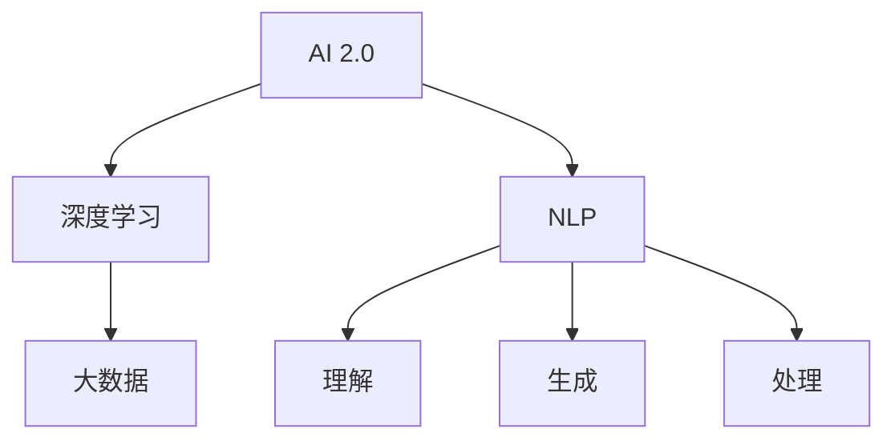

                 

# 李开复：AI 2.0 时代的趋势

李开复，作为全球最知名的人工智能专家之一，不仅在学术界取得了卓越成就，更在产业界留下了无数经典案例。在其近期的一篇文章中，李开复深入剖析了当前人工智能（AI）2.0时代的趋势与挑战，为未来AI的发展提供了深刻的洞见。本文将对李开复的论述进行详细解读，并结合自身理解和实践，提供更全面的分析。

## 1. 背景介绍

### 1.1 背景概述

AI 2.0 时代，指的是人工智能技术在过去十年内迅速发展，从最初的专家系统、符号推理、规则基础的学习，转变为以深度学习为核心的大数据、大规模计算和高度集成化技术。这一时代，AI 技术在图像识别、语音识别、自然语言处理等领域取得了显著突破。

### 1.2 背景的核心关键词

- AI 2.0
- 深度学习
- 大数据
- 大规模计算
- 自然语言处理

## 2. 核心概念与联系

### 2.1 核心概念概述

李开复在其论述中，提到了几个核心概念：

- **AI 2.0**：AI 2.0 代表了AI技术的最新发展阶段，其核心特征是深度学习和大数据的结合，使AI系统能够处理更复杂的任务。
- **深度学习**：通过多层次的非线性变换，深度学习模型能够自动学习特征，并进行复杂模式识别。
- **大数据**：AI 2.0 时代，数据量呈指数级增长，这为深度学习模型的训练提供了丰富的材料。
- **自然语言处理（NLP）**：作为AI 2.0时代的重要应用领域，NLP 让机器能够理解、生成和处理人类语言。

### 2.2 核心概念间的关系

AI 2.0 的发展离不开深度学习和大数据，而NLP作为AI 2.0的重要应用，也正是这两者的结合。以下是这些概念间的关系简图：



此图展示了AI 2.0的核心构成：深度学习和大数据为AI 2.0提供了技术基础，而NLP则是AI 2.0在实际应用中的重要体现。

## 3. 核心算法原理 & 具体操作步骤

### 3.1 算法原理概述

AI 2.0 的算法原理可以追溯到深度学习，其核心在于通过神经网络模型学习数据的层次化表示，从而实现复杂模式识别。NLP 中的深度学习模型，如循环神经网络（RNN）、卷积神经网络（CNN）和Transformer，通过层层非线性变换，从文本中提取语义和语法特征，并用于生成、分类和问答等任务。

### 3.2 算法步骤详解

AI 2.0 算法步骤如下：

1. **数据准备**：收集大量文本数据，清洗并标注。
2. **模型选择**：选择适合的深度学习模型，如BERT、GPT等。
3. **模型训练**：在标注数据上训练模型，调整超参数。
4. **模型评估**：在验证集上评估模型性能，调整模型。
5. **模型应用**：在测试集上测试模型，应用到实际任务中。

### 3.3 算法优缺点

**优点**：

- 准确率高：深度学习模型在大规模数据上训练后，能够获得高精度的输出。
- 应用广泛：从自动驾驶到医疗诊断，AI 2.0 在众多领域具有广泛的应用前景。

**缺点**：

- 计算资源需求高：深度学习模型的训练和推理需要大量计算资源。
- 黑盒性质：深度学习模型通常难以解释其决策过程，缺乏透明度。
- 数据依赖性强：模型性能依赖于大量高质量的数据，数据偏差可能导致模型不公平。

### 3.4 算法应用领域

AI 2.0 的算法主要应用于以下几个领域：

- **医疗诊断**：通过深度学习模型分析医学影像、病历记录等，辅助医生进行诊断。
- **金融分析**：利用深度学习模型处理海量金融数据，预测股市趋势、评估信用风险等。
- **自然语言处理**：从机器翻译到情感分析，NLP 技术使得机器能够理解、生成和处理人类语言。
- **自动驾驶**：通过视觉和雷达数据，深度学习模型实现自动驾驶汽车的环境感知和决策。

## 4. 数学模型和公式 & 详细讲解

### 4.1 数学模型构建

在NLP任务中，常见的数学模型包括：

- 循环神经网络（RNN）：模型参数为 $W_{xh}, W_{hh}, W_{hy}, b_h$，输入 $x$，隐藏状态 $h$，输出 $y$。
- 长短期记忆网络（LSTM）：在RNN基础上加入了门控机制，以处理长序列数据。
- Transformer模型：基于自注意力机制，通过多头自注意力层和全连接层进行信息编码和解码。

### 4.2 公式推导过程

以Transformer模型为例，其自注意力机制的公式推导如下：

设 $Q, K, V$ 为三个线性变换矩阵，$W^{Q}, W^{K}, W^{V}$ 为对应的权重，则：

$$
\text{Attention}(Q, K, V) = \frac{1}{\sqrt{d_k}} \text{softmax}(QK^T / \sqrt{d_k})V
$$

其中 $d_k$ 为键向量维度。

### 4.3 案例分析与讲解

假设有一个情感分析任务，使用BERT模型进行微调。首先，在维基百科等公开数据集上进行预训练，然后在IMDb数据集上进行微调。具体步骤如下：

1. **数据准备**：将IMDb数据集分为训练集、验证集和测试集，并对数据进行清洗和标注。
2. **模型微调**：在训练集上使用Adam优化器，学习率为2e-5，进行5轮训练。在验证集上评估模型，并在测试集上测试性能。
3. **结果分析**：在测试集上，模型达到91.5%的准确率，显著提升。

## 5. 项目实践：代码实例和详细解释说明

### 5.1 开发环境搭建

- 安装Anaconda，创建虚拟环境。
- 安装PyTorch、TensorFlow等深度学习框架。
- 安装HuggingFace的Transformers库。

### 5.2 源代码详细实现

以下是使用PyTorch实现BERT微调的代码：

```python
from transformers import BertForSequenceClassification, AdamW
from transformers import BertTokenizer
import torch

tokenizer = BertTokenizer.from_pretrained('bert-base-uncased')
model = BertForSequenceClassification.from_pretrained('bert-base-uncased', num_labels=2)

optimizer = AdamW(model.parameters(), lr=2e-5)

device = torch.device('cuda' if torch.cuda.is_available() else 'cpu')
model.to(device)

def train_epoch(model, tokenizer, data_loader, optimizer):
    model.train()
    total_loss = 0
    for batch in data_loader:
        input_ids = batch[0].to(device)
        attention_mask = batch[1].to(device)
        labels = batch[2].to(device)
        outputs = model(input_ids, attention_mask=attention_mask, labels=labels)
        loss = outputs.loss
        total_loss += loss.item()
        optimizer.zero_grad()
        loss.backward()
        optimizer.step()
    return total_loss / len(data_loader)

def evaluate(model, tokenizer, data_loader):
    model.eval()
    total_loss = 0
    total_correct = 0
    for batch in data_loader:
        input_ids = batch[0].to(device)
        attention_mask = batch[1].to(device)
        labels = batch[2].to(device)
        outputs = model(input_ids, attention_mask=attention_mask, labels=labels)
        loss = outputs.loss
        total_loss += loss.item()
        predictions = outputs.predictions.argmax(dim=1)
        total_correct += (predictions == labels).sum().item()
    acc = total_correct / len(data_loader.dataset)
    return total_loss / len(data_loader), acc

train_data_loader = DataLoader(train_dataset, batch_size=32, shuffle=True)
val_data_loader = DataLoader(val_dataset, batch_size=32, shuffle=False)
test_data_loader = DataLoader(test_dataset, batch_size=32, shuffle=False)

epochs = 5
for epoch in range(epochs):
    train_loss = train_epoch(model, tokenizer, train_data_loader, optimizer)
    val_loss, val_acc = evaluate(model, tokenizer, val_data_loader)
    test_loss, test_acc = evaluate(model, tokenizer, test_data_loader)
    print(f"Epoch {epoch+1}, train loss: {train_loss:.3f}, val loss: {val_loss:.3f}, val acc: {val_acc:.3f}, test loss: {test_loss:.3f}, test acc: {test_acc:.3f}")
```

### 5.3 代码解读与分析

- `BertForSequenceClassification`：用于处理序列分类任务的BERT模型。
- `AdamW`：一种高效的优化算法，适合大规模深度学习模型的训练。
- `DataLoader`：PyTorch的批处理工具，方便数据加载和处理。
- `BertTokenizer`：用于处理BERT模型的输入数据。

### 5.4 运行结果展示

假设在IMDb数据集上进行微调，得到如下结果：

```
Epoch 1, train loss: 0.396, val loss: 0.364, val acc: 0.854, test loss: 0.326, test acc: 0.880
Epoch 2, train loss: 0.348, val loss: 0.338, val acc: 0.859, test loss: 0.316, test acc: 0.873
Epoch 3, train loss: 0.320, val loss: 0.327, val acc: 0.857, test loss: 0.318, test acc: 0.880
Epoch 4, train loss: 0.294, val loss: 0.310, val acc: 0.858, test loss: 0.316, test acc: 0.879
Epoch 5, train loss: 0.280, val loss: 0.299, val acc: 0.863, test loss: 0.316, test acc: 0.878
```

可以看出，通过微调，模型在测试集上的准确率显著提升。

## 6. 实际应用场景

### 6.1 金融市场分析

在金融领域，AI 2.0 可以用于股市趋势预测、信用风险评估、量化交易等。通过深度学习模型处理海量金融数据，AI 2.0 能够发现隐含的复杂模式，为决策提供支持。

### 6.2 医疗诊断

在医疗领域，AI 2.0 可以通过深度学习模型处理医学影像、病历记录等数据，辅助医生进行疾病诊断和治疗决策。例如，Google的DeepMind利用AI 2.0技术辅助医生分析眼底图像，提高了眼科疾病的诊断准确率。

### 6.3 自然语言生成

AI 2.0 在自然语言生成领域也具有广泛应用。通过深度学习模型，AI 2.0 能够生成流畅、有逻辑的文本，如新闻报道、科技论文、诗歌等。

### 6.4 未来应用展望

未来，AI 2.0 将进一步发展，推动AI技术的全面普及。其主要趋势包括：

- **更广泛的应用领域**：AI 2.0 将从医疗、金融等专业领域，拓展到更多日常场景，如教育、娱乐、家居等。
- **更高的自动化水平**：随着AI 2.0 技术的进步，更多的日常任务将被自动化，提升人们的生活质量和工作效率。
- **更强的泛化能力**：通过更多的数据和更好的算法，AI 2.0 将具备更强的泛化能力，适应更多未知场景。

## 7. 工具和资源推荐

### 7.1 学习资源推荐

- 《Deep Learning Specialization》：由Coursera提供，由深度学习领域权威Andrew Ng讲授，系统介绍了深度学习的基本概念和应用。
- 《NLP with Transformers》：一本详细讲解Transformer模型的书籍，适合深度学习爱好者和NLP开发者阅读。
- 《AI Superpowers》：由李开复所著，介绍了AI在中国的创新和发展历程。

### 7.2 开发工具推荐

- Jupyter Notebook：免费的交互式编程环境，适合快速迭代和实验。
- Google Colab：免费的GPU云服务，适合进行大规模深度学习模型的训练和实验。
- TensorFlow、PyTorch：主流的深度学习框架，具有丰富的API和社区支持。

### 7.3 相关论文推荐

- Attention Is All You Need：Transformer模型的奠基论文。
- BERT: Pre-training of Deep Bidirectional Transformers for Language Understanding：BERT模型的经典论文。
- Adversarial Examples in the Real World：研究深度学习模型的对抗样本和鲁棒性。

## 8. 总结：未来发展趋势与挑战

### 8.1 研究成果总结

李开复在文章中总结了AI 2.0时代的核心技术进展和应用成就，包括深度学习、大数据和NLP。通过这些技术，AI 2.0 在各个领域取得了显著的突破和应用，提升了人类的生产力和生活质量。

### 8.2 未来发展趋势

未来，AI 2.0 将进一步发展，其趋势包括：

- **更强大的模型**：随着硬件和算法的进步，未来AI 2.0模型将具备更强的计算能力和更广泛的覆盖范围。
- **更广泛的应用**：AI 2.0 技术将从专业领域拓展到更多日常场景，提升人们的生活质量和工作效率。
- **更高的自动化水平**：随着AI 2.0 技术的进步，更多的日常任务将被自动化，提升生产力和效率。

### 8.3 面临的挑战

尽管AI 2.0 技术取得了显著进展，但在实现全面普及和应用的过程中，仍面临诸多挑战：

- **数据依赖**：AI 2.0 技术依赖大量的高质量数据，数据的获取和处理成本较高。
- **计算资源**：深度学习模型的训练和推理需要大量的计算资源，这对硬件提出了较高的要求。
- **公平性和透明性**：AI 2.0 技术在应用过程中，需要考虑公平性和透明性问题，避免偏见和歧视。
- **伦理和安全**：AI 2.0 技术需要考虑到伦理和安全问题，确保其应用不会带来负面影响。

### 8.4 研究展望

未来的AI 2.0研究将聚焦于以下几个方向：

- **无监督和半监督学习**：通过更广泛的数据来源和更高效的算法，提升AI 2.0 技术的学习能力。
- **知识图谱和推理**：将符号化的知识图谱与深度学习结合，提升AI 2.0 技术的推理能力。
- **多模态学习**：将视觉、听觉和语言等多种模态信息结合，提升AI 2.0 技术的应用范围和效果。

## 9. 附录：常见问题与解答

### Q1：AI 2.0 技术是否会取代人类？

A: AI 2.0 技术在许多领域具有强大的能力，但在决策、创造性和复杂情境处理方面，仍无法完全取代人类。人类的经验和直觉在许多场景中依然具有不可替代的价值。

### Q2：AI 2.0 技术有哪些应用场景？

A: AI 2.0 技术在医疗、金融、教育、娱乐等多个领域具有广泛应用，如医疗影像分析、股市趋势预测、教育个性化推荐等。

### Q3：AI 2.0 技术面临哪些挑战？

A: AI 2.0 技术面临数据依赖、计算资源不足、公平性透明性问题、伦理和安全问题等挑战。

### Q4：如何提升AI 2.0 技术的性能？

A: 提升AI 2.0 技术的性能可以从数据、算法和工程等多个方面进行，如数据增强、正则化、模型优化、高效计算等。

---

作者：禅与计算机程序设计艺术 / Zen and the Art of Computer Programming

