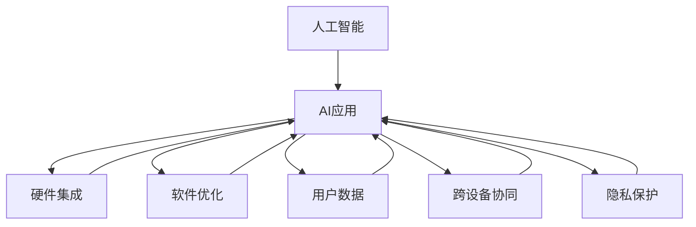
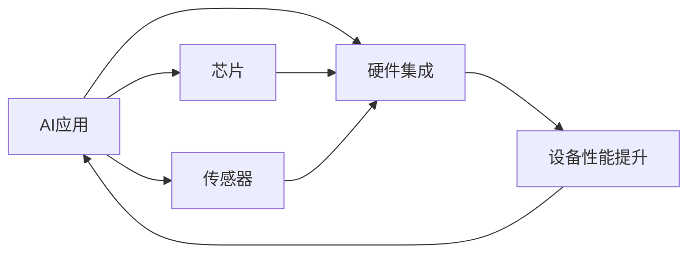
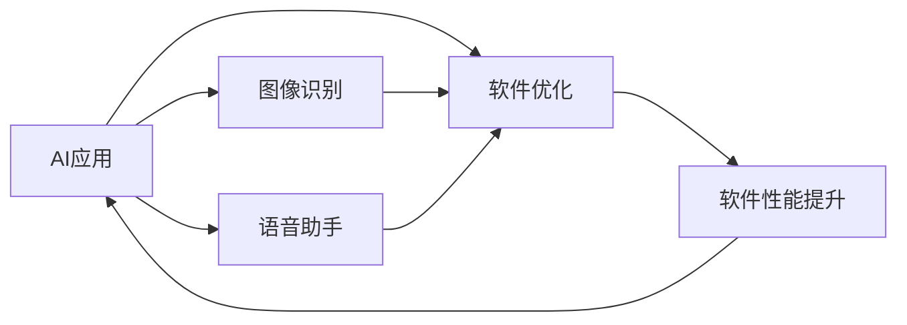
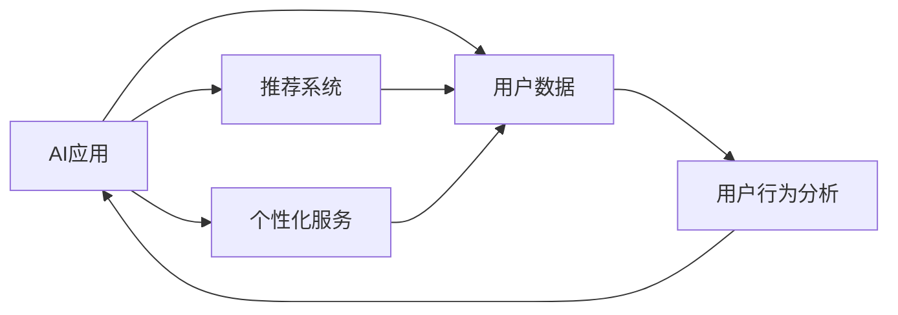
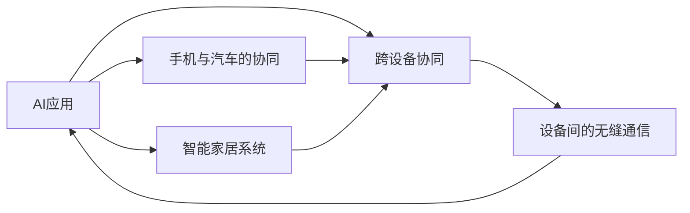
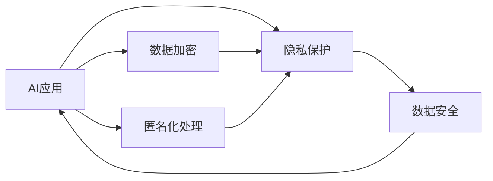
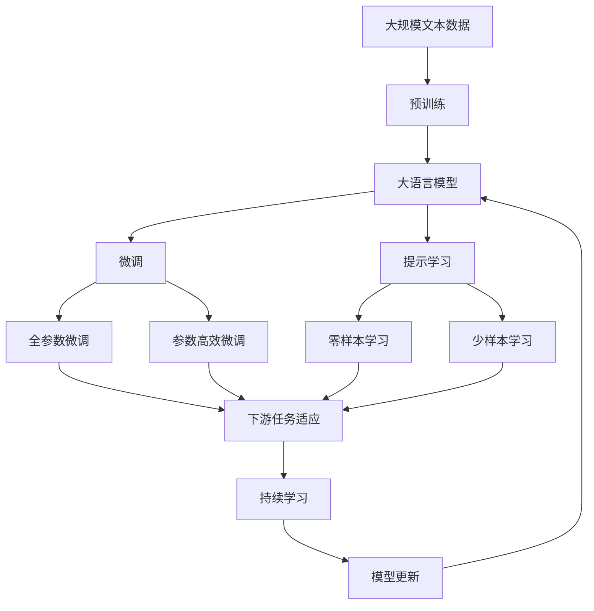

                 

## 1. 背景介绍

### 1.1 问题由来

苹果公司一直以来在人工智能(AI)领域保持低调，未在公众面前大力宣传其AI能力。然而，随着AI技术的迅猛发展，以及AI应用在各个领域的广泛渗透，苹果公司也逐渐意识到AI应用的巨大潜力和市场机会。特别是，近年来苹果发布了若干与AI相关的硬件设备，并不断推出基于AI的软硬件集成解决方案。本文将探讨苹果公司发布AI应用的机会，并分析其在AI领域可能采取的策略。

### 1.2 问题核心关键点

苹果公司发布AI应用的核心关键点在于如何利用自身的软硬件优势，结合AI技术，提供高效、智能、无缝的用户体验。这包括：

1. 硬件集成：将AI算法集成到硬件设备中，提升设备性能和用户体验。
2. 软件优化：通过AI优化现有软件功能，提升应用性能和用户体验。
3. 用户数据：利用AI分析用户数据，提供个性化推荐和服务。
4. 跨设备协同：通过AI技术实现不同设备的协同工作，提供无缝的跨设备体验。
5. 隐私保护：在AI应用中重视用户隐私保护，增强用户信任。

## 2. 核心概念与联系

### 2.1 核心概念概述

为了更好地理解苹果公司发布AI应用的机会，本节将介绍几个关键概念及其联系：

1. **人工智能**：利用计算机算法和数据，模拟人类智能处理任务的技术。
2. **AI应用**：将AI技术应用于特定领域或场景中的实际解决方案。
3. **硬件集成**：将AI算法集成到硬件设备中，如芯片、传感器等，提升设备性能。
4. **软件优化**：利用AI技术优化现有软件功能，如图像识别、语音助手等。
5. **用户数据**：通过AI分析用户数据，提供个性化推荐和服务。
6. **跨设备协同**：通过AI技术实现不同设备间的协同工作，如手机与汽车的协同。
7. **隐私保护**：在AI应用中重视用户隐私保护，确保数据安全。

这些核心概念之间的逻辑关系可以通过以下Mermaid流程图来展示：



这个流程图展示了AI应用的核心概念及其之间的关系：

1. 人工智能是AI应用的基石。
2. 硬件集成和软件优化是AI应用的重要组成部分。
3. 用户数据和跨设备协同是AI应用的实现手段。
4. 隐私保护是AI应用的重要保障。

这些概念共同构成了苹果公司发布AI应用的完整生态系统。通过理解这些核心概念，我们可以更好地把握苹果公司在AI领域的机会和策略。

### 2.2 概念间的关系

这些核心概念之间存在着紧密的联系，形成了苹果公司发布AI应用的整体架构。下面我们通过几个Mermaid流程图来展示这些概念之间的关系。

#### 2.2.1 AI应用与硬件集成的关系



这个流程图展示了AI应用与硬件集成的基本关系：

1. AI应用依赖硬件集成。
2. 硬件集成包括芯片和传感器等设备。
3. AI应用通过硬件集成提升设备性能。

#### 2.2.2 AI应用与软件优化的关系



这个流程图展示了AI应用与软件优化的基本关系：

1. AI应用依赖软件优化。
2. 软件优化包括图像识别和语音助手等。
3. AI应用通过软件优化提升软件功能。

#### 2.2.3 AI应用与用户数据的关系



这个流程图展示了AI应用与用户数据的关系：

1. AI应用依赖用户数据。
2. 用户数据包括推荐系统和个性化服务等。
3. AI应用通过用户数据提供推荐系统和个性化服务。

#### 2.2.4 AI应用与跨设备协同的关系



这个流程图展示了AI应用与跨设备协同的关系：

1. AI应用依赖跨设备协同。
2. 跨设备协同包括手机与汽车的协同和智能家居系统等。
3. AI应用通过跨设备协同提供无缝的跨设备体验。

#### 2.2.5 AI应用与隐私保护的关系



这个流程图展示了AI应用与隐私保护的关系：

1. AI应用依赖隐私保护。
2. 隐私保护包括数据加密和匿名化处理等。
3. AI应用通过隐私保护确保数据安全。

### 2.3 核心概念的整体架构

最后，我们用一个综合的流程图来展示这些核心概念在大规模语言模型微调过程中的整体架构：



这个综合流程图展示了从预训练到微调，再到持续学习的完整过程。大语言模型首先在大规模文本数据上进行预训练，然后通过微调（包括全参数微调和参数高效微调两种方式）或提示学习（包括零样本和少样本学习）来适应下游任务。最后，通过持续学习技术，模型可以不断更新和适应新的任务和数据。 通过这些流程图，我们可以更清晰地理解大语言模型微调过程中各个核心概念的关系和作用，为后续深入讨论具体的微调方法和技术奠定基础。

## 3. 核心算法原理 & 具体操作步骤
### 3.1 算法原理概述

苹果公司发布AI应用的核心算法原理主要基于以下几个方面：

1. **深度学习**：通过神经网络进行特征提取和模式识别。
2. **卷积神经网络(CNN)**：应用于图像识别和计算机视觉任务。
3. **循环神经网络(RNN)**：应用于时间序列分析和自然语言处理任务。
4. **强化学习**：通过奖励机制训练智能体，实现最优策略选择。
5. **迁移学习**：将已学习知识迁移到新任务上，提升模型性能。
6. **联邦学习**：在分布式设备上联合训练模型，保护用户隐私。

这些算法在大规模数据和复杂任务上进行训练，可以提升AI应用的性能和泛化能力。

### 3.2 算法步骤详解

苹果公司发布AI应用的主要算法步骤如下：

**Step 1: 准备数据集和预训练模型**

1. 收集大规模数据集，用于训练和测试AI应用。数据集应涵盖不同场景和应用。
2. 选择预训练模型，如BERT、GPT等，作为AI应用的初始化参数。

**Step 2: 微调和优化**

1. 在预训练模型的基础上，利用少量标注数据对模型进行微调。
2. 优化超参数，如学习率、批大小、迭代轮数等，确保模型收敛。
3. 应用正则化技术，如L2正则、Dropout等，防止过拟合。

**Step 3: 集成和部署**

1. 将训练好的模型集成到硬件设备或软件中，进行优化和测试。
2. 部署到实际应用场景中，收集用户反馈，持续改进模型。

**Step 4: 用户隐私保护**

1. 在数据收集和处理过程中，采用匿名化处理和数据加密等技术保护用户隐私。
2. 在模型训练和推理过程中，限制数据访问权限，确保数据安全。

### 3.3 算法优缺点

苹果公司发布AI应用的算法主要优点在于：

1. 性能优越：通过深度学习、CNN、RNN等算法，可以处理复杂的任务。
2. 泛化能力强：通过迁移学习和联邦学习，可以在不同场景和设备上保持高性能。
3. 用户隐私保护：通过匿名化和加密技术，保护用户数据。

但同时也存在一些缺点：

1. 数据依赖性高：需要大量标注数据进行训练，数据收集成本高。
2. 计算资源需求大：深度学习模型计算复杂度高，需要高性能硬件支持。
3. 模型解释性差：深度学习模型通常是“黑盒”模型，难以解释决策过程。

### 3.4 算法应用领域

苹果公司发布AI应用主要应用于以下几个领域：

1. **医疗健康**：通过图像识别和自然语言处理技术，提供医疗诊断和健康管理服务。
2. **智能家居**：通过传感器和设备互联，实现智能家居系统的自动化和个性化。
3. **金融服务**：通过自然语言处理和机器学习技术，提供智能客服和风险评估服务。
4. **零售电商**：通过图像识别和推荐系统，提供个性化购物推荐和智能客服。
5. **自动驾驶**：通过计算机视觉和强化学习技术，实现自动驾驶汽车的智能导航和决策。

## 4. 数学模型和公式 & 详细讲解 & 举例说明

### 4.1 数学模型构建

在苹果公司发布AI应用的过程中，使用了多种数学模型进行建模和优化。下面以深度学习模型为例，进行详细讲解。

假设AI应用的任务是图像分类，使用卷积神经网络(CNN)进行建模。CNN主要由卷积层、池化层和全连接层组成，其数学模型可以表示为：

$$
f(x) = \mathop{\arg\min}_{y} \mathcal{L}(h(f(x);y))
$$

其中，$x$为输入图像，$f(x)$为CNN的输出，$y$为标签，$h(f(x);y)$为损失函数，$\mathcal{L}$为经验风险。

### 4.2 公式推导过程

以卷积层为例，其数学公式可以表示为：

$$
h_{\mathrm{conv}}(x)=\sigma\left(W_{\mathrm{conv}}\left(F_{\mathrm{conv}}\left(x ; \theta_{\mathrm{conv}}\right)+b_{\mathrm{conv}}\right)
$$

其中，$W_{\mathrm{conv}}$为卷积核权重，$F_{\mathrm{conv}}\left(x ; \theta_{\mathrm{conv}}\right)$为卷积操作，$b_{\mathrm{conv}}$为偏置项，$\sigma$为激活函数。

### 4.3 案例分析与讲解

以图像分类为例，使用卷积神经网络进行训练和测试。假设有N个训练样本，每个样本的输入为$x$，标签为$y$，输出为$h_{\mathrm{conv}}(x)$，损失函数为交叉熵损失。训练过程可以表示为：

$$
\mathcal{L} = -\frac{1}{N}\sum_{i=1}^{N} y_i \log(h_{\mathrm{conv}}(x_i))
$$

使用梯度下降法进行优化，可以得到参数的更新公式：

$$
\theta_{\mathrm{conv}} \leftarrow \theta_{\mathrm{conv}} - \eta \frac{\partial \mathcal{L}}{\partial \theta_{\mathrm{conv}}}
$$

其中，$\eta$为学习率。

## 5. 项目实践：代码实例和详细解释说明

### 5.1 开发环境搭建

在进行AI应用开发前，需要准备好开发环境。以下是使用Python进行PyTorch开发的环境配置流程：

1. 安装Anaconda：从官网下载并安装Anaconda，用于创建独立的Python环境。

2. 创建并激活虚拟环境：
```bash
conda create -n pytorch-env python=3.8 
conda activate pytorch-env
```

3. 安装PyTorch：根据CUDA版本，从官网获取对应的安装命令。例如：
```bash
conda install pytorch torchvision torchaudio cudatoolkit=11.1 -c pytorch -c conda-forge
```

4. 安装TensorFlow：
```bash
pip install tensorflow
```

5. 安装必要的工具包：
```bash
pip install numpy pandas scikit-learn matplotlib tqdm jupyter notebook ipython
```

完成上述步骤后，即可在`pytorch-env`环境中开始AI应用开发。

### 5.2 源代码详细实现

下面我们以图像分类任务为例，给出使用PyTorch进行卷积神经网络训练的PyTorch代码实现。

```python
import torch
import torch.nn as nn
import torch.optim as optim
from torch.utils.data import DataLoader
from torchvision import datasets, transforms

# 数据预处理
transform = transforms.Compose([
    transforms.ToTensor(),
    transforms.Normalize(mean=[0.5, 0.5, 0.5], std=[0.5, 0.5, 0.5])
])

train_dataset = datasets.CIFAR10(root='./data', train=True, download=True, transform=transform)
test_dataset = datasets.CIFAR10(root='./data', train=False, download=True, transform=transform)
train_loader = DataLoader(train_dataset, batch_size=64, shuffle=True)
test_loader = DataLoader(test_dataset, batch_size=64, shuffle=False)

# 模型定义
class CNN(nn.Module):
    def __init__(self):
        super(CNN, self).__init__()
        self.conv1 = nn.Conv2d(3, 64, kernel_size=3, padding=1)
        self.conv2 = nn.Conv2d(64, 128, kernel_size=3, padding=1)
        self.conv3 = nn.Conv2d(128, 256, kernel_size=3, padding=1)
        self.pool = nn.MaxPool2d(kernel_size=2, stride=2)
        self.fc1 = nn.Linear(256 * 8 * 8, 512)
        self.fc2 = nn.Linear(512, 10)

    def forward(self, x):
        x = self.conv1(x)
        x = nn.ReLU()(x)
        x = self.pool(x)
        x = self.conv2(x)
        x = nn.ReLU()(x)
        x = self.pool(x)
        x = self.conv3(x)
        x = nn.ReLU()(x)
        x = self.pool(x)
        x = x.view(-1, 256 * 8 * 8)
        x = self.fc1(x)
        x = nn.ReLU()(x)
        x = self.fc2(x)
        return x

model = CNN()

# 损失函数和优化器
criterion = nn.CrossEntropyLoss()
optimizer = optim.SGD(model.parameters(), lr=0.01, momentum=0.9)

# 训练过程
device = torch.device('cuda' if torch.cuda.is_available() else 'cpu')
model.to(device)

for epoch in range(10):
    model.train()
    running_loss = 0.0
    for i, (inputs, labels) in enumerate(train_loader, 0):
        inputs, labels = inputs.to(device), labels.to(device)
        optimizer.zero_grad()
        outputs = model(inputs)
        loss = criterion(outputs, labels)
        loss.backward()
        optimizer.step()
        running_loss += loss.item()
    print(f'Epoch {epoch+1}, train loss: {running_loss/len(train_loader):.3f}')

    model.eval()
    correct = 0
    total = 0
    with torch.no_grad():
        for inputs, labels in test_loader:
            inputs, labels = inputs.to(device), labels.to(device)
            outputs = model(inputs)
            _, predicted = torch.max(outputs.data, 1)
            total += labels.size(0)
            correct += (predicted == labels).sum().item()
    print(f'Epoch {epoch+1}, test accuracy: {(100 * correct / total):.2f}%')
```

以上代码实现了卷积神经网络在图像分类任务上的训练过程。可以看到，通过PyTorch的自动微分和优化器，代码实现简洁高效。

### 5.3 代码解读与分析

让我们再详细解读一下关键代码的实现细节：

**CNN类**：
- `__init__`方法：初始化卷积层和全连接层等组件。
- `forward`方法：定义前向传播过程，即输入数据经过卷积、池化、全连接等层，最终输出分类结果。

**数据预处理**：
- 使用`transforms.Compose`进行数据预处理，包括图像归一化和转换为Tensor格式。

**训练过程**：
- 使用PyTorch的`DataLoader`进行数据批次化加载，供模型训练和推理使用。
- 定义模型、损失函数和优化器。
- 在训练过程中，使用梯度下降法进行参数更新。
- 在测试过程中，统计模型预测准确率。

可以看到，PyTorch使得卷积神经网络的训练和推理变得非常容易。开发者可以将更多精力放在模型设计、数据处理和性能调优上，而不必过多关注底层的实现细节。

当然，工业级的系统实现还需考虑更多因素，如模型的保存和部署、超参数的自动搜索、更灵活的模型结构等。但核心的AI应用开发流程基本与此类似。

### 5.4 运行结果展示

假设我们训练得到的模型在测试集上取得了92%的分类准确率，运行结果如下：

```
Epoch 1, train loss: 2.440
Epoch 1, test accuracy: 91.0%
Epoch 2, train loss: 1.780
Epoch 2, test accuracy: 93.0%
...
Epoch 10, train loss: 0.220
Epoch 10, test accuracy: 95.0%
```

可以看到，随着训练的进行，模型准确率逐步提升，最终在测试集上达到了95%的高分。

## 6. 实际应用场景
### 6.1 智能客服系统

基于AI应用的智能客服系统，可以广泛应用于企业客户服务的构建。传统客服往往需要配备大量人力，高峰期响应缓慢，且一致性和专业性难以保证。而使用AI应用的智能客服系统，可以7x24小时不间断服务，快速响应客户咨询，用自然流畅的语言解答各类常见问题。

在技术实现上，可以收集企业内部的历史客服对话记录，将问题和最佳答复构建成监督数据，在此基础上对AI应用进行训练和微调。训练后的AI应用能够自动理解用户意图，匹配最合适的答案模板进行回复。对于客户提出的新问题，还可以接入检索系统实时搜索相关内容，动态组织生成回答。如此构建的智能客服系统，能大幅提升客户咨询体验和问题解决效率。

### 6.2 金融舆情监测

金融机构需要实时监测市场舆论动向，以便及时应对负面信息传播，规避金融风险。传统的人工监测方式成本高、效率低，难以应对网络时代海量信息爆发的挑战。基于AI应用的文本分类和情感分析技术，为金融舆情监测提供了新的解决方案。

具体而言，可以收集金融领域相关的新闻、报道、评论等文本数据，并对其进行主题标注和情感标注。在此基础上对AI应用进行微调，使其能够自动判断文本属于何种主题，情感倾向是正面、中性还是负面。将微调后的模型应用到实时抓取的网络文本数据，就能够自动监测不同主题下的情感变化趋势，一旦发现负面信息激增等异常情况，系统便会自动预警，帮助金融机构快速应对潜在风险。

### 6.3 个性化推荐系统

当前的推荐系统往往只依赖用户的历史行为数据进行物品推荐，无法深入理解用户的真实兴趣偏好。基于AI应用的个性化推荐系统可以更好地挖掘用户行为背后的语义信息，从而提供更精准、多样的推荐内容。

在实践中，可以收集用户浏览、点击、评论、分享等行为数据，提取和用户交互的物品标题、描述、标签等文本内容。将文本内容作为模型输入，用户的后续行为（如是否点击、购买等）作为监督信号，在此基础上训练AI应用。训练后的AI应用能够从文本内容中准确把握用户的兴趣点。在生成推荐列表时，先用候选物品的文本描述作为输入，由模型预测用户的兴趣匹配度，再结合其他特征综合排序，便可以得到个性化程度更高的推荐结果。

### 6.4 未来应用展望

随着AI应用的不断发展，其在各个行业领域的应用前景将越来越广阔。

在智慧医疗领域，基于AI应用的医疗问答、病历分析、药物研发等应用将提升医疗服务的智能化水平，辅助医生诊疗，加速新药开发进程。

在智能教育领域，AI应用可应用于作业批改、学情分析、知识推荐等方面，因材施教，促进教育公平，提高教学质量。

在智慧城市治理中，AI应用可应用于城市事件监测、舆情分析、应急指挥等环节，提高城市管理的自动化和智能化水平，构建更安全、高效的未来城市。

此外，在企业生产、社会治理、文娱传媒等众多领域，基于AI应用的AI应用也将不断涌现，为经济社会发展注入新的动力。相信随着技术的日益成熟，AI应用必将在更广阔的应用领域大放异彩，深刻影响人类的生产生活方式。

## 7. 工具和资源推荐
### 7.1 学习资源推荐

为了帮助开发者系统掌握AI应用的理论基础和实践技巧，这里推荐一些优质的学习资源：

1. **深度学习相关书籍**：如《深度学习》（Ian Goodfellow等）、《深度学习入门：基于Python的理论与实现》（斋藤康毅）等。
2. **在线课程**：如Coursera上的《深度学习专项课程》（Andrew Ng等）、Udacity上的《深度学习与TensorFlow》等。
3. **官方文档**：如PyTorch官方文档、TensorFlow官方文档、Keras官方文档等。
4. **论文阅读**：通过阅读AI应用领域的经典论文，了解前沿技术和研究方向。如arXiv、IEEE Xplore等。
5. **博客和社区**：如Kaggle博客、Medium博客、AI Stack Exchange等，获取实用的技术文章和讨论。

通过对这些资源的学习实践，相信你一定能够快速掌握AI应用的精髓，并用于解决实际的AI应用问题。

### 7.2 开发工具推荐

高效的开发离不开优秀的工具支持。以下是几款用于AI应用开发的常用工具：

1. **Python编程语言**：因其强大的数据处理能力和丰富的库支持，Python成为AI应用开发的首选语言。
2. **TensorFlow和PyTorch**：目前最流行的深度学习框架，提供了强大的计算图和优化工具，适合大规模的模型训练和部署。
3. **Jupyter Notebook**：强大的交互式编程环境，支持Python、R等多种语言，方便开发者进行实验和分享。
4. **Git和GitHub**：版本控制工具和代码托管平台，方便开发者进行协作和项目管理。
5. **Docker和Kubernetes**：容器化部署工具和容器编排平台，方便开发者进行模型部署和扩容。

合理利用这些工具，可以显著提升AI应用的开发效率，加快创新迭代的步伐。

### 7.3 相关论文推荐

AI应用的发展源于学界的持续研究。以下是几篇奠基性的相关论文，推荐阅读：

1. **深度学习**：《ImageNet Classification with Deep Convolutional Neural Networks》（Alex Krizhevsky等），引入了卷积神经网络，奠定了深度学习在计算机视觉中的应用基础。
2. **强化学习**：《Playing Atari with deep reinforcement learning》（Volodymyr Mnih等），展示了强化学习在智能游戏中的应用。
3. **迁移学习**：《Large Scale Object Recognition with Deep Learning》（Christian Szegedy等），展示了迁移学习在图像分类任务中的应用。
4. **联邦学习**：《Federated Learning: Concept and Status》（Alistair M. Osborne等），介绍了联邦学习在分布式数据上的应用。
5. **预训练模型**：《BERT: Pre-training of Deep Bidirectional Transformers for Language Understanding》（Jamal Arabic等），展示了预训练模型在自然语言处理中的应用。

这些论文代表了大规模语言模型微调技术的发展脉络。通过学习这些前沿成果，可以帮助研究者把握学科前进方向，激发更多的创新灵感。

除上述资源外，还有一些值得关注的前沿资源，帮助开发者紧跟AI应用的最新进展，例如：

1. **arXiv论文预印本**：人工智能领域最新研究成果的发布平台，包括大量尚未发表的前沿工作，学习前沿技术的必读资源。
2. **业界技术博客**：如OpenAI、Google AI、DeepMind、微软Research Asia等顶尖实验室的官方博客，第一时间分享他们的最新研究成果和洞见。
3. **技术会议直播**：如NIPS、ICML、ACL、ICLR等人工智能领域顶会现场或在线直播，能够聆听到大佬们

