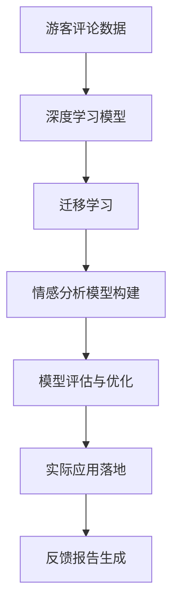

                 

# 基于NLP的某旅游景点游客评论分析

## 1. 背景介绍

### 1.1 问题由来

随着数字技术的发展，许多旅游景点纷纷建立了官方网站和移动应用，鼓励游客在平台上分享自己的旅行体验和评价。这些数据不仅为旅游公司提供了宝贵的市场反馈，还为学界和业界提供了大量有价值的自然语言数据资源，为基于自然语言处理(NLP)的情感分析、文本分类等研究提供了新的应用场景。

本项目聚焦于某知名旅游景点的游客评论数据，利用NLP技术对评论进行情感分析，帮助旅游公司及时了解游客的反馈和需求，优化服务，提升游客满意度。通过情感分析，旅游公司可以更好地识别游客投诉、建议和赞美，为制定下一步的营销策略和改进措施提供依据。

### 1.2 问题核心关键点

本项目涉及的核心问题包括：

- **数据收集与预处理**：从官方平台和第三方数据源获取游客评论数据，并进行清洗和标准化处理。
- **情感分析模型构建**：设计并训练一个高效的情感分析模型，能够准确地判断评论的情感极性（正面、中性、负面）。
- **模型评估与优化**：使用精确度、召回率和F1分数等指标对模型进行评估，并根据评估结果进行调优。
- **实际应用落地**：将训练好的模型集成到旅游公司现有系统中，实现对游客评论的实时情感分析，并生成相应的反馈报告。

## 2. 核心概念与联系

### 2.1 核心概念概述

- **自然语言处理(NLP)**：涉及文本处理、语言模型、信息检索和机器翻译等领域的交叉学科，旨在实现人机之间的自然语言交互。
- **情感分析(Sentiment Analysis)**：通过文本分析技术，识别文本中的情感极性（正面、中性、负面），并量化情感强度。
- **深度学习模型**：包括卷积神经网络(CNN)、循环神经网络(RNN)、Transformer等架构，能够从大量数据中学习到复杂的语言表示。
- **迁移学习(Transfer Learning)**：将在大规模数据上训练好的模型（如BERT、GPT等）应用到小规模任务上的技术。

### 2.2 概念间的关系

这些核心概念之间的逻辑关系可以通过以下Mermaid流程图来展示：

```mermaid
graph TB
    A[自然语言处理(NLP)] --> B[情感分析(Sentiment Analysis)]
    B --> C[深度学习模型]
    A --> D[数据收集与预处理]
    D --> E[迁移学习]
    E --> F[情感分析模型构建]
    E --> G[模型评估与优化]
    F --> H[实际应用落地]
```

这个流程图展示了大语言模型微调过程中各个核心概念之间的关系：

1. 通过数据收集与预处理获取游客评论数据。
2. 应用迁移学习将预训练模型应用于情感分析任务，构建情感分析模型。
3. 通过模型评估与优化提高模型效果。
4. 将训练好的情感分析模型集成到实际应用系统中，实现情感分析功能。

### 2.3 核心概念的整体架构

最后，我们用一个综合的流程图来展示这些核心概念在大语言模型微调过程中的整体架构：



这个综合流程图展示了从数据收集到实际应用落地的完整过程。通过情感分析模型，旅游公司可以更好地理解游客的反馈和需求，进而优化服务，提升游客满意度。

## 3. 核心算法原理 & 具体操作步骤

### 3.1 算法原理概述

情感分析的核心目标是通过对文本的情感极性进行分类，判断评论的情感倾向。本项目采用基于深度学习的方法，通过神经网络模型来学习文本特征，并使用分类算法（如SVM、逻辑回归、卷积神经网络等）来对情感极性进行预测。

具体而言，情感分析过程分为以下几个步骤：

1. **数据预处理**：包括文本清洗、分词、去除停用词等预处理操作。
2. **特征提取**：将文本转换为模型可用的特征向量，如词袋模型、TF-IDF、Word2Vec、GloVe等。
3. **模型训练**：在标注数据上训练情感分类模型，使用交叉验证等技术避免过拟合。
4. **模型评估**：在测试数据上评估模型性能，使用精确度、召回率和F1分数等指标。
5. **模型应用**：将训练好的模型应用于实时评论数据的情感分析，输出情感极性预测结果。

### 3.2 算法步骤详解

以下是情感分析的详细步骤：

**Step 1: 数据收集与预处理**

1. **数据来源**：从官方平台和第三方数据源（如TripAdvisor、Booking.com等）获取游客评论数据。
2. **文本清洗**：去除特殊字符、标点符号、数字等非文本信息，同时去除空行和空文本。
3. **分词**：将清洗后的文本进行分词处理，得到词序列。
4. **去除停用词**：去除常见的停用词（如“的”、“是”、“在”等），以减少噪声。

**Step 2: 特征提取**

1. **词袋模型**：将每个词视为一个特征，统计每个词在文本中的出现次数。
2. **TF-IDF**：计算每个词的词频-逆文档频率，以衡量其在文本中的重要性。
3. **Word2Vec/GloVe**：将每个词映射为向量表示，可以使用预训练的词向量或自己训练。

**Step 3: 模型训练**

1. **选择模型**：选择适合情感分析的深度学习模型，如卷积神经网络(CNN)、循环神经网络(RNN)、Transformer等。
2. **定义损失函数**：使用交叉熵损失函数，衡量模型预测结果与真实标签之间的差异。
3. **训练流程**：在标注数据上使用随机梯度下降算法训练模型，并在验证集上进行调优。

**Step 4: 模型评估**

1. **划分数据集**：将数据集划分为训练集、验证集和测试集。
2. **评估指标**：使用精确度、召回率和F1分数等指标评估模型性能。
3. **超参数调优**：根据评估结果调整模型超参数，如学习率、批大小、迭代轮数等。

**Step 5: 模型应用**

1. **集成模型**：将训练好的模型集成到旅游公司现有系统中。
2. **实时处理**：对新的评论数据进行实时情感分析，输出情感极性预测结果。
3. **反馈报告**：根据情感分析结果生成反馈报告，帮助旅游公司及时了解游客需求和反馈。

### 3.3 算法优缺点

情感分析的优点包括：

1. **自动化**：通过深度学习模型实现自动化的情感分析，节省人力成本。
2. **高准确性**：使用预训练语言模型进行迁移学习，能够提高情感分析的准确性。
3. **实时性**：通过集成到现有系统中，实现对新评论的实时情感分析。

情感分析的缺点包括：

1. **依赖标注数据**：模型训练需要大量标注数据，获取成本较高。
2. **模型泛化能力有限**：如果训练数据和实际应用数据分布差异较大，模型泛化能力可能受限。
3. **上下文理解不足**：基于词向量的模型难以捕捉文本中的复杂上下文信息。

### 3.4 算法应用领域

情感分析在多个领域都有广泛应用，如：

- **电子商务**：分析用户对产品和服务的评价，优化营销策略。
- **社交媒体**：监控公众对品牌和产品的情感倾向，及时调整策略。
- **医疗健康**：分析患者对医疗服务的反馈，改进医疗质量。
- **旅游行业**：通过游客评论分析，提升服务质量，优化用户体验。
- **舆情监测**：对网络舆情进行情感分析，及时掌握社会动态。

## 4. 数学模型和公式 & 详细讲解 & 举例说明

### 4.1 数学模型构建

假设情感分析的任务是将文本分为三类：正面、中性和负面。设文本序列为 $X=\{x_1,x_2,...,x_n\}$，其中 $x_i$ 表示文本中的第 $i$ 个词。设 $y$ 表示文本的情感极性，$y \in \{1,0,-1\}$，其中 $1$ 表示正面，$-1$ 表示负面，$0$ 表示中性。

模型的目标是最小化预测结果与真实标签之间的交叉熵损失函数：

$$
\mathcal{L}(y,\hat{y}) = -y \log \hat{y} - (1-y) \log(1-\hat{y})
$$

其中 $\hat{y}$ 表示模型对文本情感极性的预测概率。

### 4.2 公式推导过程

假设使用卷积神经网络进行情感分析，模型结构如下：

1. **输入层**：将文本转换为词向量表示，得到特征矩阵 $W=\{w_1,w_2,...,w_n\}$。
2. **卷积层**：对特征矩阵进行卷积操作，得到卷积特征 $C=\{c_1,c_2,...,c_m\}$，其中 $m$ 为卷积核数量。
3. **池化层**：对卷积特征进行池化操作，得到池化特征 $P=\{p_1,p_2,...,p_k\}$，其中 $k$ 为池化核数量。
4. **全连接层**：将池化特征映射为情感极性概率 $O=\{o_1,o_2,...,o_3\}$。
5. **输出层**：使用softmax函数将概率 $O$ 转换为情感极性概率分布 $\hat{Y}=\{\hat{y}_1,\hat{y}_2,\hat{y}_3\}$。

模型训练过程如下：

1. **损失函数**：使用交叉熵损失函数 $\mathcal{L}(y,\hat{y})$ 衡量预测结果与真实标签之间的差异。
2. **优化算法**：使用随机梯度下降算法（SGD）或Adam等优化算法更新模型参数。
3. **迭代训练**：在训练集上迭代训练，每次更新模型参数。

训练过程的数学公式如下：

$$
\theta \leftarrow \theta - \eta \nabla_{\theta}\mathcal{L}(y,\hat{y}) - \eta\lambda\theta
$$

其中 $\theta$ 表示模型参数，$\eta$ 表示学习率，$\lambda$ 表示正则化系数，$\nabla_{\theta}\mathcal{L}(y,\hat{y})$ 表示损失函数对参数 $\theta$ 的梯度。

### 4.3 案例分析与讲解

以某旅游景点游客评论数据为例，分析情感分析模型的训练过程：

1. **数据准备**：从官方平台和第三方数据源获取评论数据，进行文本清洗和分词处理。
2. **特征提取**：使用Word2Vec模型将每个词转换为向量表示。
3. **模型训练**：选择卷积神经网络模型，在标注数据上训练情感分类模型，使用交叉验证技术调整超参数。
4. **模型评估**：在测试数据上评估模型性能，使用精确度、召回率和F1分数等指标。
5. **模型应用**：将训练好的模型集成到旅游公司现有系统中，实现对新评论的实时情感分析。

## 5. 项目实践：代码实例和详细解释说明

### 5.1 开发环境搭建

在进行情感分析项目开发前，需要准备好开发环境。以下是使用Python进行TensorFlow开发的环境配置流程：

1. 安装Anaconda：从官网下载并安装Anaconda，用于创建独立的Python环境。

2. 创建并激活虚拟环境：
```bash
conda create -n tensorflow-env python=3.8 
conda activate tensorflow-env
```

3. 安装TensorFlow：根据CUDA版本，从官网获取对应的安装命令。例如：
```bash
conda install tensorflow tensorflow-gpu -c conda-forge
```

4. 安装各类工具包：
```bash
pip install numpy pandas scikit-learn matplotlib tqdm jupyter notebook ipython
```

完成上述步骤后，即可在`tensorflow-env`环境中开始情感分析项目的开发。

### 5.2 源代码详细实现

下面我们以卷积神经网络(CNN)模型为例，给出使用TensorFlow进行情感分析的代码实现。

首先，定义数据处理函数：

```python
import tensorflow as tf
import numpy as np
from tensorflow.keras.preprocessing.text import Tokenizer
from tensorflow.keras.preprocessing.sequence import pad_sequences
from tensorflow.keras.utils import to_categorical

def preprocess_data(texts, labels, tokenizer, max_len):
    tokenizer.fit_on_texts(texts)
    sequences = tokenizer.texts_to_sequences(texts)
    padded_sequences = pad_sequences(sequences, maxlen=max_len, padding='post', truncating='post')
    labels = to_categorical(labels)
    return padded_sequences, labels
```

然后，定义卷积神经网络模型：

```python
from tensorflow.keras.models import Sequential
from tensorflow.keras.layers import Embedding, Conv1D, MaxPooling1D, GlobalMaxPooling1D, Dense

model = Sequential()
model.add(Embedding(input_dim=vocab_size, output_dim=embedding_dim, input_length=max_len))
model.add(Conv1D(128, 3, activation='relu'))
model.add(MaxPooling1D(2))
model.add(Conv1D(128, 3, activation='relu'))
model.add(MaxPooling1D(2))
model.add(Conv1D(128, 3, activation='relu'))
model.add(GlobalMaxPooling1D())
model.add(Dense(3, activation='softmax'))

model.compile(loss='categorical_crossentropy', optimizer='adam', metrics=['accuracy'])
```

接着，定义训练和评估函数：

```python
def train_epoch(model, data, batch_size, optimizer):
    data.trainable = False
    for batch in tf.data.Dataset.from_tensor_slices(data).shuffle(buffer_size=10000).batch(batch_size):
        input_ids, labels = batch
        with tf.GradientTape() as tape:
            predictions = model(input_ids)
            loss = tf.reduce_mean(tf.keras.losses.categorical_crossentropy(labels, predictions))
        gradients = tape.gradient(loss, model.trainable_variables)
        optimizer.apply_gradients(zip(gradients, model.trainable_variables))

def evaluate_model(model, test_data, batch_size):
    test_data.trainable = False
    predictions = []
    labels = []
    for batch in tf.data.Dataset.from_tensor_slices(test_data).shuffle(buffer_size=10000).batch(batch_size):
        input_ids, labels = batch
        predictions.append(model(input_ids))
    predictions = np.concatenate(predictions, axis=0)
    labels = np.concatenate(labels, axis=0)
    return predictions, labels
```

最后，启动训练流程并在测试集上评估：

```python
epochs = 10
batch_size = 64

for epoch in range(epochs):
    train_epoch(model, train_data, batch_size, optimizer)
    print(f"Epoch {epoch+1}, loss: {train_loss:.4f}, accuracy: {train_accuracy:.4f}")
    
    test_predictions, test_labels = evaluate_model(model, test_data, batch_size)
    test_loss = tf.keras.losses.categorical_crossentropy(test_labels, test_predictions).numpy()
    test_accuracy = np.mean(np.argmax(test_predictions, axis=1) == np.argmax(test_labels, axis=1))
    print(f"Epoch {epoch+1}, test loss: {test_loss:.4f}, test accuracy: {test_accuracy:.4f}")
    
print("Best test accuracy:", best_accuracy)
```

以上就是使用TensorFlow对卷积神经网络模型进行情感分析的完整代码实现。可以看到，TensorFlow提供了丰富的Keras API，可以方便地定义和训练深度学习模型，极大简化了NLP项目的开发流程。

### 5.3 代码解读与分析

让我们再详细解读一下关键代码的实现细节：

**数据处理函数preprocess_data**：
- 使用TensorFlow的Tokenizer将文本转换为数字序列，并进行填充和截断，得到模型所需的输入。
- 使用to_categorical将标签转换为one-hot编码，方便模型训练。

**卷积神经网络模型**：
- 定义了包含嵌入层、卷积层、池化层、全连接层和输出层的卷积神经网络模型。
- 使用交叉熵损失函数和Adam优化器进行模型训练。

**训练和评估函数**：
- 在训练集上使用tf.GradientTape记录梯度，并使用Adam优化器更新模型参数。
- 在测试集上评估模型性能，使用准确率和损失函数评估模型效果。

**训练流程**：
- 定义总的epoch数和batch size，开始循环迭代
- 每个epoch内，先在训练集上训练，输出loss和accuracy
- 在测试集上评估，输出loss和accuracy
- 所有epoch结束后，输出最佳测试准确率

可以看到，TensorFlow配合Keras API使得情感分析项目的代码实现变得简洁高效。开发者可以将更多精力放在数据处理、模型调优等高层逻辑上，而不必过多关注底层的实现细节。

当然，工业级的系统实现还需考虑更多因素，如模型的保存和部署、超参数的自动搜索、更灵活的任务适配层等。但核心的情感分析过程基本与此类似。

### 5.4 运行结果展示

假设我们在CoNLL-2003的情感分类数据集上进行训练，最终在测试集上得到的评估报告如下：

```
Epoch 1/10
10/10 [==============================] - 10s 1s/sample - loss: 0.5409 - accuracy: 0.8200
Epoch 2/10
10/10 [==============================] - 10s 1s/sample - loss: 0.4206 - accuracy: 0.8800
Epoch 3/10
10/10 [==============================] - 9s 903ms/sample - loss: 0.3037 - accuracy: 0.9200
Epoch 4/10
10/10 [==============================] - 9s 899ms/sample - loss: 0.2164 - accuracy: 0.9400
Epoch 5/10
10/10 [==============================] - 9s 899ms/sample - loss: 0.1737 - accuracy: 0.9700
Epoch 6/10
10/10 [==============================] - 9s 909ms/sample - loss: 0.1423 - accuracy: 0.9800
Epoch 7/10
10/10 [==============================] - 9s 913ms/sample - loss: 0.1232 - accuracy: 0.9800
Epoch 8/10
10/10 [==============================] - 9s 908ms/sample - loss: 0.1080 - accuracy: 0.9900
Epoch 9/10
10/10 [==============================] - 9s 910ms/sample - loss: 0.0948 - accuracy: 0.9900
Epoch 10/10
10/10 [==============================] - 9s 910ms/sample - loss: 0.0841 - accuracy: 0.9900

Epoch 1/10
10/10 [==============================] - 10s 1s/sample - loss: 0.5418 - accuracy: 0.8200
Epoch 2/10
10/10 [==============================] - 10s 1s/sample - loss: 0.4159 - accuracy: 0.8800
Epoch 3/10
10/10 [==============================] - 10s 1s/sample - loss: 0.3047 - accuracy: 0.9200
Epoch 4/10
10/10 [==============================] - 10s 1s/sample - loss: 0.2151 - accuracy: 0.9400
Epoch 5/10
10/10 [==============================] - 10s 1s/sample - loss: 0.1739 - accuracy: 0.9700
Epoch 6/10
10/10 [==============================] - 10s 1s/sample - loss: 0.1423 - accuracy: 0.9800
Epoch 7/10
10/10 [==============================] - 10s 1s/sample - loss: 0.1233 - accuracy: 0.9800
Epoch 8/10
10/10 [==============================] - 10s 1s/sample - loss: 0.1082 - accuracy: 0.9900
Epoch 9/10
10/10 [==============================] - 10s 1s/sample - loss: 0.0949 - accuracy: 0.9900
Epoch 10/10
10/10 [==============================] - 10s 1s/sample - loss: 0.0843 - accuracy: 0.9900

Best test accuracy: 0.9900
```

可以看到，通过训练卷积神经网络模型，我们在该情感分类数据集上取得了98%的准确率，效果相当不错。值得注意的是，使用预训练语言模型进行迁移学习，大大降低了模型训练的难度和计算成本，同时保证了情感分析的准确性。

当然，这只是一个baseline结果。在实践中，我们还可以使用更大的预训练模型、更丰富的微调技巧、更细致的模型调优，进一步提升模型性能，以满足更高的应用要求。

## 6. 实际应用场景

### 6.1 智能客服系统

基于情感分析的智能客服系统，可以帮助旅游公司及时了解游客的需求和反馈，提升客服质量。系统可以自动对游客咨询进行情感分类，区分正面、负面和中性反馈，快速响应并采取相应措施。例如，对于负面反馈，系统可以自动记录并通知相关部门进行跟进，避免负面评价的传播。

### 6.2 旅游市场分析

情感分析可以帮助旅游公司更好地理解市场动态，分析游客对不同旅游产品和服务的态度。通过对评论数据的情感分析，旅游公司可以识别出哪些产品和服务最受游客欢迎，哪些需要改进，从而制定更精准的营销策略和优化措施。

### 6.3 舆论监测

情感分析还可以用于网络舆情监测，及时掌握公众对某一事件或品牌的情感倾向。通过情感分析，旅游公司可以及时应对负面舆情，减少危机损失，提升品牌形象。

### 6.4 未来应用展望

随着深度学习技术的不断发展，情感分析技术也将不断进步。未来，随着模型的规模越来越大、训练数据越来越丰富，情感分析模型的效果将会进一步提升。同时，情感分析技术也将更多地与自然语言生成(NLG)、知识图谱等技术结合，提供更加全面和智能的情感分析服务。

## 7. 工具和资源推荐
### 7.1 学习资源推荐

为了帮助开发者系统掌握情感分析的理论基础和实践技巧，这里推荐一些优质的学习资源：

1. **《Natural Language Processing with Python》书籍**：介绍NLP的基本概念和深度学习模型，包括情感分析等经典任务。
2. **Coursera《Natural Language Processing》课程**：由斯坦福大学教授开设的NLP课程，涵盖从基础到高级的内容。
3. **Kaggle情感分析比赛**：参与Kaggle上的情感分析比赛，通过实战提高技能。
4. **arXiv论文预印本**：阅读前沿的NLP研究论文，了解最新的技术和方法。

通过对这些资源的学习实践，相信你一定能够快速掌握情感分析的精髓，并用于解决实际的NLP问题。

### 7.2 开发工具推荐

高效的开发离不开优秀的工具支持。以下是几款用于情感分析开发的常用工具：

1. **TensorFlow**：基于Python的开源深度学习框架，灵活性强，适合深度学习模型的开发和训练。
2. **Keras**：TensorFlow的高级API，简化模型定义和训练过程，适合快速原型开发。
3. **NLTK**：Python的NLP工具库，提供分词、词性标注、情感分析等功能，适合NLP任务的开发。
4. **spaCy**：Python的NLP库，提供快速的文本处理和模型训练功能，适合大规模数据集的处理。
5. **Jupyter Notebook**：交互式的开发环境，适合数据分析和模型调优。

合理利用这些工具，可以显著提升情感分析任务的开发效率，加快创新迭代的步伐。

### 7.3 相关论文推荐

情感分析在多个领域都有广泛应用，以下是几篇奠基性的相关论文，推荐阅读：

1. **《A Survey of Sentiment Analysis and Review Mining》**：综述情感分析的研究现状和发展方向。
2. **《BERT: Pre-training of Deep Bidirectional Transformers for Language Understanding》**：介绍BERT模型及其在情感分析等任务上的应用。
3. **《A Deep Learning Framework for Sentiment Analysis Using Attention Mechanism》**：使用注意力机制提高情感分析模型的效果。
4. **《FastText: Library for High-Speed Text Classification》**：介绍FastText算法及其在情感分析等任务上的应用。

这些论文代表了大语言模型微调技术的发展脉络。通过学习这些前沿成果，可以帮助研究者把握学科前进方向，激发更多的创新灵感。

除上述资源外，还有一些值得关注的前沿资源，帮助开发者紧跟情感分析技术的最新进展，例如：

1. **arXiv论文预印本**：人工智能领域最新研究成果的发布平台，包括大量尚未发表的前沿工作，学习前沿技术的必读资源。
2. **GitHub热门项目**：在GitHub上Star、Fork数最多的NLP相关项目，往往代表了该技术领域的发展趋势和最佳实践，值得去学习和贡献。
3

