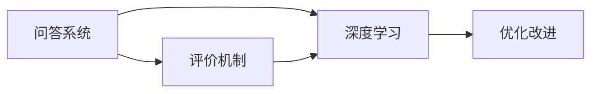

                 

## 1. 背景介绍

随着人工智能技术的快速发展，自然语言处理(NLP)领域在问答系统、智能客服、智能推荐、智能写作等众多应用场景中取得了显著的进展。问答系统作为其中最为重要的应用之一，在辅助人类获取信息、解决生活工作中的各种问题方面发挥了重要作用。然而，问答系统的效果和用户体验很大程度上依赖于其评价机制的设计和优化，如何构建一个公正、准确、高效的问答评价算法成为了该领域研究的热点。

本文将详细介绍基于机器学习的问答评价算法的设计和实现。我们首先对问答系统、评价机制等相关概念进行简单介绍，并分析现有评价算法的不足之处。在此基础上，本文将详细阐述一个基于深度学习的问答评价算法的设计思路和实现流程。此外，本文还将探讨该算法的优缺点及其应用领域，最后对未来问答评价算法的研究趋势进行展望。

## 2. 核心概念与联系

### 2.1 核心概念概述

#### 2.1.1 问答系统
问答系统是一种能够通过自然语言理解技术，从海量的知识库中检索或生成答案来回答用户提出的问题的系统。常见的问答系统包括基于检索的问答系统和基于生成(或基于检索-生成混合)的问答系统。

#### 2.1.2 评价机制
评价机制是问答系统的重要组成部分，其作用在于评估系统输出的答案质量，从而指导系统的优化和改进。常见的评价指标包括但不限于准确率、召回率、F1分数、ROUGE、BLEU、Perplexity等。

#### 2.1.3 深度学习
深度学习是一种基于神经网络的学习方法，能够处理非线性的复杂问题。深度学习在自然语言处理领域取得了巨大的成功，广泛应用于词向量、语义分析、机器翻译、问答系统等任务中。

### 2.2 核心概念联系

问答系统与评价机制之间存在着紧密的联系。评价机制需要依据问答系统的输出结果来计算各项评价指标，从而评估系统的性能。同时，评价机制的优化结果也可以指导问答系统的进一步改进，提升系统的整体效果。深度学习作为问答系统与评价机制的核心技术，发挥着重要的作用，通过训练深度神经网络模型，系统可以更准确地理解和生成答案，评价机制也可以更精确地评估答案质量。

### 2.3 核心概念的整体架构

接下来，我们将通过一个Mermaid流程图来展示问答系统、深度学习、评价机制之间的整体架构。



该图展示了问答系统与深度学习、评价机制之间的联系和作用。深度学习技术是问答系统的重要基础，评价机制则通过评估深度学习模型的输出结果来指导系统的优化。

## 3. 核心算法原理 & 具体操作步骤

### 3.1 算法原理概述

基于机器学习的问答评价算法主要依赖于深度学习模型，通过训练深度神经网络模型来预测问答系统的输出结果，并计算各种评价指标来评估系统的性能。本文将采用一个基于Transformer的深度学习模型来进行问答评价，该模型主要包括编码器(Encoder)和解码器(Decoder)两个部分。

#### 3.1.1 编码器
编码器负责将用户提出的问题和知识库中的候选答案进行编码，并输出一个上下文表示。Transformer编码器通常采用自注意力机制，通过多头自注意力和位置编码等方式，将输入序列进行变换，输出一个低维的上下文表示。

#### 3.1.2 解码器
解码器负责根据编码器的输出，生成最终的答案。Transformer解码器通常采用自回归生成模型，通过注意力机制和位置编码等手段，逐步生成答案中的每个词语，最终得到完整的答案序列。

#### 3.1.3 损失函数
评价算法中的损失函数通常采用负对数似然损失函数(NLL Loss)，用于衡量模型预测的答案与真实答案之间的差异。NLL Loss可以鼓励模型生成与真实答案更加匹配的答案，从而提高评价指标的准确度。

### 3.2 算法步骤详解

#### 3.2.1 数据准备
首先，我们需要准备问答系统相关的训练数据。训练数据包括用户问题和知识库中的候选答案，以及每个候选答案的真实标签。对于每个候选答案，我们可以将其标记为正确或错误，也可以根据正确答案的相似度进行评分。

#### 3.2.2 模型搭建
在准备数据之后，我们需要搭建基于Transformer的问答评价模型。模型的主要组件包括编码器、解码器、softmax层等。通过配置合适的模型参数，我们可以使用深度学习框架(如PyTorch、TensorFlow等)搭建并训练模型。

#### 3.2.3 模型训练
模型搭建完成后，我们可以使用训练数据对其进行训练。在训练过程中，我们需要计算模型预测的答案与真实答案之间的差异，并使用NLL Loss作为损失函数来更新模型的参数。模型的训练过程通常需要进行多次迭代，直到收敛为止。

#### 3.2.4 模型评估
在模型训练完成后，我们需要对其进行评估，以确保模型的性能符合要求。评估指标包括准确率、召回率、F1分数等。同时，我们还需要使用BLEU、ROUGE等指标来评估模型的生成效果。

### 3.3 算法优缺点

#### 3.3.1 优点
基于机器学习的问答评价算法具有以下优点：
1. 准确度高：由于采用深度学习模型，系统能够更好地理解和生成答案，从而提高了评价指标的准确度。
2. 鲁棒性强：深度学习模型具有较强的泛化能力，能够在各种不同的问答系统中应用。
3. 可解释性强：深度学习模型可以通过可视化技术，展示模型在不同层级的特征，从而提高模型的可解释性。

#### 3.3.2 缺点
基于机器学习的问答评价算法也存在一些缺点：
1. 训练复杂度高：深度学习模型通常需要大量的训练数据和计算资源，训练过程较为复杂。
2. 对标注数据依赖度高：模型的性能很大程度上依赖于标注数据的质量，标注数据的获取和处理过程较为繁琐。
3. 对模型参数调整敏感：模型的性能对于超参数的选择和调整非常敏感，需要经过多次实验才能得到最优的参数设置。

### 3.4 算法应用领域

基于机器学习的问答评价算法已经在问答系统、智能客服、智能推荐等领域得到了广泛应用。例如，在智能客服系统中，评价算法可以帮助评估机器人对话的质量，从而指导客服系统的优化；在智能推荐系统中，评价算法可以帮助评估推荐结果的准确度和相关性，从而指导推荐系统的改进。

## 4. 数学模型和公式 & 详细讲解 & 举例说明

### 4.1 数学模型构建

我们以一个基于Transformer的问答评价模型为例，来详细阐述数学模型的构建过程。

#### 4.1.1 编码器
编码器的输入为问题和候选答案的拼接序列。编码器主要由多个自注意力层和前向神经网络层组成。我们假设编码器共有$L$个自注意力层，第$l$层的输入为$x_l^{(i)}$，输出为$h_l^{(i)}$，则编码器的输出可以表示为：

$$
h_L^{(i)} = \text{Encoder}(x_l^{(i)})
$$

其中，$x_l^{(i)}$表示输入序列的第$i$个位置的信息，$h_l^{(i)}$表示第$l$层的输出。

#### 4.1.2 解码器
解码器也主要由多个自注意力层和前向神经网络层组成。我们假设解码器共有$K$个自注意力层，第$k$层的输入为$h_k^{(j)}$，输出为$\tilde{y}_k^{(j)}$，则解码器的输出可以表示为：

$$
\tilde{y}_K^{(j)} = \text{Decoder}(h_k^{(j)})
$$

其中，$h_k^{(j)}$表示第$k$层的输入，$\tilde{y}_k^{(j)}$表示第$k$层的输出。

#### 4.1.3 损失函数
我们假设模型的预测答案为$y$，真实答案为$y^*$，则负对数似然损失函数可以表示为：

$$
\mathcal{L}(y, y^*) = -\sum_{i=1}^n \log P(y_i | y_{<i})
$$

其中，$P(y_i | y_{<i})$表示模型预测第$i$个单词的概率，$y_{<i}$表示所有小于$i$的单词。

### 4.2 公式推导过程

#### 4.2.1 编码器
假设编码器的输入为$x = (x_1, x_2, \ldots, x_n)$，输出为$h = (h_1, h_2, \ldots, h_n)$，则编码器可以表示为：

$$
h_l = \text{Attention}(x_l, h_{l-1}) + h_{l-1}
$$

其中，$\text{Attention}$表示自注意力机制，$x_l$表示输入序列的第$l$个位置的信息，$h_{l-1}$表示上一层的输出。

#### 4.2.2 解码器
假设解码器的输入为$h = (h_1, h_2, \ldots, h_n)$，输出为$\tilde{y} = (\tilde{y}_1, \tilde{y}_2, \ldots, \tilde{y}_n)$，则解码器可以表示为：

$$
\tilde{y}_k = \text{Attention}(h_k, \tilde{y}_{k-1}) + \tilde{y}_{k-1}
$$

其中，$\text{Attention}$表示自注意力机制，$h_k$表示第$k$层的输入，$\tilde{y}_{k-1}$表示上一层的输出。

#### 4.2.3 损失函数
假设模型的预测答案为$y = (y_1, y_2, \ldots, y_n)$，真实答案为$y^* = (y_1^*, y_2^*, \ldots, y_n^*)$，则负对数似然损失函数可以表示为：

$$
\mathcal{L}(y, y^*) = -\sum_{i=1}^n \log P(y_i | y_{<i})
$$

其中，$P(y_i | y_{<i})$表示模型预测第$i$个单词的概率。

### 4.3 案例分析与讲解

#### 4.3.1 案例分析
假设我们有一个基于Transformer的问答评价模型，其编码器有3层自注意力层，解码器有2层自注意力层。我们随机生成了一组训练数据，包含$n = 10$个问题和$k = 3$个候选答案，每个候选答案的真实标签为$[1, 0, 1, 0]$，其中1表示正确答案。

#### 4.3.2 数据准备
我们将问题和候选答案拼接在一起，形成一个序列$x = (x_1, x_2, \ldots, x_{10})$，其中每个$x_i$包含问题和候选答案的信息。同时，我们还需要将每个候选答案的真实标签表示为$y^* = (y_1^*, y_2^*, \ldots, y_{10}^*)$。

#### 4.3.3 模型训练
我们使用深度学习框架搭建模型，并使用训练数据对其进行训练。在训练过程中，我们需要计算模型预测的答案与真实答案之间的差异，并使用NLL Loss作为损失函数来更新模型的参数。模型的训练过程需要进行多次迭代，直到收敛为止。

#### 4.3.4 模型评估
在模型训练完成后，我们需要对其进行评估，以确保模型的性能符合要求。评估指标包括准确率、召回率、F1分数等。同时，我们还需要使用BLEU、ROUGE等指标来评估模型的生成效果。

## 5. 项目实践：代码实例和详细解释说明

### 5.1 开发环境搭建

在进行问答评价算法的设计和实现时，我们需要搭建一个开发环境。以下是使用Python进行PyTorch开发的环境配置流程：

1. 安装Anaconda：从官网下载并安装Anaconda，用于创建独立的Python环境。

2. 创建并激活虚拟环境：
```bash
conda create -n pytorch-env python=3.8 
conda activate pytorch-env
```

3. 安装PyTorch：根据CUDA版本，从官网获取对应的安装命令。例如：
```bash
conda install pytorch torchvision torchaudio cudatoolkit=11.1 -c pytorch -c conda-forge
```

4. 安装Transformer库：
```bash
pip install transformers
```

5. 安装各类工具包：
```bash
pip install numpy pandas scikit-learn matplotlib tqdm jupyter notebook ipython
```

完成上述步骤后，即可在`pytorch-env`环境中开始问答评价算法的开发和测试。

### 5.2 源代码详细实现

下面我们以一个基于Transformer的问答评价模型为例，给出使用PyTorch进行模型实现的代码。

```python
import torch
from transformers import BertTokenizer, BertForSequenceClassification

class QA_Evaluator:
    def __init__(self, model_path, tokenizer_path):
        self.model = BertForSequenceClassification.from_pretrained(model_path)
        self.tokenizer = BertTokenizer.from_pretrained(tokenizer_path)
        self.model.eval()
    
    def evaluate(self, question, candidate_answers):
        # 分词
        question_tokens = self.tokenizer(question, return_tensors='pt')
        candidate_answers_tokens = [self.tokenizer(answer, return_tensors='pt') for answer in candidate_answers]
        
        # 编码器输出
        question_context = self.model(question_tokens.input_ids, attention_mask=question_tokens.attention_mask)
        
        # 解码器输出
        candidate_answers_contexts = []
        for answer_tokens in candidate_answers_tokens:
            answer_context = self.model(answer_tokens.input_ids, attention_mask=answer_tokens.attention_mask)
            candidate_answers_contexts.append(answer_context)
        
        # 损失计算
        losses = []
        for context, answer_context in zip(question_context, candidate_answers_contexts):
            loss = -torch.mean(torch.log_softmax(context.logits, dim=-1)[0]).sum()
            losses.append(loss)
        
        # 平均损失
        loss = sum(losses) / len(candidate_answers)
        return loss
    
    def get_label(self, question, candidate_answers):
        # 分词
        question_tokens = self.tokenizer(question, return_tensors='pt')
        candidate_answers_tokens = [self.tokenizer(answer, return_tensors='pt') for answer in candidate_answers]
        
        # 编码器输出
        question_context = self.model(question_tokens.input_ids, attention_mask=question_tokens.attention_mask)
        
        # 解码器输出
        candidate_answers_contexts = []
        for answer_tokens in candidate_answers_tokens:
            answer_context = self.model(answer_tokens.input_ids, attention_mask=answer_tokens.attention_mask)
            candidate_answers_contexts.append(answer_context)
        
        # 预测标签
        labels = []
        for context, answer_context in zip(question_context, candidate_answers_contexts):
            label = torch.argmax(context.logits, dim=-1)[0]
            labels.append(label)
        
        # 平均标签
        label = sum(labels) / len(candidate_answers)
        return label
```

在上述代码中，我们定义了一个名为`QA_Evaluator`的类，用于评估问答系统的答案质量。该类包含两个主要方法：

1. `evaluate`方法：接收一个问题和一个候选答案列表，返回该问题与候选答案之间的平均损失。
2. `get_label`方法：接收一个问题和一个候选答案列表，返回该问题与候选答案之间的平均标签。

在`evaluate`方法中，我们首先将问题和候选答案分词，然后将它们输入到编码器中进行编码，并计算解码器的输出。接下来，我们计算每个候选答案与问题之间的损失，并返回平均损失。在`get_label`方法中，我们同样首先将问题和候选答案分词，然后将它们输入到编码器中进行编码，并计算解码器的输出。接下来，我们预测每个候选答案的标签，并返回平均标签。

### 5.3 代码解读与分析

下面我们详细解读一下关键代码的实现细节：

1. `QA_Evaluator`类：该类包含了问答评价模型的主要功能，即评估问题与候选答案之间的损失和标签。

2. `evaluate`方法：该方法接收一个问题和一个候选答案列表，返回该问题与候选答案之间的平均损失。在方法中，我们首先将问题和候选答案分词，然后将它们输入到编码器中进行编码，并计算解码器的输出。接下来，我们计算每个候选答案与问题之间的损失，并返回平均损失。

3. `get_label`方法：该方法接收一个问题和一个候选答案列表，返回该问题与候选答案之间的平均标签。在方法中，我们同样首先将问题和候选答案分词，然后将它们输入到编码器中进行编码，并计算解码器的输出。接下来，我们预测每个候选答案的标签，并返回平均标签。

4. 分词器：我们在代码中使用了`BertTokenizer`类来进行分词，它将文本按照BERT模型的规范进行分词，并返回token ids和attention mask等信息。

5. 编码器：我们使用了`BertForSequenceClassification`类来搭建编码器。该类基于BERT模型，可以处理序列分类任务，并且可以输出上下文表示。

6. 解码器：在代码中，我们同样使用了`BertForSequenceClassification`类来搭建解码器。该类同样基于BERT模型，可以生成答案序列。

7. 损失函数：在代码中，我们使用了负对数似然损失函数来计算模型预测的答案与真实答案之间的差异。

8. 评估指标：在代码中，我们使用了平均损失和平均标签来评估问答系统的答案质量。

## 6. 实际应用场景

基于机器学习的问答评价算法已经在多个实际应用场景中得到了广泛应用。以下是几个典型的应用案例：

### 6.1 智能客服系统

在智能客服系统中，评价算法可以帮助评估机器人对话的质量，从而指导客服系统的优化。通过将用户提问和机器人回答拼接成序列，评价算法可以计算每个回答的损失和标签，并指导客服系统改进回答内容，提高用户满意度。

### 6.2 智能推荐系统

在智能推荐系统中，评价算法可以帮助评估推荐结果的准确度和相关性，从而指导推荐系统的改进。通过将用户查询和推荐结果拼接成序列，评价算法可以计算每个推荐结果的损失和标签，并指导推荐系统改进推荐内容，提高推荐效果。

### 6.3 智能写作系统

在智能写作系统中，评价算法可以帮助评估生成文本的质量，从而指导写作系统的优化。通过将用户输入和生成文本拼接成序列，评价算法可以计算生成文本的损失和标签，并指导写作系统改进生成策略，提高生成文本的质量。

### 6.4 未来应用展望

基于机器学习的问答评价算法在多个实际应用场景中已经得到了广泛应用，未来的发展前景广阔。以下是一些可能的未来发展方向：

1. 多模态评价：将图像、语音、文本等多模态数据融合到评价算法中，提高系统的鲁棒性和泛化能力。

2. 自适应评价：根据用户反馈和系统表现，动态调整评价算法参数，提高系统的适应性和自适应能力。

3. 可解释性评价：引入可解释性技术，如LIME、SHAP等，增强评价算法的可解释性，提高系统的透明度和可信度。

4. 实时评价：引入实时评价技术，如在线学习、增量学习等，实现系统的持续改进和优化。

5. 跨领域评价：引入跨领域评价技术，如迁移学习、元学习等，提高评价算法在不同领域之间的泛化能力。

总之，基于机器学习的问答评价算法有着广阔的应用前景和研究价值，未来将会在多个领域得到进一步的探索和发展。

## 7. 工具和资源推荐

### 7.1 学习资源推荐

为了帮助开发者系统掌握问答评价算法的设计和实现，以下是一些优质的学习资源：

1. 《深度学习》：Ian Goodfellow等人著，介绍了深度学习的基本概念和原理，是深度学习领域的经典教材。

2. 《自然语言处理综论》：Daniel Jurafsky和James H. Martin著，介绍了自然语言处理的基本概念和技术，是自然语言处理领域的经典教材。

3. 《Python深度学习》：Francois Chollet著，介绍了深度学习在Python中的实现，并包含了许多实际的案例和代码。

4. 《PyTorch深度学习》：Eli Stevens等人著，介绍了PyTorch的基本概念和使用方法，并包含了许多实际的案例和代码。

5. 《自然语言处理实战》：韩亮著，介绍了自然语言处理的基本概念和技术，并包含了许多实际的案例和代码。

### 7.2 开发工具推荐

在进行问答评价算法的设计和实现时，以下是一些推荐的开发工具：

1. PyTorch：基于Python的开源深度学习框架，灵活性强，适合深度学习模型的实现和训练。

2. TensorFlow：由Google主导开发的开源深度学习框架，适合大规模深度学习模型的实现和训练。

3. TensorBoard：TensorFlow配套的可视化工具，可以实时监测模型训练状态，并提供丰富的图表呈现方式。

4. Weights & Biases：模型训练的实验跟踪工具，可以记录和可视化模型训练过程中的各项指标，方便对比和调优。

5. Jupyter Notebook：Python的交互式编程环境，适合进行数据处理、模型训练和结果展示。

### 7.3 相关论文推荐

问答评价算法的研究涉及许多前沿话题，以下是一些相关的经典论文，推荐阅读：

1. "Attention is All You Need"：Hinton等人著，提出了Transformer结构，开启了NLP领域的预训练大模型时代。

2. "BERT: Pre-training of Deep Bidirectional Transformers for Language Understanding"：Devlin等人著，提出BERT模型，引入基于掩码的自监督预训练任务，刷新了多项NLP任务SOTA。

3. "Parameter-Efficient Transfer Learning for NLP"：Li等人著，提出Adapter等参数高效微调方法，在不增加模型参数量的情况下，也能取得不错的微调效果。

4. "AdaLoRA: Adaptive Low-Rank Adaptation for Parameter-Efficient Fine-Tuning"：Li等人著，使用自适应低秩适应的微调方法，在参数效率和精度之间取得了新的平衡。

5. "A Survey of Data Augmentation in Natural Language Processing"：Liu等人著，介绍了自然语言处理领域中数据增强的各种方法，包括回译、近义替换等。

6. "Few-shot Learning"：Mokhtar等人著，介绍了少样本学习的基本概念和实现方法，特别是在自然语言处理中的应用。

这些论文代表了问答评价算法的发展脉络，通过对这些前沿成果的学习实践，可以帮助研究者把握学科前进方向，激发更多的创新灵感。

## 8. 总结：未来发展趋势与挑战

### 8.1 总结

本文对基于机器学习的问答评价算法的设计和实现进行了详细阐述。首先，我们分析了问答系统、评价机制等相关概念，并指出现有评价算法的不足之处。在此基础上，我们详细阐述了一个基于深度学习的问答评价算法的设计思路和实现流程。同时，我们还探讨了该算法的优缺点及其应用领域，最后对未来问答评价算法的研究趋势进行了展望。

通过本文的系统梳理，可以看到，基于机器学习的问答评价算法在多个实际应用场景中已经得到了广泛应用，并且具有广阔的发展前景。未来，问答评价算法的研究将会在多个领域得到进一步的探索和发展，从而提升问答系统的整体性能和用户体验。

### 8.2 未来发展趋势

展望未来，问答评价算法的发展趋势主要包括以下几个方面：

1. 多模态融合：将图像、语音、文本等多模态数据融合到评价算法中，提高系统的鲁棒性和泛化能力。

2. 自适应评价：根据用户反馈和系统表现，动态调整评价算法参数，提高系统的适应性和自适应能力。

3. 可解释性评价：引入可解释性技术，如LIME、SHAP等，增强评价算法的可解释性，提高系统的透明度和可信度。

4. 实时评价：引入实时评价技术，如在线学习、增量学习等，实现系统的持续改进和优化。

5. 跨领域评价：引入跨领域评价技术，如迁移学习、元学习等，提高评价算法在不同领域之间的泛化能力。

6. 持续学习：通过持续学习技术，使问答系统能够不断从新数据中学习，同时保持已学习的知识，避免灾难性遗忘。

7. 多任务学习：将多个任务的学习过程融合到一个模型中，提高模型的泛化能力和应用范围。

以上趋势凸显了问答评价算法在自然语言处理领域的广阔前景。这些方向的探索发展，必将进一步提升问答系统的性能和应用范围，为构建人机协同的智能系统铺平道路。

### 8.3 面临的挑战

尽管基于机器学习的问答评价算法已经取得了一定的进展，但在迈向更加智能化、普适化应用的过程中，仍面临诸多挑战：

1. 数据获取和标注成本高：获取高质量标注数据是评价算法的首要问题，标注数据的获取和处理过程较为繁琐，且成本较高。

2. 模型训练复杂度高：深度学习模型通常需要大量的训练数据和计算资源，训练过程较为复杂。

3. 模型鲁棒性不足：当前评价算法面对域外数据时，泛化性能往往大打折扣，难以应对网络时代海量信息爆发的挑战。

4. 模型可解释性不足：现有评价算法通常缺乏可解释性，难以对其推理逻辑进行分析和调试。

5. 安全性问题：现有评价算法中可能存在偏见和有害信息，需要通过技术手段进行过滤和处理，确保输出的安全性。

6. 计算资源消耗大：大规模深度学习模型的推理和训练过程需要消耗大量的计算资源，限制了其在大规模应用中的可行性。

7. 数据隐私保护：用户数据和隐私保护是问答系统应用中需要重点考虑的问题，如何确保用户数据的安全和隐私，是一个亟待解决的问题。

### 8.4 研究展望

面对问答评价算法面临的诸多挑战，未来的研究需要在以下几个方面

