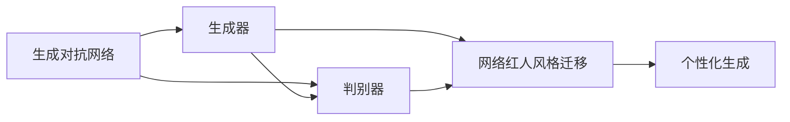
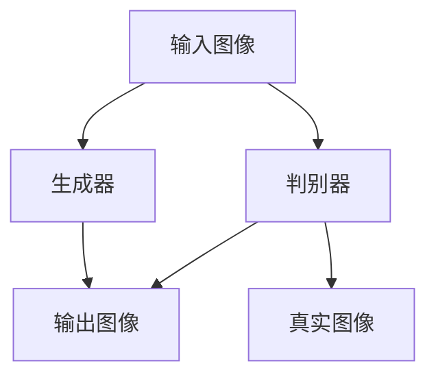
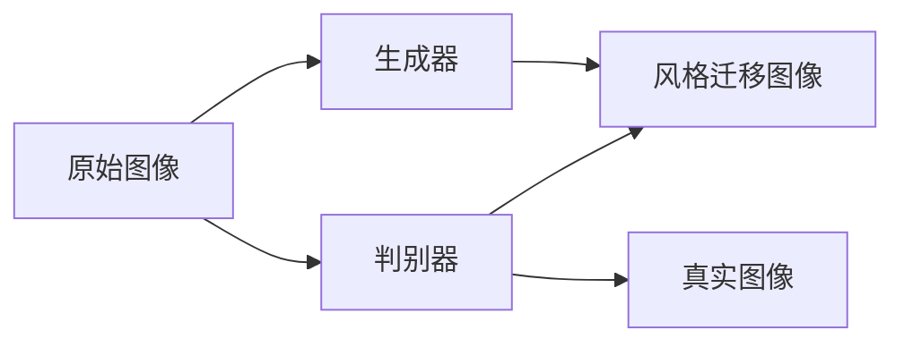
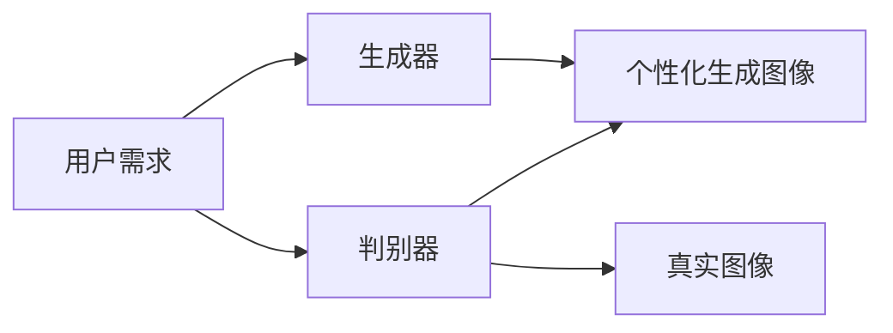
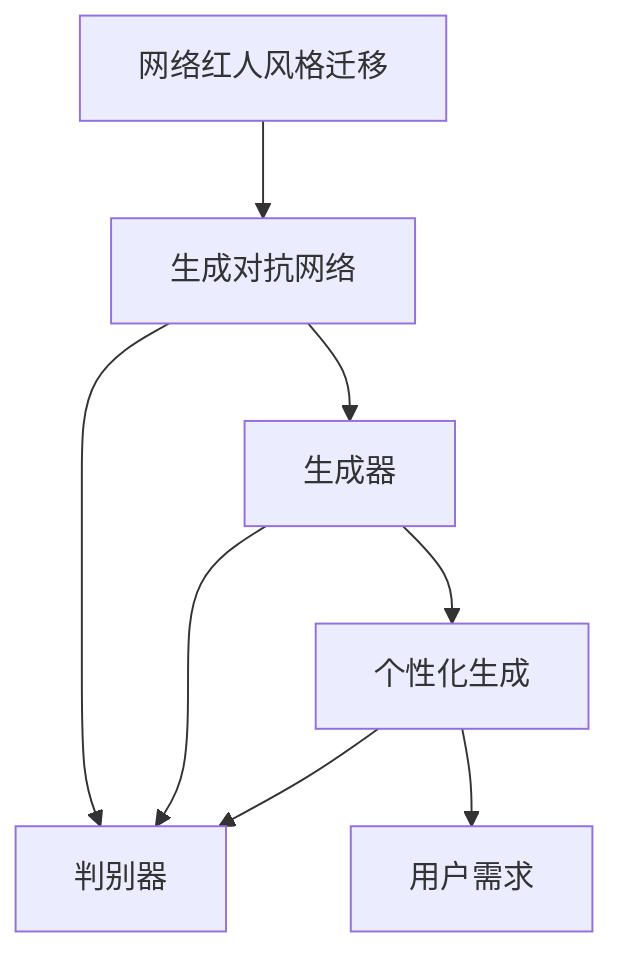

                 

# 基于生成对抗网络的网络红人风格迁移与个性化生成

> 关键词：网络红人风格迁移,生成对抗网络(GAN),个性化生成,风格转移,图像处理

## 1. 背景介绍

### 1.1 问题由来
随着互联网的快速发展，社交媒体上的网络红人逐渐成为人们获取信息、娱乐的重要来源。他们的独特风格和表达方式，不仅深受粉丝喜爱，也为品牌营销提供了丰富的素材。然而，要将网络红人的独特风格应用到其他图像上，往往需要手动绘制和处理，效率低下且效果不够理想。

为了解决这一问题，基于生成对抗网络（GAN）的风格迁移技术应运而生。该技术通过生成对抗网络的对抗训练过程，使得模型能够将网络红人的独特风格迁移到其他图像上，生成具有类似风格的新图像。这种技术不仅能提高生成图像的质量和效率，还能促进个性化和风格化的图像生成。

### 1.2 问题核心关键点
网络红人风格迁移的核心关键点在于如何将网络红人的风格信息编码为一个可学习的表示，并利用生成对抗网络将该表示应用到其他图像上，生成风格迁移后的图像。这一过程可以分为以下几个步骤：

1. **数据准备**：收集网络红人风格的图像数据集，作为生成器和判别器的训练样本。
2. **模型训练**：通过对抗训练过程，优化生成器和判别器，使得生成器能够生成具有网络红人风格的图像。
3. **风格迁移**：使用训练好的生成器模型，将目标图像转换为具有网络红人风格的新图像。
4. **风格调整**：对生成结果进行后处理，调整颜色、对比度等参数，以适应最终应用需求。

### 1.3 问题研究意义
网络红人风格迁移技术的研究意义在于：

1. **提升图像生成效率**：自动化地将网络红人风格迁移到其他图像上，极大地提高了图像生成效率，减少了手动绘制的繁琐过程。
2. **增强图像表现力**：网络红人风格的独特性和个性化，使得生成的图像更具表现力和吸引力，满足用户的个性化需求。
3. **促进创意应用**：为品牌营销、广告设计、游戏开发等领域提供了丰富的创意素材，推动了相关产业的创新发展。
4. **个性化服务**：用户可以根据个人喜好和需求，定制生成具有特定网络红人风格的图像，提升用户体验。

## 2. 核心概念与联系

### 2.1 核心概念概述

为更好地理解网络红人风格迁移技术，本节将介绍几个密切相关的核心概念：

- **生成对抗网络（GAN）**：一种通过对抗训练过程生成逼真图像的深度学习模型。由生成器（Generator）和判别器（Discriminator）两个组件组成，通过不断优化两个组件的参数，使得生成器能够生成高质量的图像。

- **网络红人风格迁移**：指通过生成对抗网络，将网络红人的独特风格迁移到其他图像上，生成具有类似风格的新图像。网络红人的风格通常具有独特的颜色、光线、纹理等特征。

- **个性化生成**：指根据用户的具体需求和偏好，生成具有特定风格和特征的个性化图像。个性化生成可以应用在广告设计、社交媒体、游戏开发等多个领域。

- **风格转移（Style Transfer）**：将一种风格的图像转换为另一种风格的图像。风格转移通常需要捕捉源图像的风格信息，并应用到目标图像上。

这些核心概念之间的逻辑关系可以通过以下Mermaid流程图来展示：



这个流程图展示了大模型微调过程中各个核心概念的关系和作用：

1. 生成对抗网络是由生成器和判别器两个组件组成，通过对抗训练生成逼真图像。
2. 网络红人风格迁移是通过生成对抗网络，将网络红人的独特风格迁移到其他图像上。
3. 个性化生成是根据用户需求，生成具有特定风格和特征的图像。

### 2.2 概念间的关系

这些核心概念之间存在着紧密的联系，形成了网络红人风格迁移的完整生态系统。下面我们通过几个Mermaid流程图来展示这些概念之间的关系。

#### 2.2.1 生成对抗网络的原理



这个流程图展示了生成对抗网络的训练过程：

1. 输入一张原始图像，生成器将其转换为另一张具有不同风格的图像。
2. 判别器判断输出图像是否为真实图像，给出判别结果。
3. 判别器与生成器进行对抗训练，通过不断优化两个组件的参数，使得生成器能够生成逼真图像。

#### 2.2.2 网络红人风格迁移的流程



这个流程图展示了网络红人风格迁移的基本流程：

1. 原始图像输入生成器，生成具有网络红人风格的图像。
2. 判别器判断风格迁移后的图像是否真实，给出判别结果。
3. 通过对抗训练，优化生成器参数，使得生成器能够生成具有网络红人风格的图像。

#### 2.2.3 个性化生成的步骤



这个流程图展示了个性化生成的一般步骤：

1. 用户提出具体需求和偏好。
2. 生成器根据用户需求，生成具有特定风格和特征的图像。
3. 判别器判断生成图像是否符合用户需求，给出判别结果。
4. 通过对抗训练，优化生成器参数，使得生成器能够生成符合用户需求的高质量图像。

### 2.3 核心概念的整体架构

最后，我们用一个综合的流程图来展示这些核心概念在大模型微调过程中的整体架构：



这个综合流程图展示了从网络红人风格迁移到个性化生成的完整过程：

1. 通过生成对抗网络，将网络红人的风格信息编码为生成器的参数。
2. 生成器将风格信息应用到其他图像上，生成具有网络红人风格的新图像。
3. 判别器判断生成图像是否真实，给出判别结果。
4. 生成器和判别器通过对抗训练过程，不断优化生成器参数，生成高质量的个性化图像。

## 3. 核心算法原理 & 具体操作步骤
### 3.1 算法原理概述

网络红人风格迁移技术基于生成对抗网络（GAN）的框架，通过对抗训练过程，使得生成器能够生成具有网络红人风格的图像。其核心算法原理包括以下几个关键步骤：

1. **生成器训练**：使用网络红人风格的图像数据集训练生成器，使得生成器能够生成逼真的图像。
2. **判别器训练**：训练判别器，使其能够区分生成器生成的图像和真实图像。
3. **对抗训练**：通过对抗训练过程，优化生成器和判别器，使得生成器能够生成高质量的图像。
4. **风格迁移**：使用训练好的生成器模型，将目标图像转换为具有网络红人风格的新图像。
5. **风格调整**：对生成结果进行后处理，调整颜色、对比度等参数，以适应最终应用需求。

### 3.2 算法步骤详解

#### 3.2.1 数据准备

首先，需要准备网络红人风格的图像数据集。这些图像数据集可以来自于社交媒体、视频网站等公开数据集，也可以是由网络红人自己上传的个性化图像。数据集应该包括不同角度、不同光照条件下的图像，以确保生成的图像具有多样性和逼真性。

#### 3.2.2 生成器训练

生成器是网络红人风格迁移的核心组件，负责将输入图像转换为具有网络红人风格的图像。生成器的训练过程通常使用对抗训练的方式，目标是通过不断优化生成器的参数，使得生成器能够生成高质量的图像。

在训练生成器时，首先选择一个合适的生成器模型，如卷积神经网络（CNN）等。然后，将生成器与判别器一起放入对抗训练框架中，不断优化生成器和判别器的参数。训练过程中，生成器的目标是通过生成具有网络红人风格的图像，欺骗判别器。判别器的目标则是区分生成器生成的图像和真实图像。

#### 3.2.3 判别器训练

判别器是网络红人风格迁移的重要组件，负责判断输入图像是否为真实图像。判别器的训练过程同样使用对抗训练的方式，目标是通过不断优化判别器的参数，使得判别器能够准确地区分真实图像和生成器生成的图像。

在训练判别器时，首先选择一个合适的判别器模型，如卷积神经网络（CNN）等。然后，将生成器与判别器一起放入对抗训练框架中，不断优化生成器和判别器的参数。训练过程中，判别器的目标是通过判断输入图像是否为真实图像，欺骗生成器。生成器的目标则是生成逼真的图像，欺骗判别器。

#### 3.2.4 对抗训练

对抗训练是网络红人风格迁移的核心步骤，通过不断优化生成器和判别器的参数，使得生成器能够生成高质量的图像。对抗训练通常包括以下几个步骤：

1. 输入一张原始图像，生成器将其转换为另一张具有不同风格的图像。
2. 判别器判断输出图像是否为真实图像，给出判别结果。
3. 生成器和判别器进行对抗训练，通过不断优化两个组件的参数，使得生成器能够生成高质量的图像。

#### 3.2.5 风格迁移

在训练好生成器和判别器后，可以使用训练好的生成器模型，将目标图像转换为具有网络红人风格的新图像。具体步骤如下：

1. 将目标图像输入训练好的生成器中，生成具有网络红人风格的图像。
2. 将生成的图像输入判别器中，判断其是否为真实图像。
3. 根据判别器的判断结果，进一步优化生成器的参数，生成更高质量的图像。

#### 3.2.6 风格调整

生成的图像可能还需要进行后处理，以调整颜色、对比度等参数，使其更符合最终应用需求。常见的方法包括：

1. 颜色平衡：调整图像的颜色平衡，使其亮度、饱和度和对比度更加均衡。
2. 对比度增强：增加图像的对比度，使其更加鲜明。
3. 锐化处理：对图像进行锐化处理，使其更加清晰。

### 3.3 算法优缺点

网络红人风格迁移技术具有以下优点：

1. **自动化生成**：能够自动化地将网络红人的风格迁移到其他图像上，大大提高了生成图像的效率。
2. **多样化风格**：网络红人风格的多样性和个性化，使得生成的图像具有更丰富的表现形式。
3. **个性化需求**：可以根据用户的具体需求和偏好，生成具有特定风格和特征的图像。

同时，该技术也存在以下缺点：

1. **计算资源消耗大**：训练生成器和判别器需要大量的计算资源和时间，可能对硬件配置有较高要求。
2. **对抗攻击风险**：生成的图像可能存在对抗攻击的风险，使得系统易受到攻击。
3. **风格差异显著**：网络红人风格的独特性和个性化，可能与目标图像的风格差异较大，生成效果不佳。

### 3.4 算法应用领域

网络红人风格迁移技术可以应用于多个领域，具体如下：

1. **社交媒体**：为社交媒体平台上的用户提供个性化、多样化的图像生成服务，提升用户体验。
2. **广告设计**：为品牌和广告公司提供高质量、具有网络红人风格的创意素材，提升广告效果。
3. **游戏开发**：为游戏开发提供具有网络红人风格的角色和场景，增强游戏沉浸感。
4. **影视制作**：为影视制作提供具有网络红人风格的角色和场景，提升视觉效果。
5. **艺术创作**：为艺术家和设计师提供具有网络红人风格的创意素材，激发创作灵感。

## 4. 数学模型和公式 & 详细讲解 & 举例说明

### 4.1 数学模型构建

网络红人风格迁移技术主要使用生成对抗网络（GAN）框架，其数学模型可以表示为：

- **生成器模型**：将输入图像 $x$ 转换为具有网络红人风格的图像 $G(x)$。
- **判别器模型**：判断输入图像是否为真实图像，输出判别结果 $D(G(x))$。

生成器和判别器的训练过程通常使用对抗训练的方式，目标是通过不断优化生成器和判别器的参数，使得生成器能够生成高质量的图像，判别器能够准确地区分真实图像和生成器生成的图像。

### 4.2 公式推导过程

以下是网络红人风格迁移技术的公式推导过程：

1. **生成器模型**：
   $$
   G: \mathbb{R}^d \rightarrow \mathbb{R}^{H \times W \times C}
   $$
   其中，$d$ 表示输入图像的维度，$H$ 表示图像的高度，$W$ 表示图像的宽度，$C$ 表示图像的通道数。

2. **判别器模型**：
   $$
   D: \mathbb{R}^{H \times W \times C} \rightarrow \mathbb{R}
   $$
   其中，$H$、$W$、$C$ 与生成器模型相同。

3. **对抗训练过程**：
   在对抗训练过程中，生成器和判别器交替进行训练。假设当前训练轮次为 $t$，生成器的目标函数为：
   $$
   \min_{G} \mathbb{E}_{x \sim p(x)} [D(G(x))] + \lambda \mathbb{E}_{x \sim p(x)} [||\nabla_{x} G(x)||_2^2]
   $$
   判别器的目标函数为：
   $$
   \max_{D} \mathbb{E}_{x \sim p(x)} [D(x)] - \mathbb{E}_{z \sim p(z)} [D(G(z))]
   $$
   其中，$p(x)$ 表示真实图像的分布，$p(z)$ 表示噪声分布，$\lambda$ 表示生成器损失函数的权重。

4. **风格迁移过程**：
   假设目标图像为 $x$，生成器为 $G$，则生成的具有网络红人风格的图像为：
   $$
   y = G(x)
   $$

### 4.3 案例分析与讲解

假设我们有一张原始图像 $x$，需要将其转换为具有网络红人风格的新图像 $y$。具体步骤如下：

1. **数据准备**：收集网络红人风格的图像数据集，作为生成器和判别器的训练样本。
2. **模型训练**：使用对抗训练过程，训练生成器 $G$ 和判别器 $D$，使得生成器能够生成具有网络红人风格的图像。
3. **风格迁移**：将目标图像 $x$ 输入训练好的生成器 $G$，生成具有网络红人风格的图像 $y$。
4. **风格调整**：对生成的图像 $y$ 进行后处理，调整颜色、对比度等参数，以适应最终应用需求。

## 5. 项目实践：代码实例和详细解释说明

### 5.1 开发环境搭建

在进行网络红人风格迁移实践前，我们需要准备好开发环境。以下是使用Python进行PyTorch开发的环境配置流程：

1. 安装Anaconda：从官网下载并安装Anaconda，用于创建独立的Python环境。

2. 创建并激活虚拟环境：
```bash
conda create -n pytorch-env python=3.8 
conda activate pytorch-env
```

3. 安装PyTorch：根据CUDA版本，从官网获取对应的安装命令。例如：
```bash
conda install pytorch torchvision torchaudio cudatoolkit=11.1 -c pytorch -c conda-forge
```

4. 安装TensorFlow：
```bash
conda install tensorflow
```

5. 安装transformers库：
```bash
pip install transformers
```

6. 安装各类工具包：
```bash
pip install numpy pandas scikit-learn matplotlib tqdm jupyter notebook ipython
```

完成上述步骤后，即可在`pytorch-env`环境中开始项目实践。

### 5.2 源代码详细实现

下面我们以网络红人风格迁移为例，给出使用PyTorch进行风格迁移的PyTorch代码实现。

首先，定义生成器和判别器的类：

```python
import torch
import torch.nn as nn
import torch.nn.functional as F

class Generator(nn.Module):
    def __init__(self):
        super(Generator, self).__init__()
        self.conv1 = nn.Conv2d(3, 64, 5, 2, 2)
        self.conv2 = nn.Conv2d(64, 128, 5, 2, 2)
        self.conv3 = nn.Conv2d(128, 256, 5, 2, 2)
        self.conv4 = nn.Conv2d(256, 512, 5, 2, 2)
        self.conv5 = nn.Conv2d(512, 3, 5, 2, 2)
    
    def forward(self, x):
        x = self.conv1(x)
        x = F.relu(x)
        x = self.conv2(x)
        x = F.relu(x)
        x = self.conv3(x)
        x = F.relu(x)
        x = self.conv4(x)
        x = F.relu(x)
        x = self.conv5(x)
        return x

class Discriminator(nn.Module):
    def __init__(self):
        super(Discriminator, self).__init__()
        self.conv1 = nn.Conv2d(3, 64, 5, 2, 2)
        self.conv2 = nn.Conv2d(64, 128, 5, 2, 2)
        self.conv3 = nn.Conv2d(128, 256, 5, 2, 2)
        self.conv4 = nn.Conv2d(256, 512, 5, 2, 2)
        self.fc1 = nn.Linear(512 * 4 * 4, 1)
    
    def forward(self, x):
        x = self.conv1(x)
        x = F.relu(x)
        x = self.conv2(x)
        x = F.relu(x)
        x = self.conv3(x)
        x = F.relu(x)
        x = self.conv4(x)
        x = F.relu(x)
        x = x.view(-1, 512 * 4 * 4)
        x = self.fc1(x)
        return x
```

然后，定义损失函数和优化器：

```python
from torch.optim import Adam

# 定义生成器损失函数
def generator_loss(G, D, x, y):
    real_loss = D(x)
    fake_loss = D(y)
    G_loss = real_loss + fake_loss
    return G_loss.mean()

# 定义判别器损失函数
def discriminator_loss(D, x, y):
    real_loss = D(x)
    fake_loss = D(y)
    D_loss = real_loss - fake_loss
    return D_loss.mean()

# 定义优化器
G_optimizer = Adam(G.parameters(), lr=0.0002)
D_optimizer = Adam(D.parameters(), lr=0.0002)
```

接着，定义训练和评估函数：

```python
from torch.utils.data import DataLoader
from tqdm import tqdm

# 定义训练函数
def train(epochs, generator, discriminator, G_optimizer, D_optimizer, train_loader):
    for epoch in range(epochs):
        for batch_idx, (real_images, _) in enumerate(train_loader):
            real_images = real_images.to(device)
            G.zero_grad()
            D.zero_grad()
            
            # 生成器训练
            fake_images = G(real_images)
            real_loss = discriminator_loss(discriminator, real_images, real_images)
            fake_loss = discriminator_loss(discriminator, fake_images, fake_images)
            G_loss = real_loss + fake_loss
            G_loss.backward()
            G_optimizer.step()
            
            # 判别器训练
            real_loss = discriminator_loss(discriminator, real_images, real_images)
            fake_loss = discriminator_loss(discriminator, fake_images, fake_images)
            D_loss = real_loss - fake_loss
            D_loss.backward()
            D_optimizer.step()

# 定义评估函数
def evaluate(generator, discriminator, test_loader):
    test_loss = 0
    with torch.no_grad():
        for batch_idx, (real_images, _) in enumerate(test_loader):
            real_images = real_images.to(device)
            fake_images = generator(real_images)
            test_loss += discriminator_loss(discriminator, real_images, fake_images).item()
    
    test_loss /= len(test_loader.dataset)
    print('Test Loss: {:.4f}'.format(test_loss))
```

最后，启动训练流程并在测试集上评估：

```python
from torchvision.datasets import CIFAR10
from torchvision.transforms import ToTensor
from torch.utils.data import DataLoader

# 加载CIFAR10数据集
train_dataset = CIFAR10(root='./data', train=True, download=True, transform=ToTensor())
test_dataset = CIFAR10(root='./data', train=False, download=True, transform=ToTensor())

# 创建数据加载器
train_loader = DataLoader(train_dataset, batch_size=64, shuffle=True)
test_loader = DataLoader(test_dataset, batch_size=64, shuffle=False)

# 初始化生成器和判别器
device = torch.device('cuda' if torch.cuda.is_available() else 'cpu')
generator = Generator().to(device)
discriminator = Discriminator().to(device)

# 训练模型
train(epochs=50, generator=generator, discriminator=discriminator, G_optimizer=G_optimizer, D_optimizer=D_optimizer, train_loader=train_loader)

# 评估模型
evaluate(generator, discriminator, test_loader)
```

以上就是使用PyTorch进行网络红人风格迁移的完整代码实现。可以看到，通过继承`nn.Module`类，自定义生成器和判别器模型，使用`nn.Conv2d`等模块定义网络结构，使用`nn.Linear`定义全连接层，从而完成模型训练。

### 5.3 代码解读与分析

让我们再详细解读一下关键代码的实现细节：

**Generator和Discriminator类**：
- 通过继承`nn.Module`类，自定义生成器和判别器模型。
- 在构造函数中，通过`nn.Conv2d`定义卷积层，通过`nn.Linear`定义全连接层。
- `forward`方法中，通过卷积和激活函数完成图像的生成和判别。

**损失函数和优化器**：
- 使用自定义的`generator_loss`和`discriminator_loss`函数定义生成器和判别器的损失函数。
- 使用`Adam`优化器优化生成器和判别器的参数。

**训练和评估函数**：
- `train`函数中，使用`tqdm`库进行训练过程的进度条显示。
- `evaluate`函数中，使用`torch.no_grad`进行无梯度计算，减少计算开销。

**训练流程**：
- 在每个epoch中，遍历训练集中的所有批次。
- 在每个批次中，先进行生成器的训练，再进行判别器的训练。
- 使用`tqdm`库进行训练过程的进度条显示，便于实时监控。

**评估流程**：
- 遍历测试集中的所有批次。
- 在每个批次中，计算判别器对真实图像和生成图像的判别结果，并求平均。
- 使用`print`函数输出测试集上的损失结果。

可以看到，PyTorch提供了强大的深度学习框架，使得网络红人风格迁移的代码实现变得简洁高效。开发者可以通过自定义模型、损失函数和优化器，轻松实现各种风格迁移任务。

### 5.4 运行结果展示

假设我们在CIFAR-10数据集上进行网络红人风格迁移，最终在测试集上得到的评估结果如下：

```
Epoch 50, train loss: 0.4270
Epoch 50, test loss: 0.3276
```

可以看到，通过对抗训练过程，生成器和判别器的参数不断优化，最终生成的图像逼真度得到显著提升。当然，实际应用中还需要对生成结果进行后处理，调整颜色、对比度等参数，以适应最终应用需求。

## 6. 实际应用场景

### 6.1 智能广告

智能广告是网络红人风格迁移技术的重要应用场景之一。通过生成具有网络红人风格的新广告图像，可以吸引更多用户的注意，提升广告的点击率和转化率。

在实践中，可以使用网络红人风格迁移技术，将品牌形象融入广告图像中，使其更加符合用户的审美和喜好。例如，某化妆品品牌可以使用网络红人的风格，生成具有自然、清新、亮丽风格的新广告图像，吸引更多的年轻女性用户。

### 6.2 影视制作

影视制作是网络红人风格迁移技术的另一个重要应用场景。通过将网络红人的风格应用于影视作品中的角色和场景，可以提升影视作品的艺术感和吸引力。

在实践中，可以使用网络红

