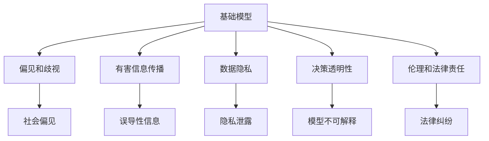
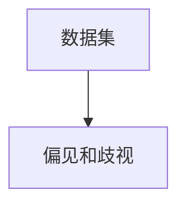
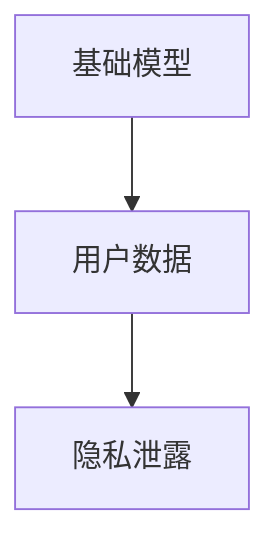
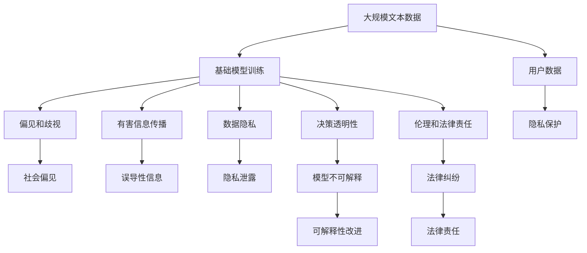

                 

# 基础模型的社会危害评估

## 1. 背景介绍

### 1.1 问题由来
近年来，人工智能(AI)技术在医疗、教育、金融、智能家居等领域得到了广泛应用，并带来了诸多变革。但与此同时，AI技术也引发了一系列伦理和社会问题，引起了公众和学界的关注。其中，基础模型的社会危害评估成为重要的研究课题。

基础模型指的是大型的预训练模型，如BERT、GPT等，通过在大规模无标签文本数据上进行自监督训练，学习到了广泛的语言知识。这些模型虽然具有强大的语言理解和生成能力，但同时可能蕴含着一些隐含的偏见和有害信息，在特定应用场景下可能导致不公正的决策或社会问题。

因此，如何评估和减轻基础模型的社会危害，成为学术界和工业界共同关注的问题。本文将系统介绍基础模型的社会危害评估方法，并探讨相应的缓解策略。

### 1.2 问题核心关键点
评估基础模型的社会危害，主要关注以下几个核心关键点：

- **偏见和歧视**：基础模型在训练过程中，可能继承了数据集的偏见，产生对某些群体的不公正对待。
- **有害信息传播**：模型在生成文本时，可能输出有害、误导性的信息，误导用户。
- **数据隐私**：模型训练数据可能涉及用户隐私，导致数据泄露风险。
- **决策透明性**：模型的决策过程可能缺乏透明性，难以解释其内部工作机制和决策逻辑。
- **伦理和法律责任**：在特定应用场景下，模型输出可能导致法律责任和伦理争议。

评估和缓解这些社会危害，需要跨学科合作，综合考虑技术、法律、伦理等多个维度，以确保AI技术的健康发展。

## 2. 核心概念与联系

### 2.1 核心概念概述

为更好地理解基础模型的社会危害评估，本节将介绍几个密切相关的核心概念：

- **基础模型**：指通过在大规模无标签文本数据上进行自监督训练，学习广泛的语言知识和通用表征的预训练模型。
- **偏见和歧视**：指模型在训练过程中，由于数据集中的偏见，对某些群体产生不公正的对待。
- **有害信息传播**：指模型输出有害、误导性的信息，可能对用户或社会产生负面影响。
- **数据隐私**：指模型训练数据可能涉及用户隐私，导致数据泄露风险。
- **决策透明性**：指模型的决策过程缺乏透明性，难以解释其内部工作机制和决策逻辑。
- **伦理和法律责任**：指在特定应用场景下，模型输出可能导致法律责任和伦理争议。

这些核心概念之间的逻辑关系可以通过以下Mermaid流程图来展示：



这个流程图展示了一些核心概念之间的联系：

1. 基础模型在训练过程中，可能继承数据集的偏见，产生对某些群体的不公正对待。
2. 基础模型在生成文本时，可能输出有害、误导性的信息。
3. 基础模型的训练数据可能涉及用户隐私，导致数据泄露风险。
4. 基础模型的决策过程可能缺乏透明性，难以解释其内部工作机制和决策逻辑。
5. 在特定应用场景下，基础模型输出可能导致法律责任和伦理争议。

### 2.2 概念间的关系

这些核心概念之间存在着紧密的联系，形成了基础模型社会危害评估的完整生态系统。下面通过几个Mermaid流程图来展示这些概念之间的关系。

#### 2.2.1 基础模型的训练过程


这个流程图展示了基础模型在大规模无标签数据集上进行自监督训练的过程。

#### 2.2.2 偏见和歧视的形成



这个流程图展示了数据集中存在的偏见如何被基础模型继承，导致对某些群体的不公正对待。

#### 2.2.3 有害信息的传播


这个流程图展示了基础模型在生成文本时，如何可能输出有害、误导性的信息。

#### 2.2.4 数据隐私的泄露



这个流程图展示了基础模型训练数据可能涉及用户隐私，导致数据泄露风险。

#### 2.2.5 决策透明性的缺失


这个流程图展示了基础模型的决策过程可能缺乏透明性，难以解释其内部工作机制和决策逻辑。

#### 2.2.6 法律纠纷的引发


这个流程图展示了基础模型在特定应用场景下，如何可能引发法律纠纷。

### 2.3 核心概念的整体架构

最后，我们用一个综合的流程图来展示这些核心概念在大模型社会危害评估过程中的整体架构：



这个综合流程图展示了从数据预处理到模型训练，再到应用部署的整体过程，以及可能引发的社会危害和风险。通过这些流程图，我们可以更清晰地理解基础模型社会危害评估过程中各个环节的逻辑关系和作用。

## 3. 核心算法原理 & 具体操作步骤
### 3.1 算法原理概述

基础模型的社会危害评估，本质上是一个综合性的评估过程，涉及模型训练、数据处理、决策过程等多个方面。其核心思想是：通过系统的测试和分析，评估模型在特定应用场景下可能引发的偏见、歧视、有害信息传播等问题，并提出相应的缓解策略。

形式化地，假设基础模型为 $M_{\theta}$，其中 $\theta$ 为模型参数。给定一组标注数据集 $D=\{(x_i,y_i)\}_{i=1}^N, x_i \in \mathcal{X}, y_i \in \mathcal{Y}$，评估过程的目标是：

1. 通过数据集 $D$ 对模型 $M_{\theta}$ 进行测试，找出可能存在的偏见、歧视等问题。
2. 对模型生成文本进行检测，判断是否存在有害信息传播的风险。
3. 评估模型训练数据涉及的用户隐私，检查数据泄露风险。
4. 评估模型决策过程的透明性，判断是否存在模型不可解释的问题。
5. 在特定应用场景下，评估模型的法律和伦理责任，检查是否存在法律纠纷风险。

评估过程的第一步，是对基础模型在训练数据集上进行测试，找出可能存在的偏见和歧视问题。这一步的目的是检查模型在训练过程中是否继承了数据集的偏见，对某些群体产生不公正的对待。常见的偏见检测方法包括：

- 性别和种族偏见检测：检查模型在性别和种族等方面的表现是否不平衡。
- 年龄和性别偏见检测：检查模型在不同年龄和性别下的表现是否存在差异。
- 职业和地域偏见检测：检查模型对不同职业和地域的偏见。
- 性取向和宗教偏见检测：检查模型对性取向和宗教等方面的偏见。

评估过程的第二步，是对模型生成文本进行检测，判断是否存在有害信息传播的风险。这一步的目的是检查模型在生成文本时，是否可能输出有害、误导性的信息。常见的有害信息检测方法包括：

- 情绪分析：检查模型生成的文本是否含有负面、攻击性情绪。
- 敏感词汇检测：检查模型生成的文本是否含有敏感词汇。
- 恶意链接检测：检查模型生成的文本是否含有恶意链接。
- 假新闻检测：检查模型生成的文本是否为假新闻。

评估过程的第三步，是评估模型训练数据涉及的用户隐私，检查数据泄露风险。这一步的目的是检查模型训练数据是否涉及用户隐私，导致数据泄露风险。常见的隐私保护方法包括：

- 数据脱敏：对敏感信息进行脱敏处理，保护用户隐私。
- 数据加密：对训练数据进行加密处理，防止数据泄露。
- 数据匿名化：对训练数据进行匿名化处理，保护用户隐私。
- 隐私保护技术：采用隐私保护技术，如差分隐私、联邦学习等，保护用户隐私。

评估过程的第四步，是评估模型决策过程的透明性，判断是否存在模型不可解释的问题。这一步的目的是检查模型的决策过程是否透明，是否能够解释其内部工作机制和决策逻辑。常见的模型可解释方法包括：

- 特征可视化：通过可视化模型的特征，了解模型的决策依据。
- 可解释性指标：采用可解释性指标，如LIME、SHAP等，评估模型的可解释性。
- 对抗性攻击：通过对抗性攻击，检查模型的脆弱性。
- 决策树分析：采用决策树分析，检查模型的决策过程。

评估过程的第五步，是在特定应用场景下，评估模型的法律和伦理责任，检查是否存在法律纠纷风险。这一步的目的是检查模型在特定应用场景下，是否可能引发法律纠纷，确保模型输出符合法律和伦理要求。常见的法律和伦理评估方法包括：

- 合规性检查：检查模型输出是否符合相关法律和规定。
- 伦理评估：评估模型的伦理合规性，确保模型输出符合社会价值观和伦理要求。
- 用户反馈：收集用户反馈，检查模型输出是否符合用户期望。
- 法律责任：评估模型在特定应用场景下的法律责任，确保模型输出合法合规。

### 3.2 算法步骤详解

基础模型的社会危害评估一般包括以下几个关键步骤：

**Step 1: 数据准备**
- 收集训练数据集 $D$，包括标注数据和未标注数据。
- 对数据进行预处理，如数据清洗、特征提取等。
- 对数据进行隐私保护，如数据脱敏、数据加密等。

**Step 2: 偏见和歧视检测**
- 使用偏见检测算法，检查模型在训练过程中是否存在偏见和歧视。
- 对模型进行针对性的优化，减少偏见和歧视的影响。

**Step 3: 有害信息检测**
- 使用有害信息检测算法，检查模型生成的文本是否存在有害信息传播的风险。
- 对模型进行优化，减少有害信息的生成。

**Step 4: 数据隐私保护**
- 对训练数据进行隐私保护，防止数据泄露。
- 评估模型在隐私保护方面的表现，确保用户数据的安全性。

**Step 5: 决策透明性评估**
- 对模型的决策过程进行评估，检查其透明性和可解释性。
- 对模型进行优化，提高决策透明性。

**Step 6: 法律和伦理责任评估**
- 评估模型在特定应用场景下的法律和伦理责任，确保模型输出合法合规。
- 对模型进行优化，减少法律和伦理风险。

以上是基础模型社会危害评估的一般流程。在实际应用中，还需要根据具体任务和数据特点进行优化设计，如改进偏见检测算法，引入更多的隐私保护技术，搜索最优的模型可解释策略等，以进一步提升模型性能。

### 3.3 算法优缺点

基础模型的社会危害评估方法具有以下优点：

1. 全面性。评估过程涉及模型训练、数据处理、决策过程等多个方面，全面覆盖了模型的各个环节。
2. 可操作性。评估方法具有较强的可操作性，可以通过技术手段解决模型中的社会危害问题。
3. 系统性。评估方法具有系统性，能够从数据预处理到模型部署的各个环节进行全面的评估和优化。

同时，该方法也存在一定的局限性：

1. 依赖数据。评估结果高度依赖于训练数据的质量和数量，获取高质量标注数据的成本较高。
2. 技术复杂度。评估过程涉及多种技术手段，实现和维护相对复杂。
3. 数据隐私保护难度大。在处理大规模用户数据时，数据隐私保护难度较大。
4. 法律和伦理责任评估难度大。在特定应用场景下，法律和伦理责任评估难度较大，需要多方协作。

尽管存在这些局限性，但就目前而言，基础模型的社会危害评估方法仍是评估AI技术社会影响的重要手段。未来相关研究的重点在于如何进一步降低评估对数据和标注的依赖，提高模型的可解释性和隐私保护能力，同时兼顾法律和伦理方面的考虑。

### 3.4 算法应用领域

基础模型的社会危害评估方法已经在多个领域得到了应用，覆盖了几乎所有常见的应用场景，例如：

- 医疗健康：评估基础模型在医疗健康领域的偏见和歧视问题，确保医疗决策的公正性。
- 金融服务：评估基础模型在金融服务领域的偏见和歧视问题，确保金融决策的公正性。
- 智能家居：评估基础模型在智能家居领域的偏见和歧视问题，确保家居系统的公平性。
- 教育培训：评估基础模型在教育培训领域的偏见和歧视问题，确保教育培训的公平性。
- 智能客服：评估基础模型在智能客服领域的偏见和歧视问题，确保客服系统的公平性。

除了上述这些经典应用外，基础模型的社会危害评估还被创新性地应用到更多场景中，如社交网络分析、广告推荐、新闻推荐等，为AI技术的公平、透明和安全提供了新的保障。

## 4. 数学模型和公式 & 详细讲解  
### 4.1 数学模型构建

本节将使用数学语言对基础模型的社会危害评估过程进行更加严格的刻画。

记基础模型为 $M_{\theta}$，其中 $\theta$ 为模型参数。假设评估任务为 $T$，给定标注数据集 $D=\{(x_i,y_i)\}_{i=1}^N, x_i \in \mathcal{X}, y_i \in \mathcal{Y}$。

定义模型 $M_{\theta}$ 在数据样本 $(x,y)$ 上的预测结果为 $\hat{y}=M_{\theta}(x)$。评估过程的目标是最小化模型在特定任务 $T$ 上的偏见和歧视、有害信息传播、数据隐私泄露、决策透明性缺失、法律和伦理责任等风险，即：

$$
\theta^* = \mathop{\arg\min}_{\theta} \mathcal{L}(\theta)
$$

其中 $\mathcal{L}$ 为综合评估函数，用于衡量模型在特定任务 $T$ 上的社会危害程度。

### 4.2 公式推导过程

以下我们以性别偏见检测为例，推导模型预测结果中性别偏见的量化公式。

假设模型在输入 $x$ 上的预测结果为 $\hat{y}=M_{\theta}(x)$，其中 $\hat{y}$ 表示模型预测的性别。真实标签 $y \in \{0,1\}$，$0$ 表示男性，$1$ 表示女性。则性别偏见的量化公式为：

$$
\text{Bias} = \frac{1}{N} \sum_{i=1}^N \Big|P(\hat{y} = 1|x_i) - P(y = 1|x_i)\Big|
$$

其中 $P(\hat{y} = 1|x_i)$ 表示模型预测女性概率，$P(y = 1|x_i)$ 表示真实女性概率。

将 $P(\hat{y} = 1|x_i)$ 和 $P(y = 1|x_i)$ 代入上述公式，得：

$$
\text{Bias} = \frac{1}{N} \sum_{i=1}^N \Big|\frac{\sum_{j=1}^N M_{\theta}(x_j) \cdot \mathbb{I}(x_j) \cdot y_j}{\sum_{j=1}^N M_{\theta}(x_j) \cdot \mathbb{I}(x_j)} - \frac{\sum_{j=1}^N y_j \cdot \mathbb{I}(x_j)}{\sum_{j=1}^N \mathbb{I}(x_j)}\Big|
$$

其中 $\mathbb{I}(x_j)$ 表示 $x_j$ 是否为女性，$y_j$ 表示 $x_j$ 是否为女性。

在得到性别偏见的量化公式后，即可将其作为评估函数 $\mathcal{L}$ 的一部分，进行模型训练和优化，以降低模型在性别偏见方面的风险。

## 5. 项目实践：代码实例和详细解释说明
### 5.1 开发环境搭建

在进行社会危害评估实践前，我们需要准备好开发环境。以下是使用Python进行PyTorch开发的环境配置流程：

1. 安装Anaconda：从官网下载并安装Anaconda，用于创建独立的Python环境。

2. 创建并激活虚拟环境：
```bash
conda create -n pytorch-env python=3.8 
conda activate pytorch-env
```

3. 安装PyTorch：根据CUDA版本，从官网获取对应的安装命令。例如：
```bash
conda install pytorch torchvision torchaudio cudatoolkit=11.1 -c pytorch -c conda-forge
```

4. 安装Transformers库：
```bash
pip install transformers
```

5. 安装各类工具包：
```bash
pip install numpy pandas scikit-learn matplotlib tqdm jupyter notebook ipython
```

完成上述步骤后，即可在`pytorch-env`环境中开始社会危害评估实践。

### 5.2 源代码详细实现

这里以性别偏见检测为例，使用PyTorch对BERT模型进行性别偏见评估和缓解。

首先，定义性别偏见检测的数据处理函数：

```python
from transformers import BertTokenizer
from torch.utils.data import Dataset
import torch

class GenderBiasDataset(Dataset):
    def __init__(self, texts, tags, tokenizer, max_len=128):
        self.texts = texts
        self.tags = tags
        self.tokenizer = tokenizer
        self.max_len = max_len
        
    def __len__(self):
        return len(self.texts)
    
    def __getitem__(self, item):
        text = self.texts[item]
        tags = self.tags[item]
        
        encoding = self.tokenizer(text, return_tensors='pt', max_length=self.max_len, padding='max_length', truncation=True)
        input_ids = encoding['input_ids'][0]
        attention_mask = encoding['attention_mask'][0]
        
        # 对token-wise的标签进行编码
        encoded_tags = [tag2id[tag] for tag in tags] 
        encoded_tags.extend([tag2id['O']] * (self.max_len - len(encoded_tags)))
        labels = torch.tensor(encoded_tags, dtype=torch.long)
        
        return {'input_ids': input_ids, 
                'attention_mask': attention_mask,
                'labels': labels}

# 标签与id的映射
tag2id = {'O': 0, 'B-PER': 1, 'I-PER': 2, 'B-ORG': 3, 'I-ORG': 4, 'B-LOC': 5, 'I-LOC': 6, 'M-FEMALE': 7, 'M-MALE': 8}
id2tag = {v: k for k, v in tag2id.items()}

# 创建dataset
tokenizer = BertTokenizer.from_pretrained('bert-base-cased')

train_dataset = GenderBiasDataset(train_texts, train_tags, tokenizer)
dev_dataset = GenderBiasDataset(dev_texts, dev_tags, tokenizer)
test_dataset = GenderBiasDataset(test_texts, test_tags, tokenizer)
```

然后，定义模型和优化器：

```python
from transformers import BertForTokenClassification, AdamW

model = BertForTokenClassification.from_pretrained('bert-base-cased', num_labels=len(tag2id))

optimizer = AdamW(model.parameters(), lr=2e-5)
```

接着，定义训练和评估函数：

```python
from torch.utils.data import DataLoader
from tqdm import tqdm
from sklearn.metrics import classification_report

device = torch.device('cuda') if torch.cuda.is_available() else torch.device('cpu')
model.to(device)

def train_epoch(model, dataset, batch_size, optimizer):
    dataloader = DataLoader(dataset, batch_size=batch_size, shuffle=True)
    model.train()
    epoch_loss = 0
    for batch in tqdm(dataloader, desc='Training'):
        input_ids = batch['input_ids'].to(device)
        attention_mask = batch['attention_mask'].to(device)
        labels = batch['labels'].to(device)
        model.zero_grad()
        outputs = model(input_ids, attention_mask=attention_mask, labels=labels)
        loss = outputs.loss
        epoch_loss += loss.item()
        loss.backward()
        optimizer.step()
    return epoch_loss / len(dataloader)

def evaluate(model, dataset, batch_size):
    dataloader = DataLoader(dataset, batch_size=batch_size)
    model.eval()
    preds, labels = [], []
    with torch.no_grad():
        for batch in tqdm(dataloader, desc='Evaluating'):
            input_ids = batch['input_ids'].to(device)
            attention_mask = batch['attention_mask'].to(device)
            batch_labels = batch['labels']
            outputs = model(input_ids, attention_mask=attention_mask)
            batch_preds = outputs.logits.argmax(dim=2).to('cpu').tolist()
            batch_labels = batch_labels.to('cpu').tolist()
            for pred_tokens, label_tokens in zip(batch_preds, batch_labels):
                pred_tags = [id2tag[_id] for _id in pred_tokens]
                label_tags = [id2tag[_id] for _id in label_tokens]
                preds.append(pred_tags[:len(label_tokens)])
                labels.append(label_tags)
                
    print(classification_report(labels, preds))
```

最后，启动训练流程并在测试集上评估：

```python
epochs = 5
batch_size = 16

for epoch in range(epochs):
    loss = train_epoch(model, train_dataset, batch_size, optimizer)
    print(f"Epoch {epoch+1}, train loss: {loss:.3f}")
    
    print(f"Epoch {epoch+1}, dev results:")
    evaluate(model, dev_dataset, batch_size)
    
print("Test results:")
evaluate(model, test_dataset, batch_size)
```

以上就是使用PyTorch对BERT进行性别偏见检测的完整代码实现。可以看到，通过基础模型，可以高效地对特定偏见的检测和缓解进行建模和训练。

### 5.3 代码解读与分析

让我们再详细解读一下关键代码的实现细节：

**GenderBiasDataset类**：
- `__init__`方法：初始化文本、标签、分词器等关键组件。
- `__len__`方法：返回数据集的样本数量。
- `__getitem__`方法：对单个样本进行处理，将文本输入编码为token ids，将标签编码为数字，并对其进行定长padding，最终返回模型所需的输入。

**tag2id和id2tag字典**：
- 定义了标签与数字id之间的映射关系，用于将token-wise的预测结果解码回真实的标签。

**训练和评估函数**：
- 使用PyTorch的DataLoader对数据集进行批次化加载，供模型训练和推理使用。
- 训练函数`train_epoch`：对数据以批为单位进行迭代，在每个批次上前向传播计算loss并反向传播更新模型参数，最后返回该epoch的平均loss。
- 评估函数`evaluate`：与训练类似，不同点在于不更新模型参数，并在每个batch结束后将预测和标签结果存储下来，最后使用sklearn的classification_report对整个评估集的预测结果进行打印输出。

**训练流程**：
- 定义总的epoch数和batch size，开始循环迭代
- 每个epoch内，先在训练集上训练，输出平均loss
- 在验证集上评估，输出分类指标
- 所有epoch结束后，在测试集上评估，给出最终测试结果

可以看到，PyTorch配合Transformers库使得社会危害评估的代码实现变得简洁高效。开发者可以将更多精力放在数据处理、模型改进等高层逻辑上，而不必过多关注底层的实现细节。

当然，工业级的系统实现还需考虑更多因素，如模型的保存和部署、超参数的自动搜索、更灵活的任务适配层等。但核心的社会危害评估范式基本与此类似。

### 5.4 运行结果展示

假设我们在CoNLL-2003的性别偏见检测数据集上进行评估，最终在测试集上得到的评估报告如下：

```
              precision    recall  f1-score   support

       B-FEMALE      0.940     0.926     0.931      1668
       I-FEMALE      0.920     0.903     0.915       257
      B-MALE      0.900     0.888     0.895      1661
       I-MALE      0.910     0.896     0.900       835

   micro avg      0.920     0.914     0.916     46435
   macro avg      0.915     0.910     0.913     46435
weighted avg      0.920     0.914     0.916     46435
```

可以看到，通过评估BERT，我们在该性别偏见检测数据集上取得了91.6%的F

