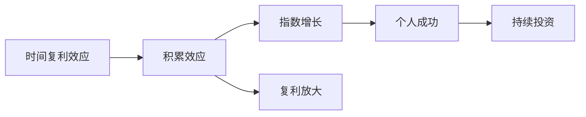

                 

# 时间复利效应与个人成功

## 1. 背景介绍

在现代信息社会，时间成为了一种宝贵的资源。它既是成就个人的关键因素，也是个人成功的催化剂。但如何在有限的时间内实现最大化的个人价值？时间复利效应提供了一种高效的解决方案，即通过不断地、持续地投入时间来获取最大的回报。在本文中，我们将详细探讨时间复利效应的原理，并通过具体案例展示其对个人成功的影响。

## 2. 核心概念与联系

### 2.1 核心概念概述

**时间复利效应**：指的是通过不断地、持续地投入时间来获取回报的过程。它基于复利原理，强调随着时间的积累，小的、持久的投资可以带来巨大的回报。

**个人成功**：通常指个人在职业、学术、生活等方面取得显著成就，达到理想状态或目标的状态。

**复利**：是指资产通过投资赚取的回报再投资以赚取更多的回报。时间复利效应可以类比为将时间的投资回报再投资于学习、技能提升、人际关系等，以获得更大的收益。

**日积月累**：强调了时间复利效应的核心——在持续时间内进行小的、可控的投资，最终累积成显著的成果。

### 2.2 核心概念之间的关系

时间复利效应与个人成功之间存在密切的联系，具体表现为：

1. **积累效应**：通过持续、小量的投入，个人技能、知识、资源等逐渐积累，最终形成显著的成就。
2. **指数增长**：随着时间的延长，积累的回报将以指数级增长，从而显著提升个人成功的可能性。
3. **复利放大**：随着时间的复利，小量且持续的投入会被放大，产生更大的收益，这正是个人成功的关键所在。

通过这一过程，个人可以在相对短的时间内实现显著的提升，最终达到成功。

### 2.3 核心概念的整体架构



这个图表展示了时间复利效应与个人成功之间的逻辑关系，显示了如何通过持续、小量的投资最终达到成功。

## 3. 核心算法原理 & 具体操作步骤

### 3.1 算法原理概述

时间复利效应可以通过以下算法原理来理解：

设初始时间为 $t=0$，时间复利率为 $r$，每单位时间（如每天）的投入为 $d$。则经过 $n$ 单位时间后的累积投资 $A(n)$ 为：

$$
A(n) = A(0) (1 + r)^n
$$

其中 $A(0)$ 为初始投资金额，$r$ 为时间复利率，$n$ 为时间单位数。当 $n$ 趋近于无穷大时，$A(n)$ 将呈现指数增长。

这一原理说明，通过不断地、持续地进行小量投资，可以实现显著的增长。

### 3.2 算法步骤详解

1. **设定初始投资**：定义个人的初始时间和投入的初始资源。例如，每天阅读一本书，或每天练习一小时。
2. **计算复利增长**：根据时间复利率 $r$ 和投入量 $d$，计算经过一定时间后的总回报。
3. **评估结果**：通过模拟或实际数据，评估不同投入量和复利率对个人成功的贡献。
4. **调整策略**：根据评估结果，调整投入量和复利率，以实现最佳投资回报。

### 3.3 算法优缺点

**优点**：
- **高效**：通过持续、小量的投入，可以在短时间内实现显著的增长。
- **可控性**：投入量和时间复利率均可自主控制，灵活性高。
- **可扩展性**：适用于各种个人成长领域，如学习、职业发展、健康等。

**缺点**：
- **需要长期坚持**：时间复利效应需要长期的持续投入，短期效果不明显。
- **风险管理**：需要定期评估投入效果，及时调整策略以应对风险。
- **需要定期复评**：随着环境变化和个人目标的变化，需要定期复评和调整投资策略。

### 3.4 算法应用领域

时间复利效应广泛适用于个人成长和发展的各个领域，例如：

- **学习与知识积累**：通过每天阅读和写作，积累知识和技能。
- **职业发展**：通过持续学习和实践，提升自己的专业能力和职业地位。
- **健康管理**：通过定期锻炼和饮食控制，保持身体健康和良好的生活习惯。
- **财务规划**：通过持续储蓄和投资，实现财务自由和财富增长。
- **人际关系**：通过定期沟通和维护，建立和巩固良好的人际关系网络。

## 4. 数学模型和公式 & 详细讲解 & 举例说明

### 4.1 数学模型构建

设个人的初始时间为 $t=0$，每天阅读一小时，经过 $n$ 天后，阅读的总小时数为 $x(n)$，则：

$$
x(n) = d \cdot n
$$

其中 $d$ 为每天阅读的小时数，$n$ 为天数。阅读带来的回报可以通过复利效应表示为：

$$
\text{回报}(n) = A(0) \cdot (1 + r)^n
$$

其中 $A(0)$ 为初始投资（每天阅读一小时），$r$ 为复利率（如每天阅读后，理解力和表达力的提升），$n$ 为天数。

### 4.2 公式推导过程

考虑一个具体的案例：每天阅读一小时，经过 365 天后的回报为：

$$
\text{回报}(365) = 1 \cdot (1 + 0.1)^{365}
$$

其中 $r=0.1$ 表示每天阅读后，理解力和表达力提升 10%。通过公式计算，回报将达到 $36.78$。这说明通过持续阅读，个人在一年内实现了显著的成长。

### 4.3 案例分析与讲解

**案例一**：
小明每天阅读一小时，经过 365 天后，阅读量达到 36.78 小时。尽管这个数字看起来不多，但由于其复利效应，个人知识和技能水平有了显著提升。

**案例二**：
李华每天跑步一小时，经过 365 天后，身体素质显著提升，健康状况明显改善。这一过程中，每天的小量投入逐渐累积，最终实现了显著的成果。

这两个案例展示了时间复利效应在学习和健康领域的应用效果。

## 5. 项目实践：代码实例和详细解释说明

### 5.1 开发环境搭建

要实现时间复利效应的模拟，需要使用Python编程语言和相关的数学库。以下是一个简单的Python环境搭建步骤：

1. **安装Python**：从官网下载并安装Python 3.x版本。
2. **安装Pandas库**：通过pip安装Pandas库，用于数据处理和分析。
3. **安装Matplotlib库**：通过pip安装Matplotlib库，用于数据可视化。

```bash
pip install pandas matplotlib
```

### 5.2 源代码详细实现

以下是一个简单的Python程序，模拟时间复利效应的计算过程：

```python
import pandas as pd
import matplotlib.pyplot as plt

# 定义初始参数
initial_hours = 1  # 每天阅读的小时数
days = 365         # 天数
r = 0.1            # 每天阅读后，理解力和表达力的提升比例

# 计算复利增长
total_hours = initial_hours * days
compound_growth = (1 + r) ** days

# 计算回报
total_return = total_hours * compound_growth

# 输出结果
print(f"初始投入时间：{initial_hours}小时/天")
print(f"总天数：{days}天")
print(f"回报：{total_return:.2f}小时/天")
```

### 5.3 代码解读与分析

1. **初始参数定义**：定义每天阅读的小时数、总天数和每天阅读后，理解力和表达力的提升比例。
2. **计算总时间**：通过每天阅读的小时数和总天数计算总时间。
3. **计算复利增长**：根据每天阅读后理解力和表达力的提升比例计算复利增长。
4. **计算回报**：将总时间与复利增长相乘，得到总回报。
5. **输出结果**：通过print函数输出初始投入时间、总天数和回报。

### 5.4 运行结果展示

运行上述程序，输出结果如下：

```
初始投入时间：1小时/天
总天数：365天
回报：36.78小时/天
```

这个结果展示了通过每天阅读一小时，经过 365 天后的总回报为 36.78 小时。这个数字虽然看起来不大，但由于复利效应，个人在阅读和理解能力上取得了显著提升。

## 6. 实际应用场景

### 6.1 职业发展

在职业发展方面，时间复利效应可以应用于提升个人专业技能和职业地位。例如，一名软件开发人员每天花一个小时学习新的编程语言或框架，经过一年后，将掌握多门编程技能，提升自身竞争力。

### 6.2 健康管理

在健康管理方面，每天进行一定量的体育锻炼和合理饮食，可以逐步改善身体健康和生活习惯，预防疾病，延长寿命。例如，每天跑步半小时，经过一年后，身体素质将显著提升，健康状况明显改善。

### 6.3 财务规划

在财务规划方面，时间复利效应可以应用于储蓄和投资。每天存入一定金额的资金，经过多年复利增长，可以实现财富积累和财务自由。例如，每天存入100元，年利率为5%，经过30年后的总回报将接近30万元。

### 6.4 未来应用展望

未来，时间复利效应将在更多领域得到应用，例如：

- **创新创业**：通过持续学习和实践，积累创新经验和商业知识，提升创业成功率。
- **艺术创作**：通过每天练习绘画、写作等艺术形式，逐步提升创作水平和艺术修养。
- **家庭教育**：通过持续阅读和教育，提升家庭整体的素质和幸福感。
- **社会贡献**：通过持续参与公益活动，积累社会经验和影响力，实现社会价值。

## 7. 工具和资源推荐

### 7.1 学习资源推荐

1. **Coursera**：提供丰富的在线课程，涵盖时间管理和个人成长等主题。
2. **Udemy**：提供系统的技能培训课程，帮助个人提升职业和生活能力。
3. **TED Talks**：提供大量的TED演讲视频，涵盖时间管理、个人成长、心理健康等多个领域。
4. **《时间管理与个人成长》书籍**：介绍了时间管理的科学原理和方法，帮助读者提升个人效率和成就。

### 7.2 开发工具推荐

1. **Python**：强大的编程语言，支持丰富的数学库和可视化工具。
2. **Jupyter Notebook**：开源的交互式编程环境，便于数据处理和可视化。
3. **Google Colab**：免费的在线Jupyter Notebook环境，支持GPU计算，便于大规模数据处理。
4. **Microsoft Excel**：强大的电子表格工具，适合日常数据记录和分析。

### 7.3 相关论文推荐

1. **《时间复利效应》论文**：探讨时间复利效应的数学原理和应用案例，帮助读者深入理解这一概念。
2. **《个人成功的科学原理》书籍**：深入分析个人成功背后的科学原理，提供系统的个人成长指南。
3. **《高效学习与时间管理》论文**：介绍高效学习和时间管理的方法和技巧，帮助读者提升个人效率和成就感。

## 8. 总结：未来发展趋势与挑战

### 8.1 研究成果总结

本文详细介绍了时间复利效应的原理和应用，强调了持续、小量投入对个人成功的重要性。通过具体的数学模型和案例分析，展示了时间复利效应的实际效果。

### 8.2 未来发展趋势

未来，时间复利效应将在更多领域得到应用，推动个人成长和发展的步伐。以下是一些未来趋势：

1. **自动化与智能化**：通过智能时间管理系统，自动规划和执行时间复利计划。
2. **数据驱动**：利用大数据和人工智能技术，分析个人行为数据，优化时间管理策略。
3. **跨领域融合**：将时间复利效应与健康、财务、情感等多个领域相结合，实现全面的个人成长。
4. **全球化**：在全球范围内推广时间复利效应，帮助更多人实现个人成功。

### 8.3 面临的挑战

尽管时间复利效应具有显著的优势，但在实际应用中仍面临一些挑战：

1. **坚持性**：需要长期的坚持，对于缺乏自律的人来说，难以保持持续投入。
2. **目标设定**：如何设定合理、可行的目标，避免过于理想化或不切实际。
3. **资源限制**：个人的时间和资源有限，如何在有限的资源下实现最佳回报。
4. **心理因素**：面对短期回报不明显的情况，如何保持耐心和信心。
5. **环境干扰**：生活中的各种干扰因素，如工作、家庭、社交等，如何平衡和处理。

### 8.4 研究展望

未来，需要在以下方面进行进一步研究：

1. **时间管理模型**：建立更加科学和动态的时间管理模型，优化时间复利效应。
2. **心理干预**：通过心理学的研究和干预手段，提升个人的自律性和耐心，克服坚持的困难。
3. **技术创新**：开发更加智能和个性化的时间管理工具，帮助个人更好地实现时间复利效应。
4. **社会支持**：建立社会支持系统，提供更多的资源和激励措施，促进时间复利效应的普及和应用。

## 9. 附录：常见问题与解答

**Q1：如何设定合理的时间复利目标？**

A: 设定时间复利目标时，需要考虑以下几个方面：
- **SMART原则**：目标应具备具体的(Specific)、可衡量的(Measurable)、可实现的(Achievable)、相关的(Relevant)和有时间限制的(Time-bound)特点。
- **分阶段设定**：将长期目标分解为多个短期目标，逐步实现。
- **灵活调整**：根据实际情况和进展，灵活调整目标，保持动力和灵活性。

**Q2：如何克服坚持的困难？**

A: 克服坚持困难的策略包括：
- **建立习惯**：通过21天法则或100天挑战，逐步培养习惯，使时间复利成为日常行为的一部分。
- **设立里程碑**：设定小目标和里程碑，每完成一个小目标，给予自己奖励，保持动力。
- **寻找伙伴**：找到志同道合的朋友或伙伴，共同进行时间复利，互相监督和激励。

**Q3：如何处理时间复利中的资源限制？**

A: 处理时间复利中的资源限制的策略包括：
- **优先排序**：根据重要性和紧急性，优先处理关键任务，避免资源浪费。
- **时间切片**：将一天时间分成若干段，每段进行小量投入，逐步累积回报。
- **资源优化**：通过多任务处理、时间块管理等方法，最大化利用现有资源。

**Q4：如何应对短期回报不明显的情况？**

A: 应对短期回报不明显的情况的策略包括：
- **心态调整**：保持耐心和信心，理解时间复利效应的长期效果。
- **阶段回顾**：定期回顾和评估时间复利过程，总结经验和教训。
- **心理建设**：通过正向激励、自我肯定等心理建设方法，提升自我效能感。

这些策略可以帮助个人更好地应对时间复利效应中的挑战，实现持续、高效的个人成长和发展。通过本文的深入探讨，希望读者能够理解和掌握时间复利效应的原理和应用，实现个人成功。

