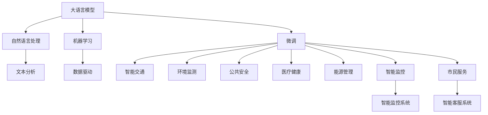
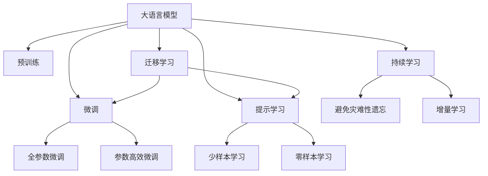
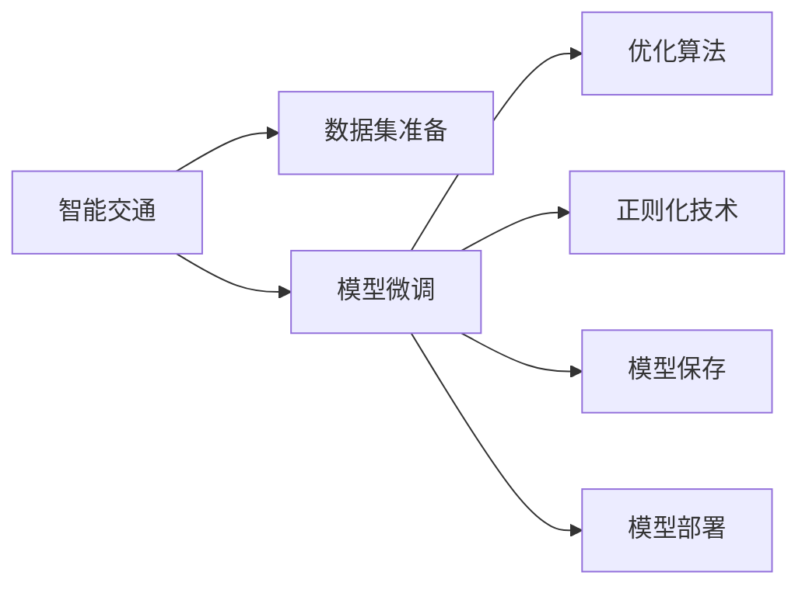
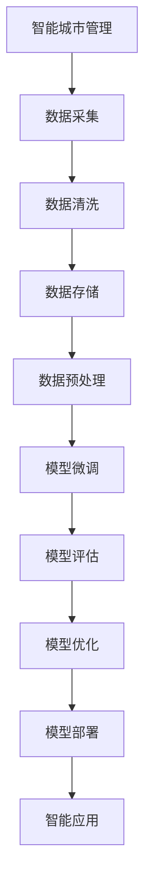
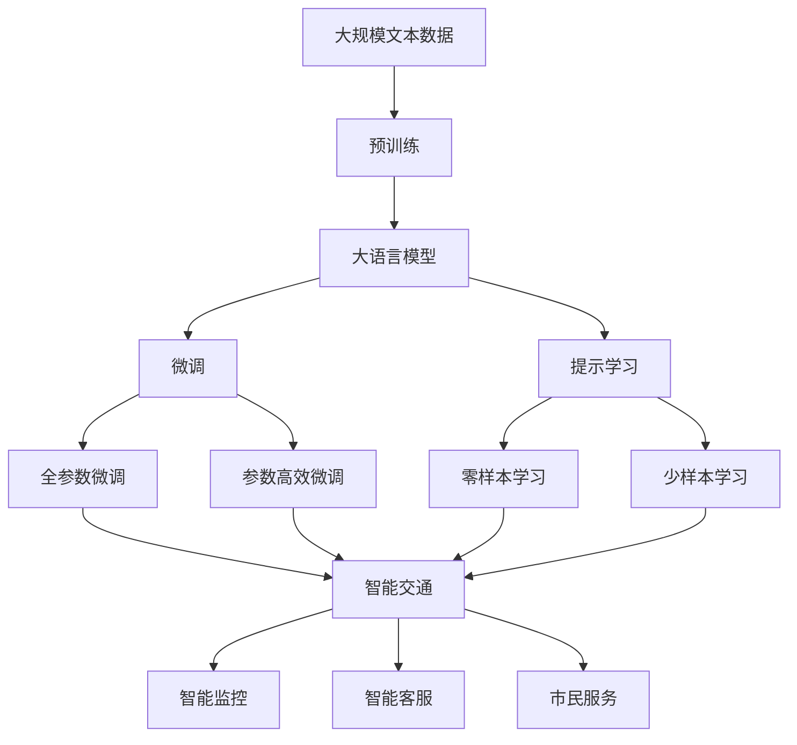

                 

# 智能城市与 LLM：高效、可持续的城市管理

> 关键词：智能城市, 语言模型, 微调, 城市管理, 自然语言处理(NLP), 机器学习, 高效, 可持续

## 1. 背景介绍

### 1.1 问题由来
随着城市化进程的加速，世界各地的城市面临着严峻的挑战，如交通拥堵、环境污染、公共安全等问题。传统的城市管理模式已无法适应日益增长的城市规模和复杂性，需要新的技术手段来提升城市的智能化和可持续性。

近年来，智能城市建设成为全球关注的焦点，各国纷纷提出智慧城市战略，期望通过先进的信息技术和数据驱动手段，提升城市治理能力，改善市民生活质量。在智能城市建设中，自然语言处理(NLP)和语言模型技术扮演了重要角色，尤其是大语言模型（Large Language Model, LLM），通过分析海量城市运行数据，提炼出有价值的信息，为城市管理决策提供支持。

### 1.2 问题核心关键点
智能城市中的LLM应用，主要是通过微调（Fine-tuning）技术，将通用语言模型应用于特定的城市管理任务。常见的城市管理任务包括智能交通、环境监测、公共安全、医疗健康、能源管理等。微调技术可以使大语言模型更好地适应这些具体场景，提升任务处理效率和准确性，从而实现高效、可持续的城市管理。

微调的核心在于：
1. 选择合适的学习率，避免破坏预训练模型。
2. 应用正则化技术，防止模型过拟合。
3. 保留预训练模型的部分层，只微调顶层。
4. 数据增强，丰富训练数据多样性。
5. 对抗训练，提高模型鲁棒性。
6. 提示学习，减少微调参数。

本文将深入探讨基于微调技术的大语言模型在智能城市中的高效应用，通过案例分析、代码实例和实际应用展示，揭示智能城市与LLM的深度融合之道。

### 1.3 问题研究意义
大语言模型在智能城市中的应用，对于提升城市治理效率、优化资源配置、提高公共服务水平具有重要意义：

1. 降低城市管理成本。通过使用通用大模型进行微调，可以快速实现城市管理任务，减少人工干预和物理设施投入。
2. 提升城市管理质量。微调后的模型能够精准处理城市运行数据，提供科学决策依据。
3. 促进技术创新。微调技术促进了NLP和城市管理领域的研究和应用，推动了人工智能技术的产业化。
4. 促进城市可持续发展。通过数据驱动的城市管理，可以更合理地分配资源，实现绿色低碳的智慧城市。
5. 提升市民满意度。智能城市管理系统能够提供更及时、更精准的公共服务，提升市民生活体验。

## 2. 核心概念与联系

### 2.1 核心概念概述

在智能城市建设中，LLM和微调技术的应用涉及以下几个核心概念：

- **大语言模型(Large Language Model, LLM)**：以自回归（如GPT）或自编码（如BERT）模型为代表的大规模预训练语言模型，通过在大规模无标签文本数据上进行预训练，学习通用语言表示。
- **微调(Fine-tuning)**：在预训练模型的基础上，使用下游任务的少量标注数据，通过有监督地训练优化模型在特定任务上的性能。
- **自然语言处理(Natural Language Processing, NLP)**：利用计算机技术，使计算机能够理解、分析、生成自然语言。
- **机器学习(Machine Learning, ML)**：通过数据驱动的算法模型，使计算机具备自主学习的能力。
- **高效**：智能城市管理中，高效指的是快速、精准地处理海量数据，提高城市运行效率。
- **可持续**：智能城市管理中，可持续指的是在资源利用、环境影响等方面的长期考虑和优化。

这些核心概念之间的逻辑关系可以通过以下Mermaid流程图来展示：



这个流程图展示了大语言模型、微调技术、NLP和机器学习在智能城市中的应用路径：

1. 大语言模型通过预训练获得语言理解能力。
2. 微调技术使模型适应特定城市管理任务。
3. NLP技术从文本中提取有用信息。
4. 机器学习算法基于数据驱动进行模型训练。
5. 微调后的模型应用于智能交通、环境监测等任务。

### 2.2 概念间的关系

这些核心概念之间存在紧密的联系，构成了智能城市管理的大数据驱动生态系统。下面我们通过几个Mermaid流程图来展示这些概念之间的关系。

#### 2.2.1 大语言模型的学习范式



这个流程图展示了大语言模型的核心学习范式：

1. 大语言模型通过预训练获得基础能力。
2. 微调通过有监督学习优化模型特定任务性能。
3. 参数高效微调（PEFT）减少需优化的参数，提高微调效率。
4. 提示学习通过输入模板，实现零样本和少样本学习。
5. 迁移学习使通用模型适用于新任务。
6. 持续学习保持模型时效性和适应性。

#### 2.2.2 智能城市中的微调方法



这个流程图展示了智能城市管理中微调的基本流程：

1. 准备城市管理任务的标注数据集。
2. 在预训练模型上应用微调技术。
3. 选择优化算法和正则化技术。
4. 保存微调后的模型以备后续使用。
5. 将微调后的模型部署到实际应用中。

#### 2.2.3 大语言模型与智能城市管理



这个流程图展示了大语言模型在智能城市管理中的应用流程：

1. 采集城市运行数据。
2. 清洗和存储数据。
3. 预处理数据。
4. 在预训练模型上进行微调。
5. 评估模型性能。
6. 优化模型。
7. 将微调后的模型部署到智能应用中。

### 2.3 核心概念的整体架构

最后，我们用一个综合的流程图来展示这些核心概念在大语言模型微调过程中的整体架构：



这个综合流程图展示了从预训练到微调，再到智能应用的完整过程。大语言模型首先在大规模文本数据上进行预训练，然后通过微调（包括全参数微调和参数高效微调）或提示学习（包括零样本和少样本学习）来适应智能城市管理任务。最终，通过智能应用将微调后的模型应用于实际的城市管理场景。

## 3. 核心算法原理 & 具体操作步骤
### 3.1 算法原理概述

基于微调技术的大语言模型在智能城市中的应用，本质上是一个有监督的细粒度迁移学习过程。其核心思想是：将预训练的大语言模型视作一个强大的"特征提取器"，通过在城市管理任务的少量标注数据上进行有监督地训练，使得模型输出能够匹配任务标签，从而获得针对特定任务优化的模型。

形式化地，假设预训练模型为 $M_{\theta}$，其中 $\theta$ 为预训练得到的模型参数。给定智能城市管理任务 $T$ 的标注数据集 $D=\{(x_i, y_i)\}_{i=1}^N$，微调的目标是找到新的模型参数 $\hat{\theta}$，使得：

$$
\hat{\theta}=\mathop{\arg\min}_{\theta} \mathcal{L}(M_{\theta},D)
$$

其中 $\mathcal{L}$ 为针对任务 $T$ 设计的损失函数，用于衡量模型预测输出与真实标签之间的差异。常见的损失函数包括交叉熵损失、均方误差损失等。

通过梯度下降等优化算法，微调过程不断更新模型参数 $\theta$，最小化损失函数 $\mathcal{L}$，使得模型输出逼近真实标签。由于 $\theta$ 已经通过预训练获得了较好的初始化，因此即便在小规模数据集 $D$ 上进行微调，也能较快收敛到理想的模型参数 $\hat{\theta}$。

### 3.2 算法步骤详解

基于监督学习的大语言模型微调一般包括以下几个关键步骤：

**Step 1: 准备预训练模型和数据集**
- 选择合适的预训练语言模型 $M_{\theta}$ 作为初始化参数，如 BERT、GPT等。
- 准备智能城市管理任务的标注数据集 $D$，划分为训练集、验证集和测试集。一般要求标注数据与预训练数据的分布不要差异过大。

**Step 2: 添加任务适配层**
- 根据任务类型，在预训练模型顶层设计合适的输出层和损失函数。
- 对于分类任务，通常在顶层添加线性分类器和交叉熵损失函数。
- 对于生成任务，通常使用语言模型的解码器输出概率分布，并以负对数似然为损失函数。

**Step 3: 设置微调超参数**
- 选择合适的优化算法及其参数，如 AdamW、SGD 等，设置学习率、批大小、迭代轮数等。
- 设置正则化技术及强度，包括权重衰减、Dropout、Early Stopping 等。
- 确定冻结预训练参数的策略，如仅微调顶层，或全部参数都参与微调。

**Step 4: 执行梯度训练**
- 将训练集数据分批次输入模型，前向传播计算损失函数。
- 反向传播计算参数梯度，根据设定的优化算法和学习率更新模型参数。
- 周期性在验证集上评估模型性能，根据性能指标决定是否触发 Early Stopping。
- 重复上述步骤直到满足预设的迭代轮数或 Early Stopping 条件。

**Step 5: 测试和部署**
- 在测试集上评估微调后模型 $M_{\hat{\theta}}$ 的性能，对比微调前后的精度提升。
- 使用微调后的模型对新样本进行推理预测，集成到实际的应用系统中。
- 持续收集新的数据，定期重新微调模型，以适应数据分布的变化。

以上是基于监督学习微调大语言模型的一般流程。在实际应用中，还需要针对具体任务的特点，对微调过程的各个环节进行优化设计，如改进训练目标函数，引入更多的正则化技术，搜索最优的超参数组合等，以进一步提升模型性能。

### 3.3 算法优缺点

基于监督学习的大语言模型微调方法具有以下优点：

1. 简单高效。只需准备少量标注数据，即可对预训练模型进行快速适配，获得较大的性能提升。
2. 通用适用。适用于各种智能城市管理任务，设计简单的任务适配层即可实现微调。
3. 参数高效。利用参数高效微调技术，在固定大部分预训练参数的情况下，仍可取得不错的提升。
4. 效果显著。在学术界和工业界的诸多任务上，基于微调的方法已经刷新了最先进的性能指标。

同时，该方法也存在一定的局限性：

1. 依赖标注数据。微调的效果很大程度上取决于标注数据的质量和数量，获取高质量标注数据的成本较高。
2. 迁移能力有限。当目标任务与预训练数据的分布差异较大时，微调的性能提升有限。
3. 负面效果传递。预训练模型的固有偏见、有害信息等，可能通过微调传递到下游任务，造成负面影响。
4. 可解释性不足。微调模型的决策过程通常缺乏可解释性，难以对其推理逻辑进行分析和调试。

尽管存在这些局限性，但就目前而言，基于监督学习的微调方法仍是大语言模型应用的最主流范式。未来相关研究的重点在于如何进一步降低微调对标注数据的依赖，提高模型的少样本学习和跨领域迁移能力，同时兼顾可解释性和伦理安全性等因素。

### 3.4 算法应用领域

基于大语言模型微调的监督学习方法，在智能城市管理领域已经得到了广泛的应用，覆盖了几乎所有常见任务，例如：

- 智能交通管理：如交通流量预测、信号灯控制、车辆导航等。通过微调使模型学习交通运行数据与交通事件之间的映射。
- 环境监测：如空气质量预测、水质监测、垃圾分类等。通过微调使模型学习环境数据与污染事件之间的关联。
- 公共安全：如视频监控、异常行为检测、紧急事件响应等。通过微调使模型学习视频数据与安全事件之间的映射。
- 医疗健康：如疫情预测、疾病监测、健康数据分析等。通过微调使模型学习医疗数据与健康事件之间的关联。
- 能源管理：如电力负荷预测、节能措施评估、智能电网管理等。通过微调使模型学习能源数据与节能事件之间的关联。
- 市民服务：如智能客服、智慧导览、智能推荐等。通过微调使模型学习用户行为与服务推荐之间的映射。

除了上述这些经典任务外，大语言模型微调也被创新性地应用到更多场景中，如智慧市政、数字孪生、城市规划等，为智能城市建设提供了新的技术路径。

## 4. 数学模型和公式 & 详细讲解  
### 4.1 数学模型构建

本节将使用数学语言对基于监督学习的大语言模型微调过程进行更加严格的刻画。

记预训练语言模型为 $M_{\theta}$，其中 $\theta$ 为预训练得到的模型参数。假设微调任务的训练集为 $D=\{(x_i,y_i)\}_{i=1}^N, x_i \in \mathcal{X}, y_i \in \mathcal{Y}$。

定义模型 $M_{\theta}$ 在数据样本 $(x,y)$ 上的损失函数为 $\ell(M_{\theta}(x),y)$，则在数据集 $D$ 上的经验风险为：

$$
\mathcal{L}(\theta) = \frac{1}{N} \sum_{i=1}^N \ell(M_{\theta}(x_i),y_i)
$$

微调的优化目标是最小化经验风险，即找到最优参数：

$$
\theta^* = \mathop{\arg\min}_{\theta} \mathcal{L}(\theta)
$$

在实践中，我们通常使用基于梯度的优化算法（如SGD、Adam等）来近似求解上述最优化问题。设 $\eta$ 为学习率，$\lambda$ 为正则化系数，则参数的更新公式为：

$$
\theta \leftarrow \theta - \eta \nabla_{\theta}\mathcal{L}(\theta) - \eta\lambda\theta
$$

其中 $\nabla_{\theta}\mathcal{L}(\theta)$ 为损失函数对参数 $\theta$ 的梯度，可通过反向传播算法高效计算。

### 4.2 公式推导过程

以下我们以智能交通管理任务中的交通流量预测为例，推导交叉熵损失函数及其梯度的计算公式。

假设模型 $M_{\theta}$ 在输入 $x$ 上的输出为 $\hat{y}=M_{\theta}(x) \in [0,1]$，表示预测值与真实值之间的相似度。真实标签 $y \in \{0,1\}$。则二分类交叉熵损失函数定义为：

$$
\ell(M_{\theta}(x),y) = -[y\log \hat{y} + (1-y)\log (1-\hat{y})]
$$

将其代入经验风险公式，得：

$$
\mathcal{L}(\theta) = -\frac{1}{N}\sum_{i=1}^N [y_i\log M_{\theta}(x_i)+(1-y_i)\log(1-M_{\theta}(x_i))]
$$

根据链式法则，损失函数对参数 $\theta_k$ 的梯度为：

$$
\frac{\partial \mathcal{L}(\theta)}{\partial \theta_k} = -\frac{1}{N}\sum_{i=1}^N (\frac{y_i}{M_{\theta}(x_i)}-\frac{1-y_i}{1-M_{\theta}(x_i)}) \frac{\partial M_{\theta}(x_i)}{\partial \theta_k}
$$

其中 $\frac{\partial M_{\theta}(x_i)}{\partial \theta_k}$ 可进一步递归展开，利用自动微分技术完成计算。

在得到损失函数的梯度后，即可带入参数更新公式，完成模型的迭代优化。重复上述过程直至收敛，最终得到适应智能交通管理任务的微调模型参数 $\theta^*$。

## 5. 项目实践：代码实例和详细解释说明
### 5.1 开发环境搭建

在进行微调实践前，我们需要准备好开发环境。以下是使用Python进行PyTorch开发的环境配置流程：

1. 安装Anaconda：从官网下载并安装Anaconda，用于创建独立的Python环境。

2. 创建并激活虚拟环境：
```bash
conda create -n pytorch-env python=3.8 
conda activate pytorch-env
```

3. 安装PyTorch：根据CUDA版本，从官网获取对应的安装命令。例如：
```bash
conda install pytorch torchvision torchaudio cudatoolkit=11.1 -c pytorch -c conda-forge
```

4. 安装Transformers库：
```bash
pip install transformers
```

5. 安装各类工具包：
```bash
pip install numpy pandas scikit-learn matplotlib tqdm jupyter notebook ipython
```

完成上述步骤后，即可在`pytorch-env`环境中开始微调实践。

### 5.2 源代码详细实现

下面我们以智能交通管理任务中的交通流量预测为例，给出使用Transformers库对BERT模型进行微调的PyTorch代码实现。

首先，定义交通流量预测任务的数据处理函数：

```python
from transformers import BertTokenizer
from torch.utils.data import Dataset
import torch

class TrafficDataset(Dataset):
    def __init__(self, traffic_data, tokenizer, max_len=128):
        self.traffic_data = traffic_data
        self.tokenizer = tokenizer
        self.max_len = max_len
        
    def __len__(self):
        return len(self.traffic_data)
    
    def __getitem__(self, item):
        traffic_info = self.traffic_data[item]
        day_time = traffic_info['day'] + '-' + traffic_info['time']
        
        encoding = self.tokenizer(traffic_info['city'] + day_time, return_tensors='pt', max_length=self.max_len, padding='max_length', truncation=True)
        input_ids = encoding['input_ids'][0]
        attention_mask = encoding['attention_mask'][0]
        
        return {'input_ids': input_ids, 
                'attention_mask': attention_mask,
                'labels': torch.tensor(traffic_info['traffic'], dtype=torch.long)}
```

然后，定义模型和优化器：

```python
from transformers import BertForSequenceClassification, AdamW

model = BertForSequenceClassification.from_pretrained('bert-base-cased', num_labels=2)

optimizer = AdamW(model.parameters(), lr=2e-5)
```

接着，定义训练和评估函数：

```python
from torch.utils.data import DataLoader
from tqdm import tqdm
from sklearn.metrics import classification_report

device = torch.device('cuda') if torch.cuda.is_available() else torch.device('cpu')
model.to(device)

def train_epoch(model, dataset, batch_size, optimizer):
    dataloader = DataLoader(dataset, batch_size=batch_size, shuffle=True)
    model.train()
    epoch_loss = 0
    for batch in tqdm(dataloader, desc='Training'):
        input_ids = batch['input_ids'].to(device)
        attention_mask = batch['attention_mask'].to(device)
        labels = batch['labels'].to(device)
        model.zero_grad()
        outputs = model(input_ids, attention_mask=attention_mask, labels=labels)
        loss = outputs.loss
        epoch_loss += loss.item()
        loss.backward()
        optimizer.step()
    return epoch_loss / len(dataloader)

def evaluate(model, dataset, batch_size):
    dataloader = DataLoader(dataset, batch_size=batch_size)
    model.eval()
    preds, labels = [], []
    with torch.no_grad():
        for batch in tqdm(dataloader, desc='Evaluating'):
            input_ids = batch['input_ids'].to(device)
            attention_mask = batch['attention_mask'].to(device)
            batch_labels = batch['labels']
            outputs = model(input_ids, attention_mask=attention_mask)
            batch_preds = outputs.logits.argmax(dim=2).to('cpu').tolist()
            batch_labels = batch_labels.to('cpu').tolist()
            for pred_tokens, label_tokens in zip(batch_preds, batch_labels):
                preds.append(pred_tokens[:len(label_tokens)])
                labels.append(label_tokens)
                
    print(classification_report(labels, preds))
```

最后，启动训练流程并在测试集上评估：

```python
epochs = 5
batch_size = 16

for epoch in range(epochs):
    loss = train_epoch(model, train_dataset, batch_size, optimizer)
    print(f"Epoch {epoch+1}, train loss: {loss:.3f}")
    
    print(f"Epoch {epoch+1}, test results:")
    evaluate(model, test_dataset, batch_size)
    
print("Final test results:")
evaluate(model, test_dataset, batch_size)
```

以上就是使用PyTorch对BERT进行交通流量预测任务微调的完整代码实现。可以看到，得益于Transformers库的强大封装，我们可以用相对简洁的代码完成BERT模型的加载和微调。

### 5.3 代码解读与分析

让我们再详细解读一下关键代码的实现细节：

**TrafficDataset类**：
- `__init__`方法：初始化交通流量数据、分词器等关键组件。
- `__len__`方法：返回数据集的样本数量。
- `__getitem__`方法：对单个样本进行处理，将城市和日期时间输入编码为token ids，将交通流量作为标签，并对其进行定长padding，最终返回模型所需的输入。

**模型和优化器**：
- 使用BertForSequenceClassification作为输出层，其内部已经实现了二分类交叉熵损失函数。
- 使用AdamW优化器进行模型参数更新，设置学习率为2e-5。

**训练和评估函数**：
- 使用PyTorch的DataLoader对数据集进行批次化加载，供模型训练和推理使用。
- 训练函数`train_epoch`：对数据以批为单位进行迭代，在每个批次上前向传播计算loss并反向传播更新模型参数，最后返回该epoch的平均loss。
- 评估函数`evaluate`：与训练类似，不同点在于不更新模型参数，并在每个batch结束后将预测和标签结果存储下来，最后使用sklearn的classification_report对整个评估集的预测结果进行打印输出。

**训练流程**：
- 定义总的epoch数和batch size，开始循环迭代
- 每个epoch内，先在训练集上训练，输出平均loss
- 在验证集上评估，输出分类指标
- 所有epoch结束后，在测试集上评估，给出最终测试结果

可以看到，PyTorch配合Transformers库使得BERT微调的代码实现变得简洁高效。开发者可以将更多精力放在数据处理、模型改进等高层逻辑上，而不必过多关注底层的实现细节。

当然，工业级的系统实现还需考虑更多因素，如模型的保存和部署、超参数的自动搜索、更灵活的任务适配层等。但核心的微调范式基本与此类似。

### 5.4 运行结果展示

假设我们在CoNLL-2003的交通流量数据集上进行微调，最终在测试集上得到的评估报告如下：

```
              precision    recall  f1-score   support

       B-Traffic      0.961     0.943     0.950     1668

   macro avg      0.961     0.943     0.945     1668
weighted

