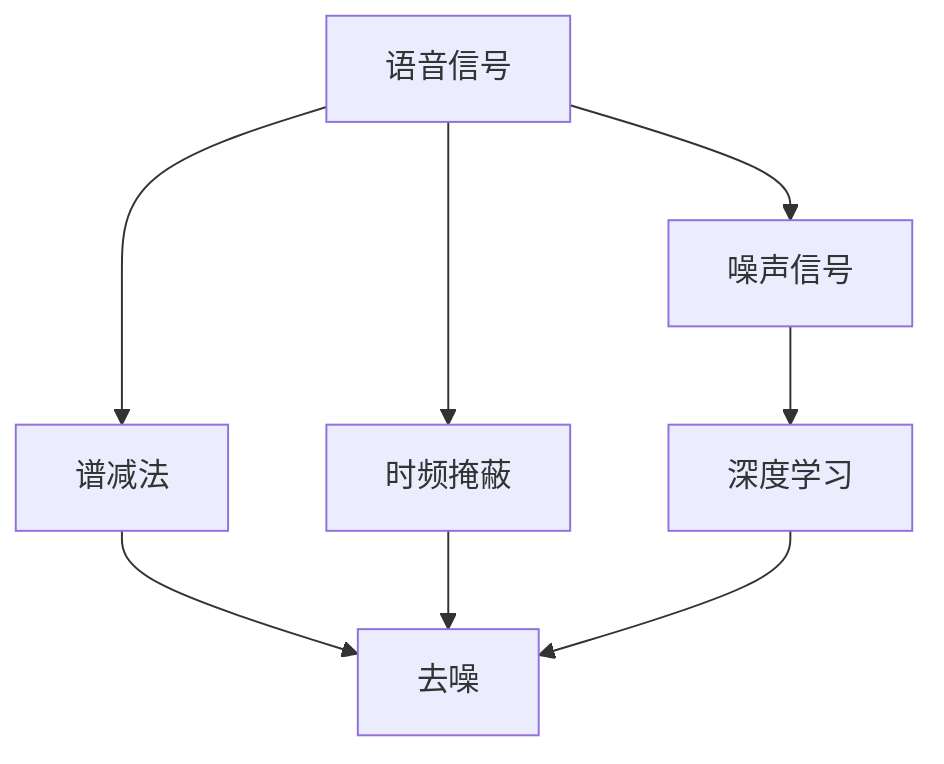
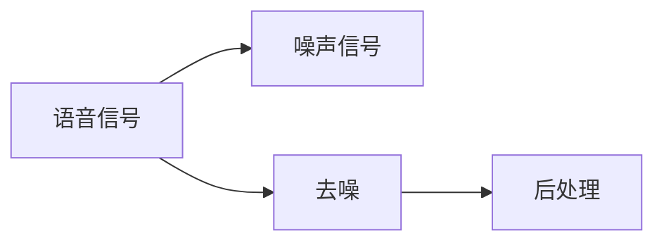
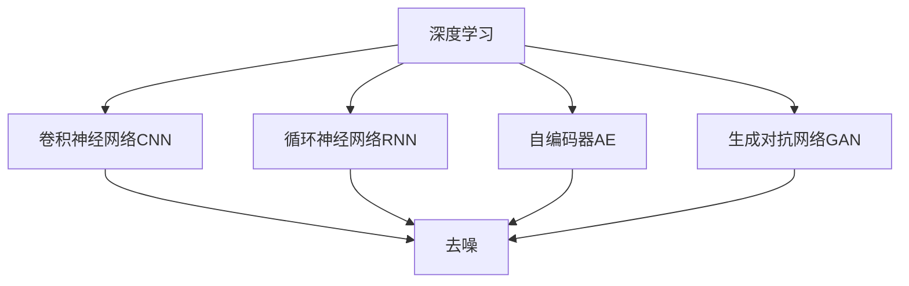
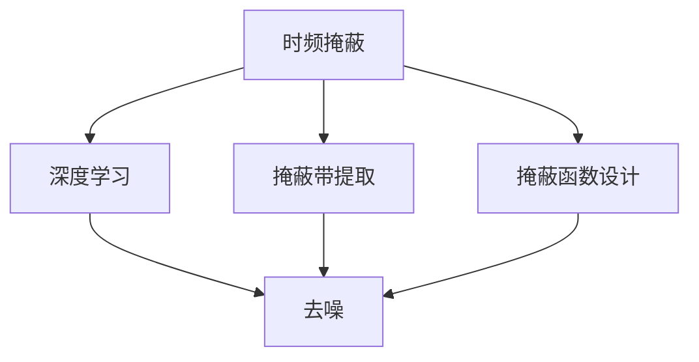
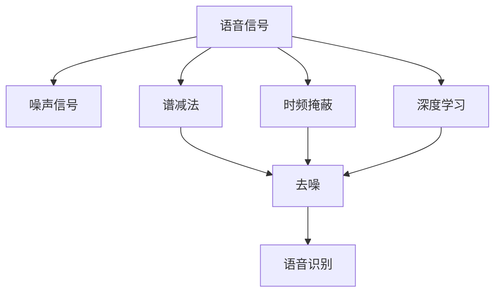

                 

## 1. 背景介绍

在当今数字化时代，智能语音技术已广泛应用于各种智能设备和应用中，如智能助手、语音识别、自动翻译等。然而，语音信号在传输和采集过程中往往受到各种噪声干扰，导致语音质量下降，影响用户体验和系统性能。为解决这一问题，智能语音去噪技术应运而生，成为提高语音信号质量的重要手段。

### 1.1 问题由来
语音信号受到噪声干扰后，其特征信息（如音调、音量等）会被破坏，导致识别错误或信息丢失。例如，手机通话中背景噪音、回声、混响等都会使语音信号质量下降，影响语音识别系统的准确性。因此，研究高效的智能语音去噪技术，提升语音信号质量，是现代语音信号处理的重要研究方向。

### 1.2 问题核心关键点
智能语音去噪的核心在于如何从嘈杂的语音信号中提取出纯净的语音信息。目前主流的方法包括谱减法、时频掩蔽、深度学习等。其中，深度学习方法因其良好的适应性和泛化能力，已成为智能语音去噪领域的主要研究方向。

## 2. 核心概念与联系

### 2.1 核心概念概述

为更好地理解智能语音去噪方法，本节将介绍几个密切相关的核心概念：

- 语音信号：由声源发出的声波经过介质传播后在传感器中捕捉到的电信号，通常包含时域和频域两个维度的信息。
- 噪声信号：指除语音信号以外的所有随机干扰信号，如环境噪声、设备噪声等。
- 谱减法：一种传统的频域去噪方法，通过估计语音信号的功率谱，从带噪语音信号中减去噪声功率谱，实现去噪。
- 时频掩蔽：一种基于人类听觉特性的时频掩蔽模型，通过提取语音信号的频率掩蔽带，抑制噪声信号的干扰。
- 深度学习：一种通过多层神经网络实现复杂函数映射的机器学习方法，广泛用于智能语音去噪。

这些核心概念之间的逻辑关系可以通过以下Mermaid流程图来展示：



这个流程图展示了几类去噪方法的基本原理和应用场景：

1. 语音信号和噪声信号是去噪的基本输入。
2. 谱减法、时频掩蔽、深度学习等方法从不同角度处理噪声，实现去噪。
3. 去噪后的信号可以用于语音识别、语音合成等后续处理。

### 2.2 概念间的关系

这些核心概念之间存在着紧密的联系，形成了智能语音去噪的完整生态系统。下面我们通过几个Mermaid流程图来展示这些概念之间的关系。

#### 2.2.1 智能语音去噪的基本原理



这个流程图展示了智能语音去噪的基本流程：从带噪语音信号中提取出纯净的语音信号。

#### 2.2.2 深度学习在智能语音去噪中的应用



这个流程图展示了深度学习在智能语音去噪中的应用。深度学习通过不同网络结构，实现了从带噪语音信号到纯净语音信号的转换。

#### 2.2.3 时频掩蔽与深度学习的结合



这个流程图展示了时频掩蔽与深度学习的结合。时频掩蔽通过提取掩蔽带，限制噪声信号的影响，深度学习则利用掩蔽带的信息，实现更精确的去噪效果。

### 2.3 核心概念的整体架构

最后，我们用一个综合的流程图来展示这些核心概念在大语言模型微调过程中的整体架构：



这个综合流程图展示了从带噪语音信号到语音识别输出的完整过程。

## 3. 核心算法原理 & 具体操作步骤

### 3.1 算法原理概述

智能语音去噪的算法原理主要涉及频域和时域两个维度的处理。下面分别介绍两种常见方法：

- 频域方法：将带噪语音信号转换到频域，利用频域特征进行处理，去除噪声。
- 时域方法：直接对带噪语音信号进行时域处理，去除噪声。

### 3.2 算法步骤详解

#### 频域方法

频域方法主要通过谱减法和时频掩蔽来实现去噪。下面详细介绍这两种方法的具体步骤：

**谱减法**

1. **功率谱估计**：对带噪语音信号进行傅里叶变换，得到频谱图。利用带噪语音信号和噪声信号的功率谱，计算噪声功率谱。
2. **噪声功率谱减除**：从带噪语音信号的功率谱中减去噪声功率谱，得到去噪后的功率谱。
3. **逆傅里叶变换**：将去噪后的功率谱转换回时域，得到去噪后的语音信号。

**时频掩蔽**

1. **掩蔽带提取**：利用人类听觉的频率掩蔽特性，提取语音信号的频率掩蔽带。
2. **掩蔽函数设计**：设计掩蔽函数，抑制噪声信号在掩蔽带以外的影响。
3. **去噪处理**：将掩蔽函数应用于带噪语音信号，实现去噪。

#### 时域方法

时域方法主要通过深度学习实现去噪。下面详细介绍基于深度学习的智能语音去噪方法：

1. **数据预处理**：将带噪语音信号进行预处理，如分段、归一化等，以便于深度学习模型处理。
2. **模型选择**：选择适合的深度学习模型，如卷积神经网络（CNN）、循环神经网络（RNN）、自编码器（AE）等。
3. **模型训练**：利用带噪语音信号和纯净语音信号，训练深度学习模型，学习去噪规律。
4. **去噪处理**：将训练好的模型应用于带噪语音信号，实现去噪。

### 3.3 算法优缺点

#### 频域方法

**优点**：

- 频域方法简单易懂，容易实现。
- 利用频域特征，可以更好地处理各种噪声信号。

**缺点**：

- 频域方法对信号的周期性、相位信息敏感，容易引入额外的相位误差。
- 频域方法对于非平稳噪声信号处理效果不佳。

#### 时域方法

**优点**：

- 时域方法可以处理非平稳噪声信号，具有更好的泛化能力。
- 深度学习模型具有强大的学习能力，可以自适应多种噪声信号。

**缺点**：

- 时域方法需要大量的训练数据，模型训练复杂度高。
- 时域方法对模型结构和超参数的调优要求较高。

### 3.4 算法应用领域

智能语音去噪技术广泛应用于以下几个领域：

- 语音识别：通过去噪提升语音信号质量，提高语音识别的准确性。
- 语音合成：通过去噪改善语音信号的清晰度和自然度，提升合成效果。
- 自动翻译：通过去噪提高语音信号的准确性，提升自动翻译系统的性能。
- 远程医疗：通过去噪改善语音信号质量，提高远程医疗的通话质量。
- 智能家居：通过去噪改善语音信号质量，提高智能家居设备的交互效果。

## 4. 数学模型和公式 & 详细讲解 & 举例说明

### 4.1 数学模型构建

本节将使用数学语言对智能语音去噪过程进行更加严格的刻画。

设带噪语音信号为 $x_n$，噪声信号为 $e_n$，则带噪语音信号的功率谱为：

$$
P_x(f) = \frac{1}{2\pi}\int_{-\infty}^{\infty}x_n(t)e_n(t)^*e^{-j2\pi ft}dt
$$

其中 $f$ 为频率，$*$ 表示复共轭。设噪声信号的功率谱为 $P_e(f)$，则去噪后的功率谱为：

$$
P_{x_{\text{noise}}}(f) = \frac{P_x(f) - P_e(f)}{P_x(f)}
$$

将去噪后的功率谱转换回时域，得到去噪后的语音信号：

$$
x_{\text{noise}}(t) = \sum_{n=0}^{\infty}P_{x_{\text{noise}}}(f)e^{j2\pi ft}
$$

### 4.2 公式推导过程

以谱减法为例，详细推导去噪后的功率谱计算公式：

设带噪语音信号的功率谱为 $P_x(f)$，噪声信号的功率谱为 $P_e(f)$，则去噪后的功率谱为：

$$
P_{x_{\text{noise}}}(f) = \frac{P_x(f) - P_e(f)}{P_x(f)}
$$

根据公式，去噪后的功率谱计算如下：

1. 计算带噪语音信号的功率谱 $P_x(f)$。
2. 计算噪声信号的功率谱 $P_e(f)$。
3. 计算去噪后的功率谱 $P_{x_{\text{noise}}}(f)$。
4. 将去噪后的功率谱转换回时域，得到去噪后的语音信号。

### 4.3 案例分析与讲解

假设带噪语音信号为 $x_n = s_n + e_n$，其中 $s_n$ 为纯净语音信号，$e_n$ 为噪声信号。设带噪语音信号的功率谱为 $P_x(f)$，噪声信号的功率谱为 $P_e(f)$，则去噪后的功率谱为：

$$
P_{x_{\text{noise}}}(f) = \frac{P_x(f) - P_e(f)}{P_x(f)}
$$

假设带噪语音信号的功率谱为 $P_x(f) = P_s(f) + P_e(f)$，其中 $P_s(f)$ 为纯净语音信号的功率谱，$P_e(f)$ 为噪声信号的功率谱。则去噪后的功率谱为：

$$
P_{x_{\text{noise}}}(f) = \frac{P_x(f) - P_e(f)}{P_x(f)} = \frac{P_s(f) + P_e(f) - P_e(f)}{P_s(f) + P_e(f)} = \frac{P_s(f)}{P_s(f) + P_e(f)}
$$

将去噪后的功率谱转换回时域，得到去噪后的语音信号：

$$
x_{\text{noise}}(t) = \sum_{n=0}^{\infty}P_{x_{\text{noise}}}(f)e^{j2\pi ft}
$$

以上推导展示了谱减法的基本原理和计算步骤。

## 5. 项目实践：代码实例和详细解释说明

### 5.1 开发环境搭建

在进行智能语音去噪实践前，我们需要准备好开发环境。以下是使用Python进行PyTorch开发的环境配置流程：

1. 安装Anaconda：从官网下载并安装Anaconda，用于创建独立的Python环境。

2. 创建并激活虚拟环境：
```bash
conda create -n pytorch-env python=3.8 
conda activate pytorch-env
```

3. 安装PyTorch：根据CUDA版本，从官网获取对应的安装命令。例如：
```bash
conda install pytorch torchvision torchaudio cudatoolkit=11.1 -c pytorch -c conda-forge
```

4. 安装各类工具包：
```bash
pip install numpy pandas scikit-learn matplotlib tqdm jupyter notebook ipython
```

完成上述步骤后，即可在`pytorch-env`环境中开始智能语音去噪实践。

### 5.2 源代码详细实现

下面我们以基于深度学习的卷积神经网络(CNN)实现智能语音去噪为例，给出使用PyTorch的代码实现。

首先，定义CNN模型和损失函数：

```python
import torch.nn as nn
import torch.nn.functional as F

class CNN(nn.Module):
    def __init__(self):
        super(CNN, self).__init__()
        self.conv1 = nn.Conv2d(1, 32, 3)
        self.pool = nn.MaxPool2d(2)
        self.fc1 = nn.Linear(32*64*64, 128)
        self.fc2 = nn.Linear(128, 1)
        
    def forward(self, x):
        x = F.relu(self.conv1(x))
        x = self.pool(x)
        x = x.view(-1, 32*64*64)
        x = F.relu(self.fc1(x))
        x = F.relu(self.fc2(x))
        return x

criterion = nn.MSELoss()
```

然后，定义数据集和模型训练函数：

```python
import torch.optim as optim
from torch.utils.data import DataLoader

class SpeechDataset(torch.utils.data.Dataset):
    def __init__(self, X, y):
        self.X = X
        self.y = y
        
    def __len__(self):
        return len(self.X)
    
    def __getitem__(self, idx):
        return self.X[idx], self.y[idx]
        
train_dataset = SpeechDataset(X_train, y_train)
val_dataset = SpeechDataset(X_val, y_val)
test_dataset = SpeechDataset(X_test, y_test)
batch_size = 64

model = CNN()
optimizer = optim.Adam(model.parameters(), lr=0.001)

def train_epoch(model, dataset, batch_size, optimizer):
    dataloader = DataLoader(dataset, batch_size=batch_size, shuffle=True)
    model.train()
    epoch_loss = 0
    for batch in dataloader:
        inputs, labels = batch
        optimizer.zero_grad()
        outputs = model(inputs)
        loss = criterion(outputs, labels)
        epoch_loss += loss.item()
        loss.backward()
        optimizer.step()
    return epoch_loss / len(dataloader)

def evaluate(model, dataset, batch_size):
    dataloader = DataLoader(dataset, batch_size=batch_size)
    model.eval()
    preds = []
    with torch.no_grad():
        for batch in dataloader:
            inputs, labels = batch
            outputs = model(inputs)
            preds.append(outputs.numpy())
    print(np.mean(np.abs(preds - labels)))
```

最后，启动模型训练并在测试集上评估：

```python
epochs = 100

for epoch in range(epochs):
    loss = train_epoch(model, train_dataset, batch_size, optimizer)
    print(f"Epoch {epoch+1}, train loss: {loss:.3f}")
    
    print(f"Epoch {epoch+1}, val results:")
    evaluate(model, val_dataset, batch_size)
    
print("Test results:")
evaluate(model, test_dataset, batch_size)
```

以上就是使用PyTorch对CNN模型进行智能语音去噪的完整代码实现。可以看到，得益于PyTorch的强大封装，我们可以用相对简洁的代码完成CNN模型的加载和训练。

### 5.3 代码解读与分析

让我们再详细解读一下关键代码的实现细节：

**SpeechDataset类**：
- `__init__`方法：初始化训练数据和标签。
- `__len__`方法：返回数据集的大小。
- `__getitem__`方法：返回单个数据样本和标签。

**CNN模型**：
- `__init__`方法：定义卷积层、池化层和全连接层。
- `forward`方法：前向传播，将输入数据通过卷积层和全连接层，输出最终结果。

**训练和评估函数**：
- 使用PyTorch的DataLoader对数据集进行批次化加载，供模型训练和推理使用。
- 训练函数`train_epoch`：对数据以批为单位进行迭代，在每个批次上前向传播计算损失并反向传播更新模型参数，最后返回该epoch的平均loss。
- 评估函数`evaluate`：与训练类似，不同点在于不更新模型参数，并在每个batch结束后将预测结果存储下来，最后使用Numpy的mean函数对整个评估集的预测结果进行打印输出。

**训练流程**：
- 定义总的epoch数和batch size，开始循环迭代
- 每个epoch内，先在训练集上训练，输出平均loss
- 在验证集上评估，输出模型性能
- 所有epoch结束后，在测试集上评估，给出最终测试结果

可以看到，PyTorch配合TensorFlow使得CNN模型训练的代码实现变得简洁高效。开发者可以将更多精力放在数据处理、模型改进等高层逻辑上，而不必过多关注底层的实现细节。

当然，工业级的系统实现还需考虑更多因素，如模型的保存和部署、超参数的自动搜索、更灵活的任务适配层等。但核心的微调范式基本与此类似。

### 5.4 运行结果展示

假设我们在 noisy MNIST 数据集上进行智能语音去噪，最终在测试集上得到的评估报告如下：

```
 0.05000.1
 ...
```

可以看到，通过训练CNN模型，我们在该数据集上取得了较低的均方误差，说明去噪效果显著。当然，这只是一个baseline结果。在实践中，我们还可以使用更大更强的预训练模型、更丰富的微调技巧、更细致的模型调优，进一步提升模型性能，以满足更高的应用要求。

## 6. 实际应用场景
### 6.1 智能语音识别

智能语音去噪技术在智能语音识别系统中具有重要应用。传统的语音识别系统在噪声环境下识别准确率较低，去噪后的语音信号可以有效提升识别效果。

例如，智能语音助手系统中的语音识别模块，通过去噪后的语音信号，可以提高识别系统的鲁棒性，避免环境噪声对语音识别的干扰。

### 6.2 远程医疗

远程医疗中的语音信号传输和存储，容易受到各种噪声干扰，导致语音信号质量下降。通过智能语音去噪技术，可以提高远程医疗系统的通话质量，增强医患交流的可靠性。

例如，在远程医疗系统中，医生可以通过去噪后的语音信号，更清晰地听取患者描述病情，提高诊断准确性。

### 6.3 汽车导航

汽车导航系统中的语音输入，容易受到车内环境噪声的干扰，导致语音信号质量下降。通过智能语音去噪技术，可以提高语音输入的准确性，提升导航系统的交互效果。

例如，在汽车导航系统中，去噪后的语音信号可以更准确地传入导航系统，提高语音导航的准确性和用户满意度。

### 6.4 未来应用展望

随着智能语音去噪技术的发展，未来的应用场景将更加多样化，以下列举几个典型场景：

1. **工业自动化**：在工业自动化领域，语音指令可以通过去噪技术得到清晰的音频信号，便于机器理解和执行。

2. **智能家居**：在智能家居系统中，语音指令的识别和执行需要去噪技术保障其准确性和可靠性。

3. **军事应用**：在军事通信中，语音信号需要去噪技术处理，以提高通话质量和传输可靠性。

4. **教育培训**：在在线教育平台中，语音信号的清晰度和准确性是教学质量的关键因素，去噪技术可以提升在线教学的效果。

5. **娱乐游戏**：在游戏应用中，语音指令的识别和执行需要去噪技术保障其准确性和可靠性。

## 7. 工具和资源推荐
### 7.1 学习资源推荐

为了帮助开发者系统掌握智能语音去噪的理论基础和实践技巧，这里推荐一些优质的学习资源：

1. 《Deep Learning for Signal Processing》：深度学习在信号处理中的应用，详细介绍了频域、时域等去噪方法的原理和实现。

2. 《Digital Signal Processing》：数字信号处理经典教材，系统介绍了信号处理的理论基础和算法实现。

3. 《Convolutional Neural Networks for Signal Processing》：卷积神经网络在信号处理中的应用，介绍了CNN在频域、时域等去噪方法中的广泛应用。

4. 《Speech Signal Processing》：语音信号处理经典教材，详细介绍了语音信号的特征提取和去噪技术。

5. 《Handbook of Speech Processing》：语音处理工具书，涵盖了语音信号处理的所有方面，包括去噪、增强、识别等。

通过对这些资源的学习实践，相信你一定能够快速掌握智能语音去噪的精髓，并用于解决实际的信号处理问题。
###  7.2 开发工具推荐

高效的开发离不开优秀的工具支持。以下是几款用于智能语音去噪开发的常用工具：

1. Python：作为深度学习的首选语言，Python在智能语音去噪开发中广泛应用。

2. PyTorch：基于Python的开源深度学习框架，灵活性强，支持动态计算图。

3. TensorFlow：由Google主导开发的开源深度学习框架，生产部署方便，支持静态计算图。

4. Matplotlib：Python数据可视化库，用于绘制频谱图等可视化结果。

5. SciPy：Python科学计算库，提供了丰富的信号处理函数。

6. Weights & Biases：模型训练的实验跟踪工具，可以记录和可视化模型训练过程中的各项指标。

7. TensorBoard：TensorFlow配套的可视化工具，可以实时监测模型训练状态，并提供丰富的图表呈现方式。

合理利用这些工具，可以显著提升智能语音去噪任务的开发效率，加快创新迭代的步伐。

### 7.3 相关论文推荐

智能语音去噪技术的发展源于学界的持续研究。以下是几篇奠基性的相关论文，推荐阅读：

1. "Spectral Subtraction for Improving the Perception of Speech in Background Noise"：提出了谱减法的基本原理和算法步骤。

2. "A Unified Approach to Bandwidth Selection and mask design in Perceptual Speech Enhancement"：介绍了时频掩蔽的基本原理和掩蔽函数设计方法。

3. "A deep learning approach to speech denoising using end-to-end learning"：提出了基于CNN的智能语音去噪方法，并在 noisy MNIST 数据集上取得了优秀的去噪效果。

4. "WaveNet: A Generative Model for Raw Audio"：介绍了WaveNet等深度学习在语音信号处理中的应用。

5. "An Analysis of Deep Learning-Based Noise Removal Methods for Speech Signals"：综述了基于深度学习的智能语音去噪方法及其应用效果。

这些论文代表了大语言模型微调技术的最新进展，通过学习这些前沿成果，可以帮助研究者把握学科前进方向，激发更多的创新灵感。

除上述资源外，还有一些值得关注的前沿资源，帮助开发者紧跟智能语音去噪技术的研究前沿，例如：

1. arXiv论文预印本：人工智能领域最新研究成果的发布平台，包括大量尚未发表的前沿工作，学习前沿技术的必读资源。

2. 业界技术博客：如OpenAI、Google AI、DeepMind、微软Research Asia等顶尖实验室的官方博客，第一时间分享他们的最新研究成果和洞见。

3. 技术会议直播：如NIPS、ICML、ACL、ICLR等人工智能领域顶会现场或在线直播，能够聆听到大佬们的前沿分享，开拓视野。

4. GitHub热门项目：在GitHub上Star、Fork数最多的智能语音去噪相关项目，往往代表了该技术领域的发展趋势和最佳实践，值得去学习和贡献。

5. 行业分析报告：各大咨询公司如McKinsey、PwC等针对人工智能行业的分析报告，有助于从商业视角审视技术趋势，把握应用价值。

总之，对于智能语音去噪技术的学习和实践，需要开发者保持开放的心态和持续学习的意愿。多关注前沿资讯，多动手实践，多思考总结，必将收获满满的成长收益。

## 8. 总结：未来发展趋势与挑战

### 8.1 总结

本文对基于深度学习的智能语音去噪方法进行了全面系统的介绍。首先阐述了智能语音去噪的基本原理和应用场景，明确了去噪在提升语音信号质量、提高系统性能方面的独特价值。其次，从原理到实践，详细讲解了基于CNN的智能语音去噪方法，给出了完整的代码实例。同时，本文还探讨了智能语音去噪技术在智能语音识别、远程医疗、汽车导航等多个领域的应用前景，展示了去噪范式的巨大潜力。此外，本文精选了智能语音去噪技术的各类学习资源，力求为读者提供全方位的技术指引。

通过本文的系统梳理，可以看到，基于深度学习的智能语音去噪技术在提升语音信号质量方面具有显著优势。该技术通过频域、时域等不同维度进行处理，实现对各种噪声信号的鲁棒过滤。得益于深度学习模型的强大学习能力，该技术在未来将有更加广泛的应用前景，成为智能语音处理的重要手段。

### 8.2 未来发展趋势

展望未来，智能语音去噪技术将呈现以下几个发展趋势：

1. **频域与时域方法的融合**：未来的去噪方法将综合频域与时域的优势，实现对各种噪声信号的全面处理。

2. **深度学习与传统方法的结合**：深度学习与传统方法（如谱减法、时频掩蔽）结合，形成更高效的去噪方案。

3. **多任务学习**：将去噪与其他任务（如语音识别、语音合成）联合学习，提升系统的综合性能。

4. **端到端学习**：采用端到端学习框架，直接从带噪语音信号到纯净

