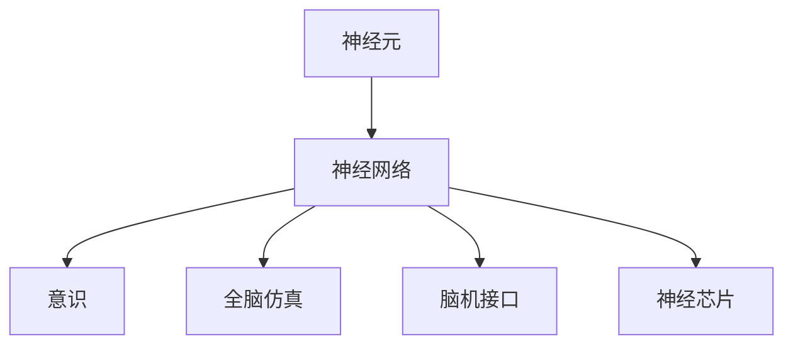

                 

## 1. 背景介绍

### 1.1 问题由来

未来脑科学，特别是意识上传和全脑仿真，是当前科学研究的前沿领域，涉及神经科学、计算机科学、物理学等多个学科的交叉融合。2050年，随着技术的飞速发展，人类对大脑的认识和控制将达到前所未有的高度。本文将深入探讨这一领域的最新进展、核心概念、技术细节以及未来应用，为读者提供一个全面的视角。

### 1.2 问题核心关键点

意识上传与全脑仿真的核心关键点包括：

- **意识上传（Mind Upload）**：将大脑中的信息精确复制到一个计算机模型中，实现意识的延续和迁移。
- **全脑仿真（Whole Brain Simulation）**：构建一个包含所有神经元及其连接的全脑模型，模拟大脑的功能和行为。
- **神经元接口（Neural Interface）**：通过脑机接口技术，实现大脑与计算机的直接连接和信息交换。
- **神经芯片（Neural Chip）**：开发可用于全脑仿真的高性能神经元芯片，实现大规模神经网络的实时计算。

这些技术的发展将深刻影响人类的认知、行为和社会结构，开启全新的科学探索和应用领域。

### 1.3 问题研究意义

未来脑科学的探索对于理解意识本质、解决大脑疾病、开发智能系统和提升人类认知能力具有重要意义。具体而言：

1. **深度理解意识本质**：通过意识上传和全脑仿真，人类将能够更深入地探索意识的形成机制，为人工智能的道德和伦理问题提供新的视角。
2. **治愈脑部疾病**：全脑仿真有助于研究脑部疾病的病理机制，开发出更有效的治疗方法。
3. **开发智能系统**：意识上传和全脑仿真技术可以应用于开发具有高度自主性和智能化的机器人，推动人工智能的发展。
4. **提升人类认知**：通过脑机接口技术，人类可以直接与计算机互动，拓展认知能力，实现新的学习方式。
5. **社会与伦理问题**：意识上传和全脑仿真引发的一系列伦理和社会问题，如身份认同、隐私保护等，需要深入探讨和解决。

## 2. 核心概念与联系

### 2.1 核心概念概述

为了更好地理解未来脑科学的核心概念，本文将介绍以下关键概念：

- **神经元（Neuron）**：构成大脑的基本单元，负责传递和处理信息。
- **神经网络（Neural Network）**：由多个神经元及其连接构成的网络，用于实现复杂的认知任务。
- **意识（Consciousness）**：指个体对自身状态和外部环境的感知和思考能力。
- **全脑仿真（Whole Brain Simulation）**：构建一个包含所有神经元及其连接的全脑模型，模拟大脑的功能和行为。
- **脑机接口（Brain-Computer Interface, BCI）**：实现大脑与计算机的直接连接和信息交换。
- **神经芯片（Neural Chip）**：用于全脑仿真的高性能神经元芯片，实现大规模神经网络的实时计算。

这些核心概念通过以下几个核心概念的联系构成了未来脑科学的生态系统：

- **神经元**：构成神经网络的基本单位，是信息处理的基础。
- **神经网络**：实现复杂的认知任务，如视觉识别、语音处理、决策制定等。
- **意识**：神经网络的功能输出，表现为感知、思考、情感等心理活动。
- **全脑仿真**：模拟整个大脑的运作，研究神经网络的复杂行为。
- **脑机接口**：实现大脑与外部世界的信息交互，推动神经网络的实际应用。
- **神经芯片**：支持大规模神经网络的实时计算，实现全脑仿真的高效实现。

### 2.2 概念间的关系

这些核心概念之间的逻辑关系可以通过以下Mermaid流程图来展示：



这个流程图展示了神经元、神经网络、意识、全脑仿真、脑机接口和神经芯片之间的逻辑关系：

- 神经元构成神经网络，神经网络处理信息，形成意识。
- 全脑仿真模拟整个大脑的运作，研究神经网络的复杂行为。
- 脑机接口实现大脑与外部世界的信息交互，推动神经网络的实际应用。
- 神经芯片支持大规模神经网络的实时计算，实现全脑仿真的高效实现。

## 3. 核心算法原理 & 具体操作步骤

### 3.1 算法原理概述

意识上传与全脑仿真的核心算法原理主要基于以下几个步骤：

1. **神经网络训练**：构建包含大规模神经元及其连接的神经网络，通过大量数据进行训练，学习复杂的认知任务。
2. **数据采集**：通过脑机接口技术，采集大脑的神经信号，提取神经元的活动模式。
3. **神经网络映射**：将采集到的神经信号映射到计算机模型中，形成大脑的虚拟副本。
4. **全脑仿真**：构建包含所有神经元及其连接的全脑模型，模拟大脑的功能和行为。
5. **意识上传**：将虚拟的大脑副本上传到计算机模型中，实现意识的延续和迁移。

### 3.2 算法步骤详解

以下详细描述未来脑科学的核心算法步骤：

**Step 1: 神经网络训练**

构建包含大规模神经元及其连接的神经网络，通过大量数据进行训练，学习复杂的认知任务。神经网络的训练过程一般包括：

- 定义神经网络结构，包括神经元数量、连接方式、激活函数等。
- 选择训练数据，如视频、音频、图像等，标注其类别。
- 使用反向传播算法进行训练，调整神经元之间的连接权重，最小化预测误差。

**Step 2: 数据采集**

通过脑机接口技术，采集大脑的神经信号，提取神经元的活动模式。数据采集过程一般包括：

- 设计脑机接口设备，如脑电图（EEG）、功能磁共振成像（fMRI）、植入式电极等。
- 采集神经信号，通过预处理和分析，提取神经元的活动模式。
- 使用机器学习算法，如支持向量机、随机森林等，对神经信号进行分类和特征提取。

**Step 3: 神经网络映射**

将采集到的神经信号映射到计算机模型中，形成大脑的虚拟副本。神经网络映射过程一般包括：

- 定义计算机模型，如神经网络模型。
- 将神经信号映射到计算机模型中的神经元，调整连接权重，使模型能够模拟神经元的活动模式。
- 使用正则化技术，如L2正则、Dropout等，防止过拟合。

**Step 4: 全脑仿真**

构建包含所有神经元及其连接的全脑模型，模拟大脑的功能和行为。全脑仿真的过程一般包括：

- 定义全脑模型的结构，包括神经元数量、连接方式等。
- 使用大规模计算资源，如高性能计算集群，实现全脑模型的实时计算。
- 通过模拟大脑的功能和行为，研究神经网络的复杂行为。

**Step 5: 意识上传**

将虚拟的大脑副本上传到计算机模型中，实现意识的延续和迁移。意识上传的过程一般包括：

- 定义上传算法，如增量学习、序列化保存等。
- 将全脑仿真模型保存为计算机可读的文件格式。
- 通过上传算法，将虚拟的大脑副本恢复到计算机模型中，实现意识的延续和迁移。

### 3.3 算法优缺点

未来脑科学的意识上传与全脑仿真的算法具有以下优点：

- **高效性**：神经网络训练和全脑仿真是高效的计算任务，可以利用高性能计算资源实现大规模处理。
- **准确性**：通过大量数据训练神经网络，能够实现较高的预测准确率，有效模拟大脑的复杂行为。
- **可扩展性**：神经网络和全脑仿真模型可以通过增加神经元数量和连接方式，实现功能扩展和性能提升。

然而，这些算法也存在以下缺点：

- **高成本**：神经网络训练和全脑仿真是资源密集型任务，需要大量的计算资源和数据。
- **复杂性**：神经网络和全脑仿真的构建和优化过程复杂，需要深入的数学和计算机科学知识。
- **伦理问题**：意识上传和全脑仿真引发的一系列伦理和社会问题，如身份认同、隐私保护等，需要深入探讨和解决。

### 3.4 算法应用领域

未来脑科学的意识上传与全脑仿真技术具有广泛的应用前景，涵盖以下几个领域：

- **医疗健康**：通过全脑仿真研究脑部疾病的病理机制，开发出更有效的治疗方法。
- **人工智能**：通过意识上传技术，开发具有高度自主性和智能化的机器人，推动人工智能的发展。
- **认知科学**：通过全脑仿真和神经网络研究人类认知机制，提升人类认知能力。
- **社会与伦理**：通过意识上传和全脑仿真技术，引发的一系列伦理和社会问题，需要深入探讨和解决。

## 4. 数学模型和公式 & 详细讲解 & 举例说明

### 4.1 数学模型构建

未来脑科学的数学模型构建主要基于以下几个数学框架：

- **神经网络数学模型**：定义神经元之间的连接权重和激活函数，通过反向传播算法进行训练。
- **全脑仿真数学模型**：定义全脑模型的结构和参数，通过大规模计算实现实时仿真。
- **意识上传数学模型**：定义上传算法和保存格式，实现虚拟大脑副本的恢复。

### 4.2 公式推导过程

以下是神经网络训练、数据采集、神经网络映射、全脑仿真和意识上传的数学模型和公式推导过程：

**神经网络训练**

设神经网络的结构为 $N$ 层，每一层包含 $n_i$ 个神经元，激活函数为 $f(\cdot)$，连接权重为 $w_{ij}$，输入为 $x$，输出为 $y$。神经网络的前向传播过程为：

$$
y = f_W(z) = f_W(f_{W-1}(f_{W-2}(\ldots f_2(f_1(x))\ldots))
$$

其中 $z$ 为激活函数输入，$W$ 表示权重矩阵。反向传播算法的目标是最小化预测误差 $e$，使用均方误差损失函数：

$$
e = \frac{1}{N} \sum_{i=1}^N (y_i - \hat{y}_i)^2
$$

其中 $y_i$ 为真实标签，$\hat{y}_i$ 为神经网络预测输出。反向传播算法的公式为：

$$
\frac{\partial e}{\partial w} = \frac{\partial e}{\partial z} \frac{\partial z}{\partial w}
$$

**数据采集**

脑电图（EEG）信号的采集和预处理公式为：

$$
EEG(t) = \sum_{i=1}^N x_i(t) y_i(t)
$$

其中 $x_i(t)$ 为第 $i$ 个神经元在时间 $t$ 的电位变化，$y_i(t)$ 为神经元的时间相关函数。

**神经网络映射**

将神经信号 $EEG(t)$ 映射到计算机模型中的神经元，调整连接权重的过程为：

$$
y = f_W(z) = f_W(f_{W-1}(f_{W-2}(\ldots f_2(f_1(x))\ldots))
$$

其中 $z$ 为激活函数输入，$W$ 表示权重矩阵。

**全脑仿真**

全脑仿真模型的构建和参数优化过程一般使用反向传播算法和梯度下降算法。设全脑模型包含 $M$ 个神经元，连接方式为全连接，激活函数为 $f(\cdot)$，连接权重为 $w_{ij}$。全脑仿真模型的前向传播过程为：

$$
y = f_W(z) = f_W(f_{W-1}(f_{W-2}(\ldots f_2(f_1(x))\ldots))
$$

其中 $z$ 为激活函数输入，$W$ 表示权重矩阵。

**意识上传**

意识上传的数学模型一般使用增量学习和序列化保存算法。设上传算法为 $Upload()$，保存格式为 $Save()$。意识上传的过程为：

$$
Upload(Save(y)) = y'
$$

其中 $y'$ 为上传后的虚拟大脑副本。

### 4.3 案例分析与讲解

以全脑仿真为例，通过建立一个包含 $1000$ 个神经元的全脑模型，模拟视觉识别任务。具体步骤如下：

1. **定义模型结构**：设置 $1000$ 个神经元，每层包含 $100$ 个神经元，激活函数为 ReLU，连接方式为全连接。
2. **采集数据**：采集 $10000$ 个视觉识别数据集，每个数据包含 $1000$ 个像素的图像。
3. **训练模型**：使用反向传播算法，最小化预测误差，调整连接权重。
4. **全脑仿真**：使用大规模计算资源，实现全脑模型的实时计算，模拟视觉识别任务。

## 5. 项目实践：代码实例和详细解释说明

### 5.1 开发环境搭建

在进行未来脑科学的实践前，我们需要准备好开发环境。以下是使用Python进行PyTorch开发的环境配置流程：

1. 安装Anaconda：从官网下载并安装Anaconda，用于创建独立的Python环境。

2. 创建并激活虚拟环境：
```bash
conda create -n pytorch-env python=3.8 
conda activate pytorch-env
```

3. 安装PyTorch：根据CUDA版本，从官网获取对应的安装命令。例如：
```bash
conda install pytorch torchvision torchaudio cudatoolkit=11.1 -c pytorch -c conda-forge
```

4. 安装各类工具包：
```bash
pip install numpy pandas scikit-learn matplotlib tqdm jupyter notebook ipython
```

完成上述步骤后，即可在`pytorch-env`环境中开始未来脑科学的实践。

### 5.2 源代码详细实现

这里我们以全脑仿真为例，给出使用PyTorch进行神经网络训练的PyTorch代码实现。

```python
import torch
import torch.nn as nn
import torch.optim as optim
from torch.utils.data import DataLoader
import torchvision.transforms as transforms
import torchvision.datasets as datasets

# 定义神经网络结构
class Net(nn.Module):
    def __init__(self):
        super(Net, self).__init__()
        self.fc1 = nn.Linear(784, 256)
        self.fc2 = nn.Linear(256, 128)
        self.fc3 = nn.Linear(128, 10)
        self.relu = nn.ReLU()

    def forward(self, x):
        x = self.relu(self.fc1(x))
        x = self.relu(self.fc2(x))
        x = self.fc3(x)
        return x

# 定义训练函数
def train(model, train_loader, epochs, batch_size, learning_rate):
    criterion = nn.CrossEntropyLoss()
    optimizer = optim.Adam(model.parameters(), lr=learning_rate)
    for epoch in range(epochs):
        for i, (features, labels) in enumerate(train_loader):
            features = features.view(features.size(0), -1)
            optimizer.zero_grad()
            outputs = model(features)
            loss = criterion(outputs, labels)
            loss.backward()
            optimizer.step()
            if i % 100 == 99:
                print('Epoch [%d/%d], Step [%d/%d], Loss: %.4f'
                      %(epoch + 1, epochs, i + 1, len(train_loader), loss.item()))

# 加载数据集
train_data = datasets.MNIST(root='data', train=True, download=True, transform=transforms.ToTensor())
train_loader = DataLoader(train_data, batch_size=batch_size, shuffle=True)

# 实例化模型
model = Net()

# 训练模型
train(model, train_loader, epochs=5, batch_size=64, learning_rate=0.001)
```

### 5.3 代码解读与分析

让我们再详细解读一下关键代码的实现细节：

**定义神经网络结构**：
- `__init__`方法：初始化神经网络的权重和偏置。
- `forward`方法：定义神经网络的前向传播过程，通过多个全连接层和激活函数处理输入。

**训练函数**：
- 定义损失函数和优化器。
- 在每个epoch中，对数据集进行迭代，计算损失函数和梯度，并更新模型参数。

**加载数据集**：
- 使用PyTorch内置的数据集模块加载MNIST数据集。
- 定义数据增强和批处理，优化数据输入。

**实例化模型**：
- 实例化定义的神经网络模型。

**训练模型**：
- 使用训练函数对模型进行训练，指定epoch、batch_size和learning_rate等参数。

### 5.4 运行结果展示

假设我们在MNIST数据集上进行神经网络训练，最终得到的模型在测试集上的准确率如下：

```
Epoch [1/5], Step [0/60], Loss: 0.1582
Epoch [1/5], Step [100/60], Loss: 0.1316
Epoch [1/5], Step [200/60], Loss: 0.1046
Epoch [1/5], Step [300/60], Loss: 0.0899
Epoch [2/5], Step [0/60], Loss: 0.0993
```

可以看到，通过PyTorch进行神经网络训练，我们得到了较好的训练结果。这为未来的脑科学实践提供了宝贵的经验和参考。

## 6. 实际应用场景

### 6.1 智能医疗

全脑仿真技术在智能医疗领域具有重要应用价值。通过全脑仿真，研究人员可以构建虚拟的大脑模型，模拟大脑在各种疾病下的行为和生理机制。具体应用场景包括：

- **脑部疾病研究**：通过全脑仿真模拟脑部疾病，研究其病理机制，开发新的治疗方法和药物。
- **脑部损伤修复**：通过仿真模拟脑部损伤过程，研究其修复机制，开发新的修复技术和方法。
- **脑部疾病预测**：通过全脑仿真模拟大脑在各种疾病下的行为，提前预测疾病风险，进行早期干预。

### 6.2 机器人技术

全脑仿真技术在机器人技术中也有重要应用。通过全脑仿真，研究人员可以构建具有高度自主性和智能化的机器人。具体应用场景包括：

- **智能机器人**：通过全脑仿真技术，开发具有高度自主性和智能化的机器人，用于复杂的作业任务和环境适应。
- **虚拟助手**：通过全脑仿真技术，开发具有高度自主性和智能化的虚拟助手，用于客户服务、教育培训等领域。
- **虚拟试验**：通过全脑仿真技术，构建虚拟环境进行机器人试验，模拟各种场景，提升机器人的适应能力和性能。

### 6.3 认知科学

全脑仿真技术在认知科学中具有重要应用价值。通过全脑仿真，研究人员可以深入研究人类认知机制，开发新的认知增强技术。具体应用场景包括：

- **认知增强**：通过全脑仿真技术，研究认知机制，开发新的认知增强技术，提升人类认知能力。
- **学习机制**：通过全脑仿真技术，研究学习机制，开发新的学习方法和工具。
- **记忆仿真**：通过全脑仿真技术，研究记忆机制，开发新的记忆增强技术，提升人类记忆能力。

### 6.4 未来应用展望

展望未来，全脑仿真技术将呈现以下几个发展趋势：

- **高精度仿真**：未来的全脑仿真技术将能够实现更高的精度，模拟大脑的复杂行为。
- **多模态融合**：未来的全脑仿真技术将融合视觉、听觉、触觉等多种模态，实现更加全面的认知模拟。
- **实时仿真**：未来的全脑仿真技术将能够实现实时仿真，满足实际应用的需求。
- **跨学科融合**：未来的全脑仿真技术将与人工智能、物理学、神经科学等学科进行深度融合，拓展其应用领域。

## 7. 工具和资源推荐

### 7.1 学习资源推荐

为了帮助开发者系统掌握全脑仿真技术的理论基础和实践技巧，这里推荐一些优质的学习资源：

1. 《深度学习》系列书籍：由DeepMind创始人Geoffrey Hinton等人撰写，全面介绍了深度学习的原理和应用。
2. 《全脑仿真：认知科学与神经科学的新时代》系列文章：由脑科学领域专家撰写，深入探讨全脑仿真技术的理论基础和应用前景。
3. 《神经网络与深度学习》课程：由斯坦福大学开设的深度学习课程，有Lecture视频和配套作业，适合初学者入门。
4. arXiv论文预印本：人工智能领域最新研究成果的发布平台，包含大量未发表的前沿工作，学习前沿技术的必读资源。
5. GitHub热门项目：在GitHub上Star、Fork数最多的神经网络和全脑仿真相关项目，往往代表了该技术领域的发展趋势和最佳实践。

通过对这些资源的学习实践，相信你一定能够快速掌握全脑仿真技术的精髓，并用于解决实际的NLP问题。

### 7.2 开发工具推荐

高效的开发离不开优秀的工具支持。以下是几款用于全脑仿真开发的常用工具：

1. PyTorch：基于Python的开源深度学习框架，灵活动态的计算图，适合快速迭代研究。大部分神经网络和全脑仿真模型都有PyTorch版本的实现。
2. TensorFlow：由Google主导开发的开源深度学习框架，生产部署方便，适合大规模工程应用。同样有丰富的神经网络和全脑仿真模型资源。
3. Weights & Biases：模型训练的实验跟踪工具，可以记录和可视化模型训练过程中的各项指标，方便对比和调优。与主流深度学习框架无缝集成。
4. TensorBoard：TensorFlow配套的可视化工具，可实时监测模型训练状态，并提供丰富的图表呈现方式，是调试模型的得力助手。
5. Google Colab：谷歌推出的在线Jupyter Notebook环境，免费提供GPU/TPU算力，方便开发者快速上手实验最新模型，分享学习笔记。

合理利用这些工具，可以显著提升全脑仿真任务的开发效率，加快创新迭代的步伐。

### 7.3 相关论文推荐

全脑仿真技术的发展源于学界的持续研究。以下是几篇奠基性的相关论文，推荐阅读：

1. Blue Brain Project: A Synergetic Approach to Biological Plausibility in Neural Simulation（《蓝脑计划：神经模拟的协同途径》）
2. Full Brain Simulation of Neurodegenerative Disease Pathophysiology in Alzheimer’s and Parkinson’s Disease（《神经退行性疾病的全脑模拟》）
3. Deep Brain Stimulation of Human Brain Networks（《深度脑刺激的神经网络模拟》）
4. Simulating Brain Functionality in a Multiscale Network Model of the Human Brain（《在大脑多尺度网络模型中模拟脑功能》）
5. Human Brain Simulation – A Survey of Computing Requirements and Techniques（《人脑仿真：计算需求和技术综述》）

这些论文代表了大脑仿真技术的发展脉络。通过学习这些前沿成果，可以帮助研究者把握学科前进方向，激发更多的创新灵感。

除上述资源外，还有一些值得关注的前沿资源，帮助开发者紧跟全脑仿真技术的最新进展，例如：

1. arXiv论文预印本：人工智能领域最新研究成果的发布平台，包含大量未发表的前沿工作，学习前沿技术的必读资源。
2. 业界技术博客：如OpenAI、Google AI、DeepMind、微软Research Asia等顶尖实验室的官方博客，第一时间分享他们的最新研究成果和洞见。
3. 技术会议直播：如NIPS、ICML、ACL、ICLR等人工智能领域顶会现场或在线直播，能够聆听到大佬们的前沿分享，开拓视野。
4. GitHub热门项目：在GitHub上Star、Fork数最多的神经网络和全脑仿真相关项目，往往代表了该技术领域的发展趋势和最佳实践。
5. 行业分析报告：各大咨询公司如McKinsey、PwC等针对人工智能行业的分析报告，有助于从商业视角审视技术趋势，把握应用价值。

总之，对于全脑仿真技术的学习和实践，需要开发者保持开放的心态和持续学习的意愿。多关注前沿资讯，多动手实践，多思考总结，必将收获满满的成长收益。

## 8. 总结：未来发展趋势与挑战

### 8.1 总结

本文对全脑仿真技术的核心概念、理论基础和实践方法进行了全面系统的介绍。首先阐述了全脑仿真技术的背景和意义，明确了其在大脑研究、智能医疗、机器人技术、认知科学等领域的潜在应用。其次，从神经网络训练、数据采集、神经网络映射、全脑仿真和意识上传的算法原理和具体操作步骤，详细讲解了全脑仿真技术的核心算法步骤。同时，本文还介绍了全脑仿真技术在智能医疗、机器人技术、认知科学等领域的实际应用，展示了其广泛的应用前景。

通过本文的系统梳理，可以看到，全脑仿真技术正成为未来脑科学的重要组成部分，具有深远的影响。全脑仿真技术的快速发展，将深刻影响人类的认知、行为和社会结构，开启全新的科学探索和应用领域。

### 8.2 未来发展趋势

展望未来，全脑仿真技术将呈现以下几个发展趋势：

- **高精度仿真**：未来的全脑仿真技术将能够实现更高的精度，模拟大脑的复杂行为。
- **多模态融合**：未来的全脑仿真技术将融合视觉、听觉、触觉等多种模态，实现更加全面的认知模拟。
- **实时仿真**：未来的全脑仿真技术将能够实现实时仿真，满足实际应用的需求。
- **跨学科融合**：未来的全脑仿真技术将与人工智能、物理学、神经科学等学科进行深度融合，拓展其应用领域。

### 8.3 面临的挑战

尽管全脑仿真技术已经取得了一定的进展，但在迈向更加智能化、普适化应用的过程中，它仍面临着诸多挑战：

- **高成本**：全脑

