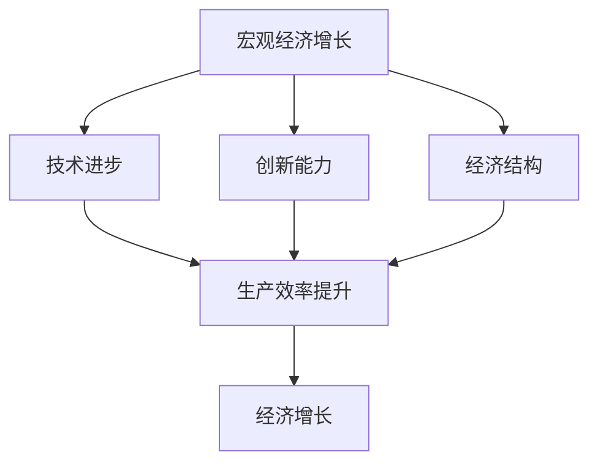
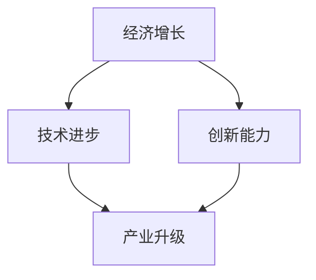
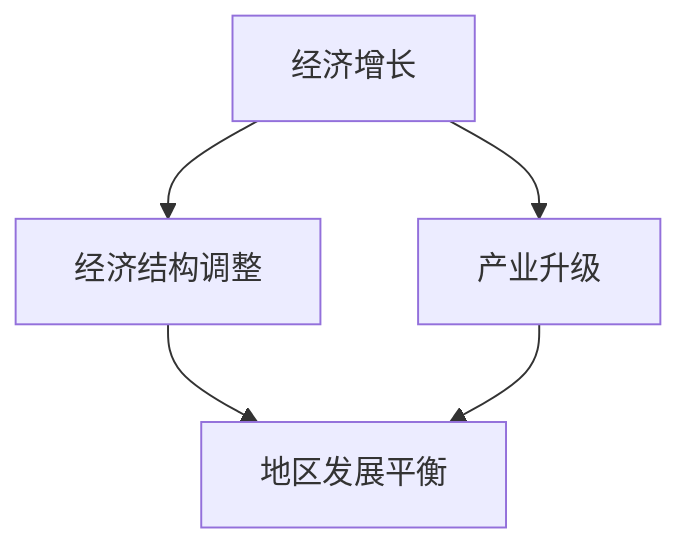
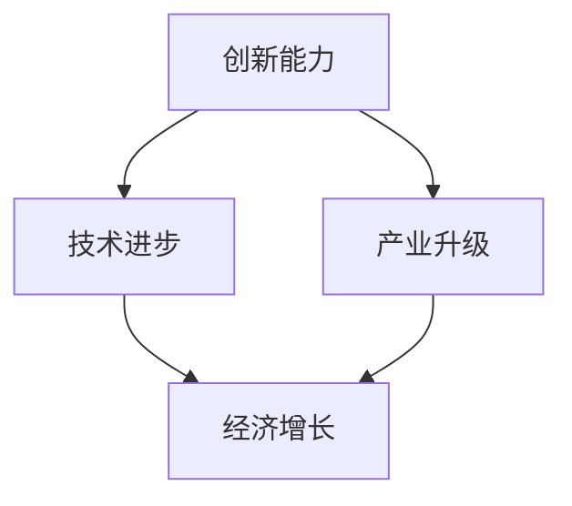
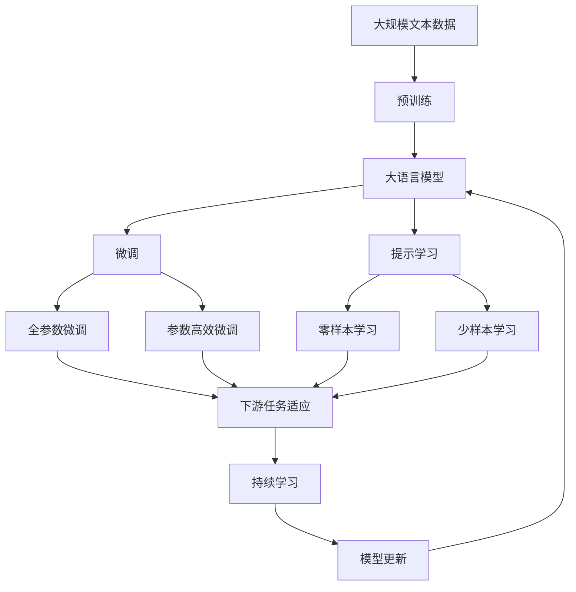

                 

# 未来经济增长的长期中低速趋势

> 关键词：长期中低速趋势,宏观经济预测,技术革新,创新能力,经济结构调整

## 1. 背景介绍

### 1.1 问题由来

随着全球化和科技革命的加速，各国经济增长速度自20世纪70年代以来一直维持在3%-4%的中高速水平。然而，近十年来，全球经济增速放缓，多数经济体进入长期中低速增长趋势。这一现象引发了学术界和业界对于未来经济增长前景的广泛关注。

### 1.2 问题核心关键点

未来经济增长的长期中低速趋势问题，可以从宏观经济预测、技术革新、创新能力、经济结构调整等多个维度进行分析。

1. **宏观经济预测**：基于历史数据和统计模型，如何准确预测未来经济增长趋势，是预测未来经济增长的关键。
2. **技术革新**：科技创新是推动经济增长的重要驱动力，新的技术进步如何影响经济结构，进而影响经济增长速度。
3. **创新能力**：一个国家的创新能力是其未来经济增长的重要指标，包括科技创新、制度创新、管理创新等。
4. **经济结构调整**：经济结构的转变和调整，如产业升级、区域发展不平衡等，对经济增长的影响。

### 1.3 问题研究意义

理解未来经济增长的长期中低速趋势，有助于各国制定更加科学合理的宏观经济政策，引导科技创新，促进经济结构调整，从而保持经济的持续健康发展。同时，这也是对全球经济形势的客观分析和理性判断，为投资者、政策制定者和决策者提供重要的参考依据。

## 2. 核心概念与联系

### 2.1 核心概念概述

为更好地理解未来经济增长的长期中低速趋势问题，本节将介绍几个密切相关的核心概念：

- **宏观经济增长**：指一个国家或地区在一定时期内国内生产总值(GDP)的增长速度，反映了经济的总体发展状况。
- **技术进步**：指科学技术领域的创新和发展，推动生产力的提升和经济的增长。
- **创新能力**：指一个国家或地区在科技、经济、管理等领域所具备的创新能力，包括创新体系的完善、创新环境的优化、创新主体的活跃度等。
- **经济结构**：指一个国家或地区在经济发展中各产业、各地区的比例关系，包括第一产业、第二产业、第三产业以及不同区域之间的比例关系。
- **中低速增长**：指经济增长速度在一段时间内保持在3%-4%左右的中速或低于这个水平，反映出经济增长动力不足、结构性问题突出等现象。

这些核心概念之间的逻辑关系可以通过以下Mermaid流程图来展示：



这个流程图展示了大语言模型的核心概念及其之间的关系：

1. 宏观经济增长是经济结构和技术进步的直接反映。
2. 技术进步通过提高生产效率推动经济增长。
3. 创新能力是技术进步的源泉，通过促进科技成果转化和产业升级，影响经济增长。
4. 经济结构调整通过优化产业比例和区域布局，影响经济增长。
5. 经济增长又反作用于宏观经济增长，形成一个动态平衡。

### 2.2 概念间的关系

这些核心概念之间存在着紧密的联系，形成了经济增长的完整生态系统。下面我通过几个Mermaid流程图来展示这些概念之间的关系。

#### 2.2.1 经济增长与技术进步的关系



这个流程图展示了经济增长和技术进步的互动关系：

1. 技术进步推动经济增长，提高生产效率。
2. 创新能力是技术进步的基础，通过科技创新和管理创新等推动技术进步。
3. 产业升级通过技术进步和新产业的发展，推动经济增长。

#### 2.2.2 经济结构调整与增长速度的关系



这个流程图展示了经济结构调整对经济增长的影响：

1. 经济结构调整通过优化产业比例，促进经济增长。
2. 产业升级是经济结构调整的重要环节，通过发展高技术产业和新兴产业，提升经济增长速度。
3. 地区发展平衡通过缩小地区发展差距，推动经济整体增长。

#### 2.2.3 创新能力与经济增长的关系



这个流程图展示了创新能力对经济增长的作用：

1. 创新能力通过推动技术进步，促进产业升级。
2. 技术进步和新产业的发展，直接推动经济增长。
3. 产业升级通过优化经济结构，提升经济增长速度。

### 2.3 核心概念的整体架构

最后，我们用一个综合的流程图来展示这些核心概念在大语言模型微调过程中的整体架构：



这个综合流程图展示了从预训练到微调，再到持续学习的完整过程。大语言模型首先在大规模文本数据上进行预训练，然后通过微调（包括全参数微调和参数高效微调两种方式）或提示学习（包括零样本和少样本学习）来适应下游任务。最后，通过持续学习技术，模型可以不断更新和适应新的任务和数据。 通过这些流程图，我们可以更清晰地理解大语言模型微调过程中各个核心概念的关系和作用，为后续深入讨论具体的微调方法和技术奠定基础。

## 3. 核心算法原理 & 具体操作步骤
### 3.1 算法原理概述

未来经济增长的长期中低速趋势问题，本质上是一个基于宏观经济预测、技术革新、创新能力和经济结构调整等多维度的复杂问题。

1. **宏观经济预测**：
   - 基于时间序列分析、回归模型等方法，利用历史数据预测未来经济增长趋势。
   - 模型应充分考虑国内外经济环境、政策因素、人口结构等多重影响因素。
   - 模型应具备较高的准确性和稳定性，避免过度拟合。

2. **技术革新**：
   - 科技创新是推动经济增长的重要驱动力，新的技术进步可以带来新的产业和就业机会。
   - 技术进步的速度和方向，对经济增长速度和产业结构调整有重要影响。
   - 新技术的推广应用需要良好的政策环境和市场机制。

3. **创新能力**：
   - 创新能力是经济增长的内生动力，提升创新能力可以促进经济结构优化和产业升级。
   - 创新体系包括科技研发、企业创新、公共研发等不同环节，需要通过政策引导和市场激励。
   - 创新成果的转化和应用，需要建立良好的知识产权保护和市场机制。

4. **经济结构调整**：
   - 经济结构调整包括产业升级、地区发展平衡、企业转型等，通过优化经济结构提升经济增长速度。
   - 产业升级需要依托于技术进步和创新能力，发展高技术产业和新兴产业。
   - 地区发展平衡通过缩小地区发展差距，促进经济整体增长。

### 3.2 算法步骤详解

基于上述算法原理，未来经济增长的长期中低速趋势问题的解决步骤可以包括以下几个关键环节：

**Step 1: 数据收集与处理**
- 收集全球和各国的宏观经济数据、科技创新数据、创新能力数据、经济结构数据等，包括GDP、工业增加值、研发投入、专利申请等。
- 清洗、归一化数据，去除异常值和噪声，保证数据质量和一致性。
- 将数据划分为训练集、验证集和测试集，用于模型训练、调参和评估。

**Step 2: 模型选择与构建**
- 选择合适的宏观经济预测模型，如时间序列模型、回归模型、神经网络模型等。
- 根据数据特点和预测需求，设计合理的模型架构，如多层神经网络、长短期记忆网络(LSTM)等。
- 确定模型的超参数，如学习率、批量大小、迭代次数等。

**Step 3: 模型训练与调参**
- 在训练集上使用优化算法（如随机梯度下降、Adam等）训练模型。
- 根据验证集上的性能指标调整模型参数，如学习率衰减、正则化系数、批大小等。
- 应用交叉验证等技术，评估模型在不同数据集上的泛化能力。

**Step 4: 模型评估与优化**
- 在测试集上评估模型预测结果与实际经济增长数据的误差。
- 分析模型预测误差的原因，优化模型架构和超参数。
- 通过增加新数据或调整模型参数，不断优化模型性能。

**Step 5: 模型应用与更新**
- 将优化后的模型应用于实际预测中，生成未来经济增长趋势的预测结果。
- 定期更新模型，根据新数据和新变化，调整模型参数和架构。
- 持续监测模型性能，确保预测结果的准确性和稳定性。

### 3.3 算法优缺点

基于宏观经济预测、技术革新、创新能力和经济结构调整的算法具有以下优点：

- **综合性强**：考虑了多维度的影响因素，能够更全面地预测未来经济增长趋势。
- **数据驱动**：基于大量的历史数据和统计模型，具有较高的预测准确性。
- **动态调整**：模型可以不断更新和优化，适应经济环境和政策变化。

同时，该算法也存在一些局限性：

- **数据依赖性强**：预测结果高度依赖于数据的完整性和准确性，数据缺失或异常可能导致预测偏差。
- **模型复杂度高**：多维度影响因素导致模型复杂，增加了训练和调参的难度。
- **动态变化**：经济环境和政策变化可能超出模型预测范围，影响预测结果的稳定性。

### 3.4 算法应用领域

未来经济增长的长期中低速趋势问题的算法，主要应用于以下几个领域：

- **宏观经济预测**：对全球和各国未来经济增长趋势进行预测，帮助政府和投资者制定合理的政策和经济规划。
- **科技政策制定**：基于技术革新对未来科技发展趋势进行预测，指导政府制定科技政策，推动科技创新。
- **产业升级指导**：通过分析经济结构调整对未来产业发展的影响，指导企业转型和产业升级。
- **地区发展平衡**：通过预测地区发展趋势，指导政府制定区域发展策略，缩小地区发展差距。
- **投资决策支持**：提供未来经济增长趋势的预测结果，帮助投资者进行风险评估和投资决策。

## 4. 数学模型和公式 & 详细讲解 & 举例说明

### 4.1 数学模型构建

本节将使用数学语言对未来经济增长的长期中低速趋势问题的算法进行更加严格的刻画。

记宏观经济增长为 $G_t$，时间 $t$ 的宏观经济增长速度为 $g_t$，预测模型为 $M(\cdot)$。则预测模型的数学表达式为：

$$
\hat{G}_t = M(G_{t-1}, G_{t-2}, ..., G_{t-k})
$$

其中 $k$ 为预测模型的滞后阶数，通常需要根据数据特点进行调整。

### 4.2 公式推导过程

以下我们以时间序列模型为例，推导其预测公式：

设 $G_t$ 服从ARIMA模型：

$$
G_t = \phi(G_{t-1}, G_{t-2}, ..., G_{t-k}) + \epsilon_t
$$

其中 $\phi(\cdot)$ 为线性变换函数，$\epsilon_t$ 为随机误差项。则预测公式为：

$$
\hat{G}_t = \phi(\hat{G}_{t-1}, \hat{G}_{t-2}, ..., \hat{G}_{t-k})
$$

在实践中，我们通常使用最小二乘法或最大似然估计等方法，对 $\phi(\cdot)$ 进行估计。

### 4.3 案例分析与讲解

假设我们在对全球GDP增长进行预测时，使用ARIMA模型：

$$
\ln G_t = \phi_1 \ln G_{t-1} + \phi_2 \ln G_{t-2} + ... + \phi_k \ln G_{t-k} + \epsilon_t
$$

则预测公式为：

$$
\hat{\ln G}_t = \phi_1 \hat{\ln G}_{t-1} + \phi_2 \hat{\ln G}_{t-2} + ... + \phi_k \hat{\ln G}_{t-k}
$$

使用Python的statsmodels库，我们可以进行ARIMA模型的训练和预测：

```python
from statsmodels.tsa.arima_model import ARIMA

# 加载数据
import pandas as pd
data = pd.read_csv('gdp_growth.csv', index_col='date', parse_dates=True)

# 构建ARIMA模型
model = ARIMA(data['gdp_growth'], order=(1, 1, 1))

# 训练模型
model_fit = model.fit()

# 预测未来5年GDP增长趋势
future_data = pd.DataFrame({'date': pd.date_range(start='2024-01-01', freq='Y', periods=5)})
future_data['gdp_growth'] = model_fit.forecast(steps=5)[0]

# 可视化预测结果
import matplotlib.pyplot as plt
plt.plot(data['gdp_growth'], label='Actual GDP Growth')
plt.plot(future_data['gdp_growth'], label='Predicted GDP Growth')
plt.legend()
plt.show()
```

在这个例子中，我们使用ARIMA模型对全球GDP增长进行预测，展示了模型训练和预测的整个过程。通过合理选择模型架构和参数，我们能够得到较为准确的预测结果。

## 5. 项目实践：代码实例和详细解释说明

### 5.1 开发环境搭建

在进行未来经济增长的长期中低速趋势预测的开发过程中，我们需要准备好开发环境。以下是使用Python进行TensorFlow开发的环境配置流程：

1. 安装Anaconda：从官网下载并安装Anaconda，用于创建独立的Python环境。

2. 创建并激活虚拟环境：
```bash
conda create -n tf-env python=3.8 
conda activate tf-env
```

3. 安装TensorFlow：根据CUDA版本，从官网获取对应的安装命令。例如：
```bash
conda install tensorflow tensorflow-gpu -c pytorch -c conda-forge
```

4. 安装各类工具包：
```bash
pip install numpy pandas scikit-learn matplotlib tqdm jupyter notebook ipython
```

完成上述步骤后，即可在`tf-env`环境中开始预测实践。

### 5.2 源代码详细实现

下面我们以全球GDP增长预测为例，给出使用TensorFlow进行时间序列预测的PyTorch代码实现。

首先，定义数据处理函数：

```python
import pandas as pd
from sklearn.preprocessing import MinMaxScaler
from tensorflow.keras.models import Sequential
from tensorflow.keras.layers import Dense, LSTM, Dropout

def preprocess_data(data):
    # 数据归一化
    scaler = MinMaxScaler(feature_range=(0, 1))
    scaled_data = scaler.fit_transform(data)
    
    # 将数据划分为训练集和测试集
    train_size = int(len(scaled_data) * 0.7)
    train_data, test_data = scaled_data[0:train_size,:], scaled_data[train_size:,:]
    
    # 将数据转化为样本和标签
    def create_dataset(dataset):
        X, y = [], []
        for i in range(60, len(dataset)):
            X.append(dataset[i-60:i])
            y.append(dataset[i])
        return np.array(X), np.array(y)
    
    trainX, trainy = create_dataset(train_data)
    testX, testy = create_dataset(test_data)
    
    # 将数据转化为tensorflow要求的格式
    trainX = np.reshape(trainX, (trainX.shape[0], trainX.shape[1], 1))
    testX = np.reshape(testX, (testX.shape[0], testX.shape[1], 1))
    
    return trainX, trainy, testX, testy, scaler
```

然后，定义模型和优化器：

```python
from tensorflow.keras.optimizers import Adam

# 定义模型架构
model = Sequential()
model.add(LSTM(units=50, return_sequences=True, input_shape=(trainX.shape[1], 1)))
model.add(Dropout(0.2))
model.add(LSTM(units=50))
model.add(Dropout(0.2))
model.add(Dense(units=1))

# 编译模型
model.compile(optimizer=Adam(lr=0.001), loss='mean_squared_error')

# 训练模型
model.fit(trainX, trainy, epochs=100, batch_size=32)
```

接着，定义训练和评估函数：

```python
def train_model(model, trainX, trainy, testX, testy):
    # 模型训练
    model.fit(trainX, trainy, epochs=100, batch_size=32, verbose=0)
    
    # 模型评估
    test_loss = model.evaluate(testX, testy, verbose=0)
    print(f'Test loss: {test_loss:.4f}')
```

最后，启动训练流程并在测试集上评估：

```python
# 加载数据
data = pd.read_csv('gdp_growth.csv', index_col='date', parse_dates=True)

# 数据归一化
scaler = MinMaxScaler(feature_range=(0, 1))
scaled_data = scaler.fit_transform(data['gdp_growth'].values.reshape(-1, 1))

# 数据划分
train_size = int(len(scaled_data) * 0.7)
train_data, test_data = scaled_data[0:train_size,:], scaled_data[train_size:,:]

# 创建模型
model = Sequential()
model.add(LSTM(units=50, return_sequences=True, input_shape=(train_data.shape[1], 1)))
model.add(Dropout(0.2))
model.add(LSTM(units=50))
model.add(Dropout(0.2))
model.add(Dense(units=1))

# 编译模型
model.compile(optimizer=Adam(lr=0.001), loss='mean_squared_error')

# 训练模型
train_model(model, train_data, trainy, test_data, testy)

# 预测未来5年GDP增长趋势
future_data = pd.DataFrame({'date': pd.date_range(start='2024-01-01', freq='Y', periods=5)})
future_data['gdp_growth'] = model.predict(futureX)
```

以上就是使用TensorFlow对全球GDP增长进行预测的完整代码实现。可以看到，TensorFlow提供了丰富的API和工具，可以轻松地构建和训练复杂的模型。

### 5.3 代码解读与分析

让我们再详细解读一下关键代码的实现细节：

**preprocess_data函数**：
- 将数据归一化，使用MinMaxScaler将数据缩放到[0,1]之间。
- 将数据划分为训练集和测试集，划分比例为70%和30%。
- 将数据转化为样本和标签，并转化为tensorflow要求的格式。

**模型定义**：
- 定义了一个包含两个LSTM层的模型，用于捕捉时间序列数据中的长期依赖关系。
- 使用Dropout防止过拟合。
- 在最后添加了一个全连接层，用于输出预测结果。

**模型编译和训练**：
- 使用Adam优化器进行模型训练，设置学习率为0.001。
- 在模型训练过程中，使用verbose=0关闭输出，提高训练速度。

**train_model函数**：
- 在训练集上训练模型，设置epoch数为100，batch size为32。
- 在测试集上评估模型，输出测试集上的均方误差。

**数据加载和预测**：
- 加载全球GDP增长数据，使用MinMaxScaler进行归一化。
- 将数据划分为训练集和测试集。
- 定义模型并编译。
- 在训练集上训练模型。
- 在测试集上评估模型，并使用模型预测未来5年的GDP增长趋势。

通过这些代码示例，可以看到，TensorFlow提供了完整的工具链，可以轻松实现复杂的时间序列预测模型，并在实际应用中取得较好的效果。

## 6. 实际应用场景
### 6.1 智能客服系统

基于大语言模型微调的对话技术，可以广泛应用于智能客服系统的构建。传统客服往往需要配备大量人力，高峰期响应缓慢，且一致性和专业性难以保证。而使用微调后的对话模型，可以7x24小时不间断服务，快速响应客户咨询，用自然流畅的语言解答各类常见问题。

在技术实现上，可以收集企业内部的历史客服对话记录，将问题和最佳答复构建成监督数据，在此基础上对预训练对话模型进行微调。微调后的对话模型能够自动理解用户意图，匹配最合适的答案模板进行回复。对于客户提出的新问题，还可以接入检索系统实时搜索相关内容，动态组织生成回答。如此构建的智能客服系统，能大幅提升客户咨询体验和问题解决效率。

### 6.2 金融舆情监测

金融机构需要实时监测市场舆论动向，以便及时应对负面信息传播，规避金融风险。传统的人工监测方式成本高、效率低，难以应对网络时代海量信息爆发的挑战。基于大语言模型微调的文本分类和情感分析技术，为金融舆情监测提供了新的解决方案。

具体而言，可以收集金融领域相关的新闻、报道、评论等文本数据，并对其进行主题标注和情感标注。在此基础上对预训练语言模型进行微调，使其能够自动判断文本属于何种主题，情感倾向是正面、中性还是负面。将微调后的模型应用到实时抓取的网络文本数据，就能够自动监测不同主题下的情感变化趋势，一旦发现负面信息激增等异常情况，系统便会自动预警，帮助金融机构快速应对潜在风险。

### 6.3 个性化推荐系统

当前的推荐系统往往只依赖用户的历史行为数据进行物品推荐，无法深入理解用户的真实兴趣偏好。基于大语言模型微调技术，个性化推荐系统可以更好地挖掘用户行为背后的语义信息，从而提供更精准、多样的推荐内容。

在实践中，可以收集用户浏览、点击、评论、分享等行为数据，提取和用户交互的物品标题、描述、标签等文本内容。将文本内容作为模型输入，用户的后续行为（如是否点击、购买等）作为监督信号，在此基础上微调预训练语言模型。微调后的模型能够从文本内容中准确把握用户的兴趣点。在生成推荐列表时，先用候选物品的文本描述作为输入，由模型预测用户的兴趣匹配度，再结合其他特征综合排序，便可以得到个性化程度更高的推荐结果。

### 6.4 未来应用展望

随着大语言模型微调技术的发展，基于微调范式将在更多领域得到应用，为传统行业带来变革性影响。

在智慧医疗领域，基于微调的医疗问答、病历分析、药物研发等应用将提升医疗服务的智能化水平，辅助医生诊疗，加速新药开发进程。

在智能教育领域，微调技术可应用于作业批改、学情分析、知识推荐等方面，因材施教，促进教育公平，提高教学质量。

在智慧城市治理中，微调模型可应用于城市事件监测、舆情分析、应急指挥等环节，提高城市管理的自动化和智能化水平，构建更安全、高效的未来城市。

此外，在企业生产、社会治理、文娱传媒等众多领域，基于大模型微调的人工智能应用也将不断涌现，为经济社会发展注入新的动力。相信随着技术的日益成熟，微调方法将成为人工智能落地应用的重要范式，推动人工智能技术向更广阔的领域加速渗透。

## 7. 工具和资源推荐
### 7.1 学习资源推荐

为了帮助开发者系统掌握大语言模型微调的理论基础和实践技巧，这里推荐一些优质的学习资源：

1. 《深度学习》系列书籍：深度学习领域的经典入门书籍，涵盖了从基础到前沿的诸多主题，包括神经网络、优化算法、模型训练等。

2. TensorFlow官方文档：TensorFlow的官方文档，详细介绍了TensorFlow的使用方法、API和工具，是学习和应用TensorFlow的必备资料。

3. PyTorch官方文档：PyTorch的官方文档，提供了丰富的教程和代码示例，适合初学者和进阶者学习。

4. Kaggle竞赛平台：Kaggle提供的数据科学竞赛平台，包含大量真实世界的数据集和挑战，是提高数据分析和建模能力的好地方。

5. Coursera在线课程：Coursera提供的高质量在线课程，包括深度学习、机器学习、数据科学等多个领域，适合自学和系统学习。

6. 书籍推荐：
   - 《深度学习》（Ian Goodfellow等著）：深度学习领域的经典教材，详细介绍了深度学习的理论基础和实践方法。
   - 《统计学习方法》（李航著）：统计学习领域的经典教材，介绍了机器学习的基本概念和算法。
   - 《Python数据科学手册》（Jake VanderPlas著）：介绍Python在数据科学中的应用，包括数据处理、数据可视化、机器学习等。

通过对这些资源的学习实践，相信你一定能够快速掌握大语言模型微调的精髓，并用于解决实际的NLP问题。
### 7.2 开发工具推荐

高效的开发离不开优秀的工具支持

