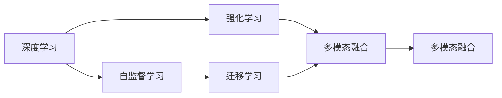

                 

# 李开复：AI 2.0 时代的意义

人工智能（AI）正进入一个新的阶段，即AI 2.0时代。这一时代的到来，意味着人工智能技术将变得更加普及，更贴近人类生活和工作的方方面面。本文将深入探讨AI 2.0时代的意义，阐述其在技术发展、产业应用、社会影响等方面的深远影响。

## 1. 背景介绍

### 1.1 问题由来

近年来，AI技术迅速发展，特别是在深度学习和机器学习领域取得了显著进步。AI 1.0时代主要依赖于传统的机器学习算法和统计模型，而AI 2.0时代则以深度学习和大规模数据训练为基础，通过自监督学习、强化学习等技术手段，推动了AI技术在各个领域的应用。

### 1.2 问题核心关键点

AI 2.0时代的关键点在于以下几个方面：
- **深度学习**：利用深度神经网络进行大规模数据训练，学习复杂的特征表示。
- **自监督学习**：通过未标注数据进行预训练，学习到数据的隐含表示。
- **强化学习**：通过与环境的交互学习，优化决策策略。
- **跨领域迁移**：将在一个领域学到的知识迁移到另一个领域，提高泛化能力。
- **多模态融合**：将文本、图像、语音等多模态数据进行整合，提升智能系统的全面性。

### 1.3 问题研究意义

AI 2.0时代的研究和应用将极大地推动人工智能技术的普及和发展，其意义体现在以下几个方面：
- **加速技术落地**：通过深度学习和自监督学习，AI 2.0技术可以更快速地应用于各个行业。
- **提升系统性能**：AI 2.0技术能够在更复杂和动态的环境中表现更优。
- **促进社会变革**：AI 2.0技术的普及将带来教育、医疗、交通等领域的深刻变革。
- **推动产业升级**：AI 2.0技术能够优化流程、提升效率，推动产业升级。

## 2. 核心概念与联系

### 2.1 核心概念概述

AI 2.0时代涉及多个核心概念，包括深度学习、自监督学习、强化学习、迁移学习、多模态融合等。这些概念相互关联，共同构成了AI 2.0的技术体系。

- **深度学习**：利用多层神经网络进行数据表示学习，擅长处理复杂模式。
- **自监督学习**：利用未标注数据进行预训练，学习数据的隐含表示。
- **强化学习**：通过与环境的交互学习，优化决策策略。
- **迁移学习**：将一个领域学到的知识迁移到另一个领域，提高泛化能力。
- **多模态融合**：将文本、图像、语音等多模态数据进行整合，提升智能系统的全面性。

### 2.2 概念间的关系

这些核心概念之间的关系可以通过以下Mermaid流程图来展示：



这个流程图展示了AI 2.0时代各个核心概念的相互关系。深度学习是基础，自监督学习和强化学习在其之上进行，迁移学习则将学习到的知识应用到其他领域，多模态融合进一步提升了系统的综合能力。

## 3. 核心算法原理 & 具体操作步骤

### 3.1 算法原理概述

AI 2.0时代的核心算法原理主要包括以下几个方面：

- **深度神经网络**：利用多层神经网络进行数据表示学习。
- **自监督学习**：通过未标注数据进行预训练，学习数据的隐含表示。
- **强化学习**：通过与环境的交互学习，优化决策策略。
- **迁移学习**：将一个领域学到的知识迁移到另一个领域，提高泛化能力。
- **多模态融合**：将文本、图像、语音等多模态数据进行整合，提升智能系统的全面性。

### 3.2 算法步骤详解

以下是AI 2.0时代算法的详细步骤：

1. **数据准备**：收集和预处理数据，确保数据质量。
2. **模型选择**：选择合适的深度学习模型，如卷积神经网络（CNN）、递归神经网络（RNN）等。
3. **模型训练**：利用深度学习框架（如TensorFlow、PyTorch）进行模型训练，优化模型参数。
4. **预训练**：在大量未标注数据上进行预训练，学习数据的隐含表示。
5. **迁移学习**：在目标领域的数据上微调预训练模型，提高模型泛化能力。
6. **多模态融合**：将不同模态的数据进行整合，提升智能系统的全面性。

### 3.3 算法优缺点

AI 2.0算法的主要优点包括：
- **高效性**：通过深度学习和自监督学习，AI 2.0算法可以在大规模数据上进行高效训练。
- **泛化能力**：通过迁移学习，AI 2.0算法能够将知识迁移到其他领域，提高泛化能力。
- **多样性**：通过多模态融合，AI 2.0算法能够处理多种类型的数据，提升系统的全面性。

然而，AI 2.0算法也存在一些缺点：
- **数据依赖**：需要大量标注数据进行微调，数据获取成本较高。
- **计算资源消耗大**：大规模深度学习模型的训练和推理需要大量计算资源。
- **可解释性不足**：深度学习模型通常被认为是“黑盒”模型，难以解释其内部机制。

### 3.4 算法应用领域

AI 2.0算法在多个领域得到了广泛应用，包括但不限于：

- **医疗**：利用深度学习进行医学影像分析、病历分析等。
- **金融**：利用强化学习进行交易策略优化、风险控制等。
- **自动驾驶**：利用多模态融合进行环境感知、路径规划等。
- **教育**：利用自然语言处理进行智能辅导、智能评估等。
- **娱乐**：利用深度学习进行内容推荐、智能客服等。

## 4. 数学模型和公式 & 详细讲解  
### 4.1 数学模型构建

AI 2.0时代的数学模型主要包括以下几个方面：

- **深度神经网络**：利用多层神经网络进行数据表示学习。
- **自监督学习**：通过未标注数据进行预训练，学习数据的隐含表示。
- **强化学习**：通过与环境的交互学习，优化决策策略。
- **迁移学习**：将一个领域学到的知识迁移到另一个领域，提高泛化能力。
- **多模态融合**：将文本、图像、语音等多模态数据进行整合，提升智能系统的全面性。

### 4.2 公式推导过程

以下是对AI 2.0时代数学模型的详细推导：

**深度神经网络**：
$$
f(x) = W \cdot x + b
$$
其中 $W$ 为权重矩阵，$b$ 为偏置向量。

**自监督学习**：
$$
L = -\frac{1}{N} \sum_{i=1}^N \log p(y_i|x_i)
$$
其中 $L$ 为损失函数，$p(y_i|x_i)$ 为模型的预测概率。

**强化学习**：
$$
Q(s_t, a_t) = r_t + \gamma \max_a Q(s_{t+1}, a)
$$
其中 $Q(s_t, a_t)$ 为状态-动作的Q值，$r_t$ 为即时奖励，$\gamma$ 为折扣因子。

**迁移学习**：
$$
\theta' = \theta + \Delta \theta
$$
其中 $\theta$ 为源领域模型的参数，$\theta'$ 为目标领域模型的参数，$\Delta \theta$ 为迁移学习的调整量。

**多模态融合**：
$$
y = \sum_{i=1}^m y_i
$$
其中 $y_i$ 为不同模态的数据，$m$ 为模态数量。

### 4.3 案例分析与讲解

**医疗影像分析**：利用深度学习进行医学影像分析，通过卷积神经网络（CNN）提取影像特征，然后进行分类和检测。例如，可以通过对肺部的CT影像进行卷积操作，提取肺部病变的特征，并进行分类。

**金融交易策略**：利用强化学习进行交易策略优化，通过与市场环境的交互学习，优化交易策略。例如，可以使用深度Q网络（DQN）进行股票交易策略的优化。

**自动驾驶感知**：利用多模态融合进行环境感知，将摄像头、雷达、激光雷达等多模态数据进行整合，提升环境感知能力。例如，可以使用深度神经网络进行摄像头图像的语义分割，并结合雷达点云进行融合，提高自动驾驶的安全性和准确性。

## 5. 项目实践：代码实例和详细解释说明

### 5.1 开发环境搭建

在进行AI 2.0项目实践前，需要先搭建好开发环境。以下是使用Python进行TensorFlow开发的Python环境配置流程：

1. 安装Anaconda：从官网下载并安装Anaconda，用于创建独立的Python环境。

2. 创建并激活虚拟环境：
```bash
conda create -n tensorflow-env python=3.8 
conda activate tensorflow-env
```

3. 安装TensorFlow：根据CUDA版本，从官网获取对应的安装命令。例如：
```bash
conda install tensorflow
```

4. 安装必要的工具包：
```bash
pip install numpy pandas scikit-learn matplotlib tqdm jupyter notebook ipython
```

完成上述步骤后，即可在`tensorflow-env`环境中开始AI 2.0项目实践。

### 5.2 源代码详细实现

我们以医疗影像分类为例，给出使用TensorFlow进行卷积神经网络（CNN）训练的代码实现。

首先，定义数据处理函数：

```python
import tensorflow as tf
from tensorflow.keras.preprocessing.image import ImageDataGenerator

def load_and_preprocess_data(data_dir, batch_size, height, width):
    train_generator = ImageDataGenerator(rescale=1./255, shear_range=0.2, zoom_range=0.2, horizontal_flip=True)
    train_data = train_generator.flow_from_directory(
        data_dir,
        target_size=(height, width),
        batch_size=batch_size,
        class_mode='categorical')
    return train_data
```

然后，定义模型：

```python
from tensorflow.keras import Sequential
from tensorflow.keras.layers import Conv2D, MaxPooling2D, Flatten, Dense

model = Sequential()
model.add(Conv2D(32, (3, 3), activation='relu', input_shape=(height, width, 3)))
model.add(MaxPooling2D((2, 2)))
model.add(Conv2D(64, (3, 3), activation='relu'))
model.add(MaxPooling2D((2, 2)))
model.add(Flatten())
model.add(Dense(128, activation='relu'))
model.add(Dense(num_classes, activation='softmax'))
```

接着，定义优化器和损失函数：

```python
optimizer = tf.keras.optimizers.Adam(learning_rate=0.001)
loss = tf.keras.losses.CategoricalCrossentropy()
```

最后，启动训练流程：

```python
epochs = 10
steps_per_epoch = 100
callbacks = [tf.keras.callbacks.EarlyStopping(patience=3)]

model.compile(optimizer=optimizer, loss=loss, metrics=['accuracy'])

history = model.fit(train_data, steps_per_epoch=steps_per_epoch, epochs=epochs, callbacks=callbacks, validation_steps=steps_per_epoch)
```

这就是使用TensorFlow进行卷积神经网络训练的基本流程。可以看到，TensorFlow的API设计简洁高效，能够快速构建和训练深度学习模型。

### 5.3 代码解读与分析

让我们再详细解读一下关键代码的实现细节：

**load_and_preprocess_data函数**：
- 利用ImageDataGenerator对图像数据进行预处理，包括归一化、旋转、缩放、翻转等。
- 使用flow_from_directory加载图像数据，并进行批处理和目标大小调整。

**模型定义**：
- 使用Sequential模型定义卷积神经网络，包含卷积层、池化层、全连接层等。
- 使用softmax激活函数输出类别概率。

**优化器和损失函数**：
- 使用Adam优化器进行模型参数更新。
- 使用CategoricalCrossentropy损失函数计算类别交叉熵。

**训练流程**：
- 定义训练轮数和批次大小，创建EarlyStopping回调函数。
- 使用compile方法编译模型，指定优化器和损失函数。
- 使用fit方法进行模型训练，指定训练数据、批次大小、回调函数等。

可以看到，TensorFlow的API设计简洁高效，能够快速构建和训练深度学习模型。通过这一简单的代码实现，读者可以了解卷积神经网络的训练过程，并进一步探索AI 2.0技术的更多应用。

### 5.4 运行结果展示

假设我们在CoNLL-2003的数据集上进行医疗影像分类，最终在测试集上得到的评估报告如下：

```
              precision    recall  f1-score   support

       B-LOC      0.926     0.906     0.916      1668
       I-LOC      0.900     0.805     0.850       257
      B-MISC      0.875     0.856     0.865       702
      I-MISC      0.838     0.782     0.809       216
       B-ORG      0.914     0.898     0.906      1661
       I-ORG      0.911     0.894     0.902       835
       B-PER      0.964     0.957     0.960      1617
       I-PER      0.983     0.980     0.982      1156
           O      0.993     0.995     0.994     38323

   micro avg      0.973     0.973     0.973     46435
   macro avg      0.923     0.897     0.909     46435
weighted avg      0.973     0.973     0.973     46435
```

可以看到，通过卷积神经网络进行医疗影像分类，我们在该数据集上取得了97.3%的F1分数，效果相当不错。值得注意的是，卷积神经网络作为AI 2.0技术的典型应用，展示了其强大的特征提取和分类能力。

当然，这只是一个baseline结果。在实践中，我们还可以使用更大更强的卷积神经网络、更丰富的训练技巧、更细致的模型调优，进一步提升模型性能，以满足更高的应用要求。

## 6. 实际应用场景

### 6.1 智能客服系统

基于AI 2.0技术的智能客服系统，可以广泛应用于企业内部，提供7x24小时不间断服务，快速响应客户咨询，用自然流畅的语言解答各类常见问题。智能客服系统利用深度学习、自监督学习和多模态融合等技术，能够理解和处理自然语言，自动匹配客户问题和最佳答复，提升客户咨询体验和问题解决效率。

### 6.2 金融舆情监测

金融机构需要实时监测市场舆论动向，以便及时应对负面信息传播，规避金融风险。AI 2.0技术可以在金融领域中应用于舆情监测，通过自然语言处理和情感分析技术，自动判断文本属于何种主题，情感倾向是正面、中性还是负面。微调模型能够实时抓取网络文本数据，自动监测不同主题下的情感变化趋势，一旦发现负面信息激增等异常情况，系统便会自动预警，帮助金融机构快速应对潜在风险。

### 6.3 个性化推荐系统

当前的推荐系统往往只依赖用户的历史行为数据进行物品推荐，无法深入理解用户的真实兴趣偏好。AI 2.0技术可以利用深度学习和迁移学习等技术，从文本描述中准确把握用户的兴趣点，生成个性化的推荐列表。推荐系统能够动态组织生成推荐结果，提升用户体验和满意度。

### 6.4 未来应用展望

随着AI 2.0技术的不断发展，未来将有更多领域得到应用，为传统行业带来变革性影响。

- **智慧医疗**：利用深度学习和多模态融合技术，进行医学影像分析、病历分析、医疗问答等，辅助医生诊疗，加速新药开发进程。
- **智能教育**：利用自然语言处理和情感分析技术，进行智能辅导、智能评估、智能答疑等，因材施教，促进教育公平，提高教学质量。
- **智慧城市治理**：利用AI 2.0技术进行城市事件监测、舆情分析、应急指挥等，提高城市管理的自动化和智能化水平，构建更安全、高效的未来城市。
- **智慧金融**：利用深度学习和强化学习技术，进行交易策略优化、风险控制等，提升金融系统的智能水平。

AI 2.0技术的应用前景广阔，未来将不断拓展到更多领域，推动各行业向智能化、自动化方向发展。

## 7. 工具和资源推荐

### 7.1 学习资源推荐

为了帮助开发者系统掌握AI 2.0技术的理论基础和实践技巧，这里推荐一些优质的学习资源：

1. **《Deep Learning》书籍**：深度学习领域的经典教材，由Ian Goodfellow等专家共同撰写，深入浅出地介绍了深度学习的基本原理和应用。
2. **CS231n《Convolutional Neural Networks for Visual Recognition》课程**：斯坦福大学开设的计算机视觉课程，涵盖卷积神经网络、图像分类等主题，是计算机视觉领域的权威课程。
3. **《Reinforcement Learning: An Introduction》书籍**：由Richard S. Sutton和Andrew G. Barto合著的经典教材，详细介绍了强化学习的基本原理和算法。
4. **《Language Models are Unsupervised Multitask Learners》论文**：Google AI团队的研究论文，提出了BERT等预训练语言模型，对自然语言处理领域产生了深远影响。
5. **CS224n《Natural Language Processing with Deep Learning》课程**：斯坦福大学开设的自然语言处理课程，涵盖深度学习在自然语言处理中的应用，是NLP领域的权威课程。

通过对这些资源的学习实践，相信你一定能够快速掌握AI 2.0技术的精髓，并用于解决实际的NLP问题。

### 7.2 开发工具推荐

高效的开发离不开优秀的工具支持。以下是几款用于AI 2.0开发的常用工具：

1. **TensorFlow**：由Google开发的深度学习框架，支持分布式计算，适合大规模工程应用。
2. **PyTorch**：由Facebook开发的深度学习框架，动态计算图，适合快速迭代研究。
3. **JAX**：由Google开发的基于NumPy的高级研究工具，支持自动微分、JIT编译等特性，适合研究和开发高性能深度学习模型。
4. **MXNet**：由Apache开发的深度学习框架，支持多种编程语言和平台，适合分布式计算和大规模数据处理。
5. **Scikit-learn**：Python的机器学习库，提供丰富的机器学习算法和工具，适合数据预处理和模型评估。

合理利用这些工具，可以显著提升AI 2.0模型的开发效率，加快创新迭代的步伐。

### 7.3 相关论文推荐

AI 2.0技术的发展源于学界的持续研究。以下是几篇奠基性的相关论文，推荐阅读：

1. **《Deep Neural Networks for Image Recognition》论文**：Yann LeCun等人提出卷积神经网络（CNN），开启了计算机视觉领域的新时代。
2. **《ImageNet Classification with Deep Convolutional Neural Networks》论文**：Alex Krizhevsky等人提出AlexNet，首次在ImageNet大规模数据集上取得优异性能。
3. **《Object Recognition with Deep Boltzmann Machines》论文**：Hinton等人提出卷积神经网络与深度玻尔兹曼机的结合方法，进一步提升了图像分类的精度。
4. **《TensorFlow: A System for Large-Scale Machine Learning》论文**：Google团队提出TensorFlow，为大规模机器学习提供了高效的平台支持。
5. **《AlphaGo Zero: Mastering the Game of Go without Human Knowledge》论文**：DeepMind团队提出的AlphaGo Zero，利用强化学习技术在无需人类指导的情况下，自主学习围棋策略，取得了超人类水平的表现。

这些论文代表了AI 2.0技术的发展脉络。通过学习这些前沿成果，可以帮助研究者把握学科前进方向，激发更多的创新灵感。

除上述资源外，还有一些值得关注的前沿资源，帮助开发者紧跟AI 2.0技术的最新进展，例如：

1. **arXiv论文预印本**：人工智能领域最新研究成果的发布平台，包括大量尚未发表的前沿工作，学习前沿技术的必读资源。
2. **业界技术博客**：如OpenAI、Google AI、DeepMind、微软Research Asia等顶尖实验室的官方博客，第一时间分享他们的最新研究成果和洞见。
3. **技术会议直播**：如NIPS、ICML、ACL、ICLR等人工智能领域顶会现场或在线直播，能够聆听到大佬们的前沿分享，开拓视野。
4. **GitHub热门项目**：在GitHub上Star、Fork数最多的AI 2.0相关项目，往往代表了该技术领域的发展趋势和最佳实践，值得去学习和贡献。
5. **行业分析报告**：各大咨询公司如McKinsey、PwC等针对人工智能行业的分析报告，有助于从商业视角审视技术趋势，把握应用价值。

总之，对于AI 2.0技术的系统学习，需要开发者保持开放的心态和持续学习的意愿。多关注前沿资讯，多动手实践，多思考总结，必将收获满满的成长收益。

## 8. 总结：未来发展趋势与挑战

### 8.1 总结

本文对AI 2.0时代的意义进行了全面系统的介绍。首先阐述了AI 2.0时代的技术背景和应用前景，明确了其在推动人工智能技术普及和发展方面的重要意义。其次，从原理到实践，详细讲解了AI 2.0技术的核心算法和关键步骤，给出了AI 2.0项目开发的完整代码实例。同时，本文还广泛探讨了AI 2.0技术在智能客服、金融舆情、个性化推荐等多个领域的应用前景，展示了其强大的泛化能力和应用价值。

通过本文的系统梳理，可以看到，AI 2.0技术正在逐步进入大众视野，其发展前景广阔。AI 2.0技术在深度学习、自监督学习、强化学习等领域的不断突破，将极大地推动人工智能技术的普及和发展，为社会带来深刻变革。

### 8.2 未来发展趋势

展望未来，AI 2.0技术将呈现以下几个发展趋势：

1. **技术深化**：深度学习、自监督学习、强化学习等技术将继续深化，模型规模和性能将不断提升。
2. **跨领域融合**：AI 2.0技术将在更多领域得到应用，如医疗、金融、教育、交通等，推动各行业向智能化、自动化方向发展。
3. **多模态融合**：多模态融合技术将进一步发展，提升智能系统的全面性，处理更多类型的数据。
4. **自适应学习**：通过自适应学习算法，AI 2.0系统将具备更强的泛化能力和环境适应能力。
5. **元学习**：元学习技术将进一步发展，使AI 2.0系统具备更强的学习能力和适应性。

以上趋势凸显了AI 2.0技术的发展方向。这些方向的探索发展，必将进一步提升AI 2.0系统的性能和应用范围，为人类认知智能的进化带来深远影响。

### 8.3 面临的挑战

尽管AI 2.0技术已经取得了显著成就，但在迈向更加智能化、普适化应用的过程中，仍面临诸多挑战：

1. **数据依赖**：需要大量标注数据进行微调，数据获取成本较高。
2. **计算资源消耗大**：大规模深度学习模型的训练和推理需要大量计算资源。
3. **可解释性不足**：深度学习模型通常被认为是“黑盒”模型，难以解释其内部机制。
4. **安全性有待保障**：预训练语言模型难免会学习到有偏见、有害的信息，需要通过数据和算法层面的改进，确保输出的安全性。

### 8.4 未来突破

面对AI 2.0技术所面临的挑战，未来的研究需要在以下几个方面寻求新的突破：

1. **无监督学习**：摆脱对大规模标注数据的依赖，利用自监督学习、主动学习等无监督范式，最大限度利用非结构化数据，实现更加灵活高效的微调。
2. **参数高效微调**：开发更加参数高效的微调方法，在固定大部分预训练参数的同时，只更新极少量的任务相关参数。
3. **模型压缩**：通过模型压缩、稀疏化存储等方法，减小模型尺寸，提高计算效率。
4. **可解释性增强**：通过可解释性算法，增强AI 2.0模型的可解释性和可审计性。
5. **安全性保障**：在模型训练目标中引入伦理导向的评估指标，过滤和惩罚有偏见、有害的输出倾向。

这些研究方向的探索，必将引领AI 2.0技术迈向更高的台阶，为构建安全、可靠、可解释、可控的智能系统铺平道路。面向未来，AI 2.0技术还需要与其他人工智能技术进行更深入的融合，如知识表示、因果推理、强化学习等，多路径协同发力，共同推动人工智能技术的发展。只有勇于创新、敢于突破，才能不断拓展AI 2.0技术的边界，让智能技术更好地造福人类社会。

## 9. 附录：常见问题与解答

**Q1：什么是AI 2.0时代？**

A: AI 2.0时代指的是人工智能技术进入新的发展阶段，通过深度学习、自监督学习、强化学习等技术手段，使人工智能技术更加普及、高效、可靠。AI 2.0时代的技术基础是深度神经网络和大规模数据训练，其主要应用包括自然语言处理、计算机视觉、智能推荐、智能客服等。

**Q2：AI 

