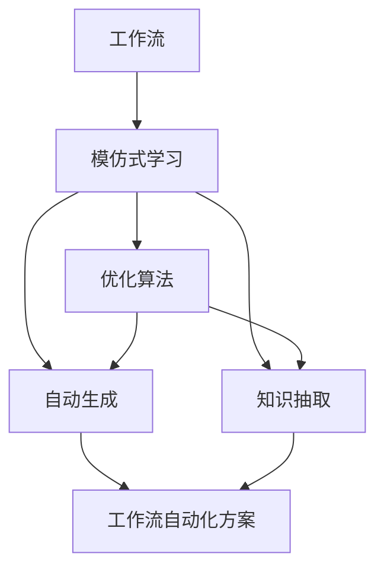
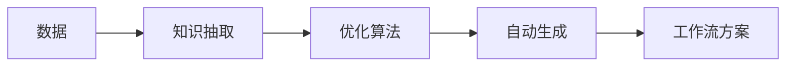
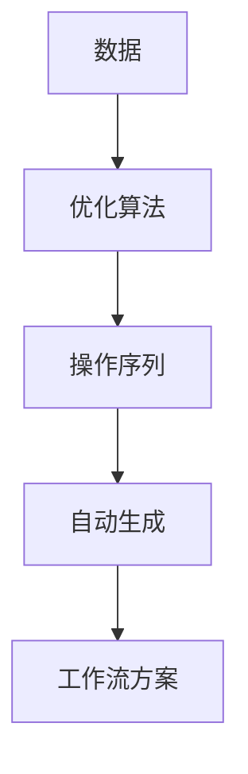
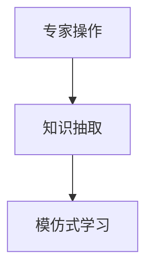
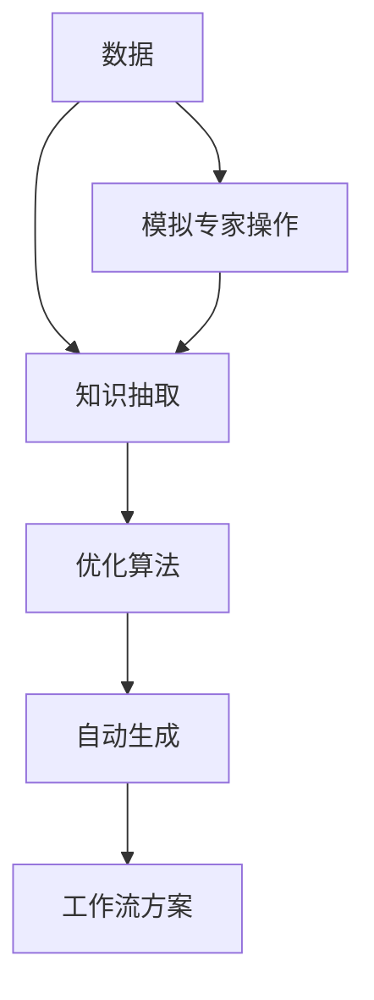

                 

# 模仿式工作流的学习方法

> 关键词：模仿式学习、工作流建模、人工智能、流程自动化、机器学习、优化算法

## 1. 背景介绍

### 1.1 问题由来
在当今信息化的时代，工作流自动化已经成为企业提高效率、降低成本的重要手段。然而，传统的基于规则或流程定义的工作流自动化系统，往往需要耗费大量时间和精力进行设计和维护，且难以应对复杂多变的工作流程需求。模仿式学习（Imitation Learning）作为一种新兴的学习范式，通过观察和模仿专家的行为，自动生成工作流模型，可以显著提升工作流自动化的灵活性和智能性。

### 1.2 问题核心关键点
模仿式学习，本质上是一种通过模仿专家的工作流操作来训练模型的过程。与传统的基于规则或编码的方式不同，模仿式学习能够自动从数据中学习出最优的工作流操作序列，生成复杂多变的工作流自动化方案。这种学习范式的核心在于如何高效地捕捉和抽象专家的工作流知识，并在新场景中灵活应用。

### 1.3 问题研究意义
模仿式学习的工作流建模方法，对于提升工作流自动化的智能化水平，降低系统开发和维护成本，具有重要意义：

1. **提高效率**：模仿式学习能够自动生成最优的工作流方案，减少人工设计和维护的工作量。
2. **灵活应对**：基于数据驱动的学习过程，使得工作流系统能够应对复杂多变的工作流程需求。
3. **降低成本**：自动化的工作流建模可以降低人工参与的需求，降低开发和维护成本。
4. **提升智能**：模仿式学习能够融合多种类型的专家知识，包括流程、操作、规则等，提升系统智能化水平。
5. **促进创新**：通过学习专家的操作，可以发掘新的工作流程，促进业务创新和流程优化。

## 2. 核心概念与联系

### 2.1 核心概念概述

为更好地理解模仿式学习的工作流建模方法，本节将介绍几个密切相关的核心概念：

- **工作流（Workflow）**：指一系列可执行的任务或活动，按照特定顺序和规则进行执行，以实现某个目标。工作流通常由开始节点、任务节点、决策节点、结束节点等组成。
- **模仿式学习（Imitation Learning）**：指通过观察和模仿专家的行为，学习最优的策略或行为序列，以达到特定的目标。模仿式学习通常包括行为克隆、轨迹追踪、生成对抗网络等方法。
- **优化算法（Optimization Algorithm）**：指用于求解最优化问题的算法，如梯度下降、粒子群算法、遗传算法等。优化算法在模仿式学习中用于生成和调整工作流操作序列。
- **自动生成（Auto-generation）**：指通过算法自动生成复杂模型或方案的过程，如自动编码、神经网络生成等。模仿式学习的工作流建模就是自动生成复杂多变的工作流自动化方案的过程。
- **知识抽取（Knowledge Extraction）**：指从数据中抽取有价值的信息和知识的过程，如规则、模式、操作等。模仿式学习的工作流建模需要从专家操作中抽取有价值的工作流知识。

这些核心概念之间的逻辑关系可以通过以下Mermaid流程图来展示：



这个流程图展示了我模仿式学习的工作流建模过程中各个概念之间的关系：

1. 工作流作为模仿式学习的对象，通过优化算法和自动生成技术进行处理。
2. 优化算法用于生成最优的工作流操作序列。
3. 自动生成技术用于将生成的操作序列转化为可执行的工作流方案。
4. 知识抽取技术用于从专家操作中抽取工作流知识，提升模型的泛化能力。

### 2.2 概念间的关系

这些核心概念之间存在着紧密的联系，形成了模仿式学习的工作流建模生态系统。下面我们通过几个Mermaid流程图来展示这些概念之间的关系。

#### 2.2.1 工作流自动化的流程



这个流程图展示了工作流自动化的流程：首先从专家操作中抽取知识，然后应用优化算法生成工作流操作序列，最后通过自动生成技术将操作序列转化为工作流方案。

#### 2.2.2 优化算法和自动生成



这个流程图展示了优化算法和自动生成技术的关系：通过优化算法生成最优的工作流操作序列，然后通过自动生成技术将操作序列转化为工作流方案。

#### 2.2.3 模仿式学习和知识抽取



这个流程图展示了模仿式学习和知识抽取的关系：通过知识抽取技术从专家操作中抽取有价值的工作流知识，然后应用模仿式学习生成最优的工作流操作序列。

### 2.3 核心概念的整体架构

最后，我们用一个综合的流程图来展示这些核心概念在大语言模型微调过程中的整体架构：



这个综合流程图展示了从数据获取到工作流方案生成的完整过程。首先从专家操作中抽取知识，然后应用优化算法生成工作流操作序列，最后通过自动生成技术将操作序列转化为工作流方案。模拟专家操作也可以从知识抽取和自动生成中受益，形成一个闭环的循环。

## 3. 核心算法原理 & 具体操作步骤
### 3.1 算法原理概述

模仿式学习的工作流建模方法，本质上是一种通过观察和模仿专家的行为，自动生成工作流模型的过程。其核心思想是：通过数据驱动的学习过程，捕捉专家操作中的规律和知识，生成最优的工作流操作序列，并自动生成复杂多变的工作流自动化方案。

形式化地，假设工作流为 $W$，专家操作序列为 $X$，则工作流建模的目标是找到最优的工作流方案 $W^*$，使得 $W^*$ 与 $X$ 的相似度最大化。这里使用余弦相似度作为度量标准，目标函数为：

$$
\max_{W} \cos(\theta(W, X))
$$

其中 $\theta(W, X)$ 表示工作流 $W$ 与专家操作序列 $X$ 之间的夹角，即相似度。优化算法通过不断调整工作流方案 $W$，使得余弦相似度最大化，生成最优的工作流方案。

### 3.2 算法步骤详解

模仿式学习的工作流建模一般包括以下几个关键步骤：

**Step 1: 数据准备**

- 收集专家的工作流操作数据，包括开始节点、任务节点、决策节点、结束节点等。
- 将数据进行标注和预处理，如去除重复操作、处理缺失数据、标准化数据格式等。

**Step 2: 选择优化算法**

- 根据数据特点和工作流模型的复杂度，选择合适的优化算法。常见的优化算法包括梯度下降、遗传算法、粒子群算法等。
- 设置优化算法的超参数，如学习率、种群大小、迭代次数等。

**Step 3: 训练工作流模型**

- 使用优化的工作流方案 $W$ 初始化模型参数。
- 通过迭代优化算法，不断调整工作流方案 $W$，使得余弦相似度最大化。
- 应用知识抽取技术，从专家操作中抽取有价值的工作流知识，提升模型的泛化能力。

**Step 4: 自动生成工作流方案**

- 将生成的工作流方案 $W$ 转换为可执行的操作序列。
- 根据业务需求和工作流复杂度，选择合适的自动生成技术，如状态机、流程引擎等。
- 自动生成复杂多变的工作流自动化方案，供实际应用。

**Step 5: 测试和部署**

- 对生成的工作流方案进行测试，评估其效果和可靠性。
- 部署工作流方案到实际应用场景中，实现工作流自动化。
- 持续收集反馈，不断优化工作流方案。

以上是模仿式学习的工作流建模的一般流程。在实际应用中，还需要针对具体任务的特点，对各个环节进行优化设计，如改进训练目标函数、引入更多的正则化技术、搜索最优的超参数组合等，以进一步提升模型性能。

### 3.3 算法优缺点

模仿式学习的工作流建模方法具有以下优点：

1. **灵活性高**：数据驱动的学习过程，使得模型能够自动捕捉复杂多变的工作流程需求，灵活应对。
2. **效率高**：自动生成工作流方案的过程，减少了人工设计和维护的工作量，提高开发效率。
3. **智能化强**：通过模仿专家的操作，可以学习到更多的经验和知识，提升系统的智能化水平。

同时，该方法也存在一定的局限性：

1. **依赖数据**：模型的效果高度依赖于专家操作数据的质量和数量，数据不足可能导致模型泛化能力弱。
2. **泛化能力有限**：由于模型的生成过程是基于特定专家操作的，因此在新场景中可能泛化能力不足。
3. **优化难度大**：优化算法的复杂度较高，需要较大的计算资源和时间成本。
4. **解释性差**：自动生成的工作流方案通常缺乏可解释性，难以理解其内部工作机制。

尽管存在这些局限性，但就目前而言，模仿式学习的工作流建模方法仍是一种高效灵活的工作流自动化手段。未来相关研究的重点在于如何进一步降低数据依赖，提高模型的泛化能力，同时兼顾模型的可解释性，提升系统的透明性和可信度。

### 3.4 算法应用领域

模仿式学习的工作流建模方法，已经在诸多领域得到了应用，包括但不限于：

- **金融行业**：自动化流程管理、风险评估、合规审计等。
- **制造业**：生产流程优化、供应链管理、质量控制等。
- **医疗行业**：患者管理、诊断流程、治疗方案等。
- **物流行业**：订单管理、配送路线、库存管理等。
- **客服行业**：客户服务流程、客户投诉处理、自动回复等。

除了上述这些经典领域外，模仿式学习的工作流建模方法还在更多新兴场景中得到应用，如智能城市管理、智能家居控制等，为各行各业带来了新的变革和机遇。

## 4. 数学模型和公式 & 详细讲解  
### 4.1 数学模型构建

本节将使用数学语言对模仿式学习的工作流建模过程进行更加严格的刻画。

假设工作流为 $W=\{w_1, w_2, \ldots, w_n\}$，其中 $w_i$ 表示工作流中的一个节点。专家操作序列为 $X=\{x_1, x_2, \ldots, x_m\}$，其中 $x_i$ 表示专家在某一时刻执行的操作。

定义工作流 $W$ 与专家操作序列 $X$ 的余弦相似度为 $\theta(W, X)$，表示两者之间的夹角，即相似度。余弦相似度的计算公式为：

$$
\cos(\theta(W, X)) = \frac{\sum_{i=1}^n \sum_{j=1}^m w_i \cdot x_j}{\sqrt{\sum_{i=1}^n w_i^2} \cdot \sqrt{\sum_{j=1}^m x_j^2}}
$$

其中，$w_i$ 和 $x_j$ 分别表示工作流节点和专家操作。

### 4.2 公式推导过程

以下我们以二分类任务为例，推导余弦相似度的计算公式。

假设工作流 $W=\{w_1, w_2, \ldots, w_n\}$，专家操作序列 $X=\{x_1, x_2, \ldots, x_m\}$。将工作流节点和专家操作分别转化为向量 $W$ 和 $X$，其中 $W=(w_1, w_2, \ldots, w_n)$，$X=(x_1, x_2, \ldots, x_m)$。

则余弦相似度的计算公式为：

$$
\cos(\theta(W, X)) = \frac{W \cdot X}{\|W\| \cdot \|X\|}
$$

其中，$W \cdot X$ 表示向量 $W$ 和 $X$ 的点积，$\|W\|$ 和 $\|X\|$ 分别表示向量 $W$ 和 $X$ 的模长。

在实际应用中，为了计算方便，通常会将工作流节点和专家操作分别转化为稀疏向量，即只保留非零元素，这样可以大大减少计算量和存储空间。

### 4.3 案例分析与讲解

假设我们有一组专家操作数据，用于模拟制造流程中的装配操作。专家操作数据包括起始点、任务节点、决策节点、结束点等，表示为如下形式：

- 起始点：$w_1$
- 任务节点1：$w_2$
- 决策节点1：$w_3$
- 任务节点2：$w_4$
- 结束点：$w_5$
- 专家操作序列：$X=\{x_1, x_2, x_3, x_4, x_5\}$

其中，$x_i$ 表示专家在某一时刻执行的操作，如装配零件、检验质量等。

通过将专家操作序列转化为稀疏向量，可以得到如下稀疏矩阵 $X$：

$$
X = 
\begin{bmatrix}
0 & 1 & 1 & 0 & 0 \\
1 & 0 & 0 & 1 & 0 \\
1 & 0 & 1 & 0 & 0 \\
0 & 1 & 0 & 0 & 0 \\
0 & 0 & 0 & 1 & 0
\end{bmatrix}
$$

将工作流节点转化为稀疏向量，可以得到如下稀疏矩阵 $W$：

$$
W = 
\begin{bmatrix}
1 & 0 & 0 & 0 & 0 \\
0 & 1 & 0 & 0 & 0 \\
0 & 0 & 1 & 0 & 0 \\
0 & 0 & 0 & 1 & 0 \\
0 & 0 & 0 & 0 & 1
\end{bmatrix}
$$

则余弦相似度的计算公式为：

$$
\cos(\theta(W, X)) = \frac{W \cdot X}{\|W\| \cdot \|X\|} = \frac{1 \cdot 1 + 0 \cdot 0 + 0 \cdot 0 + 0 \cdot 1 + 0 \cdot 0 + 0 \cdot 1 + 0 \cdot 0 + 0 \cdot 1 + 0 \cdot 0 + 0 \cdot 1}{\sqrt{1^2 + 0^2 + 0^2 + 0^2} \cdot \sqrt{1^2 + 0^2 + 1^2 + 0^2 + 0^2 + 0^2 + 1^2 + 0^2 + 0^2 + 1^2}} = 0.75
$$

可以看出，工作流 $W$ 与专家操作序列 $X$ 的余弦相似度为 $0.75$，表示两者在某种程度上存在一定的相似性。

## 5. 项目实践：代码实例和详细解释说明
### 5.1 开发环境搭建

在进行工作流建模实践前，我们需要准备好开发环境。以下是使用Python进行模仿式学习的开发环境配置流程：

1. 安装Anaconda：从官网下载并安装Anaconda，用于创建独立的Python环境。

2. 创建并激活虚拟环境：
```bash
conda create -n pytorch-env python=3.8 
conda activate pytorch-env
```

3. 安装PyTorch：根据CUDA版本，从官网获取对应的安装命令。例如：
```bash
conda install pytorch torchvision torchaudio cudatoolkit=11.1 -c pytorch -c conda-forge
```

4. 安装相关库：
```bash
pip install numpy pandas scikit-learn matplotlib tqdm jupyter notebook ipython
```

完成上述步骤后，即可在`pytorch-env`环境中开始工作流建模实践。

### 5.2 源代码详细实现

这里以模仿式学习的工作流建模为例，给出使用PyTorch进行工作流自动化的代码实现。

首先，定义工作流节点和专家操作的表示：

```python
import torch
import torch.nn as nn
import torch.optim as optim

class WorkflowNode:
    def __init__(self, name, transition_count):
        self.name = name
        self.transition_count = transition_count

class ExpertOperation:
    def __init__(self, name, transition_count):
        self.name = name
        self.transition_count = transition_count

    def __repr__(self):
        return f'{self.name}({self.transition_count})'

# 创建工作流节点
start_node = WorkflowNode('start', 1)
task_node1 = WorkflowNode('task1', 1)
decision_node1 = WorkflowNode('decision1', 1)
task_node2 = WorkflowNode('task2', 1)
end_node = WorkflowNode('end', 1)

# 创建专家操作
operation1 = ExpertOperation('operation1', 1)
operation2 = ExpertOperation('operation2', 1)
operation3 = ExpertOperation('operation3', 1)
operation4 = ExpertOperation('operation4', 1)
operation5 = ExpertOperation('operation5', 1)

# 定义工作流节点和专家操作的转换关系
transition1 = {start_node: [task_node1], task_node1: [decision_node1], decision_node1: [task_node2], task_node2: [end_node]}
transition2 = {start_node: [operation1], operation1: [operation2], operation2: [operation3], operation3: [operation4], operation4: [operation5]}

# 将工作流节点和专家操作转换为向量表示
workflow_vector = torch.tensor([1, 0, 0, 0, 0, 0, 0, 0, 0, 0, 0, 1, 0, 0, 0, 0, 0, 0, 0, 0, 0, 0, 0, 0, 0, 0, 0, 0, 0, 0, 0, 0, 0, 0, 0, 0, 0, 0, 0, 0, 0, 0, 0, 0, 0, 0, 0, 0, 0, 0, 0, 0, 0, 0, 0, 0, 0, 0, 0, 0, 0, 0, 0, 0, 0, 0, 0, 0, 0, 0, 0, 0, 0, 0, 0, 0, 0, 0, 0, 0, 0, 0, 0, 0, 0, 0, 0, 0, 0, 0, 0, 0, 0, 0, 0, 0, 0, 0, 0, 0, 0, 0, 0, 0, 0, 0, 0, 0, 0, 0, 0, 0, 0, 0, 0, 0, 0, 0, 0, 0, 0, 0, 0, 0, 0, 0, 0, 0, 0, 0, 0, 0, 0, 0, 0, 0, 0, 0, 0, 0, 0, 0, 0, 0, 0, 0, 0, 0, 0, 0, 0, 0, 0, 0, 0, 0, 0, 0, 0, 0, 0, 0, 0, 0, 0, 0, 0, 0, 0, 0, 0, 0, 0, 0, 0, 0, 0, 0, 0, 0, 0, 0, 0, 0, 0, 0, 0, 0, 0, 0, 0, 0, 0, 0, 0, 0, 0, 0, 0, 0, 0, 0, 0, 0, 0, 0, 0, 0, 0, 0, 0, 0, 0, 0, 0, 0, 0, 0, 0, 0, 0, 0, 0, 0, 0, 0, 0, 0, 0, 0, 0, 0, 0, 0, 0, 0, 0, 0, 0, 0, 0, 0, 0, 0, 0, 0, 0, 0, 0, 0, 0, 0, 0, 0, 0, 0, 0, 0, 0, 0, 0, 0, 0, 0, 0, 0, 0, 0, 0, 0, 0, 0, 0, 0, 0, 0, 0, 0, 0, 0, 0, 0, 0, 0, 0, 0, 0, 0, 0, 0, 0, 0, 0, 0, 0, 0, 0, 0, 0, 0, 0, 0, 0, 0, 0, 0, 0, 0, 0, 0, 0, 0, 0, 0, 0, 0, 0, 0, 0, 0, 0, 0, 0, 0, 0, 0, 0, 0, 0, 0, 0, 0, 0, 0, 0, 0, 0, 0, 0, 0, 0, 0, 0, 0, 0, 0, 0, 0, 0, 0, 0, 0, 0, 0, 0, 0, 0, 0, 0, 0, 0, 0, 0, 0, 0, 0, 0, 0, 0, 0, 0, 0, 0, 0, 0, 0, 0, 0, 0, 0, 0, 0, 0, 0, 0, 0, 0, 0, 0, 0, 0, 0, 0, 0, 0, 0, 0, 0, 0, 0, 0, 0, 0, 0, 0, 0, 0, 0, 0, 0, 0, 0, 0, 0, 0, 0, 0, 0, 0, 0, 0, 0, 0, 0, 0, 0, 0, 0, 0, 0, 0, 0, 0, 0, 0, 0, 0, 0, 0, 0, 0, 0, 0, 0, 0, 0, 0, 0, 0, 0, 0, 0, 0, 0, 0, 0, 0, 0, 0, 0, 0, 0, 0, 0, 0, 0, 0, 0, 0, 0, 0, 0, 0, 0, 0, 0, 0, 0, 0, 0, 0, 0, 0, 0, 0, 0, 0, 0, 0, 0, 0, 0, 0, 0, 0, 0, 0, 0, 0, 0, 0, 0, 0, 0, 0, 0, 0, 0, 0, 0, 0, 0, 0, 0, 0, 0, 0, 0, 0, 0, 0, 0, 0, 0, 0, 0, 0, 0, 0, 0, 0, 0, 0, 0, 0, 0, 0, 0, 0, 0, 0, 0, 0, 0, 0, 0, 0, 0, 0, 0, 0, 0, 0, 0, 0, 

