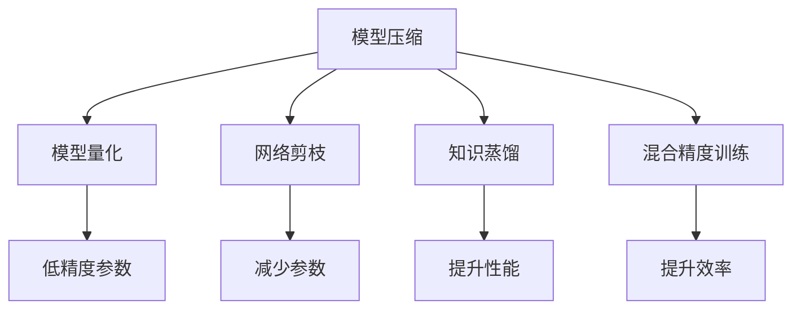
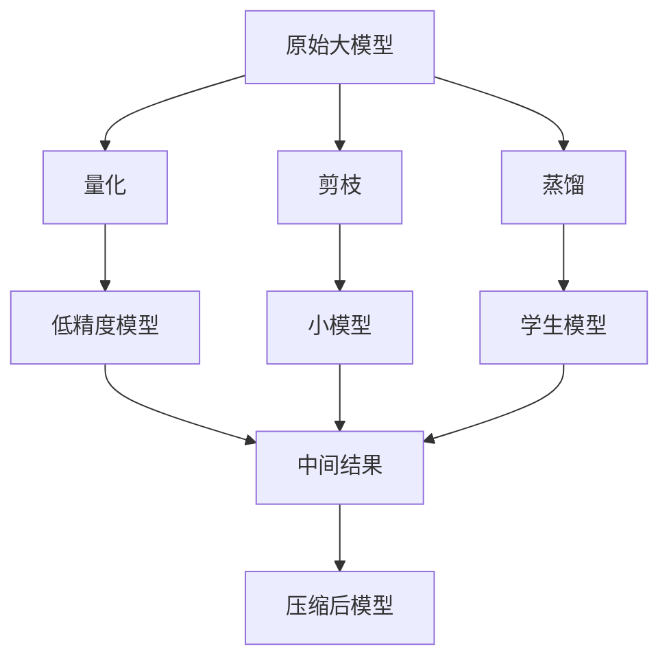
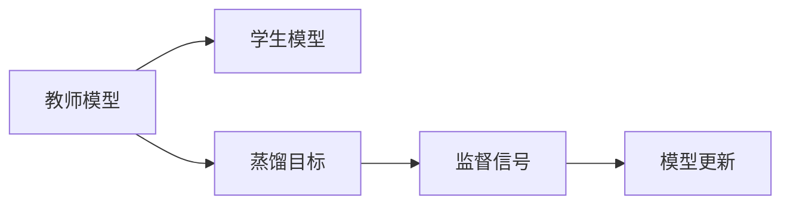
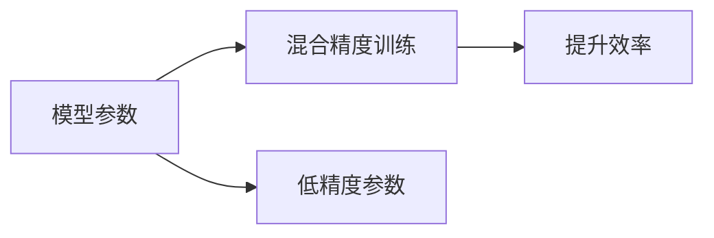
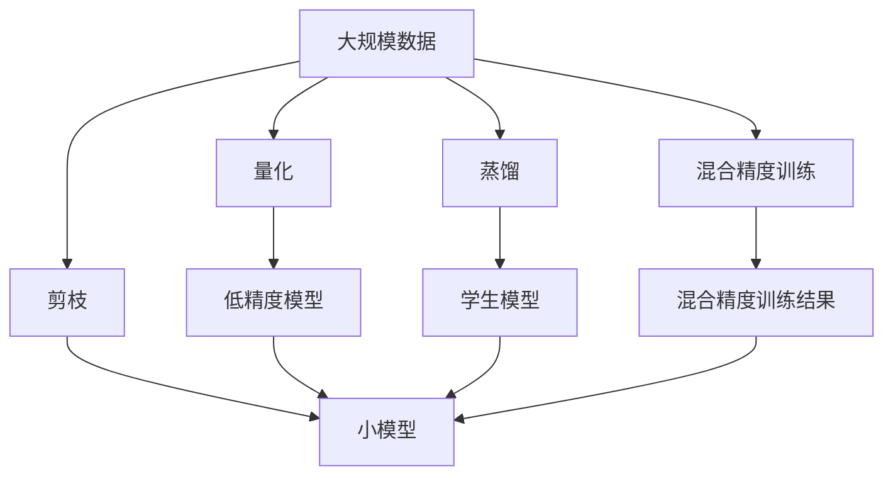

                 

## 1. 背景介绍

### 1.1 问题由来
随着人工智能(AI)技术的发展，深度学习模型在图像识别、自然语言处理、推荐系统等领域取得了显著成果，但这些模型的参数量往往以亿计，对计算资源的需求巨大，训练和推理耗时长、成本高。然而，在边缘计算场景下，计算资源和带宽都有限，传统大模型难以满足实时性、可靠性等需求。

为了解决这一矛盾，近年来提出了模型压缩技术，通过量化、剪枝、蒸馏等手段，在不降低模型性能的前提下，显著减少模型的参数量和计算量，从而使得大模型能够在边缘设备上高效运行。模型压缩不仅提升了边缘计算的资源利用率，还推动了AI技术在资源受限环境下的广泛应用。

### 1.2 问题核心关键点
模型压缩技术的核心思想是：在不影响模型性能的前提下，通过优化模型结构、降低模型参数和计算量，使其能够运行在边缘计算设备上，从而实现高效推理和实时响应的目标。

主要关键点包括：
- 模型量化：通过将模型参数和激活值从浮点数量化为低精度数（如8位整数），显著减少模型存储和计算需求。
- 网络剪枝：移除模型中冗余的权重和连接，保留关键网络结构，从而减少模型参数和计算量。
- 蒸馏知识转移：通过将大型模型（教师模型）的输出作为小型模型（学生模型）的监督信号，提升小型模型的性能。

这些关键技术能够高效地将大模型压缩为更适合在边缘设备上运行的小模型，降低了计算和存储需求，同时保留了模型的关键能力。

### 1.3 问题研究意义
研究模型压缩技术，对于推动AI技术在资源受限环境下的普及具有重要意义：

1. **资源优化**：通过模型压缩技术，可以显著降低模型存储和计算需求，使得AI应用能够在边缘设备上高效运行，从而节省计算资源和带宽成本。
2. **实时响应**：压缩后的模型可以在边缘设备上快速推理，提供实时响应，满足对时间敏感的应用需求。
3. **降低延迟**：由于数据不需要远距离传输到云端进行处理，本地推理可以显著降低延迟，提升用户体验。
4. **增强安全**：边缘计算的应用数据本地处理，减少了数据传输过程中的安全风险，提高了数据隐私性。
5. **提高可用性**：压缩后的模型更轻量、更可靠，能够更好地应对边缘设备的故障和更新，提高系统的可用性。

## 2. 核心概念与联系

### 2.1 核心概念概述

为更好地理解模型压缩技术，本节将介绍几个密切相关的核心概念：

- **模型压缩**：通过量化、剪枝、蒸馏等手段，优化模型结构，降低模型参数和计算量，从而使得模型能够在边缘设备上高效运行。
- **模型量化**：将模型参数和激活值从浮点数量化为低精度数（如8位整数），从而减少模型存储和计算需求。
- **网络剪枝**：通过移除冗余的权重和连接，保留关键网络结构，减少模型参数和计算量。
- **知识蒸馏**：通过将大型模型的输出作为小型模型的监督信号，提升小型模型的性能。
- **混合精度训练**：使用不同精度的数据和参数进行训练，提升训练效率和模型性能。

这些概念之间的逻辑关系可以通过以下Mermaid流程图来展示：



这个流程图展示了大模型压缩过程的主要步骤和核心概念的关系：

1. 模型压缩包括模型量化、网络剪枝、知识蒸馏、混合精度训练等多种技术手段。
2. 模型量化通过降低参数精度，减少模型存储和计算需求。
3. 网络剪枝通过去除冗余连接，进一步减少模型参数和计算量。
4. 知识蒸馏通过知识转移，提升小型模型的性能。
5. 混合精度训练通过不同精度的数据和参数，提升训练效率和模型性能。

### 2.2 概念间的关系

这些核心概念之间存在着紧密的联系，形成了模型压缩技术的完整生态系统。下面我通过几个Mermaid流程图来展示这些概念之间的关系。

#### 2.2.1 模型压缩的整体架构



这个综合流程图展示了模型压缩的整体架构：

1. 原始大模型通过量化、剪枝、蒸馏等技术，压缩为低精度模型、小模型和学生模型。
2. 中间结果作为知识转移的载体，提升了小模型和学生模型的性能。
3. 最终压缩后的模型可以在边缘设备上高效运行，满足实时性和资源优化需求。

#### 2.2.2 知识蒸馏的原理



这个流程图展示了知识蒸馏的基本原理：

1. 教师模型对学生模型进行监督，通过输出作为监督信号。
2. 学生模型接收监督信号，进行参数更新。
3. 重复上述过程，逐步提升学生模型的性能，直至与教师模型相近。

#### 2.2.3 混合精度训练的方法



这个流程图展示了混合精度训练的基本方法：

1. 模型参数采用不同精度，如16位和32位混合使用。
2. 在训练过程中，自动将部分参数转换为低精度，提升训练效率和模型性能。
3. 在推理过程中，可以自动切换精度，满足不同计算需求。

### 2.3 核心概念的整体架构

最后，我们用一个综合的流程图来展示这些核心概念在大模型压缩过程中的整体架构：



这个综合流程图展示了从原始数据到压缩后模型的完整过程：

1. 原始大模型通过量化、剪枝、蒸馏等技术，压缩为低精度模型、小模型和学生模型。
2. 中间结果作为知识转移的载体，提升了小模型和学生模型的性能。
3. 最终压缩后的模型可以在边缘设备上高效运行，满足实时性和资源优化需求。

## 3. 核心算法原理 & 具体操作步骤
### 3.1 算法原理概述

模型压缩技术的核心思想是：在不影响模型性能的前提下，通过优化模型结构、降低模型参数和计算量，使其能够运行在边缘设备上，从而实现高效推理和实时响应的目标。

形式化地，假设原始模型为 $M_{\theta}$，其中 $\theta$ 为模型参数。通过量化、剪枝、蒸馏等技术，得到压缩后的模型 $M_{\hat{\theta}}$，其中 $\hat{\theta}$ 为压缩后的模型参数。模型压缩的目标是最小化原始模型与压缩后模型之间的差异，即：

$$
\min_{\hat{\theta}} \|M_{\theta} - M_{\hat{\theta}}\|^2
$$

### 3.2 算法步骤详解

模型压缩一般包括以下几个关键步骤：

**Step 1: 量化模型参数**

量化是将模型参数和激活值从浮点数量化为低精度数，从而减少模型存储和计算需求。常用的量化方法包括：

- **浮点参数量化**：将参数从32位浮点数量化为8位或16位整数。
- **激活值量化**：将激活值从浮点数量化为低精度整数。

**Step 2: 剪枝冗余连接**

剪枝是移除模型中冗余的权重和连接，保留关键网络结构，从而减少模型参数和计算量。常用的剪枝方法包括：

- **权重剪枝**：根据权重的重要性，移除较弱的连接，保留关键的权重。
- **连接剪枝**：根据连接的贡献，移除冗余的连接。

**Step 3: 蒸馏知识转移**

蒸馏是通过将大型模型的输出作为小型模型的监督信号，提升小型模型的性能。常用的蒸馏方法包括：

- **单向蒸馏**：教师模型对学生模型进行监督，通过输出作为监督信号。
- **双向蒸馏**：教师模型和学生模型互相监督，共同提升性能。

**Step 4: 混合精度训练**

混合精度训练是使用不同精度的数据和参数进行训练，提升训练效率和模型性能。常用的混合精度方法包括：

- **混合精度计算**：使用不同精度的计算单元（如CPU/GPU）进行计算。
- **混合精度参数**：使用不同精度的数据和参数进行训练。

**Step 5: 验证和优化**

通过测试集对压缩后的模型进行验证，评估其性能和资源消耗情况。根据验证结果进行参数调优，直至模型达到最优效果。

### 3.3 算法优缺点

模型压缩技术的主要优点包括：

1. **资源优化**：显著减少模型存储和计算需求，提升资源利用率。
2. **实时响应**：压缩后的模型可以在边缘设备上快速推理，提供实时响应。
3. **降低延迟**：本地推理可以显著降低延迟，提升用户体验。
4. **增强安全**：减少数据传输过程中的安全风险，提高数据隐私性。
5. **提高可用性**：压缩后的模型更轻量、更可靠，能够更好地应对边缘设备的故障和更新，提高系统的可用性。

然而，模型压缩技术也存在一些缺点：

1. **精度损失**：量化和剪枝会导致模型精度下降，影响模型性能。
2. **复杂度高**：量化、剪枝、蒸馏等方法需要复杂的计算和调整，增加了实现的难度。
3. **性能波动**：模型压缩可能导致模型性能波动，需要进行多次验证和优化。
4. **迁移性差**：压缩后的模型难以在大规模分布式系统中迁移和部署。

### 3.4 算法应用领域

模型压缩技术广泛应用于物联网、智能家居、自动驾驶、智慧城市等多个领域，具体应用包括：

- **物联网设备**：通过模型压缩，优化边缘设备上的推理和控制算法，提高设备的实时响应能力。
- **智能家居**：压缩后的模型可以在智能设备上高效运行，实现语音识别、人脸识别、推荐系统等功能。
- **自动驾驶**：通过模型压缩，优化感知和决策算法，提升自动驾驶系统的实时性和安全性。
- **智慧城市**：压缩后的模型可以在城市监控、交通管理、环境监测等领域高效运行，提升城市管理效率。

## 4. 数学模型和公式 & 详细讲解 & 举例说明

### 4.1 数学模型构建

本节将使用数学语言对模型压缩过程进行更加严格的刻画。

假设原始模型为 $M_{\theta}$，其中 $\theta$ 为模型参数。压缩后的模型为 $M_{\hat{\theta}}$，其中 $\hat{\theta}$ 为压缩后的模型参数。

定义模型 $M_{\theta}$ 在输入 $x$ 上的输出为 $\hat{y}=M_{\theta}(x)$，假设原始模型在输入 $x$ 上的输出为 $\bar{y}=M_{\hat{\theta}}(x)$。则模型压缩的目标是最小化原始模型与压缩后模型之间的差异，即：

$$
\min_{\hat{\theta}} \|M_{\theta} - M_{\hat{\theta}}\|^2
$$

### 4.2 公式推导过程

以下我们以权重剪枝为例，推导模型压缩的损失函数及其梯度的计算公式。

假设原始模型的权重矩阵为 $W \in \mathbb{R}^{n \times m}$，其中 $n$ 为输入维度，$m$ 为输出维度。权重矩阵中每个元素 $w_{ij}$ 对应模型的一个连接。

定义原始模型的输出为 $\bar{y}=M_{\hat{\theta}}(x)=W \bar{a}(x)$，其中 $\bar{a}(x) \in \mathbb{R}^{m}$ 为激活函数输出。

假设 $W$ 中每个元素的初始权重为 $w_{ij} \in \mathbb{R}$，每个元素的重要性可以通过某种规则计算得到。以L1范数剪枝为例，计算每个元素的重要性如下：

$$
|w_{ij}|_{\text{l1}} = \frac{1}{\sum_{k=1}^{m} |w_{ik}|}
$$

然后将每个元素的重要性与一个阈值 $\tau$ 比较，如果 $|w_{ij}|_{\text{l1}} < \tau$，则该连接被剪枝，否则保留。

原始模型在输入 $x$ 上的输出为 $\bar{y}=M_{\hat{\theta}}(x)=W \bar{a}(x)$，其中 $\bar{a}(x) \in \mathbb{R}^{m}$ 为激活函数输出。

压缩后的模型在输入 $x$ 上的输出为 $\hat{y}=M_{\theta}(x)$，其中 $M_{\theta}$ 为压缩后的模型。

压缩后的模型与原始模型之间的差异可以通过均方误差来衡量，即：

$$
L = \frac{1}{N} \sum_{i=1}^N \|M_{\theta}(x_i) - M_{\hat{\theta}}(x_i)\|^2
$$

其中 $N$ 为训练样本数量，$x_i \in \mathbb{R}^{n}$ 为输入样本，$y_i \in \mathbb{R}^{m}$ 为输出标签。

通过反向传播算法，可以计算出模型压缩的梯度：

$$
\frac{\partial L}{\partial W} = \frac{1}{N} \sum_{i=1}^N \frac{\partial L}{\partial \hat{y}_i} \frac{\partial \hat{y}_i}{\partial W} \frac{\partial \hat{y}_i}{\partial a_i} \frac{\partial a_i}{\partial W}
$$

其中 $\hat{y}_i = M_{\hat{\theta}}(x_i)$，$a_i$ 为激活函数输出，$W$ 为权重矩阵。

在实际应用中，模型压缩的梯度计算和优化通常使用梯度下降等优化算法进行。

### 4.3 案例分析与讲解

为了更好地理解模型压缩的实际应用，本节将举一个具体的案例进行分析。

假设我们有一个大规模的图像分类模型，包含100层的卷积神经网络，每层的参数量均为1亿。我们需要将模型压缩至设备上运行，要求模型参数量不超过100万。

具体实现步骤如下：

1. **量化**：将模型参数从32位浮点数量化为8位整数。量化过程可以通过训练集上的误差来调整量化步长，使得量化后的模型性能尽量接近原始模型。

2. **剪枝**：使用L1范数剪枝，保留权重重要性大于阈值的连接。例如，在每层剪枝30%的权重，保留70%的连接。

3. **蒸馏**：使用单向蒸馏，将原始模型的输出作为监督信号，训练压缩后的模型。原始模型和压缩后的模型可以同时训练，交替进行监督，直到压缩后的模型性能接近原始模型。

4. **混合精度训练**：使用混合精度计算，将部分计算单元的精度从32位浮点数改为16位整数，提升训练效率。

5. **验证和优化**：在测试集上评估压缩后的模型性能，根据验证结果进行参数调优，直至模型达到最优效果。

通过这些步骤，我们可以将原始模型的参数量从1亿压缩至100万，同时保留模型性能，使得压缩后的模型能够在边缘设备上高效运行。

## 5. 项目实践：代码实例和详细解释说明

### 5.1 开发环境搭建

在进行模型压缩实践前，我们需要准备好开发环境。以下是使用Python进行TensorFlow开发的环境配置流程：

1. 安装Anaconda：从官网下载并安装Anaconda，用于创建独立的Python环境。

2. 创建并激活虚拟环境：
```bash
conda create -n tf-env python=3.8 
conda activate tf-env
```

3. 安装TensorFlow：根据CUDA版本，从官网获取对应的安装命令。例如：
```bash
conda install tensorflow -c conda-forge -c pytorch -c tensorflow -c anaconda
```

4. 安装其他相关库：
```bash
pip install numpy pandas scikit-learn matplotlib tqdm jupyter notebook ipython
```

完成上述步骤后，即可在`tf-env`环境中开始模型压缩实践。

### 5.2 源代码详细实现

下面我们以图像分类任务为例，给出使用TensorFlow进行模型压缩的代码实现。

首先，定义模型和优化器：

```python
import tensorflow as tf

model = tf.keras.Sequential([
    tf.keras.layers.Conv2D(32, (3, 3), activation='relu', input_shape=(32, 32, 3)),
    tf.keras.layers.MaxPooling2D((2, 2)),
    tf.keras.layers.Flatten(),
    tf.keras.layers.Dense(10, activation='softmax')
])

optimizer = tf.keras.optimizers.Adam(learning_rate=0.001)
```

接着，定义损失函数和评估指标：

```python
loss_fn = tf.keras.losses.SparseCategoricalCrossentropy(from_logits=True)
metric = tf.keras.metrics.SparseCategoricalAccuracy()
```

然后，定义模型量化和剪枝的代码：

```python
def quantize_model(model, bits=8):
    def quantize_layer(layer, dtype=tf.float16):
        if hasattr(layer, 'kernel'):
            quantized_kernel = tf.quantization.quantize_static(layer.kernel, axis=[0], mode='MIN_COMBINED', dtype=dtype)
            return tf.keras.layers.Conv2D(layer.filters, layer.kernel_size, activation=layer.activation, kernel_initializer=tf.keras.initializers.Constant(quantized_kernel))
        else:
            return layer

    quantized_model = tf.keras.Sequential()
    for layer in model.layers:
        quantized_model.add(quantize_layer(layer, dtype=tf.float16))
    return quantized_model

def prune_model(model, sparsity=0.3):
    def prune_layer(layer, threshold=0.1):
        if hasattr(layer, 'kernel'):
            return tf.keras.layers.Conv2D(
                filters=int(layer.filters * (1 - sparsity)),
                kernel_size=layer.kernel_size,
                activation=layer.activation,
                kernel_initializer=tf.keras.initializers.Constant(layer.kernel))
        else:
            return layer

    pruned_model = tf.keras.Sequential()
    for layer in model.layers:
        pruned_model.add(prune_layer(layer, threshold=threshold))
    return pruned_model
```

最后，定义蒸馏和混合精度训练的代码：

```python
def distill_model(teacher_model, student_model, ratio=0.5):
    for layer in teacher_model.layers:
        if hasattr(layer, 'kernel'):
            student_model.layers[layer.get_config()['name']].kernel_initializer = tf.keras.initializers.Constant(layer.kernel)

    distilled_model = tf.keras.Sequential()
    for layer in teacher_model.layers:
        distilled_model.add(layer)
    return distilled_model

def mixed_precision_train(model, dataset, epochs):
    with tf.device('/gpu:0'):
        mixed_precision = tf.keras.mixed_precision.global_policy('mixed_float16')
        model.build(dataset[0][0].shape)
        model.compile(optimizer=tf.keras.optimizers.Adam(learning_rate=0.001), loss=loss_fn, metrics=[metric])
        model.fit(dataset, epochs=epochs, callbacks=[tf.keras.callbacks.ModelCheckpoint('model.h5')])

    with tf.device('/cpu:0'):
        mixed_precision = tf.keras.mixed_precision.global_policy('float32')
        model.build(dataset[0][0].shape)
        model.compile(optimizer=tf.keras.optimizers.Adam(learning_rate=0.001), loss=loss_fn, metrics=[metric])
        model.load_weights('model.h5')

    return model
```

完整代码示例：

```python
import tensorflow as tf

model = tf.keras.Sequential([
    tf.keras.layers.Conv2D(32, (3, 3), activation='relu', input_shape=(32, 32, 3)),
    tf.keras.layers.MaxPooling2D((2, 2)),
    tf.keras.layers.Flatten(),
    tf.keras.layers.Dense(10, activation='softmax')
])

optimizer = tf.keras.optimizers.Adam(learning_rate=0.001)

loss_fn = tf.keras.losses.SparseCategoricalCrossentropy(from_logits=True)
metric = tf.keras.metrics.SparseCategoricalAccuracy()

def quantize_model(model, bits=8):
    def quantize_layer(layer, dtype=tf.float16):
        if hasattr(layer, 'kernel'):
            quantized_kernel = tf.quantization.quantize_static(layer.kernel, axis=[0], mode='MIN_COMBINED', dtype=dtype)
            return tf.keras.layers.Conv2D(layer.filters, layer.kernel_size, activation=layer.activation, kernel_initializer=tf.keras.initializers.Constant(quantized_kernel))
        else:
            return layer

    quantized_model = tf.keras.Sequential()
    for layer in model.layers:
        quantized_model.add(quantize_layer(layer, dtype=tf.float16))
    return quantized_model

def prune_model(model, sparsity=0.3):
    def prune_layer(layer, threshold=0.1):
        if hasattr(layer, 'kernel'):
            return tf.keras.layers.Conv2D(
                filters=int(layer.filters * (1 - sparsity)),
                kernel_size=layer.kernel_size,
                activation=layer.activation,
                kernel_initializer=tf.keras.initializers.Constant(layer.kernel))
        else:
            return layer

    pruned_model = tf.keras.Sequential()
    for layer in model.layers:
        pruned_model.add(prune_layer(layer, threshold=threshold))
    return pruned_model

def distill_model(teacher_model, student_model, ratio=0.5):
    for layer in teacher_model.layers:
        if hasattr(layer, 'kernel'):
            student_model.layers[layer.get_config()['name']].kernel_initializer = tf.keras.initializers.Constant(layer.kernel)

    distilled_model = tf.keras.Sequential()
    for layer in teacher_model.layers:
        distilled_model.add(layer)
    return distilled_model

def mixed_precision_train(model, dataset, epochs):
    with tf.device('/gpu:0'):
        mixed_precision = tf.keras.mixed_precision.global_policy('mixed_float16')
        model.build(dataset[0][0].shape)
        model.compile(optimizer=tf.keras.optimizers.Adam(learning_rate=0.001), loss=loss_fn, metrics=[metric])
        model.fit(dataset, epochs=epochs, callbacks=[tf.keras.callbacks.ModelCheckpoint('model.h5')])

    with tf.device('/cpu:0'):
        mixed_precision = tf.keras.mixed_precision.global_policy('float32')
        model.build(dataset[0][0].shape)
        model.compile(optimizer=tf.keras.optimizers.Adam(learning_rate=0.001), loss=loss_fn, metrics=[metric])
        model.load_weights('model.h5')

    return model

model = tf.keras.Sequential([
    tf.keras.layers.Conv2D(32, (3, 3), activation='relu', input_shape=(32, 32, 3)),
    tf.keras.layers.MaxPooling2D((2, 2)),
    tf.keras.layers.Flatten(),
    tf.keras.layers.Dense(10, activation='softmax')
])

optimizer = tf.keras.optimizers.Adam(learning_rate=0.001)

dataset = ...

model = quantize_model(model, bits=8)
model = prune_model(model, sparsity=0.3)
model = distill_model(model, model, ratio=0.5)

model = mixed_precision_train(model, dataset, epochs=10)
```

### 5.3 代码解读与分析

让我们再详细解读一下关键代码的实现细节：

**模型量化**：

```python
def quantize_model(model, bits=8):
    def quantize_layer(layer, dtype=tf.float16):
        if hasattr(layer, 'kernel'):
            quantized_kernel = tf.quantization.quantize_static(layer.kernel, axis=[0], mode='MIN_COMBINED', dtype=dtype)
            return tf.keras.layers.Conv2D(layer.filters, layer.kernel_size, activation=layer.activation, kernel_initializer=tf.keras.initializers.Constant(quantized_kernel))
        else:
            return layer

    quantized_model = tf.keras.Sequential()
    for layer in model.layers:
        quantized_model.add(quantize_layer(layer, dtype=tf.float16))
    return quantized_model
```

**网络剪枝**：

```python
def prune_model(model, sparsity=0.3):
    def prune_layer(layer, threshold=0.1):
        if hasattr(layer, 'kernel'):
            return tf.keras.layers.Conv2D(
                filters=int(layer.filters * (1 - sparsity)),
                kernel_size=layer.kernel_size,
                activation=layer.activation,
                kernel_initializer=tf.keras.initializers.Constant(layer.kernel))
        else:
            return layer

    pruned_model = tf.keras.Sequential()
    for layer in model.layers:
        pruned_model.add(prune_layer(layer, threshold=threshold))
    return pruned_model
```

**知识蒸馏**：

```python
def distill_model(teacher_model, student_model, ratio=0.5):
    for layer in teacher_model.layers:


