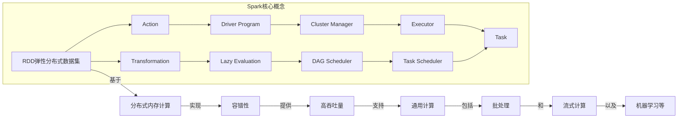

好的，我会按照您提供的要求和结构，撰写一篇关于"AI系统Spark原理与代码实战案例讲解"的专业技术博客文章。文章将包含详细的背景介绍、核心概念、算法原理、数学模型、代码实例、应用场景、资源推荐、发展趋势和挑战等内容。我会努力使用逻辑清晰、结构紧凑、语言专业且易于理解的方式撰写。同时也会尽量插入Mermaid流程图来阐释核心概念和架构原理。请稍等，我需要一些时间来准备和撰写这篇高质量的技术博客文章。

# AI系统Spark原理与代码实战案例讲解

## 1. 背景介绍

### 1.1 问题的由来

在当今大数据时代，海量的结构化和非结构化数据不断涌现，传统的数据处理系统已经无法满足实时计算和分析的需求。这促使了新一代大数据处理平台的诞生,Apache Spark就是其中的佼佼者。Spark作为一种快速、通用且可扩展的大数据处理引擎,凭借其优秀的内存计算性能、容错机制和丰富的生态库,成为了当前最受欢迎的大数据处理框架之一。

### 1.2 研究现状

Apache Spark自2014年开源以来,已经得到了广泛的学术研究和工业应用。越来越多的公司和组织将Spark作为大数据处理和分析的核心平台,用于构建实时数据管道、机器学习模型训练、图计算等多种应用场景。同时,Spark也成为了众多高校的大数据课程中的重点教学内容。

然而,尽管Spark的普及程度不断提高,但对于初学者而言,掌握Spark的核心概念、原理和实践操作仍然是一个挑战。许多人对Spark的工作原理、性能优化策略、代码实现细节等方面存在困惑和疑虑。

### 1.3 研究意义

深入理解Spark的内部原理和实现细节,对于开发人员、数据工程师和研究人员来说都是非常重要的。这不仅能够帮助他们更好地利用Spark进行大数据处理和分析,还能促进对分布式计算模型和优化策略的深入理解。同时,掌握Spark代码实战技能也是进入大数据行业的基本要求之一。

因此,本文将从Spark的核心概念、算法原理、数学模型、代码实现等多个角度进行全面剖析,并结合实际案例进行讲解,旨在为读者提供一个全面、深入的Spark学习资源。

### 1.4 本文结构

本文将按照以下结构展开:

1. 背景介绍
2. 核心概念与联系
3. 核心算法原理与具体操作步骤
4. 数学模型和公式详细讲解与举例说明
5. 项目实践:代码实例和详细解释说明
6. 实际应用场景
7. 工具和资源推荐
8. 总结:未来发展趋势与挑战
9. 附录:常见问题与解答

## 2. 核心概念与联系

在深入探讨Spark的算法原理和实现细节之前,我们有必要先了解Spark的核心概念及它们之间的关联。这些概念构成了Spark整个系统的基础,对于理解后续内容至关重要。

上图描述了Spark的核心概念及它们之间的关系,主要包括:

1. **RDD (Resilient Distributed Dataset)**: Spark的核心数据抽象,代表一个不可变、分区的记录集合。RDD支持两种操作:Transformation(转换)和Action(动作)。

2. **Transformation**: 对RDD进行转换操作,例如map、filter、join等,这些操作都是延迟计算的。

3. **Action**: 触发RDD上的计算,例如count、collect、save等,将计算结果返回到Driver程序或者写入外部存储系统。

4. **Lazy Evaluation**: Spark采用延迟计算策略,直到遇到Action操作时才会触发实际的计算。

5. **Driver Program**: 运行Application主程序的进程,负责构建RDD、执行Transformation和Action操作。

6. **Cluster Manager**: 资源管理器,负责获取计算资源并启动Executor进程。

7. **Executor**: 工作进程,负责运行Task任务并存储计算数据。

8. **Task**: 最小的工作单元,每个Task负责计算RDD的一个分区。

9. **DAG Scheduler**: 有向无环图调度器,根据Transformation操作构建计算阶段的有向无环图。

10. **Task Scheduler**: 任务调度器,将Task分发到Executor进程上运行。

这些概念相互关联、协同工作,共同构建了Spark的分布式内存计算模型,为大数据处理提供了容错性、高吞吐量、通用计算能力等优势。

## 3. 核心算法原理与具体操作步骤

### 3.1 算法原理概述

Spark的核心算法原理主要包括:RDD计算模型、DAG执行模型、任务调度与容错机制等。

1. **RDD计算模型**

RDD(Resilient Distributed Dataset)是Spark最核心的数据抽象,代表一个不可变、分区的记录集合。RDD支持两种操作:Transformation(转换)和Action(动作)。Transformation会生成新的RDD,而Action会触发RDD上的计算并将结果返回给Driver程序。

2. **DAG执行模型**

Spark将RDD上的Transformation操作构建成有向无环图(DAG),每个Transformation对应DAG中的一个节点。DAG调度器根据这个DAG图构建计算阶段,并将每个阶段的Task分发到Executor上执行。

3. **任务调度与容错**

Task Scheduler根据数据的存储位置,将Task调度到相应的Executor上执行。如果某个Task失败,Spark会根据RDD的血统关系重新计算失败的Task所依赖的RDD分区,从而实现容错。

### 3.2 算法步骤详解

1. **构建RDD**

开发者通过并行化集合或引用外部数据源(如HDFS、HBase等)来创建初始RDD。

2. **定义Transformation**

对初始RDD应用一系列Transformation操作(如map、filter、join等),构建出新的RDD。这些Transformation操作都是延迟计算的。

3. **触发Action**

当遇到Action操作时(如count、collect、save等),Spark会为该Action构建一个作业(Job),并根据RDD的血统关系构建DAG执行图。

4. **划分阶段(Stage)**

DAG Scheduler将DAG划分为更小的阶段(Stage),每个阶段由一组相互依赖的Task组成。

5. **任务调度**

Task Scheduler根据数据的存储位置,将每个阶段的Task调度到对应的Executor上执行。

6. **Task执行**

Executor上的Task运行时,会从内存或外部存储系统读取所需的数据分区,并对其应用相应的操作,得到计算结果。

7. **结果返回**

对于Transformation操作,计算结果会形成新的RDD;对于Action操作,计算结果会返回给Driver程序或写入外部存储系统。

8. **容错恢复**

如果某个Task失败,Spark会根据RDD的血统关系重新计算失败Task所依赖的RDD分区,从而实现容错恢复。

### 3.3 算法优缺点

**优点**:

1. 基于内存计算,性能优异
2. 容错机制可靠,支持故障恢复
3. 通用计算框架,支持批处理、流式计算、机器学习等
4. 生态丰富,提供多种高级API和工具

**缺点**:

1. 对内存资源的需求较高
2. 容错恢复过程可能会重复计算,造成一定开销
3. 调优参数较多,门槛较高
4. 对于迭代型算法,性能可能不如专用系统

### 3.4 算法应用领域

Spark作为通用的大数据处理引擎,可以应用于多个领域:

1. **批处理**:使用Spark Core进行大规模数据的ETL、数据分析等批处理任务。
2. **流式计算**:利用Spark Streaming进行实时数据流的接收、处理和分析。
3. **机器学习**:使用Spark MLlib进行大规模机器学习模型的训练和预测。
4. **图计算**:借助Spark GraphX进行大规模图数据的处理和分析。
5. **SQL查询**:通过Spark SQL对结构化数据进行交互式查询。

## 4. 数学模型和公式详细讲解与举例说明

在Spark的核心算法中,涉及了一些重要的数学模型和公式,对于理解算法原理和性能优化至关重要。本节将对这些模型和公式进行详细的讲解和案例分析。

### 4.1 数学模型构建

#### 4.1.1 RDD数据模型

RDD(Resilient Distributed Dataset)是Spark中表示数据的核心模型。一个RDD可以看作是一个不可变的、分区的记录集合,可以由一个驱动程序(Driver Program)进行并行操作。

我们可以用集合论的概念来形式化定义RDD:

设$D$为一个数据域,表示RDD中元素的值的集合。

一个RDD可以表示为一个有序对$(P, f)$,其中:

- $P = \{p_1, p_2, \ldots, p_n\}$是RDD的分区集合
- $f: D^* \rightarrow P$是一个函数,将父RDD的记录分配到不同的分区中

每个分区$p_i$都是一个记录集合,即$p_i \subseteq D^*$。整个RDD的元素集合可以表示为:

$$
\bigcup_{i=1}^n p_i = \{x \in D^* | \exists i, x \in p_i\}
$$

通过这种形式化的定义,我们可以更好地理解RDD的数据组织方式,为后续的转换操作和容错机制奠定基础。

#### 4.1.2 DAG执行模型

Spark采用有向无环图(DAG)来表示RDD上的转换操作序列,每个RDD转换对应DAG中的一个节点。DAG可以形式化定义为:

设$V$为DAG中的节点集合,表示RDD转换操作。$E \subseteq V \times V$为有向边集合,表示RDD之间的依赖关系。

对于任意一个节点$v \in V$,其输入RDD集合可以定义为:

$$
inputs(v) = \{u \in V | (u, v) \in E\}
$$

节点$v$的输出RDD可以由其输入RDD和转换操作$op_v$计算得到:

$$
output(v) = op_v(inputs(v))
$$

整个DAG的输出结果就是所有叶子节点的输出RDD的并集:

$$
result(DAG) = \bigcup_{v \in leaves(V)} output(v)
$$

其中$leaves(V)$表示DAG中所有没有出边的叶子节点集合。

通过这种形式化的定义,我们可以更好地理解Spark如何根据RDD的血统关系构建DAG,并将其划分为不同的计算阶段,从而实现高效的任务调度和容错恢复。

### 4.2 公式推导过程

#### 4.2.1 数据分区策略

为了实现高效的数据分布和并行计算,Spark需要将RDD划分为合理的分区。常见的分区策略包括:

1. **HashPartitioner**: 根据记录的key使用hash函数进行分区,常用于HashJoin等操作。

假设有$n$个分区,对于任意记录$(k, v) \in D \times D'$,其分区编号$p$可以计算为:

$$
p = k.hashCode() \% n
$$

2. **RangePartitioner**: 根据记录的key的范围进行分区,常用于排序操作。

假设有$n$个分区,对于任意记录$(k, v) \in D \times D'$,其分区编号$p$