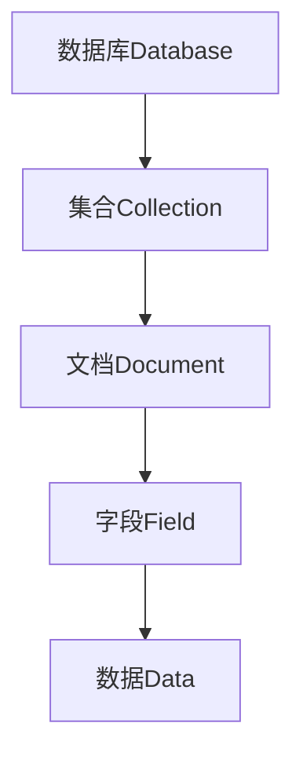

# MongoDB原理与代码实例讲解

## 1. 背景介绍

### 1.1 问题的由来

随着数据量的快速增长和数据结构的多样化,传统的关系型数据库在处理非结构化和半结构化数据时面临着严峻的挑战。关系型数据库的固定模式和规范化设计使得它们在存储和查询这些非结构化数据时效率低下,扩展性差。这就催生了一种新型的数据库 —— NoSQL(Not Only SQL)数据库的诞生。

MongoDB是一种流行的开源NoSQL数据库,它采用了键值对存储方式,具有高性能、高可用性、自动分片等特点,非常适合处理大规模非结构化数据。与关系型数据库相比,MongoDB具有schema-less(无模式)的特点,能够存储各种类型的数据,包括文档、图像、视频等,非常灵活。

### 1.2 研究现状

MongoDB作为领先的NoSQL数据库,已经被众多知名公司和组织广泛采用,如Google、Facebook、eBay等。它拥有活跃的开源社区,持续不断地进行功能优化和增强。目前,MongoDB已经发展到4.4版本,支持了诸多新特性,如分布式事务、时间序列集合、聚合管道增强等。

与此同时,也有越来越多的研究人员对MongoDB的内部原理、性能优化、应用场景等展开深入研究。已有大量论文和文献探讨了MongoDB的存储引擎、复制集、分片集群等核心组件的实现机制。

### 1.3 研究意义

深入理解MongoDB的内部原理对于合理利用和优化这一数据库系统至关重要。本文将全面剖析MongoDB的核心概念、算法原理、数学模型,并结合大量实例代码,旨在帮助读者从理论和实践两个层面彻底掌握MongoDB。

同时,本文还将探讨MongoDB在不同应用场景下的实践,分享工具和资源,并展望MongoDB的未来发展趋势和面临的挑战,为读者提供全方位的MongoDB学习和应用指导。

### 1.4 本文结构

本文共分为9个部分:

1. 背景介绍
2. 核心概念与联系
3. 核心算法原理与具体操作步骤
4. 数学模型和公式详细讲解与举例
5. 项目实践:代码实例和详细解释
6. 实际应用场景
7. 工具和资源推荐
8. 总结:未来发展趋势与挑战
9. 附录:常见问题与解答

## 2. 核心概念与联系

MongoDB是一种文档数据库,它的核心概念与关系型数据库有很大区别。本节将介绍MongoDB中的一些关键概念,并阐明它们之间的联系。

1. **数据库(Database)**: MongoDB中的最高层级组织单元,用于存储数据。一个MongoDB实例可以创建多个数据库。

2. **集合(Collection)**: 集合类似于关系型数据库中的表,用于存储MongoDB文档。集合中的文档无需遵循固定的模式。

3. **文档(Document)**: MongoDB中的基本单元,由一系列键值对组成。文档类似于关系型数据库中的行,但文档是自包含的,可以嵌套其他文档或数组。

4. **字段(Field)**: 文档中的键值对就是字段,类似于关系型数据库中的列。字段的值可以是任何BSON(Binary JSON)支持的数据类型。

5. **数据(Data)**: 字段的值就是实际存储的数据,可以是字符串、数字、日期、嵌套文档等类型。

上述概念之间的层级关系是:数据库包含多个集合,集合包含多个文档,文档由多个字段组成,字段存储实际的数据值。理解这些核心概念及其关联,是掌握MongoDB的基础。

## 3. 核心算法原理与具体操作步骤

MongoDB的核心算法原理包括文档存储、索引、查询、更新、聚合等多个方面。本节将分别介绍这些算法的基本原理和具体操作步骤。

### 3.1 算法原理概述

#### 文档存储算法

MongoDB采用BSON(Binary JSON)格式存储文档数据。BSON是二进制编码的JSON,相比JSON更加紧凑高效。文档存储在MongoDB的集合中,每个文档都有一个唯一的`_id`字段作为主键。

#### 索引算法

MongoDB支持多种类型的索引,如单键索引、复合索引、多键索引等,用于加速查询操作。索引采用B树(B-Tree)数据结构存储,支持快速查找。

#### 查询算法

MongoDB的查询算法基于文档的内容进行匹配,支持丰富的查询操作符。查询引擎会根据查询条件选择合适的索引,并利用索引快速定位目标文档。

#### 更新算法

MongoDB的更新算法采用两阶段原子操作,首先获取文档的写锁,然后执行更新操作。更新操作可以修改文档的全部或部分字段。

#### 聚合算法

MongoDB的聚合框架提供了数据处理的管道操作,可以对数据进行过滤、投影、分组、排序等多种转换操作。聚合算法利用了管道的并行处理能力,提高了计算效率。

### 3.2 算法步骤详解

#### 文档存储步骤

1. 客户端向MongoDB发送插入文档的请求
2. MongoDB解析BSON格式的文档数据
3. 为文档分配一个唯一的`_id`(如果未指定)
4. 将文档数据存储在集合的数据文件中
5. 更新集合的元数据信息(如文档计数器)
6. 返回插入结果给客户端

#### 索引创建步骤

1. 客户端向MongoDB发送创建索引的请求
2. MongoDB根据索引字段选择合适的索引类型
3. 扫描集合中的所有文档,提取索引字段的值
4. 构建B树索引,将字段值作为键,文档指针作为值
5. 将索引数据持久化存储到数据文件
6. 更新集合的元数据信息(如索引列表)
7. 返回创建索引结果给客户端

#### 查询执行步骤

1. 客户端向MongoDB发送查询请求
2. MongoDB解析查询条件,构建查询计划
3. 根据查询计划选择合适的索引
4. 利用索引快速定位满足条件的文档
5. 从数据文件中读取完整的文档数据
6. 根据查询条件过滤和投影文档
7. 将查询结果返回给客户端

#### 更新执行步骤

1. 客户端向MongoDB发送更新请求
2. MongoDB定位目标文档,获取写锁
3. 根据更新操作符修改文档的全部或部分字段
4. 将更新后的文档数据写回数据文件
5. 释放文档的写锁
6. 返回更新结果给客户端

#### 聚合执行步骤

1. 客户端向MongoDB发送聚合请求
2. MongoDB解析聚合管道操作符
3. 从集合中读取文档数据
4. 按照管道操作顺序执行转换操作
5. 并行处理每个管道阶段的数据
6. 将最终结果返回给客户端

### 3.3 算法优缺点

MongoDB的核心算法具有以下优缺点:

**优点**:

- 文档存储灵活,无需事先定义模式
- 索引支持多种类型,可满足不同查询需求
- 查询语法丰富,支持复杂条件查询
- 原子更新操作保证数据一致性
- 聚合框架提供高效的数据处理能力

**缺点**:

- 文档存储可能导致数据冗余
- 索引维护会带来额外开销
- 复杂查询可能需要全集合扫描,性能较差
- 原子更新操作需要获取写锁,并发性能受影响
- 聚合管道操作可能需要大量内存

### 3.4 算法应用领域

MongoDB的核心算法适用于以下应用领域:

- 内容管理系统:存储各种格式的非结构化内容数据
- 物联网数据:存储海量设备数据,支持快速查询和聚合分析
- 移动应用数据:存储用户资料、位置信息、社交数据等
- 日志数据:存储各种应用日志,支持快速查询和分析
- 电子商务:存储商品信息、订单数据、评论等

总的来说,MongoDB擅长存储和查询非结构化、半结构化数据,适用于数据模型灵活、查询需求复杂的场景。

## 4. 数学模型和公式详细讲解与举例说明

MongoDB的许多核心算法都基于数学模型和公式,如索引的B树结构、聚合管道的并行计算等。本节将详细讲解这些数学模型和公式,并通过案例分析加深理解。

### 4.1 数学模型构建

#### B树索引模型

MongoDB的索引采用B树(B-Tree)数据结构存储,B树是一种自平衡的多路查找树。B树的数学模型可以用下面的公式表示:

$$
n = \lceil\frac{m}{2}\rceil - 1
$$

其中:
- $n$表示树的阶数(节点最多可以存储的键值对数)
- $m$表示节点的最大子节点数

B树的特点是每个节点至少有$\lceil\frac{m}{2}\rceil$个子节点,从而保证了树的平衡性。

例如,如果$m=4$,那么$n=\lceil\frac{4}{2}\rceil - 1 = 1$,即每个节点最多可以存储3个键值对。

#### 聚合管道并行模型

MongoDB的聚合管道支持并行执行,可以利用多核CPU的计算能力提高性能。假设有$N$个文档需要聚合处理,管道有$M$个阶段,每个阶段的计算复杂度为$O(f(n))$,其中$n$表示输入文档数。那么,串行执行的总时间复杂度为:

$$
T_{serial} = \sum_{i=1}^{M}O(f(N))
$$

而并行执行的时间复杂度为:

$$
T_{parallel} = \max_{1\leq i\leq M}O(f(N/P))
$$

其中$P$表示可用的CPU核心数。

可以看出,当$P$足够大时,并行执行的时间复杂度将远小于串行执行,从而提高了聚合性能。

### 4.2 公式推导过程

#### B树索引查找复杂度

我们来推导一下在B树索引中查找一个键值的时间复杂度。

设B树的阶数为$n$,树的高度为$h$,那么根节点至少有$n$个子节点,每个子节点又至少有$n$个子节点,因此:

$$
n^h \geq N
$$

其中$N$表示B树中键值对的总数。

将$n$带入上式,得到:

$$
\left(\lceil\frac{m}{2}\rceil - 1\right)^h \geq N
$$

由于$\lceil\frac{m}{2}\rceil \geq \frac{m}{2}$,所以:

$$
\left(\frac{m}{2} - 1\right)^h \geq N
$$

取对数:

$$
h \leq \log_{\frac{m}{2}-1}N + 1
$$

因此,在B树中查找一个键值的时间复杂度为$O(\log_{\frac{m}{2}-1}N)$,这比平衡二叉树的$O(\log_2N)$复杂度要高效。

### 4.3 案例分析与讲解

#### 索引选择案例

假设我们有一个`products`集合,存储了大量商品信息,其中包含`name`(商品名称)、`category`(商品类别)、`price`(商品价格)等字段。我们需要频繁地根据商品名称或类别来查询商品,以及根据价格范围查询。

为了优化查询性能,我们可以为`name`、`category`、`price`字段创建索引。但是,由于索引也会占用存储空间和增加写操作开销,因此需要权衡查询频率和索引开销,选择合适的索引策略。

例如,如果`name`字段查询频率最高,那么我们可以为`name`创建单键索引;如果经常需要根据`name`和`category`联合查询,那么可以创建复合索引`{name: 1, category: 1}`。

对于`price`字段,如果主要是范围查询(如`price >