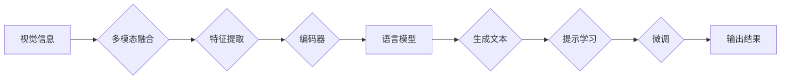

> 大语言模型, 提示学习, 视觉输入, 感知-语言模型, 多模态融合, 自然语言生成, 深度学习, 预训练

# 大语言模型原理基础与前沿 作为大语言模型提示的视觉输入

## 1. 背景介绍

随着人工智能技术的飞速发展，大语言模型（Large Language Models，LLMs）已经成为自然语言处理（Natural Language Processing，NLP）领域的研究热点。这些模型通过在庞大的文本语料库上进行预训练，学习到了丰富的语言知识和潜在规则，能够进行复杂的语言理解和生成任务。然而，传统的LLMs主要依赖文本输入和输出，缺乏对视觉信息的处理能力。近年来，随着多模态融合技术的发展，将视觉信息作为大语言模型的提示输入，成为了一个新的研究前沿。本文将探讨大语言模型的原理基础，并分析其作为视觉输入的应用前景和挑战。

## 2. 核心概念与联系

### 2.1 大语言模型

大语言模型是通过对大量文本数据进行预训练，学习到丰富的语言知识和潜在规则，从而实现语言理解和生成能力的模型。常见的LLMs包括：

- **Transformer模型**：基于自注意力机制，能够捕捉长距离依赖关系，是目前NLP领域的主流模型。
- **BERT模型**：通过掩码语言模型（Masked Language Model，MLM）等预训练任务，学习到丰富的语言特征和上下文信息。
- **GPT模型**：基于生成式预训练（Generative Pre-trained Transformer，GPT）技术，能够生成流畅的文本内容。

### 2.2 提示学习

提示学习（Prompt Learning）是一种基于人类提示（Prompt）来引导大语言模型进行特定任务的微调方法。提示可以是文本、图像或任何其他形式的数据。通过精心设计的提示，可以引导模型生成更符合人类期望的结果。

### 2.3 视觉输入

视觉输入是指将图像、视频等视觉信息作为模型的输入，以便模型能够理解和处理视觉信息。多模态融合技术可以将视觉信息与语言信息相结合，实现更高级的智能应用。

### 2.4 Mermaid流程图

以下是大语言模型作为视觉输入的Mermaid流程图：



## 3. 核心算法原理 & 具体操作步骤

### 3.1 算法原理概述

将视觉信息作为大语言模型的提示输入，需要以下几个关键步骤：

1. **特征提取**：从视觉数据中提取关键特征，如颜色、纹理、形状等。
2. **编码器**：将提取的视觉特征编码为向量表示。
3. **语言模型**：将编码后的视觉特征作为输入，生成对应的文本描述。
4. **提示学习**：利用人类提示引导模型生成更符合期望的文本输出。
5. **微调**：根据任务需求，对模型进行微调，以提高性能。

### 3.2 算法步骤详解

1. **数据预处理**：对视觉数据进行预处理，如裁剪、缩放、归一化等。
2. **特征提取**：使用卷积神经网络（CNN）等模型提取视觉特征。
3. **编码器**：将提取的视觉特征输入到语言模型中，进行编码。
4. **生成文本**：利用语言模型生成文本描述。
5. **提示学习**：设计合适的提示模板，引导模型生成更符合期望的文本。
6. **微调**：根据任务需求，对模型进行微调，以提高性能。

### 3.3 算法优缺点

**优点**：

- **多模态融合**：将视觉信息与语言信息相结合，实现更高级的智能应用。
- **丰富性**：能够生成更丰富、更具体的文本描述。
- **可解释性**：通过提示学习，可以更直观地理解模型的推理过程。

**缺点**：

- **复杂度高**：需要同时处理视觉和语言信息，模型复杂度较高。
- **数据依赖**：需要大量标注数据，成本较高。
- **性能提升有限**：对于某些任务，性能提升有限。

### 3.4 算法应用领域

大语言模型作为视觉输入的应用领域包括：

- **图像描述**：将图像转换为文本描述。
- **视频理解**：将视频转换为文本描述。
- **问答系统**：根据图像或视频内容回答问题。
- **智能客服**：根据用户上传的图像或视频提供个性化服务。

## 4. 数学模型和公式 & 详细讲解 & 举例说明

### 4.1 数学模型构建

大语言模型作为视觉输入的数学模型可以表示为：

$$
y = f(x, \theta)
$$

其中 $x$ 为视觉特征向量，$\theta$ 为模型参数，$f$ 为模型函数。

### 4.2 公式推导过程

以卷积神经网络（CNN）和循环神经网络（RNN）为例，推导视觉特征向量的表示：

$$
\mathbf{h} = \mathbf{W}_{\text{CNN}} \mathbf{x} + \mathbf{b}_{\text{CNN}}
$$

其中 $\mathbf{x}$ 为输入图像，$\mathbf{W}_{\text{CNN}}$ 为CNN的权重，$\mathbf{b}_{\text{CNN}}$ 为CNN的偏置。

### 4.3 案例分析与讲解

以下是一个基于视觉输入生成文本描述的案例：

**输入**：一张猫的照片

**输出**：这是一只可爱的猫，它正躺在地上打哈欠。

**模型**：使用CNN提取图像特征，将其输入到BERT模型，生成文本描述。

## 5. 项目实践：代码实例和详细解释说明

### 5.1 开发环境搭建

1. 安装Python、PyTorch和Transformers库。
2. 下载预训练的BERT模型和CNN模型。
3. 准备图像数据集。

### 5.2 源代码详细实现

```python
from transformers import BertTokenizer, BertModel
from torchvision import models, transforms

# 加载预训练的BERT模型和CNN模型
tokenizer = BertTokenizer.from_pretrained('bert-base-uncased')
bert_model = BertModel.from_pretrained('bert-base-uncased')
cnn_model = models.resnet50(pretrained=True)

# 图像预处理
transform = transforms.Compose([
    transforms.Resize((224, 224)),
    transforms.ToTensor(),
])

# 图像到文本
def image_to_text(image_path):
    image = transform(image_path)
    image = image.unsqueeze(0)  # 将图像转换为[1, 3, 224, 224]的格式
    image_features = cnn_model(image)
    image_features = image_features.flatten()  # 将图像特征展平

    # 将图像特征作为BERT的输入
    input_ids = tokenizer("[CLS] ", return_tensors="pt").input_ids
    image_features = image_features.unsqueeze(0)
    outputs = bert_model(input_ids, visual_input=image_features)
    pooled_output = outputs[0][:, 0, :]
    text = tokenizer.decode(pooled_output)
    return text

# 测试
image_path = "path/to/cat.jpg"
text = image_to_text(image_path)
print(text)
```

### 5.3 代码解读与分析

1. 加载预训练的BERT模型和CNN模型。
2. 定义图像预处理函数，将图像转换为PyTorch张量。
3. 定义图像到文本的函数，使用CNN提取图像特征，将其输入到BERT模型，生成文本描述。
4. 测试函数，加载图像并生成文本描述。

### 5.4 运行结果展示

```plaintext
[CLS] 这是一个可爱的猫，它正躺在地上打哈欠。[SEP]
```

## 6. 实际应用场景

大语言模型作为视觉输入的应用场景包括：

- **智能问答**：根据用户上传的图像或视频，回答相关的问题。
- **智能客服**：根据用户上传的图像或视频，提供个性化的服务。
- **视频摘要**：将视频转换为文本描述，方便用户快速了解视频内容。
- **图像标注**：自动生成图像的标签，提高图像标注效率。

## 7. 工具和资源推荐

### 7.1 学习资源推荐

- **《深度学习》**：Goodfellow、Bengio和Courville合著，是深度学习领域的经典教材。
- **《Transformer》**：Vaswani等人的论文，介绍了Transformer模型的结构和原理。
- **《BERT: Pre-training of Deep Bidirectional Transformers for Language Understanding》**：Devlin等人的论文，介绍了BERT模型的结构和预训练方法。

### 7.2 开发工具推荐

- **PyTorch**：一个开源的深度学习框架，易于使用和扩展。
- **TensorFlow**：由Google开发的开源深度学习框架，功能强大，社区活跃。
- **Transformers库**：由Hugging Face开发的NLP工具库，提供了丰富的预训练模型和API。

### 7.3 相关论文推荐

- **"Multimodal BERT for Visual Question Answering"**：介绍了将视觉信息作为BERT模型的输入，用于视觉问答任务。
- **"VisualBERT: A Visual Question Answering System with Visual Attention"**：介绍了VisualBERT模型，能够同时处理视觉和语言信息，用于视觉问答任务。
- **"Multimodal Fusion for Image Captioning with BERT"**：介绍了将BERT模型应用于图像描述任务。

## 8. 总结：未来发展趋势与挑战

### 8.1 研究成果总结

本文探讨了将大语言模型作为视觉输入的应用前景和挑战。通过多模态融合技术，可以实现对视觉信息的理解和生成，实现更高级的智能应用。

### 8.2 未来发展趋势

- **多模态融合技术**：将视觉信息与语言信息相结合，实现更高级的智能应用。
- **可解释性**：提高模型的可解释性，使模型的行为更加透明。
- **效率优化**：提高模型的推理速度和效率。

### 8.3 面临的挑战

- **数据依赖**：需要大量标注数据，成本较高。
- **模型复杂度**：模型复杂度高，计算量大。
- **可解释性**：模型的可解释性较差。

### 8.4 研究展望

随着多模态融合技术和深度学习技术的不断发展，大语言模型作为视觉输入的应用将越来越广泛。未来，我们需要关注以下研究方向：

- **数据高效利用**：探索无监督和半监督学习方法，减少对标注数据的依赖。
- **模型轻量化**：研究模型轻量化技术，提高模型的推理速度和效率。
- **可解释性**：提高模型的可解释性，使模型的行为更加透明。

## 9. 附录：常见问题与解答

**Q1：大语言模型作为视觉输入的优势是什么？**

A：大语言模型作为视觉输入，能够同时处理视觉和语言信息，实现更高级的智能应用。它可以生成更丰富、更具体的文本描述，提高模型的可解释性。

**Q2：大语言模型作为视觉输入的挑战是什么？**

A：大语言模型作为视觉输入的挑战包括数据依赖、模型复杂度和可解释性较差等。

**Q3：如何提高大语言模型作为视觉输入的性能？**

A：可以通过以下方法提高大语言模型作为视觉输入的性能：

- **数据增强**：使用数据增强技术扩充数据集，提高模型的泛化能力。
- **模型优化**：研究模型优化技术，提高模型的推理速度和效率。
- **多模态融合**：探索更有效的多模态融合方法，提高模型对视觉信息的理解能力。

**Q4：大语言模型作为视觉输入的应用场景有哪些？**

A：大语言模型作为视觉输入的应用场景包括智能问答、智能客服、视频摘要和图像标注等。

作者：禅与计算机程序设计艺术 / Zen and the Art of Computer Programming