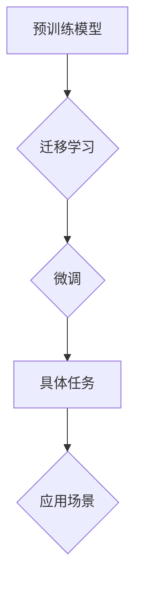

> 大语言模型, 应用指南, 算法原理, 实践案例, 应用场景, 工具资源

# 大语言模型应用指南：Algorithm-of-Tought

## 1. 背景介绍

随着深度学习技术的飞速发展，大语言模型（Large Language Models, LLMs）逐渐成为自然语言处理（Natural Language Processing, NLP）领域的研究热点。LLMs能够理解、生成和翻译人类语言，并在文本生成、机器翻译、问答系统、文本摘要等任务上展现出惊人的能力。本文将深入探讨大语言模型的应用指南，从算法原理、实践案例到实际应用场景，为您呈现这一前沿技术的全貌。

## 2. 核心概念与联系

### 2.1 核心概念

- **大语言模型（LLMs）**：基于深度学习技术构建的，能够处理和理解自然语言的大规模神经网络模型。
- **预训练（Pre-training）**：在大规模无标签数据上预训练模型，使其获得丰富的语言知识。
- **微调（Fine-tuning）**：在特定任务上使用少量标注数据进行训练，优化模型在特定任务上的表现。
- **迁移学习（Transfer Learning）**：将预训练模型的知识迁移到新的任务上。
- **自然语言处理（NLP）**：研究如何让计算机理解和处理人类语言的技术。

### 2.2 Mermaid 流程图



## 3. 核心算法原理 & 具体操作步骤

### 3.1 算法原理概述

大语言模型通常采用自回归（如GPT系列）或自编码（如BERT）的架构。预训练阶段，模型在大量无标签文本上进行训练，学习到丰富的语言知识。微调阶段，使用特定任务的少量标注数据进行训练，使模型适应特定任务。

### 3.2 算法步骤详解

1. **数据准备**：收集大规模无标签文本数据和少量标注数据。
2. **模型选择**：选择合适的预训练模型架构。
3. **预训练**：在无标签数据上进行预训练，学习语言知识。
4. **微调**：在标注数据上进行微调，优化模型在特定任务上的表现。
5. **评估**：在测试集上评估模型性能。

### 3.3 算法优缺点

**优点**：

- **强大的语言理解能力**：LLMs能够理解复杂的语言结构和语义。
- **泛化能力强**：LLMs能够迁移到新的任务上。
- **效果优异**：在多个NLP任务上取得了SOTA效果。

**缺点**：

- **计算资源消耗大**：LLMs需要大量的计算资源和存储空间。
- **数据依赖性强**：LLMs的训练和微调需要大量的数据。
- **可解释性差**：LLMs的决策过程难以解释。

### 3.4 算法应用领域

- **文本生成**：如自动写作、诗歌创作、故事生成等。
- **机器翻译**：如将一种语言翻译成另一种语言。
- **问答系统**：如智能客服、智能助手等。
- **文本摘要**：如新闻摘要、文档摘要等。
- **文本分类**：如垃圾邮件检测、情感分析等。

## 4. 数学模型和公式 & 详细讲解 & 举例说明

### 4.1 数学模型构建

大语言模型通常采用神经网络作为其基础架构，常用的神经网络模型包括：

- **循环神经网络（RNN）**：适用于处理序列数据。
- **长短期记忆网络（LSTM）**：RNN的改进版本，能够更好地处理长序列数据。
- **门控循环单元（GRU）**：LSTM的轻量级版本。

### 4.2 公式推导过程

以BERT模型为例，其核心思想是掩码语言模型（Masked Language Model, MLM）和下一句预测（Next Sentence Prediction, NSP）。

- **MLM**：对输入文本进行随机掩码，模型需要预测被掩码的词。
- **NSP**：判断两个句子是否属于同一段落。

### 4.3 案例分析与讲解

以GPT-3为例，其数学模型可以表示为：

$$
P(w_t | w_{<t}) = \frac{exp(\mathbf{W}_1 \mathbf{h}_{t-1} + \mathbf{b}_1)}{\sum_{w \in \mathcal{V}} exp(\mathbf{W}_1 \mathbf{h}_{t-1} + \mathbf{b}_1)}
$$

其中，$\mathbf{W}_1$ 为权重矩阵，$\mathbf{h}_{t-1}$ 为前一个时间步的隐藏状态，$\mathcal{V}$ 为词汇表。

## 5. 项目实践：代码实例和详细解释说明

### 5.1 开发环境搭建

1. 安装Python和PyTorch。
2. 安装Hugging Face的Transformers库。

### 5.2 源代码详细实现

以下是一个简单的BERT文本分类任务示例：

```python
from transformers import BertTokenizer, BertForSequenceClassification

# 加载预训练模型和分词器
model = BertForSequenceClassification.from_pretrained('bert-base-uncased')
tokenizer = BertTokenizer.from_pretrained('bert-base-uncased')

# 加载数据
texts = ["This is a good product", "This is a bad product"]
labels = [1, 0]

# 编码数据
encodings = tokenizer(texts, truncation=True, padding=True, return_tensors="pt")

# 训练模型
outputs = model(**encodings, labels=labels)
loss = outputs.loss
logits = outputs.logits

# 预测
predictions = logits.argmax(-1).tolist()
```

### 5.3 代码解读与分析

1. 加载预训练模型和分词器。
2. 加载数据并编码。
3. 使用训练数据训练模型。
4. 使用测试数据预测。

## 6. 实际应用场景

### 6.1 文本生成

大语言模型可以用于自动写作、诗歌创作、故事生成等任务。

### 6.2 机器翻译

大语言模型可以用于将一种语言翻译成另一种语言。

### 6.3 问答系统

大语言模型可以用于构建智能客服、智能助手等问答系统。

### 6.4 文本摘要

大语言模型可以用于提取文档的关键信息，生成摘要。

### 6.5 文本分类

大语言模型可以用于垃圾邮件检测、情感分析等文本分类任务。

## 7. 工具和资源推荐

### 7.1 学习资源推荐

- 《深度学习自然语言处理》
- Hugging Face官网
- arXiv

### 7.2 开发工具推荐

- PyTorch
- Transformers库
- Jupyter Notebook

### 7.3 相关论文推荐

- **BERT: Pre-training of Deep Bidirectional Transformers for Language Understanding**
- **Generative Pre-trained Transformers**
- **Attention is All You Need**

## 8. 总结：未来发展趋势与挑战

### 8.1 研究成果总结

大语言模型在NLP领域取得了显著的成果，为多个任务提供了强大的解决方案。

### 8.2 未来发展趋势

- **模型规模持续增大**：LLMs的规模将继续增大，以获得更丰富的语言知识。
- **多模态融合**：LLMs将与其他模态信息（如图像、音频）进行融合，以更好地理解现实世界。
- **可解释性**：LLMs的可解释性将得到提高，以便更好地理解其决策过程。

### 8.3 面临的挑战

- **数据依赖**：LLMs的训练和微调需要大量的数据。
- **计算资源消耗**：LLMs需要大量的计算资源。
- **可解释性**：LLMs的决策过程难以解释。

### 8.4 研究展望

LLMs将不断发展，为NLP领域带来更多创新应用。

## 9. 附录：常见问题与解答

**Q1：什么是大语言模型？**

A：大语言模型（LLMs）是能够处理和理解自然语言的大规模神经网络模型。

**Q2：大语言模型有哪些应用场景？**

A：大语言模型可以应用于文本生成、机器翻译、问答系统、文本摘要、文本分类等多个领域。

**Q3：如何微调大语言模型？**

A：使用特定任务的少量标注数据对预训练模型进行训练，优化模型在特定任务上的表现。

**Q4：大语言模型有哪些挑战？**

A：大语言模型面临的主要挑战包括数据依赖、计算资源消耗和可解释性。

---

作者：禅与计算机程序设计艺术 / Zen and the Art of Computer Programming