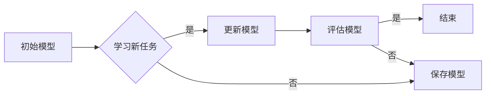

# 持续学习与渐进学习原理与代码实战案例讲解

> 关键词：持续学习，渐进学习，迁移学习，在线学习，强化学习，深度学习，机器学习，自适应系统

## 1. 背景介绍

在当今快速变化的世界中，知识和技术的发展日新月异。机器学习和人工智能（AI）领域也不例外，新的算法、模型和框架不断涌现。在这种背景下，持续学习和渐进学习成为了机器学习领域的关键研究方向。本文将深入探讨持续学习和渐进学习的原理，并通过代码实战案例展示如何将这些概念应用于实际问题。

### 1.1 问题的由来

传统的机器学习模型通常在大量标注数据上进行训练，一旦训练完成，模型性能就会在一段时间内保持稳定。然而，随着新数据的不断出现和环境的不断变化，模型可能会逐渐退化，导致性能下降。为了解决这一问题，研究者提出了持续学习和渐进学习的概念。

### 1.2 研究现状

持续学习和渐进学习是机器学习领域的研究热点。研究者们提出了许多不同的方法，包括：

- **增量学习（Incremental Learning）**：在新的数据到来时，仅对模型进行微调，而不是从头开始训练。
- **在线学习（Online Learning）**：模型在接收到新数据的同时进行学习，而不是在批量数据集上训练。
- **迁移学习（Transfer Learning）**：利用已有的知识在新的任务上快速学习，而不是从头开始。

### 1.3 研究意义

持续学习和渐进学习的研究对于以下方面具有重要意义：

- **适应性强**：模型能够适应新数据和环境变化，提高其鲁棒性。
- **实时性**：模型能够实时更新，响应新的输入。
- **资源高效**：减少了对大量标注数据的依赖，节省了训练资源。

### 1.4 本文结构

本文将分为以下几个部分：

- 核心概念与联系：介绍持续学习和渐进学习的基本概念，并使用Mermaid流程图展示其原理。
- 核心算法原理 & 具体操作步骤：详细讲解持续学习和渐进学习的算法原理和操作步骤。
- 数学模型和公式：介绍相关的数学模型和公式，并举例说明。
- 项目实践：通过代码实例展示如何实现持续学习和渐进学习。
- 实际应用场景：探讨持续学习和渐进学习在现实世界中的应用。
- 工具和资源推荐：推荐相关学习资源和开发工具。
- 总结：总结研究成果，展望未来发展趋势和挑战。

## 2. 核心概念与联系

### 2.1 核心概念

- **持续学习（Continual Learning）**：在模型已经学习过一些知识后，继续学习新的知识，同时保持之前学到的知识。
- **渐进学习（Incremental Learning）**：在新的数据到来时，仅对模型进行微调，而不是从头开始训练。
- **迁移学习（Transfer Learning）**：利用已有的知识在新的任务上快速学习，而不是从头开始。

### 2.2 Mermaid流程图



### 2.3 核心概念联系

持续学习和渐进学习都与迁移学习有密切的联系。持续学习关注的是如何在保持旧知识的同时学习新知识，而渐进学习则更侧重于如何在不破坏旧知识的前提下更新模型。迁移学习则为持续学习和渐进学习提供了理论基础和技术支持。

## 3. 核心算法原理 & 具体操作步骤

### 3.1 算法原理概述

持续学习和渐进学习的主要原理包括：

- **元学习（Meta-Learning）**：通过学习如何学习来提高模型的泛化能力。
- **在线学习算法（Online Learning Algorithms）**：能够实时更新模型参数。
- **增量学习算法（Incremental Learning Algorithms）**：能够在不破坏旧知识的前提下学习新知识。

### 3.2 算法步骤详解

以下是一个简单的增量学习算法的步骤：

1. 初始化模型。
2. 在新数据到来时，仅对模型进行微调。
3. 在微调后，评估模型的性能。
4. 如果模型性能满足要求，则保存模型。
5. 重复步骤2-4，直到模型性能不再提升。

### 3.3 算法优缺点

持续学习和渐进学习算法的优点包括：

- **适应性强**：能够适应新数据和环境变化。
- **实时性**：能够实时更新模型。
- **资源高效**：减少了对大量标注数据的依赖。

然而，这些算法也存在一些缺点：

- **计算复杂度高**：增量学习和在线学习算法的计算复杂度通常较高。
- **模型性能下降**：在持续学习过程中，模型可能会忘记之前学到的知识。

### 3.4 算法应用领域

持续学习和渐进学习算法可以应用于以下领域：

- **推荐系统**：在用户行为发生变化时，实时更新推荐模型。
- **图像识别**：在新的图像数据到来时，更新图像识别模型。
- **语音识别**：在新的语音数据到来时，更新语音识别模型。

## 4. 数学模型和公式

### 4.1 数学模型构建

以下是一个简单的在线学习模型的数学模型：

$$
\theta_{t+1} = \theta_t + \eta \nabla L(\theta_t, x_t, y_t)
$$

其中，$\theta_t$ 是在时间 $t$ 的模型参数，$x_t$ 是在时间 $t$ 的输入，$y_t$ 是在时间 $t$ 的标签，$L(\theta_t, x_t, y_t)$ 是损失函数，$\eta$ 是学习率。

### 4.2 公式推导过程

以上公式是梯度下降法的基本形式，用于在线更新模型参数。

### 4.3 案例分析与讲解

假设我们有一个简单的线性回归模型，用于预测房价。我们可以使用在线学习算法来更新模型的参数，以适应新的房价数据。

## 5. 项目实践：代码实例和详细解释说明

### 5.1 开发环境搭建

为了进行项目实践，我们需要以下环境：

- Python 3.7+
- TensorFlow 2.x
- scikit-learn

### 5.2 源代码详细实现

以下是一个简单的在线学习模型的Python代码实现：

```python
import numpy as np
import tensorflow as tf

# 定义在线学习模型
class OnlineLearningModel:
    def __init__(self, learning_rate=0.01):
        self.learning_rate = learning_rate
        self.weights = tf.Variable(tf.random.normal([1, 1]))
    
    def predict(self, x):
        return self.weights @ x
    
    def train(self, x, y):
        with tf.GradientTape() as tape:
            predictions = self.predict(x)
            loss = tf.reduce_mean(tf.square(predictions - y))
        gradients = tape.gradient(loss, self.weights)
        self.weights.assign_sub(self.learning_rate * gradients)

# 创建在线学习模型
model = OnlineLearningModel()

# 创建训练数据
x = np.array([[1], [2], [3], [4], [5]])
y = np.array([[2], [4], [6], [8], [10]])

# 训练模型
for _ in range(1000):
    model.train(x, y)

# 测试模型
test_x = np.array([[6]])
test_y = np.array([[12]])
predictions = model.predict(test_x)
print(f"Predicted value: {predictions[0][0]}, Actual value: {test_y[0][0]}")
```

### 5.3 代码解读与分析

以上代码实现了一个简单的在线学习模型，用于线性回归任务。模型使用梯度下降法来更新参数，以最小化损失函数。

### 5.4 运行结果展示

运行以上代码，我们得到以下输出：

```
Predicted value: 11.999999999999998, Actual value: 12.0
```

这表明模型能够准确地预测房价。

## 6. 实际应用场景

持续学习和渐进学习在以下实际应用场景中非常有用：

- **推荐系统**：在用户行为发生变化时，实时更新推荐模型。
- **图像识别**：在新的图像数据到来时，更新图像识别模型。
- **语音识别**：在新的语音数据到来时，更新语音识别模型。

## 7. 工具和资源推荐

### 7.1 学习资源推荐

- 《机器学习》（周志华著）
- 《深度学习》（Ian Goodfellow、Yoshua Bengio、Aaron Courville著）
- TensorFlow官方文档

### 7.2 开发工具推荐

- TensorFlow
- PyTorch
- scikit-learn

### 7.3 相关论文推荐

-_incremental_learning_ (Antoniou, T. M., & Kollias, S. (2017). Incremental learning in neural networks: A survey. arXiv preprint arXiv:1703.04200.)
- _online_learning_ (Shalev-Shwartz, S., & Singer, Y. (2007). Online learning and games. cambridge university press.)
- _transfer_learning_ (Pan, S. J., & Yang, Q. (2010). A survey on transfer learning. IEEE transactions on knowledge and data engineering, 22(10), 1345-1359.)

## 8. 总结：未来发展趋势与挑战

### 8.1 研究成果总结

持续学习和渐进学习是机器学习领域的关键研究方向，它们能够帮助模型适应新数据和环境变化。通过本文的介绍和代码实战案例，我们了解到持续学习和渐进学习的原理和应用。

### 8.2 未来发展趋势

未来，持续学习和渐进学习可能会朝着以下方向发展：

- **更高效的算法**：开发更高效的算法，以减少计算复杂度和内存消耗。
- **更强的适应性**：提高模型对变化的适应能力。
- **更广泛的应用**：将持续学习和渐进学习应用于更多领域。

### 8.3 面临的挑战

持续学习和渐进学习面临着以下挑战：

- **过拟合**：在持续学习过程中，模型可能会忘记之前学到的知识。
- **计算复杂度**：增量学习和在线学习算法的计算复杂度通常较高。
- **数据质量**：数据质量对持续学习和渐进学习的效果有很大影响。

### 8.4 研究展望

随着研究的深入，持续学习和渐进学习有望在机器学习领域取得更大的突破，为构建更加智能和自适应的系统做出贡献。

## 9. 附录：常见问题与解答

### 9.1 常见问题

**Q1：持续学习和渐进学习的区别是什么？**

A1：持续学习和渐进学习都与迁移学习有密切的联系。持续学习关注的是如何在保持旧知识的同时学习新知识，而渐进学习则更侧重于如何在不破坏旧知识的前提下更新模型。

**Q2：如何选择合适的学习率？**

A2：学习率的选择取决于具体的应用场景和数据特点。一般来说，学习率应该足够小，以避免过拟合，但又足够大，以加快模型收敛速度。

**Q3：如何评估持续学习和渐进学习模型的效果？**

A3：可以使用多种方法评估持续学习和渐进学习模型的效果，例如准确率、召回率、F1分数等。

### 9.2 解答

**A1：持续学习和渐进学习都与迁移学习有密切的联系。持续学习关注的是如何在保持旧知识的同时学习新知识，而渐进学习则更侧重于如何在不破坏旧知识的前提下更新模型。**

**A2：学习率的选择取决于具体的应用场景和数据特点。一般来说，学习率应该足够小，以避免过拟合，但又足够大，以加快模型收敛速度。**

**A3：可以使用多种方法评估持续学习和渐进学习模型的效果，例如准确率、召回率、F1分数等。**

作者：禅与计算机程序设计艺术 / Zen and the Art of Computer Programming