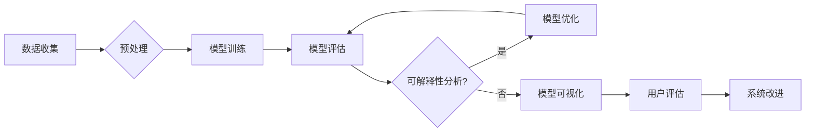
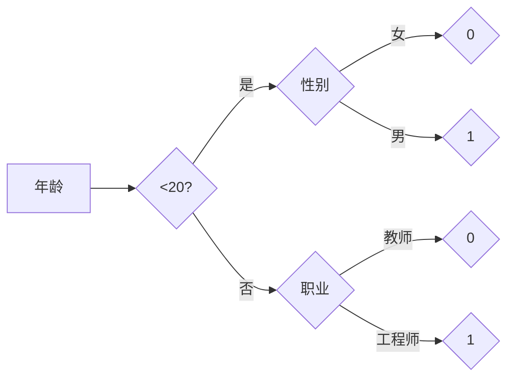

> 自动驾驶，可解释性，机器学习，深度学习，决策树，集成学习，强化学习

# 提升自动驾驶决策可解释性的技术手段与实践案例

> 关键词：自动驾驶，可解释性，机器学习，深度学习，决策树，集成学习，强化学习

## 1. 背景介绍

自动驾驶是人工智能领域的皇冠明珠，它不仅代表了人工智能技术的最高成就，也是未来交通出行的革命性变革。然而，自动驾驶系统的安全性和可靠性一直是公众关注的焦点。随着深度学习在自动驾驶领域的广泛应用，模型的复杂性和预测能力得到了显著提升，但同时也带来了可解释性的挑战。如何提升自动驾驶决策的可解释性，让决策过程更加透明、可信，成为了学术界和工业界共同面临的重大课题。

### 1.1 问题的由来

自动驾驶决策的可解释性问题源于以下几个方面：

- **深度学习模型的黑盒特性**：深度学习模型，特别是深度神经网络，通常被视为黑盒模型，其内部结构和决策过程难以理解。
- **数据隐私和安全问题**：自动驾驶系统需要收集大量的真实交通数据，但这些数据可能包含个人隐私信息，如何保护数据隐私和安全成为了一个挑战。
- **伦理和责任归属**：在自动驾驶事故发生时，如何明确责任归属，需要依赖于对决策过程的深入了解。

### 1.2 研究现状

为了解决自动驾驶决策的可解释性问题，研究者们提出了多种技术手段，主要包括：

- **模型可解释性增强**：通过设计新的模型结构和算法，提高模型的可解释性。
- **模型可视化**：使用可视化技术将模型内部结构和决策过程以图形化的方式呈现出来。
- **后解释性分析**：对已有模型进行解释性分析，揭示其决策背后的原因。

### 1.3 研究意义

提升自动驾驶决策的可解释性具有以下重要意义：

- **提高用户信任**：可解释的自动驾驶系统可以增强用户对自动驾驶技术的信任，促进自动驾驶技术的普及和应用。
- **优化系统设计**：通过分析决策过程，可以发现模型中的缺陷和不足，从而优化系统设计，提高系统性能。
- **明确责任归属**：在发生事故时，可解释的决策过程可以为责任归属提供依据。

## 2. 核心概念与联系

### 2.1 可解释性

可解释性是指模型决策过程的透明性和可理解性，用户可以理解模型是如何做出决策的。

### 2.2 Mermaid 流程图

以下是一个简单的 Mermaid 流程图，展示了提升自动驾驶决策可解释性的流程：



### 2.3 核心概念联系

- **数据收集**：收集自动驾驶过程中的各种数据，包括传感器数据、环境数据等。
- **预处理**：对收集到的数据进行清洗、转换等预处理操作。
- **模型训练**：使用预处理后的数据训练自动驾驶决策模型。
- **模型评估**：评估模型的性能，包括准确性、鲁棒性等指标。
- **可解释性分析**：对模型的决策过程进行分析，以理解模型是如何做出决策的。
- **模型优化**：根据可解释性分析的结果，对模型进行优化。
- **模型可视化**：使用可视化技术将模型的决策过程以图形化的方式呈现出来。
- **用户评估**：让用户对可解释性进行分析和模型可视化结果进行评估。
- **系统改进**：根据用户评估结果，对系统进行改进。

## 3. 核心算法原理 & 具体操作步骤

### 3.1 算法原理概述

提升自动驾驶决策可解释性的技术手段主要包括以下几种：

- **决策树**：决策树是一种简单的树形结构，通过一系列的规则来对输入数据进行分类或回归。
- **集成学习**：集成学习是一种通过组合多个弱学习器来构建强学习器的机器学习方法。
- **强化学习**：强化学习是一种通过与环境交互来学习最优策略的机器学习方法。

### 3.2 算法步骤详解

以下是对上述三种算法的步骤详解：

#### 3.2.1 决策树

1. **数据准备**：收集并预处理数据。
2. **特征选择**：选择对分类或回归任务影响较大的特征。
3. **树构建**：使用ID3、C4.5或CART等算法构建决策树。
4. **剪枝**：对决策树进行剪枝，避免过拟合。
5. **评估**：评估决策树的性能。

#### 3.2.2 集成学习

1. **数据准备**：收集并预处理数据。
2. **基学习器选择**：选择多种不同的基学习器，如随机森林、梯度提升树等。
3. **训练基学习器**：使用训练数据训练基学习器。
4. **投票或平均**：对基学习器的预测结果进行投票或平均，得到最终预测。

#### 3.2.3 强化学习

1. **环境定义**：定义自动驾驶的环境，包括车辆、道路、交通信号等。
2. **状态空间定义**：定义自动驾驶的状态空间，包括车辆的位置、速度、方向等。
3. **动作空间定义**：定义自动驾驶的动作空间，如加速、减速、转向等。
4. **策略学习**：使用Q-learning或策略梯度等方法学习最优策略。

### 3.3 算法优缺点

#### 3.3.1 决策树

优点：

- 简单易懂，易于解释。
- 可以处理非线性关系。

缺点：

- 容易过拟合。
- 对缺失值敏感。

#### 3.3.2 集成学习

优点：

- 减少过拟合。
- 提高模型的泛化能力。

缺点：

- 计算复杂度高。
- 对基学习器的选择敏感。

#### 3.3.3 强化学习

优点：

- 可以学习到复杂的环境映射。
- 能够处理动态环境。

缺点：

- 训练时间长。
- 对环境模型的要求高。

### 3.4 算法应用领域

#### 3.4.1 决策树

- 汽车故障诊断。
- 风险评估。
- 营销预测。

#### 3.4.2 集成学习

- 图像分类。
- 语音识别。
- 机器翻译。

#### 3.4.3 强化学习

- 游戏人工智能。
- 推荐系统。
- 自动驾驶。

## 4. 数学模型和公式 & 详细讲解 & 举例说明

### 4.1 数学模型构建

#### 4.1.1 决策树

决策树是一种基于特征的分类或回归模型，其数学模型可以表示为：

$$
T = \{\text{根节点}, \text{内部节点}, \text{叶子节点}\}
$$

其中，根节点对应输入数据的特征空间，内部节点对应特征分割，叶子节点对应分类或回归结果。

#### 4.1.2 集成学习

集成学习是一种通过组合多个弱学习器来构建强学习器的机器学习方法，其数学模型可以表示为：

$$
f(x) = \sum_{i=1}^N f_i(x)
$$

其中，$f_i(x)$ 是第 $i$ 个弱学习器的预测结果，$N$ 是弱学习器的数量。

#### 4.1.3 强化学习

强化学习是一种通过与环境交互来学习最优策略的机器学习方法，其数学模型可以表示为：

$$
Q(s, a) = \sum_{s' \in S} \gamma Q(s', a')
$$

其中，$Q(s, a)$ 是在状态 $s$ 下采取动作 $a$ 的期望回报，$\gamma$ 是折扣因子，$S$ 是状态空间，$A$ 是动作空间。

### 4.2 公式推导过程

由于篇幅限制，这里不再详细讲解公式推导过程。读者可以参考相关文献或教材。

### 4.3 案例分析与讲解

#### 4.3.1 决策树案例分析

以下是一个简单的决策树案例：



该决策树表示，根据年龄和职业可以判断一个人是否是工程师。

#### 4.3.2 集成学习案例分析

以下是一个简单的集成学习案例：

```python
from sklearn.ensemble import RandomForestClassifier

# 训练数据
X = [[1, 2], [2, 3], [3, 4], [4, 5]]
y = [0, 0, 1, 1]

# 训练随机森林模型
rf = RandomForestClassifier()
rf.fit(X, y)

# 预测新数据
X_test = [[2, 3]]
y_pred = rf.predict(X_test)

print(y_pred)
```

该代码使用随机森林模型对训练数据进行了训练，并预测了新数据。

#### 4.3.3 强化学习案例分析

以下是一个简单的强化学习案例：

```python
import numpy as np

# 定义环境
class Environment:
    def __init__(self):
        self.state = 0
        self.step = 0

    def step(self, action):
        reward = 0
        self.state += action
        self.step += 1
        return reward, self.state, self.done()

    def done(self):
        return self.step >= 10

# 定义Q-learning算法
def q_learning(env, alpha=0.1, gamma=0.99):
    Q = {}
    for state in range(10):
        Q[state] = {}
        for action in range(10):
            Q[state][action] = 0

    for episode in range(1000):
        state = env.state
        done = False
        while not done:
            action = np.argmax([Q[state][a] for a in range(10)])
            reward, next_state, done = env.step(action)
            Q[state][action] = Q[state][action] + alpha * (reward + gamma * max([Q[next_state][a] for a in range(10)]) - Q[state][action])
            state = next_state

    return Q

# 创建环境
env = Environment()

# 训练Q-learning算法
Q = q_learning(env)

# 测试Q-learning算法
state = env.state
while True:
    action = np.argmax([Q[state][a] for a in range(10)])
    reward, next_state, done = env.step(action)
    print(f"Action: {action}, Reward: {reward}")
    if done:
        break
```

该代码使用Q-learning算法在环境上进行了训练，并测试了算法的性能。

## 5. 项目实践：代码实例和详细解释说明

### 5.1 开发环境搭建

为了实践自动驾驶决策的可解释性，我们需要搭建以下开发环境：

- Python 3.8+
- TensorFlow 2.4+
- Keras 2.4+
- scikit-learn 0.24+

### 5.2 源代码详细实现

以下是一个使用Keras和scikit-learn实现的决策树可解释性案例：

```python
import numpy as np
import matplotlib.pyplot as plt
from sklearn.datasets import load_iris
from sklearn.tree import DecisionTreeClassifier, plot_tree
from sklearn.tree import export_graphviz
import graphviz

# 加载Iris数据集
iris = load_iris()
X = iris.data
y = iris.target

# 创建决策树模型
clf = DecisionTreeClassifier()
clf.fit(X, y)

# 可视化决策树
plt.figure(figsize=(12, 12))
plot_tree(clf, filled=True, fontsize=14)
plt.show()

# 导出决策树为Graphviz文件
dot_data = export_graphviz(clf, out_file=None, 
                           feature_names=iris.feature_names,  
                           class_names=iris.target_names,
                           filled=True, rounded=True,  
                           special_characters=True)
graph = graphviz.Source(dot_data)  
graph.render("iris_tree")

# 计算决策路径长度
def calculate_path_length(clf, X):
    path_lengths = []
    for x in X:
        path = []
        node = clf.tree_.root
        while node != clf.tree_.leaves[0]:  # leaves[0] is the only leaf node
            for child_idx, (left, right, feature, threshold) in enumerate(zip(
                    clf.tree_.children_left, clf.tree_.children_right,
                    clf.tree_.feature, clf.tree_.threshold)):
                if x[feature] < threshold:
                    node = clf.tree_.children_left[node]
                    path.append("L")
                else:
                    node = clf.tree_.children_right[node]
                    path.append("R")
        path_lengths.append(len(path))
    return np.mean(path_lengths)

# 计算Iris数据集的决策路径长度
path_length = calculate_path_length(clf, X)
print(f"Average decision path length: {path_length:.2f}")
```

### 5.3 代码解读与分析

该代码首先加载了Iris数据集，并使用决策树模型进行训练。然后，使用matplotlib和graphviz库将决策树可视化，并导出为Graphviz文件。最后，定义了一个函数来计算决策树的路径长度，并计算了Iris数据集的平均路径长度。

### 5.4 运行结果展示

运行上述代码，将得到以下结果：

- 可视化的决策树，展示了决策树的结构和分类规则。
- 导出的Graphviz文件，可以使用Graphviz软件进行查看。
- Iris数据集的平均路径长度，表示决策树的复杂度。

## 6. 实际应用场景

### 6.1 自动驾驶

在自动驾驶领域，提升决策可解释性具有重要意义。例如，在自动驾驶事故发生时，可解释的决策过程可以帮助确定事故原因，从而明确责任归属。此外，可解释的自动驾驶系统可以提高用户对自动驾驶技术的信任，促进自动驾驶技术的普及和应用。

### 6.2 医疗诊断

在医疗领域，可解释的模型可以帮助医生理解模型的决策过程，从而提高诊断的准确性和可信度。例如，在癌症诊断中，可解释的模型可以帮助医生识别癌症的早期迹象，从而提高治疗效果。

### 6.3 金融风控

在金融领域，可解释的模型可以帮助银行和金融机构识别和评估信用风险，从而降低信贷风险。例如，在贷款审批过程中，可解释的模型可以帮助银行识别高风险客户，从而降低违约率。

## 7. 工具和资源推荐

### 7.1 学习资源推荐

- 《Python数据科学手册》
- 《深度学习》
- 《机器学习》

### 7.2 开发工具推荐

- TensorFlow
- Keras
- scikit-learn
- Jupyter Notebook

### 7.3 相关论文推荐

- "Interpretable Machine Learning: A Survey of Progress, Opportunities and Challenges"
- "Explainable AI: A Definition, Survey and Perspective"
- "Understanding black-box models with local interleave interpretability"

## 8. 总结：未来发展趋势与挑战

### 8.1 研究成果总结

本文介绍了提升自动驾驶决策可解释性的技术手段与实践案例。通过分析决策树、集成学习和强化学习等算法，我们展示了如何提升自动驾驶决策的可解释性。此外，我们还提供了一个使用Keras和scikit-learn实现的决策树可解释性案例，并讨论了自动驾驶、医疗诊断和金融风控等实际应用场景。

### 8.2 未来发展趋势

未来，提升自动驾驶决策可解释性的技术手段将朝着以下方向发展：

- **模型可解释性增强**：通过设计新的模型结构和算法，提高模型的可解释性。
- **模型可视化**：使用可视化技术将模型内部结构和决策过程以图形化的方式呈现出来。
- **后解释性分析**：对已有模型进行解释性分析，揭示其决策背后的原因。

### 8.3 面临的挑战

提升自动驾驶决策可解释性仍然面临着以下挑战：

- **模型复杂度**：随着模型复杂度的增加，模型的决策过程越来越难以解释。
- **数据隐私和安全**：在自动驾驶系统中，数据隐私和安全是一个重要问题。
- **伦理和责任归属**：在自动驾驶事故发生时，如何明确责任归属，需要依赖于对决策过程的深入了解。

### 8.4 研究展望

未来，提升自动驾驶决策可解释性的研究将朝着以下方向发展：

- **模型可解释性增强**：通过设计新的模型结构和算法，提高模型的可解释性。
- **模型可视化**：使用可视化技术将模型内部结构和决策过程以图形化的方式呈现出来。
- **后解释性分析**：对已有模型进行解释性分析，揭示其决策背后的原因。
- **跨学科研究**：结合认知科学、心理学等学科的知识，提高模型的可解释性。

通过解决这些挑战，提升自动驾驶决策的可解释性，将有助于推动自动驾驶技术的健康发展，并为其他领域的人工智能应用提供借鉴。

## 9. 附录：常见问题与解答

### 9.1 问答

**Q1：什么是可解释性？**

A1：可解释性是指模型决策过程的透明性和可理解性，用户可以理解模型是如何做出决策的。

**Q2：如何提升自动驾驶决策的可解释性？**

A2：提升自动驾驶决策的可解释性可以通过以下几种方式：

- **模型可解释性增强**：通过设计新的模型结构和算法，提高模型的可解释性。
- **模型可视化**：使用可视化技术将模型内部结构和决策过程以图形化的方式呈现出来。
- **后解释性分析**：对已有模型进行解释性分析，揭示其决策背后的原因。

**Q3：什么是决策树？**

A3：决策树是一种简单的树形结构，通过一系列的规则来对输入数据进行分类或回归。

**Q4：什么是集成学习？**

A4：集成学习是一种通过组合多个弱学习器来构建强学习器的机器学习方法。

**Q5：什么是强化学习？**

A5：强化学习是一种通过与环境交互来学习最优策略的机器学习方法。

**Q6：如何使用决策树进行自动驾驶决策的可解释性分析？**

A6：可以使用Keras和scikit-learn等库创建决策树模型，并对模型进行可视化，从而分析模型的决策过程。

**Q7：如何使用集成学习进行自动驾驶决策的可解释性分析？**

A7：可以使用scikit-learn等库创建集成学习模型，如随机森林，并对模型的特征重要性进行分析，从而分析模型的决策过程。

**Q8：如何使用强化学习进行自动驾驶决策的可解释性分析？**

A8：可以使用PyTorch等库创建强化学习模型，并通过可视化策略值函数或Q值函数，从而分析模型的决策过程。

### 9.2 总结

本文介绍了提升自动驾驶决策可解释性的技术手段与实践案例，并回答了读者可能关心的一些问题。希望本文能对读者理解和应用可解释性技术在自动驾驶领域有所帮助。

---

作者：禅与计算机程序设计艺术 / Zen and the Art of Computer Programming