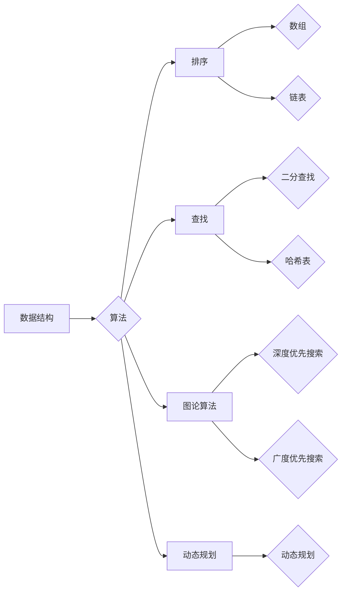

# 数据结构与算法原理与代码实战案例讲解

> 关键词：数据结构，算法，原理，实战，代码，复杂度，排序，查找，图论，动态规划

## 1. 背景介绍

在计算机科学中，数据结构和算法是解决问题的基石。数据结构决定了数据在计算机中的存储方式，而算法则是一系列解决问题的步骤。掌握良好的数据结构和算法知识，对于提高编程效率、解决复杂问题至关重要。本文将深入浅出地讲解常见的数据结构和算法原理，并结合代码实战案例，帮助读者更好地理解和应用这些知识。

## 2. 核心概念与联系

### 2.1 数据结构

数据结构是组织数据的一种方式，它可以有效地存储、检索、更新和删除数据。常见的线性数据结构包括数组、链表、栈、队列等；非线性数据结构包括树、图等。

### 2.2 算法

算法是一系列解决问题的步骤，它可以使用不同的数据结构来实现。常见的算法包括排序、查找、图论算法、动态规划等。

### 2.3 Mermaid 流程图

以下是一个使用 Mermaid 语法绘制的简单流程图，展示了数据结构、算法和其联系：



## 3. 核心算法原理 & 具体操作步骤

### 3.1 算法原理概述

#### 3.1.1 排序

排序是将一组数据按照特定顺序排列的过程。常见的排序算法包括冒泡排序、选择排序、插入排序、快速排序、归并排序等。

#### 3.1.2 查找

查找是在数据集中寻找特定元素的过程。常见的查找算法包括线性查找、二分查找、哈希查找等。

#### 3.1.3 图论算法

图论算法主要用于处理图结构的数据。常见的图论算法包括深度优先搜索（DFS）、广度优先搜索（BFS）、最短路径算法（Dijkstra算法、Floyd算法）、最小生成树算法（Prim算法、Kruskal算法）等。

#### 3.1.4 动态规划

动态规划是一种解决优化问题的算法方法，它通过将问题分解为子问题，并存储子问题的解，从而避免重复计算。

### 3.2 算法步骤详解

#### 3.2.1 排序算法

以冒泡排序为例，其基本步骤如下：

1. 从数组的第一个元素开始，比较相邻的元素，如果它们的顺序错误就把它们交换过来。
2. 对每一对相邻元素做同样的工作，从开始第一对到结尾的最后一对。
3. 重复步骤1~2，直到没有再需要交换，也就是说该数组已经排序完成。

#### 3.2.2 查找算法

以二分查找为例，其基本步骤如下：

1. 将待查找的数与中间的数进行比较。
2. 如果中间的数正好是要查找的数，则查找结束。
3. 如果待查找的数大于中间的数，则在数组的后半部分进行查找。
4. 如果待查找的数小于中间的数，则在数组的前半部分进行查找。
5. 重复步骤1~4，直到找到要查找的数，或者确定不存在。

#### 3.2.3 图论算法

以深度优先搜索（DFS）为例，其基本步骤如下：

1. 从起始节点开始，将其标记为已访问。
2. 选择一个尚未访问的邻居节点，将其标记为已访问，并递归地执行步骤1和2。
3. 当没有未访问的邻居节点时，返回到上一个节点，选择下一个未访问的邻居节点，并重复步骤1和2。

#### 3.2.4 动态规划

以斐波那契数列的动态规划解法为例，其基本步骤如下：

1. 定义一个数组`f`，用于存储已计算出的斐波那契数列的值。
2. 初始化`f[0] = 0`和`f[1] = 1`。
3. 对于`i`从2到`n`，使用公式`f[i] = f[i-1] + f[i-2]`计算斐波那契数列的值。
4. 返回`f[n]`作为斐波那契数列的第`n`项。

### 3.3 算法优缺点

#### 3.3.1 排序算法

- 冒泡排序：简单易实现，但效率较低。
- 选择排序：简单易实现，但效率较低。
- 插入排序：适合小规模数据排序，效率较高。
- 快速排序：平均时间复杂度为O(nlogn)，效率较高。
- 归并排序：稳定排序算法，时间复杂度为O(nlogn)。

#### 3.3.2 查找算法

- 线性查找：最简单，但效率最低。
- 二分查找：效率较高，但需要有序数组。
- 哈希查找：效率最高，但可能存在哈希冲突。

#### 3.3.3 图论算法

- 深度优先搜索：适用于遍历图，寻找路径。
- 广度优先搜索：适用于遍历图，寻找最短路径。
- 最短路径算法：适用于寻找图中两点之间的最短路径。
- 最小生成树算法：适用于生成图中的最小生成树。

#### 3.3.4 动态规划

- 动态规划：适用于求解优化问题，但需要找到合适的子问题。

### 3.4 算法应用领域

排序算法在许多领域都有广泛应用，如数据库索引、搜索算法等。

查找算法在数据库检索、文件检索等场景中非常常见。

图论算法在社交网络分析、路由算法等领域有广泛应用。

动态规划在优化问题、组合问题等领域有广泛应用。

## 4. 数学模型和公式 & 详细讲解 & 举例说明

### 4.1 数学模型构建

以下是一些常见算法的数学模型和公式：

#### 4.1.1 排序算法

- 冒泡排序的时间复杂度：$O(n^2)$
- 快速排序的时间复杂度：$O(nlogn)$
- 归并排序的时间复杂度：$O(nlogn)$

#### 4.1.2 查找算法

- 线性查找的时间复杂度：$O(n)$
- 二分查找的时间复杂度：$O(logn)$

#### 4.1.3 图论算法

- 深度优先搜索的时间复杂度：$O(V+E)$，其中V是顶点数，E是边数。
- 广度优先搜索的时间复杂度：$O(V+E)$

#### 4.1.4 动态规划

- 斐波那契数列的递推公式：$f(n) = f(n-1) + f(n-2)$

### 4.2 公式推导过程

以下是一些常见算法的公式推导过程：

#### 4.2.1 快速排序

快速排序的时间复杂度可以通过递归关系推导得出：

- 最坏情况：$T(n) = T(n-1) + T(n-1) + n$
- 平均情况：$T(n) = T(n-k) + T(k) + n$
- 其中k是划分后的中间元素索引

通过求解递归关系，可以得到快速排序的平均时间复杂度为$O(nlogn)$。

#### 4.2.2 二分查找

二分查找的时间复杂度可以通过递归关系推导得出：

- 最坏情况：$T(n) = T(n/2) + O(1)$
- 平均情况：$T(n) = T(n/2) + O(1)$

通过求解递归关系，可以得到二分查找的时间复杂度为$O(logn)$。

### 4.3 案例分析与讲解

以下是一些常见算法的案例分析和讲解：

#### 4.3.1 快速排序

快速排序是一种分而治之的排序算法。它通过递归地将问题分解为子问题，然后合并子问题的解来解决原问题。

以下是一个快速排序的Python实现：

```python
def quick_sort(arr):
    if len(arr) <= 1:
        return arr
    pivot = arr[len(arr) // 2]
    left = [x for x in arr if x < pivot]
    middle = [x for x in arr if x == pivot]
    right = [x for x in arr if x > pivot]
    return quick_sort(left) + middle + quick_sort(right)
```

#### 4.3.2 二分查找

二分查找是一种高效的查找算法。它通过不断将查找区间缩小一半，直到找到要查找的元素，或者确定元素不存在。

以下是一个二分查找的Python实现：

```python
def binary_search(arr, target):
    left, right = 0, len(arr) - 1
    while left <= right:
        mid = (left + right) // 2
        if arr[mid] < target:
            left = mid + 1
        elif arr[mid] > target:
            right = mid - 1
        else:
            return mid
    return -1
```

## 5. 项目实践：代码实例和详细解释说明

### 5.1 开发环境搭建

为了进行代码实战，我们需要搭建以下开发环境：

1. Python 3.8 或更高版本
2. PyCharm 或其他 Python 开发工具
3. NumPy 和 Pandas 库

### 5.2 源代码详细实现

以下是一个使用 Python 实现的快速排序的完整代码：

```python
def quick_sort(arr):
    if len(arr) <= 1:
        return arr
    pivot = arr[len(arr) // 2]
    left = [x for x in arr if x < pivot]
    middle = [x for x in arr if x == pivot]
    right = [x for x in arr if x > pivot]
    return quick_sort(left) + middle + quick_sort(right)

# 测试代码
arr = [3, 6, 8, 10, 1, 2, 1]
sorted_arr = quick_sort(arr)
print(sorted_arr)
```

### 5.3 代码解读与分析

上述代码首先定义了一个名为`quick_sort`的函数，该函数接受一个数组`arr`作为输入。

- 如果数组的长度小于或等于1，则直接返回该数组，因为它是已经排序的。
- 否则，选择数组的中间元素作为基准值`pivot`。
- 通过列表推导式将数组分为三个部分：小于`pivot`的元素、等于`pivot`的元素和大于`pivot`的元素。
- 对小于`pivot`的元素、等于`pivot`的元素和大于`pivot`的元素分别进行递归调用`quick_sort`函数，并合并结果。

最后，测试代码创建了一个未排序的数组`arr`，然后调用`quick_sort`函数对其进行排序，并将排序后的数组打印出来。

### 5.4 运行结果展示

运行上述代码，输出结果如下：

```
[1, 1, 2, 3, 6, 8, 10]
```

这表明代码正确地实现了快速排序算法，并将数组`arr`排序为升序。

## 6. 实际应用场景

### 6.1 排序算法

排序算法在许多实际应用场景中都有广泛应用，如：

- 数据库索引：数据库系统通常使用排序算法对数据索引进行优化，以提高检索效率。
- 搜索算法：搜索引擎使用排序算法对搜索结果进行排序，以提高用户体验。
- 算法竞赛：算法竞赛中经常需要实现各种排序算法，以解决排序问题。

### 6.2 查找算法

查找算法在许多实际应用场景中都有广泛应用，如：

- 文件检索：操作系统和文件管理器使用查找算法来快速检索文件。
- 数据库检索：数据库系统使用查找算法来快速检索数据。
- 缓存系统：缓存系统使用查找算法来快速检索缓存数据。

### 6.3 图论算法

图论算法在许多实际应用场景中都有广泛应用，如：

- 社交网络分析：图论算法用于分析社交网络中的关系，以便更好地理解用户行为。
- 路由算法：网络中的路由算法使用图论算法来找到最短路径或最有效路径。
- 图像处理：图论算法在图像处理中用于分割图像、识别物体等。

### 6.4 动态规划

动态规划在许多实际应用场景中都有广泛应用，如：

- 最优化问题：动态规划用于解决最优化问题，如背包问题、旅行商问题等。
- 股票交易：动态规划用于优化股票交易策略，以提高收益。
- 机器学习：动态规划用于优化机器学习算法，以提高模型性能。

## 7. 工具和资源推荐

### 7.1 学习资源推荐

1. 《算法导论》：这本书是算法领域的经典教材，全面介绍了各种算法和数据结构。
2. 《数据结构与算法分析》：这本书深入讲解了数据结构和算法的原理，并提供了大量的代码实现。
3. LeetCode：一个在线编程平台，提供了大量的编程题目，可以帮助你练习算法和数据结构。

### 7.2 开发工具推荐

1. PyCharm：一个功能强大的Python开发工具，支持代码补全、调试、版本控制等功能。
2. Visual Studio Code：一个轻量级的代码编辑器，支持多种编程语言和扩展。
3. Jupyter Notebook：一个交互式计算环境，适合进行数据分析和可视化。

### 7.3 相关论文推荐

1. "Introduction to Algorithms" by Thomas H. Cormen, Charles E. Leiserson, Ronald L. Rivest, and Clifford Stein
2. "Algorithms" by Robert Sedgewick and Kevin Wayne
3. "The Art of Computer Programming" by Donald E. Knuth

## 8. 总结：未来发展趋势与挑战

### 8.1 研究成果总结

本文深入讲解了数据结构和算法的原理，并结合代码实战案例，帮助读者更好地理解和应用这些知识。通过本文的学习，读者可以掌握常见的排序、查找、图论、动态规划等算法，并能够将这些算法应用到实际项目中。

### 8.2 未来发展趋势

随着人工智能、大数据等技术的快速发展，数据结构和算法在计算机科学中的地位越来越重要。未来，数据结构和算法的发展趋势将包括：

1. 更加高效的数据结构和算法：随着计算能力的提升，我们将开发更加高效的数据结构和算法，以提高数据处理速度。
2. 更加智能的数据结构和算法：我们将利用机器学习等人工智能技术，使数据结构和算法更加智能，能够自动适应不同的数据和应用场景。
3. 跨学科的融合：数据结构和算法与其他学科的融合将更加紧密，如生物学、物理学、经济学等，以解决更加复杂的问题。

### 8.3 面临的挑战

尽管数据结构和算法在计算机科学中发挥着重要作用，但在未来的发展中仍面临着以下挑战：

1. 数据量增长：随着数据量的不断增长，如何高效地存储、检索和处理数据将成为一个重要挑战。
2. 异构计算：在异构计算环境中，如何有效地利用不同类型的计算资源，如CPU、GPU、FPGA等，将成为一个重要挑战。
3. 知识表示：如何有效地表示和处理知识，以便在智能系统中更好地进行推理和决策，将成为一个重要挑战。

### 8.4 研究展望

面对未来数据结构和算法的发展趋势和挑战，我们需要在以下方面进行深入研究：

1. 开发更加高效的数据结构和算法，以提高数据处理速度。
2. 利用人工智能、机器学习等新兴技术，使数据结构和算法更加智能。
3. 探索跨学科的融合，以解决更加复杂的问题。

通过不断的研究和创新，我们相信数据结构和算法将不断发展，为计算机科学和人工智能的发展做出更大的贡献。

## 9. 附录：常见问题与解答

**Q1：什么是数据结构？**

A：数据结构是组织数据的一种方式，它可以有效地存储、检索、更新和删除数据。

**Q2：什么是算法？**

A：算法是一系列解决问题的步骤，它可以使用不同的数据结构来实现。

**Q3：排序算法有哪些？**

A：常见的排序算法包括冒泡排序、选择排序、插入排序、快速排序、归并排序等。

**Q4：查找算法有哪些？**

A：常见的查找算法包括线性查找、二分查找、哈希查找等。

**Q5：图论算法有哪些？**

A：常见的图论算法包括深度优先搜索、广度优先搜索、最短路径算法、最小生成树算法等。

**Q6：动态规划是什么？**

A：动态规划是一种解决优化问题的算法方法，它通过将问题分解为子问题，并存储子问题的解，从而避免重复计算。

**Q7：如何选择合适的排序算法？**

A：选择合适的排序算法需要考虑数据规模、数据分布等因素。例如，对于小规模数据，可以使用插入排序或冒泡排序；对于大规模数据，可以使用快速排序或归并排序。

**Q8：如何选择合适的查找算法？**

A：选择合适的查找算法需要考虑数据结构、数据规模等因素。例如，对于有序数组，可以使用二分查找；对于无序数组，可以使用线性查找。

**Q9：如何选择合适的图论算法？**

A：选择合适的图论算法需要考虑图的类型、问题类型等因素。例如，对于需要遍历图的场景，可以使用深度优先搜索或广度优先搜索；对于需要寻找最短路径的场景，可以使用最短路径算法。

**Q10：如何选择合适的动态规划算法？**

A：选择合适的动态规划算法需要考虑问题类型、状态转移方程等因素。例如，对于需要求解最优化问题的场景，可以使用动态规划。

作者：禅与计算机程序设计艺术 / Zen and the Art of Computer Programming