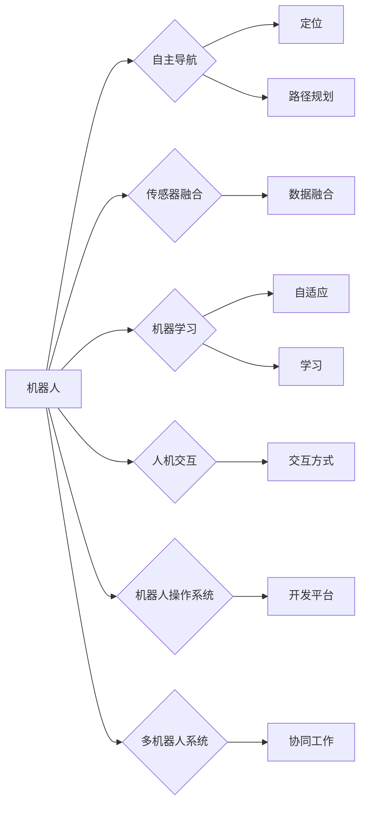

# 机器人学 (Robotics)

> 关键词：机器人技术，自主导航，传感器融合，机器学习，人机交互，机器人操作系统，多机器人系统

## 1. 背景介绍

机器人学，作为人工智能的一个重要分支，是研究、设计、构建和操作机器人的学科。随着计算机技术、传感器技术、控制理论以及材料科学的快速发展，机器人已经从工业领域的单一执行器转变为能够适应复杂环境、执行多样化任务的智能实体。本文将深入探讨机器人学的核心概念、算法原理、项目实践以及实际应用场景。

### 1.1 问题的由来

从早期的工业机器人到如今的服务机器人、家庭机器人，机器人技术在不断地改变着我们的生活。随着物联网、大数据、云计算等技术的发展，机器人逐渐具备了自主感知、决策、执行的能力，成为了现代社会不可或缺的一部分。

### 1.2 研究现状

当前，机器人学研究主要集中在以下几个方面：

- 自主导航：研究机器人在未知环境中进行定位、路径规划和导航的方法。
- 传感器融合：将多种传感器数据融合，提供更准确的环境感知。
- 机器学习：利用机器学习算法，使机器人具备自适应和自主学习的能力。
- 人机交互：研究人与机器人之间的交互方式，提高用户体验。
- 机器人操作系统：构建标准化的机器人开发平台，促进机器人技术的普及和应用。
- 多机器人系统：研究多个机器人协同工作的方法，提高任务执行效率。

### 1.3 研究意义

机器人学的研究具有以下重要意义：

- 促进科技进步：推动机器人技术的创新和发展，为人类创造更多便利。
- 改善生活质量：提高工作效率，降低人类劳动强度，丰富日常生活。
- 解决复杂问题：在危险或人类难以到达的环境中执行任务，如救援、探测等。
- 推动经济增长：创造新的就业机会，促进产业结构升级。

### 1.4 本文结构

本文将按照以下结构进行展开：

- 第2部分，介绍机器人学的基本概念和关键联系。
- 第3部分，阐述机器人学的核心算法原理和具体操作步骤。
- 第4部分，讲解机器人学中的数学模型和公式，并举例说明。
- 第5部分，提供机器人项目实践的代码实例和详细解释。
- 第6部分，探讨机器人学的实际应用场景和未来发展趋势。
- 第7部分，推荐相关的学习资源、开发工具和参考文献。
- 第8部分，总结研究成果，展望未来发展趋势与挑战。
- 第9部分，提供常见问题与解答。

## 2. 核心概念与联系

机器人学的核心概念包括：

- 机器人：一种能够感知环境、自主决策、执行任务的智能实体。
- 自主导航：机器人在未知环境中进行定位、路径规划和导航的能力。
- 传感器融合：将多种传感器数据融合，提供更准确的环境感知。
- 机器学习：利用机器学习算法，使机器人具备自适应和自主学习的能力。
- 人机交互：研究人与机器人之间的交互方式，提高用户体验。
- 机器人操作系统：构建标准化的机器人开发平台，促进机器人技术的普及和应用。
- 多机器人系统：研究多个机器人协同工作的方法，提高任务执行效率。

以下是机器人学核心概念的Mermaid流程图：



## 3. 核心算法原理 & 具体操作步骤

### 3.1 算法原理概述

机器人学中的核心算法包括：

- 自主导航算法：如全局路径规划、局部路径规划、SLAM（Simultaneous Localization and Mapping）等。
- 传感器融合算法：如卡尔曼滤波、粒子滤波、多传感器数据融合等。
- 机器学习算法：如监督学习、无监督学习、强化学习等。
- 人机交互算法：如语音识别、自然语言处理、手势识别等。
- 机器人操作系统：如ROS（Robot Operating System）、DARwIn等。

### 3.2 算法步骤详解

以下以自主导航算法为例，详细讲解其操作步骤：

1. **环境感知**：机器人通过传感器获取周围环境信息，如激光雷达、摄像头等。
2. **定位**：根据传感器数据，结合预先建立的环境地图，计算机器人在环境中的位置。
3. **路径规划**：根据机器人的当前位置、目标位置和环境地图，规划一条安全的路径。
4. **运动控制**：根据规划的路径，控制机器人的运动，使其沿着路径前进。

### 3.3 算法优缺点

以自主导航算法为例，其优缺点如下：

- 优点：
  - 能够使机器人在未知环境中自主导航。
  - 可以适应复杂多变的环境。
  - 能够提高机器人工作的效率和安全性。
- 缺点：
  - 计算复杂度高，对硬件要求较高。
  - 在动态环境中，路径规划可能存在困难。

### 3.4 算法应用领域

自主导航算法广泛应用于以下领域：

- 自动驾驶汽车
- 无人机
- 服务机器人
- 工业机器人
- 智能家居

## 4. 数学模型和公式 & 详细讲解 & 举例说明

### 4.1 数学模型构建

在机器人学中，常用的数学模型包括：

- 线性代数：用于描述机器人运动学、动力学模型。
- 概率论：用于描述传感器融合、机器学习等。
- 控制理论：用于设计控制器，控制机器人运动。

### 4.2 公式推导过程

以下以卡尔曼滤波为例，讲解其公式推导过程：

$$
\begin{aligned}
x_{t|t-1} &= F_t x_{t-1} + B_t u_t \\
P_{t|t-1} &= F_t P_{t-1} F_t^T + Q_t \\
z_t &= H_t x_t + v_t \\
P_{z|t} &= H_t P_{t|t-1} H_t^T + R_t \\
K_t &= P_{t|t-1} H_t^T (H_t P_{t|t-1} H_t^T + R_t)^{-1} \\
x_{t|t} &= x_{t|t-1} + K_t (z_t - H_t x_{t|t-1}) \\
P_{t|t} &= (I - K_t H_t) P_{t|t-1}
\end{aligned}
$$

### 4.3 案例分析与讲解

以SLAM为例，讲解其数学模型和算法原理。

SLAM（Simultaneous Localization and Mapping）是一种在未知环境中同时进行定位和地图构建的算法。其基本原理如下：

1. 机器人通过传感器获取周围环境信息，如激光雷达、摄像头等。
2. 将传感器数据输入到SLAM算法中，得到机器人的位姿估计和地图信息。
3. 利用位姿估计和地图信息，更新机器人的导航路径。

## 5. 项目实践：代码实例和详细解释说明

### 5.1 开发环境搭建

以ROS（Robot Operating System）为例，讲解开发环境搭建过程。

1. 安装ROS：从官方网站下载ROS安装包，并根据系统环境选择合适的版本。
2. 安装依赖库：根据ROS版本，安装所需的依赖库，如Python、C++等。
3. 创建ROS工作空间：创建一个新的ROS工作空间，并设置环境变量。
4. 编译并源代码：将源代码添加到工作空间，并编译依赖库。

### 5.2 源代码详细实现

以下是一个简单的ROS节点，用于发布和订阅话题：

```python
#!/usr/bin/env python
import rospy
from std_msgs.msg import String

def talker():
    pub = rospy.Publisher('chatter', String, queue_size=10)
    rospy.init_node('talker', anonymous=True)
    rate = rospy.Rate(10)  # 10hz
    while not rospy.is_shutdown():
        hello_str = "hello world %s" % rospy.get_time()
        rospy.loginfo(hello_str)
        pub.publish(hello_str)
        rate.sleep()

if __name__ == '__main__':
    try:
        talker()
    except rospy.ROSInterruptException:
        pass
```

### 5.3 代码解读与分析

上述代码定义了一个名为`talker`的函数，用于发布名为`chatter`的话题，发布的内容是当前时间。`rospy.init_node`初始化ROS节点，`rospy.Publisher`创建一个发布器，`rospy.Rate`设置发布频率，`rospy.loginfo`记录日志信息。

### 5.4 运行结果展示

运行上述代码，可以在ROS的`rosrun`命令行工具中看到输出信息：

```bash
$ rostopic list
/talker

$ rostopic echo /talker
hello world 1614668582.514
hello world 1614668583.514
hello world 1614668584.514
...
```

## 6. 实际应用场景

### 6.1 工业机器人

工业机器人广泛应用于制造业、物流、装配等领域，提高生产效率和产品质量。

### 6.2 服务机器人

服务机器人如扫地机器人、送餐机器人、清洁机器人等，为人类提供便捷的生活服务。

### 6.3 家庭机器人

家庭机器人如机器人管家、宠物机器人等，为家庭生活带来更多乐趣和便利。

### 6.4 医疗机器人

医疗机器人用于辅助医生进行手术、康复、护理等工作，提高医疗水平。

### 6.5 教育机器人

教育机器人用于辅助教学，激发学生的学习兴趣，提高教学质量。

### 6.4 未来应用展望

随着机器人技术的不断发展，未来机器人将在更多领域得到应用，如：

- 环境监测
- 农业自动化
- 安全巡逻
- 智能交通
- 灾难救援

## 7. 工具和资源推荐

### 7.1 学习资源推荐

- 《机器人学导论》（Introduction to Robotics）
- 《机器人操作系统》（Robot Operating System, ROS）官方文档
- 《机器学习》（Machine Learning）课程

### 7.2 开发工具推荐

- ROS（Robot Operating System）
- Gazebo仿真平台
- OpenCV计算机视觉库
- TensorFlow机器学习框架

### 7.3 相关论文推荐

- “Probabilistic Robotics”（Probabilistic Robotics）
- “Robotics: Modelling, Planning and Control”（Robotics: Modelling, Planning and Control）
- “Machine Learning”（Machine Learning）

## 8. 总结：未来发展趋势与挑战

### 8.1 研究成果总结

机器人学作为一门跨学科领域，取得了丰硕的研究成果。在自主导航、传感器融合、机器学习、人机交互等方面，都已经取得了显著的进展。

### 8.2 未来发展趋势

未来，机器人学将朝着以下方向发展：

- 高度自主化：机器人将具备更强大的自主感知、决策和执行能力。
- 智能化：机器人将具备更高级的智能水平，能够适应更复杂的环境和任务。
- 人性化：机器人将更加符合人类的使用习惯，提高用户体验。

### 8.3 面临的挑战

尽管机器人学取得了显著进展，但仍面临着以下挑战：

- 技术难题：如传感器技术、控制理论、机器人操作系统等。
- 安全性：确保机器人的安全和可靠性。
- 伦理问题：如机器人就业、隐私保护等。

### 8.4 研究展望

未来，机器人学的研究将更加注重以下几个方面：

- 跨学科融合：机器人学与计算机科学、机械工程、生物学等学科的交叉融合。
- 新型机器人技术：如软体机器人、纳米机器人等。
- 应用拓展：将机器人技术应用于更多领域，如医疗、教育、娱乐等。

## 9. 附录：常见问题与解答

**Q1：机器人学的主要研究内容有哪些？**

A：机器人学的主要研究内容包括自主导航、传感器融合、机器学习、人机交互、机器人操作系统、多机器人系统等。

**Q2：机器人学的主要应用领域有哪些？**

A：机器人学的应用领域包括工业、服务、家庭、医疗、教育等。

**Q3：如何学习机器人学？**

A：可以通过阅读相关书籍、参加培训课程、实践项目等方式学习机器人学。

**Q4：机器人学未来的发展趋势是什么？**

A：机器人学未来的发展趋势是高度自主化、智能化、人性化。

**Q5：机器人学面临哪些挑战？**

A：机器人学面临的挑战包括技术难题、安全性、伦理问题等。

---

作者：禅与计算机程序设计艺术 / Zen and the Art of Computer Programming