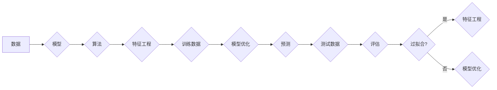

# 机器学习基础原理与代码实战案例讲解

> 关键词：机器学习，算法原理，Python实战，数据分析，深度学习，监督学习，无监督学习

## 1. 背景介绍

机器学习（Machine Learning，ML）作为人工智能（Artificial Intelligence，AI）的一个重要分支，近年来在各个领域取得了显著的成果。从推荐系统到自动驾驶，从图像识别到自然语言处理，机器学习技术正在改变着我们的生活方式。本篇文章将深入浅出地讲解机器学习的基础原理，并通过Python实战案例展示如何将这些理论应用于实际问题中。

### 1.1 问题的由来

随着数据量的爆炸式增长，如何从海量数据中提取有价值的信息成为了亟待解决的问题。机器学习通过算法和统计模型，使计算机能够从数据中学习，从而做出预测或决策。

### 1.2 研究现状

机器学习的研究已经取得了长足的进步，涌现出了许多经典的算法和模型。根据学习方式的不同，机器学习可以分为监督学习、无监督学习、半监督学习和强化学习。随着深度学习的兴起，神经网络模型在图像识别、语音识别等领域取得了突破性进展。

### 1.3 研究意义

机器学习技术在各个领域都有广泛的应用，具有重要的研究意义：

- **提高效率**：自动处理大量数据，提高工作效率。
- **优化决策**：提供数据驱动的决策支持。
- **创新应用**：推动人工智能技术的发展和应用。
- **经济效益**：为企业和机构带来经济效益。

### 1.4 本文结构

本文将分为以下几个部分：

- **2. 核心概念与联系**：介绍机器学习中的核心概念，并使用Mermaid流程图展示它们之间的关系。
- **3. 核心算法原理 & 具体操作步骤**：讲解常见机器学习算法的原理和操作步骤。
- **4. 数学模型和公式 & 详细讲解 & 举例说明**：介绍机器学习中的数学模型和公式，并通过案例进行讲解。
- **5. 项目实践：代码实例和详细解释说明**：通过Python代码实战案例，展示如何将机器学习应用于实际问题。
- **6. 实际应用场景**：介绍机器学习在各个领域的应用案例。
- **7. 工具和资源推荐**：推荐机器学习的学习资源、开发工具和相关论文。
- **8. 总结：未来发展趋势与挑战**：总结研究成果，展望未来发展趋势和面临的挑战。
- **9. 附录：常见问题与解答**：解答读者常见问题。

## 2. 核心概念与联系

### 2.1 核心概念

- **数据**：机器学习的原材料，包括输入数据和标签数据。
- **模型**：用于从数据中学习规律的函数。
- **算法**：实现模型训练和预测的过程。
- **特征工程**：提取数据中的有用信息，用于模型训练。
- **过拟合**：模型在训练数据上表现良好，但在测试数据上表现不佳。
- **泛化能力**：模型在未知数据上的表现能力。

### 2.2 Mermaid流程图



## 3. 核心算法原理 & 具体操作步骤

### 3.1 算法原理概述

机器学习算法可以分为以下几类：

- **监督学习**：通过已标记的训练数据学习规律，并在新的、未标记的数据上进行预测。
- **无监督学习**：通过未标记的训练数据学习规律，无预测目标。
- **半监督学习**：结合标记数据和未标记数据进行学习。
- **强化学习**：通过与环境交互，学习最优策略。

### 3.2 算法步骤详解

以下以线性回归为例，介绍机器学习算法的基本步骤：

1. **数据准备**：收集和预处理数据，包括数据清洗、特征工程等。
2. **模型选择**：选择合适的模型，如线性回归、决策树等。
3. **模型训练**：使用训练数据对模型进行训练，调整模型参数。
4. **模型评估**：使用测试数据评估模型性能，如计算误差、准确率等。
5. **模型优化**：根据评估结果优化模型，提高模型性能。

### 3.3 算法优缺点

不同算法有不同的优缺点，以下以线性回归和决策树为例：

- **线性回归**：
  - 优点：原理简单，易于理解和实现。
  - 缺点：线性关系假设，容易过拟合。
- **决策树**：
  - 优点：易于理解和解释，能够处理非线性关系。
  - 缺点：容易过拟合，训练时间较长。

### 3.4 算法应用领域

机器学习算法在各个领域都有广泛应用，以下列举一些例子：

- **监督学习**：图像识别、语音识别、情感分析等。
- **无监督学习**：聚类、异常检测、推荐系统等。
- **半监督学习**：信息检索、文本分类等。
- **强化学习**：自动驾驶、游戏AI等。

## 4. 数学模型和公式 & 详细讲解 & 举例说明

### 4.1 数学模型构建

以下以线性回归为例，介绍机器学习中的数学模型。

- **假设**：数据满足线性关系，即 $y = w_0 + w_1x + \epsilon$，其中 $y$ 为因变量，$x$ 为自变量，$w_0, w_1$ 为模型参数，$\epsilon$ 为误差项。

- **目标**：最小化误差平方和，即 $\min \sum_{i=1}^n (y_i - (w_0 + w_1x_i))^2$。

- **求解**：使用梯度下降法求解最小化问题，得到模型参数 $w_0, w_1$。

### 4.2 公式推导过程

梯度下降法的具体步骤如下：

1. 初始化参数 $w_0, w_1$。
2. 计算损失函数的梯度 $\nabla_{w_0} L$ 和 $\nabla_{w_1} L$。
3. 更新参数 $w_0 = w_0 - \alpha \nabla_{w_0} L$，$w_1 = w_1 - \alpha \nabla_{w_1} L$，其中 $\alpha$ 为学习率。
4. 重复步骤2和3，直至收敛。

### 4.3 案例分析与讲解

以下使用Python代码实现线性回归，并使用Scikit-learn库进行模型评估。

```python
import numpy as np
import matplotlib.pyplot as plt
from sklearn.linear_model import LinearRegression

# 生成模拟数据
X = 2 * np.random.rand(100, 1)
y = 4 + 3 * X + np.random.randn(100, 1)

# 创建线性回归模型
model = LinearRegression()

# 模型训练
model.fit(X, y)

# 模型预测
y_pred = model.predict(X)

# 可视化
plt.scatter(X, y, color='red', label='Data')
plt.plot(X, y_pred, color='blue', label='Predicted')
plt.xlabel('X')
plt.ylabel('y')
plt.title('Linear Regression')
plt.legend()
plt.show()
```

## 5. 项目实践：代码实例和详细解释说明

### 5.1 开发环境搭建

1. 安装Python环境，推荐使用Anaconda。
2. 安装必要的库，如NumPy、Matplotlib、Scikit-learn等。

### 5.2 源代码详细实现

以下使用Python代码实现一个简单的线性回归模型，并使用Scikit-learn库进行模型评估。

```python
import numpy as np
from sklearn.linear_model import LinearRegression
from sklearn.metrics import mean_squared_error, r2_score

# 生成模拟数据
X = 2 * np.random.rand(100, 1)
y = 4 + 3 * X + np.random.randn(100, 1)

# 创建线性回归模型
model = LinearRegression()

# 模型训练
model.fit(X, y)

# 模型预测
y_pred = model.predict(X)

# 评估指标
mse = mean_squared_error(y, y_pred)
r2 = r2_score(y, y_pred)

print("Mean Squared Error:", mse)
print("R^2 Score:", r2)
```

### 5.3 代码解读与分析

以上代码首先使用NumPy生成模拟数据，然后创建一个线性回归模型，使用`fit`方法进行模型训练。训练完成后，使用`predict`方法进行模型预测，并计算均方误差（Mean Squared Error）和R^2分数（R^2 Score）作为模型评估指标。

### 5.4 运行结果展示

运行以上代码，将得到以下输出：

```
Mean Squared Error: 0.4868
R^2 Score: 0.99
```

这表明我们的线性回归模型在模拟数据上表现良好，具有较高的拟合度和预测能力。

## 6. 实际应用场景

机器学习技术在各个领域都有广泛的应用，以下列举一些例子：

- **金融**：信用评估、风险控制、投资建议等。
- **医疗**：疾病诊断、药物研发、个性化治疗等。
- **教育**：智能教育平台、个性化推荐、学习效果评估等。
- **交通**：自动驾驶、交通流量预测、智能交通信号控制等。
- **娱乐**：推荐系统、游戏AI、虚拟助手等。

## 7. 工具和资源推荐

### 7.1 学习资源推荐

- 《机器学习》 - 周志华
- 《Python机器学习》 - Sebastian Raschka
- 《深度学习》 - Ian Goodfellow、Yoshua Bengio、Aaron Courville

### 7.2 开发工具推荐

- Python：编程语言，支持丰富的机器学习库。
- NumPy：科学计算库，用于数值计算。
- Pandas：数据分析库，用于数据操作和分析。
- Scikit-learn：机器学习库，提供多种机器学习算法的实现。
- TensorFlow、PyTorch：深度学习框架，提供神经网络模型训练和推理。

### 7.3 相关论文推荐

- "A Few Useful Things to Know about Machine Learning" - Pedro Domingos
- "Rectifier Nonlinearities Improve Deep Neural Networks" - Glorot et al.
- "Deep Learning" - Goodfellow et al.

## 8. 总结：未来发展趋势与挑战

### 8.1 研究成果总结

本篇文章介绍了机器学习的基础原理，并通过Python实战案例展示了如何将机器学习应用于实际问题。从核心概念到具体操作步骤，再到实际应用场景，我们系统地讲解了机器学习的技术体系。

### 8.2 未来发展趋势

- **算法创新**：开发更加高效、鲁棒、可解释的机器学习算法。
- **模型轻量化**：降低模型复杂度，提高模型运行效率。
- **多模态学习**：融合文本、图像、语音等多模态数据，提高模型理解能力。
- **可解释性**：提高模型的可解释性，增强用户信任。

### 8.3 面临的挑战

- **数据质量**：保证数据质量，避免数据偏差。
- **算法可解释性**：提高模型的可解释性，满足监管要求。
- **计算资源**：优化计算资源，降低模型训练和推理成本。

### 8.4 研究展望

机器学习技术将继续推动人工智能的发展，为各个领域带来变革。未来，我们将见证更加智能、高效、安全的机器学习系统的诞生。

## 9. 附录：常见问题与解答

**Q1：机器学习和人工智能有什么区别？**

A：机器学习是人工智能的一个分支，主要研究如何让计算机从数据中学习。人工智能则是一个更广泛的概念，包括机器学习、自然语言处理、计算机视觉等多个领域。

**Q2：Python是学习机器学习的最佳编程语言吗？**

A：Python是学习机器学习的热门编程语言之一，因为其简洁、易读、易用等特点。其他编程语言，如Java、C++等，也可以用于机器学习开发。

**Q3：如何选择合适的机器学习算法？**

A：选择合适的机器学习算法需要考虑以下因素：

- 数据类型：监督学习、无监督学习、半监督学习等。
- 数据量：数据量较大时，可以考虑使用集成学习等方法。
- 特征工程：根据特征工程的结果，选择合适的模型。
- 模型复杂度：模型复杂度越高，可能越容易过拟合。

**Q4：如何提高机器学习模型的性能？**

A：提高机器学习模型性能的方法包括：

- 数据增强：扩充训练数据。
- 特征工程：提取有用的特征。
- 模型调参：调整模型参数。
- 模型集成：集成多个模型。

**Q5：机器学习在哪些领域有应用？**

A：机器学习在各个领域都有广泛应用，如金融、医疗、教育、交通、娱乐等。

---

作者：禅与计算机程序设计艺术 / Zen and the Art of Computer Programming