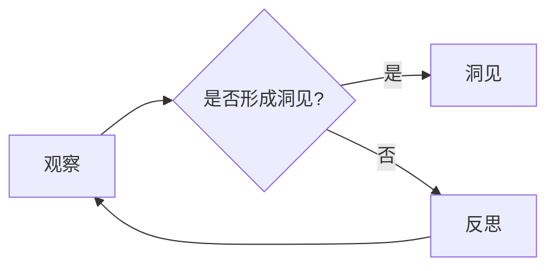
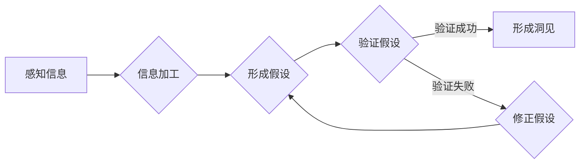

> 洞见，观察，反思，认知科学，知识构建，机器学习，人类智能，AI伦理

# 洞见的形成：从观察到反思

洞见，是认识世界、理解现象的深刻见解，是知识积累与思维创新的结果。在计算机科学和人工智能领域，洞见的形成尤为关键，它不仅推动着技术的进步，也影响着我们对智能本质的理解。本文将探讨洞见的形成过程，从观察、反思到知识构建，结合认知科学的视角和机器学习的技术，探讨如何通过观察和反思来形成洞见。

## 1. 背景介绍

### 1.1 观察与反思的重要性

观察是洞见形成的基础，是对外界信息的感知和记录；反思则是洞见的深加工，是对观察到的信息进行思考、分析和解释。在科学研究中，无论是理论探索还是技术发明，都离不开观察和反思的循环。

### 1.2 认知科学与洞见

认知科学是研究人类智能的科学，它研究人类如何获取、处理和运用知识。认知科学家认为，洞见的形成是一个复杂的认知过程，涉及到感知、记忆、思维、语言等多个认知功能。

### 1.3 机器学习与洞见

随着机器学习技术的发展，人工智能系统开始展现出一定的洞见能力，如模式识别、预测分析等。然而，机器学习中的“洞见”与人类的洞见有着本质的不同，它更多是基于数据和算法的统计规律，而非深层次的认知过程。

## 2. 核心概念与联系

### 2.1 观察与反思的概念

- **观察**：对外部世界的感知和记录，是信息收集的过程。
- **反思**：对观察到的信息进行深入思考，是知识构建的过程。

### 2.2 观察与反思的流程



### 2.3 观察与反思的Mermaid流程图



## 3. 核心算法原理 & 具体操作步骤

### 3.1 算法原理概述

洞见的形成过程可以类比为一个迭代的学习和验证过程。通过观察收集信息，通过反思分析和验证，最终形成洞见。

### 3.2 算法步骤详解

1. **观察阶段**：收集信息，可以是直接的感官体验，也可以是通过传感器、数据等间接获取。
2. **反思阶段**：对收集到的信息进行分析，建立假设或理论。
3. **验证阶段**：通过实验、分析等方法验证假设或理论。
4. **洞见形成**：验证成功的假设或理论转化为洞见。

### 3.3 算法优缺点

#### 优点：

- **系统化**：通过观察、反思、验证的循环，形成系统化的知识体系。
- **深入性**：通过反思，可以深入挖掘信息背后的本质。

#### 缺点：

- **时间成本**：洞见的形成需要时间，可能会错失某些机会。
- **主观性**：观察和反思都受到个人经验和认知的限制。

### 3.4 算法应用领域

- **科学研究**：通过观察实验结果，反思理论假设，形成科学理论。
- **技术创新**：通过观察现象，反思现有技术，形成技术创新。
- **问题解决**：通过观察问题，反思解决方案，形成有效的解决方案。

## 4. 数学模型和公式 & 详细讲解 & 举例说明

### 4.1 数学模型构建

洞见的形成可以类比为一个概率模型，其中观察、反思、验证是概率事件。

```mermaid
graph LR
    A[观察] --> B{形成洞见?} (0.6)
    B --> C{是} (0.3)
    B --> D{否} (0.7)
    C --> E[洞见]
    D --> F[反思]
    F --> G{重新观察} (0.8)
    G --> A
```

### 4.2 公式推导过程

假设观察、反思、验证的概率分别为 $P(O)$、$P(R)$、$P(V)$，洞见形成的概率为 $P(I)$，则有：

$$
P(I) = P(O) \times P(R) \times P(V)
$$

### 4.3 案例分析与讲解

以机器学习中的神经网络优化为例，通过观察损失函数的变化，反思优化算法的效率，验证新的优化算法，最终形成对神经网络优化的洞见。

## 5. 项目实践：代码实例和详细解释说明

### 5.1 开发环境搭建

使用Python进行编程实践，需要安装以下库：

```bash
pip install numpy matplotlib pandas scikit-learn
```

### 5.2 源代码详细实现

以下是一个简单的神经网络优化过程：

```python
import numpy as np
import matplotlib.pyplot as plt

# 定义一个简单的损失函数
def loss_function(x):
    return (x - 1) ** 2

# 梯度下降算法
def gradient_descent(x_start, learning_rate, epochs):
    x = x_start
    x_history = [x]
    loss_history = [loss_function(x)]
    for _ in range(epochs):
        grad = 2 * (x - 1)
        x -= learning_rate * grad
        x_history.append(x)
        loss_history.append(loss_function(x))
    return x_history, loss_history

# 训练过程
x_start = 2
learning_rate = 0.1
epochs = 100
x_history, loss_history = gradient_descent(x_start, learning_rate, epochs)

# 绘制损失曲线
plt.plot(x_history, loss_history)
plt.xlabel('x')
plt.ylabel('Loss')
plt.title('Gradient Descent Optimization')
plt.show()
```

### 5.3 代码解读与分析

这段代码定义了一个简单的损失函数，使用梯度下降算法进行优化。通过观察损失曲线的变化，我们可以反思优化算法的效率和稳定性。

### 5.4 运行结果展示

运行上述代码，可以得到一个下降的损失曲线，表明梯度下降算法能够有效地优化损失函数。

## 6. 实际应用场景

### 6.1 科学研究

在科学研究中，研究者通过观察实验现象，反思现有理论，验证新的理论，最终形成科学洞见。

### 6.2 技术创新

在技术创新中，工程师通过观察问题，反思现有技术，验证新的技术方案，最终形成技术洞见。

### 6.3 问题解决

在问题解决中，通过观察问题，反思解决方案，验证方案的有效性，最终形成问题解决洞见。

## 7. 工具和资源推荐

### 7.1 学习资源推荐

- 《认知科学基础》
- 《机器学习：一种统计方法》
- 《深度学习》
- 《人工智能：一种现代的方法》

### 7.2 开发工具推荐

- Jupyter Notebook
- Python
- Scikit-learn

### 7.3 相关论文推荐

- 《认知科学的计算机模拟》
- 《深度学习：人类智能的启示》
- 《机器学习的艺术与科学》

## 8. 总结：未来发展趋势与挑战

### 8.1 研究成果总结

本文探讨了洞见的形成过程，从观察、反思到知识构建，结合认知科学的视角和机器学习的技术，为洞见的形成提供了新的思路。

### 8.2 未来发展趋势

- 观察和反思的结合将更加紧密。
- 计算机科学和认知科学的交叉研究将更加深入。
- 机器学习将更加智能化，能够更好地模拟人类的洞见形成过程。

### 8.3 面临的挑战

- 观察和反思的过程可能受到主观因素的影响。
- 机器学习模型的洞见形成过程可能缺乏透明度和可解释性。
- 需要建立更加完善的理论体系来解释洞见的形成。

### 8.4 研究展望

洞见的形成是一个复杂的过程，需要多学科、多领域的交叉研究。未来，通过认知科学、机器学习和心理学等领域的深入研究，我们将更好地理解洞见的形成机制，并将其应用于更广泛的领域。

## 9. 附录：常见问题与解答

**Q1：洞见形成的过程中，观察和反思哪个更重要？**

A：观察和反思是相辅相成的，缺一不可。观察是收集信息的过程，是洞见形成的基础；反思是对信息的深入思考，是洞见的深加工。

**Q2：机器学习模型能够形成洞见吗？**

A：机器学习模型可以形成基于数据的洞见，但缺乏深层次的认知过程，与人类的洞见有着本质的不同。

**Q3：如何提高洞见的准确性？**

A：提高洞见的准确性需要多方面的努力，包括提高观察的客观性、加强反思的深度、改进验证方法等。

**Q4：洞见在科学研究中的作用是什么？**

A：洞见是科学研究的驱动力，它能够指导研究者提出新的假设、设计新的实验，推动科学技术的进步。

作者：禅与计算机程序设计艺术 / Zen and the Art of Computer Programming