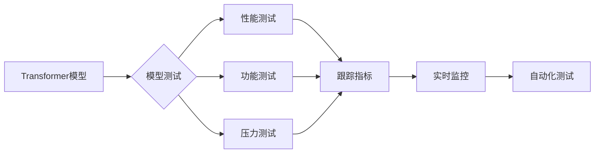

# 测试Transformer模型

> 关键词：Transformer, 模型测试, 神经网络评估, 跟踪指标, 实时监控, 自动化测试, 性能优化, 模型诊断

## 1. 背景介绍

随着深度学习在各个领域的广泛应用，神经网络模型，特别是Transformer模型，已成为自然语言处理、计算机视觉等领域的核心技术。然而，模型开发完成后，如何对其进行有效测试和评估，确保其性能稳定、可靠，成为了至关重要的一环。本文将深入探讨Transformer模型的测试方法，从核心概念到具体操作步骤，再到实际应用场景，旨在为模型开发者提供一套完整的测试方案。

## 2. 核心概念与联系

### 2.1 核心概念

#### 2.1.1 Transformer模型

Transformer模型是一种基于自注意力机制（Self-Attention Mechanism）的神经网络架构，由Vaswani等人在2017年提出。它通过全局注意力机制捕捉输入序列中单词之间的关系，从而实现高效、灵活的序列建模。

#### 2.1.2 模型测试

模型测试是指对训练好的模型进行一系列的评估，以验证其性能、鲁棒性和稳定性。测试方法包括但不限于性能测试、功能测试、压力测试等。

#### 2.1.3 跟踪指标

跟踪指标是指在模型训练和测试过程中，用于衡量模型性能的一系列指标，如准确率、召回率、F1值、损失函数值等。

#### 2.1.4 实时监控

实时监控是指在模型部署后，对模型运行状态进行实时监测，以便及时发现并处理异常情况。

#### 2.1.5 自动化测试

自动化测试是指利用自动化工具对模型进行测试，以提高测试效率和可靠性。

### 2.2 核心概念联系

Transformer模型的测试需要综合考虑上述概念。通过跟踪指标监控模型性能，利用自动化测试提高测试效率，并实时监控模型运行状态，以确保模型在各个阶段都保持稳定可靠的性能。



## 3. 核心算法原理 & 具体操作步骤

### 3.1 算法原理概述

Transformer模型的核心原理是自注意力机制。自注意力机制通过计算输入序列中每个单词与其他单词之间的关系，为每个单词生成一个加权表示，从而实现全局信息捕捉。

### 3.2 算法步骤详解

#### 3.2.1 数据准备

1. 收集数据集，包括训练集、验证集和测试集。
2. 对数据进行预处理，如分词、去停用词等。
3. 将预处理后的数据转化为模型所需的输入格式。

#### 3.2.2 模型训练

1. 加载预训练的Transformer模型。
2. 使用训练集数据对模型进行训练。
3. 在验证集上监控模型性能，并进行参数调整。

#### 3.2.3 模型评估

1. 使用测试集数据对模型进行评估。
2. 计算模型的性能指标，如准确率、召回率、F1值等。
3. 分析模型的优势和不足。

#### 3.2.4 模型部署

1. 将训练好的模型部署到服务器或设备上。
2. 实时监控模型运行状态，并进行性能优化。

### 3.3 算法优缺点

#### 3.3.1 优点

1. 高效：自注意力机制能够快速计算输入序列中单词之间的关系。
2. 泛化能力强：预训练的Transformer模型在多个任务上表现出色。
3. 灵活：可以通过调整模型结构和参数来适应不同任务。

#### 3.3.2 缺点

1. 计算量大：自注意力机制的计算复杂度较高，对硬件要求较高。
2. 难以解释：模型的决策过程难以解释，缺乏可解释性。

### 3.4 算法应用领域

Transformer模型在以下领域有着广泛的应用：

1. 自然语言处理：文本分类、机器翻译、文本生成等。
2. 计算机视觉：图像分类、目标检测、图像分割等。
3. 语音识别：语音识别、语音合成等。

## 4. 数学模型和公式 & 详细讲解 & 举例说明

### 4.1 数学模型构建

Transformer模型主要由编码器（Encoder）和解码器（Decoder）两部分组成。以下是Transformer模型的主要数学公式：

$$
\text{Attention}(Q, K, V) = \text{softmax}\left(\frac{QK^T}{\sqrt{d_k}}\right)V
$$

其中，$Q$、$K$、$V$ 分别为查询（Query）、键（Key）和值（Value）矩阵，$d_k$ 为键的维度。

### 4.2 公式推导过程

自注意力机制的推导过程如下：

1. 计算查询（Query）与键（Key）的点积，得到注意力分数。
2. 对注意力分数进行softmax操作，得到注意力权重。
3. 将注意力权重与值（Value）矩阵相乘，得到加权值。
4. 将加权值求和，得到最终的输出。

### 4.3 案例分析与讲解

以文本分类任务为例，我们将展示如何使用Transformer模型进行测试。

#### 4.3.1 数据准备

1. 收集文本分类数据集，包括训练集、验证集和测试集。
2. 对数据进行预处理，如分词、去停用词等。
3. 将预处理后的数据转化为模型所需的输入格式。

#### 4.3.2 模型训练

1. 加载预训练的BERT模型。
2. 使用训练集数据对模型进行训练。
3. 在验证集上监控模型性能，并进行参数调整。

#### 4.3.3 模型评估

1. 使用测试集数据对模型进行评估。
2. 计算模型的性能指标，如准确率、召回率、F1值等。
3. 分析模型的优势和不足。

#### 4.3.4 模型部署

1. 将训练好的模型部署到服务器或设备上。
2. 实时监控模型运行状态，并进行性能优化。

## 5. 项目实践：代码实例和详细解释说明

### 5.1 开发环境搭建

1. 安装Python和PyTorch。
2. 安装Hugging Face的Transformers库。

### 5.2 源代码详细实现

```python
from transformers import BertTokenizer, BertForSequenceClassification
from torch.utils.data import DataLoader
from sklearn.metrics import accuracy_score

# 加载预训练的BERT模型和分词器
model = BertForSequenceClassification.from_pretrained('bert-base-uncased')
tokenizer = BertTokenizer.from_pretrained('bert-base-uncased')

# 加载数据集
train_texts = [...]  # 训练集文本
train_labels = [...]  # 训练集标签
dev_texts = [...]  # 验证集文本
dev_labels = [...]  # 验证集标签
test_texts = [...]  # 测试集文本
test_labels = [...]  # 测试集标签

# 数据预处理
train_encodings = tokenizer(train_texts, truncation=True, padding=True)
dev_encodings = tokenizer(dev_texts, truncation=True, padding=True)
test_encodings = tokenizer(test_texts, truncation=True, padding=True)

# 创建DataLoader
train_dataset = DataLoader(train_encodings, labels=train_labels, batch_size=32, shuffle=True)
dev_dataset = DataLoader(dev_encodings, labels=dev_labels, batch_size=32, shuffle=False)
test_dataset = DataLoader(test_encodings, labels=test_labels, batch_size=32, shuffle=False)

# 训练模型
model.train_model(train_dataset, dev_dataset)

# 评估模型
predictions = model.predict(test_dataset)
accuracy = accuracy_score(test_labels, predictions)
print(f"Test accuracy: {accuracy:.4f}")
```

### 5.3 代码解读与分析

1. 加载预训练的BERT模型和分词器。
2. 加载数据集并进行预处理。
3. 创建DataLoader。
4. 训练模型。
5. 评估模型并输出准确率。

## 6. 实际应用场景

### 6.1 文本分类

Transformer模型在文本分类任务中表现出色，可以应用于新闻分类、情感分析、垃圾邮件检测等场景。

### 6.2 机器翻译

Transformer模型在机器翻译任务中也取得了显著的成果，可以应用于不同语言之间的文本翻译。

### 6.3 图像分类

Transformer模型可以应用于图像分类任务，如物体识别、场景识别等。

## 7. 工具和资源推荐

### 7.1 学习资源推荐

1. 《Attention Is All You Need》：Transformer模型的经典论文。
2. 《Natural Language Processing with Transformers》：Hugging Face的Transformers库官方文档。
3. 《Deep Learning for Natural Language Processing》：NLP领域的经典教材。

### 7.2 开发工具推荐

1. PyTorch：深度学习框架，支持Transformer模型的训练和测试。
2. Hugging Face的Transformers库：提供预训练的Transformer模型和分词器。
3. TensorFlow：深度学习框架，也支持Transformer模型的训练和测试。

### 7.3 相关论文推荐

1. "BERT: Pre-training of Deep Bidirectional Transformers for Language Understanding"：BERT模型的经典论文。
2. "Generative Pre-trained Transformers"：GPT-2模型的经典论文。
3. "Transformers: State-of-the-Art Models for Natural Language Processing"：Transformers库的官方论文。

## 8. 总结：未来发展趋势与挑战

### 8.1 研究成果总结

Transformer模型作为一种高效、灵活的神经网络架构，在各个领域取得了显著的成果。然而，模型测试和评估仍然面临着诸多挑战。

### 8.2 未来发展趋势

1. 模型压缩和加速：为了提高模型的实时性和效率，未来将会有更多的模型压缩和加速技术被提出。
2. 多模态学习：将Transformer模型与其他模态（如图像、音频）进行融合，以实现更全面的信息处理。
3. 可解释性研究：提高模型的可解释性，使其决策过程更加透明。

### 8.3 面临的挑战

1. 模型测试和评估：如何高效、全面地测试和评估模型，仍然是当前研究的难点。
2. 模型可解释性：如何提高模型的可解释性，使其决策过程更加透明，是一个重要的研究方向。
3. 模型安全性和鲁棒性：如何提高模型的安全性和鲁棒性，防止恶意攻击和干扰，也是一个重要的研究课题。

### 8.4 研究展望

随着Transformer模型技术的不断发展，相信未来会有更多突破性的成果出现。同时，我们也需要不断改进测试和评估方法，提高模型的可解释性和鲁棒性，以确保模型的安全可靠应用。

## 9. 附录：常见问题与解答

**Q1：如何选择合适的Transformer模型？**

A1：选择合适的Transformer模型需要考虑以下因素：
1. 任务类型：不同的任务需要不同的模型架构。
2. 训练数据量：对于数据量较大的任务，可以选择参数量较大的模型。
3. 计算资源：模型的计算复杂度较高，需要足够的计算资源。

**Q2：如何评估Transformer模型的性能？**

A2：评估Transformer模型的性能可以通过以下指标：
1. 准确率：模型预测正确的样本比例。
2. 召回率：模型预测正确的正例样本比例。
3. F1值：准确率和召回率的调和平均数。

**Q3：如何提高Transformer模型的性能？**

A3：提高Transformer模型的性能可以从以下方面入手：
1. 调整模型参数：调整学习率、batch size等参数，以获得更好的训练效果。
2. 数据增强：通过数据增强技术扩充数据集，提高模型的泛化能力。
3. 模型压缩：通过模型压缩技术减小模型尺寸，提高模型的实时性。

**Q4：如何处理Transformer模型的可解释性问题？**

A4：处理Transformer模型的可解释性问题可以采用以下方法：
1. 局部解释：通过可视化模型输出特征，解释模型的决策过程。
2. 整体解释：分析模型的内部结构和参数，解释模型的整体行为。

作者：禅与计算机程序设计艺术 / Zen and the Art of Computer Programming