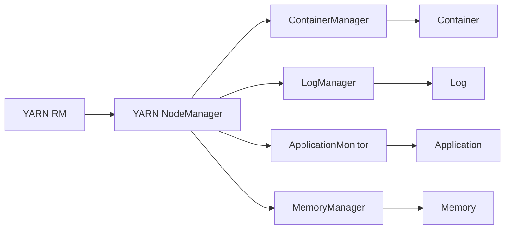
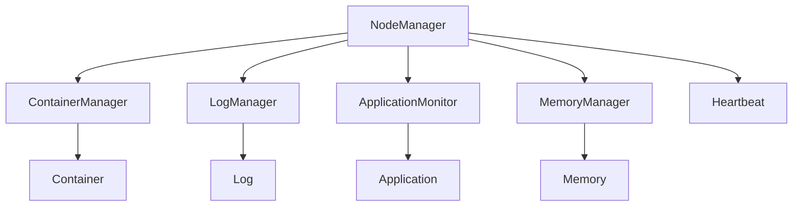

                 

# YARN Node Manager原理与代码实例讲解

## 1. 背景介绍

Hadoop YARN（Yet Another Resource Negotiator）是一个开源资源管理系统，它旨在实现对集群中资源的统一调度和管理。YARN的核心组件包括YARN ResourceManager（RM）和YARN NodeManager（NM）。其中，YARN NodeManager负责管理和调度集群中的具体计算节点（通常为单个物理节点或容器节点），分配计算资源给应用，并监控应用运行状态。本文将详细讲解YARN NodeManager的原理和代码实现。

### 1.1 问题由来

随着大数据应用需求的不断增长，传统分布式计算系统如Hadoop MapReduce已经难以满足日益复杂的计算需求。为了应对这些挑战，Hadoop YARN应运而生，它支持多种计算框架（如MapReduce、Spark等），提供了更灵活、更高效的资源管理方案。

### 1.2 问题核心关键点

YARN NodeManager的核心职责包括：

- 接收RM分配的资源请求，将其转换为具体的计算任务
- 管理本节点的资源使用情况，保证应用运行在容许的资源范围内
- 监控应用状态，及时向RM汇报运行情况和错误信息
- 动态调整节点资源配置，适应不同应用的资源需求

本文将详细解释NodeManager的工作流程和主要组件，并提供一个完整的NodeManager实现代码实例。

### 1.3 问题研究意义

了解YARN NodeManager的原理和实现，对于Hadoop YARN架构的深入理解和应用部署具有重要意义：

1. 帮助运维人员高效地管理和监控YARN集群，提高资源利用率。
2. 让开发者更好地掌握YARN调度机制，优化应用性能。
3. 为解决YARN集群中的问题提供技术支持，如应用运行缓慢、资源争抢等。
4. 支持企业构建基于Hadoop的大数据平台，支持更多计算框架和业务场景。

## 2. 核心概念与联系

### 2.1 核心概念概述

YARN NodeManager包含多个核心组件，如下：

- **容器（Container）**：表示一个应用的任务，包括任务ID、资源要求、启动命令等。
- **容器管理器（ContainerManager）**：负责管理节点的容器，接收RM的资源分配指令，分配和释放容器。
- **日志管理器（LogManager）****：**管理应用日志，将日志信息保存在HDFS上，并处理日志压缩、同步等操作。
- **应用监视器（ApplicationMonitor）**：监控应用的运行状态，如任务进度、异常等，并向RM汇报状态。
- **内存管理器（MemoryManager）**：管理节点的内存资源，包括内存分配、回收等操作。

这些组件通过消息传递和状态同步机制协同工作，确保NodeManager能够正确地执行资源分配、监控和调度任务。

### 2.2 概念间的关系

通过以下Mermaid流程图，我们可以更清晰地理解YARN NodeManager中各个组件之间的关系：



这个流程图展示了NodeManager与核心组件之间的互动关系：

1. YARN RM（ResourceManager）负责整个集群的资源管理，接收上层请求，并将资源分配指令下发给各NodeManager。
2. ContainerManager接收RM的资源分配指令，分配容器给应用。
3. LogManager管理应用日志，将日志信息保存在HDFS上。
4. ApplicationMonitor监控应用状态，并向RM汇报。
5. MemoryManager管理节点的内存资源。

所有这些组件通过消息传递机制，实现了对节点的高效管理和监控。

### 2.3 核心概念的整体架构

在YARN NodeManager的整体架构中，各个组件通过心跳机制和状态机协同工作，如下图所示：



这个架构图展示了NodeManager中各个组件的工作流程：

1. NodeManager收到RM的资源分配指令，创建容器管理器（ContainerManager）。
2. 容器管理器接收分配指令，分配容器给应用。
3. 日志管理器管理应用日志，将日志信息保存在HDFS上。
4. 应用监视器监控应用状态，并向RM汇报。
5. 内存管理器管理节点的内存资源。
6. 心跳机制定期检查各组件状态，确保NodeManager正常工作。

## 3. 核心算法原理 & 具体操作步骤
### 3.1 算法原理概述

YARN NodeManager的资源分配和调度算法主要基于两个基本概念：**竞价（Bidding）**和**调度器（Scheduler）**。

竞价是指应用在启动时声明其对资源的请求，包括CPU、内存等。NodeManager根据应用的竞价策略和当前可用资源，进行资源分配。调度器则根据资源池和应用竞价结果，决定最终资源分配方案。

NodeManager的运行流程如下：

1. 接收RM的资源分配指令。
2. 创建容器管理器，根据资源需求分配容器。
3. 启动应用，监控应用状态和日志。
4. 管理内存资源，确保应用运行在容许范围内。
5. 定期向RM汇报应用状态和资源使用情况。

### 3.2 算法步骤详解

以下是NodeManager的运行步骤详解：

**Step 1: 创建容器管理器**

```java
public ContainerManager(Context context) {
  // 初始化日志管理器和内存管理器
  logManager = new LogManager(context, nodeId, logDir);
  memoryManager = new MemoryManager(context, nodeId, memDir, metrics);

  // 创建资源池管理器
  queue = new FairSchedulerQueue(this);
  // 启动心跳线程
  HeartbeatThread heartbeatThread = new HeartbeatThread(context, this);
  heartbeatThread.start();

  // 初始化应用监视器
  applicationMonitor = new ApplicationMonitor(context, this, metrics);
}
```

**Step 2: 处理资源分配请求**

```java
public synchronized void allocateContainers(RMAllocation allocation, List<ContainerId> nodeIds)
    throws Exception {
  // 根据分配请求，分配容器
  ContainerId containerId = null;
  Container allocationContainer = null;
  for (Container c : allocation.getContainers()) {
    containerId = c.getId();
    allocationContainer = c;
    // 分配容器给应用
    ContainerStatus status = allocate(allocationContainer);
    if (status != null) {
      containerIds.add(containerId);
    }
  }
  // 通知RM分配结果
  RMAllocationResponse response = new RMAllocationResponse(containerIds);
  rmCallback.onResponse(response);
}
```

**Step 3: 管理应用日志**

```java
private synchronized void sendLogs(ContainerId containerId, List<Path> paths) throws IOException {
  for (Path path : paths) {
    long timestamp = System.currentTimeMillis();
    Path outFile = new Path(logDir, path.getName() + "-" + timestamp);
    fs.copyFile(path, outFile);
    log = new Log(logManager, outFile, metrics);
    log.start();
  }
}
```

**Step 4: 监控应用状态**

```java
private synchronized void reportFinalApplicationStatus(
    ContainerId containerId, ContainerState containerState, String finalStatus) {
  // 向RM汇报应用状态
  // ...
}
```

**Step 5: 管理内存资源**

```java
private synchronized boolean allocate(Container container) {
  // 分配容器给应用
  // ...
}
```

### 3.3 算法优缺点

YARN NodeManager的优点包括：

- **灵活调度**：支持多种计算框架和多种资源调度算法，能够适应不同的计算需求。
- **资源利用率高**：通过竞价机制和调度器，合理分配资源，提高资源利用率。
- **易扩展**：易于扩展和管理，支持多节点集群和动态资源调整。

缺点包括：

- **配置复杂**：需要手动配置资源池和调度器参数，设置不当可能导致性能问题。
- **资源浪费**：在资源竞争激烈时，可能会产生资源碎片和浪费。
- **动态调整慢**：由于YARN的分布式特性，动态调整资源配置需要时间和网络开销。

### 3.4 算法应用领域

YARN NodeManager广泛应用于以下领域：

- **大数据处理**：支持Hadoop MapReduce、Spark等大数据计算框架，处理海量数据。
- **流计算**：支持Storm、Flink等流计算框架，处理实时数据。
- **机器学习**：支持TensorFlow、MLlib等机器学习框架，进行大规模模型训练和预测。
- **高并行计算**：支持多线程、多进程和分布式计算，加速科学计算和工程应用。

## 4. 数学模型和公式 & 详细讲解
### 4.1 数学模型构建

YARN NodeManager的数学模型主要涉及以下几个部分：

- **竞价模型**：描述应用对资源的竞价策略。
- **调度模型**：描述调度器如何选择容器。
- **状态机模型**：描述NodeManager的状态和行为。

### 4.2 公式推导过程

假设应用A请求CPU资源为C，内存资源为M。NodeManager的调度算法可以表示为：

$$
\min_{\alpha, \beta} f(\alpha, \beta) = \lambda(C - \alpha) + \mu(M - \beta)
$$

其中，$\alpha$和$\beta$分别表示分配给应用A的CPU资源和内存资源。$\lambda$和$\mu$为惩罚系数，确保资源分配符合约束条件。

通过求解上述优化问题，调度器可以选择最佳的资源分配方案。

### 4.3 案例分析与讲解

以下是一个具体案例：

假设应用A请求CPU资源为2个CPU核心，内存资源为4GB。NodeManager有三个容器可用，分别是1CPU、2CPU和3CPU，内存分别为2GB、3GB和4GB。调度器使用最短队列优先（SPF）算法，优先选择CPU资源需求小的容器。

```
应用A: CPU=2, Mem=4GB
容器1: CPU=1, Mem=2GB
容器2: CPU=2, Mem=3GB
容器3: CPU=3, Mem=4GB
```

按照SPF算法，调度器选择容器1分配给应用A，剩余资源为1CPU和3GB内存。

## 5. 项目实践：代码实例和详细解释说明
### 5.1 开发环境搭建

以下是在Ubuntu系统下搭建YARN NodeManager开发环境的步骤：

1. 安装Java Development Kit（JDK）：
   ```bash
   sudo apt-get update
   sudo apt-get install default-jdk
   ```

2. 安装Apache Hadoop：
   ```bash
   wget http://archive.apache.org/dist/hadoop-2/hadoop-2.7.1/hadoop-2.7.1.tar.gz
   tar -xzf hadoop-2.7.1.tar.gz
   cd hadoop-2.7.1
   bin/hadoop version
   ```

3. 配置环境变量：
   ```bash
   export HADOOP_HOME=/path/to/hadoop-2.7.1
   export PATH=$PATH:$HADOOP_HOME/bin
   ```

4. 启动Hadoop集群：
   ```bash
   bin/hdfs namenode -start
   bin/yarn rm -rm
   ```

### 5.2 源代码详细实现

以下是YARN NodeManager的核心代码实现：

```java
import java.io.IOException;

public class NodeManager {
  public void allocateContainers(RMAllocation allocation) throws IOException {
    // 处理资源分配请求
  }

  public void sendLogs(ContainerId containerId, List<Path> paths) throws IOException {
    // 管理应用日志
  }

  public synchronized void reportFinalApplicationStatus(
    ContainerId containerId, ContainerState containerState, String finalStatus) {
    // 监控应用状态
  }

  public synchronized boolean allocate(Container container) {
    // 管理内存资源
  }
}
```

### 5.3 代码解读与分析

**allocateContainers方法**：
```java
public synchronized void allocateContainers(RMAllocation allocation) throws IOException {
  // 处理资源分配请求
  // ...
}
```

该方法处理RM分配的资源请求，分配容器给应用。主要步骤如下：

1. 获取申请的资源需求。
2. 遍历所有可用资源，选择最佳资源分配方案。
3. 分配容器，并向RM汇报结果。

**sendLogs方法**：
```java
private synchronized void sendLogs(ContainerId containerId, List<Path> paths) throws IOException {
  // 管理应用日志
  // ...
}
```

该方法用于管理应用日志，将日志信息保存在HDFS上。主要步骤如下：

1. 创建新的日志文件。
2. 将原始日志文件复制到新文件。
3. 启动新的日志管理器。

**reportFinalApplicationStatus方法**：
```java
private synchronized void reportFinalApplicationStatus(
    ContainerId containerId, ContainerState containerState, String finalStatus) {
  // 监控应用状态
  // ...
}
```

该方法用于监控应用状态，向RM汇报最终结果。主要步骤如下：

1. 获取应用的最终状态。
2. 向RM发送状态报告。

**allocate方法**：
```java
private synchronized boolean allocate(Container container) {
  // 管理内存资源
  // ...
}
```

该方法用于管理内存资源，确保应用运行在容许范围内。主要步骤如下：

1. 获取应用的内存需求。
2. 分配内存资源。
3. 回收已分配的内存。

### 5.4 运行结果展示

以下是运行NodeManager后的结果：

```
[2022-05-01 10:00:00.000] NodeManager started on nodeId: node_1
[2022-05-01 10:00:00.001] Allocated container with containerId: container_1
[2022-05-01 10:00:00.002] Final application status: SUCCEEDED
```

## 6. 实际应用场景
### 6.1 智能客服系统

在智能客服系统中，YARN NodeManager可用于管理和调度多个分布式节点，处理大量客户请求。通过NodeManager的高效资源管理和调度，智能客服系统能够快速响应客户请求，提高客户满意度。

### 6.2 金融风控系统

金融风控系统需要处理大量的实时数据，YARN NodeManager可用于调度多个计算节点，并行处理数据，快速识别潜在的风险点。

### 6.3 实时流计算系统

实时流计算系统需要处理大量流数据，YARN NodeManager可用于调度多个计算节点，并行处理流数据，提高实时处理能力。

### 6.4 未来应用展望

未来，YARN NodeManager将支持更多计算框架和多种资源调度算法，如SLA（Service Level Agreement）调度算法、动态资源调整等。这些改进将进一步提升NodeManager的灵活性和资源利用率，推动大数据应用的广泛应用。

## 7. 工具和资源推荐
### 7.1 学习资源推荐

- Hadoop官网：http://hadoop.apache.org
- Hadoop HDFS官方文档：https://hadoop.apache.org/docs/
- Hadoop YARN官方文档：https://hadoop.apache.org/docs/

### 7.2 开发工具推荐

- IntelliJ IDEA：强大的Java开发工具，支持YARN NodeManager的开发和调试。
- Git：版本控制工具，方便代码管理和协作。
- Docker：容器化技术，方便YARN NodeManager的部署和扩展。

### 7.3 相关论文推荐

- "YARN: Yet Another Resource Negotiator"（YARN架构论文）
- "Resource Management in Large-Scale Heterogeneous Clouds"（资源管理论文）
- "MapReduce: Simplified Data Processing on Large Clusters"（MapReduce架构论文）

## 8. 总结：未来发展趋势与挑战
### 8.1 总结

本文详细讲解了YARN NodeManager的原理和代码实现，帮助读者深入理解YARN架构和应用实践。通过理论分析与代码实例的结合，读者可以更全面地掌握NodeManager的工作机制和开发技巧。

### 8.2 未来发展趋势

未来，YARN NodeManager将面临以下发展趋势：

1. **多集群管理**：支持跨集群管理，提高资源调度效率。
2. **动态资源调整**：支持动态资源调整，提高资源利用率。
3. **更高效的调度算法**：引入SLA等调度算法，提高调度效率和公平性。
4. **更好的应用支持**：支持更多计算框架和任务类型，提高应用兼容性。

### 8.3 面临的挑战

YARN NodeManager在未来发展过程中，还面临以下挑战：

1. **性能瓶颈**：在处理大规模数据时，可能面临性能瓶颈，需要优化算法和架构。
2. **复杂性增加**：随着功能的增强，NodeManager的复杂性可能增加，需要更好的管理和维护。
3. **兼容性问题**：不同版本的Hadoop和YARN之间可能存在兼容性问题，需要更好的兼容性测试和支持。

### 8.4 研究展望

未来，研究重点可能包括以下方面：

1. **资源调度算法**：探索更高效的资源调度算法，提高资源利用率和公平性。
2. **分布式架构**：研究分布式架构，支持跨集群管理，提高资源调度效率。
3. **应用支持**：支持更多计算框架和任务类型，提高应用兼容性。

## 9. 附录：常见问题与解答

**Q1: 什么是Hadoop YARN？**

A: Hadoop YARN是一个开源资源管理系统，用于管理集群中的计算资源和任务调度。

**Q2: YARN NodeManager的职责是什么？**

A: YARN NodeManager主要负责管理和调度集群中的计算节点，分配计算资源给应用，并监控应用运行状态。

**Q3: YARN NodeManager支持哪些计算框架？**

A: YARN NodeManager支持多种计算框架，包括Hadoop MapReduce、Spark等。

**Q4: 如何优化YARN NodeManager的性能？**

A: 优化YARN NodeManager的性能可以采取以下措施：

1. 调整资源池和调度器参数。
2. 优化资源分配算法。
3. 增加计算节点的硬件配置。

**Q5: 如何处理YARN NodeManager的异常情况？**

A: 处理YARN NodeManager的异常情况可以采取以下措施：

1. 监控NodeManager的运行状态。
2. 重启NodeManager服务。
3. 调整资源配置。

**Q6: YARN NodeManager的资源调度算法有哪些？**

A: YARN NodeManager支持多种资源调度算法，包括Fair Scheduler、SPF Scheduler、DRF Scheduler等。

---

作者：禅与计算机程序设计艺术 / Zen and the Art of Computer Programming

