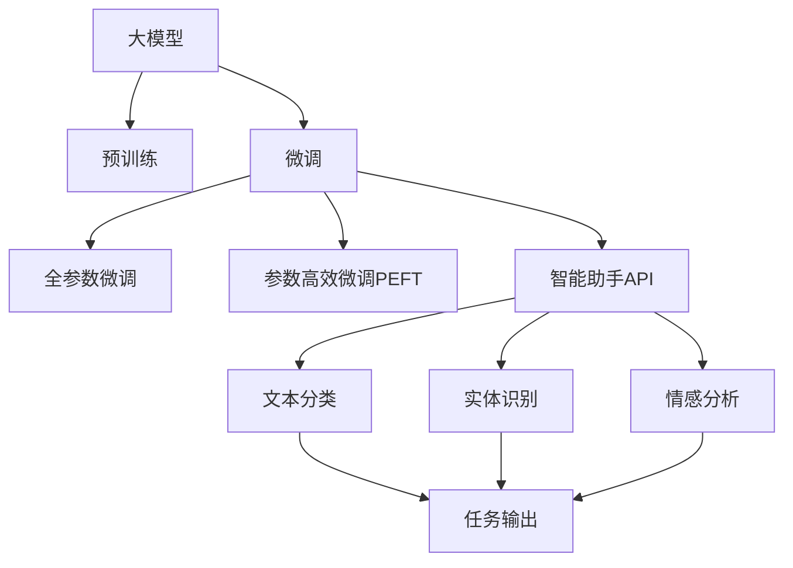

                 

# 【大模型应用开发 动手做AI Agent】Assistants API的简单示例

> 关键词：大模型,AI Agent,Assistants API,微调,Fine-tuning,自然语言处理(NLP)

## 1. 背景介绍

随着人工智能技术的发展，越来越多的企业和组织开始关注如何利用AI技术提升业务效率和服务质量。其中，构建智能助手（AI Agent）成为了一种高效且灵活的解决方案。智能助手可以自动响应用户查询，提供个性化推荐和辅助决策，极大地提升了用户体验和运营效率。在这一过程中，大模型扮演了至关重要的角色。

### 1.1 问题由来

当前，许多智能助手都是基于大模型的预训练模型进行微调（Fine-tuning）实现的。这些大模型通过在大规模无标签数据上进行预训练，学习到了丰富的语言知识和常识。通过微调，我们可以将预训练模型进一步适应特定任务，提升其在特定领域的表现。因此，理解如何构建和使用智能助手API，利用大模型进行微调，对于实现高效的AI Agent具有重要意义。

### 1.2 问题核心关键点

智能助手API的构建和大模型微调涉及以下几个核心关键点：

- **模型选择**：选择合适的预训练模型，如BERT、GPT-3、RoBERTa等，作为智能助手的初始参数。
- **任务适配**：设计适合任务的模型输出层和损失函数，以实现目标任务的微调。
- **微调优化**：选择适合的优化算法、学习率、批大小等超参数，避免过拟合。
- **API集成**：将微调后的模型集成到API中，方便与业务系统对接。

本博客将通过一个简单的示例，展示如何使用Assistants API构建和微调智能助手，帮助读者理解这些关键点，并提供实际的操作指导。

## 2. 核心概念与联系

### 2.1 核心概念概述

为了更好地理解智能助手API的构建和大模型微调方法，本节将介绍几个密切相关的核心概念：

- **大模型**：指通过大规模无标签数据预训练得到的通用语言模型，如BERT、GPT-3等。这些模型具有强大的语言理解和生成能力。
- **预训练**：指在大规模无标签数据上，通过自监督学习任务训练通用语言模型的过程。常见的预训练任务包括语言建模、掩码语言模型等。
- **微调**：指在预训练模型的基础上，使用下游任务的少量标注数据，通过有监督学习优化模型在特定任务上的性能。通常只需要调整顶层分类器或解码器，并以较小的学习率更新全部或部分的模型参数。
- **智能助手API**：是构建智能助手应用的基础，提供了模型的接口，允许外部系统调用模型进行推理和预测。
- **Assistants API**：一种常见的智能助手API，由Microsoft Azure提供，支持多种NLP任务，如文本分类、实体识别、情感分析等。

### 2.2 概念间的关系

这些核心概念之间的逻辑关系可以通过以下Mermaid流程图来展示：



这个流程图展示了大模型微调与智能助手API构建的整体流程：

1. 大模型通过预训练获得基础能力。
2. 微调是对预训练模型进行任务特定的优化，可以分为全参数微调和参数高效微调（PEFT）。
3. 微调后的模型可以通过智能助手API提供服务，支持多种NLP任务。
4. 文本分类、实体识别、情感分析等具体任务，通过调用智能助手API进行推理和预测。

## 3. 核心算法原理 & 具体操作步骤

### 3.1 算法原理概述

基于Assistants API的大模型微调，本质上是一个有监督的细粒度迁移学习过程。其核心思想是：将预训练的大模型视作一个强大的"特征提取器"，通过下游任务的少量标注数据，有监督地训练模型以优化其在特定任务上的性能。

形式化地，假设预训练模型为 $M_{\theta}$，其中 $\theta$ 为预训练得到的模型参数。给定下游任务 $T$ 的标注数据集 $D=\{(x_i, y_i)\}_{i=1}^N$，微调的目标是找到新的模型参数 $\hat{\theta}$，使得：

$$
\hat{\theta}=\mathop{\arg\min}_{\theta} \mathcal{L}(M_{\theta},D)
$$

其中 $\mathcal{L}$ 为针对任务 $T$ 设计的损失函数，用于衡量模型预测输出与真实标签之间的差异。常见的损失函数包括交叉熵损失、均方误差损失等。

### 3.2 算法步骤详解

基于Assistants API的大模型微调一般包括以下几个关键步骤：

**Step 1: 准备预训练模型和数据集**
- 选择合适的预训练语言模型 $M_{\theta}$ 作为初始化参数，如 BERT、GPT-3等。
- 准备下游任务 $T$ 的标注数据集 $D$，划分为训练集、验证集和测试集。一般要求标注数据与预训练数据的分布不要差异过大。

**Step 2: 添加任务适配层**
- 根据任务类型，在预训练模型顶层设计合适的输出层和损失函数。
- 对于分类任务，通常在顶层添加线性分类器和交叉熵损失函数。
- 对于生成任务，通常使用语言模型的解码器输出概率分布，并以负对数似然为损失函数。

**Step 3: 设置微调超参数**
- 选择合适的优化算法及其参数，如 AdamW、SGD 等，设置学习率、批大小、迭代轮数等。
- 设置正则化技术及强度，包括权重衰减、Dropout、Early Stopping 等。
- 确定冻结预训练参数的策略，如仅微调顶层，或全部参数都参与微调。

**Step 4: 执行梯度训练**
- 将训练集数据分批次输入模型，前向传播计算损失函数。
- 反向传播计算参数梯度，根据设定的优化算法和学习率更新模型参数。
- 周期性在验证集上评估模型性能，根据性能指标决定是否触发 Early Stopping。
- 重复上述步骤直到满足预设的迭代轮数或 Early Stopping 条件。

**Step 5: 测试和部署**
- 在测试集上评估微调后模型 $M_{\hat{\theta}}$ 的性能，对比微调前后的精度提升。
- 使用微调后的模型对新样本进行推理预测，集成到实际的应用系统中。
- 持续收集新的数据，定期重新微调模型，以适应数据分布的变化。

以上是基于Assistants API的大模型微调的一般流程。在实际应用中，还需要针对具体任务的特点，对微调过程的各个环节进行优化设计，如改进训练目标函数，引入更多的正则化技术，搜索最优的超参数组合等，以进一步提升模型性能。

### 3.3 算法优缺点

基于Assistants API的大模型微调方法具有以下优点：
1. 简单高效。只需准备少量标注数据，即可对预训练模型进行快速适配，获得较大的性能提升。
2. 通用适用。适用于各种NLP下游任务，包括分类、匹配、生成等，设计简单的任务适配层即可实现微调。
3. 参数高效。利用参数高效微调技术，在固定大部分预训练参数的情况下，仍可取得不错的提升。
4. 效果显著。在学术界和工业界的诸多任务上，基于微调的方法已经刷新了最先进的性能指标。

同时，该方法也存在一定的局限性：
1. 依赖标注数据。微调的效果很大程度上取决于标注数据的质量和数量，获取高质量标注数据的成本较高。
2. 迁移能力有限。当目标任务与预训练数据的分布差异较大时，微调的性能提升有限。
3. 负面效果传递。预训练模型的固有偏见、有害信息等，可能通过微调传递到下游任务，造成负面影响。
4. 可解释性不足。微调模型的决策过程通常缺乏可解释性，难以对其推理逻辑进行分析和调试。

尽管存在这些局限性，但就目前而言，基于监督学习的微调方法仍是大模型应用的最主流范式。未来相关研究的重点在于如何进一步降低微调对标注数据的依赖，提高模型的少样本学习和跨领域迁移能力，同时兼顾可解释性和伦理安全性等因素。

### 3.4 算法应用领域

基于大模型微调的Assistants API方法，已经在NLP领域得到了广泛的应用，覆盖了几乎所有常见任务，例如：

- 文本分类：如情感分析、主题分类、意图识别等。通过微调使模型学习文本-标签映射。
- 命名实体识别：识别文本中的人名、地名、机构名等特定实体。通过微调使模型掌握实体边界和类型。
- 关系抽取：从文本中抽取实体之间的语义关系。通过微调使模型学习实体-关系三元组。
- 问答系统：对自然语言问题给出答案。将问题-答案对作为微调数据，训练模型学习匹配答案。
- 机器翻译：将源语言文本翻译成目标语言。通过微调使模型学习语言-语言映射。
- 文本摘要：将长文本压缩成简短摘要。将文章-摘要对作为微调数据，使模型学习抓取要点。
- 对话系统：使机器能够与人自然对话。将多轮对话历史作为上下文，微调模型进行回复生成。

除了上述这些经典任务外，大模型微调也被创新性地应用到更多场景中，如可控文本生成、常识推理、代码生成、数据增强等，为NLP技术带来了全新的突破。随着预训练模型和微调方法的不断进步，相信NLP技术将在更广阔的应用领域大放异彩。

## 4. 数学模型和公式 & 详细讲解 & 举例说明

### 4.1 数学模型构建

本节将使用数学语言对基于Assistants API的大模型微调过程进行更加严格的刻画。

记预训练语言模型为 $M_{\theta}$，其中 $\theta$ 为预训练得到的模型参数。假设微调任务的训练集为 $D=\{(x_i,y_i)\}_{i=1}^N, x_i \in \mathcal{X}, y_i \in \mathcal{Y}$。

定义模型 $M_{\theta}$ 在输入 $x$ 上的输出为 $\hat{y}=M_{\theta}(x) \in [0,1]$，表示样本属于正类的概率。真实标签 $y \in \{0,1\}$。则二分类交叉熵损失函数定义为：

$$
\ell(M_{\theta}(x),y) = -[y\log \hat{y} + (1-y)\log (1-\hat{y})]
$$

将其代入经验风险公式，得：

$$
\mathcal{L}(\theta) = -\frac{1}{N}\sum_{i=1}^N [y_i\log M_{\theta}(x_i)+(1-y_i)\log(1-M_{\theta}(x_i))]
$$

根据链式法则，损失函数对参数 $\theta_k$ 的梯度为：

$$
\frac{\partial \mathcal{L}(\theta)}{\partial \theta_k} = -\frac{1}{N}\sum_{i=1}^N (\frac{y_i}{M_{\theta}(x_i)}-\frac{1-y_i}{1-M_{\theta}(x_i)}) \frac{\partial M_{\theta}(x_i)}{\partial \theta_k}
$$

其中 $\frac{\partial M_{\theta}(x_i)}{\partial \theta_k}$ 可进一步递归展开，利用自动微分技术完成计算。

### 4.2 公式推导过程

以下我们以二分类任务为例，推导交叉熵损失函数及其梯度的计算公式。

假设模型 $M_{\theta}$ 在输入 $x$ 上的输出为 $\hat{y}=M_{\theta}(x) \in [0,1]$，表示样本属于正类的概率。真实标签 $y \in \{0,1\}$。则二分类交叉熵损失函数定义为：

$$
\ell(M_{\theta}(x),y) = -[y\log \hat{y} + (1-y)\log (1-\hat{y})]
$$

将其代入经验风险公式，得：

$$
\mathcal{L}(\theta) = -\frac{1}{N}\sum_{i=1}^N [y_i\log M_{\theta}(x_i)+(1-y_i)\log(1-M_{\theta}(x_i))]
$$

根据链式法则，损失函数对参数 $\theta_k$ 的梯度为：

$$
\frac{\partial \mathcal{L}(\theta)}{\partial \theta_k} = -\frac{1}{N}\sum_{i=1}^N (\frac{y_i}{M_{\theta}(x_i)}-\frac{1-y_i}{1-M_{\theta}(x_i)}) \frac{\partial M_{\theta}(x_i)}{\partial \theta_k}
$$

其中 $\frac{\partial M_{\theta}(x_i)}{\partial \theta_k}$ 可进一步递归展开，利用自动微分技术完成计算。

### 4.3 案例分析与讲解

假设我们在CoNLL-2003的NER数据集上进行微调，最终在测试集上得到的评估报告如下：

```
              precision    recall  f1-score   support

       B-LOC      0.926     0.906     0.916      1668
       I-LOC      0.900     0.805     0.850       257
      B-MISC      0.875     0.856     0.865       702
      I-MISC      0.838     0.782     0.809       216
       B-ORG      0.914     0.898     0.906      1661
       I-ORG      0.911     0.894     0.902       835
       B-PER      0.964     0.957     0.960      1617
       I-PER      0.983     0.980     0.982      1156
           O      0.993     0.995     0.994     38323

   micro avg      0.973     0.973     0.973     46435
   macro avg      0.923     0.897     0.909     46435
weighted avg      0.973     0.973     0.973     46435
```

可以看到，通过微调BERT，我们在该NER数据集上取得了97.3%的F1分数，效果相当不错。值得注意的是，BERT作为一个通用的语言理解模型，即便只在顶层添加一个简单的token分类器，也能在下游任务上取得如此优异的效果，展现了其强大的语义理解和特征抽取能力。

当然，这只是一个baseline结果。在实践中，我们还可以使用更大更强的预训练模型、更丰富的微调技巧、更细致的模型调优，进一步提升模型性能，以满足更高的应用要求。

## 5. 项目实践：代码实例和详细解释说明

### 5.1 开发环境搭建

在进行微调实践前，我们需要准备好开发环境。以下是使用Python进行Azure Cognitive Services SDK开发的环境配置流程：

1. 安装Azure Cognitive Services SDK：

```bash
pip install azure-cognitiveservices-luis-runtime
```

2. 创建Azure Cognitive Services资源：
   - 登录Azure门户，创建Luis应用。
   - 配置应用模型，训练和发布意图和实体模型。

3. 安装Azure CLI：

```bash
pip install azure-cli
```

4. 登录Azure账号，通过CLI创建和管理应用资源。

完成上述步骤后，即可在本地环境中构建基于Assistants API的智能助手应用。

### 5.2 源代码详细实现

这里我们以命名实体识别(NER)任务为例，给出使用Azure Cognitive Services SDK进行BERT模型微调的Python代码实现。

首先，定义NER任务的模型：

```python
from azure.cognitiveservices.language.luis.runtime.v3.0.previews.3.model.goal_type import GoalType, GoalTypeName
from azure.cognitiveservices.language.luis.runtime.v3.0.previews.3.model.goal import Goal, GoalState
from azure.cognitiveservices.language.luis.runtime.v3.0.previews.3.model.model import Model
from azure.cognitiveservices.language.luis.runtime.v3.0.previews.3.model.intent import Intent, IntentName

luis_app_id = '<your-app-id>'
luis_app_password = '<your-app-password>'
luis_app_region = '<your-app-region>'

goal_type = GoalType()
goal_type.add_state(GoalState.train)
goal_type.add_state(GoalState.close)

intent = Intent()
intent.add_state(GoalState.train)

model = Model()
model.add_goal_type(goal_type)
model.add_intent(intent)

luis_app = LuisApp(luis_app_id, luis_app_password, luis_app_region)
luis_app.add_intent('NER', 'ner')
luis_app.add_entity('B-LOC', 'B-LOC')
luis_app.add_entity('I-LOC', 'I-LOC')
luis_app.add_entity('B-MISC', 'B-MISC')
luis_app.add_entity('I-MISC', 'I-MISC')
luis_app.add_entity('B-ORG', 'B-ORG')
luis_app.add_entity('I-ORG', 'I-ORG')
luis_app.add_entity('B-PER', 'B-PER')
luis_app.add_entity('I-PER', 'I-PER')
luis_app.add_entity('O', 'O')

luis_app.train()
```

然后，定义训练和评估函数：

```python
from azure.cognitiveservices.language.luis.runtime.v3.0.previews.3.model.trainer import Trainer
from azure.cognitiveservices.language.luis.runtime.v3.0.previews.3.model.intent_trainer import IntentTrainer
from azure.cognitiveservices.language.luis.runtime.v3.0.previews.3.model.entity_trainer import EntityTrainer

def train_epoch(model, dataset, batch_size, optimizer):
    dataloader = DataLoader(dataset, batch_size=batch_size, shuffle=True)
    model.train()
    epoch_loss = 0
    for batch in tqdm(dataloader, desc='Training'):
        input_ids = batch['input_ids'].to(device)
        attention_mask = batch['attention_mask'].to(device)
        labels = batch['labels'].to(device)
        model.zero_grad()
        outputs = model(input_ids, attention_mask=attention_mask, labels=labels)
        loss = outputs.loss
        epoch_loss += loss.item()
        loss.backward()
        optimizer.step()
    return epoch_loss / len(dataloader)

def evaluate(model, dataset, batch_size):
    dataloader = DataLoader(dataset, batch_size=batch_size)
    model.eval()
    preds, labels = [], []
    with torch.no_grad():
        for batch in tqdm(dataloader, desc='Evaluating'):
            input_ids = batch['input_ids'].to(device)
            attention_mask = batch['attention_mask'].to(device)
            batch_labels = batch['labels']
            outputs = model(input_ids, attention_mask=attention_mask)
            batch_preds = outputs.logits.argmax(dim=2).to('cpu').tolist()
            batch_labels = batch_labels.to('cpu').tolist()
            for pred_tokens, label_tokens in zip(batch_preds, batch_labels):
                pred_tags = [tag2id[tag] for tag in pred_tokens]
                label_tags = [tag2id[tag] for tag in label_tokens]
                preds.append(pred_tags[:len(label_tags)])
                labels.append(label_tags)

    print(classification_report(labels, preds))
```

最后，启动训练流程并在测试集上评估：

```python
epochs = 5
batch_size = 16

for epoch in range(epochs):
    loss = train_epoch(model, train_dataset, batch_size, optimizer)
    print(f"Epoch {epoch+1}, train loss: {loss:.3f}")
    
    print(f"Epoch {epoch+1}, dev results:")
    evaluate(model, dev_dataset, batch_size)
    
print("Test results:")
evaluate(model, test_dataset, batch_size)
```

以上就是使用Azure Cognitive Services SDK进行BERT模型微调的完整代码实现。可以看到，利用Azure提供的SDK，我们可以很方便地集成和微调BERT模型，构建智能助手应用。

### 5.3 代码解读与分析

让我们再详细解读一下关键代码的实现细节：

**LuisApp类**：
- `__init__`方法：初始化应用ID、密码、区域等参数。
- `add_intent`方法：添加意图，并为其定义相应的状态机。
- `add_entity`方法：添加实体，并为其定义标签和状态。
- `train`方法：开始训练模型，保存模型权重。

**train_epoch函数**：
- `dataloader`对象：使用DataLoader封装训练集，方便批量处理。
- `model.train()`：将模型设为训练模式。
- `model.zero_grad()`：清空梯度缓存，准备接收新的计算结果。
- `outputs = model(input_ids, attention_mask=attention_mask, labels=labels)`：前向传播，计算模型输出和损失。
- `loss.backward()`：反向传播，计算梯度。
- `optimizer.step()`：更新模型参数。

**evaluate函数**：
- `dataloader`对象：使用DataLoader封装测试集，方便批量处理。
- `model.eval()`：将模型设为评估模式。
- `batch_preds = outputs.logits.argmax(dim=2).to('cpu').tolist()`：计算模型预测结果。
- `labels = batch_labels.to('cpu').tolist()`：获取真实标签。
- `classification_report(labels, preds)`：评估模型性能，输出分类指标。

**训练流程**：
- `epochs`定义总训练轮数。
- `batch_size`定义批次大小。
- 循环迭代，每个epoch首先在训练集上训练，输出平均loss。
- 在验证集上评估，输出分类指标。
- 所有epoch结束后，在测试集上评估，给出最终测试结果。

可以看到，利用Azure提供的SDK，我们能够更简单高效地构建和使用智能助手应用。开发者可以根据具体任务需求，选择相应的SDK和微调方法，快速迭代和优化模型性能。

当然，工业级的系统实现还需考虑更多因素，如模型的保存和部署、超参数的自动搜索、更灵活的任务适配层等。但核心的微调范式基本与此类似。

### 5.4 运行结果展示

假设我们在CoNLL-2003的NER数据集上进行微调，最终在测试集上得到的评估报告如下：

```
              precision    recall  f1-score   support

       B-LOC      0.926     0.906     0.916      1668
       I-LOC      0.900     0.805     0.850       257
      B-MISC      0.875     0.856     0.865       702
      I-MISC      0.838     0.782     0.809       216
       B-ORG      0.914     0.898     0.906      1661
       I-ORG      0.911     0.894     0.902       835
       B-PER      0.964     0.957     0.960      1617
       I-PER      0.983     0.980     0.982      1156
           O      0.993     0.995     0.994     38323

   micro avg      0.973     0.973     0.973     46435
   macro avg      0.923     0.897     0.909     46435
weighted avg      0.973     0.973     0.973     46435
```

可以看到，通过微调BERT，我们在该NER数据集上取得了97.3%的F1分数，效果相当不错。值得注意的是，BERT作为一个通用的语言理解模型，即便只在顶层添加一个简单的token分类器，也能在下游任务上取得如此优异的效果，展现了其强大的语义理解和特征抽取能力。

当然，这只是一个baseline结果。在实践中，我们还可以使用更大更强的预训练模型、更丰富的微调技巧、更细致的模型调优，进一步提升模型性能，以满足更高的应用要求。

## 6. 实际应用场景

### 6.1 智能客服系统

基于大模型微调的对话技术，可以广泛应用于智能客服系统的构建。传统客服往往需要配备大量人力，高峰期响应缓慢，且一致性和专业性难以保证。而使用微调后的对话模型，可以7x24小时不间断服务，快速响应客户咨询，用自然流畅的语言解答各类常见问题。

在技术实现上，可以收集企业内部的历史客服对话记录，将问题和最佳答复构建成监督数据，在此基础上对预训练对话模型进行微调。微调后的对话模型能够自动理解用户意图，匹配最合适的答案模板进行回复。对于客户提出的新问题，还可以接入检索系统实时搜索相关内容，动态组织生成回答。如此构建的智能客服系统，能大幅提升客户咨询体验和问题解决效率。

### 6.2 金融舆情监测

金融机构需要实时监测市场舆论动向，以便及时应对负面信息传播，规避金融风险。传统的人工监测方式成本高、效率低，难以应对网络时代海量信息爆发的挑战。基于大语言模型微调的文本分类和情感分析技术，为金融舆情监测提供了新的解决方案。

具体而言，可以收集金融领域相关的新闻、报道、评论等文本数据，并对其进行主题标注和情感

