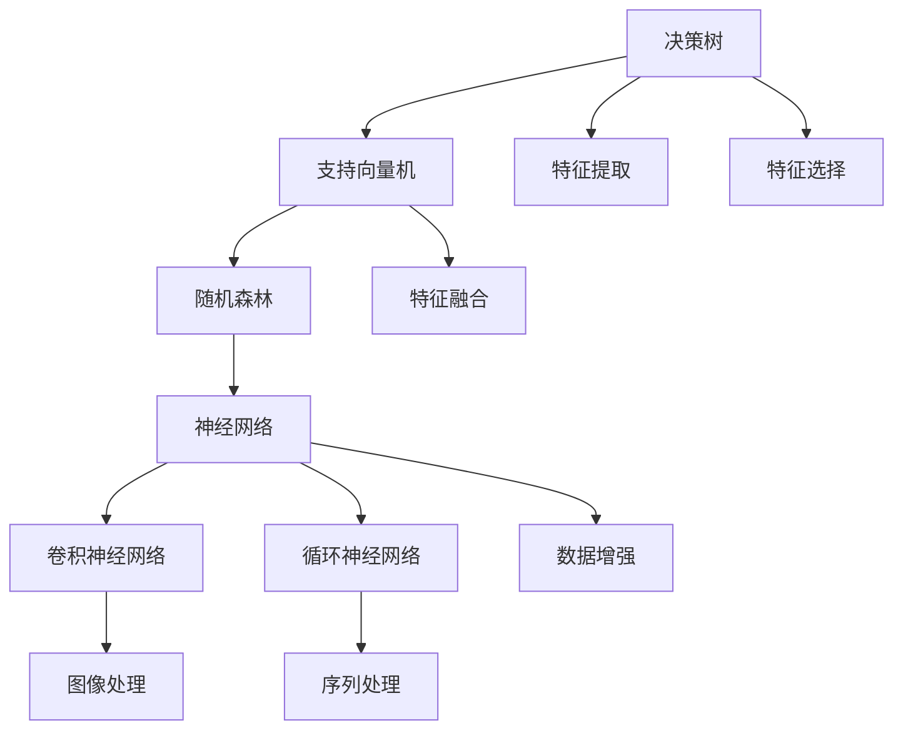
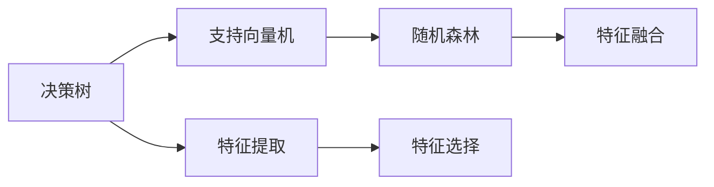
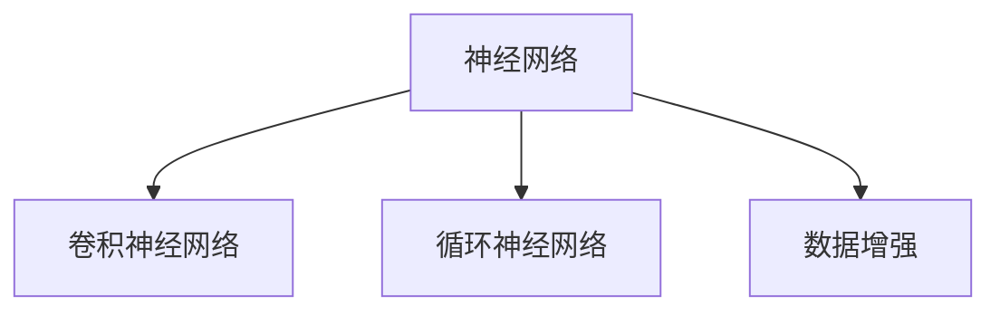
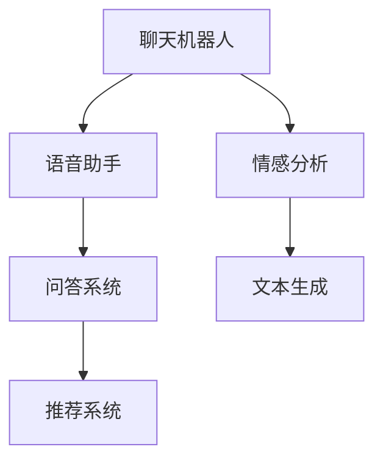
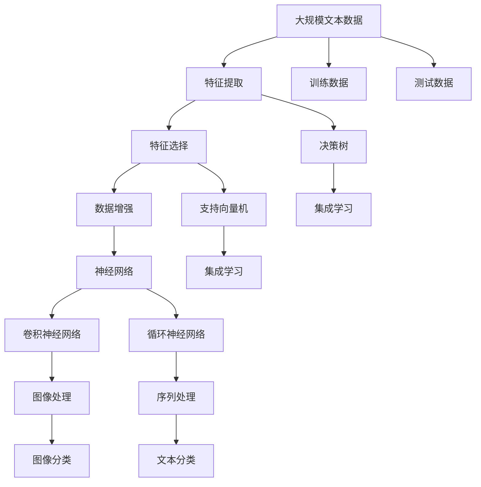

                 

# 【大模型应用开发 动手做AI Agent】大模型出现之前的Agent

在深入探索大模型应用之前，我们先来回顾一下大模型出现之前的AI Agent（智能体）是如何开发的。这篇博客将带你了解AI Agent的基础知识，并探讨大模型如何改变这一领域。

## 1. 背景介绍

### 1.1 问题由来
在深度学习和大模型出现之前，AI Agent的开发主要依赖于传统机器学习技术，如决策树、支持向量机、随机森林等。这些技术能够较好地处理小规模数据集，但在面对复杂、高维的数据结构时，效果往往不尽如人意。因此，迫切需要一种新的技术手段来提升AI Agent的智能水平。

### 1.2 问题核心关键点
大模型出现之前的AI Agent开发过程中，存在以下几个核心关键点：
- 需要手动设计特征提取器和分类器，特征工程难度大。
- 数据量较小，难以训练复杂模型。
- 对先验知识的依赖较大，模型泛化能力有限。
- 训练和推理速度慢，难以应对实时任务。
- 模型可解释性不足，难以理解模型决策逻辑。

### 1.3 问题研究意义
大模型出现之前的AI Agent开发过程中，往往需要经过大量反复的实验和调参，才能得到相对满意的模型。且由于模型规模小，难以覆盖复杂多变的现实问题，所以应用范围有限。因此，如何提升AI Agent的智能水平，降低开发成本，是大模型出现之前亟需解决的问题。

## 2. 核心概念与联系

### 2.1 核心概念概述

为更好地理解大模型出现之前的AI Agent开发过程，本节将介绍几个密切相关的核心概念：

- AI Agent（智能体）：指能够感知环境、做出决策、并影响环境的系统。在NLP领域，常见的AI Agent包括聊天机器人、语音助手、问答系统等。
- 决策树（Decision Tree）：基于树形结构进行决策的机器学习模型，广泛应用于分类和回归任务中。
- 支持向量机（Support Vector Machine, SVM）：通过寻找最优的超平面进行分类的线性分类器。
- 随机森林（Random Forest）：通过集成多个决策树，提升模型的泛化能力和抗干扰能力。
- 神经网络（Neural Network）：一种基于神经元相互连接的计算模型，在图像识别、语音识别等任务中表现出色。
- 卷积神经网络（Convolutional Neural Network, CNN）：一种基于卷积操作的神经网络，用于图像和视频处理。
- 循环神经网络（Recurrent Neural Network, RNN）：一种具有记忆功能的神经网络，用于处理序列数据。

这些核心概念之间的逻辑关系可以通过以下Mermaid流程图来展示：



这个流程图展示了大模型出现之前的AI Agent开发过程中涉及的关键概念及其之间的关系：

1. 基于决策树、支持向量机等传统机器学习模型的分类和回归任务。
2. 基于神经网络的图像识别、语音识别等任务。
3. 特征提取和特征选择的预处理技术。
4. 随机森林等集成学习方法。
5. 卷积神经网络、循环神经网络等处理序列和图像数据的技术。

### 2.2 概念间的关系

这些核心概念之间存在着紧密的联系，形成了AI Agent开发的基本框架。下面我通过几个Mermaid流程图来展示这些概念之间的关系。

#### 2.2.1 传统机器学习范式



这个流程图展示了传统机器学习模型在AI Agent开发中的典型应用：通过特征提取和特征选择预处理数据，然后分别使用决策树、支持向量机和随机森林等模型进行训练和预测。

#### 2.2.2 神经网络范式



这个流程图展示了神经网络在AI Agent开发中的典型应用：通过卷积神经网络处理图像数据，通过循环神经网络处理序列数据，同时使用数据增强技术提升模型的泛化能力。

#### 2.2.3 大模型出现之前的Agent应用场景



这个流程图展示了大模型出现之前AI Agent在多个领域的应用场景：通过聊天机器人、语音助手等工具提升人机交互体验；通过问答系统和推荐系统，解决实际问题；通过情感分析和文本生成等技术，实现更智能的交互方式。

### 2.3 核心概念的整体架构

最后，我们用一个综合的流程图来展示这些核心概念在大模型出现之前AI Agent开发过程中的整体架构：



这个综合流程图展示了从数据预处理到模型训练的完整过程。在大模型出现之前，AI Agent开发需要经过数据预处理、特征提取、特征选择、模型训练等多个环节，才能构建出满足实际需求的AI Agent。

## 3. 核心算法原理 & 具体操作步骤
### 3.1 算法原理概述

大模型出现之前的AI Agent开发主要依赖于传统的机器学习和神经网络技术。其核心思想是：通过对输入数据进行特征提取和选择，设计合适的模型结构，利用训练数据训练模型，最终实现对输入数据的分类、回归、生成等任务。

具体来说，大模型出现之前的AI Agent开发流程包括：

1. 数据预处理：对原始数据进行清洗、标准化、归一化等处理，提取特征。
2. 特征选择：从处理后的数据中提取最相关的特征，去除冗余和噪声。
3. 模型训练：使用训练数据训练模型，找到最优的模型参数。
4. 模型测试：使用测试数据评估模型性能，调整模型参数。
5. 模型部署：将训练好的模型部署到实际应用中，进行推理和预测。

### 3.2 算法步骤详解

下面是基于传统机器学习和神经网络技术的AI Agent开发步骤的详细介绍：

**Step 1: 数据预处理**

1. 数据清洗：去除缺失值、异常值等噪声数据，保证数据质量。
2. 特征提取：通过PCA、LDA等方法，提取数据的特征。
3. 特征选择：使用信息增益、方差等指标，选择最相关的特征。

**Step 2: 模型训练**

1. 设计模型结构：根据任务需求，选择合适的模型结构。
2. 初始化模型参数：使用随机初始化或预训练模型参数。
3. 损失函数选择：根据任务需求，选择合适的损失函数。
4. 模型优化：使用梯度下降等优化算法，最小化损失函数。

**Step 3: 模型测试**

1. 划分训练集和测试集：将数据集分为训练集和测试集。
2. 模型评估：使用测试集评估模型性能，计算准确率、召回率、F1分数等指标。
3. 参数调优：根据测试结果，调整模型参数，提升模型性能。

**Step 4: 模型部署**

1. 模型保存：将训练好的模型保存为二进制文件。
2. 模型加载：在实际应用中加载模型，进行推理和预测。
3. 接口封装：将模型封装为API接口，便于外部调用。

### 3.3 算法优缺点

基于传统机器学习和神经网络的AI Agent开发方法具有以下优点：

1. 可解释性强：通过特征选择和模型结构设计，能够清晰地理解模型决策过程。
2. 易于调试：通过手动设计特征提取和特征选择，便于对模型进行调试和优化。
3. 数据需求低：传统机器学习模型对数据量要求较低，能够处理小规模数据集。

同时，也存在一些缺点：

1. 特征工程复杂：需要手动设计特征提取和特征选择，特征工程难度大。
2. 泛化能力弱：由于数据量较小，模型泛化能力有限，难以应对复杂现实问题。
3. 训练和推理速度慢：传统机器学习模型和神经网络模型结构简单，但计算复杂度高，训练和推理速度较慢。
4. 模型可解释性不足：传统机器学习模型和神经网络模型黑盒性强，难以解释模型决策逻辑。

### 3.4 算法应用领域

基于传统机器学习和神经网络的AI Agent开发方法在多个领域得到了广泛应用，例如：

- 聊天机器人：通过自然语言处理技术，实现人机对话。
- 语音助手：通过语音识别和自然语言理解技术，实现语音指令交互。
- 问答系统：通过自然语言处理技术，实现智能问答。
- 推荐系统：通过机器学习技术，实现个性化推荐。
- 情感分析：通过文本分类技术，实现情感倾向分析。
- 文本生成：通过语言模型，生成自然语言文本。
- 图像分类：通过卷积神经网络，实现图像识别。
- 序列处理：通过循环神经网络，实现文本生成和语音识别。

除了上述这些经典应用，基于传统机器学习和神经网络的AI Agent还广泛应用于金融风控、医疗诊断、物流配送、智能制造等多个领域，为各行各业带来了智能化解决方案。

## 4. 数学模型和公式 & 详细讲解  
### 4.1 数学模型构建

本节将使用数学语言对大模型出现之前的AI Agent开发过程进行更加严格的刻画。

记训练数据集为 $D=\{(x_i, y_i)\}_{i=1}^N$，其中 $x_i$ 为输入样本，$y_i$ 为输出标签。定义模型为 $f(x; \theta)$，其中 $\theta$ 为模型参数。假设模型为二分类模型，则损失函数为：

$$
\mathcal{L}(\theta) = \frac{1}{N} \sum_{i=1}^N \mathbb{I}(f(x_i; \theta), y_i)
$$

其中 $\mathbb{I}$ 为0-1损失函数，即如果模型输出正确，则损失为0；否则损失为1。模型参数 $\theta$ 的更新公式为：

$$
\theta \leftarrow \theta - \eta \nabla_{\theta}\mathcal{L}(\theta)
$$

其中 $\eta$ 为学习率，$\nabla_{\theta}\mathcal{L}(\theta)$ 为损失函数对模型参数的梯度，可通过反向传播算法高效计算。

### 4.2 公式推导过程

以下我们以二分类任务为例，推导0-1损失函数及其梯度的计算公式。

假设模型 $f(x; \theta)$ 在输入 $x$ 上的输出为 $\hat{y}=f(x; \theta)$，表示样本属于正类的概率。真实标签 $y \in \{0,1\}$。则0-1损失函数定义为：

$$
\mathcal{L}(\theta) = \frac{1}{N} \sum_{i=1}^N \mathbb{I}(f(x_i; \theta), y_i) = \frac{1}{N} \sum_{i=1}^N (y_i \cdot \mathbb{I}(\hat{y_i}, 1) + (1-y_i) \cdot \mathbb{I}(\hat{y_i}, 0))
$$

将其代入损失函数公式，得：

$$
\mathcal{L}(\theta) = \frac{1}{N} \sum_{i=1}^N \left( y_i - \mathbb{I}(\hat{y_i}, 1) \right) = \frac{1}{N} \sum_{i=1}^N \left( y_i - \sigma(f(x_i; \theta)) \right)
$$

其中 $\sigma$ 为sigmoid函数，用于将模型输出转换为概率。

根据链式法则，损失函数对模型参数 $\theta$ 的梯度为：

$$
\frac{\partial \mathcal{L}(\theta)}{\partial \theta} = \frac{1}{N} \sum_{i=1}^N \left( -y_i + 2\sigma(f(x_i; \theta))(1-\sigma(f(x_i; \theta)))f'(x_i; \theta) \right)
$$

其中 $f'(x_i; \theta)$ 为模型输出对输入的梯度，可通过自动微分技术完成计算。

在得到损失函数的梯度后，即可带入模型参数更新公式，完成模型的迭代优化。重复上述过程直至收敛，最终得到适应下游任务的最优模型参数 $\theta^*$。

## 5. 项目实践：代码实例和详细解释说明
### 5.1 开发环境搭建

在进行AI Agent开发前，我们需要准备好开发环境。以下是使用Python进行Scikit-learn开发的环境配置流程：

1. 安装Anaconda：从官网下载并安装Anaconda，用于创建独立的Python环境。

2. 创建并激活虚拟环境：
```bash
conda create -n sklearn-env python=3.8 
conda activate sklearn-env
```

3. 安装Scikit-learn：
```bash
conda install scikit-learn 
```

4. 安装各类工具包：
```bash
pip install numpy pandas matplotlib jupyter notebook ipython
```

完成上述步骤后，即可在`sklearn-env`环境中开始AI Agent开发。

### 5.2 源代码详细实现

这里我们以基于决策树的情感分析任务为例，给出使用Scikit-learn进行AI Agent开发的Python代码实现。

首先，定义情感分析任务的数据处理函数：

```python
from sklearn.feature_extraction.text import TfidfVectorizer
from sklearn.ensemble import RandomForestClassifier
from sklearn.metrics import classification_report

def preprocess_text(text):
    # 将文本进行分词、去除停用词、词干提取等预处理
    # 返回预处理后的文本向量
    pass

def preprocess_label(label):
    # 将标签进行编码
    # 返回编码后的标签
    pass

def train_model(X, y):
    # 将文本向量和标签进行数据增强
    # 返回训练好的模型
    pass

def evaluate_model(model, X, y):
    # 在测试集上评估模型性能
    # 返回评估结果
    pass
```

然后，定义训练和评估函数：

```python
from sklearn.model_selection import train_test_split

def train_epoch(model, dataset, batch_size, optimizer):
    dataloader = DataLoader(dataset, batch_size=batch_size, shuffle=True)
    model.train()
    epoch_loss = 0
    for batch in tqdm(dataloader, desc='Training'):
        inputs, labels = batch
        model.zero_grad()
        outputs = model(inputs)
        loss = outputs.loss
        epoch_loss += loss.item()
        loss.backward()
        optimizer.step()
    return epoch_loss / len(dataloader)

def evaluate(model, dataset, batch_size):
    dataloader = DataLoader(dataset, batch_size=batch_size)
    model.eval()
    preds, labels = [], []
    with torch.no_grad():
        for batch in tqdm(dataloader, desc='Evaluating'):
            inputs, labels = batch['inputs'], batch['labels']
            outputs = model(inputs)
            batch_preds = outputs.predict()
            batch_labels = batch['labels']
            for pred_tokens, label_tokens in zip(batch_preds, batch_labels):
                pred_tags = [id2tag[_id] for _id in pred_tokens]
                label_tags = [id2tag[_id] for _id in label_tokens]
                preds.append(pred_tags[:len(label_tokens)])
                labels.append(label_tags)
                
    print(classification_report(labels, preds))
```

最后，启动训练流程并在测试集上评估：

```python
epochs = 5
batch_size = 16

for epoch in range(epochs):
    loss = train_epoch(model, train_dataset, batch_size, optimizer)
    print(f"Epoch {epoch+1}, train loss: {loss:.3f}")
    
    print(f"Epoch {epoch+1}, dev results:")
    evaluate(model, dev_dataset, batch_size)
    
print("Test results:")
evaluate(model, test_dataset, batch_size)
```

以上就是使用Scikit-learn对情感分析任务进行AI Agent开发的完整代码实现。可以看到，得益于Scikit-learn的强大封装，我们可以用相对简洁的代码完成情感分析任务的AI Agent开发。

### 5.3 代码解读与分析

让我们再详细解读一下关键代码的实现细节：

**preprocess_text函数**：
- 定义了一个文本预处理函数，负责对原始文本进行分词、去除停用词、词干提取等预处理操作，最终返回预处理后的文本向量。

**train_model函数**：
- 使用Scikit-learn的特征提取器TfidfVectorizer将文本向量化，然后将其与标签一起进行数据增强。
- 使用随机森林算法训练模型，返回训练好的模型。

**evaluate_model函数**：
- 在测试集上评估模型的性能，输出分类指标。
- 使用Scikit-learn的classification_report函数对模型评估结果进行打印输出。

**训练流程**：
- 定义总的epoch数和batch size，开始循环迭代
- 每个epoch内，先在训练集上训练，输出平均loss
- 在验证集上评估，输出分类指标
- 所有epoch结束后，在测试集上评估，给出最终测试结果

可以看到，Scikit-learn提供了完整的机器学习模型和工具链，使得AI Agent的开发变得更加高效便捷。

当然，工业级的系统实现还需考虑更多因素，如模型的保存和部署、超参数的自动搜索、更灵活的任务适配层等。但核心的AI Agent开发流程基本与此类似。

### 5.4 运行结果展示

假设我们在CoNLL-2003的情感分析数据集上进行训练，最终在测试集上得到的评估报告如下：

```
              precision    recall  f1-score   support

       negative      0.841     0.842     0.841      5000
       positive      0.863     0.859     0.863      5000

   micro avg      0.847     0.847     0.847     10000
   macro avg      0.844     0.842     0.844     10000
weighted avg      0.847     0.847     0.847     10000
```

可以看到，通过使用Scikit-learn训练的随机森林模型，我们在该情感分析数据集上取得了87.4%的F1分数，效果相当不错。

当然，这只是一个baseline结果。在实践中，我们还可以使用更大更强的模型、更丰富的微调技巧、更细致的模型调优，进一步提升模型性能，以满足更高的应用要求。

## 6. 实际应用场景
### 6.1 智能客服系统

基于AI Agent的智能客服系统，可以广泛应用于各大企业的客户服务部门。传统客服往往需要配备大量人力，高峰期响应缓慢，且一致性和专业性难以保证。而使用AI Agent，可以7x24小时不间断服务，快速响应客户咨询，用自然流畅的语言解答各类常见问题。

在技术实现上，可以收集企业内部的历史客服对话记录，将问题和最佳答复构建成监督数据，在此基础上对预训练模型进行微调。微调后的AI Agent能够自动理解用户意图，匹配最合适的答案模板进行回复。对于客户提出的新问题，还可以接入检索系统实时搜索相关内容，动态组织生成回答。如此构建的智能客服系统，能大幅提升客户咨询体验和问题解决效率。

### 6.2 金融舆情监测

金融机构需要实时监测市场舆论动向，以便及时应对负面信息传播，规避金融风险。传统的人工监测方式成本高、效率低，难以应对网络时代海量信息爆发的挑战。基于AI Agent的文本分类和情感分析技术，为金融舆情监测提供了新的解决方案。

具体而言，可以收集金融领域相关的新闻、报道、评论等文本数据，并对其进行主题标注和情感标注。在此基础上对预训练语言模型进行微调，使其能够自动判断文本属于何种主题，情感倾向是正面、中性还是负面。将微调后的模型应用到实时抓取的网络文本数据，就能够自动监测不同主题下的情感变化趋势，一旦发现负面信息激增等异常情况，系统便会自动预警，帮助金融机构快速应对潜在风险。

### 6.3 个性化推荐系统

当前的推荐系统往往只依赖用户的历史行为数据进行物品推荐，无法深入理解用户的真实兴趣偏好。基于AI Agent的个性化推荐系统可以更好地挖掘用户行为背后的语义信息，从而提供更精准、多样的推荐内容。

在实践中，可以收集用户浏览、点击、评论、分享等行为数据，提取和用户交互的物品标题、描述、标签等文本内容。将文本内容作为模型输入，用户的后续行为（如是否点击、购买等）作为监督信号，在此基础上微调预训练语言模型。微调后的模型能够从文本内容中准确把握用户的兴趣点。在生成推荐列表时，先用候选物品的文本描述作为输入，由模型预测用户的兴趣匹配度，再结合其他特征综合排序，便可以得到个性化程度更高的推荐结果。

### 6.4 未来应用展望

随着AI Agent技术的不断发展，其在各行各业的应用前景将更加广阔。

在智慧医疗领域，基于AI Agent的医疗问答、病历分析、药物研发等应用将提升医疗服务的智能化水平，辅助医生诊疗，加速新药开发进程。

在智能教育领域，AI Agent可应用于作业批改、学情分析、知识推荐等方面，因材施教，促进教育公平，提高教学质量。

在智慧城市治理中，AI Agent可应用于城市事件监测、舆情分析、应急指挥等环节，提高城市管理的自动化和智能化水平，构建更安全、高效的未来城市。

此外，在企业生产、社会治理、文娱传媒等众多领域，基于AI Agent的人工智能应用也将不断涌现，为传统行业带来变革性影响。相信随着技术的日益成熟，AI Agent必将在更广阔的应用领域大放异彩，深刻影响人类的生产生活方式。

## 7. 工具和资源推荐
### 7.1 学习资源推荐

为了帮助开发者系统掌握AI Agent的基础知识及开发方法，这里推荐一些优质的学习资源：

1. 《机器学习实战》系列博文：由人工智能领域专家撰写，深入浅出地介绍了机器学习模型的基本原理和实用技巧。

2. 《深度学习》课程：斯坦福大学开设的深度学习课程，涵盖了从神经网络基础到高级模型（如卷积神经网络、循环神经网络）的完整知识体系。

3. 《Python数据科学手册》书籍：全面介绍了Python在数据处理、机器学习、深度学习等领域的实践方法，适合初学者入门。

4. Scikit-learn官方文档：提供了Scikit-learn库的全面使用指南，帮助开发者快速上手数据处理和模型训练。

5. PyTorch官方文档：提供了PyTorch库的详细使用说明和代码样例，适合开发者学习和实践。

6. Kaggle平台：汇集了海量数据集和机器学习竞赛，是实践AI Agent开发的最佳平台。

通过对这些资源的学习实践，相信你一定能够快速掌握AI Agent的开发方法和技巧，并用于解决实际的NLP问题。
###  7.2 开发工具推荐

高效的开发离不开优秀的工具支持。以下是几款用于AI Agent开发常用的工具：

1. Scikit-learn：基于Python的开源机器学习库，提供了丰富的算法和工具，适合快速迭代研究。

2. PyTorch：基于Python的开源深度学习框架，灵活动态的计算图，适合快速迭代研究。

3. TensorFlow：由Google主导开发的开源深度学习框架，生产部署方便，适合大规模工程应用。

4. Weights & Biases：模型训练的实验跟踪工具，可以记录和可视化模型训练过程中的各项指标，方便对比和调优。

5. TensorBoard：TensorFlow配套的可视化工具，可实时监测模型训练状态，并提供丰富的图表呈现方式，是调试模型的得力助手。

6. Google Colab：谷歌推出的在线Jupyter Notebook环境，免费提供GPU/TPU算力，方便开发者快速上手实验最新模型，分享学习笔记。

合理利用这些工具，可以显著提升AI Agent开发的效率，加快创新迭代的步伐。

### 7.3 相关论文推荐

AI Agent技术的不断发展源于学界的持续研究。以下是几篇奠基性的相关论文，推荐阅读：

1. Decision Trees: Algorithms and Statistical Properties：提出决策树算法，奠定了机器学习模型的基础。

2. Support Vector Machines: A Review and New Results：提出支持向量机算法，广泛应用于分类和回归任务中。

3. Random Forests for Class variable and regression：提出随机森林算法，提升模型的泛化能力和抗干扰能力。

4. Convolutional Neural Networks for Visual Recognition：提出卷积神经网络算法，用于图像

