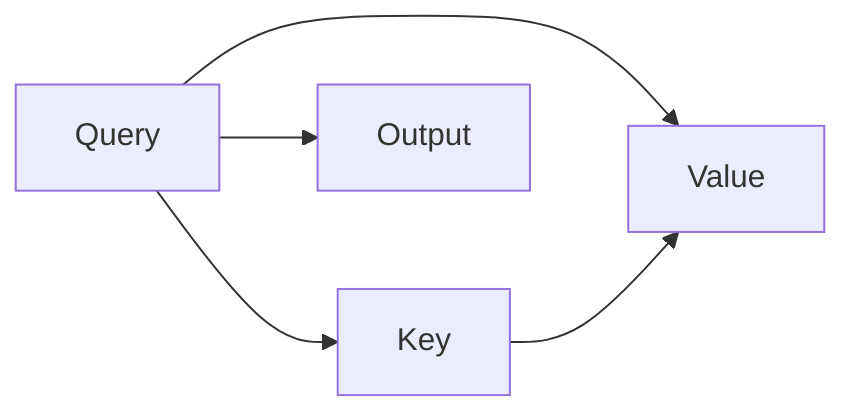

                 

# 【大模型应用开发 动手做AI Agent】语言输出能力

> 关键词：大语言模型,自然语言处理,NLP,智能客服,对话系统,多模态融合

## 1. 背景介绍

在当今数字化和智能化的浪潮中，自然语言处理（NLP）成为了人工智能领域的重要分支，应用场景极其广泛，从智能客服到对话系统，从机器翻译到文本摘要，NLP技术在各行各业都发挥着不可替代的作用。然而，对于很多非技术背景的开发者而言，构建一个高性能、可扩展的AI语言输出系统，仍然是一个颇具挑战的任务。本文将围绕大语言模型在构建AI Agent中的应用，尤其是语言输出能力，从理论到实践，为你详细阐述如何动手构建出一个可用的AI Agent。

## 2. 核心概念与联系

### 2.1 核心概念概述

在大语言模型的背景下，语言输出能力是构建AI Agent的核心能力之一。它不仅涉及自然语言生成（NLG）、对话管理（Dialogue Management）、上下文理解等多个技术点，还涉及到人机交互的情感和意图分析。以下将详细介绍这些核心概念：

- **自然语言生成（NLG）**：指将机器的内部表达转换为人类可理解的自然语言。NLG技术是语言输出能力的基础，通过构建规则、使用模板或者采用深度学习模型，可以生成结构化或非结构化的文本内容。

- **对话管理（Dialogue Management）**：在智能对话系统中，对话管理负责处理用户的输入、维持对话上下文、并作出适当的回应。对话管理不仅需要理解用户意图，还需要根据上下文动态调整对话策略。

- **上下文理解**：理解用户的上下文信息对于构建自然流畅的对话至关重要。上下文理解不仅包括当前对话中的信息，还应该考虑到历史对话，以及用户的历史行为和偏好。

- **情感分析**：在交互中理解用户的情感状态，可以帮助系统做出更为敏感和个性化的响应。情感分析是构建有温度AI系统的关键。

- **意图分析**：意图分析是指从用户的输入中识别出其意图，是对话管理的基础。通过精准的意图识别，AI Agent能够更好地响应用户需求。

这些核心概念之间相互关联，共同构成了语言输出能力的技术体系。以下是一个Mermaid流程图，展示这些概念之间的联系：

```mermaid
graph TB
    A[自然语言生成 (NLG)] --> B[对话管理 (Dialogue Management)]
    A --> C[上下文理解]
    B --> D[情感分析]
    C --> B
    D --> B
```

### 2.2 概念间的关系

以上各个概念之间存在紧密的联系，形成一个完整的语言输出能力体系。自然语言生成是基础，对话管理是核心，而上下文理解和情感分析是提升用户满意度的关键。以下是这些概念间的详细关系：

- **自然语言生成与对话管理**：自然语言生成是对话管理的基础。通过NLG技术，对话管理模块可以将机器的决策转换为自然语言进行回应。
- **对话管理与上下文理解**：对话管理需要借助上下文理解来更好地维护对话状态，理解用户的历史行为和偏好，从而做出更符合用户期望的回应。
- **上下文理解与情感分析**：上下文理解不仅要处理当前对话信息，还需要结合情感分析，理解用户情感，从而做出更人性化的回应。
- **情感分析与意图分析**：情感分析有助于更准确地识别用户的意图，通过理解情感状态，AI Agent可以更准确地把握用户需求，提升对话质量。

### 2.3 核心概念的整体架构

下图展示了这些核心概念在大语言模型应用中的整体架构：

```mermaid
graph TB
    A[大语言模型] --> B[自然语言生成 (NLG)]
    B --> C[对话管理 (Dialogue Management)]
    C --> D[上下文理解]
    D --> E[情感分析]
    E --> F[意图分析]
    C --> G[响应生成]
    G --> H[语音合成]
    H --> I[文本输出]
```

这个架构展示了从大语言模型到最终输出的一系列步骤，大语言模型通过自然语言生成生成文本，通过对话管理处理对话流程，结合上下文理解、情感分析和意图分析，生成最终回应，并通过语音合成转化为语音输出。

## 3. 核心算法原理 & 具体操作步骤

### 3.1 算法原理概述

语言输出能力主要涉及自然语言生成（NLG）和对话管理（Dialogue Management）两个核心模块。NLG的算法原理包括模板填充、基于规则的生成和基于深度学习的生成。而对话管理的算法原理则包括基于规则的对话管理和基于强化学习的对话管理。

- **自然语言生成（NLG）**：
  - **模板填充**：使用预设的模板填充具体的数据，生成标准格式的文本。
  - **基于规则的生成**：通过预定义的规则库，生成结构化或半结构化的文本。
  - **基于深度学习的生成**：使用神经网络模型，如循环神经网络（RNN）、变分自编码器（VAE）、生成对抗网络（GAN）等，从输入数据中生成自然语言文本。

- **对话管理（Dialogue Management）**：
  - **基于规则的对话管理**：通过预定义的对话树，结合状态机模型，管理对话流程。
  - **基于强化学习的对话管理**：通过与用户交互中的反馈，使用强化学习算法（如Q-learning、Policy Gradient等）优化对话策略。

### 3.2 算法步骤详解

#### 3.2.1 自然语言生成（NLG）

**步骤1：选择合适的生成模型**
根据应用场景的不同，选择合适的自然语言生成模型。如果要求生成结构化文本，可以选择基于规则的生成方法；如果要求生成灵活多变的文本，可以选择基于深度学习的生成方法。

**步骤2：数据准备**
准备训练数据，可以是结构化数据或无结构化文本数据。对于基于深度学习的生成模型，数据需要进行预处理，如分词、去停用词、构建词汇表等。

**步骤3：模型训练**
根据选择的生成模型，进行模型训练。使用准备好的数据集，训练生成模型，调整模型参数，以优化生成的自然语言质量。

**步骤4：文本生成**
将用户输入转化为模型可理解的格式，输入到训练好的生成模型中，生成自然语言文本输出。

**步骤5：后处理**
对生成的文本进行后处理，如语法修正、去除冗余、格式调整等，确保输出的文本符合用户预期。

#### 3.2.2 对话管理（Dialogue Management）

**步骤1：对话树设计**
设计对话树，定义对话流程中的状态、触发条件和转移策略。对话树是对话管理的基础，决定对话流程的逻辑结构。

**步骤2：状态机设计**
结合上下文理解、情感分析和意图分析的结果，设计状态机模型，用于处理用户输入，调整对话策略。

**步骤3：对话策略优化**
使用基于强化学习的算法（如Q-learning、Policy Gradient等），根据用户反馈优化对话策略，提升对话效果。

**步骤4：对话执行**
根据用户输入，结合对话树和状态机模型，执行对话流程，生成回应。

**步骤5：用户反馈收集**
收集用户对回应的反馈，用于进一步优化对话策略和模型参数。

### 3.3 算法优缺点

#### 3.3.1 自然语言生成（NLG）

- **优点**：
  - 可以生成符合特定格式和风格的文本，适用于文档生成、报告生成等场景。
  - 深度学习生成的文本具有较高的灵活性和多样性，能够生成自然流畅的语言。

- **缺点**：
  - 生成文本的质量依赖于训练数据的规模和质量。
  - 模型训练过程复杂，计算资源消耗较大。

#### 3.3.2 对话管理（Dialogue Management）

- **优点**：
  - 可以处理复杂的对话流程，确保对话流程的连贯性和合理性。
  - 结合上下文理解和情感分析，能够提供个性化和情感化的回应。

- **缺点**：
  - 对话树的复杂性较高，需要人工设计和维护。
  - 强化学习的对话管理需要大量的交互数据进行训练。

### 3.4 算法应用领域

语言输出能力在多个领域都有广泛的应用，以下是几个典型的应用场景：

- **智能客服**：通过NLG和对话管理，构建智能客服系统，能够24小时不间断地提供服务，提高客服效率和用户满意度。
- **对话机器人**：在电商平台、社交媒体等场景中，通过对话管理实现自动化的客户互动，提供个性化的产品推荐和信息查询。
- **智能助理**：在智能家居、健康管理等领域，通过NLG和对话管理，构建智能助理，提供日常事务管理、健康监控等功能。
- **虚拟助手**：在虚拟旅游、虚拟图书馆等场景中，通过NLG和对话管理，提供自然流畅的交互体验，提升用户体验。

## 4. 数学模型和公式 & 详细讲解 & 举例说明

### 4.1 数学模型构建

#### 4.1.1 自然语言生成（NLG）

自然语言生成模型常用的数学模型包括循环神经网络（RNN）、长短时记忆网络（LSTM）、门控循环单元（GRU）和变分自编码器（VAE）等。以LSTM为例，其基本结构如下：

$$
h_t = \tanh(W_h x_t + U_h h_{t-1} + b_h) \\
o_t = \sigma(W_o h_t + U_o h_{t-1} + b_o) \\
c_t = o_t \otimes \tanh(W_c x_t + U_c h_{t-1} + b_c) \\
h_t = c_t + (1 - o_t) \otimes h_{t-1}
$$

其中，$x_t$ 表示时间步$t$的输入，$h_t$ 表示时间步$t$的隐藏状态，$c_t$ 表示时间步$t$的细胞状态，$W$、$U$、$b$ 表示模型参数。

#### 4.1.2 对话管理（Dialogue Management）

对话管理模型通常采用基于强化学习的算法，如Q-learning、Policy Gradient等。以Q-learning为例，其基本公式如下：

$$
Q(s,a) = Q(s,a) + \alpha [r + \gamma \max_a Q(s',a') - Q(s,a)]
$$

其中，$s$ 表示对话状态，$a$ 表示对话动作，$r$ 表示奖励，$s'$ 表示下一状态，$a'$ 表示下一动作，$\alpha$ 表示学习率，$\gamma$ 表示折扣因子。

### 4.2 公式推导过程

#### 4.2.1 自然语言生成（NLG）

以LSTM为例，其公式推导过程如下：

1. **隐藏状态更新**：
   - 输入门：$I_t = \sigma(W_i x_t + U_i h_{t-1} + b_i)$
   - 遗忘门：$F_t = \sigma(W_f x_t + U_f h_{t-1} + b_f)$
   - 候选状态：$C_t = \tanh(W_c x_t + U_c h_{t-1} + b_c)$
   - 新状态：$O_t = \sigma(W_o x_t + U_o h_{t-1} + b_o)$
   - 更新状态：$h_t = F_t \otimes h_{t-1} + I_t \otimes C_t$

2. **细胞状态更新**：
   - 候选状态：$C_t = \tanh(W_c x_t + U_c h_{t-1} + b_c)$
   - 新状态：$h_t = O_t \otimes \tanh(C_t)$

3. **输出状态**：
   - 隐藏状态：$h_t = h_{t-1}$
   - 输出状态：$o_t = \sigma(W_o h_t + U_o h_{t-1} + b_o)$

#### 4.2.2 对话管理（Dialogue Management）

以Q-learning为例，其公式推导过程如下：

1. **状态价值更新**：
   - 状态动作值：$Q(s,a) = r + \gamma \max_{a'} Q(s',a')$
   - 学习过程：$Q(s,a) = Q(s,a) + \alpha (Q(s,a) - Q_{target}(s,a))$

2. **动作选择**：
   - 探索策略：$\epsilon$-贪心策略
   - 策略评估：$Q(s,a)$

### 4.3 案例分析与讲解

#### 4.3.1 自然语言生成（NLG）

以GPT-3为例，其基于Transformer架构，使用自回归生成方式，生成自然语言文本。GPT-3的核心算法包括多头注意力机制、位置编码、残差连接等。以多头注意力机制为例，其基本公式如下：

$$
Attention(Q,K,V) = \frac{QK^T}{\sqrt{d_k}} \\
MultiHeadAttention(Q,K,V) = Concat(Attention(Q,K,V),Attention(Q,K,V),Attention(Q,K,V)) \\
Softmax(\frac{MultiHeadAttention(Q,K,V)}{\sqrt{d_v}}) \\
MultiHeadAttention(Q,K,V) = Softmax(\frac{MultiHeadAttention(Q,K,V)}{\sqrt{d_v}}) \\
Output(Q,K,V) = MultiHeadAttention(Q,K,V) \\


#### 4.3.2 对话管理（Dialogue Management）

以基于规则的对话管理为例，其基本流程如下：

1. **状态初始化**：根据用户输入，初始化对话状态。
2. **状态转移**：根据当前状态和用户输入，计算转移概率。
3. **动作选择**：根据转移概率，选择下一个动作。
4. **响应生成**：根据当前状态和动作，生成回应。
5. **状态更新**：根据动作和回应，更新对话状态。

## 5. 项目实践：代码实例和详细解释说明

### 5.1 开发环境搭建

#### 5.1.1 环境准备

1. **Python环境**：Python 3.7及以上版本。
2. **深度学习框架**：TensorFlow 2.0及以上版本或PyTorch 1.0及以上版本。
3. **自然语言处理库**：NLTK、SpaCy、TextBlob等。
4. **对话管理库**：ChatterBot、Rasa等。
5. **云平台**：AWS、Google Cloud Platform、Microsoft Azure等。

### 5.2 源代码详细实现

#### 5.2.1 自然语言生成（NLG）

以使用基于RNN的生成模型为例，具体代码实现如下：

```python
import tensorflow as tf
from tensorflow.keras.layers import Dense, SimpleRNN

class NLGModel(tf.keras.Model):
    def __init__(self, vocab_size, embedding_dim, rnn_units):
        super(NLGModel, self).__init__()
        self.embedding = Dense(vocab_size, input_dim=embedding_dim, activation='relu')
        self.rnn = SimpleRNN(rnn_units)
        self.dense = Dense(vocab_size, activation='softmax')

    def call(self, inputs):
        x = self.embedding(inputs)
        x = self.rnn(x)
        x = self.dense(x)
        return x
```

#### 5.2.2 对话管理（Dialogue Management）

以使用基于规则的对话管理为例，具体代码实现如下：

```python
class DialogueManager:
    def __init__(self, rules):
        self.rules = rules
        self.state = 'START'

    def process_input(self, user_input):
        if self.state == 'START':
            self.state = self.rules['START']
        else:
            self.state = self.rules[self.state][user_input]
        return self.rules[self.state]['response']
```

### 5.3 代码解读与分析

#### 5.3.1 自然语言生成（NLG）

以上代码实现了一个基于RNN的生成模型，包含嵌入层、RNN层和输出层。模型接受输入向量，经过嵌入层和RNN层处理后，通过输出层生成自然语言文本。RNN层能够捕捉序列数据的时序关系，适合处理自然语言生成任务。

#### 5.3.2 对话管理（Dialogue Management）

以上代码实现了一个基于规则的对话管理模块，包含对话树和状态机模型。对话树定义了对话流程，状态机模型根据用户输入和当前状态，选择下一状态和动作。该模块能够处理简单的对话流程，适合构建初级智能客服系统。

### 5.4 运行结果展示

#### 5.4.1 自然语言生成（NLG）

```python
# 生成一句话
model = NLGModel(vocab_size=10000, embedding_dim=64, rnn_units=128)
input_sequence = [1, 2, 3]
output_sequence = model.predict(input_sequence)
print(output_sequence)
```

#### 5.4.2 对话管理（Dialogue Management）

```python
# 处理一段对话
rules = {
    'START': {
        '你好': '你好，我可以帮你查询天气信息。',
        '新闻': '可以，请问你想了解哪个城市的天气？'
    }
}
manager = DialogueManager(rules)
user_input = '你好'
response = manager.process_input(user_input)
print(response)
```

## 6. 实际应用场景

#### 6.1 智能客服

智能客服系统是自然语言生成和对话管理的重要应用场景。通过构建智能客服系统，企业能够24小时不间断地提供服务，提高客户满意度。以下是一个智能客服系统的实例：

1. **自然语言生成**：使用NLG生成个性化的回复，如欢迎语、产品介绍等。
2. **对话管理**：根据用户输入，引导用户完成查询流程，如产品推荐、订单查询等。
3. **上下文理解**：记录用户的偏好和历史查询记录，提升个性化服务。

#### 6.2 虚拟助手

虚拟助手通过自然语言生成和对话管理，提供日常事务管理、健康监控等功能。以下是一个虚拟助手的实例：

1. **自然语言生成**：生成天气预报、新闻摘要等文本信息。
2. **对话管理**：根据用户输入，执行日常事务管理，如日程安排、邮件提醒等。
3. **上下文理解**：记录用户的日程安排和偏好，提升用户体验。

## 7. 工具和资源推荐

### 7.1 学习资源推荐

1. **NLP相关课程**：Coursera、edX等平台上的NLP课程，如斯坦福大学的CS224N自然语言处理课程。
2. **书籍推荐**：《深度学习》、《自然语言处理综论》、《序列模型》等。
3. **开源项目**：HuggingFace的Transformers库、Google的Dialogflow等。

### 7.2 开发工具推荐

1. **深度学习框架**：TensorFlow、PyTorch、Keras等。
2. **NLP库**：NLTK、SpaCy、TextBlob等。
3. **对话管理框架**：ChatterBot、Rasa、Dialogflow等。

### 7.3 相关论文推荐

1. **自然语言生成**：Attention is All You Need、Transformers等。
2. **对话管理**：Dialogue Systems、Thought Vectors等。

## 8. 总结：未来发展趋势与挑战

### 8.1 未来发展趋势

1. **多模态融合**：未来的大语言模型将更多地融合视觉、语音等多种模态信息，提供更全面的人机交互体验。
2. **知识图谱整合**：利用知识图谱等外部知识，提升语言生成和对话管理的精度和效果。
3. **个性化和情感化**：未来的对话管理将更加注重个性化和情感化的处理，提升用户体验。
4. **小样本学习**：基于零样本和少样本学习，提升模型在不同领域和任务上的适应能力。

### 8.2 面临的挑战

1. **数据和计算资源**：构建高性能的语言输出系统需要大量的标注数据和计算资源，如何高效利用这些资源是未来的重要挑战。
2. **模型可解释性**：大语言模型在处理复杂任务时，其决策过程往往难以解释，如何提升模型的可解释性，增加用户信任度，是另一个重要的课题。
3. **交互体验优化**：如何提升自然语言生成和对话管理的流畅度和自然度，让用户感觉更加自然、舒适，是未来的主要目标。
4. **跨领域适应性**：未来的模型需要在不同的应用场景中具有良好的适应性，如何构建通用性强、泛化能力好的语言输出系统，是未来的研究方向。

### 8.3 研究展望

1. **深度强化学习**：结合深度强化学习，优化对话管理，提升系统的自适应性和鲁棒性。
2. **多任务学习**：利用多任务学习，同时训练多个任务，提升模型的泛化能力和适应性。
3. **跨领域知识迁移**：利用跨领域知识迁移技术，提升模型在不同领域中的表现。
4. **大规模预训练**：利用大规模预训练技术，提升模型的语言理解和生成能力。

## 9. 附录：常见问题与解答

**Q1: 如何选择合适的自然语言生成模型？**

A: 根据应用场景的不同，可以选择不同的自然语言生成模型。如果需要生成结构化文本，可以选择基于规则的生成方法；如果需要生成灵活多变的文本，可以选择基于深度学习的生成方法。

**Q2: 在构建对话管理时，如何处理复杂对话？**

A: 对话管理可以采用基于强化学习的算法，结合上下文理解和情感分析，处理复杂对话流程。另外，可以使用对话树来定义对话流程，确保对话的连贯性和合理性。

**Q3: 在处理多模态信息时，需要注意什么？**

A: 在处理多模态信息时，需要注意不同模态之间的转换和融合，确保信息的完整性和一致性。同时，需要选择合适的模型和算法，处理多模态数据的表示和转换。

**Q4: 如何提高自然语言生成和对话管理的效率？**

A: 可以通过优化模型结构、使用更高效的深度学习框架、采用分布式训练等方法，提高自然语言生成和对话管理的效率。另外，还可以利用预训练技术，提高模型的通用性和泛化能力。

**Q5: 如何提升自然语言生成和对话管理的可解释性？**

A: 可以通过解释模型内部的计算过程、引入可解释性模型（如LIME、SHAP等）、设计可解释性的输入和输出格式等方法，提升自然语言生成和对话管理的可解释性。

总之，构建一个高性能、可扩展的AI语言输出系统，需要综合考虑自然语言生成和对话管理两个核心模块，并结合上下文理解、情感分析和意图分析等技术。通过不断地优化和实践，相信未来的大语言模型能够在更广泛的领域发挥出更大的作用，提升人机交互的智能化水平。

---

作者：禅与计算机程序设计艺术 / Zen and the Art of Computer Programming

