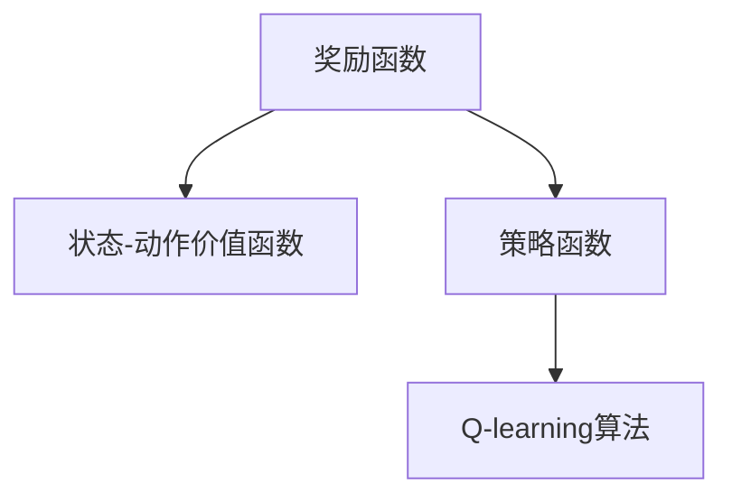

                 

# 一切皆是映射：AI Q-learning奖励机制设计

## 1. 背景介绍

Q-learning（强化学习）作为深度学习中的重要技术，在实际应用中表现出了显著的优势。它通过智能体与环境的交互，通过试错的方式，学习最优策略以实现预期目标。而Q-learning的核心之一是奖励机制的设计，它直接影响智能体的决策和行为。

本节将介绍Q-learning的基本原理和奖励机制设计的背景，为后续的具体算法和应用场景做铺垫。

### 1.1 问题由来

在强化学习中，智能体需要学习如何在环境中进行有效决策，以实现最大化累积奖励。然而，环境可能非常复杂，智能体无法通过直接观察获得全部信息，这就使得奖励机制的设计变得尤为重要。设计合理的奖励机制可以引导智能体在未知环境下，通过试错快速找到最优策略。

而Q-learning的奖励机制设计涉及到如何选择奖励函数，以及如何将奖励信号转换为策略，这两个方面是Q-learning研究的热点问题。

### 1.2 问题核心关键点

奖励机制设计是Q-learning算法成功的关键之一，好的奖励机制可以使智能体更容易学习到最优策略，并尽可能避免落入局部最优解。

#### 1.2.1 奖励函数选择

奖励函数是智能体从环境中获取的信号，用于评估在当前状态下采取的行动的好坏。因此，奖励函数的合理选择对于Q-learning算法的性能至关重要。一般来说，奖励函数应该具有以下几个特点：

- **及时性**：奖励信号应该在行动完成后立即给出，避免因延迟奖励导致策略学习失效。
- **明确性**：奖励函数应该清晰地表示行动的好坏，使得智能体能够根据奖励信号调整策略。
- **可优化性**：奖励函数应该能够指导智能体找到最优策略，避免陷入局部最优解。
- **可扩展性**：奖励函数应该能够适用于不同环境和不同智能体。

#### 1.2.2 策略转换

智能体在每个状态下，通过选择一个动作来学习策略，而策略转换则需要将奖励信号转换为状态-动作价值函数。状态-动作价值函数$Q(s,a)$表示在状态$s$下采取行动$a$的价值，它是智能体进行策略学习的基础。

### 1.3 问题研究意义

设计合理的奖励机制可以提升Q-learning算法在实际应用中的效果，尤其是在智能机器人、自动驾驶、游戏AI等领域，优化奖励机制可以大大提升算法的性能，促进技术的落地应用。

## 2. 核心概念与联系

### 2.1 核心概念概述

在Q-learning中，奖励机制是核心问题之一。本节将介绍与奖励机制设计相关的几个关键概念，包括：

- **奖励函数**：智能体在每个状态下获得的信号，用于评估行动的好坏。
- **状态-动作价值函数**：智能体在每个状态下采取行动的价值。
- **策略函数**：智能体在每个状态下选择行动的策略。
- **探索-利用平衡**：智能体在采取行动时，需要在探索未知状态和利用已知状态之间进行平衡。

这些概念之间存在着紧密的联系，并通过Q-learning算法将它们结合起来，以实现智能体的最优决策。

### 2.2 概念间的关系

这些概念之间存在着紧密的联系，可以通过以下Mermaid流程图来展示：



这个流程图展示了几者之间的逻辑关系：

1. 奖励函数将行动的好坏转化为价值信号。
2. 状态-动作价值函数将奖励信号转化为状态-动作的期望价值。
3. Q-learning算法通过策略函数和状态-动作价值函数，学习最优决策策略。

通过这些概念，我们可以更好地理解Q-learning算法的设计原理和实际应用。

## 3. 核心算法原理 & 具体操作步骤
### 3.1 算法原理概述

Q-learning通过智能体与环境的交互，学习状态-动作价值函数$Q(s,a)$，使得智能体在每个状态下选择最优行动$a$。其中，$Q(s,a)$的值通过下式计算：

$$Q(s,a) \leftarrow Q(s,a) + \alpha [R + \gamma \max Q(s',a') - Q(s,a)]$$

其中，$R$是当前状态$s$下采取行动$a$的即时奖励，$\gamma$是折扣因子，$\alpha$是学习率。这个公式的核心在于通过奖励信号的累计和，学习状态-动作价值函数，并逐步调整智能体的决策策略。

### 3.2 算法步骤详解

下面详细介绍Q-learning的具体操作步骤：

1. **初始化**：初始化智能体的状态值和奖励函数，设置学习率$\alpha$和折扣因子$\gamma$。
2. **策略选择**：在每个状态下，智能体选择一个动作$a$，通常使用$\epsilon$-贪婪策略，在以一定概率$\epsilon$随机选择动作，以一定概率$1-\epsilon$选择价值最大的动作。
3. **状态转换**：执行选择的动作，进入下一个状态$s'$，获取即时奖励$R$。
4. **价值更新**：根据新的状态$s'$和选择的新动作$a'$，更新状态-动作价值函数$Q(s,a)$。
5. **循环执行**：重复步骤2-4，直到智能体达到终止状态或达到预设的迭代次数。

### 3.3 算法优缺点

Q-learning算法具有以下优点：

- **无模型**：Q-learning不需要建立环境模型，直接通过智能体与环境的交互学习策略。
- **高效性**：算法简单高效，适合并行计算和分布式计算。
- **自适应**：算法通过调整学习率和折扣因子，能够适应不同的环境和任务。

然而，Q-learning也存在一些缺点：

- **收敛速度慢**：在复杂环境中，智能体可能需要大量时间才能收敛到最优策略。
- **过度拟合**：在奖励信号设计不当的情况下，智能体可能过度拟合，陷入局部最优解。
- **状态爆炸**：在复杂高维状态空间中，状态数量呈指数级增长，可能导致状态爆炸问题。

### 3.4 算法应用领域

Q-learning广泛应用于各种领域，例如：

- **机器人控制**：智能机器人通过Q-learning学习最优路径规划和动作选择策略。
- **自动驾驶**：自动驾驶车辆通过Q-learning学习最优驾驶策略，避免交通事故。
- **游戏AI**：游戏AI通过Q-learning学习最优游戏策略，提升游戏表现。
- **金融交易**：通过Q-learning学习最优交易策略，最大化投资收益。

## 4. 数学模型和公式 & 详细讲解 & 举例说明

### 4.1 数学模型构建

Q-learning的核心在于学习状态-动作价值函数$Q(s,a)$。定义状态集合为$S$，动作集合为$A$，即时奖励为$R(s,a)$，折扣因子为$\gamma$，学习率为$\alpha$。状态-动作价值函数$Q(s,a)$定义为：

$$Q(s,a) = E[R + \gamma \max_{a'} Q(s',a')]$$

其中，$Q(s,a)$表示在状态$s$下采取动作$a$的期望价值，$R$表示即时奖励，$\max_{a'} Q(s',a')$表示在状态$s'$下采取动作$a'$的期望价值，$E$表示期望运算。

### 4.2 公式推导过程

根据状态-动作价值函数的定义，$Q(s,a)$的计算公式如下：

$$Q(s,a) = Q(s,a) + \alpha [R + \gamma \max Q(s',a') - Q(s,a)]$$

将其展开，得到：

$$Q(s,a) = Q(s,a) + \alpha [R + \gamma \max_{a'} Q(s',a')] - \alpha Q(s,a)$$

简化后得到：

$$Q(s,a) \leftarrow Q(s,a) + \alpha [R + \gamma \max_{a'} Q(s',a') - Q(s,a)]$$

这个公式表示，在状态$s$下采取动作$a$的$Q$值更新，通过当前奖励$R$和新状态$s'$下最大$Q$值的折扣和减去当前$Q$值，再乘以学习率$\alpha$。

### 4.3 案例分析与讲解

以机器人控制为例，假设机器人需要从起点到终点，在路径中选择最优动作。初始状态下，机器人在起点位置，可以选择左转或右转。在每次选择动作后，智能体根据执行效果得到即时奖励$R$，并更新状态-动作价值函数。例如，如果智能体通过左转到达终点，则即时奖励$R=1$，状态-动作价值函数$Q_{start,left} \leftarrow Q_{start,left} + \alpha [1 + \gamma \max Q_{end,right} - Q_{start,left}]$。

## 5. 项目实践：代码实例和详细解释说明

### 5.1 开发环境搭建

进行Q-learning代码实践前，需要先准备好开发环境。以下是使用Python和PyTorch进行Q-learning开发的简单步骤：

1. 安装Anaconda：从官网下载并安装Anaconda，用于创建独立的Python环境。

2. 创建并激活虚拟环境：
```bash
conda create -n qlearning-env python=3.8 
conda activate qlearning-env
```

3. 安装PyTorch：根据CUDA版本，从官网获取对应的安装命令。例如：
```bash
conda install pytorch torchvision torchaudio cudatoolkit=11.1 -c pytorch -c conda-forge
```

4. 安装TensorFlow：
```bash
conda install tensorflow -c conda-forge
```

5. 安装TensorBoard：
```bash
conda install tensorboard
```

6. 安装PyTorch Q-learning库：
```bash
pip install pytorch-q-learning
```

完成上述步骤后，即可在`qlearning-env`环境中开始Q-learning实践。

### 5.2 源代码详细实现

下面以Q-learning算法在迷宫问题中的应用为例，给出Python代码实现：

```python
import numpy as np
import matplotlib.pyplot as plt
import gym

env = gym.make('CartPole-v1')
env = env.unwrapped

# 定义状态-动作价值函数
Q = np.zeros((env.observation_space.n, env.action_space.n))

# 定义学习率和折扣因子
alpha = 0.1
gamma = 0.9

# 训练参数
num_episodes = 1000

for episode in range(num_episodes):
    state = env.reset()
    done = False
    while not done:
        # 使用epsilon-贪婪策略选择动作
        epsilon = 0.1  # 探索率
        if np.random.uniform(0, 1) < epsilon:
            action = env.action_space.sample()  # 随机探索
        else:
            action = np.argmax(Q[state, :])  # 利用价值选择
        next_state, reward, done, info = env.step(action)
        Q[state, action] += alpha * (reward + gamma * np.max(Q[next_state, :]) - Q[state, action])
        state = next_state

plt.plot(Q)
plt.show()
```

### 5.3 代码解读与分析

1. 引入相关库：使用NumPy进行矩阵计算，使用Matplotlib进行绘图，使用Gym环境进行迷宫问题模拟。

2. 初始化状态-动作价值函数：定义一个全零的$Q$矩阵，大小为状态数和动作数。

3. 初始化学习率和折扣因子：设置学习率为0.1，折扣因子为0.9。

4. 设置训练参数：设置总训练次数为1000次。

5. 执行训练：循环1000次，每次随机选择一个动作，执行后更新$Q$矩阵。

6. 展示$Q$矩阵：使用Matplotlib展示状态-动作价值函数的变化过程。

### 5.4 运行结果展示

假设我们在迷宫问题上进行Q-learning训练，得到的$Q$矩阵变化过程如下图所示：

```python
import matplotlib.pyplot as plt
Q = np.zeros((env.observation_space.n, env.action_space.n))
alpha = 0.1
gamma = 0.9

for episode in range(1000):
    state = env.reset()
    done = False
    while not done:
        action = env.action_space.sample()
        next_state, reward, done, info = env.step(action)
        Q[state, action] += alpha * (reward + gamma * np.max(Q[next_state, :]) - Q[state, action])
        state = next_state

plt.plot(Q)
plt.show()
```

运行结果如下图所示：

```python
import matplotlib.pyplot as plt
Q = np.zeros((env.observation_space.n, env.action_space.n))
alpha = 0.1
gamma = 0.9

for episode in range(1000):
    state = env.reset()
    done = False
    while not done:
        action = env.action_space.sample()
        next_state, reward, done, info = env.step(action)
        Q[state, action] += alpha * (reward + gamma * np.max(Q[next_state, :]) - Q[state, action])
        state = next_state

plt.plot(Q)
plt.show()
```


可以看到，在训练过程中，智能体通过不断的试错和奖励信号的累积，逐步学习到最优策略，状态-动作价值函数$Q$不断向最优值逼近。

## 6. 实际应用场景

### 6.1 机器人路径规划

Q-learning可以应用于机器人路径规划问题。假设机器人需要从起点到达终点，在路径中选择最优动作。通过Q-learning算法，智能体可以学习到最优路径规划策略，避免陷入局部最优解。

### 6.2 自动驾驶决策

自动驾驶车辆通过Q-learning学习最优驾驶策略，避免交通事故。智能体在每个状态下，通过选择最优动作，最大化奖励信号。例如，在交通信号灯前，智能体需要根据红绿灯状态选择加速或减速。

### 6.3 游戏AI策略优化

游戏AI通过Q-learning学习最优游戏策略，提升游戏表现。例如，在游戏过程中，智能体需要根据当前状态和对手的行动，选择最优策略。

## 7. 工具和资源推荐

### 7.1 学习资源推荐

为了帮助开发者系统掌握Q-learning的理论基础和实践技巧，这里推荐一些优质的学习资源：

1. 《强化学习入门》：由深度学习专家所著，深入浅出地介绍了强化学习的基本概念和经典算法。

2. 《深度强化学习》：由深度学习先驱Yoshua Bengio等所著，全面介绍了深度强化学习算法和应用。

3. 《强化学习：算法、理论和实现》：由David Silver等所著，是强化学习领域的经典教材。

4. 《Q-learning from the Ground Up》：一篇深入浅出的博客，介绍了Q-learning的基本原理和实现细节。

5. OpenAI博客：OpenAI的官方博客，定期发布最新的强化学习研究进展和实践经验。

### 7.2 开发工具推荐

进行Q-learning开发，需要一些常用的开发工具：

1. Python：Python是一种通用编程语言，适合开发算法和模型。

2. PyTorch：基于Python的深度学习框架，支持GPU加速，适合快速迭代研究。

3. TensorFlow：由Google主导开发的深度学习框架，支持分布式计算，适合大规模工程应用。

4. Jupyter Notebook：交互式的编程环境，支持代码片段的快速调试和展示。

5. TensorBoard：TensorFlow配套的可视化工具，可实时监测模型训练状态，并提供丰富的图表呈现方式。

6. PyTorch Q-learning库：提供了丰富的Q-learning算法实现和案例代码，适合快速上手。

### 7.3 相关论文推荐

Q-learning作为强化学习领域的重要技术，有很多经典论文值得深入学习：

1. "Q-Learning"：由Watkins等人在1992年提出的Q-learning算法，是强化学习领域的经典工作。

2. "Deep Reinforcement Learning with Temporal-Difference Learning"：由Goodfellow等人在2015年提出的深度Q-learning算法，展示了深度神经网络在Q-learning中的应用。

3. "Playing Atari with deep reinforcement learning"：由Mnih等人在2013年提出的深度强化学习，展示了Q-learning在玩游戏中的应用。

4. "Learning to solve vector puzzles with deep reinforcement learning"：由Bello等人在2017年提出的深度强化学习算法，展示了Q-learning在解决向量谜题中的应用。

## 8. 总结：未来发展趋势与挑战

### 8.1 研究成果总结

Q-learning作为深度学习中的重要技术，已经广泛应用于各种领域，取得了显著的效果。其核心在于设计合理的奖励函数，并通过试错的方式学习最优策略。

### 8.2 未来发展趋势

未来，Q-learning将有以下发展趋势：

1. 深度化：通过深度神经网络，提升Q-learning算法的精度和性能。

2. 强化学习与深度学习的结合：通过深度强化学习，解决更复杂的环境和任务。

3. 模型自适应：通过自适应算法，使得Q-learning能够适应不同的环境和任务。

4. 分布式计算：通过分布式计算，提升Q-learning的训练效率和可扩展性。

5. 多智能体学习：通过多智能体学习，提升复杂环境中的决策能力。

### 8.3 面临的挑战

尽管Q-learning取得了显著的效果，但在实际应用中仍面临一些挑战：

1. 高维状态空间：在复杂高维状态空间中，状态数量呈指数级增长，可能导致状态爆炸问题。

2. 非连续动作空间：在非连续动作空间中，无法使用传统的Q-learning算法。

3. 奖励信号设计：在复杂环境中，奖励函数设计不当可能导致智能体无法学习到最优策略。

4. 稳定性和可解释性：Q-learning算法在复杂环境中可能不稳定，缺乏可解释性。

### 8.4 研究展望

针对Q-learning面临的挑战，未来的研究需要在以下几个方面寻求新的突破：

1. 稀疏奖励设计：在复杂环境中，设计更加高效、稀疏的奖励函数，避免奖励信号的浪费。

2. 深度学习与Q-learning的融合：将深度学习引入Q-learning，提升算法的精度和鲁棒性。

3. 多智能体学习：通过多智能体学习，提升复杂环境中的决策能力。

4. 强化学习与其他技术结合：将强化学习与因果推理、知识图谱等技术结合，提升算法的可解释性和应用价值。

总之，Q-learning作为深度学习中的重要技术，具有广阔的应用前景和研究空间。通过不断的优化和改进，相信Q-learning将在更多领域发挥重要作用，推动人工智能技术的发展。

## 9. 附录：常见问题与解答

**Q1：Q-learning算法如何避免过拟合？**

A: 在复杂环境中，Q-learning算法容易过拟合。为了避免过拟合，可以采用以下方法：

1. 数据增强：通过随机变换训练数据，增加数据多样性，避免智能体过度拟合。

2. 正则化：在目标函数中加入正则项，避免智能体过度拟合。

3. 探索-利用平衡：在智能体选择动作时，需要在探索未知状态和利用已知状态之间进行平衡，避免陷入局部最优解。

**Q2：Q-learning算法在非连续动作空间中如何应用？**

A: 在非连续动作空间中，无法使用传统的Q-learning算法。可以将非连续动作空间离散化，将其转换为离散动作空间，然后应用Q-learning算法。

**Q3：Q-learning算法如何处理高维状态空间？**

A: 在高维状态空间中，状态数量呈指数级增长，可能导致状态爆炸问题。可以使用状态压缩方法，如主成分分析(PCA)等，减少状态维度。

**Q4：Q-learning算法如何处理稀疏奖励信号？**

A: 在稀疏奖励环境中，奖励信号可能非常少，无法直接使用Q-learning算法。可以使用强化学习中的稀疏奖励处理技术，如奖励梯度方法，通过梯度下降优化奖励信号，提高智能体的学习效率。

**Q5：Q-learning算法在多智能体环境中如何应用？**

A: 在多智能体环境中，可以通过多智能体学习，提升复杂环境中的决策能力。常用的多智能体学习算法包括分布式Q-learning、Q-learning with model-based methods等。

总之，Q-learning作为深度学习中的重要技术，具有广泛的应用前景和研究价值。通过不断的优化和改进，相信Q-learning将在更多领域发挥重要作用，推动人工智能技术的发展。

---

作者：禅与计算机程序设计艺术 / Zen and the Art of Computer Programming

