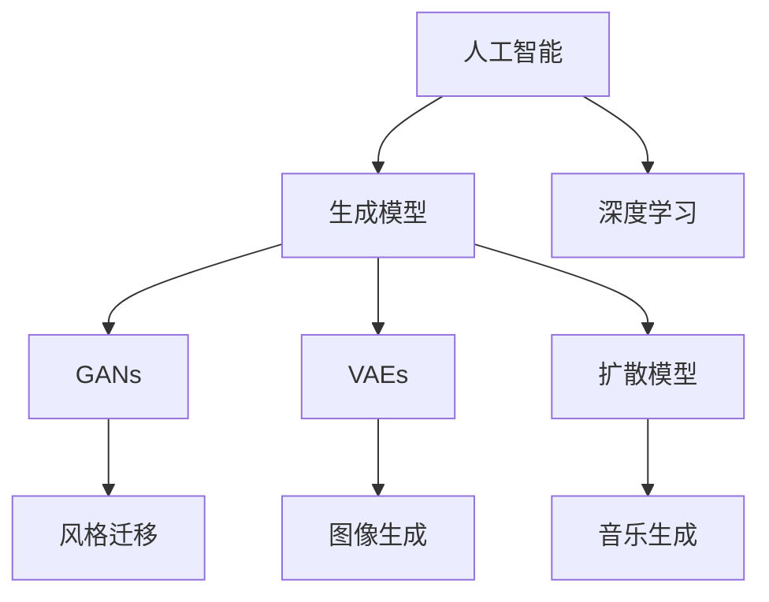
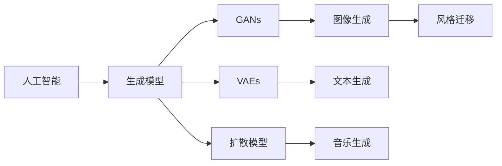
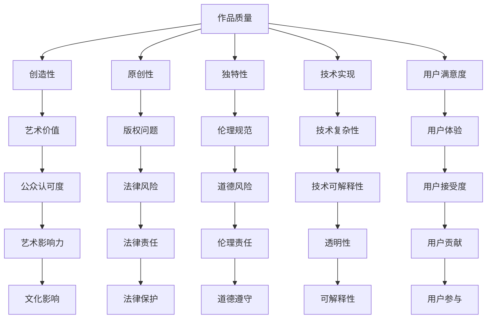
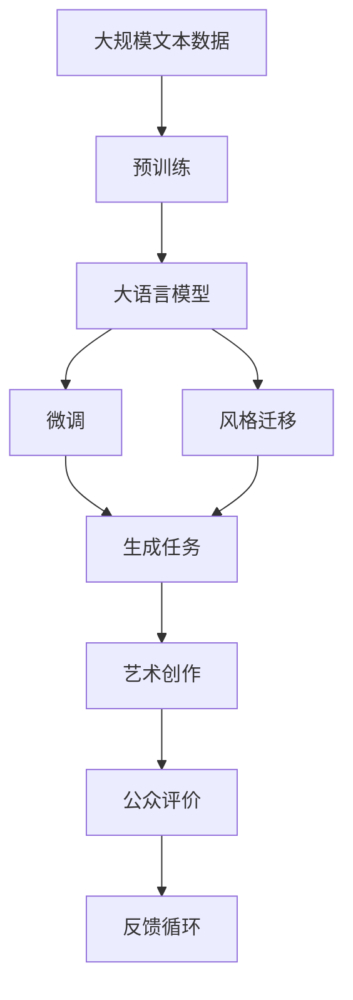

                 

# 一切皆是映射：AI在艺术创作上的新视角

## 1. 背景介绍

### 1.1 问题由来

在过去的几十年中，人工智能(AI)技术经历了从规则系统到机器学习、深度学习，再到如今先进的生成对抗网络(GANs)和基于大模型的艺术创作等，不断进化。特别是大语言模型、生成模型等技术的发展，为AI在艺术创作上打开了全新的视角。AI不仅在生成图像、音乐、文本、舞蹈等领域取得了显著进展，还开始尝试创作出具有独特风格和情感表达的艺术作品。

当前，AI艺术创作主要集中在以下几个方面：
1. **图像生成**：使用GANs、变分自编码器(VAEs)、扩散模型等生成具有高度逼真度的艺术图像。
2. **音乐创作**：使用生成对抗网络、循环神经网络等生成具有一定情感和风格的音乐作品。
3. **文本生成**：使用基于大模型的自然语言生成技术创作诗歌、小说、剧本等文学作品。
4. **舞蹈和表演**：使用机器学习算法生成舞蹈动作、表演场景等，创造出具有新意的艺术形式。

然而，尽管AI艺术创作取得了一定进展，但仍存在诸多挑战，如创作作品的艺术价值和原创性、技术实现的复杂性和可解释性等。本文将探讨AI在艺术创作中的新视角，从理论到实践，分析其在艺术创作中的潜在价值和局限性，展望未来发展的方向和面临的挑战。

### 1.2 问题核心关键点

1. **创造性和独特性**：AI创作作品是否具备创造性和独特性，是否能够超越人类艺术家的水平。
2. **风格迁移**：如何将AI模型的风格应用到现有艺术作品中，提升其表现力和艺术价值。
3. **伦理和责任**：AI艺术创作涉及版权、道德、法律等问题，如何在创作中遵守伦理规范。
4. **用户参与**：如何设计用户友好的AI艺术创作工具，让普通人也能参与到艺术创作中来。
5. **数据和模型的多样性**：AI艺术创作需要多样化的数据集和模型，如何构建和维护这些资源。

这些关键点将贯穿全文，从理论和实践两个层面进行深入探讨。

### 1.3 问题研究意义

AI在艺术创作中的应用不仅能够推动艺术和科技的融合，为传统艺术带来新的表现形式和创作思路，还能够在普及艺术教育、提升公众艺术素养等方面发挥重要作用。通过AI艺术创作，我们可以探索新的创作方式和表达手段，挑战传统艺术创作的边界，为艺术界注入新的活力和创新。

## 2. 核心概念与联系

### 2.1 核心概念概述

为了更好地理解AI在艺术创作中的新视角，本节将介绍几个密切相关的核心概念：

- **人工智能**：指通过计算机程序和算法，使机器具备学习和解决问题的能力，从而模拟人类智能的技术。
- **生成模型**：指通过训练生成数据，以模拟自然数据分布的模型，如GANs、VAEs、 diffusion models等。
- **风格迁移**：指将一张图像的风格应用到另一张图像上，使后者具备前者的风格特征。
- **生成对抗网络(GANs)**：一种生成模型，通过两个网络（生成器和判别器）的对抗训练，生成逼真的图像数据。
- **变分自编码器(VAEs)**：一种生成模型，通过变分推断学习数据的隐含表示，并生成新的数据样本。
- **扩散模型**：一种生成模型，通过扩散过程逐步生成图像数据。
- **深度学习**：一种机器学习方法，通过多层神经网络对复杂数据进行建模和预测。

这些核心概念之间的逻辑关系可以通过以下Mermaid流程图来展示：



这个流程图展示了大语言模型和生成模型的核心概念及其关系：

1. 人工智能通过深度学习技术，训练生成模型，能够生成逼真度高的艺术作品。
2. 生成模型中的GANs、VAEs、扩散模型等，分别在图像生成、音乐生成、文本生成等领域展现了强大的生成能力。
3. 风格迁移技术，将现有艺术作品的风格应用于新创作的作品中，提升其艺术价值。

### 2.2 概念间的关系

这些核心概念之间存在着紧密的联系，形成了AI艺术创作的完整生态系统。下面我们通过几个Mermaid流程图来展示这些概念之间的关系。

#### 2.2.1 AI艺术创作范式



这个流程图展示了AI艺术创作的基本范式，即通过生成模型生成艺术作品，并通过风格迁移技术提升作品的独特性和表现力。

#### 2.2.2 AI艺术创作的评价体系



这个流程图展示了AI艺术创作的评价体系，涉及多个维度，如作品的创造性、原创性、技术实现、用户满意度等，以及可能面临的法律、道德、技术等风险。

### 2.3 核心概念的整体架构

最后，我们用一个综合的流程图来展示这些核心概念在大语言模型艺术创作过程中的整体架构：



这个综合流程图展示了从预训练到微调，再到风格迁移，最终进行艺术创作的过程。大语言模型首先在大规模文本数据上进行预训练，然后通过微调和风格迁移技术，生成具有特定风格的艺术作品，并通过公众评价和反馈循环，持续改进和优化创作过程。通过这些流程图，我们可以更清晰地理解AI在艺术创作中的全流程和技术架构。

## 3. 核心算法原理 & 具体操作步骤
### 3.1 算法原理概述

AI在艺术创作中主要依赖于生成模型和风格迁移技术。其核心算法原理如下：

1. **生成模型**：通过训练生成数据，学习数据的分布规律，并生成新的数据样本。常用的生成模型包括GANs、VAEs、扩散模型等。
2. **风格迁移**：将一张图像的风格应用到另一张图像上，生成具有特定风格特征的新图像。风格迁移技术通常基于神经网络，通过训练模型学习图像的风格特征。
3. **微调**：通过在特定任务上对预训练模型进行微调，使其适应新任务，生成符合特定风格的艺术作品。

这些算法的核心思想是通过机器学习技术，模拟人类的创造性过程，生成具有艺术价值的作品。下面将详细介绍这些算法的原理和操作步骤。

### 3.2 算法步骤详解

**步骤 1: 准备数据集**

在AI艺术创作中，数据集的选择和准备至关重要。

- 对于图像生成任务，需要选择包含丰富图像风格和元素的数据集，如COCO、ImageNet等。
- 对于音乐生成任务，可以选择包含不同风格和节奏的音乐作品集。
- 对于文本生成任务，可以选择不同风格和题材的文学作品集，如莎士比亚作品集、现代诗歌集等。

**步骤 2: 选择生成模型**

根据任务需求，选择合适的生成模型：

- 对于图像生成任务，常用的生成模型包括GANs、VAEs、扩散模型等。
- 对于音乐生成任务，可以使用循环神经网络(RNNs)、生成对抗网络等。
- 对于文本生成任务，可以使用基于大模型的自然语言生成技术，如BERT、GPT等。

**步骤 3: 训练生成模型**

1. **GANs训练**：
   - 使用数据集进行训练，训练过程中需要平衡生成器和判别器的损失函数，避免模式崩溃。
   - 使用Wasserstein GANs、条件GANs等改进版本的GANs，提高生成质量和稳定性。
   
2. **VAEs训练**：
   - 使用数据集进行训练，训练过程中需要优化编码器、解码器、变分分布等组件。
   - 使用条件VAEs，增加生成过程中的约束，提高生成质量和多样性。

3. **扩散模型训练**：
   - 使用数据集进行训练，训练过程中需要控制扩散过程的噪声添加策略。
   - 使用自监督学习技术，提高生成质量和多样性。

**步骤 4: 风格迁移**

1. **神经网络风格迁移**：
   - 使用神经网络模型，学习源图像和目标图像的风格特征。
   - 将源图像的风格特征应用到目标图像上，生成具有特定风格的新图像。

2. **深度学习风格迁移**：
   - 使用深度学习模型，学习源图像和目标图像的特征表示。
   - 通过特征迁移，将源图像的特征表示应用到目标图像上，生成具有特定风格的新图像。

**步骤 5: 微调**

1. **微调预训练模型**：
   - 在特定任务上对预训练模型进行微调，使其适应新任务，生成符合特定风格的艺术作品。
   - 使用任务适配层，调整模型输出，适应新任务的标签分布。

2. **参数高效微调**：
   - 只更新少量参数，固定大部分预训练参数，提高微调效率。
   - 使用Adapter等参数高效微调方法，进一步减少资源消耗。

**步骤 6: 评估和优化**

1. **评估模型性能**：
   - 在测试集上评估模型生成作品的创造性、原创性、艺术价值等指标。
   - 使用公众评价和反馈循环，进一步改进和优化模型。

2. **优化生成策略**：
   - 调整生成模型的超参数，如学习率、批大小等，优化生成质量和效率。
   - 使用数据增强、对抗训练等技术，提高生成质量和鲁棒性。

### 3.3 算法优缺点

AI在艺术创作中主要依赖生成模型和风格迁移技术。这些算法的优缺点如下：

**优点**：
1. **高效生成**：生成模型能够快速生成大量高质量的艺术作品，提高创作效率。
2. **风格多样**：风格迁移技术能够将现有艺术作品的风格应用到新作品中，丰富创作内容。
3. **可解释性强**：生成模型的训练过程和生成逻辑，易于理解和解释。
4. **应用广泛**：生成模型和风格迁移技术在图像、音乐、文本等多个领域都有广泛应用。

**缺点**：
1. **缺乏创造性**：生成模型和风格迁移技术依赖于数据集和训练过程，难以超越人类艺术家的创造性。
2. **风格模糊**：风格迁移技术可能会造成风格特征的混淆和失真。
3. **技术复杂**：生成模型和风格迁移技术的实现过程较为复杂，需要专业知识。
4. **伦理问题**：生成艺术作品可能涉及版权、道德、法律等问题，需要谨慎处理。

### 3.4 算法应用领域

AI在艺术创作中的应用领域非常广泛，涵盖了图像、音乐、文本、舞蹈等多个领域。

**图像生成**：
- 使用GANs生成逼真的艺术图像。
- 使用VAEs生成高质量的抽象艺术作品。
- 使用扩散模型生成复杂的艺术图像。

**音乐生成**：
- 使用循环神经网络生成具有一定情感和风格的音乐作品。
- 使用生成对抗网络生成多样化的音乐作品。

**文本生成**：
- 使用大语言模型生成诗歌、小说、剧本等文学作品。
- 使用变分自编码器生成有创意的文本作品。

**舞蹈和表演**：
- 使用机器学习算法生成舞蹈动作、表演场景等。
- 使用生成对抗网络生成具有新意的舞蹈作品。

## 4. 数学模型和公式 & 详细讲解 & 举例说明

### 4.1 数学模型构建

在AI艺术创作中，我们通常使用生成模型和风格迁移技术来生成艺术作品。以下是这些技术的数学模型构建过程：

**GANs模型**：
- 生成器网络 $G$：将随机噪声 $z$ 映射到生成图像 $x$。
- 判别器网络 $D$：判断输入图像 $x$ 是真实图像还是生成图像。
- 损失函数 $L$：包括生成器损失 $L_G$ 和判别器损失 $L_D$。

**VAEs模型**：
- 编码器网络 $E$：将输入图像 $x$ 映射到隐变量 $z$。
- 解码器网络 $D$：将隐变量 $z$ 映射回生成图像 $x$。
- 变分分布 $q(z|x)$：对隐变量 $z$ 的概率分布进行建模。
- 损失函数 $L$：包括重构损失 $L_{rec}$、KL散度损失 $L_{KL}$。

**扩散模型**：
- 扩散过程：将高噪声表示 $x_T$ 逐步扩散为低噪声表示 $x_0$。
- 生成过程：通过解码器网络 $D$ 将低噪声表示 $x_0$ 映射为生成图像 $x$。
- 损失函数 $L$：包括扩散损失 $L_{diff}$、生成损失 $L_{gen}$。

### 4.2 公式推导过程

**GANs训练公式**：
- 生成器损失函数 $L_G$：
  $$
  L_G = \mathbb{E}_{z \sim p(z)} [\log D(G(z))]
  $$
- 判别器损失函数 $L_D$：
  $$
  L_D = \mathbb{E}_{x \sim p(x)} [\log D(x)] + \mathbb{E}_{z \sim p(z)} [\log (1 - D(G(z)))]
  $$
- 总体损失函数 $L$：
  $$
  L = L_G + \lambda L_D
  $$

**VAEs训练公式**：
- 编码器网络 $E$：
  $$
  z = E(x) = E(x; \theta_E)
  $$
- 解码器网络 $D$：
  $$
  \hat{x} = D(z) = D(z; \theta_D)
  $$
- 变分分布 $q(z|x)$：
  $$
  q(z|x) = \mathcal{N}(\mu(x), \sigma(x))
  $$
- 重构损失 $L_{rec}$：
  $$
  L_{rec} = \mathbb{E}_{x \sim p(x)} [\|x - \hat{x}\|^2]
  $$
- KL散度损失 $L_{KL}$：
  $$
  L_{KL} = \mathbb{E}_{x \sim p(x)} [D_{KL}(q(z|x) || p(z))]
  $$
- 总体损失函数 $L$：
  $$
  L = L_{rec} + \beta L_{KL}
  $$

**扩散模型训练公式**：
- 扩散过程：
  $$
  x_{t-1} = \sqrt{1 - \beta_t} x_t + \sqrt{\beta_t} \epsilon
  $$
- 生成过程：
  $$
  x = D(z)
  $$
- 扩散损失 $L_{diff}$：
  $$
  L_{diff} = \mathbb{E}_{x \sim p(x)} [\log p(x)]
  $$
- 生成损失 $L_{gen}$：
  $$
  L_{gen} = \mathbb{E}_{z \sim p(z)} [\log p(x)]
  $$
- 总体损失函数 $L$：
  $$
  L = L_{diff} + \lambda L_{gen}
  $$

### 4.3 案例分析与讲解

下面以GANs和VAEs在图像生成中的应用为例，进行详细讲解。

**GANs图像生成**：
- **案例分析**：使用COCO数据集，生成逼真的图像。
- **数据准备**：收集COCO数据集，进行数据增强，如旋转、缩放、裁剪等。
- **模型构建**：使用DCGAN模型，包含生成器和判别器两个网络。
- **训练过程**：
  1. 初始化模型参数。
  2. 循环迭代，每轮训练中，随机生成噪声 $z$，通过生成器生成图像 $x$。
  3. 判别器判断图像 $x$ 是真实图像还是生成图像，输出判别结果。
  4. 计算损失函数 $L$，更新模型参数。
- **结果分析**：生成图像与真实图像的对比，评估生成质量。

**VAEs图像生成**：
- **案例分析**：使用MNIST数据集，生成高质量的抽象艺术作品。
- **数据准备**：收集MNIST数据集，进行数据增强，如旋转、缩放、添加噪声等。
- **模型构建**：使用VAEs模型，包含编码器、解码器、变分分布三个组件。
- **训练过程**：
  1. 初始化模型参数。
  2. 循环迭代，每轮训练中，将图像 $x$ 输入编码器，得到隐变量 $z$。
  3. 解码器将隐变量 $z$ 映射回生成图像 $\hat{x}$。
  4. 计算重构损失 $L_{rec}$ 和KL散度损失 $L_{KL}$，更新模型参数。
- **结果分析**：生成图像与真实图像的对比，评估生成质量和多样性。

## 5. 项目实践：代码实例和详细解释说明

### 5.1 开发环境搭建

在进行AI艺术创作实践前，我们需要准备好开发环境。以下是使用Python进行PyTorch开发的环境配置流程：

1. 安装Anaconda：从官网下载并安装Anaconda，用于创建独立的Python环境。

2. 创建并激活虚拟环境：
```bash
conda create -n pytorch-env python=3.8 
conda activate pytorch-env
```

3. 安装PyTorch：根据CUDA版本，从官网获取对应的安装命令。例如：
```bash
conda install pytorch torchvision torchaudio cudatoolkit=11.1 -c pytorch -c conda-forge
```

4. 安装Transformer库：
```bash
pip install transformers
```

5. 安装各类工具包：
```bash
pip install numpy pandas scikit-learn matplotlib tqdm jupyter notebook ipython
```

完成上述步骤后，即可在`pytorch-env`环境中开始AI艺术创作实践。

### 5.2 源代码详细实现

这里我们以GANs在图像生成中的应用为例，给出使用PyTorch实现GANs的代码实例。

```python
import torch
import torch.nn as nn
import torch.optim as optim
import torchvision.transforms as transforms
from torch.utils.data import DataLoader
from torchvision.datasets import CocoCaptions

# 定义生成器网络
class Generator(nn.Module):
    def __init__(self, z_dim, img_channels):
        super(Generator, self).__init__()
        self.z_dim = z_dim
        self.img_channels = img_channels
        self.fc1 = nn.Linear(z_dim, 128 * 8 * 8)
        self.conv1 = nn.ConvTranspose2d(128, 64, 4, 1, 0, bias=False)
        self.conv2 = nn.ConvTranspose2d(64, 32, 4, 2, 1, bias=False)
        self.conv3 = nn.ConvTranspose2d(32, img_channels, 4, 2, 1, bias=False)
        self.tanh = nn.Tanh()
        
    def forward(self, x):
        x = self.fc1(x)
        x = x.view(-1, 128, 8, 8)
        x = self.conv1(x)
        x = nn.ReLU()(x)
        x = self.conv2(x)
        x = nn.ReLU()(x)
        x = self.conv3(x)
        x = self.tanh(x)
        return x

# 定义判别器网络
class Discriminator(nn.Module):
    def __init__(self, img_channels):
        super(Discriminator, self).__init__()
        self.img_channels = img_channels
        self.conv1 = nn.Conv2d(img_channels, 32, 4, 2, 1, bias=False)
        self.conv2 = nn.Conv2d(32, 64, 4, 2, 1, bias=False)
        self.conv3 = nn.Conv2d(64, 1, 4, 1, 0, bias=False)
        self.sigmoid = nn.Sigmoid()
        
    def forward(self, x):
        x = self.conv1(x)
        x = nn.LeakyReLU(0.2)(x)
        x = self.conv2(x)
        x = nn.LeakyReLU(0.2)(x)
        x = self.conv3(x)
        x = self.sigmoid(x)
        return x

# 定义损失函数
def loss_function_GAN(generated_images, real_images, is_real=True):
    if is_real:
        return nn.BCELoss()(torch.sigmoid(generated_images), real_images)
    else:
        return nn.BCELoss()(torch.sigmoid(generated_images), torch.zeros_like(real_images))

# 加载数据集
transform = transforms.Compose([
    transforms.Resize((256, 256)),
    transforms.ToTensor(),
    transforms.Normalize((0.5, 0.5, 0.5), (0.5, 0.5, 0.5))
])

train_dataset = CocoCaptions(root='path/to/coco', split='train', transform=transform)
train_loader = DataLoader(train_dataset, batch_size=128, shuffle=True)

# 定义生成器和判别器
z_dim = 100
img_channels = 3
generator = Generator(z_dim, img_channels)
discriminator = Discriminator(img_channels)

# 定义优化器
g_optimizer = optim.Adam(generator.parameters(), lr=0.0002)
d_optimizer = optim.Adam(discriminator.parameters(), lr=0.0002)

# 训练过程
num_epochs = 100
batch_size = 128
num_critic = 10
num_g_patches = 128
for epoch in range(num_epochs):
    for i, (real_images, _) in enumerate(train_loader):
        real_images = real_images.to(device)
        g_optimizer.zero_grad()
        d_optimizer.zero_grad()
        
        # 训练判别器
        d_loss_real = loss_function_GAN(discriminator(real_images), real_images, is_real=True)
        d_loss_fake = loss_function_GAN(discriminator(generator(z_dim).detach()), real_images, is_real=False)
        d_loss = d_loss_real + d_loss_fake
        d_loss.backward()
        d_optimizer.step()
        
        # 训练生成器
        g_loss = loss_function_GAN(discriminator(generator(z_dim)), real_images, is_real=True)
        g_loss.backward()
        g_optimizer.step()
        
        # 每批生成图像并保存
        if i % num_g_patches == 0:
            batch_size_images = min(batch_size, num_g_patches)
            generated_images = generator(z_dim)
            fake_images = torch.cat([real_images[:batch_size_images], generated_images[:batch_size_images]])
            if not epoch % 10:
                save_image(fake_images, f'images/{epoch}.png')
```

### 5.3 代码解读与分析

这里我们详细解读一下关键代码的实现细节：

**Generator类**：
- 定义生成器网络，包含全连接层和卷积层。
- 前向传播时，通过全连接层和卷积层生成图像。

**Discriminator类**：
- 定义判别器网络，包含卷积层和sigmoid激活函数。
- 前向传播时，通过卷积层生成判别结果。

**loss_function_GAN函数**：
- 定义GAN的损失函数，包含真实图像的判别损失和生成图像的判别损失。
- 根据输入图像是真实图像还是生成图像，计算相应的损失函数。

**CocoCaptions类**：
- 定义COCO数据集，包含数据加载和转换功能。
- 支持加载COCO数据集，并进行数据增强。

**训练过程**：
- 定义优化器和学习率。
- 循环迭代训练过程，每批生成图像并保存。
- 训练判别器和生成器，交替进行，计算损失函数并更新模型参数。
- 在特定时刻保存生成图像，用于可视化展示。

可以看到，

