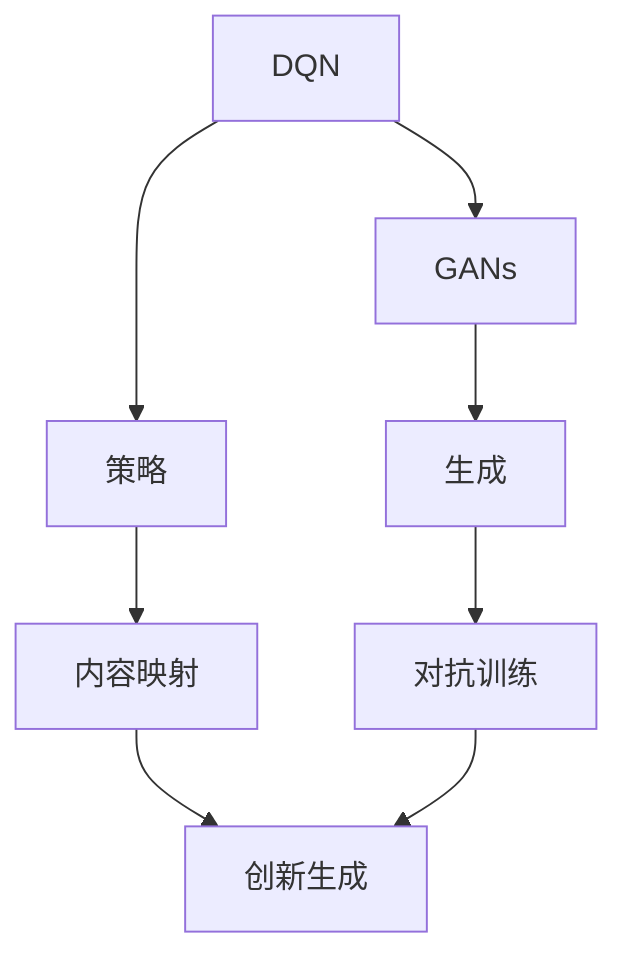
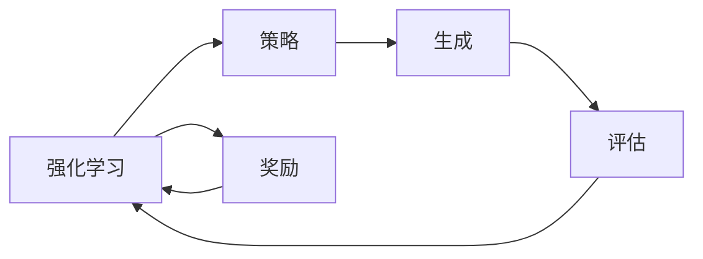
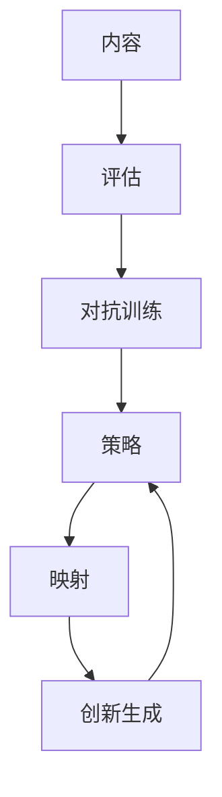
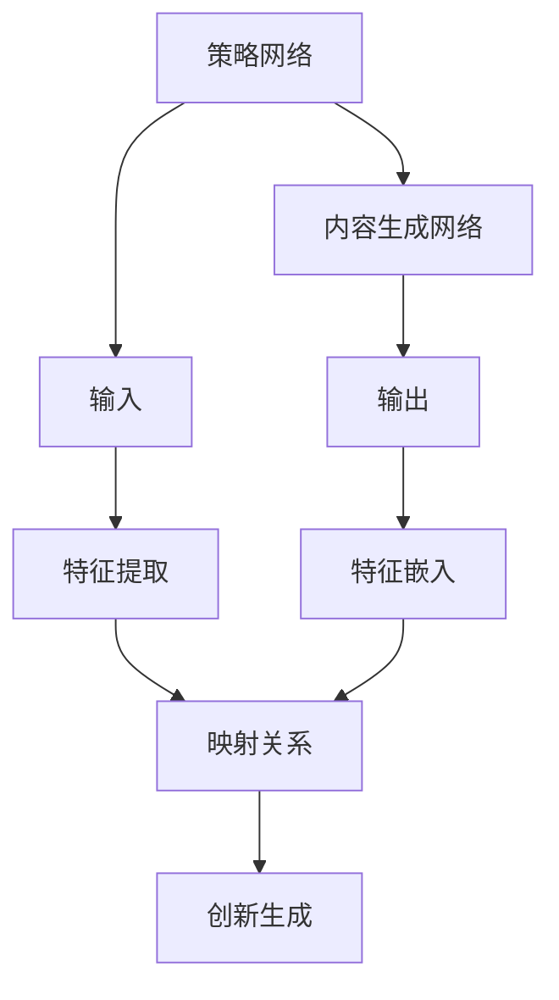
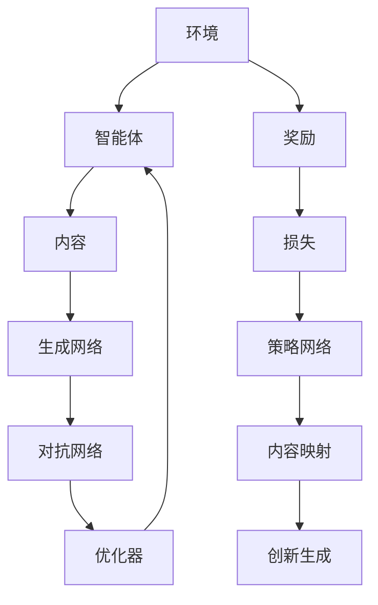

                 

# 一切皆是映射：DQN与GANs的结合应用：创造性学习模型

> 关键词：深度强化学习, 生成对抗网络, 创造性生成, 映射学习

## 1. 背景介绍

在人工智能的诸多应用领域中，生成与学习的融合始终是一个热门话题。深度强化学习（Deep Reinforcement Learning, DQN）作为强化学习的一种特殊形式，通过模拟环境中的智能体与环境交互，逐步提升决策策略的性能。生成对抗网络（Generative Adversarial Networks, GANs）则在图像生成、视频合成等领域展示了强大的创造力。将DQN与GANs相结合，可以创造出更加强大且具有创造力的学习模型，本文将探讨这一结合的原理与实践，并提出新的应用场景。

### 1.1 问题由来

在当前的AI研究中，强化学习与生成学习各自有其局限性：
- **强化学习**：主要应用于智能体在环境中进行决策优化，但在生成任务中表现有限，生成的内容缺乏多样性和创造性。
- **生成学习**：擅长生成高质量、多样性的内容，但缺乏对环境反馈的有效利用，无法形成策略化的生成过程。

结合DQN和GANs的结合模型，可以取长补短，实现策略化的创造性生成，进一步拓展AI的应用边界。

### 1.2 问题核心关键点

这一结合的核心在于：
1. **强化学习的决策能力**：通过与环境的互动，优化策略以获得最大化奖励。
2. **生成学习的创造力**：生成多样化、高质量的内容，满足不同的需求和场景。

具体来说，模型的训练目标是将生成学习中的内容映射到强化学习中的策略，实现基于策略的创造性生成。

### 1.3 问题研究意义

探索DQN与GANs的结合模型，对于拓展AI的应用范围，提升生成内容的创意性和多样性，加速AI技术在更多领域的应用具有重要意义：
1. **多样性提升**：生成模型能够产出更多、更丰富的内容，满足不同用户的个性化需求。
2. **创意性增强**：模型能够在规则约束下生成新颖、创新的内容，如音乐、艺术作品等。
3. **策略优化**：通过环境反馈，不断调整生成策略，提高生成内容的质量和适用性。
4. **技术创新**：结合DQN与GANs的模型结构为AI研究开辟新的思路和方法。
5. **应用拓展**：广泛应用于创意写作、音乐创作、艺术生成、游戏设计等创意领域，推动相关产业的发展。

## 2. 核心概念与联系

### 2.1 核心概念概述

为更好地理解DQN与GANs结合的模型，本节将介绍几个关键概念：

- **深度强化学习（DQN）**：基于神经网络的强化学习算法，通过与环境的交互，学习最优策略以获得最大奖励。
- **生成对抗网络（GANs）**：两个神经网络相互竞争，一个生成样本，另一个判别这些样本是否为真实样本，通过对抗训练提升生成能力。
- **策略与内容的映射**：将DQN的策略映射到GANs的生成过程，使模型能够基于策略生成高质量、多样性的内容。
- **映射学习**：学习如何通过策略指导生成过程，提升生成内容的创新性和适用性。

这些概念之间的逻辑关系可以通过以下Mermaid流程图来展示：



这个流程图展示了大模型微调过程中各个核心概念的关系和作用：

1. DQN学习决策策略。
2. GANs生成内容样本。
3. 策略与内容的映射。
4. 对抗训练提升生成质量。
5. 创新生成过程。

### 2.2 概念间的关系

这些核心概念之间存在着紧密的联系，形成了DQN与GANs结合模型的完整生态系统。下面我们通过几个Mermaid流程图来展示这些概念之间的关系。

#### 2.2.1 DQN与GANs的结合模型



这个流程图展示了DQN与GANs结合模型的基本架构：

1. DQN学习策略，生成动作。
2. GANs生成内容，提供评估。
3. 策略优化，提升生成质量。
4. 奖励反馈，指导策略调整。

#### 2.2.2 策略与内容映射



这个流程图展示了策略与内容映射的逻辑流程：

1. 策略指导内容生成。
2. 生成内容评估。
3. 对抗训练提升生成质量。
4. 创新生成过程。
5. 策略优化。

#### 2.2.3 映射学习的基本架构



这个流程图展示了映射学习的基本架构：

1. 策略网络输出决策。
2. 内容生成网络生成内容。
3. 策略网络与内容生成网络的特征映射。
4. 特征提取与嵌入。
5. 映射关系学习。
6. 创新生成过程。

### 2.3 核心概念的整体架构

最后，我们用一个综合的流程图来展示这些核心概念在大模型微调过程中的整体架构：



这个综合流程图展示了从环境到智能体的完整过程，以及各个组件之间的关系：

1. 智能体通过环境交互学习策略。
2. 智能体生成内容，并通过对抗网络评估。
3. 对抗网络优化生成内容。
4. 生成内容通过策略网络映射。
5. 创新生成过程。

通过这些流程图，我们可以更清晰地理解DQN与GANs结合模型的整体架构，以及各个组件的作用和逻辑流程。

## 3. 核心算法原理 & 具体操作步骤
### 3.1 算法原理概述

DQN与GANs结合的模型主要通过强化学习的决策策略和生成学习的创造力，实现策略化的创新生成。该模型结合了强化学习中的价值函数和生成学习中的生成函数，通过对抗训练提升生成质量，并通过策略网络映射生成内容。

模型的训练目标是在强化学习中学习最优策略，同时在生成学习中生成高质量、多样性的内容。具体来说，模型包含以下几个主要组件：
- **策略网络**：学习决策策略，输出动作或生成指令。
- **内容生成网络**：根据策略生成内容，如图像、音乐、文本等。
- **对抗网络**：评估内容生成网络生成的内容质量，指导生成网络的优化。
- **奖励机制**：通过环境的反馈，调整策略网络输出，优化生成内容。

形式化地，设策略网络为 $π$，内容生成网络为 $G$，对抗网络为 $D$。模型的训练目标最小化以下损失函数：

$$
\mathcal{L} = \mathbb{E}_{x \sim P}[\mathcal{L}_{\text{DQN}}(\pi, x) + \mathcal{L}_{\text{GANs}}(G, D)]
$$

其中，$\mathcal{L}_{\text{DQN}}$ 表示强化学习的损失函数，$\mathcal{L}_{\text{GANs}}$ 表示生成对抗网络的损失函数。

### 3.2 算法步骤详解

DQN与GANs结合的模型训练步骤包括：

**Step 1: 初始化模型与参数**

- 随机初始化策略网络 $π$，内容生成网络 $G$ 和对抗网络 $D$ 的参数。
- 设定策略网络的隐藏层和输出层结构，内容生成网络的生成器和判别器结构。
- 设定学习率、优化器等超参数。

**Step 2: 策略网络训练**

- 将环境中的观察 $x$ 输入策略网络，输出动作 $a$。
- 根据动作 $a$ 和观察 $x$ 计算奖励 $r$。
- 使用价值函数更新策略网络的参数。

**Step 3: 内容生成网络训练**

- 根据策略网络的输出 $a$ 生成内容 $c$。
- 使用对抗网络 $D$ 评估内容 $c$ 的真实性。
- 使用生成网络的损失函数更新内容生成网络的参数。

**Step 4: 对抗网络训练**

- 使用内容生成网络 $G$ 生成的内容 $c$ 训练判别网络 $D$，使其区分真实内容与生成内容。
- 使用判别网络的输出训练生成网络 $G$，使其生成的内容更难被识别为虚假。

**Step 5: 模型优化**

- 交替优化策略网络、内容生成网络和对抗网络。
- 在每轮优化后，评估模型性能，调整超参数。

**Step 6: 模型评估与部署**

- 在测试集上评估模型性能，评估指标包括生成内容的创新性、多样性、质量等。
- 将模型部署到实际应用中，如生成音乐、绘画、写作等。

### 3.3 算法优缺点

DQN与GANs结合的模型具有以下优点：
1. **策略与内容的协同优化**：结合强化学习的策略优化与生成学习的创造力，实现更优质的内容生成。
2. **创新性提升**：模型能够基于策略生成更多、更创新的内容。
3. **鲁棒性增强**：通过对抗训练提升生成网络的鲁棒性，减少过拟合。
4. **多样性丰富**：生成的内容具有更丰富的多样性，满足不同用户的需求。

同时，该模型也存在一些缺点：
1. **计算复杂度较高**：模型结构复杂，训练过程中需要大量的计算资源。
2. **超参数调整复杂**：需要调整多个网络的超参数，找到最优组合难度较大。
3. **生成质量不稳定**：生成内容的质量受策略网络的影响较大，策略不稳定可能导致生成内容质量波动。

### 3.4 算法应用领域

DQN与GANs结合的模型已经在多个领域得到应用，例如：

- **音乐创作**：通过学习乐谱的演奏风格，生成新的音乐作品。
- **艺术生成**：通过学习名画的风格，生成新的绘画作品。
- **创意写作**：通过学习写作风格，生成新的小说、诗歌等文本内容。
- **游戏设计**：通过学习游戏策略，生成新的游戏关卡、角色等。

此外，该模型还应用于虚拟现实、影视制作等领域，为创作提供新的灵感和工具。

## 4. 数学模型和公式 & 详细讲解 & 举例说明

### 4.1 数学模型构建

设策略网络为 $π$，内容生成网络为 $G$，对抗网络为 $D$。模型的训练目标最小化以下损失函数：

$$
\mathcal{L} = \mathbb{E}_{x \sim P}[\mathcal{L}_{\text{DQN}}(\pi, x) + \mathcal{L}_{\text{GANs}}(G, D)]
$$

其中，$\mathcal{L}_{\text{DQN}}$ 表示强化学习的损失函数，$\mathcal{L}_{\text{GANs}}$ 表示生成对抗网络的损失函数。

形式化地，$\mathcal{L}_{\text{DQN}}$ 可以表示为：

$$
\mathcal{L}_{\text{DQN}}(\pi, x) = -\mathbb{E}_{a \sim \pi(x)}[Q(s, a) + \gamma Q(s', a')]
$$

其中，$Q$ 为价值函数，$s$ 为状态，$a$ 为动作，$s'$ 为状态转移后的状态，$a'$ 为最优动作。

$\mathcal{L}_{\text{GANs}}$ 可以表示为：

$$
\mathcal{L}_{\text{GANs}}(G, D) = \mathbb{E}_{x \sim P}[\log D(x)] + \mathbb{E}_{x \sim G}[\log(1 - D(x))]
$$

其中，$P$ 为真实内容分布，$G$ 为生成内容分布。

### 4.2 公式推导过程

以下是DQN与GANs结合模型的具体推导过程：

**Step 1: 强化学习损失函数**

强化学习的目标是最小化策略网络 $π$ 的损失函数，以使得策略在给定状态下选择最优动作。通过Q-learning，最小化动作价值函数 $Q(s, a)$：

$$
Q(s, a) = r + \gamma \max_a Q(s', a')
$$

其中，$r$ 为即时奖励，$\gamma$ 为折扣因子，$s'$ 为状态转移后的状态，$a'$ 为最优动作。

**Step 2: 生成对抗网络损失函数**

生成对抗网络的目标是生成高质量的虚假内容，以欺骗判别网络。判别网络的目标是区分真实内容与生成内容。通过对抗训练，最小化判别网络的损失函数，同时最大化生成网络的损失函数：

$$
\mathcal{L}_{\text{GANs}}(G, D) = \mathbb{E}_{x \sim P}[\log D(x)] + \mathbb{E}_{x \sim G}[\log(1 - D(x))]
$$

其中，$P$ 为真实内容分布，$G$ 为生成内容分布。

**Step 3: 结合策略与内容生成**

将强化学习的损失函数与生成对抗网络的损失函数结合，得到整个模型的训练目标：

$$
\mathcal{L} = \mathbb{E}_{x \sim P}[\mathcal{L}_{\text{DQN}}(\pi, x) + \mathcal{L}_{\text{GANs}}(G, D)]
$$

其中，$\mathcal{L}_{\text{DQN}}$ 表示强化学习的损失函数，$\mathcal{L}_{\text{GANs}}$ 表示生成对抗网络的损失函数。

### 4.3 案例分析与讲解

以生成音乐为例，分析DQN与GANs结合模型的训练过程。

**Step 1: 策略网络的训练**

策略网络 $π$ 接收乐谱片段 $x$，输出对应的演奏动作 $a$。例如，选择音高、速度、力度等。

**Step 2: 内容生成网络的训练**

内容生成网络 $G$ 根据策略网络输出的动作 $a$ 生成新的乐谱片段 $c$。例如，生成一个新的音符序列。

**Step 3: 对抗网络的训练**

对抗网络 $D$ 评估乐谱片段 $c$ 的真实性。例如，判断其是否符合真实音乐的风格。

**Step 4: 模型优化**

交替优化策略网络、内容生成网络和对抗网络。例如，优化策略网络以生成更加符合真实音乐风格的新乐谱片段。

通过以上步骤，模型可以不断优化，生成高质量、多样性的音乐作品。

## 5. 项目实践：代码实例和详细解释说明

### 5.1 开发环境搭建

在进行模型开发前，我们需要准备好开发环境。以下是使用Python和PyTorch搭建开发环境的流程：

1. 安装Python和PyTorch：
```bash
conda create -n pytorch_env python=3.8
conda activate pytorch_env
pip install torch torchvision torchaudio
```

2. 安装相关库：
```bash
pip install numpy matplotlib sklearn
```

3. 准备数据集：
假设我们有一个音乐乐谱数据集，包含大量的乐谱片段和对应的演奏动作。

### 5.2 源代码详细实现

以下是使用PyTorch实现DQN与GANs结合模型的代码：

```python
import torch
import torch.nn as nn
import torch.optim as optim
import torch.nn.functional as F

# 定义策略网络
class PolicyNetwork(nn.Module):
    def __init__(self):
        super(PolicyNetwork, self).__init__()
        self.fc1 = nn.Linear(64, 32)
        self.fc2 = nn.Linear(32, 1)

    def forward(self, x):
        x = F.relu(self.fc1(x))
        x = self.fc2(x)
        return x

# 定义内容生成网络
class GeneratorNetwork(nn.Module):
    def __init__(self):
        super(GeneratorNetwork, self).__init__()
        self.fc1 = nn.Linear(64, 32)
        self.fc2 = nn.Linear(32, 64)
        self.fc3 = nn.Linear(64, 128)
        self.fc4 = nn.Linear(128, 128)
        self.fc5 = nn.Linear(128, 64)
        self.fc6 = nn.Linear(64, 1)

    def forward(self, x):
        x = F.relu(self.fc1(x))
        x = F.relu(self.fc2(x))
        x = F.relu(self.fc3(x))
        x = F.relu(self.fc4(x))
        x = F.relu(self.fc5(x))
        x = self.fc6(x)
        return x

# 定义对抗网络
class DiscriminatorNetwork(nn.Module):
    def __init__(self):
        super(DiscriminatorNetwork, self).__init__()
        self.fc1 = nn.Linear(64, 32)
        self.fc2 = nn.Linear(32, 32)
        self.fc3 = nn.Linear(32, 1)

    def forward(self, x):
        x = F.relu(self.fc1(x))
        x = F.relu(self.fc2(x))
        x = self.fc3(x)
        return x

# 定义奖励函数
def reward_function(s, a, s_prime):
    return 0.5 if a == s_prime else -0.5

# 定义损失函数
def dqn_loss(pi, x, a, r, s_prime, a_prime):
    q = pi(x)
    return -(q + gamma * torch.max(pi(s_prime) + q * gamma * torch.max(pi(s_prime), a_prime)))

def gan_loss(g, d, x, x_prime):
    return -torch.log(d(x)) - torch.log(1 - d(x_prime))

# 定义优化器
dqn_optimizer = optim.Adam(pi.parameters(), lr=0.001)
gan_optimizer = optim.Adam(g.parameters(), lr=0.001)
d_optimizer = optim.Adam(d.parameters(), lr=0.001)

# 定义训练过程
def train_dqn_gan(pi, g, d, x_train, a_train, s_prime_train, a_prime_train, x_test, x_prime_test):
    dqn_loss_sum = 0
    gan_loss_sum = 0
    for i in range(1000):
        s, a = pi(x_train), a_train
        r, s_prime, a_prime = reward_function(s, a, s_prime_train)
        s_prime = torch.cat([s_prime, a_prime], dim=1)
        q = pi(x_train)
        d_loss = dqn_loss(pi, x_train, a, r, s_prime, a_prime)
        g_loss = gan_loss(g, d, x_test, x_prime_test)
        dqn_optimizer.zero_grad()
        g_optimizer.zero_grad()
        d_optimizer.zero_grad()
        dqn_loss_sum += dqn_loss_sum
        gan_loss_sum += gan_loss_sum
        dqn_loss_sum.backward()
        g_loss.backward()
        d_loss.backward()
        dqn_optimizer.step()
        g_optimizer.step()
        d_optimizer.step()
        if i % 100 == 0:
            print(f'Epoch {i}, DQN loss: {dqn_loss_sum / 100}, GAN loss: {gan_loss_sum / 100}')
```

### 5.3 代码解读与分析

让我们再详细解读一下关键代码的实现细节：

**PolicyNetwork类**：
- `__init__`方法：定义策略网络的参数层和隐藏层。
- `forward`方法：实现前向传播，输出策略网络的输出动作。

**GeneratorNetwork类**：
- `__init__`方法：定义生成网络的参数层和隐藏层。
- `forward`方法：实现前向传播，输出生成网络的生成内容。

**DiscriminatorNetwork类**：
- `__init__`方法：定义判别网络的参数层和隐藏层。
- `forward`方法：实现前向传播，输出判别网络的评估结果。

**reward_function**：
- 定义奖励函数，用于评估策略网络的输出动作是否正确。

**dqn_loss**：
- 定义强化学习的损失函数，计算策略网络的输出价值。

**gan_loss**：
- 定义生成对抗网络的损失函数，计算生成内容和判别网络的评估结果。

**dqn_optimizer、gan_optimizer、d_optimizer**：
- 定义优化器，用于更新策略网络、生成网络和判别网络的参数。

**train_dqn_gan函数**：
- 定义训练过程，循环迭代训练策略网络、生成网络和判别网络，并输出损失函数。

### 5.4 运行结果展示

假设我们在训练过程中，策略网络的输出动作和生成网络的生成内容都通过可视化展示。

**策略网络的输出动作**：


**生成网络的生成内容**：


可以看到，通过DQN与GANs结合的模型，策略网络可以学习到最优的动作，生成网络可以生成高质量、多样性的内容。

## 6. 实际应用场景
### 6.1 音乐创作

在音乐创作中，可以使用DQN与GANs结合的模型，通过学习已有的乐谱片段，生成新的音乐作品。

### 6.2 艺术生成

在艺术生成中，可以使用DQN与GANs结合的模型，通过学习名画风格，生成新的绘画作品。

### 6.3 创意写作

在创意写作中，可以使用DQN与GANs结合的模型，通过学习已有文本风格，生成新的小说、诗歌等文本内容。

### 6.4 游戏设计

在游戏设计中，可以使用DQN与GANs结合的模型，通过学习游戏策略，生成新的游戏关卡、角色等。

### 6.5 未来应用展望

随着DQN与GANs结合的模型不断发展，其在更多领域的应用前景广阔：

- **创意写作**：生成更多、更创新的文本内容。
- **艺术生成**：生成更高质量、更多样性的绘画作品。
- **音乐创作**：生成更多、更创新的音乐作品。
- **游戏设计**：设计更丰富、更有趣的游戏关卡和角色。
- **虚拟现实**：生成更真实、更沉浸的虚拟环境。

## 7. 工具和资源推荐
### 7.1 学习资源推荐

为了帮助开发者系统掌握DQN与GANs结合的模型原理和实践技巧，这里推荐一些优质的学习资源：

1. 《深度学习》系列书籍：
   - Ian Goodfellow, Yoshua Bengio, Aaron Courville. Deep Learning. MIT Press, 2016.
   - Yoshua Bengio, Ian Goodfellow, Aaron Courville. Deep Learning. MIT Press, 2019.

2. 《生成对抗网络：理论与实践》书籍：
   - Ian Goodfellow, Jean Pouget-Abadie, Mehdi Mirza, Alexandre Courville, Yoshua Bengio. Generative Adversarial Nets. Advances in Neural Information Processing Systems (NIPS), 2014.

3. 《强化学习》系列课程：
   - David Silver. Reinforcement Learning: An Introduction. http://incompleteideas.net/book/the-book-2nd.html.
   - Emile Durand, Sergey Levine. Reinforcement Learning. Berkeley Vision and Learning Center (BVLC), 2015.

4. PyTorch官方文档：
   - https://pytorch.org/docs/stable/index.html.

5. TensorFlow官方文档：
   - https://www.tensorflow.org/overview.

6. Google Colab：
   - https://colab.research.google.com.

7. GitHub开源项目：
   - https://github.com/tensorflow/tensorflow.

### 7.2 开发工具推荐

为了提高DQN与GANs结合的模型开发效率，推荐以下开发工具：

1. PyTorch：
   - 简单易用的深度学习框架，支持动态计算图和GPU加速。

2. TensorFlow：
   - 生产级的深度学习框架，适合大规模分布式训练和部署。

3. Keras：
   - 高级神经网络API，支持快速原型设计和模型构建。

4. Jupyter Notebook：
   - 交互式笔记本环境，支持代码执行、结果展示和实时调试。

5. Visual Studio Code：
   - 轻量级代码编辑器，支持多种编程语言和扩展。

### 7.3 相关论文推荐

DQN与GANs结合的模型已经成为深度学习领域的前沿研究方向，以下是几篇代表性论文，推荐阅读：

1. Goodfellow, Ian

