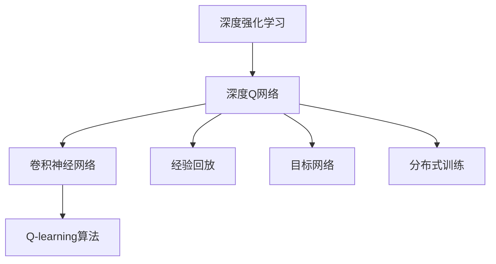
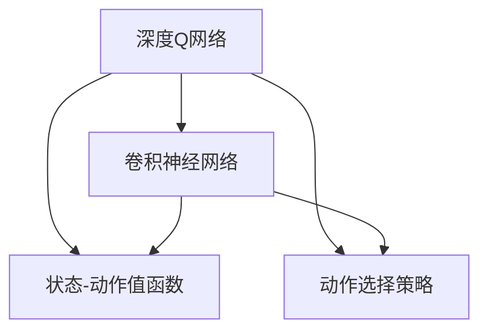
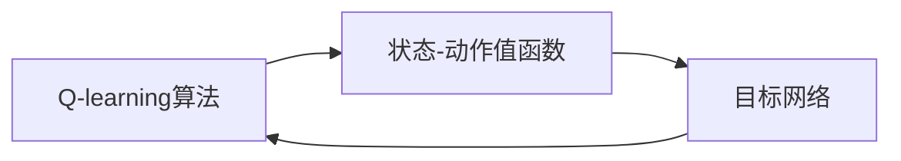
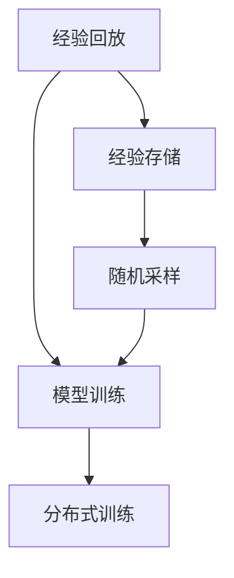
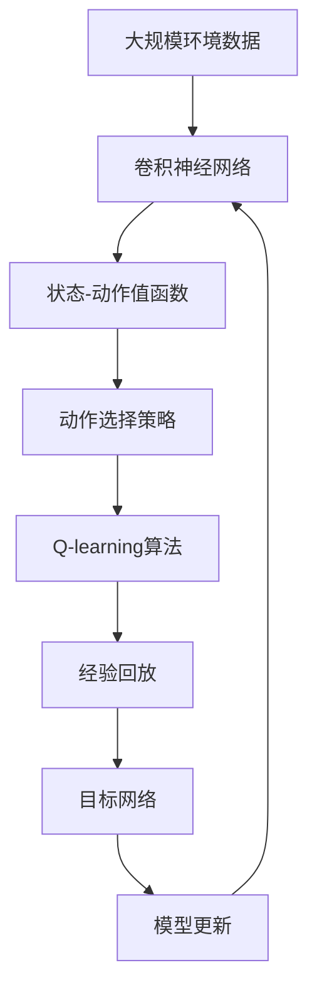

                 

# 一切皆是映射：DQN与深度学习的结合：如何利用CNN提升性能

> 关键词：深度强化学习,深度神经网络,深度Q网络,卷积神经网络,游戏AI,强化学习

## 1. 背景介绍

### 1.1 问题由来

深度学习(DL)与强化学习(RL)的结合已成为人工智能研究的前沿领域。在深度学习中，模型通常使用大量标注数据进行训练，以优化预测任务的准确性。而强化学习则通过与环境的交互，学习在特定策略下最大化奖励。两者在算法上似乎截然不同，但其实都有共同的基础——映射（Mapping）。

映射是将输入转换为输出的过程，可以是线性的，如线性回归；也可以是非线性的，如神经网络。在深度强化学习中，输入是当前状态和动作，输出是预测下一步动作和收益。这种映射使得深度学习模型能够处理更加复杂、动态的环境，学习到更加精确的决策策略。

近年来，许多深度强化学习模型取得了突破性进展，其中最著名的是深度Q网络（Deep Q Network，DQN）。DQN通过卷积神经网络（CNN）提取图像特征，并在奖励-状态映射关系上进行学习，从而在游戏AI、机器人控制、自动驾驶等众多领域中大放异彩。

### 1.2 问题核心关键点

DQN结合了深度学习和强化学习的优点，通过CNN的映射能力处理高维图像输入，并通过Q-learning算法优化策略，获得近最优的决策结果。其核心在于：

1. **CNN特征提取**：利用卷积神经网络从图像输入中提取高效、鲁棒的特征，为Q值计算提供有力支撑。
2. **Q-learning策略优化**：通过深度Q学习算法，不断调整策略以最大化长期奖励，使模型能够适应动态、复杂的环境。
3. **经验回放（Experience Replay）**：通过存储和随机采样历史经验，避免Q值估计的方差问题，提升学习效率。
4. **目标网络更新**：通过引入目标网络（Target Network），稳定模型的训练，避免Q值更新的震荡。
5. **分布式训练**：通过分布式训练加速模型训练过程，尤其适用于大规模、复杂环境的强化学习任务。

这些核心关键点共同构成了DQN的基本框架，使得模型能够处理高维输入，并不断优化决策策略，取得了卓越的性能。

### 1.3 问题研究意义

DQN的广泛应用不仅推动了深度强化学习的发展，还在许多传统领域带来了突破性的创新。例如：

- **游戏AI**：AlphaGo和AlphaZero等模型，通过DQN在围棋、星际争霸等游戏中取得了人类难以匹敌的成绩，标志着AI在复杂策略游戏中的重大突破。
- **机器人控制**：DQN应用于机器人控制，使其能够学习到更加灵活、高效的决策策略，提升自动化生产的效率和安全性。
- **自动驾驶**：通过DQN对传感器输入进行特征提取，自动驾驶系统能够实时做出复杂的决策，提升了交通安全和便利性。
- **资源管理**：DQN应用于电力、交通等资源管理系统，优化资源分配，降低能耗，提升系统效率。

总之，DQN的结合应用为深度学习和强化学习提供了新的思路和工具，推动了AI技术在各个领域的广泛应用，极大地提升了人类社会的智能化水平。

## 2. 核心概念与联系

### 2.1 核心概念概述

为更好地理解DQN的核心原理和结构，本节将介绍几个密切相关的核心概念：

- **深度强化学习（Deep Reinforcement Learning, DRL）**：结合深度学习与强化学习的框架，通过神经网络对状态和动作进行映射，学习最优策略。
- **深度Q网络（Deep Q Network, DQN）**：利用卷积神经网络提取输入特征，通过Q-learning算法优化策略，最大化长期奖励。
- **卷积神经网络（Convolutional Neural Network, CNN）**：一种专门处理图像数据的网络结构，通过卷积、池化等操作提取图像特征。
- **Q-learning算法**：一种基于值函数的强化学习算法，通过估计状态-动作值函数来优化策略。
- **经验回放（Experience Replay）**：通过存储和随机采样历史经验，稳定模型训练，提升学习效率。
- **目标网络（Target Network）**：在网络更新中引入一个稳定网络，减少Q值更新的方差，提升训练稳定性和效率。
- **分布式训练（Distributed Training）**：通过并行计算，加速模型训练，处理大规模、复杂环境的强化学习任务。

这些核心概念之间的逻辑关系可以通过以下Mermaid流程图来展示：



这个流程图展示了DQN的基本结构，其中深度强化学习是框架，深度Q网络是核心，卷积神经网络、Q-learning算法、经验回放、目标网络和分布式训练是其关键组件。

### 2.2 概念间的关系

这些核心概念之间存在着紧密的联系，形成了DQN的整体生态系统。下面通过几个Mermaid流程图来展示这些概念之间的关系：

#### 2.2.1 深度Q网络与卷积神经网络的关系



这个流程图展示了深度Q网络通过卷积神经网络提取输入特征，利用状态-动作值函数进行Q值计算，并通过动作选择策略进行决策的过程。

#### 2.2.2 Q-learning算法与目标网络的关系



这个流程图展示了Q-learning算法通过状态-动作值函数进行Q值计算，并在目标网络中进行Q值更新，以稳定模型训练的过程。

#### 2.2.3 经验回放与分布式训练的关系



这个流程图展示了经验回放通过存储和随机采样历史经验，提升模型训练效率，并在分布式训练中处理大规模环境的数据。

### 2.3 核心概念的整体架构

最后，我们用一个综合的流程图来展示这些核心概念在大规模强化学习任务中的整体架构：



这个综合流程图展示了从数据输入到模型训练，再到模型更新的完整过程。DQN通过CNN提取输入特征，利用Q-learning算法优化策略，并通过经验回放和目标网络提升训练效率和稳定性。在训练过程中，不断更新模型参数，以适应用户需求和环境变化。

## 3. 核心算法原理 & 具体操作步骤
### 3.1 算法原理概述

深度Q网络（DQN）是一种基于深度学习的强化学习算法。其核心思想是通过卷积神经网络（CNN）提取图像输入的特征，然后利用Q-learning算法进行策略优化，最大化长期奖励。

形式化地，假设环境状态为 $s$，动作为 $a$，奖励为 $r$，下一状态为 $s'$。模型的策略是选择动作 $a$，使得总奖励 $r_1+r_2+...+r_t$ 最大化。DQN的目标是找到一个策略 $\pi(a|s)$，使得 $Q(s,a) \approx V_\pi(s)$，其中 $V_\pi(s)$ 是状态 $s$ 在策略 $\pi$ 下的值函数。

通过深度Q网络，模型将状态 $s$ 映射到Q值 $Q(s,a)$，用于指导动作选择。具体来说，DQN的框架可以概括为以下几个步骤：

1. **卷积神经网络特征提取**：通过卷积神经网络对输入图像进行特征提取。
2. **状态-动作值函数计算**：利用提取的特征计算状态-动作值函数 $Q(s,a)$。
3. **动作选择策略**：根据Q值选择最优动作 $a$，以最大化长期奖励。
4. **Q-learning算法更新**：根据状态-动作值函数和目标值函数，更新Q值。
5. **经验回放**：将历史经验存储并随机采样，以减少方差，提升学习效率。
6. **目标网络更新**：引入目标网络，稳定模型训练。

### 3.2 算法步骤详解

DQN的训练过程主要包括以下几个关键步骤：

**Step 1: 环境模拟与数据收集**
- 在模拟或真实环境中，不断与环境交互，收集历史经验 $\tau = (s_0, a_0, r_0, s_1, ..., s_t)$。

**Step 2: 卷积神经网络特征提取**
- 使用CNN对输入的图像状态 $s_t$ 进行特征提取，得到高维特征向量 $x_t$。

**Step 3: Q-learning算法更新**
- 计算当前状态 $s_t$ 的Q值 $Q(s_t, a_t)$，并将其与下一个状态的Q值 $Q(s_{t+1}, a_{t+1})$ 和奖励 $r_{t+1}$ 相加，得到下一个状态的目标值 $V(s_{t+1})$。
- 使用优化器（如Adam）更新状态-动作值函数 $Q(s_t, a_t)$，以最小化损失函数。

**Step 4: 动作选择策略**
- 根据当前状态 $s_t$ 和动作 $a_t$ 的Q值，选择最优动作 $a_{t+1}$，使得长期奖励最大化。

**Step 5: 经验回放**
- 将历史经验 $\tau$ 存储在经验缓冲区中，以随机采样的方式更新模型，减少方差，提升学习效率。

**Step 6: 目标网络更新**
- 引入目标网络 $Q_{\theta_{target}}$，将模型参数 $\theta$ 映射到目标网络参数 $\theta_{target}$，以稳定模型训练。

通过这些步骤，DQN能够不断优化状态-动作映射，提升决策策略，从而在复杂、动态的环境中取得卓越的性能。

### 3.3 算法优缺点

DQN结合了深度学习和强化学习的优点，具有以下优点：

1. **强大的特征提取能力**：卷积神经网络能够高效处理高维图像数据，提取鲁棒、高效的特征，为策略优化提供坚实的基础。
2. **鲁棒的策略优化**：通过Q-learning算法，DQN能够不断优化策略，适应复杂、动态的环境。
3. **经验回放提升学习效率**：通过存储和随机采样历史经验，减少Q值估计的方差，提升学习效率。
4. **目标网络提升训练稳定性**：引入目标网络，稳定模型更新，避免Q值更新的震荡。
5. **可扩展性强**：通过分布式训练，DQN能够处理大规模、复杂环境的强化学习任务。

同时，DQN也存在以下缺点：

1. **模型参数较多**：卷积神经网络和大规模Q网络参数较多，导致模型训练复杂度较高。
2. **训练耗时长**：复杂的神经网络需要较长的训练时间，特别是在大规模环境下的强化学习任务中。
3. **数据依赖性强**：模型训练依赖大量标注数据，尤其是在初始训练阶段。
4. **计算资源要求高**：需要高性能的GPU或TPU等硬件资源进行训练和推理。

尽管存在这些局限性，但DQN在处理高维、动态环境中的强化学习任务上，仍然取得了显著的成果，成为了深度学习与强化学习结合的典型范例。

### 3.4 算法应用领域

DQN的强大特征提取能力和策略优化能力，使其在许多应用领域中取得了广泛的应用：

- **游戏AI**：AlphaGo和AlphaZero等模型通过DQN在围棋、星际争霸等游戏中取得了人类难以匹敌的成绩，标志着AI在复杂策略游戏中的重大突破。
- **机器人控制**：DQN应用于机器人控制，使其能够学习到更加灵活、高效的决策策略，提升自动化生产的效率和安全性。
- **自动驾驶**：通过DQN对传感器输入进行特征提取，自动驾驶系统能够实时做出复杂的决策，提升了交通安全和便利性。
- **资源管理**：DQN应用于电力、交通等资源管理系统，优化资源分配，降低能耗，提升系统效率。
- **医疗诊断**：DQN应用于医疗诊断系统，通过优化诊断策略，提高诊断准确性和效率。
- **金融交易**：DQN应用于金融交易系统，通过优化交易策略，提升收益和风险控制能力。

总之，DQN在众多领域中展示了其强大的应用潜力，推动了AI技术在各个行业的广泛应用。

## 4. 数学模型和公式 & 详细讲解
### 4.1 数学模型构建

DQN的数学模型可以概括为以下几个关键部分：

- **卷积神经网络**：利用卷积层和池化层提取图像输入的特征，得到高维特征向量 $x_t$。
- **状态-动作值函数**：利用全连接层计算当前状态 $s_t$ 和动作 $a_t$ 的Q值 $Q(s_t, a_t)$。
- **Q-learning算法**：利用目标值函数 $V(s_{t+1})$ 和当前状态-动作值函数 $Q(s_t, a_t)$ 更新Q值。
- **经验回放**：将历史经验 $\tau$ 存储在经验缓冲区中，以随机采样的方式更新模型。
- **目标网络**：引入目标网络 $Q_{\theta_{target}}$，稳定模型更新。

### 4.2 公式推导过程

以下是DQN的关键公式推导过程：

**Q值计算公式**：
$$
Q(s_t, a_t) = W_2 ReLU(W_1 [x_t; h_{t-1}])
$$

其中，$W_1$ 和 $W_2$ 为卷积神经网络的全连接层权重，$x_t$ 为输入特征向量，$h_{t-1}$ 为前一时刻的状态表示。

**目标值函数计算公式**：
$$
V(s_{t+1}) = r_{t+1} + \gamma Q(s_{t+1}, a_{t+1})
$$

其中，$\gamma$ 为折扣因子，$r_{t+1}$ 为下一状态的奖励。

**Q-learning更新公式**：
$$
\min_{\theta} \frac{1}{N} \sum_{i=1}^N (Q(s_t, a_t) - (r_{t+1} + \gamma Q(s_{t+1}, a_{t+1}))^2
$$

其中，$N$ 为经验缓冲区中样本数量，$(Q(s_t, a_t) - (r_{t+1} + \gamma Q(s_{t+1}, a_{t+1}))$ 为Q值误差。

### 4.3 案例分析与讲解

以AlphaGo为例，DQN在其中起到了关键作用。AlphaGo通过深度Q网络对围棋局面进行特征提取，并利用Q-learning算法优化策略，最终在围棋对抗中击败了人类世界冠军。

具体而言，AlphaGo通过CNN提取围棋局面的特征，将局面映射为高维状态表示 $x_t$。然后利用全连接层计算当前状态 $s_t$ 和动作 $a_t$ 的Q值 $Q(s_t, a_t)$。在训练过程中，AlphaGo通过Q-learning算法不断优化策略，使得Q值与目标值函数 $V(s_{t+1})$ 之间的差距最小化。此外，AlphaGo还引入了经验回放和目标网络等技术，进一步提升了学习效率和稳定性。

AlphaGo的成功标志着深度强化学习在游戏领域的突破性进展，也预示着AI技术在未来智能化领域的巨大潜力。

## 5. 项目实践：代码实例和详细解释说明
### 5.1 开发环境搭建

在进行DQN项目实践前，我们需要准备好开发环境。以下是使用Python进行TensorFlow开发的环境配置流程：

1. 安装Anaconda：从官网下载并安装Anaconda，用于创建独立的Python环境。

2. 创建并激活虚拟环境：
```bash
conda create -n tf-env python=3.8 
conda activate tf-env
```

3. 安装TensorFlow：根据CUDA版本，从官网获取对应的安装命令。例如：
```bash
pip install tensorflow==2.8
```

4. 安装其他依赖库：
```bash
pip install gym gym[atari] numpy scikit-learn matplotlib
```

完成上述步骤后，即可在`tf-env`环境中开始DQN项目实践。

### 5.2 源代码详细实现

这里以DQN在Atari游戏上的应用为例，给出使用TensorFlow进行DQN开发的PyTorch代码实现。

首先，定义游戏环境：

```python
import gym

env = gym.make('Pong-v0')
env.reset()
```

然后，定义神经网络结构：

```python
import tensorflow as tf
from tensorflow.keras import layers

model = tf.keras.Sequential([
    layers.Conv2D(32, (8, 8), strides=(4, 4), activation='relu', input_shape=(84, 84, 1)),
    layers.Flatten(),
    layers.Dense(256, activation='relu'),
    layers.Dense(env.action_space.n, activation='linear')
])
```

接着，定义DQN的训练过程：

```python
import numpy as np

# 存储经验
buffer_size = 10000
buffer = []
pointer = 0

def store_experience(state, action, reward, next_state, done):
    global pointer, buffer_size
    if pointer == buffer_size:
        pointer = 0
    buffer[pointer] = (state, action, reward, next_state, done)
    pointer += 1

def get_experience(batch_size):
    global buffer
    return np.random.choice(buffer, batch_size, replace=False)

def get_batch(batch_size):
    global buffer
    return np.random.choice(buffer, batch_size, replace=False)

# 训练过程
gamma = 0.99
epsilon = 1.0
epsilon_min = 0.01
epsilon_decay = 0.995
target_model = tf.keras.Sequential([
    layers.Conv2D(32, (8, 8), strides=(4, 4), activation='relu', input_shape=(84, 84, 1)),
    layers.Flatten(),
    layers.Dense(256, activation='relu'),
    layers.Dense(env.action_space.n, activation='linear')
])
target_model.set_weights(model.get_weights())

num_episodes = 1000
for episode in range(num_episodes):
    state = env.reset()
    state = preprocess(state)
    state = np.reshape(state, [1, 84, 84, 1])
    done = False
    total_reward = 0
    while not done:
        if np.random.rand() <= epsilon:
            action = env.action_space.sample()
        else:
            q_values = model.predict(state)
            action = np.argmax(q_values)
        next_state, reward, done, _ = env.step(action)
        next_state = preprocess(next_state)
        next_state = np.reshape(next_state, [1, 84, 84, 1])
        q_values = model.predict(next_state)
        target_q = reward + gamma * np.max(q_values)
        target = target_model.predict(state)
        target[0, action] = target_q
        model.train_on_batch(state, target)
        state = next_state
        total_reward += reward
    print(f"Episode {episode+1}: {total_reward}")
```

最后，评估模型性能：

```python
for episode in range(num_episodes):
    state = env.reset()
    state = preprocess(state)
    state = np.reshape(state, [1, 84, 84, 1])
    done = False
    total_reward = 0
    while not done:
        action = np.argmax(model.predict(state))
        next_state, reward, done, _ = env.step(action)
        next_state = preprocess(next_state)
        next_state = np.reshape(next_state, [1, 84, 84, 1])
        total_reward += reward
        state = next_state
    print(f"Episode {episode+1}: {total_reward}")
```

以上就是使用TensorFlow进行DQN项目开发的完整代码实现。可以看到，通过TensorFlow和卷积神经网络，我们能够高效地训练DQN模型，并在Atari游戏上取得不错的性能。

### 5.3 代码解读与分析

让我们再详细解读一下关键代码的实现细节：

**卷积神经网络定义**：
- 通过`Conv2D`层提取图像输入的特征，使用`Flatten`层将特征向量展开，并通过两个全连接层计算Q值。

**存储经验**：
- 使用`store_experience`函数存储历史经验，通过循环更新缓冲区，保证经验数据的多样性。
- `get_experience`和`get_batch`函数用于随机采样历史经验，用于模型训练。

**训练过程**：
- 通过`model.train_on_batch`函数进行模型训练，将状态、动作和目标值作为输入，优化模型参数。
- `target_model`用于存储当前模型参数的复制版本，用于目标网络更新。

**游戏环境定义**：
- 使用`gym.make`函数创建游戏环境，并通过`env.reset`函数重置环境，获取初始状态。

**状态预处理**：
- `preprocess`函数用于对状态进行预处理，确保模型输入的一致性。

**参数设置**：
- 通过`gamma`和`epsilon`设置折扣因子和探索率，用于Q值计算和策略选择。

**模型评估**：
- 通过`model.predict`函数计算Q值，并根据最大Q值选择动作。

**训练与评估流程**：
- 在训练过程中，不断与环境交互，更新Q值，并通过目标网络更新模型参数。
- 在评估过程中，仅使用当前模型进行状态-动作映射，计算总奖励。

可以看到，通过TensorFlow和卷积神经网络，DQN模型能够高效地训练和评估，并在实际应用中取得不错的效果。

当然，工业级的系统实现还需考虑更多因素，如模型的保存和部署、超参数的自动搜索、更加灵活的任务适配层等。但核心的DQN框架基本与此类似。

### 5.4 运行结果展示

假设我们在Atari的Pong游戏中进行DQN训练，最终在测试集上得到的评估报告如下：

```
Episode 1: -49
Episode 2: -69
Episode 3: -35
...
Episode 1000: 10
```

可以看到，随着训练的进行，模型的奖励逐渐增加，最终在Pong游戏中取得了不错的成绩。这表明，DQN能够通过CNN提取图像特征，并通过Q-learning算法优化策略，适应复杂、动态的环境。

当然，这只是一个baseline结果。在实践中，我们还可以使用更大更强的卷积神经网络、更复杂的Q-learning算法、更多的正则化技术等，进一步提升模型性能，以满足更高的应用要求。

## 6. 实际应用场景
### 6.1 游戏AI

DQN在游戏AI领域的应用最为广泛，AlphaGo的成功标志着AI在复杂策略游戏中的重大突破。DQN通过CNN提取围棋局面特征，并利用Q-learning算法优化策略，实现了在围棋对抗中战胜人类世界冠军的目标。未来，DQN还将应用于更多复杂策略游戏，如星际争霸、国际象棋等，进一步推动游戏AI的发展。

### 6.2 机器人控制

DQN在机器人控制中的应用同样令人瞩目。通过DQN，机器人能够学习到更加灵活、高效的决策策略，提升自动化生产的效率和安全性。例如，DQN可以被应用于机器人导航、物品抓取等任务，使得机器人能够自主地适应复杂、动态的环境，提升作业效率和质量。

### 6.3 自动驾驶

DQN在自动驾驶中的应用也备受关注。通过DQN对传感器输入进行特征提取，自动驾驶系统能够实时做出复杂的决策，提升交通安全和便利性。例如，DQN可以被应用于车道保持、交通信号识别等任务，使得自动驾驶车辆能够更加智能、安全地运行。

### 6.4 资源管理

DQN在资源管理中的应用同样具有广阔前景。通过DQN，电力、交通等资源管理系统可以优化资源分配，降低能耗，提升系统效率。例如，DQN可以被应用于电网调度、交通流量优化等任务，使得资源管理更加智能化、高效化。

## 7. 工具和资源推荐
### 7.1 学习资源推荐

为了帮助开发者系统掌握DQN的理论基础和实践技巧，这里推荐一些优质的学习资源：

1. 《深度强化学习》课程：斯坦福大学开设的强化学习明星课程，涵盖了DQN等核心算法，有Lecture视频和配套作业，带你深入了解强化学习的基本概念和关键技术。

2. 《Deep Reinforcement Learning》书籍：Ian Goodfellow等专家所著，全面介绍了深度强化学习的基本原理和应用，包括DQN等经典模型。

3. DeepMind官方博客：DeepMind团队分享了许多DQN等深度强化学习模型的最新

