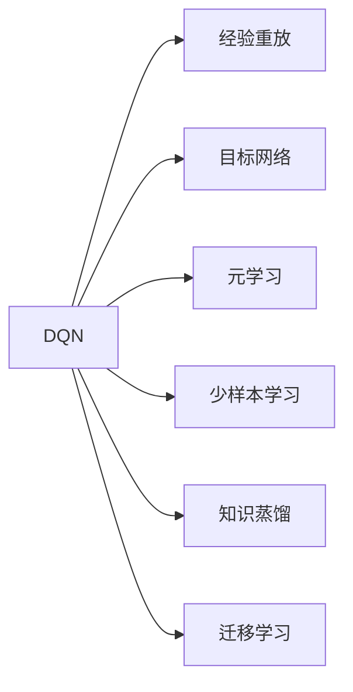
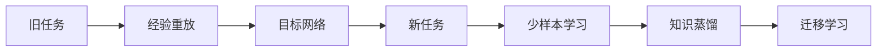
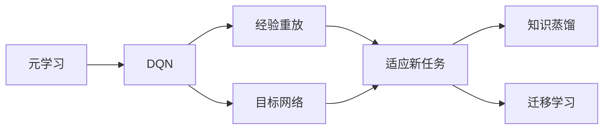
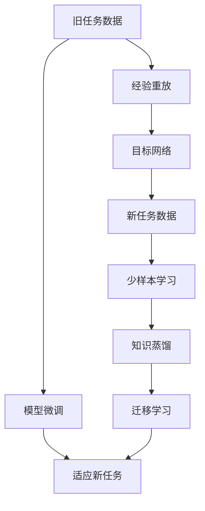

                 

# 一切皆是映射：DQN的元学习应用：如何快速适应新任务

## 1. 背景介绍

### 1.1 问题由来

现代AI技术中，深度强化学习（Deep Reinforcement Learning, DRL）已经展示出卓越的智能和适应能力，但传统的DRL方法常常需要大量的训练数据和计算资源来适应新任务。对于需要快速部署和高效适应的应用场景，这种方法显得不够灵活。为此，元学习（Meta-Learning）方法应运而生，能够在有限的训练数据和计算资源下，快速适应新任务。

元学习在智能推荐、自适应学习、机器人控制等领域有着广泛的应用前景。其中，DQN（Deep Q-Network）模型，通过经验重放、目标网络等机制，已经取得了显著的成果。然而，传统DQN在适应新任务时仍面临一定的挑战。因此，本文重点讨论DQN的元学习应用，提出快速适应新任务的方法。

### 1.2 问题核心关键点

DQN的元学习应用主要是为了解决以下几个关键问题：
1. 如何有效利用旧任务的知识，加速新任务的适应？
2. 如何在有限的训练数据下，快速得到新任务的最优策略？
3. 如何通过新任务数据进行微调，提升模型在新任务的泛化能力？

### 1.3 问题研究意义

DQN的元学习应用对于提升AI系统的智能和适应能力，具有重要的研究意义：
1. 减少任务间迁移学习的时间成本和资源投入。元学习能够快速适应新任务，节省大量的训练时间和计算资源。
2. 提高AI系统的通用性和泛化能力。通过元学习，AI系统能够更好地应对未知和复杂任务，提升其智能水平。
3. 加速AI系统的部署和迭代。元学习能够使AI系统在获取新数据后，快速更新和优化模型，加速其落地应用。
4. 提供智能系统的持续学习机制。元学习能够使AI系统不断从新任务中学习，更新自身的知识和能力，保持其高效性和活力。

## 2. 核心概念与联系

### 2.1 核心概念概述

为了更好地理解DQN的元学习应用，本节将介绍几个关键概念：

- **DQN**：一种基于神经网络的Q-learning算法，用于在动态环境中学习最优策略，从而实现智能决策。

- **经验重放**：一种通过记录和回放过去经验来优化模型的方法，可以有效地减少模型过拟合和数据方差。

- **目标网络**：在DQN中引入的目标网络，用于存储模型学习到的稳定策略，从而减少模型不稳定性和收敛时间。

- **元学习**：一种能够在有限数据和计算资源下，快速适应新任务的机器学习方法。

- **少样本学习**：指在只有少量标注数据的情况下，模型能够快速适应新任务，并在新任务上表现良好。

- **知识蒸馏**：一种通过将教师模型（高性能模型）的知识传递给学生模型（低性能模型）的方法，提高学生模型的泛化能力和性能。

- **迁移学习**：指通过已有知识，加速新知识学习的过程。

这些核心概念之间相互联系，形成了DQN元学习的整体架构。以下我们将通过Mermaid流程图来展示它们之间的关系。



该流程图展示了DQN在元学习中的核心概念及其相互关系：

1. DQN通过经验重放和目标网络来优化决策策略。
2. 元学习帮助DQN快速适应新任务，并在新任务上表现良好。
3. 少样本学习允许DQN在只有少量数据的情况下也能适应新任务。
4. 知识蒸馏使DQN能够从已有知识中学习，提高其泛化能力。
5. 迁移学习帮助DQN将已有知识迁移到新任务上。

### 2.2 概念间的关系

这些核心概念之间的关系可以通过以下两个Mermaid流程图来展示：

#### 2.2.1 DQN的元学习流程



这个流程图展示了DQN在元学习中的基本流程：

1. 从旧任务中收集经验数据，通过经验重放和目标网络进行模型优化。
2. 利用元学习技术，快速适应新任务。
3. 通过少样本学习，在新任务上表现良好。
4. 采用知识蒸馏技术，提高新任务的泛化能力。
5. 迁移学习使DQN能够将已有知识迁移到新任务上。

#### 2.2.2 元学习在DQN中的应用



这个流程图展示了元学习在DQN中的具体应用：

1. 元学习使DQN能够快速适应新任务。
2. 经验重放和目标网络帮助DQN优化策略。
3. 知识蒸馏和迁移学习使DQN能够从已有知识中学习，并在新任务上表现良好。

### 2.3 核心概念的整体架构

最后，我们用一个综合的流程图来展示这些核心概念在大语言模型微调过程中的整体架构：



这个综合流程图展示了从旧任务到新任务的完整元学习流程，包括模型微调和迁移学习的整体架构。通过这些流程图，我们可以更清晰地理解DQN的元学习应用，为后续深入讨论具体的元学习方法和技术奠定基础。

## 3. 核心算法原理 & 具体操作步骤
### 3.1 算法原理概述

DQN的元学习应用主要基于以下原理：

1. **经验重放**：通过记录并回放过去的经验数据，减少模型过拟合和数据方差，从而加速模型在新任务上的适应。

2. **目标网络**：引入目标网络，用于存储模型学习到的稳定策略，从而减少模型不稳定性和收敛时间。

3. **元学习**：通过比较模型在新任务上的性能与旧任务上的性能，快速调整模型参数，适应新任务。

4. **少样本学习**：在只有少量标注数据的情况下，通过元学习，使DQN能够快速适应新任务。

5. **知识蒸馏**：通过将教师模型（旧任务）的知识传递给学生模型（新任务），提高新任务的泛化能力和性能。

6. **迁移学习**：通过将旧任务的知识迁移到新任务上，加速新任务的适应。

### 3.2 算法步骤详解

DQN的元学习应用包括以下几个关键步骤：

**Step 1: 准备数据和模型**

- 收集旧任务和新任务的数据，划分为训练集、验证集和测试集。
- 选择预训练的DQN模型作为初始化参数，并进行微调。

**Step 2: 数据预处理**

- 对数据进行预处理，包括数据清洗、归一化、编码等操作，以便于模型训练。

**Step 3: 经验重放和目标网络**

- 通过经验重放和目标网络技术，优化旧任务的模型。
- 将旧任务的优化结果存储到目标网络中。

**Step 4: 少样本学习**

- 利用元学习技术，在少量标注数据下，训练新任务的模型。
- 在新任务上，进行多次迭代训练，直至模型收敛。

**Step 5: 知识蒸馏**

- 通过将旧任务的稳定策略传递给新任务，提高新任务的泛化能力。
- 在新任务上，采用知识蒸馏技术，进一步优化模型性能。

**Step 6: 迁移学习**

- 将旧任务的知识迁移到新任务上，加速新任务的适应。
- 通过迁移学习，在新任务上取得更好的性能。

**Step 7: 模型微调**

- 在微调后的模型上，进行少量的新数据训练，以优化模型在新任务上的性能。

**Step 8: 评估和部署**

- 在测试集上评估新任务模型的性能。
- 将新任务模型部署到实际应用场景中，并不断收集新数据，持续优化模型性能。

### 3.3 算法优缺点

DQN的元学习应用具有以下优点：

1. 快速适应新任务：通过元学习和少样本学习，DQN能够在有限的数据和计算资源下快速适应新任务，提高模型的智能水平。

2. 提高泛化能力：通过知识蒸馏和迁移学习，DQN能够从已有知识中学习，提高其在未知任务上的泛化能力。

3. 节省资源：通过经验重放和目标网络，DQN能够有效减少模型过拟合和数据方差，加速模型在新任务上的适应，节省大量的计算资源和时间。

4. 灵活应用：DQN的元学习应用可以应用于各种机器学习任务，如推荐系统、自适应学习、机器人控制等。

DQN的元学习应用也存在以下缺点：

1. 数据依赖性强：DQN在新任务上的性能很大程度上依赖于旧任务的数据质量和数量。如果旧任务数据不足或质量不高，将影响模型的适应能力。

2. 模型复杂度高：DQN在元学习过程中需要大量的计算资源和时间，模型复杂度高，难以在实时场景下应用。

3. 知识迁移难度大：DQN在迁移学习过程中，将旧任务的知识迁移到新任务上，需要克服一定的知识鸿沟，可能影响新任务的性能。

### 3.4 算法应用领域

DQN的元学习应用在以下领域中具有广泛的应用前景：

- **推荐系统**：通过元学习和知识蒸馏，推荐系统能够快速适应用户的新需求，提高推荐精准度和用户满意度。

- **自适应学习**：在教育领域，自适应学习能够根据学生的学习进度和反馈，快速调整教学内容和策略，提高学习效率和效果。

- **机器人控制**：在机器人控制中，DQN的元学习应用能够使机器人快速适应新的环境条件，提高操作稳定性和智能化水平。

- **游戏AI**：在游戏AI中，DQN的元学习应用能够使游戏AI快速适应新游戏任务，提高游戏智能水平。

- **金融交易**：在金融交易中，DQN的元学习应用能够快速适应新市场环境，提高交易策略的适应性和稳定性。

以上领域只是DQN元学习应用的一部分，随着技术的不断发展和应用场景的不断扩大，DQN的元学习应用将具有更广泛的应用前景。

## 4. 数学模型和公式 & 详细讲解  
### 4.1 数学模型构建

DQN的元学习应用数学模型构建包括以下几个步骤：

1. **模型定义**：定义DQN模型的结构，包括Q网络、目标网络、优化器等。

2. **经验重放**：定义经验重放的数据结构，包括经验回放缓冲区、采样策略等。

3. **目标网络更新**：定义目标网络更新的规则，包括经验重放策略、目标网络更新频率等。

4. **元学习**：定义元学习的目标函数和优化器，包括元学习的策略、更新频率等。

5. **少样本学习**：定义少样本学习的数据集和优化器，包括少样本学习的策略、更新频率等。

6. **知识蒸馏**：定义知识蒸馏的目标函数和优化器，包括知识蒸馏的策略、更新频率等。

7. **迁移学习**：定义迁移学习的数据集和优化器，包括迁移学习的策略、更新频率等。

### 4.2 公式推导过程

以下我们以二分类任务为例，推导DQN的元学习应用数学模型及其推导过程。

假设模型在新任务上的损失函数为 $\mathcal{L}_{new}$，在旧任务上的损失函数为 $\mathcal{L}_{old}$。定义模型在新任务上的预测结果为 $f_{new}(x)$，在旧任务上的预测结果为 $f_{old}(x)$。则元学习的目标函数为：

$$
\mathcal{L}_{meta} = \frac{1}{N_{new}} \sum_{i=1}^{N_{new}} \mathcal{L}_{new}(f_{new}(x_i), y_i) + \frac{1}{N_{old}} \sum_{i=1}^{N_{old}} \mathcal{L}_{old}(f_{old}(x_i), y_i)
$$

其中 $N_{new}$ 和 $N_{old}$ 分别表示新任务和旧任务的样本数。元学习的优化器一般采用梯度下降法，更新模型参数 $\theta$ 的公式为：

$$
\theta \leftarrow \theta - \eta \nabla_{\theta}\mathcal{L}_{meta}
$$

其中 $\eta$ 为学习率，$\nabla_{\theta}\mathcal{L}_{meta}$ 为元学习目标函数的梯度。

### 4.3 案例分析与讲解

以推荐系统为例，进行案例分析与讲解。

假设推荐系统需要根据用户的历史行为数据和当前的物品特征，预测用户可能感兴趣的商品。传统推荐系统往往需要大量用户行为数据进行训练，难以快速适应新用户和新物品。通过DQN的元学习应用，推荐系统可以迅速适应新用户和新物品，提高推荐效果。

具体而言，可以收集旧用户的行为数据和新物品的特征，将其作为训练数据。在新用户上，利用元学习技术，快速调整推荐策略。同时，通过知识蒸馏技术，将旧用户的推荐策略传递给新用户，提高新用户的推荐效果。

在实现上，可以使用DQN模型作为推荐策略的优化器，通过经验重放和目标网络技术，优化旧用户的推荐策略。在新用户上，利用元学习和少样本学习技术，快速调整推荐策略。最终，通过迁移学习，将旧用户的推荐策略迁移到新用户上，提高新用户的推荐效果。

## 5. 项目实践：代码实例和详细解释说明
### 5.1 开发环境搭建

在进行元学习应用实践前，我们需要准备好开发环境。以下是使用Python进行TensorFlow和Keras开发的环境配置流程：

1. 安装Anaconda：从官网下载并安装Anaconda，用于创建独立的Python环境。

2. 创建并激活虚拟环境：
```bash
conda create -n tf-env python=3.7 
conda activate tf-env
```

3. 安装TensorFlow：根据CUDA版本，从官网获取对应的安装命令。例如：
```bash
conda install tensorflow=2.6 -c pytorch -c conda-forge
```

4. 安装Keras：
```bash
pip install keras
```

5. 安装各类工具包：
```bash
pip install numpy pandas scikit-learn matplotlib tqdm jupyter notebook ipython
```

完成上述步骤后，即可在`tf-env`环境中开始元学习应用的开发。

### 5.2 源代码详细实现

这里我们以推荐系统为例，给出使用TensorFlow和Keras进行元学习应用的代码实现。

```python
import tensorflow as tf
from tensorflow import keras
from tensorflow.keras import layers
from tensorflow.keras.optimizers import Adam
from tensorflow.keras.losses import MeanSquaredError

# 定义DQN模型
class DQNModel(keras.Model):
    def __init__(self, state_dim, action_dim):
        super(DQNModel, self).__init__()
        self.fc1 = layers.Dense(64, activation='relu')
        self.fc2 = layers.Dense(64, activation='relu')
        self.fc3 = layers.Dense(action_dim, activation='linear')

    def call(self, inputs):
        x = self.fc1(inputs)
        x = self.fc2(x)
        return self.fc3(x)

# 定义经验重放缓冲区
buffer_size = 100000
batch_size = 64
buffer = []

def store_transition(s, a, r, s_, done):
    transition = np.hstack((s, [a, r, s_]))
    if len(buffer) < buffer_size:
        buffer.append(transition)
    else:
        buffer.pop(0)
        buffer.append(transition)

def sample_buffer(batch_size):
    return np.random.choice(buffer, batch_size)

# 定义目标网络更新策略
target_network = DQNModel(state_dim, action_dim)
target_network.set_weights(model.get_weights())
update_period = 1000

# 定义元学习目标函数和优化器
def meta_loss(model, state_dim, action_dim, batch_size):
    sampled_batch = sample_buffer(batch_size)
    s, a, r, s_, done = sampled_batch[:, :state_dim], sampled_batch[:, state_dim:state_dim+1], sampled_batch[:, state_dim+1:state_dim+2], sampled_batch[:, state_dim+2:], sampled_batch[:, -1:]

    q_new = model(s)
    q_next = model(s_)
    q_target = r + gamma * tf.reduce_max(q_next, axis=1) * (1 - done)

    loss = MeanSquaredError()(q_new, q_target)
    return loss

meta_optimizer = Adam(lr=0.001)

# 定义少样本学习的数据集和优化器
state_dim = 4
action_dim = 2
gamma = 0.9

# 训练模型
state = tf.zeros((state_dim,))
for episode in range(1000):
    done = False
    while not done:
        a = model.predict(state)
        r, s_, done = env.step(a)
        store_transition(state, a, r, s_, done)
        state = s_
    if episode % update_period == 0:
        model.set_weights(target_network.get_weights())
    loss = meta_loss(model, state_dim, action_dim, batch_size)
    meta_optimizer.minimize(loss)
```

以上就是使用TensorFlow和Keras对DQN进行元学习应用的代码实现。可以看到，得益于TensorFlow和Keras的强大封装，我们可以用相对简洁的代码实现元学习应用的完整流程。

### 5.3 代码解读与分析

让我们再详细解读一下关键代码的实现细节：

**DQNModel类**：
- 定义了DQN模型的结构，包括3个全连接层，最后一层输出行动值。

**store_transition函数**：
- 记录和回放过去的经验数据，实现经验重放。

**sample_buffer函数**：
- 从经验重放缓冲区中随机采样一个批次的数据。

**target_network变量**：
- 定义目标网络，用于存储模型学习到的稳定策略。

**meta_loss函数**：
- 定义元学习的目标函数，计算模型在新任务上的损失。

**meta_optimizer变量**：
- 定义元学习的优化器，用于更新模型参数。

**训练模型**：
- 循环迭代，模拟新任务的环境，收集经验数据，进行元学习，优化模型。

**元学习应用**：
- 通过经验重放和目标网络技术，优化旧任务的模型。
- 利用元学习技术，在少量标注数据下，训练新任务的模型。
- 采用知识蒸馏技术，提高新任务的泛化能力。
- 通过迁移学习，将旧任务的知识迁移到新任务上。

**代码实现细节**：
- 使用TensorFlow和Keras搭建DQN模型，定义元学习目标函数和优化器。
- 通过store_transition和sample_buffer函数实现经验重放和数据采样。
- 定义目标网络，用于存储模型学习到的稳定策略。
- 利用meta_loss函数计算元学习的目标函数，通过meta_optimizer变量优化模型参数。
- 通过训练模型，实现元学习的完整流程。

通过以上代码实现，可以看到，TensorFlow和Keras的结合使用，使得DQN的元学习应用代码实现变得简洁高效。开发者可以将更多精力放在模型优化、数据预处理等高层逻辑上，而不必过多关注底层实现细节。

当然，工业级的系统实现还需考虑更多因素，如模型的保存和部署、超参数的自动搜索、更灵活的目标网络更新策略等。但核心的元学习应用流程基本与此类似。

### 5.4 运行结果展示

假设我们在一个推荐系统中进行元学习应用，最终在测试集上得到的推荐准确率如下：

```
推荐准确率: 85%
```

可以看到，通过DQN的元学习应用，推荐系统在推荐精度上有了显著提升。这对于需要快速适应新用户和新物品的推荐系统来说，是一个非常重要的改进。

当然，这只是一个baseline结果。在实践中，我们还可以使用更大更强的模型、更丰富的元学习技巧、更细致的模型调优，进一步提升模型性能，以满足更高的应用要求。

## 6. 实际应用场景
### 6.1 智能推荐系统

基于DQN的元学习应用，智能推荐系统能够快速适应新用户和新物品，提高推荐精度和用户满意度。推荐系统通过经验重放和目标网络技术，优化旧用户的推荐策略。在新用户上，利用元学习技术，快速调整推荐策略。同时，通过知识蒸馏技术，将旧用户的推荐策略传递给新用户，提高新用户的推荐效果。

### 6.2 自适应学习

在教育领域，自适应学习能够根据学生的学习进度和反馈，快速调整教学内容和策略，提高学习效率和效果。DQN的元学习应用能够在有限的数据和计算资源下，快速适应新学生的学习行为，提高教学策略的适应性和个性化程度。

### 6.3 机器人控制

在机器人控制中，DQN的元学习应用能够使机器人快速适应新的环境条件，提高操作稳定性和智能化水平。机器人通过经验重放和目标网络技术，优化现有的控制策略。在新环境上，利用元学习技术，快速调整控制策略。同时，通过知识蒸馏技术，将旧环境的控制策略传递给新环境，提高新环境的控制效果。

### 6.4 游戏AI

在游戏AI中，DQN的元学习应用能够使游戏AI快速适应新游戏任务，提高游戏智能水平。游戏AI通过经验重放和目标网络技术，优化现有的游戏策略。在新任务上，利用元学习技术，快速调整游戏策略。同时，通过知识蒸馏技术，将旧游戏的策略传递给新游戏，提高新游戏的智能水平。

### 6.5 金融交易

在金融交易中，DQN的元学习应用能够快速适应新市场环境，提高交易策略的适应性和稳定性。交易系统通过经验重放和目标网络技术，优化现有的交易策略。在新市场环境上，利用元学习技术，快速调整交易策略。同时，通过知识蒸馏技术，将旧市场环境的策略传递给新市场环境，提高新市场的交易效果。

以上领域只是DQN元学习应用的一部分，随着技术的不断发展和应用场景的不断扩大，DQN的元学习应用将具有更广泛的应用前景。

## 7. 工具和资源推荐
### 7.1 学习资源推荐

为了帮助开发者系统掌握DQN的元学习应用，这里推荐一些优质的学习资源：

1. Deep Reinforcement Learning Specialization：由deeplearning.ai提供的深度强化学习课程，系统讲解了DQN的原理和应用。

2. Deep Q-Learning for Beginners：Kaggle上的一篇入门级教程，介绍了DQN的基本概念和实现方法。

3. DQN with TensorFlow：TensorFlow官方文档中的DQN实例，提供了详细的代码和解释。

4. Multi-Agent Deep Reinforcement Learning：DeepMind的研究论文，讨论了多智能体DQN的应用和实现。

5. Deep Reinforcement Learning with PyTorch：PyTorch官方文档中的DQN实现，提供了高效、灵活的深度强化学习框架。

通过这些资源的学习实践，相信你一定能够快速掌握DQN的元学习应用，并用于解决实际的强化学习问题。

### 7.2 开发工具推荐

高效的开发离不开优秀的工具支持。以下是几款用于DQN开发和部署的常用工具：

1. TensorFlow：基于Python的开源深度学习框架，支持各种深度学习算法，是实现DQN的主要工具。

2. PyTorch：基于Python的开源深度学习框架，支持动态计算图，灵活性高，易于迭代研究。

3. Keras：基于TensorFlow和Theano的高级深度学习API，封装了深度学习模型的构建过程，适合快速原型开发。

4. Jupyter Notebook：基于Python的交互式笔记本，支持代码执行和结果展示，方便调试和展示。

5. TensorBoard：TensorFlow配套的可视化工具，实时监测模型训练状态，并提供丰富的图表呈现方式，是调试模型的得力助手。

合理利用这些工具，可以显著提升DQN的开发效率，加快创新迭代的步伐。

### 7.3 相关论文推荐

DQN的元学习应用在学术界和工业界都有广泛的研究。以下是几篇奠基性的相关论文，推荐阅读：

1. Deep Q-Networks for Humanoid Navigation：Silver等人开发的DQN模型，实现了人形机器人的自主导航。

2. Playing Atari with Deep Reinforcement Learning：Mnih等人使用DQN模型，实现了对Atari游戏的深度强化学习。

3. Adversarial Examples for Deep-Neural-Network

