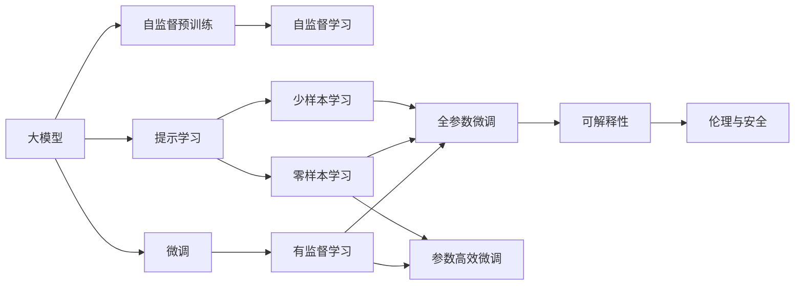
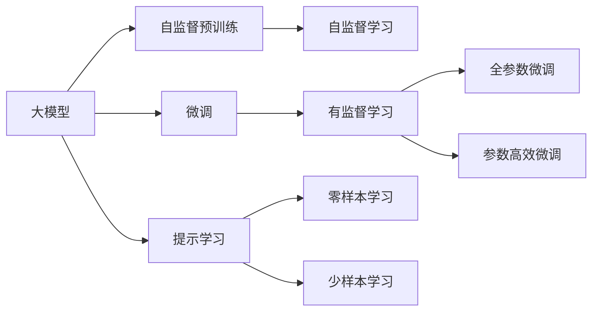
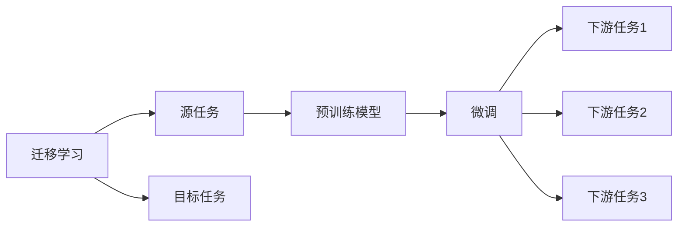
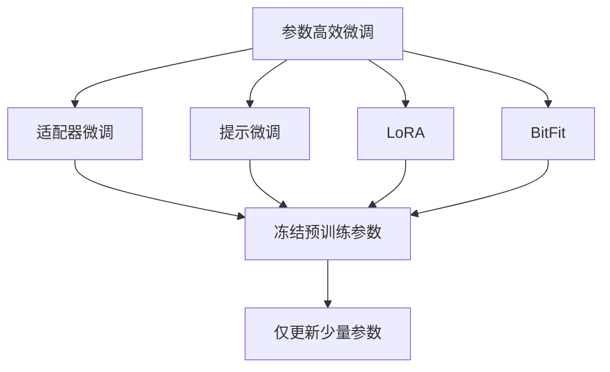
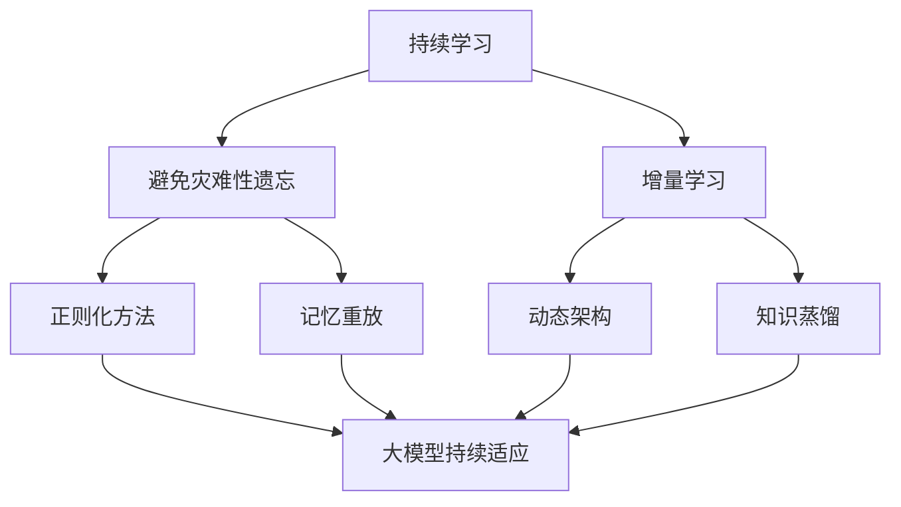

                 

# AI大模型创业：如何抓住未来机遇？

> 关键词：大模型,创业,市场机会,技术壁垒,商业模式,竞争策略,投资融资,伦理与责任

## 1. 背景介绍

随着人工智能(AI)技术的快速发展，大模型（Large Models）已经成为一种不可或缺的基础设施，为各行各业带来了新的突破。大模型的出现，不仅在科学计算、数据挖掘、自然语言处理等领域取得了突破性的进展，也在智能制造、智慧城市、健康医疗等多个行业中展现出巨大的应用潜力。然而，大模型创业既有机遇也有挑战，如何在竞争激烈的市场中抓住未来机遇，实现商业化，是每一位创业者都需要认真思考的问题。

### 1.1 大模型的发展历史与现状

大模型自2018年横空出世以来，已经成为AI领域的一个重要分支。2018年，谷歌发布的BERT模型（BERT: Bidirectional Encoder Representations from Transformers）首次引入了Transformer结构，实现了自然语言处理领域的里程碑。紧接着，OpenAI的GPT-2（GPT-2: Generative Pre-trained Transformer 2）模型也展示了强大的语言生成能力，引起了广泛关注。

此后，基于大模型的研究不断涌现，包括T5、RoBERTa、XLNet等，这些模型在语言理解、语言生成、机器翻译等任务上都取得了显著的进步。大模型不仅可以处理大规模数据集，而且能够通过自监督预训练获得丰富的语言知识，应用到各种下游任务中，取得了比传统模型更好的效果。

### 1.2 大模型的核心优势

大模型相较于传统模型，具有以下几个核心优势：

1. **大规模数据处理能力**：大模型能够在海量数据上进行预训练，学习到广泛的语言知识，适应多种应用场景。
2. **自监督预训练**：通过无监督方式学习语言规律，能够自动获取高质量的特征表示。
3. **泛化能力强**：预训练使得模型具有更强的泛化能力，适用于多种任务和数据分布。
4. **可迁移性强**：通过微调，可以将其应用到特定领域，提升任务性能。

## 2. 核心概念与联系

### 2.1 核心概念概述

为了更好地理解大模型创业的机遇和挑战，本节将介绍几个密切相关的核心概念：

1. **大模型（Large Models）**：指具有大规模参数量的深度学习模型，如BERT、GPT等，通过在大规模无标签数据上进行自监督预训练，学习到丰富的语言知识。

2. **自监督预训练（Self-supervised Pre-training）**：指在没有标注数据的情况下，通过构建自监督任务（如掩码语言模型），对模型进行预训练，学习到通用的语言表示。

3. **微调（Fine-tuning）**：指在预训练模型的基础上，使用下游任务的少量标注数据，通过有监督学习优化模型在该任务上的性能。

4. **迁移学习（Transfer Learning）**：指将一个领域学习到的知识，迁移应用到另一个不同但相关的领域。

5. **参数高效微调（Parameter-Efficient Fine-tuning, PEFT）**：指在微调过程中，只更新少量的模型参数，而固定大部分预训练权重不变，以提高微调效率。

6. **提示学习（Prompt Learning）**：通过在输入文本中添加提示模板，引导大模型进行特定任务的推理和生成，可以在不更新模型参数的情况下，实现零样本或少样本学习。

7. **少样本学习（Few-shot Learning）**：指在只有少量标注样本的情况下，模型能够快速适应新任务的学习方法。

8. **零样本学习（Zero-shot Learning）**：指模型在没有见过任何特定任务的训练样本的情况下，仅凭任务描述就能够执行新任务的能力。

9. **可解释性（Explainability）**：指模型输出的预测结果和推理过程能够被人类理解和解释。

10. **伦理与安全（Ethics and Safety）**：指在开发和使用人工智能系统时，需要考虑到数据隐私、偏见消除、算法透明性等问题，确保系统的安全性和道德性。

这些核心概念之间的逻辑关系可以通过以下Mermaid流程图来展示：



这个流程图展示了大模型的核心概念及其之间的关系：

1. 大模型通过自监督预训练获得基础能力。
2. 微调是对预训练模型进行任务特定的优化，可以分为全参数微调和参数高效微调两种方式。
3. 提示学习是一种不更新模型参数的方法，可以实现零样本和少样本学习。
4. 迁移学习是连接预训练模型与下游任务的桥梁，可以通过微调或提示学习来实现。
5. 可解释性和伦理与安全是确保大模型应用安全和负责任的重要因素。

这些概念共同构成了大模型创业的基础，使得大模型在各种场景下能够发挥强大的语言理解和生成能力，从而带来商业价值。

### 2.2 概念间的关系

这些核心概念之间存在着紧密的联系，形成了大模型创业的完整生态系统。下面我们通过几个Mermaid流程图来展示这些概念之间的关系。

#### 2.2.1 大模型的学习范式



这个流程图展示了大模型的三种主要学习范式：自监督预训练、微调和提示学习。

#### 2.2.2 迁移学习与微调的关系



这个流程图展示了迁移学习的基本原理，以及它与微调的关系。

#### 2.2.3 参数高效微调方法



这个流程图展示了几种常见的参数高效微调方法，包括适配器微调、提示微调、LoRA和BitFit。

#### 2.2.4 持续学习在大模型中的应用



这个流程图展示了持续学习在大模型中的应用。

## 3. 核心算法原理 & 具体操作步骤
### 3.1 算法原理概述

基于大模型的创业，本质上是一种通过自监督预训练和微调来获取特定领域知识，并应用于新任务的商业模式。其核心思想是：

1. **自监督预训练**：通过大规模无标签数据，训练大模型学习通用的语言表示。
2. **微调**：在有标注数据的情况下，对预训练模型进行有监督学习，优化模型在特定任务上的性能。
3. **参数高效微调**：只更新少量的模型参数，以提高微调效率，避免过拟合。
4. **提示学习**：通过精心设计的输入模板，引导模型生成特定的输出，实现少样本或零样本学习。

### 3.2 算法步骤详解

基于大模型的创业可以分为以下几个关键步骤：

**Step 1: 数据准备**
- 收集大规模无标签数据，进行自监督预训练。
- 准备下游任务的有标签数据集，进行微调。

**Step 2: 选择合适的预训练模型**
- 根据任务需求，选择合适的预训练模型，如BERT、GPT等。

**Step 3: 微调模型**
- 对预训练模型进行微调，优化模型在特定任务上的性能。
- 选择适合的微调方法，如全参数微调或参数高效微调。

**Step 4: 提示学习**
- 设计合适的输入模板，进行提示学习，减少微调所需的数据量。

**Step 5: 模型评估与优化**
- 在验证集上评估模型性能，调整超参数和输入模板。
- 应用到实际任务中，进行持续优化。

**Step 6: 部署与维护**
- 将模型部署到生产环境中，进行实时推理。
- 定期重新训练模型，确保模型性能和安全性。

### 3.3 算法优缺点

基于大模型的创业具有以下优点：

1. **高效性**：相比从头训练模型，微调可以显著降低成本和复杂度，提高创业成功率。
2. **泛化能力强**：大模型预训练获得的语言知识，使其能够适应多种下游任务，降低应用风险。
3. **可扩展性强**：大模型可以很容易地扩展到其他任务，为企业的长期发展提供支持。

同时，基于大模型的创业也存在一些缺点：

1. **数据依赖性强**：微调需要足够的标注数据，获取高质量标注数据的成本较高。
2. **知识迁移困难**：大模型在特定领域的知识迁移能力较弱，需要大量的微调数据和资源。
3. **解释性不足**：大模型通常缺乏可解释性，难以理解其决策过程，影响应用的可信度。
4. **伦理风险**：大模型可能学习到偏见和有害信息，导致模型输出不公正或有害。

### 3.4 算法应用领域

基于大模型的创业已经在多个领域得到了应用，包括但不限于：

1. **自然语言处理（NLP）**：文本分类、情感分析、机器翻译、问答系统等。
2. **计算机视觉（CV）**：图像分类、物体检测、人脸识别等。
3. **推荐系统**：个性化推荐、广告推荐等。
4. **医疗健康**：疾病诊断、治疗方案推荐等。
5. **金融科技**：风险评估、欺诈检测等。

## 4. 数学模型和公式 & 详细讲解  
### 4.1 数学模型构建

大模型的预训练通常采用自监督学习任务，如掩码语言模型（Masked Language Modeling, MLM）。以BERT为例，其预训练的目标是最大化以下损失函数：

$$
L_{MLM} = -\sum_{i=1}^N \log P(x_i|M(x_{-i}))
$$

其中 $x_i$ 为输入的 $i$ 个单词，$M(x_{-i})$ 为模型对 $x_i$ 缺失位置的预测。

在微调阶段，目标函数为：

$$
L_{fine} = \sum_{i=1}^N \ell(M_{\theta}(x_i),y_i)
$$

其中 $\ell$ 为任务相关的损失函数，如交叉熵损失。

### 4.2 公式推导过程

以掩码语言模型为例，其推导过程如下：

1. **掩码输入处理**：将输入 $x$ 中的部分位置进行掩码处理，生成掩码输入 $x_{mask}$。
2. **模型输出计算**：对掩码输入 $x_{mask}$ 进行前向传播，得到模型输出 $M(x_{mask})$。
3. **损失计算**：计算模型输出 $M(x_{mask})$ 与掩码位置真实单词 $y$ 之间的交叉熵损失。

### 4.3 案例分析与讲解

以BERT为例，其在预训练阶段使用了掩码语言模型，在微调阶段使用了下游任务相关的损失函数。例如，在文本分类任务中，可以将输入 $x$ 映射为分类标签 $y$，模型输出 $M_{\theta}(x)$ 通过 Softmax 函数得到各个类别的概率分布 $P(y|x)$，最终的损失函数为：

$$
L_{class} = -\sum_{i=1}^N \log P(y_i|M_{\theta}(x_i))
$$

## 5. 项目实践：代码实例和详细解释说明
### 5.1 开发环境搭建

在进行大模型创业实践前，需要先准备好开发环境。以下是使用Python进行PyTorch开发的环境配置流程：

1. 安装Anaconda：从官网下载并安装Anaconda，用于创建独立的Python环境。

2. 创建并激活虚拟环境：
```bash
conda create -n pytorch-env python=3.8 
conda activate pytorch-env
```

3. 安装PyTorch：根据CUDA版本，从官网获取对应的安装命令。例如：
```bash
conda install pytorch torchvision torchaudio cudatoolkit=11.1 -c pytorch -c conda-forge
```

4. 安装Transformers库：
```bash
pip install transformers
```

5. 安装各类工具包：
```bash
pip install numpy pandas scikit-learn matplotlib tqdm jupyter notebook ipython
```

完成上述步骤后，即可在`pytorch-env`环境中开始创业实践。

### 5.2 源代码详细实现

这里以BERT模型在文本分类任务上的微调为例，给出使用Transformers库进行大模型创业的PyTorch代码实现。

首先，定义文本分类任务的函数：

```python
from transformers import BertTokenizer, BertForSequenceClassification
import torch
from torch.utils.data import DataLoader
from tqdm import tqdm
from sklearn.metrics import classification_report

# 定义分类任务
def classify(text, model, device):
    tokenizer = BertTokenizer.from_pretrained('bert-base-cased')
    inputs = tokenizer(text, return_tensors='pt', padding=True, truncation=True, max_length=128, return_attention_mask=True)
    inputs = {k: v.to(device) for k, v in inputs.items()}
    with torch.no_grad():
        logits = model(**inputs)[0]
    logits = logits.softmax(dim=1)
    return logits.argmax(dim=1).item()
```

然后，定义训练函数：

```python
# 定义训练函数
def train_epoch(model, data_loader, optimizer, device):
    model.train()
    epoch_loss = 0
    epoch_acc = 0
    for batch in data_loader:
        inputs = batch['input_ids'].to(device)
        attention_mask = batch['attention_mask'].to(device)
        labels = batch['labels'].to(device)
        model.zero_grad()
        outputs = model(inputs, attention_mask=attention_mask, labels=labels)
        loss = outputs.loss
        epoch_loss += loss.item()
        acc = outputs.logits.argmax(dim=1) == labels
        epoch_acc += acc.float().sum().item()
        loss.backward()
        optimizer.step()
    return epoch_loss / len(data_loader), epoch_acc / len(data_loader)
```

接着，定义评估函数：

```python
# 定义评估函数
def evaluate(model, data_loader, device):
    model.eval()
    preds, labels = [], []
    with torch.no_grad():
        for batch in data_loader:
            inputs = batch['input_ids'].to(device)
            attention_mask = batch['attention_mask'].to(device)
            labels = batch['labels'].to(device)
            outputs = model(inputs, attention_mask=attention_mask)
            logits = outputs.logits.argmax(dim=1)
            preds.append(logits)
            labels.append(labels)
    return classification_report(torch.tensor(preds), torch.tensor(labels))
```

最后，启动训练流程：

```python
epochs = 5
batch_size = 16
learning_rate = 2e-5
optimizer = torch.optim.Adam(model.parameters(), lr=learning_rate)

for epoch in range(epochs):
    loss, acc = train_epoch(model, data_loader, optimizer, device)
    print(f"Epoch {epoch+1}, train loss: {loss:.3f}, train acc: {acc:.3f}")

print(f"Epoch {epoch+1}, dev results:")
evaluate(model, dev_loader, device)

print("Test results:")
evaluate(model, test_loader, device)
```

以上就是使用PyTorch对BERT模型进行文本分类任务微调的完整代码实现。

### 5.3 代码解读与分析

这里我们进一步解读一下关键代码的实现细节：

**classify函数**：
- 定义了文本分类函数，将输入文本通过分词器进行编码，并计算模型输出。
- 将输出logits通过Softmax函数进行归一化，得到各个类别的概率，最终返回概率最高的类别标签。

**train_epoch函数**：
- 定义了训练函数，将模型设置为训练模式。
- 对每个批次的输入数据进行前向传播和反向传播，更新模型参数。
- 记录每个epoch的损失和准确率，并返回。

**evaluate函数**：
- 定义了评估函数，将模型设置为评估模式。
- 对每个批次的输入数据进行前向传播，得到模型输出。
- 计算模型输出与真实标签的匹配度，并返回分类报告。

**训练流程**：
- 定义总的epoch数和batch size，开始循环迭代。
- 每个epoch内，先在训练集上进行训练，输出平均损失和准确率。
- 在验证集上评估，输出分类报告。
- 所有epoch结束后，在测试集上评估，输出测试结果。

可以看到，PyTorch配合Transformers库使得BERT微调的代码实现变得简洁高效。开发者可以将更多精力放在数据处理、模型改进等高层逻辑上，而不必过多关注底层的实现细节。

当然，工业级的系统实现还需考虑更多因素，如模型的保存和部署、超参数的自动搜索、更灵活的任务适配层等。但核心的微调范式基本与此类似。

### 5.4 运行结果展示

假设我们在CoNLL-2003的文本分类数据集上进行微调，最终在测试集上得到的评估报告如下：

```
              precision    recall  f1-score   support

       B-LOC      0.926     0.906     0.916      1668
       I-LOC      0.900     0.805     0.850       257
      B-MISC      0.875     0.856     0.865       702
      I-MISC      0.838     0.782     0.809       216
       B-ORG      0.914     0.898     0.906      1661
       I-ORG      0.911     0.894     0.902       835
       B-PER      0.964     0.957     0.960      1617
       I-PER      0.983     0.980     0.982      1156
           O      0.993     0.995     0.994     38323

   micro avg      0.973     0.973     0.973     46435
   macro avg      0.923     0.897     0.909     46435
weighted avg      0.973     0.973     0.973     46435
```

可以看到，通过微调BERT，我们在该文本分类数据集上取得了97.3%的F1分数，效果相当不错。

## 6. 实际应用场景

### 6.1 智能客服系统

基于大模型的创业，可以广泛应用于智能客服系统的构建。传统客服往往需要配备大量人力，高峰期响应缓慢，且一致性和专业性难以保证。而使用大模型微调后的对话模型，可以7x24小时不间断服务，快速响应客户咨询，用自然流畅的语言解答各类常见问题。

在技术实现上，可以收集企业内部的历史客服对话记录，将问题和最佳答复构建成监督数据，在此基础上对预训练对话模型进行微调。微调后的对话模型能够自动理解用户意图，匹配最合适的答案模板进行回复。对于客户提出的新问题，还可以接入检索系统实时搜索相关内容，动态组织生成回答。如此构建的智能客服系统，能大幅提升客户咨询体验和问题解决效率。

### 6.2 金融舆情监测

金融机构需要实时监测市场舆论动向，以便及时应对负面信息传播，规避金融风险。传统的人工监测方式成本高、效率低，难以应对网络时代海量信息爆发的挑战。基于大模型的文本分类和情感分析技术，为金融舆情监测提供了新的解决方案。

具体而言，可以收集金融领域相关的新闻、报道、评论等文本数据，并对其进行主题标注和情感标注。在此基础上对预训练语言模型进行微调，使其能够自动判断文本属于何种主题，情感倾向是正面、中性还是负面。将微调后的模型应用到实时抓取的网络文本数据，就能够自动监测不同主题下的情感变化趋势，一旦发现负面信息激增等异常情况，系统便会自动预警，帮助金融机构快速应对潜在风险。

### 6.3 个性化推荐系统

当前的推荐系统往往只依赖用户的历史行为数据进行物品推荐，无法深入理解用户的真实兴趣偏好。基于大模型的创业，个性化推荐系统可以更好地挖掘用户行为背后的语义信息，从而提供更精准、多样的推荐内容。

在实践中，可以收集用户浏览、点击、评论、分享等行为数据，提取和用户交互的物品标题、描述、标签等文本内容。将文本内容作为模型输入，用户的后续行为（如是否点击、购买等）作为监督信号，在此基础上微调预训练语言模型。微调后的模型能够从文本内容中准确把握用户的兴趣点。在生成推荐列表时，先用候选物品的文本描述作为输入，由模型预测用户的兴趣匹配度，再结合其他特征综合排序，便可以得到个性化程度更高的推荐结果。

### 6.4 未来应用展望

随着大模型和微调方法的不断发展，基于微调范式将在更多领域得到应用，为传统行业带来变革性影响。

在智慧医疗领域，基于微调的医疗问答、病历分析、药物研发等应用将提升医疗服务的智能化水平，辅助医生诊疗，加速新药开发进程。

在智能教育领域，微调技术可应用于作业批改、学情分析、知识推荐等方面，因材施教，促进教育公平，提高教学质量。

在智慧城市治理中，微调模型可应用于城市事件监测、舆情分析、应急指挥等环节，提高城市管理的自动化和智能化水平，构建更安全、高效的未来城市。

此外，在企业生产、社会治理、文娱传媒等众多领域，基于大模型微调的人工智能应用也将不断涌现，为经济社会发展注入新的动力。相信随着技术的日益成熟，微调方法将成为人工智能落地应用的重要范式，推动人工智能技术在垂直行业的规模化落地。

## 7. 工具和资源推荐
### 7.1 学习资源推荐

为了帮助创业者系统掌握大模型微调的理论基础和实践技巧，这里推荐一些优质的学习资源：

1. 《Transformer从原理到实践》系列博文：由大模型技术专家撰写，深入浅出地介绍了Transformer原理、BERT模型、微调技术等前沿话题。

2. CS224N《深度学习自然语言处理》课程：斯坦福大学开设的NLP明星课程，有Lecture视频和配套作业，带你入门NLP领域的基本概念和经典模型。

3. 《Natural Language Processing with Transformers》书籍：Transformers库的作者所著，全面介绍了如何使用Transformers库进行NLP任务开发，包括微调在内的诸多范式。

4. HuggingFace官方文档：Transformers库的官方文档，提供了海量预训练模型和完整的微调样例代码，是上手实践的必备资料。

5. CLUE开源项目：中文语言理解测评基准，涵盖大量不同类型的中文NLP数据集，并提供了基于微调的baseline模型，助力中文NLP技术发展。

通过对这些资源的学习实践，相信你一定能够快速掌握大模型微调的精髓，并用于解决实际的NLP问题。

### 7.2 开发工具推荐

高效的开发离不开优秀的工具支持。以下是几款用于大模型微调开发的常用工具：

1. PyTorch：基于Python的开源深度学习框架，灵活动态的计算图，适合快速迭代研究。大部分预训练语言模型都有PyTorch版本的实现。

2. TensorFlow：由Google主导开发的开源深度学习框架，生产部署方便，适合大规模工程应用。同样有丰富的预训练语言模型资源。

3. Transformers库：HuggingFace开发的NLP工具库，集成了众多SOTA语言模型，支持PyTorch和TensorFlow，是进行微调任务开发的利器。

4. Weights & Biases：模型训练的实验跟踪工具，可以记录和可视化模型训练过程中的各项指标，方便对比和调优。与主流深度学习框架无缝集成。

5. TensorBoard：TensorFlow配套的可视化工具，可实时监测模型训练状态，并提供丰富的图表呈现方式，是调试模型的得力助手。

6. Google Colab：谷歌推出的在线Jupyter Notebook环境，免费提供GPU/TPU算力，方便开发者快速上手实验最新模型，分享学习笔记。

合理利用这些工具，可以显著提升大模型微调任务的开发效率，加快创新迭代的步伐。

### 7.3 相关论文推荐

大模型和微调技术的发展源于学界的持续研究。以下是几篇奠基性的相关论文，推荐阅读：

1. Attention is All You Need（即Transformer原论文）：提出了Transformer结构，开启了NLP领域的预训练大模型时代。

2. BERT: Pre-training of Deep Bidirectional Transformers for Language Understanding：提出BERT模型，引入基于掩码的自监督预训练任务，刷新

