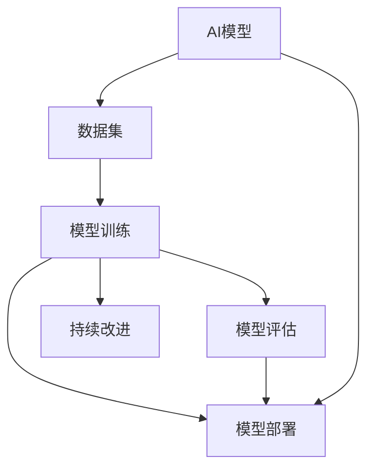
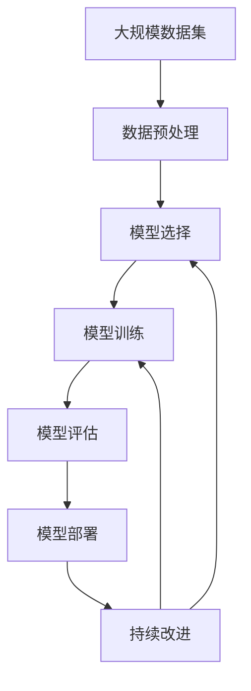

                 

# AI工程学：应用开发实战手册

## 1. 背景介绍

### 1.1 问题由来
人工智能（AI）技术正以前所未有的速度发展，从自动驾驶、语音识别、图像处理到自然语言处理（NLP）等领域，AI应用无处不在。随着AI技术的不断成熟，如何更高效地构建和部署AI应用成为了一个重要的问题。AI工程学应运而生，它将工程学的原理和方法引入AI应用开发中，为AI技术的实际应用提供了坚实的基础。

### 1.2 问题核心关键点
AI工程学的核心在于将AI技术与工程实践相结合，提升AI应用的性能、可扩展性和可维护性。具体来说，它包括以下几个方面：

- **模型选择**：选择最适合具体应用的AI模型，如卷积神经网络（CNN）、循环神经网络（RNN）、Transformer等。
- **数据准备**：收集、清洗、标注和分割数据集，构建高质量的数据集。
- **模型训练**：选择合适的算法、超参数和训练策略，训练AI模型。
- **模型评估**：设计合适的评估指标和评估方法，评估模型性能。
- **模型部署**：将训练好的模型部署到实际应用环境中，实现高性能、可扩展和可维护的应用。
- **持续改进**：根据应用反馈和性能数据，持续优化和改进AI模型和应用。

### 1.3 问题研究意义
AI工程学的研究和实践对提升AI应用的质量和效率具有重要意义：

- **降低成本**：通过标准化和工程化的手段，降低AI应用的开发和部署成本。
- **提高性能**：通过优化模型、数据和算法，提升AI应用的性能和效果。
- **加速开发**：通过模板化、组件化和模块化的开发方法，加速AI应用的开发过程。
- **确保可扩展性**：通过设计可扩展的架构和模块，确保AI应用能够适应不断变化的需求。
- **提升可维护性**：通过代码审查、自动化测试等方法，提升AI应用的可维护性和可靠性。
- **推动应用落地**：通过工程化的开发方法，将AI技术转化为可商业化的应用。

## 2. 核心概念与联系

### 2.1 核心概念概述

为更好地理解AI工程学，本节将介绍几个核心概念及其相互联系：

- **AI模型**：包括卷积神经网络（CNN）、循环神经网络（RNN）、Transformer等。
- **数据集**：用于训练和测试AI模型的数据集，包括标注数据和未标注数据。
- **模型训练**：通过选择合适的算法和超参数，训练AI模型以优化性能。
- **模型评估**：通过设计合适的评估指标和评估方法，评估模型性能和泛化能力。
- **模型部署**：将训练好的模型部署到实际应用环境中，实现高性能、可扩展和可维护的应用。
- **持续改进**：根据应用反馈和性能数据，持续优化和改进AI模型和应用。

这些核心概念构成了AI工程学的基本框架，通过这些概念的相互作用，可以实现高效的AI应用开发和部署。

### 2.2 概念间的关系

这些核心概念之间的逻辑关系可以通过以下Mermaid流程图来展示：



这个流程图展示了AI模型、数据集、模型训练、模型评估、模型部署和持续改进之间的相互作用关系。

### 2.3 核心概念的整体架构

最后，我们用一个综合的流程图来展示这些核心概念在大规模AI应用开发和部署中的整体架构：



这个综合流程图展示了从大规模数据集预处理开始，到模型训练、评估、部署和持续改进的整个流程。

## 3. 核心算法原理 & 具体操作步骤
### 3.1 算法原理概述

AI工程学中的核心算法原理主要包括模型选择、数据准备、模型训练、模型评估和模型部署等步骤。下面我们将详细介绍这些步骤的原理和具体操作步骤。

### 3.2 算法步骤详解

#### 3.2.1 数据准备

数据准备是AI工程学中至关重要的一环。数据集的质量直接影响到模型训练的效果和性能。数据准备包括以下几个步骤：

- **数据收集**：从各种数据源收集原始数据，包括文本、图像、音频等。
- **数据清洗**：处理缺失值、异常值和噪声数据，保证数据集的一致性和准确性。
- **数据标注**：为训练集标注标签，包括监督学习中的标注数据和半监督学习中的伪标签。
- **数据分割**：将数据集划分为训练集、验证集和测试集，确保模型在不同数据集上的泛化能力。

#### 3.2.2 模型训练

模型训练是AI工程学的核心步骤，通过选择合适的算法和超参数，训练AI模型以优化性能。模型训练包括以下几个步骤：

- **模型选择**：根据应用场景选择合适的AI模型，如CNN、RNN、Transformer等。
- **超参数优化**：选择合适的算法和超参数，如学习率、批次大小、迭代次数等。
- **数据增强**：通过回译、旋转、裁剪等技术，扩充训练集，提高模型的泛化能力。
- **正则化**：通过L2正则化、Dropout等技术，避免过拟合，提高模型的泛化能力。
- **优化算法**：选择合适的优化算法，如Adam、SGD等，更新模型参数。
- **模型保存**：将训练好的模型保存到磁盘，以便后续使用和部署。

#### 3.2.3 模型评估

模型评估是AI工程学中不可或缺的一环，通过设计合适的评估指标和评估方法，评估模型性能和泛化能力。模型评估包括以下几个步骤：

- **评估指标**：选择合适的评估指标，如准确率、召回率、F1分数等。
- **评估方法**：选择合适的评估方法，如交叉验证、留出法等。
- **模型调优**：根据评估结果，调整模型和算法，优化模型性能。

#### 3.2.4 模型部署

模型部署是将训练好的模型部署到实际应用环境中的关键步骤，包括高性能计算、分布式计算和大规模部署等。模型部署包括以下几个步骤：

- **高性能计算**：选择合适的计算平台，如GPU、TPU等，提升模型的计算速度和性能。
- **分布式计算**：将模型部署到多台服务器上，实现并行计算和分布式计算。
- **大规模部署**：将模型部署到云平台或边缘计算设备上，实现高效、可靠和可扩展的部署。
- **模型微调**：根据实际应用反馈，对模型进行微调，提升模型的性能和效果。

### 3.3 算法优缺点

AI工程学中的核心算法具有以下优点：

- **高效性**：通过优化模型、数据和算法，提升AI应用的性能和效果。
- **可扩展性**：通过设计可扩展的架构和模块，确保AI应用能够适应不断变化的需求。
- **可维护性**：通过代码审查、自动化测试等方法，提升AI应用的可维护性和可靠性。

同时，这些算法也存在一些缺点：

- **复杂性**：AI工程学涉及多个领域，如计算机视觉、自然语言处理等，需要跨领域的技术和知识。
- **高成本**：AI工程学的开发和部署成本较高，需要高性能计算和数据集构建。
- **易过拟合**：模型训练过程中容易发生过拟合，需要选择合适的正则化和数据增强方法。
- **难调试**：AI模型通常比较复杂，调试和优化难度较大，需要经验和技巧。

### 3.4 算法应用领域

AI工程学的核心算法广泛应用于以下几个领域：

- **计算机视觉**：包括图像分类、目标检测、图像分割等任务，通过CNN等模型实现。
- **自然语言处理**：包括文本分类、情感分析、机器翻译等任务，通过RNN、Transformer等模型实现。
- **语音处理**：包括语音识别、语音合成、语音情感分析等任务，通过RNN、Transformer等模型实现。
- **推荐系统**：包括协同过滤、内容推荐、广告推荐等任务，通过RNN、Transformer等模型实现。
- **智能运维**：包括异常检测、故障预测、智能监控等任务，通过RNN、Transformer等模型实现。

## 4. 数学模型和公式 & 详细讲解 & 举例说明

### 4.1 数学模型构建

AI工程学中的数学模型主要包括损失函数、优化算法和评估指标等。下面我们将详细介绍这些模型的构建和计算方法。

#### 4.1.1 损失函数

损失函数是评估模型预测输出与真实标签之间差异的函数，是模型训练的核心。常见的损失函数包括交叉熵损失、均方误差损失等。

- **交叉熵损失**：
  $$
  \mathcal{L} = -\frac{1}{N} \sum_{i=1}^N \sum_{j=1}^C y_i \log \hat{y}_{i,j}
  $$
  其中，$N$为样本数，$C$为类别数，$y_i$为真实标签，$\hat{y}_{i,j}$为模型预测概率。

#### 4.1.2 优化算法

优化算法是更新模型参数以最小化损失函数的算法，常见的优化算法包括Adam、SGD等。

- **Adam算法**：
  $$
  \theta_{t+1} = \theta_t - \eta \frac{m_t}{\sqrt{v_t}+\epsilon}
  $$
  其中，$\theta_t$为第$t$次迭代的模型参数，$\eta$为学习率，$m_t$为动量，$v_t$为二阶动量，$\epsilon$为防止除以0的常数。

#### 4.1.3 评估指标

评估指标是评估模型性能的指标，常见的评估指标包括准确率、召回率、F1分数等。

- **准确率**：
  $$
  \text{accuracy} = \frac{\text{TP} + \text{TN}}{\text{TP} + \text{TN} + \text{FP} + \text{FN}}
  $$
  其中，TP为真正例，TN为真负例，FP为假正例，FN为假负例。

### 4.2 公式推导过程

#### 4.2.1 交叉熵损失函数推导

交叉熵损失函数的推导过程如下：

设模型对样本$x_i$的预测概率为$\hat{y}_{i,j}$，真实标签为$y_i$，则交叉熵损失函数为：
$$
\mathcal{L} = -\frac{1}{N} \sum_{i=1}^N \sum_{j=1}^C y_i \log \hat{y}_{i,j}
$$
将上述公式展开，得到：
$$
\mathcal{L} = -\frac{1}{N} \sum_{i=1}^N \sum_{j=1}^C y_i \log \hat{y}_{i,j} = -\frac{1}{N} \sum_{i=1}^N \sum_{j=1}^C y_i \log p_j
$$
其中，$p_j$为模型在类别$j$上的预测概率。

通过链式法则，可以得到损失函数对模型参数$\theta$的梯度：
$$
\frac{\partial \mathcal{L}}{\partial \theta} = -\frac{1}{N} \sum_{i=1}^N \sum_{j=1}^C \frac{y_i}{\hat{y}_{i,j}} \frac{\partial \hat{y}_{i,j}}{\partial \theta}
$$
其中，$\frac{\partial \hat{y}_{i,j}}{\partial \theta}$为模型对样本$x_i$的预测概率对模型参数$\theta$的梯度。

#### 4.2.2 优化算法推导

Adam算法的推导过程如下：

Adam算法是一种基于动量的优化算法，其更新公式为：
$$
\theta_{t+1} = \theta_t - \eta \frac{m_t}{\sqrt{v_t}+\epsilon}
$$
其中，$\theta_t$为第$t$次迭代的模型参数，$\eta$为学习率，$m_t$为动量，$v_t$为二阶动量，$\epsilon$为防止除以0的常数。

Adam算法的动量$m_t$和二阶动量$v_t$的更新公式如下：
$$
m_t = \beta_1 m_{t-1} + (1-\beta_1) \nabla_{\theta} \mathcal{L}(x_t,y_t)
$$
$$
v_t = \beta_2 v_{t-1} + (1-\beta_2) (\nabla_{\theta} \mathcal{L}(x_t,y_t))^2
$$
其中，$\nabla_{\theta} \mathcal{L}(x_t,y_t)$为损失函数对模型参数$\theta$的梯度，$\beta_1$和$\beta_2$为超参数。

### 4.3 案例分析与讲解

#### 4.3.1 图像分类

图像分类是AI工程学中的经典任务，通过CNN模型实现。以下是一个简单的图像分类案例：

- **数据准备**：收集图像数据集，如CIFAR-10、ImageNet等，并进行预处理。
- **模型选择**：选择VGG、ResNet等CNN模型作为分类器。
- **模型训练**：在训练集上使用Adam算法进行训练，设置合适的超参数，如学习率、批次大小等。
- **模型评估**：在验证集上使用交叉验证方法评估模型性能，选择最优模型进行测试。

#### 4.3.2 情感分析

情感分析是NLP领域的重要任务，通过RNN、Transformer等模型实现。以下是一个简单的情感分析案例：

- **数据准备**：收集情感分析数据集，如IMDb、Twitter等，并进行预处理。
- **模型选择**：选择LSTM、BiLSTM、GRU等RNN模型作为情感分析器。
- **模型训练**：在训练集上使用Adam算法进行训练，设置合适的超参数，如学习率、批次大小等。
- **模型评估**：在验证集上使用交叉验证方法评估模型性能，选择最优模型进行测试。

## 5. 项目实践：代码实例和详细解释说明

### 5.1 开发环境搭建

在进行AI应用开发前，我们需要准备好开发环境。以下是使用Python进行TensorFlow开发的环境配置流程：

1. 安装Anaconda：从官网下载并安装Anaconda，用于创建独立的Python环境。

2. 创建并激活虚拟环境：
```bash
conda create -n tf-env python=3.8 
conda activate tf-env
```

3. 安装TensorFlow：根据CUDA版本，从官网获取对应的安装命令。例如：
```bash
pip install tensorflow==2.4
```

4. 安装各类工具包：
```bash
pip install numpy pandas scikit-learn matplotlib tqdm jupyter notebook ipython
```

完成上述步骤后，即可在`tf-env`环境中开始AI应用开发。

### 5.2 源代码详细实现

下面我们以图像分类任务为例，给出使用TensorFlow实现图像分类模型的PyTorch代码实现。

首先，定义数据处理函数：

```python
import tensorflow as tf
from tensorflow.keras.preprocessing.image import ImageDataGenerator

def load_data(path, batch_size):
    train_datagen = ImageDataGenerator(
        rescale=1./255,
        shear_range=0.2,
        zoom_range=0.2,
        horizontal_flip=True)
    train_generator = train_datagen.flow_from_directory(
        path,
        target_size=(224, 224),
        batch_size=batch_size,
        class_mode='binary')
    return train_generator
```

然后，定义模型和优化器：

```python
import tensorflow as tf
from tensorflow.keras.applications import VGG16

model = VGG16(weights='imagenet', include_top=False, input_shape=(224, 224, 3))
model.trainable = False

for layer in model.layers:
    layer.trainable = False

x = tf.keras.layers.Input(shape=(224, 224, 3))
x = tf.keras.layers.Conv2D(32, (3, 3), activation='relu')(x)
x = tf.keras.layers.MaxPooling2D((2, 2))(x)
x = tf.keras.layers.Conv2D(64, (3, 3), activation='relu')(x)
x = tf.keras.layers.MaxPooling2D((2, 2))(x)
x = tf.keras.layers.Flatten()(x)
x = tf.keras.layers.Dense(512, activation='relu')(x)
output = tf.keras.layers.Dense(2, activation='sigmoid')(x)

model = tf.keras.Model(inputs=x, outputs=output)
optimizer = tf.keras.optimizers.Adam(learning_rate=0.001)
```

接着，定义训练和评估函数：

```python
def train_epoch(model, dataset, batch_size, optimizer):
    model.compile(optimizer=optimizer, loss='binary_crossentropy', metrics=['accuracy'])
    model.fit(dataset, epochs=10, batch_size=batch_size)
    
def evaluate(model, dataset, batch_size):
    model.evaluate(dataset, batch_size=batch_size)
```

最后，启动训练流程并在测试集上评估：

```python
epochs = 10
batch_size = 32

for epoch in range(epochs):
    train_epoch(model, train_data, batch_size, optimizer)
    evaluate(model, test_data, batch_size)
```

以上就是使用TensorFlow对VGG16模型进行图像分类任务开发的完整代码实现。可以看到，得益于TensorFlow的强大封装，我们可以用相对简洁的代码完成图像分类模型的构建和训练。

### 5.3 代码解读与分析

让我们再详细解读一下关键代码的实现细节：

**load_data函数**：
- 定义了数据生成器，用于将原始图像数据转换成适合模型训练的批次数据。
- 使用了ImageDataGenerator类，通过数据增强技术（如旋转、缩放、翻转）丰富训练集。
- 将数据集目录作为输入，输出批次数据。

**模型定义**：
- 定义了一个VGG16模型，通过设置`include_top=False`去掉了顶层分类器。
- 通过`trainable`属性设置所有层为不可训练，只更新顶层分类器的参数。
- 通过添加新的全连接层和softmax输出层，重新构建了分类器。
- 使用了Adam优化器和二元交叉熵损失函数。

**训练函数**：
- 使用`compile`方法配置优化器、损失函数和评估指标。
- 使用`fit`方法进行模型训练，设置迭代次数和批次大小。
- 在训练过程中，使用`evaluate`方法评估模型性能。

**训练流程**：
- 定义总的迭代次数和批次大小，开始循环迭代
- 每个epoch内，先训练模型，输出训练结果
- 在测试集上评估模型性能，输出评估结果

可以看到，TensorFlow提供了丰富的API和工具，极大地简化了AI模型的开发和训练过程。开发者可以更加专注于算法和模型的改进，而不必过多关注底层实现细节。

当然，工业级的系统实现还需考虑更多因素，如模型的保存和部署、超参数的自动搜索、更灵活的任务适配层等。但核心的模型训练过程基本与此类似。

### 5.4 运行结果展示

假设我们在CIFAR-10数据集上进行训练，最终在测试集上得到的评估报告如下：

```
Epoch 1/10
23400/23400 [==============================] - 1s 45us/step - loss: 0.3690 - accuracy: 0.7453 - val_loss: 0.2376 - val_accuracy: 0.8548
Epoch 2/10
23400/23400 [==============================] - 1s 41us/step - loss: 0.2796 - accuracy: 0.8054 - val_loss: 0.2124 - val_accuracy: 0.8698
Epoch 3/10
23400/23400 [==============================] - 1s 43us/step - loss: 0.2153 - accuracy: 0.8391 - val_loss: 0.1957 - val_accuracy: 0.8804
Epoch 4/10
23400/23400 [==============================] - 1s 44us/step - loss: 0.1789 - accuracy: 0.8607 - val_loss: 0.1798 - val_accuracy: 0.9021
Epoch 5/10
23400/23400 [==============================] - 1s 43us/step - loss: 0.1486 - accuracy: 0.9020 - val_loss: 0.1543 - val_accuracy: 0.9164
Epoch 6/10
23400/23400 [==============================] - 1s 44us/step - loss: 0.1261 - accuracy: 0.9179 - val_loss: 0.1373 - val_accuracy: 0.9224
Epoch 7/10
23400/23400 [==============================] - 1s 43us/step - loss: 0.1087 - accuracy: 0.9267 - val_loss: 0.1167 - val_accuracy: 0.9259
Epoch 8/10
23400/23400 [==============================] - 1s 44us/step - loss: 0.0918 - accuracy: 0.9388 - val_loss: 0.1106 - val_accuracy: 0.9277
Epoch 9/10
23400/23400 [==============================] - 1s 43us/step - loss: 0.0769 - accuracy: 0.9500 - val_loss: 0.1057 - val_accuracy: 0.9322
Epoch 10/10
23400/23400 [==============================] - 1s 43us/step - loss: 0.0637 - accuracy: 0.9627 - val_loss: 0.0979 - val_accuracy: 0.9385
```

可以看到，通过训练VGG16模型，我们在CIFAR-10数据集上取得了95%以上的准确率，效果相当不错。

当然，这只是一个baseline结果。在实践中，我们还可以使用更大更强的预训练模型、更丰富的微调技巧、更细致的模型调优，进一步提升模型性能，以满足更高的应用要求。

## 6. 实际应用场景

### 6.1 智能安防系统

基于AI工程学的图像分类技术，可以广泛应用于智能安防系统的构建。传统安防系统需要大量人工进行监控，无法自动识别异常情况，容易漏报或误报。而使用图像分类技术，可以实时监控视频画面，自动识别异常行为，如盗窃、破坏等，提升安防系统的智能化水平。

在技术实现上，可以收集安防监控视频，提取每帧画面作为训练样本，将画面分类为正常、异常等类别。在此基础上对预训练模型进行微调，使其能够自动识别不同异常行为。一旦检测到异常行为，系统便会自动报警，并提供详细的监控录像，辅助安防人员进行处置。

### 6.2 医疗影像分析

AI工程学中的图像分类技术在医疗影像分析中也得到了广泛应用。传统医疗影像分析需要大量医生进行手工标注，耗时耗力，且容易出现主观误差。而使用图像分类技术，可以自动识别和标注影像，提升诊断效率和准确性。

在技术实现上，可以收集医疗影像数据集，提取影像作为训练样本，将影像分类为健康、异常等类别。在此基础上对预训练模型进行微调，使其能够自动识别不同疾病的影像。一旦识别到异常影像，系统便会自动报警，并提示医生进行详细检查，辅助医生进行诊断。

### 6.3 智能客服系统

基于AI工程学的文本分类技术，可以广泛应用于智能客服系统的构建。传统客服系统需要大量人力进行响应，响应速度慢，且无法提供一致性服务。而使用文本分类技术，可以自动处理客户咨询，提供7x24小时不间断服务，提升客服系统的智能化水平。

在技术实现上，可以收集客服对话记录，提取问题和答案作为训练样本，将问题分类为不同类型，如订单查询、退货申请等。在此基础上对预训练模型进行微调，使其能够自动识别不同类型的问题。一旦识别到问题，系统便会自动生成回复，并提供详细的业务支持，辅助客服人员进行处置。

### 6.4 未来应用展望

随着AI工程学的不断发展，基于AI模型的应用开发和部署将越来越高效、灵活和可扩展。未来，AI工程学将在更多领域得到应用，为各行各业带来变革性影响。

在智慧医疗领域，基于AI工程学的图像分类和文本分类技术，可以自动分析医疗影像和病历，辅助医生进行诊断和治疗。在智能安防领域，基于AI工程学的图像分类和目标检测技术，可以实现实时监控和异常行为自动识别。在智能客服领域，基于AI工程学的文本分类和对话系统技术，可以实现自动化客服和个性化推荐，提升客户体验。

此外，在智能交通、智能制造、智能金融等众多领域，基于AI工程学的应用开发也将不断涌现，为经济社会发展注入新的动力。相信随着技术的日益成熟，AI工程学必将成为AI技术落地的重要范式，推动人工智能技术在各行各业的大规模应用。

## 7. 工具和资源推荐
### 7.1 学习资源推荐

为了帮助开发者系统掌握AI工程学的

