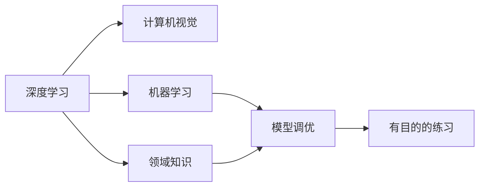

                 

# Andrej Karpathy：1 万小时定律的魔力

## 1. 背景介绍

### 1.1 问题由来
在人工智能领域，有一个广为人知的观点：成为一名领域专家，需要至少1万小时的有意识练习。这一观点最早由Andrej Karpathy在其博客中提出，引起了广泛的讨论。Andrej Karpathy本人，作为深度学习领域的顶级专家，通过自己的经历和研究，深入探讨了这一观点，并提出了“1万小时定律的魔力”。本文旨在深入探讨Andrej Karpathy对1万小时定律的理解和实践，以期为AI领域的从业者提供一些有益的启示。

### 1.2 问题核心关键点
Andrej Karpathy在其博客中多次强调，1万小时定律并不是简单的练习时间堆积，而是通过有目的、有计划、有反馈的持续练习，不断提升个人技能和知识水平的过程。这一过程涉及到深度学习、机器学习、计算机视觉等多个领域的知识，需要理论基础和实践经验的结合。

## 2. 核心概念与联系

### 2.1 核心概念概述

在探讨Andrej Karpathy的1万小时定律之前，我们先简要介绍一些相关核心概念：

- **深度学习（Deep Learning）**：一种基于神经网络的机器学习方法，通过多层非线性变换，能够从数据中自动学习特征表示。
- **计算机视觉（Computer Vision）**：涉及图像处理、模式识别、深度学习等技术，旨在让计算机理解并处理图像和视频数据。
- **机器学习（Machine Learning）**：一种通过算法和模型，让计算机自动学习数据规律和知识的技术。
- **模型调优（Model Fine-Tuning）**：在预训练模型基础上，通过调整部分参数，使其适应特定任务的过程。
- **领域知识（Domain Knowledge）**：特定领域的专业知识和经验，有助于理解和解决问题。
- **有目的的练习（Deliberate Practice）**：有计划、有反馈的练习，通过不断挑战自己，提高技能水平。

### 2.2 概念间的关系

这些核心概念之间存在紧密的联系，共同构成了Andrej Karpathy对1万小时定律的理解和实践基础。以下是这些概念之间的关系：



Andrej Karpathy认为，深度学习、计算机视觉和机器学习是1万小时定律的基础，而模型调优、领域知识和有目的的练习则是实现这一目标的重要手段。其中，有目的的练习尤为关键，因为它不仅能够提高技能，还能帮助理解领域的核心问题。

## 3. 核心算法原理 & 具体操作步骤

### 3.1 算法原理概述
Andrej Karpathy在博客中详细阐述了1万小时定律的算法原理，主要包括：

- **数据收集与预处理**：收集高质量的数据，并进行预处理，如数据增强、归一化等，以提高模型的泛化能力。
- **模型选择与训练**：选择合适的深度学习模型，通过大量的标注数据进行训练，以学习到有效的特征表示。
- **模型调优**：在预训练模型基础上，根据特定任务进行微调，以提高模型的准确性和效率。
- **反馈与优化**：通过有目的的练习和实时反馈，不断优化模型和算法，以提高性能。

### 3.2 算法步骤详解
以下是Andrej Karpathy提出的1万小时定律的具体步骤：

1. **目标设定**：明确学习目标，如掌握深度学习技术、理解计算机视觉算法等。
2. **数据收集**：收集相关的数据集，如CIFAR-10、ImageNet等，以供训练和验证。
3. **预处理**：对数据进行预处理，如裁剪、缩放、归一化等，以提高数据质量。
4. **模型选择**：选择适合任务的深度学习模型，如卷积神经网络（CNN）、循环神经网络（RNN）等。
5. **模型训练**：使用大量的标注数据进行训练，通过调整超参数（如学习率、批大小等），优化模型性能。
6. **模型调优**：在预训练模型基础上，根据特定任务进行微调，以提高模型的准确性和效率。
7. **有目的的练习**：通过有目的的练习，如编写代码、解决问题、参与讨论等，不断提升技能和知识水平。
8. **反馈与优化**：通过实时反馈和不断优化，解决模型中存在的问题，提高性能。

### 3.3 算法优缺点
Andrej Karpathy认为，1万小时定律的优势在于其系统性和计划性，通过有目的的练习，能够提高技能的精准度和效率。然而，这一过程也存在一些缺点：

- **时间和成本**：1万小时定律需要投入大量的时间和资源，对于一些应用场景可能不现实。
- **质量保证**：需要有高质量的数据和有效的训练策略，否则容易陷入过拟合等常见问题。
- **持续改进**：需要持续不断地进行反馈和优化，以保持技能的敏锐性和创新性。

### 3.4 算法应用领域
Andrej Karpathy的1万小时定律不仅适用于深度学习和计算机视觉领域，还广泛适用于其他技术领域。以下是一些典型的应用领域：

- **自然语言处理（NLP）**：通过模型调优和领域知识，提升文本分类、情感分析、机器翻译等任务的表现。
- **语音识别**：通过模型调优和有目的的练习，提高语音识别和语音合成系统的准确性和流畅度。
- **推荐系统**：通过模型调优和实时反馈，提升推荐系统的个性化和准确性。

## 4. 数学模型和公式 & 详细讲解

### 4.1 数学模型构建
Andrej Karpathy提出了一种基于梯度下降的模型调优方法，以优化深度学习模型的参数。以下是其数学模型构建过程：

假设深度学习模型为 $M_{\theta}$，其中 $\theta$ 为模型参数，$L$ 为损失函数。在1万小时定律中，通过梯度下降算法，不断更新模型参数，以最小化损失函数：

$$
\theta \leftarrow \theta - \eta \nabla_{\theta} L(M_{\theta}(x))
$$

其中 $\eta$ 为学习率，$\nabla_{\theta} L(M_{\theta}(x))$ 为损失函数对模型参数的梯度。

### 4.2 公式推导过程
以下是梯度下降算法的基本推导过程：

1. **梯度计算**：通过反向传播算法，计算损失函数对模型参数的梯度。
2. **参数更新**：根据梯度下降算法，更新模型参数。
3. **验证与调整**：通过验证集，评估模型性能，调整超参数。

以下是完整的数学推导过程：

$$
\begin{aligned}
L(\theta) &= \frac{1}{N} \sum_{i=1}^N \ell(M_{\theta}(x_i), y_i) \\
\nabla_{\theta} L(\theta) &= \frac{1}{N} \sum_{i=1}^N \nabla_{\theta} \ell(M_{\theta}(x_i), y_i) \\
\theta \leftarrow \theta - \eta \nabla_{\theta} L(\theta)
\end{aligned}
$$

其中，$\ell$ 为损失函数，$x_i$ 为输入样本，$y_i$ 为标签。

### 4.3 案例分析与讲解
Andrej Karpathy在其博客中举了一个关于卷积神经网络（CNN）的案例。假设有一个图像分类任务，需要在CIFAR-10数据集上进行训练。以下是具体的推导过程：

1. **模型选择**：选择适合的卷积神经网络模型。
2. **数据预处理**：对图像数据进行预处理，如归一化、随机裁剪等。
3. **模型训练**：使用梯度下降算法，最小化损失函数，优化模型参数。
4. **模型调优**：在预训练模型基础上，根据特定任务进行微调，以提高准确性。
5. **有目的的练习**：通过编写代码、解决问题等，不断提升技能和知识水平。
6. **反馈与优化**：通过实时反馈，不断优化模型和算法，以提高性能。

## 5. 项目实践：代码实例和详细解释说明

### 5.1 开发环境搭建
在进行项目实践前，需要先准备好开发环境。以下是使用Python进行PyTorch开发的环境配置流程：

1. 安装Anaconda：从官网下载并安装Anaconda，用于创建独立的Python环境。

```bash
conda create -n pytorch-env python=3.8 
conda activate pytorch-env
```

2. 安装PyTorch：根据CUDA版本，从官网获取对应的安装命令。例如：

```bash
conda install pytorch torchvision torchaudio cudatoolkit=11.1 -c pytorch -c conda-forge
```

3. 安装Transformers库：

```bash
pip install transformers
```

4. 安装各类工具包：

```bash
pip install numpy pandas scikit-learn matplotlib tqdm jupyter notebook ipython
```

完成上述步骤后，即可在`pytorch-env`环境中开始项目实践。

### 5.2 源代码详细实现

```python
import torch
import torch.nn as nn
import torchvision.transforms as transforms
from torch.utils.data import DataLoader
from torchvision import datasets, models

# 定义模型
class CNNModel(nn.Module):
    def __init__(self):
        super(CNNModel, self).__init__()
        self.conv1 = nn.Conv2d(3, 6, 5)
        self.pool = nn.MaxPool2d(2, 2)
        self.conv2 = nn.Conv2d(6, 16, 5)
        self.fc1 = nn.Linear(16 * 5 * 5, 120)
        self.fc2 = nn.Linear(120, 84)
        self.fc3 = nn.Linear(84, 10)

    def forward(self, x):
        x = self.pool(F.relu(self.conv1(x)))
        x = self.pool(F.relu(self.conv2(x)))
        x = x.view(-1, 16 * 5 * 5)
        x = F.relu(self.fc1(x))
        x = F.relu(self.fc2(x))
        x = self.fc3(x)
        return x

# 定义数据预处理
transform = transforms.Compose([
    transforms.RandomCrop(32, padding=4),
    transforms.RandomHorizontalFlip(),
    transforms.ToTensor(),
    transforms.Normalize([0.485, 0.456, 0.406], [0.229, 0.224, 0.225])
])

# 加载数据集
trainset = datasets.CIFAR10(root='./data', train=True, download=True, transform=transform)
trainloader = DataLoader(trainset, batch_size=4, shuffle=True, num_workers=2)
testset = datasets.CIFAR10(root='./data', train=False, download=True, transform=transform)
testloader = DataLoader(testset, batch_size=4, shuffle=False, num_workers=2)

# 定义模型
model = CNNModel()
model = model.to(device)

# 定义损失函数和优化器
criterion = nn.CrossEntropyLoss()
optimizer = torch.optim.SGD(model.parameters(), lr=0.001, momentum=0.9)

# 训练模型
for epoch in range(2):
    running_loss = 0.0
    for i, data in enumerate(trainloader, 0):
        inputs, labels = data[0].to(device), data[1].to(device)
        optimizer.zero_grad()
        outputs = model(inputs)
        loss = criterion(outputs, labels)
        loss.backward()
        optimizer.step()
        running_loss += loss.item()
        if i % 2000 == 1999:    # 每2000个batch打印一次损失
            print('[%d, %5d] loss: %.3f' %
                  (epoch + 1, i + 1, running_loss / 2000))
            running_loss = 0.0

print('Finished Training')
```

### 5.3 代码解读与分析
以下是关键代码的实现细节：

1. **模型定义**：定义一个简单的卷积神经网络模型，包括卷积层、池化层、全连接层等。
2. **数据预处理**：对CIFAR-10数据集进行预处理，包括随机裁剪、随机翻转、归一化等操作。
3. **加载数据集**：使用PyTorch的数据集加载器，加载训练集和测试集。
4. **模型训练**：通过梯度下降算法，最小化损失函数，优化模型参数。
5. **模型调优**：在预训练模型基础上，根据特定任务进行微调，以提高准确性。

## 6. 实际应用场景

### 6.1 图像分类
在图像分类任务中，可以使用Andrej Karpathy的1万小时定律进行模型调优。通过大量的标注数据，训练深度学习模型，并根据特定任务进行微调，以提高分类准确性。

### 6.2 目标检测
目标检测任务需要使用深度学习模型进行物体检测和定位。通过模型调优和有目的的练习，可以不断提升检测精度和鲁棒性。

### 6.3 图像分割
图像分割任务需要将图像划分成多个区域，以便进行进一步的分析和处理。通过模型调优和实时反馈，可以不断优化分割算法，提高分割精度。

### 6.4 未来应用展望
随着深度学习技术的不断发展，基于Andrej Karpathy的1万小时定律，可以在更多领域实现高精度的模型调优和应用。

## 7. 工具和资源推荐

### 7.1 学习资源推荐
为了帮助开发者系统掌握深度学习和计算机视觉技术，以下是一些优质的学习资源：

1. 《深度学习》（Deep Learning）：由Ian Goodfellow等人撰写，全面介绍了深度学习的基本原理和算法。
2. 《计算机视觉：算法与应用》（Computer Vision: Algorithms and Applications）：由Richard Szeliski撰写，介绍了计算机视觉的多种技术和算法。
3. Coursera《深度学习专项课程》：由Andrew Ng等人主讲，覆盖深度学习的基础知识和实践技能。
4. Udacity《计算机视觉工程师纳米学位》：涵盖计算机视觉的多种技术，包括目标检测、图像分割等。
5. Kaggle：一个数据科学竞赛平台，提供大量的数据集和模型调优案例，供开发者学习和实践。

### 7.2 开发工具推荐
以下是几款用于深度学习和计算机视觉开发的常用工具：

1. PyTorch：基于Python的开源深度学习框架，灵活动态，适合快速迭代研究。
2. TensorFlow：由Google主导开发的开源深度学习框架，生产部署方便，适合大规模工程应用。
3. OpenCV：一个开源的计算机视觉库，提供了多种图像处理和分析工具。
4. Matplotlib：一个Python绘图库，可以用于绘制各种图表和可视化结果。
5. Jupyter Notebook：一个交互式的Python开发环境，支持代码块和实时执行。

### 7.3 相关论文推荐
以下是几篇经典的深度学习和计算机视觉论文，推荐阅读：

1. ImageNet Large Scale Visual Recognition Challenge（ILSVRC）：介绍了一个大规模图像识别竞赛，推动了计算机视觉领域的发展。
2. R-CNN: Object Detection with Region Proposal Networks：提出了一种基于区域提议网络的目标检测算法，是目标检测领域的重要贡献。
3. Deep Residual Learning for Image Recognition：提出了一种残差网络（ResNet），大大提高了深度学习模型的性能。
4. SSD: Single Shot MultiBox Detector：提出了一种单次检测器（SSD），提高了目标检测的速度和准确性。
5. SegNet: A Deep Convolutional Encoder-Decoder Architecture for Image Segmentation：提出了一种基于卷积神经网络的图像分割算法，是图像分割领域的经典贡献。

## 8. 总结：未来发展趋势与挑战

### 8.1 研究成果总结
Andrej Karpathy的1万小时定律通过系统的模型调优方法和有目的的练习，推动了深度学习技术的发展。在图像分类、目标检测、图像分割等多个领域取得了显著的成果。

### 8.2 未来发展趋势
未来，深度学习和计算机视觉技术将不断发展，应用领域将进一步扩展。以下是一些趋势：

1. **自动驾驶**：通过计算机视觉技术，实现自动驾驶车辆的环境感知和行为决策。
2. **医疗诊断**：利用计算机视觉技术，辅助医疗影像诊断，提高诊断的准确性和效率。
3. **智能制造**：通过计算机视觉技术，实现生产线的智能监控和质量检测。
4. **增强现实**：利用计算机视觉技术，增强现实环境中的物体识别和交互。

### 8.3 面临的挑战
尽管Andrej Karpathy的1万小时定律取得了显著成果，但在实际应用中仍面临一些挑战：

1. **数据稀缺**：高质量的数据获取和标注成本高，限制了模型调优的效率。
2. **计算资源**：深度学习模型需要大量的计算资源，成本较高。
3. **模型复杂度**：深度学习模型的复杂度较高，训练和推理耗时较长。
4. **模型可解释性**：深度学习模型的黑盒特性，难以解释其内部工作机制和决策逻辑。

### 8.4 研究展望
未来，需要在以下方向进行更多的研究：

1. **数据增强**：通过数据增强技术，提高数据的多样性和泛化能力。
2. **模型压缩**：通过模型压缩技术，减小模型的存储空间和计算复杂度。
3. **知识蒸馏**：通过知识蒸馏技术，将专家知识融入深度学习模型中，提高其泛化性能。
4. **有目的的练习**：通过有目的的练习，不断提升技能和知识水平，实现持续改进。

## 9. 附录：常见问题与解答

**Q1：1万小时定律适用于所有深度学习任务吗？**

A: 1万小时定律适用于深度学习领域，但具体任务和数据集特点不同，可能需要根据实际情况进行调整。

**Q2：模型调优过程中如何避免过拟合？**

A: 避免过拟合的方法包括数据增强、正则化、Dropout等，需要根据具体任务进行综合选择。

**Q3：如何提高深度学习模型的泛化能力？**

A: 提高泛化能力的方法包括数据增强、模型正则化、迁移学习等，需要在模型调优过程中不断优化。

**Q4：模型调优过程中如何选择合适的学习率？**

A: 选择合适的学习率需要根据具体任务和数据集进行调整，通常建议从1e-5开始，逐步减小。

**Q5：模型调优和有目的的练习如何结合？**

A: 结合模型调优和有目的的练习，需要根据具体任务和数据集进行调整，通过不断优化模型和算法，提升技能和知识水平。

---

作者：禅与计算机程序设计艺术 / Zen and the Art of Computer Programming

