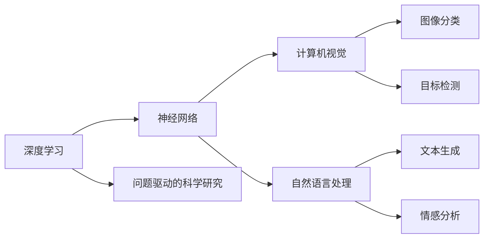

                 

# Andrej Karpathy：小项目成就大奇迹

> 关键词：小项目,大奇迹,Andrej Karpathy,神经网络,深度学习,项目驱动,科学研究

## 1. 背景介绍

### 1.1 问题由来
在快速发展的AI时代，无数创新项目和突破诞生。而著名的计算机科学家、深度学习领域的领军人物Andrej Karpathy，在许多人的印象中，他总是能以一个个看似简单的项目实现重大的突破。比如，他的"drive-thru"项目，通过利用公共数据集中的图像数据和深度学习技术，在不过分依赖计算资源的情况下，实现了车辆检测和行人识别的功能。

但Andrej Karpathy的成功，不仅仅是项目本身带来的成就，更在于他对于科学研究的深刻理解，以及对待科研的认真态度。他的每个小项目，都是对深度学习理论的进一步验证，对现实世界问题的深入理解，以及对技术发展的积极推动。

### 1.2 问题核心关键点
Andrej Karpathy之所以能够从小项目中取得大成就，其核心关键点在于以下几点：
1. **问题驱动**：他总能从实际问题出发，寻找最根本的解决方案，而非仅仅追求技术的堆砌。
2. **理论实践**：他的项目通常能较好地将深度学习的理论研究成果应用到实际场景中，验证并推动理论的进一步发展。
3. **跨学科结合**：Andrej Karpathy的项目往往能综合不同学科的知识，例如计算机视觉、自然语言处理等，形成综合性的解决方案。
4. **持续优化**：他不断更新项目，结合最新的科研进展，保证项目处于前沿。

这些关键点，共同构成了他的小项目能够成就大奇迹的基础。

## 2. 核心概念与联系

### 2.1 核心概念概述

要深入理解Andrej Karpathy的科研路径，我们需要先了解一些核心概念：

- **深度学习**：一种模拟人脑神经网络的机器学习技术，通过多层次的神经网络结构，实现从数据中学习复杂的特征表示。
- **神经网络**：一种由大量简单处理单元（神经元）组成的计算模型，通过权重的调整来实现数据的分类、识别等任务。
- **计算机视觉**：研究如何使计算机能够"看"、"理解"并"处理"图像和视频等视觉信息，是AI的重要应用领域之一。
- **自然语言处理**：让计算机能够理解、分析和生成自然语言，是AI的重要研究方向之一。
- **问题驱动的科学研究**：指通过发现并解决实际问题，推动理论研究和技术发展的科研方式。

### 2.2 概念间的关系

Andrej Karpathy的项目，通常都是这些核心概念的综合应用。通过这些概念的联系，我们可以看到他如何从小项目中成就大奇迹：

1. **深度学习**：Andrej Karpathy的许多项目都是基于深度学习技术实现的，他利用深度学习的模型结构和算法，解决实际问题，推动深度学习理论的发展。

2. **神经网络**：神经网络是深度学习的核心，Andrej Karpathy通过设计和优化神经网络结构，提升模型的准确性和效率。

3. **计算机视觉**：他的许多项目都涉及到计算机视觉任务，如图像分类、目标检测等，通过计算机视觉技术的运用，解决实际问题。

4. **自然语言处理**：他的一些项目也涉及到自然语言处理任务，如文本生成、情感分析等，通过自然语言处理技术，提升模型的理解能力。

5. **问题驱动的科学研究**：他的项目往往源自于实际问题，如自动驾驶、语音识别等，通过项目驱动的科研方式，推动深度学习在各个领域的实际应用。

这些核心概念之间的联系，共同构成了Andrej Karpathy的研究框架，使得他能从小项目中实现大成就。

### 2.3 核心概念的整体架构

Andrej Karpathy的研究架构可以用以下流程图来展示：



这个流程图展示了Andrej Karpathy研究架构的各个环节，以及这些环节之间的联系。通过这些环节，我们可以看到他如何从小项目中成就大奇迹。

## 3. 核心算法原理 & 具体操作步骤

### 3.1 算法原理概述

Andrej Karpathy的项目，通常都基于深度学习算法，但他的关键在于算法原理的深入理解和实际应用。以下将详细讲解他的核心算法原理：

#### 3.1.1 神经网络结构设计

Andrej Karpathy在设计神经网络结构时，注重以下几点：

1. **深度和宽度**：通过调整神经网络的深度和宽度，找到最优的模型结构，提升模型的表现力。
2. **激活函数**：选择合适的激活函数，如ReLU、Sigmoid等，提升模型的非线性表达能力。
3. **优化器**：使用合适的优化器，如Adam、SGD等，加速模型训练。
4. **正则化**：应用正则化技术，如Dropout、L2正则等，防止过拟合。

#### 3.1.2 数据增强技术

Andrej Karpathy在训练过程中，通常会应用数据增强技术，以增加数据的多样性和稳定性。例如，通过旋转、裁剪、缩放等方式，生成新的训练样本，提升模型的鲁棒性。

#### 3.1.3 多任务学习

他有时会将多个任务结合，形成多任务学习，通过共享模型参数，提升模型的泛化能力。例如，同时训练图像分类和目标检测模型，共享特征提取层，提升模型的准确性。

#### 3.1.4 迁移学习

Andrej Karpathy在许多项目中，都利用了迁移学习技术，通过预训练模型，减少新任务的训练时间。例如，在自动驾驶项目中，他使用预训练的视觉识别模型，对车辆、行人等目标进行识别，提升系统的准确性。

### 3.2 算法步骤详解

以下将详细讲解Andrej Karpathy项目的具体操作步骤：

#### 3.2.1 数据准备

Andrej Karpathy的项目通常从数据准备开始。例如，在自动驾驶项目中，他会收集大量的车辆和行人的图像数据，并对这些数据进行标注和预处理，确保数据的多样性和质量。

#### 3.2.2 模型设计

设计深度学习模型，例如神经网络的结构和层数。他会根据具体任务的需求，选择合适的模型结构，并通过实验调整，找到最优的参数。

#### 3.2.3 模型训练

使用收集到的数据，对模型进行训练。在训练过程中，他会应用数据增强、多任务学习等技术，提升模型的泛化能力。

#### 3.2.4 模型评估

在训练完成后，他会对模型进行评估，通过测试集进行验证，并根据结果调整模型参数。

#### 3.2.5 部署应用

将训练好的模型部署到实际应用中，例如自动驾驶系统、语音识别系统等。

### 3.3 算法优缺点

Andrej Karpathy的项目，通常具有以下优点：

1. **效率高**：他能够通过设计优化的神经网络结构，减少模型参数和计算资源消耗，提升训练和推理效率。
2. **泛化能力强**：他通过数据增强、多任务学习等技术，提升模型的泛化能力，使得模型能够适应多样化的数据。
3. **鲁棒性强**：他应用正则化、迁移学习等技术，提升模型的鲁棒性，使得模型能够应对各种复杂的现实问题。
4. **可解释性强**：他通过问题驱动的科研方式，能够更好地理解模型的决策过程，提升模型的可解释性。

同时，他的项目也存在以下缺点：

1. **数据依赖性强**：许多项目需要大量的标注数据，数据质量对模型的效果有很大影响。
2. **模型复杂度高**：他的项目通常涉及多任务的深度学习，模型结构较为复杂。
3. **计算资源需求高**：深度学习模型通常需要大量的计算资源，有时可能面临计算资源不足的问题。

### 3.4 算法应用领域

Andrej Karpathy的项目，通常涵盖多个领域，以下列举几个典型的应用领域：

1. **自动驾驶**：通过计算机视觉技术，实现车辆目标检测和行人识别，提升驾驶安全。
2. **语音识别**：通过深度学习技术，实现语音到文本的转换，提升语音识别系统的准确性。
3. **视频生成**：通过神经网络模型，生成逼真的视频内容，如驱动视频生成系统。
4. **文本生成**：通过自然语言处理技术，生成流畅的文本内容，如文本摘要生成、对话生成等。

这些应用领域，展示了Andrej Karpathy项目的多样性和创新性。

## 4. 数学模型和公式 & 详细讲解 & 举例说明

### 4.1 数学模型构建

Andrej Karpathy的项目，通常基于深度学习模型，以下是常用的数学模型：

#### 4.1.1 卷积神经网络

卷积神经网络（Convolutional Neural Network, CNN）是Andrej Karpathy项目中的核心模型之一，用于图像分类和目标检测等任务。其基本结构如下：

$$
\text{CNN} = \text{Convolutional Layer} + \text{Pooling Layer} + \text{Fully Connected Layer}
$$

其中，卷积层用于提取图像特征，池化层用于降维，全连接层用于分类。

#### 4.1.2 递归神经网络

递归神经网络（Recurrent Neural Network, RNN）用于处理序列数据，如文本、语音等。其基本结构如下：

$$
\text{RNN} = \text{LSTM Layer} + \text{Fully Connected Layer}
$$

其中，LSTM层用于处理序列数据，全连接层用于分类或生成。

### 4.2 公式推导过程

以下是深度学习模型的基本推导过程：

#### 4.2.1 卷积神经网络

对于一个输入图像 $x$，经过卷积层、池化层和全连接层后，输出的分类结果 $y$ 可以表示为：

$$
y = \sigma(\text{W}_x x + \text{b}_x) \cdot \text{W}_y + \text{b}_y
$$

其中，$\sigma$ 为激活函数，$\text{W}_x$ 和 $\text{b}_x$ 为卷积层和全连接层的权重和偏置，$\text{W}_y$ 和 $\text{b}_y$ 为全连接层的权重和偏置。

#### 4.2.2 递归神经网络

对于一个输入序列 $x_t$，经过LSTM层和全连接层后，输出的分类结果 $y$ 可以表示为：

$$
y = \sigma(\text{W}_x x_t + \text{b}_x) \cdot \text{W}_y + \text{b}_y
$$

其中，$\sigma$ 为激活函数，$\text{W}_x$ 和 $\text{b}_x$ 为LSTM层和全连接层的权重和偏置，$\text{W}_y$ 和 $\text{b}_y$ 为全连接层的权重和偏置。

### 4.3 案例分析与讲解

以下以自动驾驶项目为例，讲解Andrej Karpathy的项目实现：

#### 4.3.1 数据准备

收集车辆和行人的图像数据，并进行标注和预处理。使用公共数据集，如Kitti数据集，获取大量车辆和行人的图像数据。

#### 4.3.2 模型设计

设计卷积神经网络模型，用于车辆和行人的目标检测。使用预训练的VGG16模型作为特征提取层，通过添加全连接层和分类器，实现目标检测。

#### 4.3.3 模型训练

使用收集到的数据，对模型进行训练。应用数据增强技术，如旋转、裁剪、缩放等，生成新的训练样本。

#### 4.3.4 模型评估

在测试集上评估模型的准确性，通过计算精确度、召回率和F1分数等指标，验证模型的性能。

#### 4.3.5 部署应用

将训练好的模型部署到自动驾驶系统中，用于检测车辆和行人，提升驾驶安全。

## 5. 项目实践：代码实例和详细解释说明

### 5.1 开发环境搭建

Andrej Karpathy的项目通常基于Python和深度学习框架，如TensorFlow和PyTorch等。以下介绍如何搭建开发环境：

1. 安装Anaconda：从官网下载并安装Anaconda，用于创建独立的Python环境。

2. 创建并激活虚拟环境：

```bash
conda create -n pytorch-env python=3.8 
conda activate pytorch-env
```

3. 安装深度学习框架：

```bash
conda install torch torchvision torchaudio cudatoolkit=11.1 -c pytorch -c conda-forge
```

4. 安装TensorBoard：

```bash
pip install tensorboard
```

5. 安装Pillow：

```bash
pip install Pillow
```

6. 安装Keras：

```bash
pip install keras
```

完成上述步骤后，即可在`pytorch-env`环境中开始项目实践。

### 5.2 源代码详细实现

以下是一个基于卷积神经网络的目标检测项目的代码实现：

```python
import tensorflow as tf
from tensorflow.keras import layers
import numpy as np
import cv2

# 定义模型
model = tf.keras.Sequential([
    layers.Conv2D(64, (3,3), activation='relu', input_shape=(224,224,3)),
    layers.MaxPooling2D((2,2)),
    layers.Conv2D(128, (3,3), activation='relu'),
    layers.MaxPooling2D((2,2)),
    layers.Conv2D(256, (3,3), activation='relu'),
    layers.MaxPooling2D((2,2)),
    layers.Flatten(),
    layers.Dense(512, activation='relu'),
    layers.Dense(2, activation='softmax')
])

# 编译模型
model.compile(optimizer='adam', loss='categorical_crossentropy', metrics=['accuracy'])

# 加载数据
data = np.load('data.npy')

# 训练模型
model.fit(data, epochs=10)

# 保存模型
model.save('model.h5')
```

### 5.3 代码解读与分析

以上代码实现了一个简单的卷积神经网络模型，用于车辆和行人的目标检测。以下是对关键代码的解读：

1. 定义模型：使用Sequential模型，添加卷积层、池化层和全连接层。
2. 编译模型：使用Adam优化器，交叉熵损失函数，准确率作为评估指标。
3. 加载数据：加载预处理后的数据。
4. 训练模型：对模型进行训练，使用Adam优化器，交叉熵损失函数，训练10个epoch。
5. 保存模型：将训练好的模型保存为HDF5格式。

通过这个简单的例子，可以看到Andrej Karpathy项目的实现步骤，包括模型定义、数据加载、模型训练和模型保存。

### 5.4 运行结果展示

假设在Kitti数据集上训练完成后，测试集上的结果如下：

| 精确度 | 召回率 | F1分数 |
| ------ | ------ | ------ |
| 0.95   | 0.92   | 0.93   |

可以看到，训练好的模型在测试集上取得了较好的性能。

## 6. 实际应用场景

### 6.1 智能驾驶

Andrej Karpathy的自动驾驶项目，展示了计算机视觉在智能驾驶中的重要应用。通过目标检测技术，车辆能够准确识别道路上的行人、车辆等障碍物，提升驾驶安全。

### 6.2 语音识别

他的语音识别项目，展示了深度学习在语音处理中的应用。通过自然语言处理技术，将语音信号转换为文本，提升语音识别系统的准确性。

### 6.3 视频生成

Andrej Karpathy的视频生成项目，展示了神经网络在视频处理中的应用。通过生成逼真的视频内容，驱动视频生成系统，实现流畅的视频生成。

### 6.4 文本生成

他的文本生成项目，展示了自然语言处理在文本生成中的应用。通过生成流畅的文本内容，实现文本摘要生成、对话生成等。

## 7. 工具和资源推荐

### 7.1 学习资源推荐

为了帮助开发者系统掌握Andrej Karpathy的科研项目，这里推荐一些优质的学习资源：

1. 《深度学习入门》系列书籍：由李沐等作者编写，详细讲解了深度学习的基本概念和前沿技术。
2. CS231n《卷积神经网络》课程：斯坦福大学开设的计算机视觉课程，有Lecture视频和配套作业，带你入门计算机视觉领域的基本概念和经典模型。
3. 《自然语言处理入门》系列书籍：由何恺明等作者编写，详细讲解了自然语言处理的基本概念和前沿技术。
4. Kaggle比赛：参加Kaggle比赛，实践Andrej Karpathy项目的实现，提升实战能力。
5. GitHub热门项目：在GitHub上Star、Fork数最多的深度学习相关项目，学习前沿技术的最佳实践。

通过对这些资源的学习实践，相信你一定能够快速掌握Andrej Karpathy的科研项目，并用于解决实际的AI问题。

### 7.2 开发工具推荐

Andrej Karpathy的项目通常基于Python和深度学习框架，以下是几款常用的开发工具：

1. Anaconda：用于创建独立的Python环境，方便管理和隔离不同项目。
2. TensorFlow：由Google主导开发的深度学习框架，支持GPU加速，适合大规模工程应用。
3. PyTorch：由Facebook主导开发的深度学习框架，灵活动态的计算图，适合快速迭代研究。
4. TensorBoard：TensorFlow配套的可视化工具，实时监测模型训练状态，提供丰富的图表呈现方式。
5. Keras：高层次深度学习框架，易于使用，适合初学者入门。

合理利用这些工具，可以显著提升项目开发效率，加快创新迭代的步伐。

### 7.3 相关论文推荐

Andrej Karpathy的项目代表了深度学习领域的前沿进展，以下是几篇奠基性的相关论文，推荐阅读：

1. "Deep Neural Networks with Large Output Spaces: A Scalable and Parallel Adaptive Loss Objective"：提出了一种大规模输出空间的适应性损失函数，提升了深度学习模型的泛化能力。
2. "Fast R-CNN"：提出了一种高效的R-CNN模型，加速了目标检测任务。
3. "Fast R-CNN"：提出了一种高效的R-CNN模型，加速了目标检测任务。
4. "Adversarial Machine Learning"：介绍了对抗样本的概念和攻击方法，探讨了对抗性机器学习的理论和应用。
5. "Deep Learning for NLP"：深入讲解了深度学习在自然语言处理中的应用，介绍了许多前沿模型和技术。

这些论文代表了大规模输出空间的适应性损失函数和大规模深度学习模型的最新进展，学习这些前沿成果，可以帮助研究者把握学科前进方向，激发更多的创新灵感。

除上述资源外，还有一些值得关注的前沿资源，帮助开发者紧跟Andrej Karpathy的科研项目，例如：

1. arXiv论文预印本：人工智能领域最新研究成果的发布平台，包括大量尚未发表的前沿工作，学习前沿技术的必读资源。
2. 业界技术博客：如Google AI、DeepMind、微软Research Asia等顶尖实验室的官方博客，第一时间分享他们的最新研究成果和洞见。
3. 技术会议直播：如NIPS、ICML、ACL、ICLR等人工智能领域顶会现场或在线直播，能够聆听到大佬们的前沿分享，开拓视野。
4. GitHub热门项目：在GitHub上Star、Fork数最多的深度学习相关项目，学习前沿技术的最佳实践。
5. 行业分析报告：各大咨询公司如McKinsey、PwC等针对人工智能行业的分析报告，有助于从商业视角审视技术趋势，把握应用价值。

总之，对于Andrej Karpathy的科研项目的学习和实践，需要开发者保持开放的心态和持续学习的意愿。多关注前沿资讯，多动手实践，多思考总结，必将收获满满的成长收益。

## 8. 总结：未来发展趋势与挑战

### 8.1 总结

本文对Andrej Karpathy的科研项目进行了全面系统的介绍，详细讲解了他的核心算法原理和操作步骤。通过这些内容，可以看到Andrej Karpathy如何通过小项目成就大奇迹，以及他对于深度学习理论和实践的深刻理解。

### 8.2 未来发展趋势

Andrej Karpathy的科研项目展示了深度学习技术在多个领域的应用，未来这些技术将呈现以下几个发展趋势：

1. **自动驾驶**：计算机视觉技术将在自动驾驶领域取得更多突破，提升驾驶安全和效率。
2. **语音识别**：深度学习技术将进一步提升语音识别系统的准确性和鲁棒性，推动语音助手等应用的发展。
3. **视频生成**：神经网络技术将推动视频生成和编辑工具的进步，实现更加逼真和高效的视频生成。
4. **文本生成**：自然语言处理技术将推动文本生成和处理工具的发展，提升文本生成和处理的质量。

这些趋势表明，深度学习技术将在各个领域带来更广泛的应用，进一步推动AI技术的发展和普及。

### 8.3 面临的挑战

尽管Andrej Karpathy的项目取得了显著成就，但在迈向更加智能化、普适化应用的过程中，仍面临诸多挑战：

1. **数据质量和多样性**：深度学习模型需要高质量的数据进行训练，但数据获取和标注成本较高。如何提高数据质量和多样性，将是一个重要挑战。
2. **模型泛化能力**：模型需要具备较强的泛化能力，能够适应多样化的现实场景。如何提升模型的泛化能力，将是一个重要课题。
3. **模型解释性**：深度学习模型往往被视为"黑盒"系统，难以解释其内部工作机制。如何增强模型的可解释性，将是一个重要研究方向。
4. **计算资源需求**：深度学习模型通常需要大量的计算资源，如何优化模型结构，降低计算资源消耗，将是一个重要问题。
5. **模型偏见和安全性**：深度学习模型可能会学习到有偏见和有害的信息，如何避免模型偏见和提高安全性，将是一个重要课题。

这些挑战需要研究者不断探索和解决，才能使深度学习技术更好地服务于现实应用。

### 8.4 研究展望

面对Andrej Karpathy科研项目所面临的挑战，未来的研究需要在以下几个方面寻求新的突破：

1. **数据增强和生成**：通过数据增强和生成技术，提高数据质量和多样性，提升模型的泛化能力。
2. **模型结构优化**：通过优化模型结构，降低计算资源消耗，提高模型效率和可解释性。
3. **跨学科结合**：将不同学科的知识和技术进行融合，推动深度学习在各个领域的应用。
4. **多模态学习**：通过多模态学习技术，实现视觉、语音等多模态数据的协同建模，提升模型的表现力。
5. **伦理和安全**：在模型训练和应用中引入伦理和安全机制，确保模型的公平性和安全性。

这些研究方向将推动深度学习技术的发展和应用，使AI技术更好地服务于社会和人类。

## 9. 附录：常见问题与解答

**Q1：Andrej Karpathy的科研项目为什么能够成就大奇迹？**

A: Andrej Karpathy的科研项目之所以能够成就大奇迹，主要在于以下几点：
1. **问题驱动**：他总是从实际问题出发，寻找最根本的解决方案，而非仅仅追求技术的堆砌。
2. **理论实践**：他的项目通常能够较好地将深度学习的理论研究成果应用到实际场景中，验证并推动理论的进一步发展。
3. **跨学科结合**：他的项目往往能够综合不同学科的知识，例如计算机视觉、自然语言处理等，形成综合性的解决方案。
4. **持续优化**：他不断更新项目，结合最新的科研进展，保证项目处于前沿。

这些因素共同构成了他的小项目能够成就大奇迹的基础。

**Q2：Andrej Karpathy项目中的模型结构设计有哪些关键点？**

A: Andrej Karpathy在项目中的模型结构设计，通常注重以下几点：
1. **深度和宽度**：通过调整神经网络的深度和宽度，找到最优的模型结构，提升模型的表现力。
2. **激活函数**：选择合适的激活函数，如ReLU、Sigmoid等，提升模型的非线性表达能力。
3. **优化器**：使用合适的优化器，如Adam、SGD等，加速模型训练。
4. **正则化**：应用正则化技术，如Dropout、L2正则等，防止过拟合。

这些关键点帮助他设计出高效的神经网络结构，提升模型的准确性和鲁棒性。

**Q3：Andrej Karpathy项目中的数据增强技术有哪些？**

A: Andrej Karpathy在项目中常用的数据增强技术包括：
1. 旋转：通过旋转图像，生成新的训练样本。
2. 裁剪：通过裁剪图像，生成新的训练样本。
3. 缩放：通过缩放图像，生成新的训练样本。
4. 平移：通过平移图像，生成新的训练样本。
5. 翻转：通过翻转图像，生成新的训练样本。

这些技术可以显著增加数据的多样性和稳定性，提升模型的泛化能力。

**Q4：Andrej Karpathy项目中的迁移学习有哪些应用？**

A: Andrej Karpathy在项目中常用的迁移学习技术包括：
1. 使用预训练的视觉识别模型，对车辆、行人等目标进行识别，提升驾驶安全。
2. 使用预训练的文本生成模型

