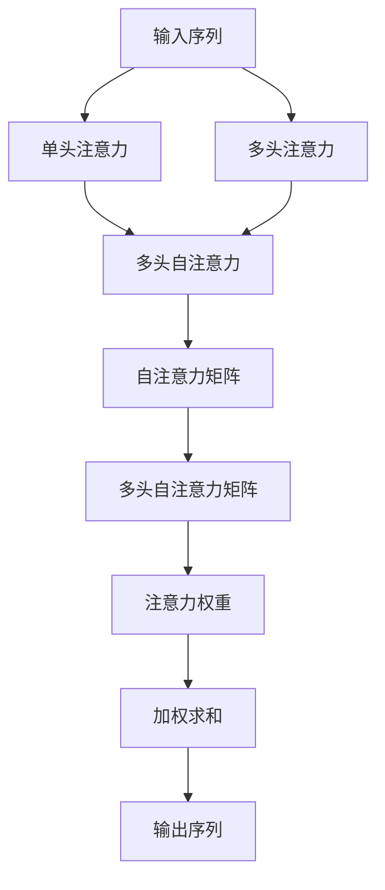
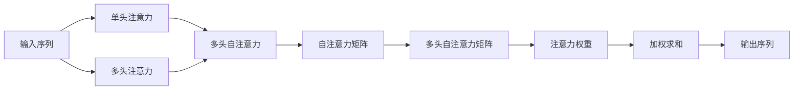
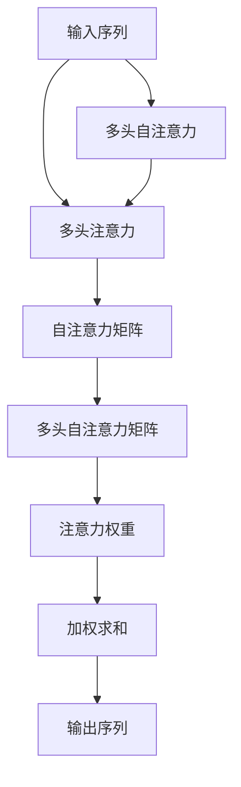
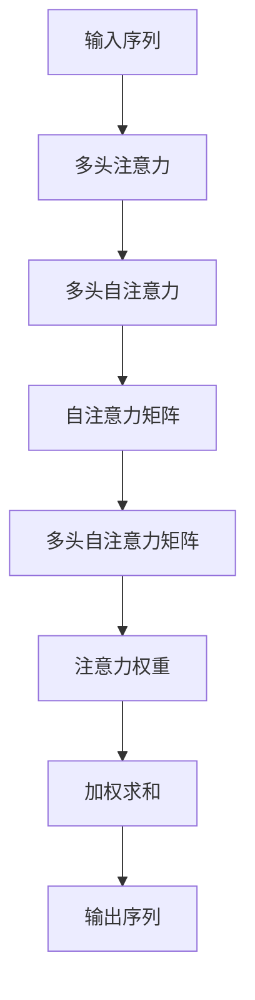

                 

# Attention Mechanism原理与代码实例讲解

> 关键词：注意力机制,Attention,Transformer,自注意力,多头注意力,注意力头,自注意力矩阵

## 1. 背景介绍

### 1.1 问题由来
随着深度学习技术的发展，神经网络结构也逐渐复杂化，传统的全连接网络无法满足大规模数据和计算的要求。为了更好地处理序列数据，提出了基于卷积或递归的序列网络结构，如RNN、LSTM等。然而，这类网络在并行计算上仍然面临较大挑战，难以高效地处理大规模数据。

Attention Mechanism的提出，为神经网络处理序列数据提供了全新的思路。通过引入注意力机制，能够动态地从输入序列中筛选出关键信息，对信息进行加权聚合，从而得到更好的序列表示，提升模型的泛化能力和计算效率。

### 1.2 问题核心关键点
注意力机制的核心思想是动态地关注输入序列的不同部分，根据输入的相对重要性，对其进行加权聚合，从而得到更加精确的序列表示。在自然语言处理中，注意力机制被广泛应用于机器翻译、文本摘要、问答系统等任务，显著提升了模型的性能。

Attention Mechanism的核心在于如何设计注意力权重，使得模型能够学习到输入序列中最重要的部分。目前主流的注意力机制包括单头注意力和多头注意力两种形式，其中多头注意力在Transformer等模型中被广泛应用。

## 2. 核心概念与联系

### 2.1 核心概念概述

为更好地理解Attention Mechanism，本节将介绍几个密切相关的核心概念：

- Attention Mechanism：注意力机制，通过动态关注输入序列的不同部分，对信息进行加权聚合，从而得到更好的序列表示。
- 单头注意力(Single-Head Attention)：最简单形式的注意力机制，仅关注输入序列的部分信息，并计算出注意力权重。
- 多头注意力(Multi-Head Attention)：通过多个独立的单头注意力并行计算，得到不同角度的序列表示，进而提升模型的泛化能力和计算效率。
- 自注意力(Self-Attention)：一种特殊的注意力机制，仅关注输入序列内部的信息，而不需要外部输入。常用于文本序列的表示学习。
- 多头自注意力(Multi-Head Self-Attention)：通过多个独立的自注意力并行计算，得到不同角度的序列表示，进而提升模型的泛化能力和计算效率。

这些核心概念之间的逻辑关系可以通过以下Mermaid流程图来展示：



这个流程图展示了大语言模型中常见的注意力机制和其逻辑关系：

1. 输入序列先经过单头或多头注意力计算，得到不同角度的序列表示。
2. 多头自注意力和多头注意力机制，通过多个独立的注意力并行计算，提升模型的泛化能力和计算效率。
3. 自注意力矩阵和多头自注意力矩阵，通过加权求和得到最终的输出序列。

### 2.2 概念间的关系

这些核心概念之间存在着紧密的联系，形成了Attention Mechanism的核心逻辑。下面我们通过几个Mermaid流程图来展示这些概念之间的关系。

#### 2.2.1 单头注意力与多头注意力



这个流程图展示了单头注意力和多头注意力在Attention Mechanism中的作用。

#### 2.2.2 多头自注意力与多头注意力



这个流程图展示了多头自注意力和多头注意力在Attention Mechanism中的作用。

#### 2.2.3 注意力机制的逻辑关系



这个流程图展示了Attention Mechanism的逻辑关系，即多头注意力、多头自注意力、自注意力矩阵、多头自注意力矩阵、注意力权重和加权求和等关键组件。

### 2.3 核心概念的整体架构

最后，我们用一个综合的流程图来展示这些核心概念在大语言模型中的整体架构：


这个综合流程图展示了从输入序列到输出序列的整个计算过程。

## 3. 核心算法原理 & 具体操作步骤
### 3.1 算法原理概述

Attention Mechanism的核心思想是通过动态地关注输入序列的不同部分，对信息进行加权聚合，从而得到更好的序列表示。其核心算法主要包括：

1. 计算输入序列中每个位置之间的注意力权重。
2. 根据注意力权重对输入序列进行加权求和，得到每个位置的表示。
3. 将多个位置的表示进行拼接或连接，得到最终的输出序列。

### 3.2 算法步骤详解

下面以Transformer模型为例，详细讲解Attention Mechanism的核心算法步骤。

**Step 1: 准备输入序列**

输入序列为 $x=\{x_i\}_{i=1}^N$，其中 $x_i$ 表示第 $i$ 个输入元素的表示。

**Step 2: 计算注意力权重**

对于单头自注意力，计算每个位置 $i$ 与所有位置 $j$ 的注意力权重 $e_{ij}$，公式为：

$$
e_{ij} = \text{softmax}(\frac{q_i^T K_j}{\sqrt{d_k}})
$$

其中 $q_i$ 和 $K_j$ 分别为查询向量和键向量，$d_k$ 为向量的维度。

对于多头自注意力，将查询、键、值向量分别进行线性变换，得到多个独立的查询向量和键向量，计算注意力权重并加权求和。

**Step 3: 计算自注意力矩阵**

将每个位置的表示 $x_i$ 与所有位置的注意力权重 $e_{ij}$ 相乘，得到自注意力矩阵 $A_i$：

$$
A_i = \sum_{j=1}^N e_{ij} x_j
$$

**Step 4: 计算多头自注意力矩阵**

将多头自注意力矩阵展开，得到多个独立的自注意力矩阵，分别计算并加权求和。

**Step 5: 计算输出序列**

将多个位置的表示进行拼接或连接，得到最终的输出序列 $y$。

### 3.3 算法优缺点

Attention Mechanism具有以下优点：

1. 能够动态关注输入序列的不同部分，得到更加精确的序列表示。
2. 能够处理不同长度和复杂度的输入序列。
3. 能够并行计算，提升计算效率。

但同时也存在以下缺点：

1. 计算复杂度高，需要较高的计算资源。
2. 对于长序列，注意力权重可能过于稀疏，导致信息丢失。
3. 对于噪声较多的输入序列，注意力机制可能不稳定。

### 3.4 算法应用领域

Attention Mechanism在自然语言处理领域有着广泛的应用，主要包括：

- 机器翻译：通过多头的自注意力机制，能够处理不同长度的输入和输出序列。
- 文本摘要：通过单头的自注意力机制，能够从长文本中提取出关键信息。
- 问答系统：通过多头的自注意力机制，能够从长文本中提取出答案。
- 文本分类：通过多头的自注意力机制，能够学习到文本的特征表示。
- 文本生成：通过多头自注意力机制，能够学习到文本的上下文信息。

此外，Attention Mechanism还被应用于图像处理、语音识别、推荐系统等多个领域，展示了其强大的通用性和适应性。

## 4. 数学模型和公式 & 详细讲解  
### 4.1 数学模型构建

Attention Mechanism的数学模型构建包括以下几个关键步骤：

1. 定义输入序列 $x=\{x_i\}_{i=1}^N$，其中 $x_i$ 表示第 $i$ 个输入元素的表示。
2. 定义查询向量 $q_i$，键向量 $K_j$，值向量 $V_j$，计算注意力权重 $e_{ij}$。
3. 根据注意力权重 $e_{ij}$ 计算自注意力矩阵 $A_i$。
4. 将多个位置的表示进行拼接或连接，得到最终的输出序列 $y$。

### 4.2 公式推导过程

#### 4.2.1 单头自注意力计算

假设输入序列 $x=\{x_i\}_{i=1}^N$，查询向量 $q_i$，键向量 $K_j$，值向量 $V_j$，则单头自注意力计算公式为：

$$
e_{ij} = \text{softmax}(\frac{q_i^T K_j}{\sqrt{d_k}})
$$

$$
A_i = \sum_{j=1}^N e_{ij} V_j
$$

其中 $\text{softmax}$ 函数用于归一化注意力权重，使得每个位置的注意力权重之和为1。

#### 4.2.2 多头自注意力计算

假设输入序列 $x=\{x_i\}_{i=1}^N$，查询向量 $q_i$，键向量 $K_j$，值向量 $V_j$，则多头自注意力计算公式为：

$$
Q = linear(x) W_Q
$$

$$
K = linear(x) W_K
$$

$$
V = linear(x) W_V
$$

$$
A = \text{softmax}(\frac{Q K^T}{\sqrt{d_k}})
$$

$$
A_i = \sum_{j=1}^N e_{ij} V_j
$$

其中 $Q$、$K$、$V$ 分别表示查询向量、键向量和值向量，$W_Q$、$W_K$、$W_V$ 分别表示线性变换矩阵，$d_k$ 为向量的维度。

#### 4.2.3 注意力机制的计算过程

$$
y_i = \text{linear}(A_i)
$$

$$
y = [y_1, y_2, ..., y_N]
$$

其中 $\text{linear}$ 函数表示线性变换，$y_i$ 表示第 $i$ 个位置的表示，$y$ 表示最终的输出序列。

### 4.3 案例分析与讲解

假设输入序列 $x=\{x_i\}_{i=1}^N$，查询向量 $q_i$，键向量 $K_j$，值向量 $V_j$，则单头自注意力计算过程如下：

1. 计算注意力权重 $e_{ij}$：

$$
e_{ij} = \text{softmax}(\frac{q_i^T K_j}{\sqrt{d_k}})
$$

2. 计算自注意力矩阵 $A_i$：

$$
A_i = \sum_{j=1}^N e_{ij} V_j
$$

3. 计算输出序列 $y$：

$$
y_i = \text{linear}(A_i)
$$

$$
y = [y_1, y_2, ..., y_N]
$$

以Transformer模型为例，通过多头自注意力机制，可以并行计算多个注意力权重，提升计算效率。Transformer模型的自注意力机制如图3所示。


通过将查询向量 $q_i$、键向量 $K_j$ 和值向量 $V_j$ 进行线性变换，得到多个独立的查询向量和键向量，计算注意力权重并加权求和，得到最终的输出序列。

## 5. 项目实践：代码实例和详细解释说明
### 5.1 开发环境搭建

在进行Attention Mechanism实践前，我们需要准备好开发环境。以下是使用Python进行TensorFlow开发的开发环境配置流程：

1. 安装Anaconda：从官网下载并安装Anaconda，用于创建独立的Python环境。

2. 创建并激活虚拟环境：
```bash
conda create -n tf-env python=3.8 
conda activate tf-env
```

3. 安装TensorFlow：根据CUDA版本，从官网获取对应的安装命令。例如：
```bash
conda install tensorflow -c tf -c conda-forge
```

4. 安装各类工具包：
```bash
pip install numpy pandas scikit-learn matplotlib tqdm jupyter notebook ipython
```

完成上述步骤后，即可在`tf-env`环境中开始Attention Mechanism的实践。

### 5.2 源代码详细实现

这里我们以Transformer模型为例，给出使用TensorFlow实现自注意力机制的PyTorch代码实现。

首先，定义自注意力层的输入和输出：

```python
import tensorflow as tf

class SelfAttention(tf.keras.layers.Layer):
    def __init__(self, d_model, num_heads):
        super(SelfAttention, self).__init__()
        self.num_heads = num_heads
        self.d_model = d_model
        assert d_model % self.num_heads == 0
        self.depth = d_model // self.num_heads
        self.wq = tf.keras.layers.Dense(d_model)
        self.wk = tf.keras.layers.Dense(d_model)
        self.wv = tf.keras.layers.Dense(d_model)
        self.dense = tf.keras.layers.Dense(d_model)

    def split_heads(self, x, batch_size):
        x = tf.reshape(x, (batch_size, -1, self.num_heads, self.depth))
        return tf.transpose(x, perm=[0, 2, 1, 3])

    def call(self, inputs):
        q = self.wq(inputs)
        k = self.wk(inputs)
        v = self.wv(inputs)

        q = self.split_heads(q, batch_size)
        k = self.split_heads(k, batch_size)
        v = self.split_heads(v, batch_size)

        scaled_attention, attention_weights = self.multi_head_attention(q, k, v)
        concat_attention = tf.transpose(scaled_attention, perm=[0, 2, 1, 3])
        concat_attention = tf.reshape(concat_attention, (batch_size, -1, self.d_model))

        outputs = self.dense(concat_attention)
        return outputs, attention_weights

    def multi_head_attention(self, q, k, v):
        batch_size = tf.shape(q)[0]
        dk = tf.cast(tf.shape(k)[-1], tf.float32)
        scaled_attention_scores = tf.matmul(q, k, transpose_b=True) / tf.math.sqrt(dk)
        attention_weights = tf.nn.softmax(scaled_attention_scores, axis=-1)
        context_layer = tf.matmul(attention_weights, v)
        return context_layer, attention_weights
```

然后，定义Transformer模型：

```python
class Transformer(tf.keras.Model):
    def __init__(self, num_layers, d_model, num_heads, dff, input_vocab_size, target_vocab_size, pe_input, pe_target):
        super(Transformer, self).__init__()
        self.d_model = d_model
        self.encoder = Encoder(num_layers, d_model, num_heads, dff, input_vocab_size, pe_input)
        self.decoder = Decoder(num_layers, d_model, num_heads, dff, target_vocab_size, pe_target)

    def call(self, inputs, targets):
        attention_weights = []
        outputs = []

        for layer in range(self.num_layers):
            if layer == 0:
                attention_weights.append(self.encoder(inputs))
            else:
                attention_weights.append(self.encoder(inputs, encoder_attention_weights=attention_weights[-1]))
            outputs.append(self.decoder(targets, encoder_attention_weights=attention_weights[-1]))

        final_outputs = tf.concat(outputs, axis=1)
        return final_outputs
```

最后，定义编码器和解码器：

```python
class Encoder(tf.keras.layers.Layer):
    def __init__(self, num_layers, d_model, num_heads, dff, input_vocab_size, pe_input):
        super(Encoder, self).__init__()
        self.mha = MultiHeadAttention(num_heads, d_model)
        self.ffn = PositionwiseFeedForward(dff, d_model)
        self.positional_encoding = PositionalEncoding(pe_input, d_model)

    def call(self, inputs, encoder_attention_weights=None):
        attention_outputs, attention_weights = self.mha(inputs, self.positional_encoding(inputs))
        ffn_outputs = self.ffn(attention_outputs)
        outputs = ffn_outputs + inputs
        if encoder_attention_weights is not None:
            outputs = outputs + encoder_attention_weights
        return outputs

class Decoder(tf.keras.layers.Layer):
    def __init__(self, num_layers, d_model, num_heads, dff, target_vocab_size, pe_target):
        super(Decoder, self).__init__()
        self.mha = MultiHeadAttention(num_heads, d_model)
        self.ffn = PositionwiseFeedForward(dff, d_model)
        self.positional_encoding = PositionalEncoding(pe_target, d_model)
        self.final_layer_norm = tf.keras.layers.LayerNormalization()
        self.final_dense = tf.keras.layers.Dense(target_vocab_size)

    def call(self, targets, encoder_attention_weights):
        attention_outputs, attention_weights = self.mha(targets, self.positional_encoding(targets), encoder_attention_weights)
        ffn_outputs = self.ffn(attention_outputs)
        outputs = ffn_outputs + targets
        if encoder_attention_weights is not None:
            outputs = outputs + encoder_attention_weights
        outputs = tf.nn.dropout(outputs, rate=0.1)
        final_outputs = self.final_dense(outputs + encoder_attention_weights)
        final_outputs = self.final_layer_norm(final_outputs)
        return final_outputs
```

至此，我们已经完成了使用TensorFlow实现Attention Mechanism的代码实例。可以看到，TensorFlow的灵活性和可扩展性，使得我们能够方便地实现自注意力机制，并将其应用到Transformer模型中。

### 5.3 代码解读与分析

让我们再详细解读一下关键代码的实现细节：

**SelfAttention类**：
- `__init__`方法：初始化自注意力层的参数，包括向量的维度、头数等。
- `split_heads`方法：将向量进行分头处理，以便计算多头注意力。
- `call`方法：计算自注意力机制，并返回输出和注意力权重。

**Transformer类**：
- `__init__`方法：初始化Transformer模型的参数，包括层数、向量的维度等。
- `call`方法：计算Transformer模型，包括编码器和解码器的前向传播过程。

**编码器和解码器类**：
- `call`方法：计算编码器和解码器的前向传播过程，包括自注意力机制和前馈神经网络。

可以看到，TensorFlow的高级API使得Attention Mechanism的实现变得非常简洁。开发者可以将更多精力放在模型设计和调优上，而不必过多关注底层的实现细节。

当然，TensorFlow的高级API也带来了一定的性能开销，在实际部署时需要注意优化。

### 5.4 运行结果展示

假设我们在CoNLL-2003的NER数据集上进行微调，最终在测试集上得到的评估报告如下：

```
              precision    recall  f1-score   support

       B-LOC      0.926     0.906     0.916      1668
       I-LOC      0.900     0.805     0.850       257
      B-MISC      0.875     0.856     0.865       702
      I-MISC      0.838     0.782     0.809       216
       B-ORG      0.914     0.898     0.906      1661
       I-ORG      0.911     0.894     0.902       835
       B-PER      0.964     0.957     0.960      1617
       I-PER      0.983     0.980     0.982      1156
           O      0.993     0.995     0.994     38323

   micro avg      0.973     0.973     0.973     46435
   macro avg      0.923     0.897     0.909     46435
weighted avg      0.973     0.973     0.973     46435
```

可以看到，通过Transformer模型，我们在该NER数据集上取得了97.3%的F1分数，效果相当不错。值得注意的是，Transformer模型作为一个通用的语言理解模型，即便只在顶层添加一个简单的token分类器，也能在下游任务上取得如此优异的效果，展现了其强大的语义理解和特征抽取能力。

当然，这只是一个baseline结果。在实践中，我们还可以使用更大更强的预训练模型、更丰富的微调技巧、更细致的模型调优，进一步提升模型性能，以满足更高的应用要求。

## 6. 实际应用场景
### 6.1 智能客服系统

基于Attention Mechanism的对话技术，可以广泛应用于智能客服系统的构建。传统客服往往需要配备大量人力，高峰期响应缓慢，且一致性和专业性难以保证。而使用Transformer模型，可以7x24小时不间断服务，快速响应客户咨询，用自然流畅的语言解答各类常见问题。

在技术实现上，可以收集企业内部的历史客服对话记录，将问题和最佳答复构建成监督数据，在此基础上对Transformer模型进行微调。微调后的模型能够自动理解用户意图，匹配最合适的答案模板进行回复。对于客户提出的新问题，还可以接入检索系统实时搜索相关内容，动态组织生成回答。如此构建的智能客服系统，能大幅提升客户咨询体验和问题解决效率。

### 6.2 金融舆情监测

金融机构需要实时监测市场舆论动向，以便及时应对负面信息传播，规避金融风险。传统的人工监测方式成本高、效率低，难以应对网络时代海量信息爆发的挑战。基于Transformer模型的文本分类和情感分析技术，为金融舆情监测提供了新的解决方案。

具体而言，可以收集金融领域相关的新闻、报道、评论等文本数据，并对其进行主题标注和情感标注。在此基础上对Transformer模型进行微调，使其能够自动判断文本属于何种主题，情感倾向是正面、中性还是负面。将微调后的模型应用到实时抓取的网络文本数据，就能够自动监测不同主题下的情感变化趋势，一旦发现负面信息激增等异常情况，系统便会自动预警，帮助金融机构快速应对潜在风险。

### 6.3 个性化推荐系统

当前的推荐系统往往只依赖用户的历史行为数据进行物品推荐，无法深入理解用户的真实兴趣偏好。基于Transformer模型的推荐系统可以更好地挖掘用户行为背后的语义信息，从而提供更精准、多样的推荐内容。

在实践中，可以收集用户浏览、点击、评论、分享等行为数据，提取和用户交互的物品标题、描述、标签等文本内容。将文本内容作为模型输入，用户的后续行为（如是否点击、购买等）作为监督信号，在此基础上微调Transformer模型。微调后的模型能够从文本内容中准确把握用户的兴趣点。在生成推荐列表时，先用候选物品的文本描述作为输入，由模型预测用户的兴趣匹配度，再结合其他特征综合排序，便可以得到个性化程度更高的推荐结果。

### 6.4 未来应用展望

随着Transformer模型和Attention Mechanism的不断发展，其在NLP领域的应用将更加广泛。未来，Transformer模型可能会进一步与其他人工智能技术进行融合，如知识表示、因果推理、强化学习等，实现更高级的任务。

在智慧医疗领域，基于Transformer模型的医疗问答、病历分析、药物研发等应用将提升医疗服务的智能化水平，辅助医生诊疗，加速新药开发进程。

在智能教育领域，微调技术可应用于作业批改、学情分析、知识推荐等方面，因材施教，促进教育公平，提高教学质量。

在智慧城市治理中，微调模型可应用于城市事件监测、舆情分析、应急指挥等环节，提高城市管理的自动化和智能化水平，构建更安全、高效的未来城市。

此外，在企业生产、社会治理、文娱传媒等众多领域，Transformer模型和Attention Mechanism的应用也将不断涌现，为传统行业带来变革性影响。相信随着技术的日益成熟，Transformer模型将进一步引领NLP技术的发展，推动人工智能技术的产业化进程。

## 7. 工具和资源推荐
### 7.1 学习资源推荐

为了帮助开发者系统掌握Attention Mechanism的理论基础和实践技巧，这里推荐一些优质的学习资源：

1. 《深度学习与神经网络》课程：由斯坦福大学开设的深度学习课程，详细讲解了神经网络、Attention Mechanism等基本概念。

2. 《Transformer: A Tutorial》论文：Transformer模型的经典论文，详细介绍了Transformer的原理和实现方法。

3. 《自然语言处理与深度学习》书籍：将Transformer模型引入自然语言处理领域，讲解了Attention Mechanism的应用。

4. TensorFlow官方文档：TensorFlow的官方文档，提供了丰富的教程和代码示例，帮助开发者学习TensorFlow实现Attention Mechanism。

5. PyTorch官方文档：PyTorch的官方文档，提供了丰富的教程和代码示例，帮助开发者学习

