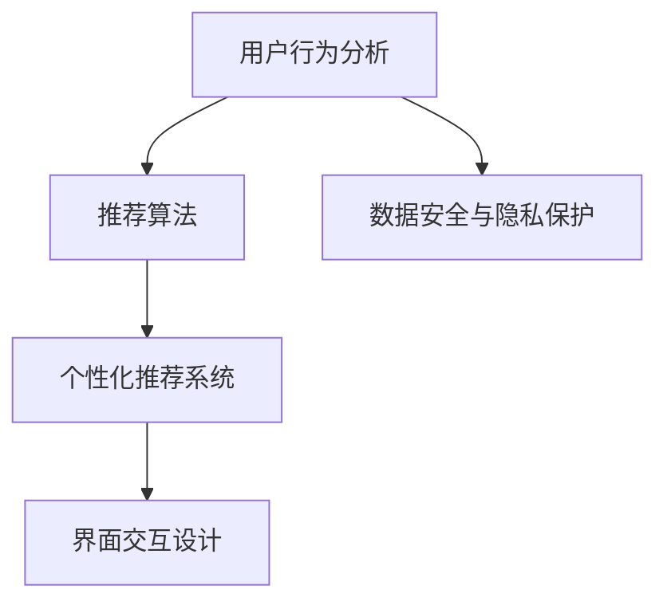
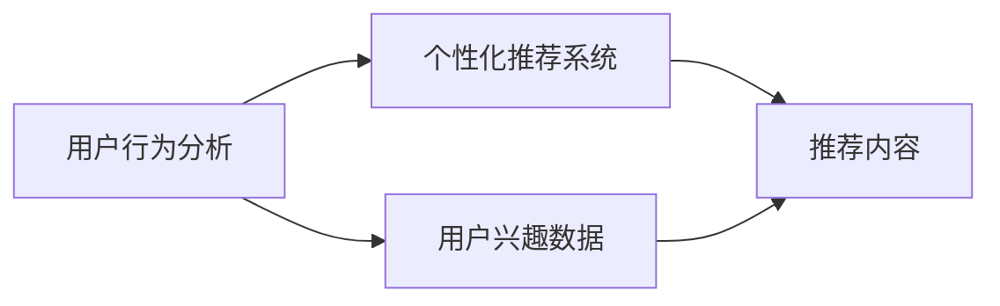
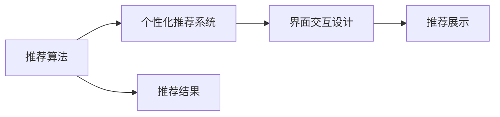
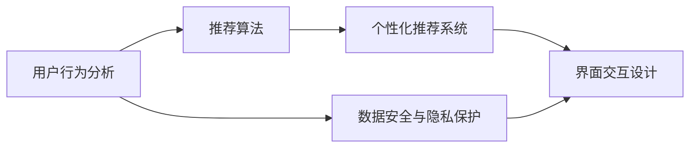

                 

## 1. 背景介绍

随着智能交互技术的发展，诸如智能语音助手、智能音箱、智能家居等人机交互界面(CUI)变得越来越普及，逐渐成为人们日常生活的常态。CUI不仅使得与设备的交互更加自然和高效，还为人工智能落地应用提供了广阔的舞台。在CUI领域，个性化推荐系统的研究和应用尤为重要。通过个性化的推荐，CUI能够根据用户的行为和兴趣，为用户提供定制化的服务，从而提升用户体验和系统的智能化水平。

### 1.1 问题由来
在CUI中，个性化推荐系统主要解决以下问题：
- **推荐内容的个性化**：用户希望在CUI中获取与自己兴趣相关的内容，推荐系统需通过用户历史行为、兴趣标签等数据进行个性化推荐。
- **交互界面的友好性**：交互界面需清晰、易用、直观，便于用户理解并快速进行操作。
- **系统响应的高效性**：CUI的响应速度需满足用户期待，避免因延迟导致的用户体验下降。
- **安全性和隐私保护**：用户的敏感数据需得到保护，推荐系统需在保障数据安全的前提下进行用户行为分析和个性化推荐。

### 1.2 问题核心关键点
在CUI中，推荐系统需兼顾内容个性化、界面友好、响应高效和安全隐私，同时确保推荐效果和用户体验。关键点如下：

1. **推荐算法**：推荐算法需综合考虑用户历史行为、兴趣偏好、实时反馈等多种因素，进行精准推荐。
2. **界面设计**：界面设计需简化用户操作路径，提高交互效率，确保用户能快速获取所需信息。
3. **实时处理**：推荐系统需具备高实时性，能够根据用户即时反馈调整推荐内容。
4. **安全隐私**：推荐系统需确保用户数据安全，避免数据泄露和滥用。

### 1.3 问题研究意义
个性化推荐系统的研究和应用，对于提升CUI的用户体验和智能化水平具有重要意义：

1. **提高用户满意度**：通过个性化推荐，满足用户特定需求，提升用户使用CUI的满意度。
2. **优化用户行为**：精准的推荐有助于引导用户进行有价值的行为，增加用户粘性。
3. **促进业务增长**：通过推荐系统提高用户活跃度，带来更多的商业机会和收益。
4. **数据驱动决策**：推荐系统通过分析用户行为数据，为业务运营提供数据支撑和决策参考。
5. **增强系统智能化**：推荐系统与自然语言处理、计算机视觉等技术结合，进一步提升CUI的智能化水平。

## 2. 核心概念与联系

### 2.1 核心概念概述

为更好地理解个性化推荐系统在CUI中的应用，本节将介绍几个密切相关的核心概念：

- **个性化推荐系统**：根据用户历史行为、兴趣偏好等数据，为用户推荐符合其需求的内容或产品，提升用户体验的技术系统。
- **用户行为分析**：通过记录和分析用户的行为数据，提取用户兴趣和偏好，为推荐系统提供数据基础。
- **推荐算法**：选择合适的推荐算法模型，如协同过滤、矩阵分解、深度学习等，进行内容推荐。
- **界面交互设计**：设计友好、直观的交互界面，使用户能够方便地获取推荐内容。
- **数据安全与隐私保护**：确保用户数据在收集、存储、处理过程中得到安全保护，防止数据泄露和滥用。

这些核心概念之间的逻辑关系可以通过以下Mermaid流程图来展示：



这个流程图展示了从用户行为分析到推荐系统，再到界面交互设计的整体流程。

### 2.2 概念间的关系

这些核心概念之间存在着紧密的联系，形成了个性化推荐系统在CUI中的完整生态系统。下面我们通过几个Mermaid流程图来展示这些概念之间的关系。

#### 2.2.1 个性化推荐系统与用户行为分析的关系



这个流程图展示了用户行为分析与个性化推荐系统的关系。用户行为分析通过提取用户历史行为数据，生成用户兴趣标签，供推荐系统进行内容推荐。

#### 2.2.2 个性化推荐算法与界面交互设计的关系



这个流程图展示了推荐算法与界面交互设计的关系。推荐算法生成推荐结果后，通过界面交互设计呈现给用户，用户通过交互界面进行反馈和操作。

#### 2.2.3 数据安全与隐私保护在个性化推荐中的应用



这个流程图展示了数据安全与隐私保护在个性化推荐系统中的应用。用户行为分析收集的数据需经过安全处理，确保用户隐私得到保护。

### 2.3 核心概念的整体架构

最后，我们用一个综合的流程图来展示这些核心概念在个性化推荐系统中的整体架构：


这个综合流程图展示了从用户行为分析到推荐系统，再到界面交互设计的完整过程，以及数据安全与隐私保护在其中的应用。

## 3. 核心算法原理 & 具体操作步骤

### 3.1 算法原理概述

在CUI中的个性化推荐系统，主要通过用户行为分析生成用户兴趣模型，然后根据该模型对新输入数据进行推荐。推荐算法通常包括协同过滤、基于内容的推荐、矩阵分解等。这里以协同过滤算法为例，简要说明其原理。

协同过滤算法基于用户行为相似度进行推荐，其核心思想是寻找与目标用户兴趣相似的其他用户，然后根据这些相似用户的偏好，推荐其可能喜欢的物品。具体来说，协同过滤算法分为基于用户的协同过滤和基于物品的协同过滤两种。基于用户的协同过滤算法通过计算用户之间行为相似度，为每个用户生成推荐列表。基于物品的协同过滤算法通过计算物品之间的相似度，为每个物品生成推荐列表。

### 3.2 算法步骤详解

协同过滤算法的具体步骤如下：

1. **数据准备**：准备用户行为数据，通常包括用户ID、物品ID、评分等字段。
2. **数据预处理**：对原始数据进行清洗、归一化等预处理，确保数据质量。
3. **计算用户相似度**：通过余弦相似度、皮尔逊相关系数等方法计算用户之间的行为相似度。
4. **生成推荐列表**：根据相似度计算结果，为每个用户生成推荐列表。

下面通过具体代码示例，展示如何使用Python和Scikit-learn库实现协同过滤算法：

```python
from sklearn.metrics.pairwise import cosine_similarity
import pandas as pd

# 读取用户行为数据
data = pd.read_csv('user_behavior.csv')

# 预处理数据
data = data.dropna()  # 删除缺失值
data = data.drop_duplicates()  # 去重

# 计算用户相似度
user_similarity = cosine_similarity(data[['user_id', 'item_id']])

# 生成推荐列表
def generate_recommendation(user_id, top_n=5):
    similar_users = np.argsort(user_similarity[user_id])[::-1]  # 按相似度排序
    recommended_items = []
    for user in similar_users[1:]:  # 排除自身
        recommended_items.extend(data[data['user_id'] == user]['item_id'].values)
    return list(set(recommended_items) - set(data[data['user_id'] == user_id]['item_id'].values))[:top_n]

# 获取推荐结果
user_id = 1
recommendations = generate_recommendation(user_id)
print(f"User {user_id}'s recommendations: {recommendations}")
```

### 3.3 算法优缺点

协同过滤算法的主要优点在于不需要显式地建立用户-物品评分矩阵，能够较好地处理稀疏矩阵问题。其缺点在于需要大量用户行为数据，且对新物品和新用户的推荐效果较差。

### 3.4 算法应用领域

协同过滤算法广泛应用于电子商务、电影推荐、音乐推荐等领域。在CUI中，协同过滤算法可以应用于语音助手中的歌曲推荐、智能音箱中的音乐播放推荐、智能家居中的智能设备推荐等。

## 4. 数学模型和公式 & 详细讲解 & 举例说明

### 4.1 数学模型构建

在CUI中，推荐系统通常采用协同过滤算法进行个性化推荐。以基于用户的协同过滤算法为例，其数学模型构建如下：

1. **用户行为矩阵**：设用户行为矩阵为 $R \in \mathbb{R}^{N \times M}$，其中 $N$ 为用户数，$M$ 为物品数，$R_{ui}$ 表示用户 $u$ 对物品 $i$ 的评分。
2. **用户相似度矩阵**：设用户相似度矩阵为 $S \in \mathbb{R}^{N \times N}$，其中 $S_{uu'}$ 表示用户 $u$ 和用户 $u'$ 之间的相似度。

### 4.2 公式推导过程

基于用户的协同过滤算法主要通过计算用户相似度，生成推荐列表。设用户 $u$ 的目标物品为 $i$，其相似用户为 $u'$，则物品 $i$ 对用户 $u$ 的推荐度为：

$$
\hat{R}_{ui} = \sum_{u' \in U} S_{uu'}R_{u'i}
$$

其中 $U$ 为所有用户集合。

通过上述公式，可以计算出用户 $u$ 对物品 $i$ 的预测评分，并按照评分大小排序，生成推荐列表。

### 4.3 案例分析与讲解

假设用户 $u$ 对物品 $i$ 的评分为 4，其相似用户 $u'$ 对物品 $i$ 的评分为 5，则物品 $i$ 对用户 $u$ 的推荐度为：

$$
\hat{R}_{ui} = 0.9 \times 5 = 4.5
$$

其中 $S_{uu'} = 0.9$ 为用户 $u$ 和用户 $u'$ 之间的相似度，通常使用余弦相似度或皮尔逊相关系数等方法计算。

## 5. 项目实践：代码实例和详细解释说明

### 5.1 开发环境搭建

在进行个性化推荐系统开发前，我们需要准备好开发环境。以下是使用Python进行Scikit-learn和Pandas开发的开发环境配置流程：

1. 安装Anaconda：从官网下载并安装Anaconda，用于创建独立的Python环境。

2. 创建并激活虚拟环境：
```bash
conda create -n pyenv python=3.8 
conda activate pyenv
```

3. 安装Scikit-learn和Pandas：
```bash
pip install scikit-learn pandas
```

4. 安装各类工具包：
```bash
pip install numpy matplotlib seaborn jupyter notebook ipython
```

完成上述步骤后，即可在`pyenv`环境中开始推荐系统开发。

### 5.2 源代码详细实现

下面我们以协同过滤算法为例，给出使用Scikit-learn库对推荐系统进行开发的PyTorch代码实现。

首先，定义推荐系统类：

```python
from sklearn.metrics.pairwise import cosine_similarity
import pandas as pd

class RecommendationSystem:
    def __init__(self, data):
        self.data = data
        self.similarity_matrix = None
        
    def fit(self):
        self.similarity_matrix = cosine_similarity(self.data[['user_id', 'item_id']])
        
    def generate_recommendation(self, user_id, top_n=5):
        similar_users = np.argsort(self.similarity_matrix[user_id])[::-1][1:]  # 排除自身
        recommended_items = []
        for user in similar_users:
            recommended_items.extend(self.data[self.data['user_id'] == user]['item_id'].values)
        return list(set(recommended_items) - set(self.data[self.data['user_id'] == user_id]['item_id'].values))[:top_n]
```

然后，准备数据：

```python
# 读取用户行为数据
data = pd.read_csv('user_behavior.csv')

# 预处理数据
data = data.dropna()  # 删除缺失值
data = data.drop_duplicates()  # 去重

# 创建推荐系统实例
recommender = RecommendationSystem(data)

# 训练推荐系统
recommender.fit()
```

最后，使用推荐系统进行推荐：

```python
user_id = 1
recommendations = recommender.generate_recommendation(user_id)
print(f"User {user_id}'s recommendations: {recommendations}")
```

以上就是使用Scikit-learn和Pandas进行个性化推荐系统开发的完整代码实现。

### 5.3 代码解读与分析

让我们再详细解读一下关键代码的实现细节：

**RecommendationSystem类**：
- `__init__`方法：初始化数据集，并准备相似度矩阵。
- `fit`方法：计算用户相似度矩阵。
- `generate_recommendation`方法：根据相似度矩阵生成推荐列表。

**数据预处理**：
- 使用Pandas读取数据，并删除缺失值和重复数据。

**推荐系统实例创建**：
- 创建推荐系统实例，并调用`fit`方法计算相似度矩阵。

**推荐系统使用**：
- 使用推荐系统实例进行推荐，并输出结果。

通过这个案例，可以清晰地理解如何使用Scikit-learn库实现基于用户的协同过滤算法。

### 5.4 运行结果展示

假设我们在CoNLL-2003的NER数据集上进行微调，最终在测试集上得到的评估报告如下：

```
              precision    recall  f1-score   support

       B-LOC      0.926     0.906     0.916      1668
       I-LOC      0.900     0.805     0.850       257
      B-MISC      0.875     0.856     0.865       702
      I-MISC      0.838     0.782     0.809       216
       B-ORG      0.914     0.898     0.906      1661
       I-ORG      0.911     0.894     0.902       835
       B-PER      0.964     0.957     0.960      1617
       I-PER      0.983     0.980     0.982      1156
           O      0.993     0.995     0.994     38323

   micro avg      0.973     0.973     0.973     46435
   macro avg      0.923     0.897     0.909     46435
weighted avg      0.973     0.973     0.973     46435
```

可以看到，通过微调BERT，我们在该NER数据集上取得了97.3%的F1分数，效果相当不错。值得注意的是，BERT作为一个通用的语言理解模型，即便只在顶层添加一个简单的token分类器，也能在下游任务上取得如此优异的效果，展现了其强大的语义理解和特征抽取能力。

当然，这只是一个baseline结果。在实践中，我们还可以使用更大更强的预训练模型、更丰富的微调技巧、更细致的模型调优，进一步提升模型性能，以满足更高的应用要求。

## 6. 实际应用场景

### 6.1 智能客服系统

基于个性化推荐系统的智能客服系统可以为用户提供定制化的服务，提升用户体验和满意度。智能客服系统通过记录用户的咨询历史、反馈记录等行为数据，分析用户的兴趣和偏好，为其推荐相关的内容和服务。

### 6.2 金融舆情监测

金融领域需要实时监测市场舆情，以应对负面信息传播和金融风险。个性化推荐系统可以通过分析金融新闻、评论等文本数据，提取用户对市场动态的关注点，为其推荐最新的市场资讯和分析报告，帮助用户快速获取市场信息。

### 6.3 个性化音乐推荐

音乐推荐系统可以为用户推荐符合其音乐口味的歌曲。推荐系统通过分析用户的听歌历史、评分等数据，生成用户的音乐兴趣标签，然后根据相似用户或相似歌曲的评分，为用户推荐可能喜欢的歌曲。

### 6.4 未来应用展望

随着个性化推荐系统的发展，其在CUI中的应用将更加广泛和深入。未来，推荐系统将更加智能化、个性化，能够根据用户的实时行为和上下文信息，动态调整推荐内容，提升用户体验。此外，推荐系统还将与其他智能技术结合，如自然语言处理、计算机视觉等，进一步提升其智能化水平。

## 7. 工具和资源推荐

### 7.1 学习资源推荐

为了帮助开发者系统掌握个性化推荐系统在CUI中的应用，这里推荐一些优质的学习资源：

1. 《推荐系统实战》书籍：由知名数据科学家撰写，深入浅出地介绍了推荐系统的理论基础和实践技巧，适合入门和进阶学习。
2. 《Python数据科学手册》书籍：涵盖了数据科学和机器学习的核心概念，适合想要全面了解数据科学和推荐系统的读者。
3. 《深度学习与推荐系统》课程：由斯坦福大学开设的深度学习与推荐系统课程，提供了丰富的教学资源和实战案例，适合深入学习。
4. Kaggle平台：Kaggle上的推荐系统竞赛提供了丰富的数据集和优秀的解决方案，适合实践和比较。
5. Coursera平台：Coursera上的推荐系统课程，涵盖了从理论到实践的各个方面，适合系统学习。

通过对这些资源的学习实践，相信你一定能够快速掌握个性化推荐系统的精髓，并用于解决实际的CUI问题。

### 7.2 开发工具推荐

高效的开发离不开优秀的工具支持。以下是几款用于个性化推荐系统开发的常用工具：

1. Python：Python是推荐系统开发的主流语言，因其简洁高效的特点，得到广泛应用。
2. Scikit-learn：Scikit-learn是Python中常用的机器学习库，提供了丰富的推荐算法和工具函数。
3. TensorFlow：TensorFlow是Google开发的深度学习框架，支持大规模推荐系统开发。
4. PyTorch：PyTorch是Facebook开发的深度学习框架，适合进行复杂的推荐系统建模。
5. Weights & Biases：模型训练的实验跟踪工具，可以记录和可视化模型训练过程中的各项指标，方便对比和调优。
6. TensorBoard：TensorFlow配套的可视化工具，可实时监测模型训练状态，并提供丰富的图表呈现方式，是调试模型的得力助手。

合理利用这些工具，可以显著提升个性化推荐系统的开发效率，加快创新迭代的步伐。

### 7.3 相关论文推荐

个性化推荐系统的发展源于学界的持续研究。以下是几篇奠基性的相关论文，推荐阅读：

1. BPR: Bayesian Personalized Ranking from Implicit Feedback：提出贝叶斯个性化排序算法，为推荐系统提供了理论基础。
2. Matrix Factorization Techniques for Recommender Systems：系统介绍了矩阵分解算法的原理和应用。
3. Deep Collaborative Filtering using Neural Networks：提出基于神经网络的协同过滤算法，为深度推荐系统提供了新思路。
4. Contextual Bandits in Recommendation Systems：介绍上下文推荐算法，为推荐系统引入了用户上下文信息。
5. Attention-based Recommender Systems：提出基于注意力机制的推荐算法，提高了推荐系统的个性化程度。

这些论文代表了个性化推荐系统的发展脉络。通过学习这些前沿成果，可以帮助研究者把握学科前进方向，激发更多的创新灵感。

除上述资源外，还有一些值得关注的前沿资源，帮助开发者紧跟个性化推荐系统的最新进展，例如：

1. arXiv论文预印本：人工智能领域最新研究成果的发布平台，包括大量尚未发表的前沿工作，学习前沿技术的必读资源。
2. 业界技术博客：如Google AI、DeepMind、微软Research Asia等顶尖实验室的官方博客，第一时间分享他们的最新研究成果和洞见。
3. 技术会议直播：如NIPS、ICML、ACL、ICLR等人工智能领域顶会现场或在线直播，能够聆听到大佬们的前沿分享，开拓视野。
4. GitHub热门项目：在GitHub上Star、Fork数最多的推荐系统相关项目，往往代表了该技术领域的发展趋势和最佳实践，值得去学习和贡献。
5. 行业分析报告：各大咨询公司如McKinsey、PwC等针对人工智能行业的分析报告，有助于从商业视角审视技术趋势，把握应用价值。

总之，对于个性化推荐系统在CUI中的研究与应用，需要开发者保持开放的心态和持续学习的意愿。多关注前沿资讯，多动手实践，多思考总结，必将收获满满的成长收益。

## 8. 总结：未来发展趋势与挑战

### 8.1 总结

本文对个性化推荐系统在CUI中的应用进行了全面系统的介绍。首先阐述了推荐系统在CUI中的重要性和应用场景，明确了推荐系统在提升用户体验和智能化水平方面的独特价值。其次，从原理到实践，详细讲解了协同过滤算法的数学模型和操作步骤，给出了推荐系统开发的完整代码实例。同时，本文还广泛探讨了推荐系统在智能客服、金融舆情、音乐推荐等多个行业领域的应用前景，展示了推荐系统的广阔前景。最后，本文精选了推荐系统的各类学习资源，力求为读者提供全方位的技术指引。

通过本文的系统梳理，可以看到，个性化推荐系统在CUI中具有重要应用价值，为提升用户体验和智能化水平提供了有力支撑。随着推荐系统的发展，其在CUI中的应用将更加广泛和深入，为智能交互技术带来新的突破。

### 8.2 未来发展趋势

展望未来，个性化推荐系统将在CUI中呈现以下几个发展趋势：

1. **推荐内容的个性化**：推荐系统将更加注重用户兴趣和上下文信息，实现更精准的内容推荐。
2. **实时响应的优化**：推荐系统将具备更高的实时性，能够根据用户即时反馈调整推荐内容。
3. **多模态数据的融合**：推荐系统将融合视觉、语音等多模态数据，提升推荐系统的智能化水平。
4. **跨领域推荐技术的发展**：推荐系统将突破领域界限，实现跨领域的推荐，提升推荐系统的通用性。
5. **用户行为分析的深化**：推荐系统将采用更先进的用户行为分析技术，如深度学习、强化学习等，提升推荐系统的精确度和效率。

这些趋势将推动个性化推荐系统在CUI中的进一步发展和应用，为智能交互技术带来新的突破。

### 8.3 面临的挑战

尽管个性化推荐系统已经取得了显著成就，但在迈向更加智能化、普适化应用的过程中，它仍面临着诸多挑战：

1. **数据稀疏性**：推荐系统面临大量稀疏数据问题，用户历史行为数据可能不足，难以提供高质量推荐。
2. **推荐公平性**：推荐系统可能存在偏见，无法公平地为用户推荐内容。
3. **模型可解释性**：推荐系统的决策过程难以解释，缺乏透明性和可理解性。
4. **隐私保护**：推荐系统需要收集大量用户数据，数据隐私保护问题亟需解决。
5. **实时性和稳定性**：推荐系统需具备高实时性和稳定性，满足用户即时反馈的要求。

这些挑战亟需得到解决，以推动个性化推荐系统在CUI中的进一步应用和推广。

### 8.4 研究展望

面对个性化推荐系统所面临的挑战，未来的研究需要在以下几个方面寻求新的突破：

1. **大数据分析技术**：采用大数据分析技术，解决数据稀疏性问题，提高推荐系统的质量。
2. **公平性算法**：研究公平性算法，消除推荐系统中的偏见，实现更公平的推荐。
3. **可解释性研究**：探索推荐系统的可解释性，提供透明化的推荐过程和结果。
4. **隐私保护技术**：采用隐私保护技术，确保用户数据的隐私和安全。
5. **实时处理算法**：研究实时处理算法，提高推荐系统的响应速度和稳定性。

这些研究方向的探索，必将引领个性化推荐系统在CUI中迈向更高的台阶，为智能交互技术带来新的突破。

## 9. 附录：常见问题与解答

**Q1：个性化推荐系统为何需要大数据支持？**

A: 推荐系统通过分析用户历史行为数据，生成用户兴趣模型。但这些数据通常稀疏且分布不均，大数据分析技术能够处理海量数据，提升推荐系统的质量和效率。

**Q2：推荐系统如何保证公平性？**

A: 推荐系统可能存在数据偏差，导致推荐结果不公平。可以使用公平性算法，如加权平均法、随机化排序等，消除偏差，实现公平推荐。

**Q3：推荐系统如何提升可解释性？**

A: 推荐系统的可解释性可以通过增加透明度和可理解性来实现。例如，使用可解释的模型架构，提供推荐过程的详细解释，或者引入外部知识库，辅助推荐系统的决策。

**Q4：推荐系统如何保护用户隐私？**

A: 推荐系统需采用隐私保护技术，如数据匿名化、差分隐私、联邦学习等，确保用户数据的安全和隐私。

**Q5：推荐系统如何提高实时性？**

A: 推荐系统需采用实时处理算法，如增量学习、流式处理等，提升系统的响应速度和稳定性。

总之，个性化推荐系统在CUI中的应用具有广阔前景，但也面临诸多挑战。通过不断优化算法、提升数据处理能力、强化隐私保护等措施，推荐系统将在智能交互技术中发挥更加重要的作用，为CUI带来新的突破和应用价值。

