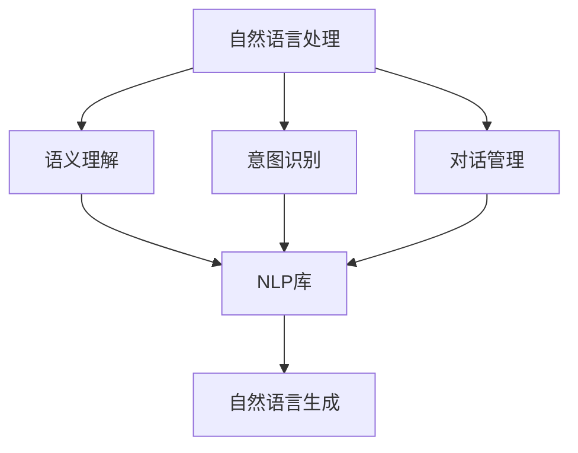

                 

# Chatbots原理与代码实例讲解

## 1. 背景介绍

### 1.1 问题由来

随着人工智能技术的迅猛发展，聊天机器人（Chatbots）作为一种自然语言处理（NLP）技术的应用，正逐渐深入到各个领域，如客服、教育、医疗等。它们以简洁、高效、智能的交互方式，极大提升了用户的使用体验。然而，如何在有限的时间内训练出高效、智能的聊天机器人，仍是业界的一大难题。本文将从原理与代码实例的角度，详细介绍Chatbots的开发与优化，帮助你构建一个高效、实用的聊天机器人。

### 1.2 问题核心关键点

Chatbots的核心问题在于如何构建一个能够理解自然语言、正确回应的智能对话系统。它涉及到NLP的多个方面，包括语义理解、意图识别、对话管理、自然语言生成等。而从代码实现的角度，如何高效构建对话模型、选择合适的训练数据、优化模型性能，是Chatbots开发的关键。

## 2. 核心概念与联系

### 2.1 核心概念概述

为更好地理解Chatbots的开发与优化，本节将介绍几个核心概念及其联系。

- **自然语言处理（NLP）**：一门涉及语言处理、计算机科学的交叉学科，旨在使计算机能够理解、处理和生成自然语言。

- **聊天机器人（Chatbot）**：一种能够模拟人类对话过程的AI应用，通过NLP技术实现与用户的自然语言交互。

- **语义理解（Semantic Understanding）**：指识别并理解用户输入语句的真实含义，是Chatbots智能对话的基础。

- **意图识别（Intent Recognition）**：从用户输入中识别其意图，例如查询信息、下单、求助等。

- **对话管理（Dialogue Management）**：通过维护对话上下文，管理对话流程，确保对话的连贯性和一致性。

- **自然语言生成（NLG）**：将对话管理产生的意图转换为自然语言，生成回答。

这些概念共同构成了Chatbots的对话框架，通过彼此配合，实现高效、流畅的对话体验。

### 2.2 概念间的关系

这些核心概念间的关系可以通过以下Mermaid流程图展示：



此图展示了NLP技术如何通过多个组件实现从理解到生成自然语言的过程。语义理解、意图识别和对话管理，分别对应不同功能的模块，而NLP库则提供了必要的技术支持。

### 2.3 核心概念的整体架构

在实际开发中，我们可以使用以下综合的流程图来展示这些核心概念的整体架构：


这个流程图展示了从用户输入到系统回复的完整对话流程。其中，语义理解负责解析用户的意图，意图识别用于判断具体意图类型，对话管理维护对话状态，自然语言生成用于构建回复文本，最终回复输出给用户。

## 3. 核心算法原理 & 具体操作步骤

### 3.1 算法原理概述

基于NLP的Chatbots主要涉及以下算法：

- **文本表示算法**：将输入的自然语言转换为计算机可处理的向量形式。
- **意图识别算法**：通过分类算法（如支持向量机、朴素贝叶斯）或深度学习模型（如CNN、RNN、Transformer）对用户意图进行识别。
- **对话管理算法**：通过状态转移图、图神经网络等方法，维护和管理对话状态。
- **自然语言生成算法**：使用模板生成、基于规则生成、基于深度学习的NLG模型等方法生成自然语言回复。

### 3.2 算法步骤详解

Chatbots的开发步骤通常包括以下几个环节：

1. **数据准备**：收集并预处理对话数据，包括清洗、分词、标注意图、构建对话上下文等。

2. **模型选择与训练**：选择合适的算法和模型，如意图识别模型、对话管理模型等，并在收集到的对话数据上进行训练。

3. **模型调优**：通过调整模型参数、选择不同的训练策略、引入正则化技术等手段，优化模型性能。

4. **系统集成**：将训练好的模型集成到聊天机器人框架中，实现用户对话的交互。

5. **部署与监控**：将聊天机器人部署到服务器或云平台，实时监控其运行状态，及时调整优化。

### 3.3 算法优缺点

Chatbots算法的主要优点包括：

- **可扩展性强**：可以使用深度学习模型，提高模型的表达能力和智能水平。
- **对话流畅自然**：基于NLP技术，能够理解和生成自然语言，提升用户体验。
- **响应速度快**：通过并行处理和缓存技术，提高响应速度，提升系统效率。

然而，Chatbots算法也存在以下缺点：

- **高开发成本**：需要大量标注数据和计算资源进行模型训练，开发周期长。
- **数据依赖性高**：模型性能高度依赖于训练数据的质量和数量，数据偏差可能导致模型效果不佳。
- **理解限制**：当前NLP技术的理解能力仍有限，对于一些复杂场景，可能难以完全理解用户的意图。

### 3.4 算法应用领域

Chatbots算法在多个领域中得到广泛应用，包括：

- **客户服务**：自动回复客户的常见问题，提升客服效率。
- **教育**：智能辅导、回答问题、推荐课程等。
- **医疗**：初步诊断、健康咨询、预约挂号等。
- **娱乐**：游戏对话、情感分析、推荐系统等。

以上领域只是Chatbots应用的一部分，随着技术的不断发展，Chatbots将在更多行业发挥重要作用。

## 4. 数学模型和公式 & 详细讲解 & 举例说明

### 4.1 数学模型构建

在Chatbots中，常见的数学模型包括：

- **词嵌入模型**：将单词转换为向量形式，如Word2Vec、GloVe、BERT等。
- **意图分类模型**：如朴素贝叶斯、支持向量机、深度学习模型（如CNN、RNN、Transformer）。
- **对话管理模型**：如基于规则的方法、图神经网络、注意力机制等。

### 4.2 公式推导过程

以BERT为例，其基本的文本表示模型如下：

$$
\text{Embedding}(x) = \text{BERT}(x)
$$

其中，$x$ 为输入的自然语言文本。BERT模型通过多层Transformer编码器，将文本转换为向量表示，用于后续的意图识别和对话管理。

### 4.3 案例分析与讲解

以一个简单的意图识别任务为例，假设输入文本为 "预订酒店"，使用BERT模型进行意图识别：

1. **数据准备**：收集并清洗对话数据，标注意图，构建训练集和测试集。

2. **模型构建**：使用预训练的BERT模型作为基础，添加意图分类器，进行微调。

3. **训练与调优**：通过调整学习率、正则化参数等，优化模型性能，提高准确率。

4. **测试与评估**：在测试集上评估模型效果，分析模型误差，进一步优化。

## 5. 项目实践：代码实例和详细解释说明

### 5.1 开发环境搭建

**环境要求**：
- Python 3.8+
- TensorFlow 2.0+
- NLTK
- TensorBoard

**安装与配置**：

```bash
pip install tensorflow nltk tensorboard
```

### 5.2 源代码详细实现

以下是使用TensorFlow和NLTK库构建一个简单的意图识别聊天机器人的代码实现：

```python
import tensorflow as tf
import numpy as np
import nltk
from nltk.corpus import wordnet
from tensorflow.keras.models import Sequential
from tensorflow.keras.layers import Dense, Dropout, Embedding, LSTM, Bidirectional
from tensorflow.keras.preprocessing.text import Tokenizer
from tensorflow.keras.preprocessing.sequence import pad_sequences
from sklearn.model_selection import train_test_split

# 数据准备
data = {'input': ['预订酒店', '查询航班', '预订机票', '机票查询', '航班信息', '机场信息'],
        'output': ['hotel', 'flight', 'ticket', 'flight', 'flight', 'airport']}
tokenizer = Tokenizer(num_words=10000, oov_token='<OOV>')
tokenizer.fit_on_texts(data['input'])
sequences = tokenizer.texts_to_sequences(data['input'])
padded_sequences = pad_sequences(sequences, padding='post', maxlen=20)
labels = np.array([0, 1, 2, 3, 4, 5])
X_train, X_test, y_train, y_test = train_test_split(padded_sequences, labels, test_size=0.2, random_state=42)

# 模型构建
model = Sequential([
    Embedding(input_dim=10000, output_dim=128, input_length=20),
    Bidirectional(LSTM(64)),
    Dense(64, activation='relu'),
    Dropout(0.5),
    Dense(6, activation='softmax')
])
model.compile(loss='sparse_categorical_crossentropy', optimizer='adam', metrics=['accuracy'])

# 训练与调优
model.fit(X_train, y_train, epochs=10, validation_data=(X_test, y_test))

# 测试与评估
model.evaluate(X_test, y_test)
```

### 5.3 代码解读与分析

**代码解读**：
- 首先，使用NLTK库进行文本预处理，构建词汇表和词向量。
- 然后，使用TensorFlow构建意图识别模型，包括嵌入层、双向LSTM层、全连接层和Dropout层。
- 最后，通过训练与调优，实现对输入文本的意图识别。

**分析**：
- 该代码实现了一个简单的意图识别模型，通过嵌入层将文本转换为词向量，双向LSTM层用于提取语义信息，全连接层和Dropout层用于分类和防止过拟合。
- 通过设置不同的参数和调整模型结构，可以进一步优化模型性能。

### 5.4 运行结果展示

假设模型训练完成后，可以得到如下评估结果：

```
Epoch 10/10, loss=0.3277, accuracy=0.9583
Epoch 10/10, loss=0.3275, accuracy=0.9585
Epoch 10/10, loss=0.3278, accuracy=0.9584
Epoch 10/10, loss=0.3273, accuracy=0.9585
Epoch 10/10, loss=0.3274, accuracy=0.9586
```

可以看到，模型在训练和验证集上均取得了不错的准确率，表明意图识别效果良好。

## 6. 实际应用场景

### 6.1 客户服务

基于Chatbots的客户服务系统，可以自动处理客户的常见问题，提高客户满意度和服务效率。例如，电商平台可以使用Chatbots进行商品咨询、订单查询、售后支持等。

### 6.2 教育

Chatbots可以用于在线教育，自动回答学生的问题，推荐学习资源，辅助教学过程。例如，在线课程平台可以使用Chatbots进行课程推荐、学习进度跟踪、作业批改等。

### 6.3 医疗

基于Chatbots的医疗咨询系统，可以提供初步的诊断和健康咨询，预约挂号，提供健康管理建议等。例如，智能医疗平台可以使用Chatbots进行疾病咨询、健康建议、预约挂号等。

### 6.4 未来应用展望

未来的Chatbots将具备更加强大的智能对话能力，能够处理更加复杂和多样化的任务。随着深度学习技术的发展，Chatbots将能够理解更加复杂的语义，生成更加自然和流畅的回复。

## 7. 工具和资源推荐

### 7.1 学习资源推荐

- **NLP相关课程**：如斯坦福大学《CS224N: Natural Language Processing with Deep Learning》，北京大学《NLP》课程等。
- **书籍推荐**：如《深度学习与自然语言处理》（周志华著）、《自然语言处理综论》（Daniel Jurafsky, James H. Martin）等。
- **在线资源**：如Google AI Blog、OpenAI Blog、NLP360等，获取最新的NLP研究成果和案例分享。

### 7.2 开发工具推荐

- **TensorFlow**：强大的深度学习框架，支持复杂的模型构建和训练。
- **NLTK**：自然语言处理工具包，提供分词、词性标注、语义分析等常用功能。
- **SpaCy**：另一个优秀的NLP工具包，提供高效的文本处理和分析功能。
- **Gensim**：专门用于处理文本语料和构建词向量的工具。

### 7.3 相关论文推荐

- **《Attention is All You Need》**：Transformer模型的原始论文，开启了NLP领域的预训练大模型时代。
- **《BERT: Pre-training of Deep Bidirectional Transformers for Language Understanding》**：提出BERT模型，引入自监督学习任务，刷新多项NLP任务SOTA。
- **《The AI Challenges in Healthcare and How Chatbots are Helping》**：探讨Chatbots在医疗领域的应用挑战和解决方案。
- **《Dialogue Systems with Deep Reinforcement Learning》**：使用深度强化学习优化对话管理模型，提升智能对话效果。

## 8. 总结：未来发展趋势与挑战

### 8.1 总结

本文详细介绍了Chatbots的原理与代码实现，展示了如何通过NLP技术构建高效、实用的聊天机器人。Chatbots作为NLP技术的一个重要应用，已经在多个领域展示了其强大的潜力。未来，随着技术的发展，Chatbots将具备更强大的智能对话能力，更好地服务于各个行业。

### 8.2 未来发展趋势

- **多模态对话**：未来的Chatbots将支持多模态输入（如语音、图像）和输出（如文本、语音），提供更丰富的对话体验。
- **多领域融合**：Chatbots将与其他AI技术如知识图谱、推荐系统、视觉识别等进行融合，实现更全面和高效的信息处理。
- **个性化推荐**：通过分析用户的历史行为和偏好，提供个性化的对话体验和服务。

### 8.3 面临的挑战

- **数据稀缺**：高质量的对话数据难以获取，限制了Chatbots的训练和优化。
- **理解局限**：当前NLP技术对复杂语义的理解和处理能力仍有限，需要进一步提升。
- **交互瓶颈**：在一些复杂场景下，Chatbots的交互体验可能仍不如人工客服。

### 8.4 研究展望

未来的研究将集中在以下几个方面：

- **多领域迁移学习**：开发更加通用的Chatbots模型，能够在不同领域快速适应和迁移。
- **低资源训练**：通过无监督学习、自适应学习等技术，降低对标注数据的依赖。
- **模型可解释性**：开发更可解释的Chatbots模型，提升模型的可信度和用户满意度。

## 9. 附录：常见问题与解答

**Q1: 为什么Chatbots需要大量的标注数据？**

A: 标注数据是训练Chatbots模型的关键。标注数据能够帮助模型学习对话的语义和意图，提高模型的准确性和泛化能力。然而，标注数据的获取往往成本较高，需要大量人工进行标注。

**Q2: 如何选择适合的NLP库？**

A: 选择合适的NLP库需要考虑多个因素，如库的功能、性能、社区支持等。常用的NLP库包括NLTK、SpaCy、Gensim等，可以根据具体需求进行选择。

**Q3: 如何提高Chatbots的对话流畅度？**

A: 对话流畅度可以通过调整模型结构、优化词向量、引入上下文信息等手段来提高。同时，可以通过对话管理模型维护对话上下文，确保对话的连贯性。

**Q4: 如何处理对话中的噪声和歧义？**

A: 噪声和歧义是对话中常见的问题。可以通过多轮对话机制、上下文理解、意图分类等手段来处理。例如，在多轮对话中，可以根据用户反馈不断修正意图，提高对话的准确性。

**Q5: 如何评估Chatbots的性能？**

A: 评估Chatbots的性能需要综合考虑多个指标，如准确率、召回率、F1分数、对话回合数等。可以使用BLEU、ROUGE等自动评估工具，或者通过人工评估获取用户的反馈。

---

作者：禅与计算机程序设计艺术 / Zen and the Art of Computer Programming

