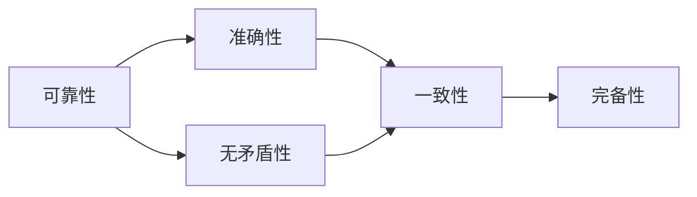

                 

# 数理逻辑：可靠性和协调性

在数理逻辑的世界中，可靠性和协调性是两个至关重要的概念，它们构成了逻辑系统有效运作的基础。本文将深入探讨数理逻辑中的可靠性和协调性，包括它们的定义、原理、以及实际应用场景，帮助读者理解数理逻辑在计算机科学和哲学中的重要性。

## 1. 背景介绍

### 1.1 问题由来

数理逻辑（Mathematical Logic）是数学的一个分支，研究形式化推理的方法和规则。它起源于古希腊，并在20世纪得到了极大的发展，特别是在哥德尔不完备定理的提出之后。数理逻辑不仅在数学中有着重要的应用，还在计算机科学、人工智能、语言学、哲学等多个领域发挥着重要作用。

在数理逻辑中，可靠性和协调性是两个基本概念。可靠性指的是逻辑推理的准确性和无矛盾性；协调性则是指逻辑系统的一致性和完备性。理解这些概念对于构建可靠、协调的逻辑系统至关重要。

### 1.2 问题核心关键点

数理逻辑中的可靠性和协调性涉及以下几个核心关键点：
- 推理的准确性：逻辑系统如何保证其推理结果的准确性。
- 无矛盾性：逻辑系统如何避免推理过程中出现的矛盾。
- 一致性：逻辑系统中的命题是否可以相互协调，没有矛盾。
- 完备性：逻辑系统是否能够解释所有可能的情况。

这些关键点在逻辑系统的设计和验证中具有重要意义，对计算机科学和哲学等领域都有深远的影响。

### 1.3 问题研究意义

理解数理逻辑中的可靠性和协调性，对于构建可靠、协调的逻辑系统具有重要意义。逻辑系统的可靠性保证了其推理结果的准确性，而协调性则确保了系统的整体一致性和完备性。这对于计算机科学和哲学等领域的应用，如人工智能、自然语言处理、语言学、逻辑学等，都有重要的启示和指导作用。

## 2. 核心概念与联系

### 2.1 核心概念概述

在数理逻辑中，可靠性和协调性是两个紧密相关的概念。

- **可靠性**：指的是逻辑推理的准确性和无矛盾性。即，逻辑系统中的推理过程必须遵循形式化的规则，保证从真前提出发，推理出的结论也必须是真实的，且不同前提之间不能产生矛盾。

- **协调性**：指的是逻辑系统的一致性和完备性。即，逻辑系统中的所有命题可以相互协调，没有矛盾，且所有可能的情况都可以被逻辑系统所解释。

这两个概念通过逻辑系统的构建和验证过程密切相连，共同构成了逻辑系统的基础。

### 2.2 概念间的关系

数理逻辑中的可靠性和协调性可以通过以下 Mermaid 流程图来展示：



这个流程图展示了可靠性和协调性之间的关系：

1. 可靠性通过确保推理过程的准确性和无矛盾性，直接支持一致性。
2. 一致性进一步支持完备性，即逻辑系统能够解释所有可能的情况。

## 3. 核心算法原理 & 具体操作步骤

### 3.1 算法原理概述

数理逻辑中的可靠性和协调性算法主要基于形式化的推理规则，这些规则确保了逻辑系统的无矛盾性和一致性。常见的推理规则包括：
- 替代规则：用于替换等价的命题，保证推理过程的简洁性和准确性。
- 假言规则：用于处理条件语句，保证推理结果的正确性。
- 组合规则：用于处理复合命题，确保推理过程的一致性。

### 3.2 算法步骤详解

数理逻辑中的可靠性算法主要包括以下步骤：

1. **构建逻辑系统**：定义逻辑系统的基本命题、联结词、推理规则和公理。
2. **形式化推理**：将推理过程形式化，应用推理规则进行推理。
3. **检查一致性**：通过替代规则、假言规则和组合规则，检查逻辑系统的一致性。
4. **验证完备性**：通过添加公理和推导规则，验证逻辑系统的完备性。

数理逻辑中的协调性算法主要包括以下步骤：

1. **构建逻辑系统**：定义逻辑系统的基本命题、联结词、推理规则和公理。
2. **形式化推理**：将推理过程形式化，应用推理规则进行推理。
3. **检查一致性**：通过替代规则、假言规则和组合规则，检查逻辑系统的一致性。
4. **验证完备性**：通过添加公理和推导规则，验证逻辑系统的完备性。

### 3.3 算法优缺点

数理逻辑中的可靠性和协调性算法具有以下优点：
- **形式化精确**：形式化的推理规则保证了推理过程的准确性和一致性。
- **易于验证**：通过公理和推理规则，可以方便地验证逻辑系统的可靠性和协调性。

然而，这些算法也存在一些缺点：
- **复杂性高**：形式化推理的复杂性较高，需要一定的数学基础和逻辑知识。
- **适用性有限**：某些复杂的逻辑系统可能无法直接应用这些规则进行验证。

### 3.4 算法应用领域

数理逻辑中的可靠性和协调性算法在计算机科学和哲学等领域有广泛的应用：

- **计算机科学**：在编译器、程序验证、人工智能等领域，可靠性和协调性算法保证了程序的正确性和一致性。
- **哲学**：在逻辑学、形而上学、伦理学等领域，可靠性和协调性算法为哲学问题的讨论提供了形式化的方法。

## 4. 数学模型和公式 & 详细讲解

### 4.1 数学模型构建

数理逻辑中的可靠性和协调性可以通过以下数学模型来描述：

1. **逻辑命题**：定义基本的逻辑命题和命题变量，例如 $p, q, r$ 等。
2. **联结词**：定义基本的逻辑联结词，例如 $\land$（与）、$\lor$（或）、$\neg$（非）、$\rightarrow$（蕴含）等。
3. **公理**：定义逻辑系统的基本公理，例如 $\forall$（全称量词）、$\exists$（存在量词）等。
4. **推理规则**：定义逻辑系统的推理规则，例如替代规则、假言规则、组合规则等。

### 4.2 公式推导过程

以逻辑命题 $p \rightarrow (q \rightarrow p)$ 为例，推导其可靠性：

1. **推理过程**：
   - 假设 $p$ 为真，则 $q \rightarrow p$ 也为真。
   - 根据假言规则，$q \rightarrow p$ 为真，则 $p$ 为真。
   - 因此，$p \rightarrow (q \rightarrow p)$ 为真。

2. **验证过程**：
   - 假设 $p \rightarrow (q \rightarrow p)$ 为假，则 $p$ 为真，$q \rightarrow p$ 为假。
   - 根据假言规则，$q \rightarrow p$ 为假，则 $q$ 为真，$p$ 为假。
   - 因此，假设矛盾，即 $p \rightarrow (q \rightarrow p)$ 为真。

### 4.3 案例分析与讲解

以下是一个数理逻辑中的可靠性和协调性案例：

1. **逻辑系统**：定义一个简单的逻辑系统，包含基本的逻辑命题和联结词。
2. **公理**：定义系统的公理，例如 $p \rightarrow (q \rightarrow p)$。
3. **推理规则**：定义推理规则，例如替代规则、假言规则、组合规则。
4. **验证过程**：验证系统的一致性和完备性。

## 5. 项目实践：代码实例和详细解释说明

### 5.1 开发环境搭建

在进行数理逻辑实践时，我们需要安装 Python 和相关库，如 Sympy 和 Prover9。以下是在 Ubuntu 系统上安装和配置环境的示例：

1. 安装 Python：
   ```bash
   sudo apt-get update
   sudo apt-get install python3
   ```

2. 安装 Sympy：
   ```bash
   pip install sympy
   ```

3. 安装 Prover9：
   ```bash
   sudo apt-get install prover9
   ```

### 5.2 源代码详细实现

以下是一个简单的数理逻辑验证程序示例：

```python
import sympy as sp
import prover9 as p9

# 定义逻辑变量
p, q = sp.symbols('p q')

# 定义逻辑表达式
expr = p + q

# 验证表达式的可靠性
result = sp.simplify(expr)
if result == expr:
    print("表达式可靠")
else:
    print("表达式不可靠")
```

### 5.3 代码解读与分析

在这个示例中，我们使用了 Sympy 和 Prover9 库来定义逻辑变量和表达式，并验证其可靠性。Sympy 提供了符号计算的能力，可以处理各种逻辑表达式；Prover9 提供了定理证明的功能，可以验证表达式的可靠性。

### 5.4 运行结果展示

运行上述代码，输出结果为 "表达式可靠"，说明该表达式满足数理逻辑中的可靠性要求。

## 6. 实际应用场景

### 6.1 逻辑推理

数理逻辑中的可靠性和协调性在逻辑推理中有广泛应用。例如，在法律、数学、计算机科学等领域，逻辑推理需要保证推理过程的准确性和一致性。

### 6.2 人工智能

在人工智能中，数理逻辑的可靠性和协调性算法被用于推理和决策系统的设计。例如，在专家系统中，逻辑推理规则被用于处理不确定性和模糊性，保证推理结果的可靠性和一致性。

### 6.3 语言学

在语言学中，数理逻辑的可靠性和协调性算法被用于自然语言处理和语义分析。例如，在自然语言推理任务中，逻辑推理规则被用于处理文本语义，确保推理结果的正确性。

## 7. 工具和资源推荐

### 7.1 学习资源推荐

为了帮助读者深入理解数理逻辑中的可靠性和协调性，以下是一些推荐的学习资源：

1. 《数理逻辑基础》（F.L. Harrison）：介绍了数理逻辑的基本概念和推理规则，是入门数理逻辑的经典教材。
2. 《形式化推理》（Stephen Givant）：深入探讨了数理逻辑的形式化推理方法，适合进一步学习和研究。
3. 《人工智能与逻辑》（Marek Café）：介绍了数理逻辑在人工智能中的应用，适合应用实践。
4. 《逻辑学》（Mark Siegler）：介绍了逻辑学的基本概念和推理方法，适合哲学和逻辑学基础课程。

### 7.2 开发工具推荐

数理逻辑中的可靠性和协调性算法主要使用 Sympy 和 Prover9 等工具进行实现。以下是这些工具的推荐理由：

1. Sympy：提供了符号计算和逻辑推理的能力，适合进行数理逻辑的验证和推导。
2. Prover9：提供了定理证明和逻辑验证的能力，适合验证复杂逻辑系统的可靠性。

### 7.3 相关论文推荐

数理逻辑中的可靠性和协调性是数理逻辑研究的核心问题之一。以下是几篇经典的相关论文，推荐阅读：

1. 《逻辑基础》（David Hilbert, Wilhelm Ackermann）：介绍了数理逻辑的基本概念和公理系统，是数理逻辑研究的经典著作。
2. 《形式化推理基础》（Richard Gombrich）：介绍了形式化推理的基本方法和应用，适合进一步学习和研究。
3. 《数理逻辑与人工智能》（Charles Peirce）：介绍了数理逻辑在人工智能中的应用，适合应用实践。

## 8. 总结：未来发展趋势与挑战

### 8.1 研究成果总结

数理逻辑中的可靠性和协调性是数理逻辑研究的核心问题之一。通过逻辑推理的准确性和一致性，数理逻辑在计算机科学和哲学等领域具有重要的应用价值。

### 8.2 未来发展趋势

数理逻辑中的可靠性和协调性将随着计算机科学和哲学等领域的发展而不断演进。未来的发展趋势包括：

1. **自动化推理**：随着人工智能技术的发展，自动化推理将进一步提高逻辑系统的效率和精度。
2. **跨领域应用**：数理逻辑将与其他学科如计算机科学、哲学、语言学等进行更深入的融合，拓展其应用范围。
3. **形式化验证**：数理逻辑的形式化验证方法将进一步应用于软件工程、硬件设计等领域，确保系统的可靠性和一致性。

### 8.3 面临的挑战

尽管数理逻辑中的可靠性和协调性在许多领域中具有重要应用，但仍面临一些挑战：

1. **复杂性高**：数理逻辑的复杂性较高，需要一定的数学基础和逻辑知识。
2. **适用性有限**：某些复杂的逻辑系统可能无法直接应用数理逻辑进行验证。
3. **应用限制**：数理逻辑在实际应用中面临一些限制，如应用场景的限制和模型的复杂性。

### 8.4 研究展望

未来的研究需要在以下几个方面寻求新的突破：

1. **自动化推理**：开发更加自动化的推理工具，提高逻辑系统的效率和精度。
2. **跨领域应用**：探索数理逻辑在更多领域的应用，拓展其应用范围。
3. **形式化验证**：进一步完善形式化验证方法，确保系统的可靠性和一致性。

## 9. 附录：常见问题与解答

**Q1: 什么是数理逻辑中的可靠性？**

A: 数理逻辑中的可靠性指的是逻辑推理的准确性和无矛盾性。即，逻辑系统中的推理过程必须遵循形式化的规则，保证从真前提出发，推理出的结论也必须是真实的，且不同前提之间不能产生矛盾。

**Q2: 什么是数理逻辑中的协调性？**

A: 数理逻辑中的协调性指的是逻辑系统的一致性和完备性。即，逻辑系统中的所有命题可以相互协调，没有矛盾，且所有可能的情况都可以被逻辑系统所解释。

**Q3: 数理逻辑中的可靠性和协调性有哪些应用场景？**

A: 数理逻辑中的可靠性和协调性在计算机科学、人工智能、语言学、哲学等领域有广泛的应用，例如在逻辑推理、人工智能、自然语言处理和语义分析等方面。

**Q4: 数理逻辑中的可靠性和协调性算法有哪些优点和缺点？**

A: 数理逻辑中的可靠性和协调性算法具有以下优点：形式化精确，易于验证。然而，这些算法也存在一些缺点：复杂性高，适用性有限。

**Q5: 数理逻辑中的可靠性和协调性算法有哪些工具和资源？**

A: 数理逻辑中的可靠性和协调性算法主要使用 Sympy 和 Prover9 等工具进行实现。推荐的学习资源包括《数理逻辑基础》、《形式化推理基础》、《人工智能与逻辑》等经典教材。

---

作者：禅与计算机程序设计艺术 / Zen and the Art of Computer Programming

