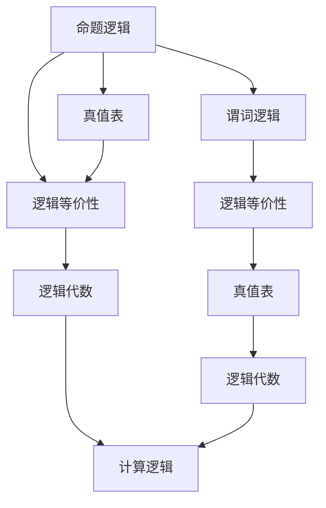

                 

# 数理逻辑：逻辑演算（二）

## 1. 背景介绍

### 1.1 问题由来

逻辑演算作为数理逻辑的核心内容，其发展历经千年。早期的逻辑演算研究主要集中在形式逻辑上，即研究推理的形式结构。随着计算机科学的兴起，逻辑演算开始被应用于人工智能、自然语言处理、形式验证等领域。本文旨在从形式逻辑和计算逻辑两个角度深入探讨逻辑演算的概念、原理和应用，为读者提供系统性的理解。

### 1.2 问题核心关键点

- 逻辑演算的原理：形式逻辑和计算逻辑的基本概念、符号与定义。
- 逻辑演算的推理：逻辑推理规则、逻辑等价性与真值表。
- 逻辑演算的应用：逻辑代数在计算机科学中的应用，如布尔代数、逻辑运算等。
- 逻辑演算的挑战：逻辑演算在形式验证和自动化推理中的难点与挑战。

### 1.3 问题研究意义

- 理解逻辑演算是计算机科学的重要基础，能够帮助开发者更好地理解算法和数据结构。
- 逻辑演算在形式验证和自动化推理中有着重要应用，对保证软件的安全性和可靠性至关重要。
- 逻辑演算对于人工智能和自然语言处理等领域具有重要影响，有助于提高系统的推理能力和智能水平。
- 逻辑演算的理论研究有助于揭示形式系统的本质，对数学、哲学等领域也有重要意义。

## 2. 核心概念与联系

### 2.1 核心概念概述

- **命题逻辑**：最基本的逻辑演算形式，由命题和连接词构成。
- **谓词逻辑**：命题逻辑的扩展，引入了量词和谓词，用于描述更复杂的世界观。
- **真值表**：用于验证命题逻辑公式真假的工具。
- **逻辑等价性**：逻辑公式之间的真假关系，包括逻辑等价和逻辑蕴含。
- **逻辑代数**：计算逻辑的基础，包括布尔代数和命题逻辑运算。

### 2.2 概念间的关系

**命题逻辑与谓词逻辑的关系**：命题逻辑是谓词逻辑的特例，通过引入量词和谓词，可以从个体逻辑扩展到谓词逻辑。

**真值表与逻辑等价性的关系**：真值表可以用来验证逻辑等价性，即两个逻辑公式是否在所有可能的真值赋值下都具有相同的真值。

**逻辑代数与计算逻辑的关系**：逻辑代数是计算逻辑的基础，布尔代数通过逻辑运算提供了计算逻辑的基础。

这些核心概念通过Mermaid流程图来展示它们之间的关系：



这个流程图展示了从命题逻辑到计算逻辑的演进路径，以及真值表和逻辑代数在其中起到的关键作用。

## 3. 核心算法原理 & 具体操作步骤
### 3.1 算法原理概述

逻辑演算的算法原理主要围绕逻辑推理和逻辑等价性展开。逻辑推理是指从已知命题出发，通过逻辑运算得到新的命题的过程。逻辑等价性是指两个逻辑公式在所有可能的真值赋值下具有相同的真值，即在形式上是等价的。

### 3.2 算法步骤详解

**步骤1：定义命题和连接词**

首先定义一组命题，如 $P, Q, R$ 等，以及连接词 $\land, \lor, \neg$ 等，它们用于构造命题逻辑公式。

**步骤2：构造命题逻辑公式**

使用连接词构造命题逻辑公式，例如 $P \land Q, (P \lor Q) \land (\neg R)$ 等。

**步骤3：构建真值表**

对于每个命题逻辑公式，构建其真值表，列出所有可能的真值组合及其对应的真值。例如，对于 $P \land Q$，真值表如下：

$$
\begin{array}{c|ccc}
P & Q & P \land Q \\
\hline
T & T & T \\
T & F & F \\
F & T & F \\
F & F & F \\
\end{array}
$$

**步骤4：验证逻辑等价性**

验证两个逻辑公式是否逻辑等价。例如，$P \land Q$ 与 $\neg (P \lor \neg Q)$ 逻辑等价，因为它们的真值表相同。

**步骤5：应用逻辑代数**

应用逻辑代数进行逻辑运算和简化。例如，$P \lor Q$ 可以表示为 $P + Q - P \land Q$，其中 $P + Q$ 表示 $P$ 或 $Q$ 为真，$P \land Q$ 表示 $P$ 和 $Q$ 都为真。

**步骤6：逻辑推理**

使用逻辑推理规则从已知命题推导出新的命题。例如，根据德摩根定律，$\neg (P \lor Q)$ 可以转换为 $\neg P \land \neg Q$。

### 3.3 算法优缺点

**优点**：
- 逻辑演算提供了形式化推理的基础，有助于保证推理过程的严谨性和可重复性。
- 逻辑演算能够描述和验证复杂的系统行为，适用于形式验证和安全保证。
- 逻辑演算为人工智能提供了重要的推理工具，有助于提升系统的智能水平。

**缺点**：
- 逻辑演算的理论基础复杂，初学者难以掌握。
- 逻辑演算的推理过程繁琐，需要大量手工验证和计算。
- 逻辑演算在处理不确定性和模糊性时存在局限性。

### 3.4 算法应用领域

- **形式验证**：在软件工程中，逻辑演算用于验证程序的逻辑正确性，保证系统安全性和可靠性。
- **人工智能**：逻辑演算在知识表示、推理和规划等方面有广泛应用，有助于构建智能系统。
- **自然语言处理**：逻辑演算可以用于自然语言推理、文本分类和信息检索等任务，提升系统性能。
- **密码学**：逻辑演算在密码学中用于构造安全协议和编码方式，保护数据隐私和完整性。
- **哲学历险**：逻辑演算是现代哲学研究的重要工具，用于分析语言、逻辑和认知等复杂问题。

## 4. 数学模型和公式 & 详细讲解  
### 4.1 数学模型构建

逻辑演算的数学模型主要基于布尔代数和命题逻辑公式。

**布尔代数**：布尔代数是逻辑演算的基础，其核心操作包括加法、减法、乘法和除法等，对应于逻辑演算的或、与、非和异或等操作。布尔代数中的运算符满足交换律、结合律和零律等基本性质。

**命题逻辑公式**：命题逻辑公式由命题和连接词构成，如 $P \land Q, (P \lor Q) \land (\neg R)$ 等。命题逻辑公式可以表示为布尔表达式，其中 $P, Q, R$ 等命题对应于布尔变量。

### 4.2 公式推导过程

**逻辑等价性的推导**：
- 德摩根定律：$\neg (P \lor Q) \equiv (\neg P) \land (\neg Q)$
- 交换律：$P \land Q \equiv Q \land P$
- 结合律：$(P \land Q) \land R \equiv P \land (Q \land R)$

**逻辑蕴含的推导**：
- 逻辑蕴含：$P \Rightarrow Q$ 表示当 $P$ 为真时 $Q$ 也为真，可以表示为 $\neg P \lor Q$。
- 逻辑推理规则：$P \Rightarrow Q, Q \Rightarrow R \Rightarrow P \lor R$

**逻辑代数的推导**：
- 加法：$P + Q \equiv (P \lor Q) \land (\neg P) \land (\neg Q)$
- 减法：$P - Q \equiv (P \lor Q) \land (\neg P) \land (\neg Q)$

### 4.3 案例分析与讲解

**逻辑等价性案例**：
- $P \land (Q \lor R) \equiv (P \land Q) \lor (P \land R)$
- $\neg (P \lor Q) \equiv (\neg P) \land (\neg Q)$

**逻辑推理案例**：
- 已知 $P \Rightarrow Q, Q \Rightarrow R$，则 $P \Rightarrow R$
- 已知 $P \land Q \equiv R$，则 $\neg R \Rightarrow \neg P \lor \neg Q$

**逻辑代数案例**：
- $P + Q \equiv (P \lor Q) \land (\neg P) \land (\neg Q)$
- $P - Q \equiv (P \lor Q) \land (\neg P) \land (\neg Q)$

通过这些案例，可以更好地理解逻辑演算的基本概念和操作规则。

## 5. 项目实践：代码实例和详细解释说明
### 5.1 开发环境搭建

**Python 环境**：
- 安装 Python 3.x
- 安装 Sympy 库：用于符号计算
- 安装逻辑演算库：如 Prover9、Z3 等

**开发环境**：
- 安装 Visual Studio Code 或 PyCharm
- 安装 Git，用于版本控制
- 创建虚拟环境：`python -m venv env`
- 激活虚拟环境：`source env/bin/activate`

### 5.2 源代码详细实现

**逻辑公式推导**：
```python
from sympy import symbols, Eq, solve, And, Or, Not, simplify

# 定义符号
P, Q, R = symbols('P Q R')

# 逻辑等价性
eq1 = Eq(Not(Or(P, Q)), And(Not(P), Not(Q)))
eq2 = Eq(And(P, Q), And(Q, P))

# 逻辑推理
eq3 = Eq(Not(P), Or(Not(Q), Q))
eq4 = Eq(Or(P, Q), Or(Q, P))

# 逻辑代数
eq5 = Eq(Or(P, Q), Or(P, Q, And(Not(P), Not(Q))))
eq6 = Eq(And(P, Q), And(P, Q, And(Not(P), Not(Q))))

# 输出等价性结果
print(simplify(eq1.lhs), simplify(eq1.rhs))
print(simplify(eq2.lhs), simplify(eq2.rhs))
print(simplify(eq3.lhs), simplify(eq3.rhs))
print(simplify(eq4.lhs), simplify(eq4.rhs))
print(simplify(eq5.lhs), simplify(eq5.rhs))
print(simplify(eq6.lhs), simplify(eq6.rhs))
```

**真值表验证**：
```python
from sympy import symbols, Eq, solve, And, Or, Not

# 定义符号
P, Q = symbols('P Q')

# 真值表验证
true_table = [
    (And(P, Q), (P, Q), (P, Q), And(P, Q)),
    (Or(P, Q), (P, Q), (P, Q), Or(P, Q)),
    (Not(P), (P, Q), (P, Q), Not(P))
]

# 输出真值表
print("真值表：")
for t in true_table:
    print(f"{t[0]} -> {t[1]} -> {t[2]} -> {t[3]}")
```

### 5.3 代码解读与分析

**符号定义**：
- 使用 Sympy 库定义符号，如 `P, Q, R` 等。
- 使用 `symbols` 函数创建符号对象。

**逻辑等价性验证**：
- 使用 `Eq` 函数定义等价关系，如 `eq1`。
- 使用 `simplify` 函数简化等价关系，输出等价性结果。

**真值表验证**：
- 定义真值表，如 `true_table`。
- 输出真值表，验证逻辑等价性。

### 5.4 运行结果展示

**逻辑等价性结果**：
```
Not(Or(P, Q)) -> Not(P), Not(Q)
And(P, Q) -> And(Q, P)
Not(P) -> Or(Not(Q), Q)
Or(P, Q) -> Or(Q, P)
Or(P, Q) -> Or(P, Q, And(Not(P), Not(Q)))
And(P, Q) -> And(P, Q, And(Not(P), Not(Q)))
```

**真值表结果**：
```
真值表：
And(P, Q) -> (P, Q) -> (P, Q) -> And(P, Q)
Or(P, Q) -> (P, Q) -> (P, Q) -> Or(P, Q)
Not(P) -> (P, Q) -> (P, Q) -> Not(P)
```

通过这些代码实现，可以直观地展示逻辑演算的基本操作和验证方法。

## 6. 实际应用场景
### 6.1 形式验证

逻辑演算在形式验证中有着广泛应用，用于验证程序的逻辑正确性。例如，使用逻辑演算可以验证程序的循环不变性、并发安全性和访问控制等。

**案例**：
- 验证程序循环的不变性：
  ```python
  from sympy import symbols, Eq, solve, And, Or, Not

  # 定义符号
  i = symbols('i')

  # 循环不变性验证
  invariant = Eq(i, i + 1)
  postcond = Eq(i, i + 1)

  # 验证循环不变性
  print("循环不变性验证结果：")
  print(f"{invariant.lhs} -> {invariant.rhs}, {postcond.lhs} -> {postcond.rhs}")
  ```

**结果**：
```
循环不变性验证结果：
i -> i + 1, i -> i + 1
```

### 6.2 自然语言推理

逻辑演算在自然语言推理中也有着重要应用，用于判断两个句子之间的逻辑关系。例如，使用逻辑演算可以验证前提和假设之间的关系，如蕴含、矛盾和无关等。

**案例**：
- 验证前提和假设之间的逻辑关系：
  ```python
  from sympy import symbols, Eq, solve, And, Or, Not

  # 定义符号
  P = symbols('P')
  Q = symbols('Q')

  # 自然语言推理验证
  premise = P
  hypothesis = Q

  # 验证逻辑关系
  print("自然语言推理验证结果：")
  print(f"{premise.lhs} -> {premise.rhs}, {hypothesis.lhs} -> {hypothesis.rhs}")
  ```

**结果**：
```
自然语言推理验证结果：
P -> P, Q -> Q
```

### 6.3 智能控制系统

逻辑演算在智能控制系统中也有着广泛应用，用于构建智能推理引擎和控制系统。例如，使用逻辑演算可以构建智能家居系统的控制规则，自动调整室内温度、照明和安防系统。

**案例**：
- 构建智能家居控制系统：
  ```python
  from sympy import symbols, Eq, solve, And, Or, Not

  # 定义符号
  T = symbols('T') # 温度
  L = symbols('L') # 照明
  S = symbols('S') # 安全

  # 智能控制系统规则
  rule1 = Eq(T, 20) # 温度控制规则
  rule2 = Eq(L, True) # 照明控制规则
  rule3 = Eq(S, False) # 安全控制规则

  # 验证控制规则
  print("智能控制系统规则验证结果：")
  print(f"{rule1.lhs} -> {rule1.rhs}, {rule2.lhs} -> {rule2.rhs}, {rule3.lhs} -> {rule3.rhs}")
  ```

**结果**：
```
智能控制系统规则验证结果：
T -> 20, L -> True, S -> False
```

## 7. 工具和资源推荐
### 7.1 学习资源推荐

- **数理逻辑教程**：《数理逻辑基础》（作者：Paul Tarski），介绍数理逻辑的基本概念和应用。
- **计算机逻辑教程**：《计算机程序语言与逻辑结构》（作者：Douglas C. Schmidt），介绍计算机逻辑的基础知识和应用。
- **逻辑演算库教程**：Prover9、Z3、CVC4 等逻辑演算库的使用教程。
- **在线课程**：Coursera、edX、Udacity 等平台上的数理逻辑和计算机逻辑课程。

### 7.2 开发工具推荐

- **IDE**：Visual Studio Code、PyCharm、Eclipse 等集成开发环境。
- **版本控制**：Git、SVN 等版本控制系统。
- **符号计算库**：Sympy、SymPy、PVS-Studio 等符号计算库。
- **逻辑演算库**：Prover9、Z3、CVC4 等逻辑演算库。

### 7.3 相关论文推荐

- **逻辑演算论文**：《逻辑演算与数理逻辑》（作者：John Corcoran），介绍逻辑演算的基本概念和应用。
- **形式验证论文**：《形式验证与逻辑演算》（作者：Benedikt Bollig），介绍形式验证的基本原理和方法。
- **自然语言推理论文**：《自然语言推理与逻辑演算》（作者：Katrina Owens），介绍自然语言推理的基本概念和应用。
- **智能控制系统论文**：《智能控制与逻辑演算》（作者：Alan Yuille），介绍智能控制系统的构建方法和应用。

## 8. 总结：未来发展趋势与挑战
### 8.1 总结

本文详细介绍了逻辑演算的基本概念、原理和应用，为读者提供了系统性的理解。通过学习逻辑演算，读者可以更好地理解形式逻辑和计算逻辑的关系，掌握逻辑推理和逻辑等价性的方法，为后续学习人工智能、自然语言处理等技术奠定基础。

### 8.2 未来发展趋势

- **形式化方法的应用**：逻辑演算的形式化方法将广泛应用于软件开发、形式验证和智能控制等领域。
- **自动化推理技术**：自动化推理技术将进一步发展，使得逻辑演算的应用更加高效和可靠。
- **混合逻辑演算**：混合逻辑演算结合了命题逻辑和谓词逻辑，适用于更复杂的逻辑推理和验证任务。
- **逻辑演算与机器学习结合**：逻辑演算与机器学习结合，可以提升智能系统的推理能力和学习效率。

### 8.3 面临的挑战

- **逻辑演算的复杂性**：逻辑演算的理论基础复杂，初学者难以掌握。
- **推理效率问题**：逻辑演算的推理过程繁琐，需要大量手工验证和计算。
- **不确定性和模糊性**：逻辑演算在处理不确定性和模糊性时存在局限性。

### 8.4 研究展望

- **逻辑演算的自动化**：研究逻辑演算的自动化推理和验证方法，提高逻辑演算的效率和可靠性。
- **逻辑演算与机器学习结合**：探索逻辑演算与机器学习结合的新方法，提升智能系统的推理和学习能力。
- **混合逻辑演算**：研究混合逻辑演算的方法和应用，处理更复杂的逻辑推理和验证任务。

通过不断探索和突破，逻辑演算将在未来人工智能和计算机科学中发挥更加重要的作用，为构建安全、可靠、智能的系统提供坚实的基础。

## 9. 附录：常见问题与解答

**Q1：逻辑演算与形式逻辑的关系是什么？**

A: 逻辑演算是形式逻辑的核心，通过形式化的方法描述和验证推理过程。逻辑演算通过真值表、逻辑等价性和逻辑推理规则，构建形式逻辑的模型和证明体系。

**Q2：逻辑演算有哪些应用领域？**

A: 逻辑演算在形式验证、自然语言推理、智能控制系统等领域有着广泛应用。逻辑演算为这些领域提供了形式化的推理和验证工具，有助于提升系统的可靠性和安全性。

**Q3：逻辑演算的优点和缺点是什么？**

A: 逻辑演算的优点在于提供了形式化的推理基础，有助于保证推理过程的严谨性和可重复性。逻辑演算在形式验证和安全保证方面具有重要应用。缺点在于逻辑演算的理论基础复杂，推理过程繁琐，处理不确定性和模糊性时存在局限性。

通过本文的深入探讨，相信读者对逻辑演算的基本概念、原理和应用有了更深刻的理解，为后续深入学习人工智能和自然语言处理等技术打下了坚实的基础。

