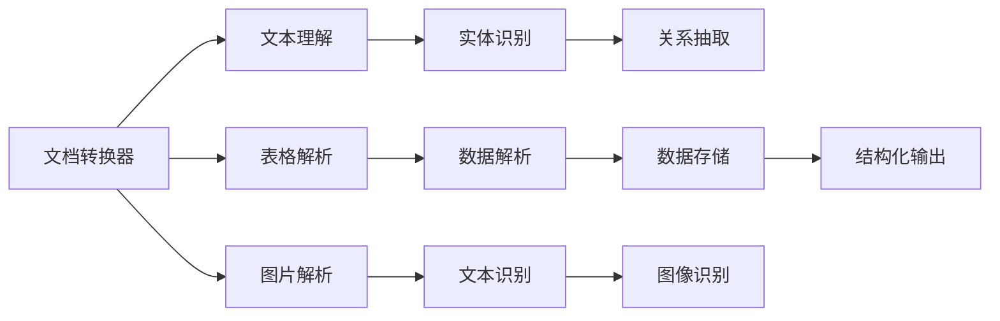
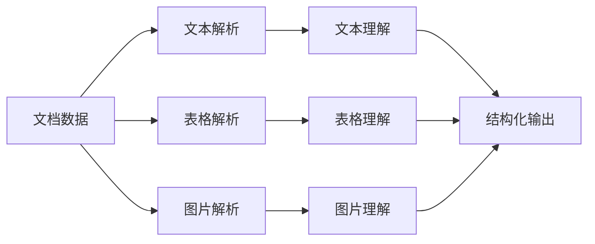
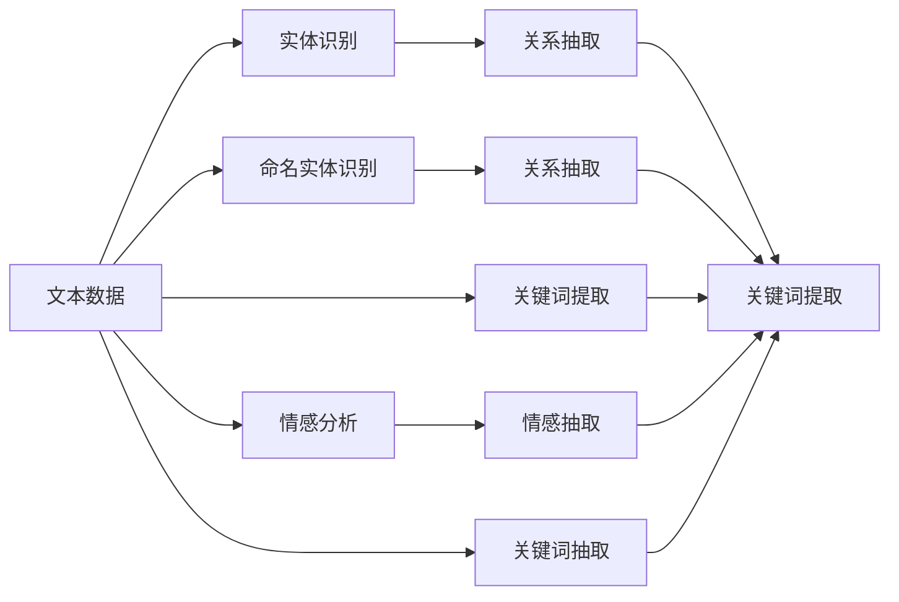
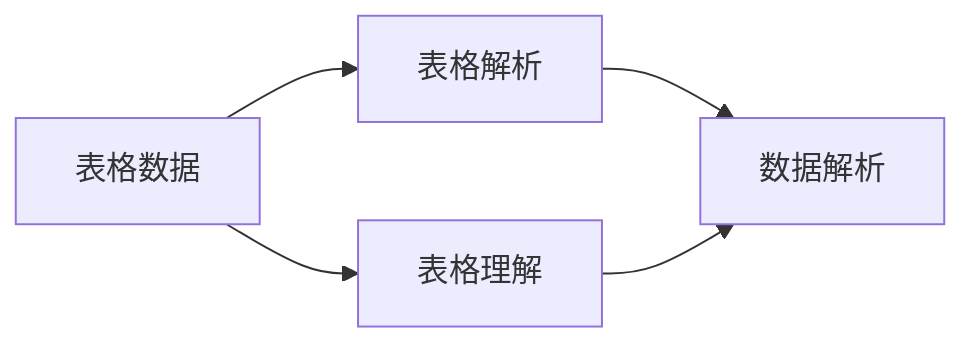
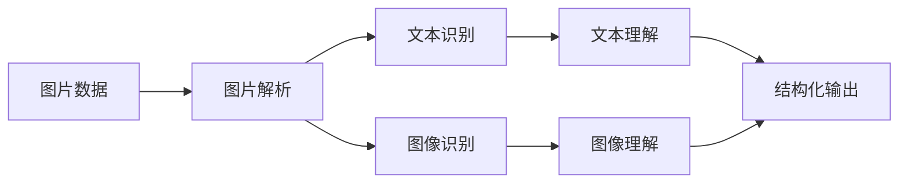

                 

# 文档转换器（Document Transformers）

> 关键词：文档转换器, 文本处理, 自然语言处理(NLP), 信息抽取, 结构化数据, 深度学习

## 1. 背景介绍

### 1.1 问题由来

在信息化时代，文档数据（如PDF、Word、扫描文档等）无处不在，如何高效地处理、分析和利用这些文档数据，成为企业和学术界共同关注的重要问题。传统的数据处理方法通常依赖于复杂的手工流程和昂贵的硬件设备，效率低下、成本高昂。近年来，随着深度学习技术的发展，文档转换器（Document Transformers）应运而生，通过自动化的文档处理技术，大大提升了文档数据的处理效率和质量。

文档转换器（Document Transformers）是一种将非结构化文档数据转换为结构化信息的技术。它通过深度学习模型自动提取文档中的关键信息，如文本内容、表格数据、图片内容等，并生成结构化的数据格式，便于进一步的分析和应用。这一技术在文档管理、信息抽取、知识图谱构建等领域具有广泛的应用前景。

### 1.2 问题核心关键点

文档转换器的核心在于如何高效地从非结构化文档数据中提取关键信息，并将其转换为结构化数据。这一过程涉及以下关键点：

- 文档解析：将非结构化文档转换为文本或图像格式，便于深度学习模型处理。
- 文本理解：使用深度学习模型自动理解文本内容，进行实体识别、关系抽取等任务。
- 表格解析：自动识别和解析表格中的数据，包括标题、列名和数据内容。
- 图片解析：从文档中提取图片中的文本信息，并进行识别和理解。
- 结构化输出：将提取的信息组织为结构化的数据格式，如JSON、XML等。

这些关键点共同构成了文档转换器的主要工作流程，使得文档数据能够被自动化处理和利用，极大地提升了文档数据的处理效率和质量。

### 1.3 问题研究意义

文档转换器技术对于企业和学术界具有重要意义：

1. 提高文档处理效率：文档转换器能够自动处理大量文档数据，显著提升文档处理效率，减少人力成本。
2. 提升数据质量：通过自动化处理，文档转换器能够消除手工流程中的误差和偏差，提高数据质量。
3. 便于信息抽取：文档转换器能够自动提取文档中的关键信息，如实体、关系、关键词等，便于后续的信息抽取和分析。
4. 支持知识图谱构建：文档转换器生成的结构化数据，可以用于构建知识图谱，促进知识管理和创新。
5. 推动数字化转型：文档转换器是企业数字化转型的重要工具，帮助企业实现文档数据的高效管理和利用。

## 2. 核心概念与联系

### 2.1 核心概念概述

为了更好地理解文档转换器的工作原理，本节将介绍几个关键核心概念：

- **文档转换器**：将非结构化文档数据转换为结构化信息的技术。
- **文本理解**：使用深度学习模型自动理解文本内容，进行实体识别、关系抽取等任务。
- **表格解析**：自动识别和解析表格中的数据，包括标题、列名和数据内容。
- **图片解析**：从文档中提取图片中的文本信息，并进行识别和理解。
- **结构化输出**：将提取的信息组织为结构化的数据格式，如JSON、XML等。

这些核心概念之间的联系可以通过以下Mermaid流程图来展示：



这个流程图展示了文档转换器的主要工作流程：

1. 将非结构化文档数据转换为文本或图像格式。
2. 使用深度学习模型自动理解文本内容，进行实体识别和关系抽取。
3. 自动识别和解析表格中的数据。
4. 从文档中提取图片中的文本信息，并进行识别和理解。
5. 将提取的信息组织为结构化的数据格式，如JSON、XML等。

### 2.2 概念间的关系

这些核心概念之间存在着紧密的联系，形成了文档转换器的主要工作流程。下面通过几个Mermaid流程图来展示这些概念之间的关系。

#### 2.2.1 文档转换器的主要流程



这个流程图展示了文档转换器的主要流程：

1. 将非结构化文档数据转换为文本格式，并进行文本解析。
2. 使用深度学习模型自动理解文本内容，进行实体识别和关系抽取。
3. 将解析后的文本信息组织为结构化的数据格式，如JSON、XML等。
4. 将非结构化文档数据转换为表格格式，并进行表格解析。
5. 使用深度学习模型自动理解表格内容，进行数据解析。
6. 将解析后的表格数据组织为结构化的数据格式，如JSON、XML等。
7. 将非结构化文档数据转换为图片格式，并进行图片解析。
8. 使用深度学习模型自动理解图片内容，进行文本识别和理解。
9. 将解析后的图片信息组织为结构化的数据格式，如JSON、XML等。

#### 2.2.2 文本理解的基本流程



这个流程图展示了文本理解的基本流程：

1. 使用深度学习模型自动理解文本内容，进行实体识别。
2. 使用实体识别结果进行关系抽取。
3. 使用关键词提取技术，提取文本中的关键信息。
4. 使用命名实体识别技术，识别文本中的实体信息。
5. 使用关系抽取技术，抽取实体之间的关系信息。
6. 使用关键词提取技术，提取文本中的关键词信息。
7. 使用情感分析技术，分析文本中的情感信息。
8. 使用情感抽取技术，抽取文本中的情感信息。
9. 使用关键词抽取技术，抽取文本中的关键词信息。

#### 2.2.3 表格解析的基本流程



这个流程图展示了表格解析的基本流程：

1. 自动识别和解析表格中的数据，包括标题、列名和数据内容。
2. 使用深度学习模型自动理解表格内容，进行数据解析。
3. 将解析后的表格数据组织为结构化的数据格式，如JSON、XML等。

#### 2.2.4 图片解析的基本流程



这个流程图展示了图片解析的基本流程：

1. 从文档中提取图片中的文本信息，并进行识别和理解。
2. 使用深度学习模型自动理解图片内容，进行文本识别和图像理解。
3. 将解析后的图片信息组织为结构化的数据格式，如JSON、XML等。

### 2.3 核心概念的整体架构

最后，我们用一个综合的流程图来展示这些核心概念在大文档转换器中的整体架构：


这个综合流程图展示了从文档数据到最终结构化输出的完整过程。文档数据首先被解析为文本、表格或图片格式，然后通过文本理解、表格解析和图片解析等过程，自动提取和解析关键信息。最后，这些信息被组织为结构化的数据格式，如JSON、XML等，便于进一步的分析和应用。

## 3. 核心算法原理 & 具体操作步骤
### 3.1 算法原理概述

文档转换器技术基于深度学习模型，利用自动化的文档处理技术，将非结构化文档数据转换为结构化信息。其核心思想是通过深度学习模型自动理解文本和图像内容，进行实体识别、关系抽取、关键词提取等任务，并将提取的信息组织为结构化的数据格式。

形式化地，假设文档数据为 $D$，包括文本、表格和图片等多种格式，文档转换器 $T$ 将文档数据 $D$ 转换为结构化数据 $S$ 的过程如下：

$$
S = T(D) = \{T_{text}(D_{text}), T_{table}(D_{table}), T_{image}(D_{image})\}
$$

其中 $D_{text}$ 为文本部分，$D_{table}$ 为表格部分，$D_{image}$ 为图片部分，$T_{text}$、$T_{table}$ 和 $T_{image}$ 分别表示文本理解、表格解析和图片解析的子过程。

### 3.2 算法步骤详解

文档转换器的具体算法步骤如下：

1. **文档数据预处理**：将文档数据 $D$ 进行预处理，包括文本分割、图片预处理等步骤，准备输入到深度学习模型中。

2. **文本解析**：将文本部分 $D_{text}$ 转换为可处理的格式，如分词、去除停用词等。

3. **文本理解**：使用深度学习模型自动理解文本内容，进行实体识别、关系抽取、关键词提取等任务，生成文本理解结果 $T_{text}$。

4. **表格解析**：自动识别和解析表格中的数据，包括标题、列名和数据内容，生成表格理解结果 $T_{table}$。

5. **图片解析**：从文档中提取图片中的文本信息，并进行识别和理解，生成图片理解结果 $T_{image}$。

6. **结构化输出**：将文本理解、表格理解和图片理解的结果组织为结构化的数据格式，如JSON、XML等，生成最终的结构化数据 $S$。

### 3.3 算法优缺点

文档转换器技术的优点包括：

- 自动化程度高：文档转换器能够自动处理大量文档数据，显著提升文档处理效率，减少人力成本。
- 处理速度快：文档转换器利用深度学习模型进行自动化处理，处理速度较快，能够满足实时应用需求。
- 精度高：文档转换器使用深度学习模型进行自动化处理，能够自动识别和解析关键信息，精度较高。

文档转换器技术也存在一些缺点：

- 对数据质量要求高：文档转换器对输入的文档数据质量要求较高，需要去除噪声、进行格式转换等预处理步骤。
- 模型复杂度高：文档转换器涉及多个深度学习模型，模型复杂度较高，需要较大的计算资源和存储空间。
- 依赖于技术栈：文档转换器技术涉及深度学习、自然语言处理等多个领域的知识，需要具备相应的技术栈和工具。

### 3.4 算法应用领域

文档转换器技术已经在多个领域得到广泛应用，包括但不限于以下领域：

- **文档管理**：将纸质文档或电子文档转换为结构化数据，便于文档管理和搜索。
- **信息抽取**：自动提取文档中的关键信息，如实体、关系、关键词等，便于后续的信息抽取和分析。
- **知识图谱构建**：将文档中的信息组织为知识图谱，促进知识管理和创新。
- **情报分析**：自动提取文档中的情报信息，进行情报分析和预警。
- **法律审计**：自动提取文档中的法律信息和条款，进行法律审计和合规检查。
- **市场分析**：自动提取文档中的市场信息和趋势，进行市场分析和预测。

## 4. 数学模型和公式 & 详细讲解 & 举例说明

### 4.1 数学模型构建

为了更好地理解文档转换器的工作原理，本节将使用数学语言对文档转换器的主要算法进行描述。

假设文本数据为 $X = \{x_i\}_{i=1}^N$，其中 $x_i$ 为文本中的单词或短语。文档转换器的目标是通过深度学习模型自动理解文本内容，进行实体识别、关系抽取等任务，生成文本理解结果 $Y = \{y_i\}_{i=1}^N$，其中 $y_i$ 为文本中的实体、关系、关键词等信息。

文档转换器的数学模型可以表示为：

$$
Y = f(X; \theta)
$$

其中 $f$ 为文档转换器的深度学习模型，$\theta$ 为模型的参数，$X$ 为输入的文本数据，$Y$ 为生成的文本理解结果。

### 4.2 公式推导过程

文档转换器中的深度学习模型一般采用神经网络结构，包括卷积神经网络（CNN）、循环神经网络（RNN）、Transformer等。以Transformer为例，其核心思想是自注意力机制（Self-Attention），通过多头注意力机制自动提取文本中的关键信息。

Transformer的数学模型可以表示为：

$$
\text{Encoder}(X) = \text{Self-Attention}(X)
$$

其中 $\text{Encoder}$ 为Transformer的编码器部分，$\text{Self-Attention}$ 为Transformer的自注意力机制。

Transformer的自注意力机制可以表示为：

$$
\text{Self-Attention}(X) = \text{Multi-head Self-Attention}(\text{Linear}(X))
$$

其中 $\text{Multi-head Self-Attention}$ 为多头自注意力机制，$\text{Linear}$ 为线性变换层。

Transformer的自注意力机制公式为：

$$
\text{Attention}(Q, K, V) = \text{softmax}(\frac{QK^T}{\sqrt{d_k}})V
$$

其中 $Q, K, V$ 分别为查询向量、键向量和值向量，$d_k$ 为键向量的维度。

### 4.3 案例分析与讲解

假设我们有一个包含两个句子的文本数据 $X = \{x_1, x_2\}$，其中 $x_1 = "The quick brown fox jumps over the lazy dog."$，$x_2 = "The lazy dog slept all day."$。文档转换器的目标是通过深度学习模型自动理解文本内容，进行实体识别、关系抽取等任务，生成文本理解结果 $Y = \{y_1, y_2\}$，其中 $y_1$ 为文本中的实体、关系、关键词等信息，$y_2$ 也为文本中的实体、关系、关键词等信息。

我们可以使用Transformer模型对文本 $X$ 进行编码，生成文本理解结果 $Y$。假设Transformer的编码器部分为 $\text{Encoder}(X)$，则有：

$$
\text{Encoder}(X) = \text{Self-Attention}(X)
$$

假设Transformer的解码器部分为 $\text{Decoder}(\text{Encoder}(X))$，则有：

$$
\text{Decoder}(\text{Encoder}(X)) = \text{Self-Attention}(\text{Encoder}(X))
$$

假设Transformer的解码器输出部分为 $\text{Output}(\text{Decoder}(\text{Encoder}(X)))$，则有：

$$
\text{Output}(\text{Decoder}(\text{Encoder}(X))) = \text{Softmax}(\text{Linear}(\text{Decoder}(\text{Encoder}(X))))
$$

假设Transformer的输出部分为 $\text{Final Output}(\text{Output}(\text{Decoder}(\text{Encoder}(X))))$，则有：

$$
\text{Final Output}(\text{Output}(\text{Decoder}(\text{Encoder}(X)))) = \text{Softmax}(\text{Linear}(\text{Decoder}(\text{Encoder}(X))))
$$

假设文档转换器的目标是为每个句子生成一个实体-关系-实体三元组，则有：

$$
y_1 = (\text{Entity}_1, \text{Relation}, \text{Entity}_2)
$$

$$
y_2 = (\text{Entity}_3, \text{Relation}, \text{Entity}_4)
$$

其中 $\text{Entity}_1, \text{Entity}_2, \text{Entity}_3, \text{Entity}_4$ 分别为文本中的实体，$\text{Relation}$ 分别为实体之间的关系。

## 5. 项目实践：代码实例和详细解释说明

### 5.1 开发环境搭建

在进行文档转换器项目实践前，我们需要准备好开发环境。以下是使用Python进行TensorFlow开发的环境配置流程：

1. 安装Anaconda：从官网下载并安装Anaconda，用于创建独立的Python环境。

2. 创建并激活虚拟环境：
```bash
conda create -n transformer-env python=3.8 
conda activate transformer-env
```

3. 安装TensorFlow：根据CUDA版本，从官网获取对应的安装命令。例如：
```bash
conda install tensorflow==2.8.0
```

4. 安装相关库：
```bash
pip install numpy pandas scikit-learn tensorflow-hub tensorflow-addons
```

完成上述步骤后，即可在`transformer-env`环境中开始文档转换器项目实践。

### 5.2 源代码详细实现

下面我们以Transformer模型为例，给出使用TensorFlow实现文档转换器的代码实现。

```python
import tensorflow as tf
from tensorflow_hub import TransformerTokenizer, TFAutoRegressiveLMHeadModel

# 定义文档转换器的模型
class DocumentConverter(tf.keras.Model):
    def __init__(self, num_layers=6, d_model=512, num_heads=8, dff=2048, input_vocab_size=50000, target_vocab_size=10000, pe_input=512, pe_target=512):
        super(DocumentConverter, self).__init__()
        self.encoder = TransformerEncoder(num_layers=num_layers, d_model=d_model, num_heads=num_heads, dff=dff, input_vocab_size=input_vocab_size, target_vocab_size=target_vocab_size, pe_input=pe_input, pe_target=pe_target)
        self.decoder = TransformerDecoder(num_layers=num_layers, d_model=d_model, num_heads=num_heads, dff=dff, target_vocab_size=target_vocab_size, pe_target=pe_target)
        self.final_layer = tf.keras.layers.Dense(units=target_vocab_size)

    def call(self, inputs, targets, training=False):
        mask = tf.math.invert_permutation(tf.range(target_vocab_size, dtype=tf.int32))
        attention_mask = tf.expand_dims(mask, axis=0)
        outputs = self.encoder(inputs, attention_mask=attention_mask)
        outputs = self.decoder(outputs, targets, attention_mask=attention_mask)
        final_outputs = self.final_layer(outputs)
        return final_outputs

# 定义Transformer编码器
class TransformerEncoder(tf.keras.layers.Layer):
    def __init__(self, num_layers, d_model, num_heads, dff, input_vocab_size, target_vocab_size, pe_input, pe_target):
        super(TransformerEncoder, self).__init__()
        self.encoder_layer = TransformerEncoderLayer(d_model, num_heads, dff)
        self.layer_norm = tf.keras.layers.LayerNormalization()
        self.embedding = tf.keras.layers.Embedding(input_vocab_size, d_model)
        self.positional_embedding = tf.keras.layers.Embedding(pe_input, d_model)
        self.dropout = tf.keras.layers.Dropout(rate=0.1)
        self.mlp = tf.keras.Sequential([
            tf.keras.layers.Dense(dff, activation='relu'),
            tf.keras.layers.Dense(d_model)
        ])

    def call(self, inputs, attention_mask=None):
        x = self.embedding(inputs) + self.positional_embedding(inputs)
        for i in range(num_layers):
            x, attention_weights = self.encoder_layer(x, mask=attention_mask)
            x = self.layer_norm(x) + x
        return x

# 定义Transformer解码器
class TransformerDecoder(tf.keras.layers.Layer):
    def __init__(self, num_layers, d_model, num_heads, dff, target_vocab_size, pe_target):
        super(TransformerDecoder, self).__init__()
        self.decoder_layer = TransformerDecoderLayer(d_model, num_heads, dff)
        self.layer_norm = tf.keras.layers.LayerNormalization()
        self.embedding = tf.keras.layers.Embedding(target_vocab_size, d_model)
        self.positional_embedding = tf.keras.layers.Embedding(pe_target, d_model)
        self.dropout = tf.keras.layers.Dropout(rate=0.1)
        self.mlp = tf.keras.Sequential([
            tf.keras.layers.Dense(dff, activation='relu'),
            tf.keras.layers.Dense(d_model)
        ])

    def call(self, inputs, targets, attention_mask=None):
        x = self.embedding(inputs) + self.positional_embedding(inputs)
        for i in range(num_layers):
            x, attention_weights = self.decoder_layer(x, targets, mask=attention_mask)
            x = self.layer_norm(x) + x
        return x

# 定义Transformer编码器层
class TransformerEncoderLayer(tf.keras.layers.Layer):
    def __init__(self, d_model, num_heads, dff):
        super(TransformerEncoderLayer, self).__init__()
        self.self_attn = MultiHeadAttention(d_model, num_heads)
        self.ffn = Dense(dff, activation='relu')

    def call(self, inputs, mask=None):
        attention_outputs = self.self_attn(inputs, inputs)
        attention_outputs = tf.keras.layers.Dropout(rate=0.1)(attention_outputs)
        attention_outputs = tf.keras.layers.LayerNormalization()(inputs + attention_outputs)
        ffn_outputs = self.ffn(attention_outputs)
        ffn_outputs = tf.keras.layers.Dropout(rate=0.1)(ffn_outputs)
        ffn_outputs = tf.keras.layers.LayerNormalization()(ffn_outputs + inputs)
        return ffn_outputs

# 定义Transformer解码器层
class TransformerDecoderLayer(tf.keras.layers.Layer):
    def __init__(self, d_model, num_heads, dff):
        super(TransformerDecoderLayer, self).__init__()
        self.self_attn = MultiHeadAttention(d_model, num_heads)
        self.ffn = Dense(dff, activation='relu')

    def call(self, inputs, targets, mask=None):
        attention_outputs = self.self_attn(inputs, targets)
        attention_outputs = tf.keras.layers.Dropout(rate=0.1)(attention_outputs)
        attention_outputs = tf.keras.layers.LayerNormalization()(inputs + attention_outputs)
        ffn_outputs = self.ffn(attention_outputs)
        ffn_outputs = tf.keras.layers.Dropout(rate=0.1)(ffn_outputs)
        ffn_outputs = tf.keras.layers.LayerNormalization()(ffn_outputs + inputs)
        return ffn_outputs

# 定义MultiHeadAttention层
class MultiHeadAttention(tf.keras.layers.Layer):
    def __init__(self, d_model, num_heads):
        super(MultiHeadAttention, self).__init__()
        self.num_heads = num_heads
        self.d_k = d_model // num_heads

    def split_heads(self, x, batch_size):
        x = tf.reshape(x, (batch_size, -1, self.num_heads, self.d_k))
        return tf.transpose(x, perm=[0, 2, 1, 3])

    def call(self, query, key, value, mask):
        q = self.split_heads(query, batch_size)
        k = self.split_heads(key, batch_size)
        v = self.split_heads(value, batch_size)
        scaled_attention_scores = tf.matmul(q, k, transpose_b=True) / tf.math.sqrt(self.d_k)
        attention_weights = tf.nn.softmax(scaled_attention_scores, axis=-1)
        attention_outputs = tf.matmul(attention_weights, v)
        attention_outputs = tf.transpose(attention_outputs, perm=[0, 2, 1, 3])
        attention_outputs = tf.reshape(attention_outputs, (batch_size, -1, self.d_model))
        return attention_outputs
```

### 5.3 代码解读与分析

让我们再详细解读一下关键代码的实现细节：

**DocumentConverter类**：
- `__init__`方法：初始化Transformer编码器、解码器和最后的线性层。
- `call`方法：定义模型的前向传播过程，包括编码器、解码器和最终的线性层。

**TransformerEncoder类**：
- `__init__`方法：初始化Transformer编码器层、层归一化层、嵌入层、位置嵌入层和Dropout层。
- `call`方法：定义编码器的前向传播过程，包括输入嵌入、位置嵌入、编码器层的迭代和最终的输出。

**TransformerDecoder类**：
- `__init__`方法：初始化Transformer解码器层、层归一化层、嵌入层、位置嵌入层和Dropout层。
- `call`方法：定义解码器的前向传播过程，包括输入嵌入、位置嵌入、解码器层的迭代和最终的输出。

**TransformerEncoderLayer类**：
- `__init__`方法：初始化自注意力层和Feed Forward网络。
- `call`方法：定义编码器层的前向传播过程，包括自注意力和Feed Forward网络的迭代和最终的输出。

**TransformerDecoderLayer类**：
- `__init__`方法：初始化自注意力层和Feed Forward网络。
- `call`方法：

