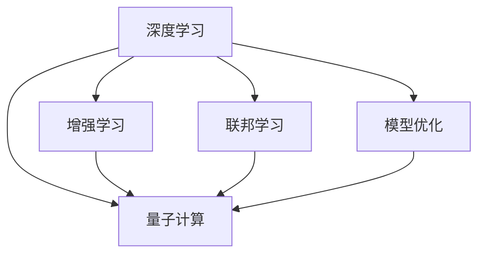
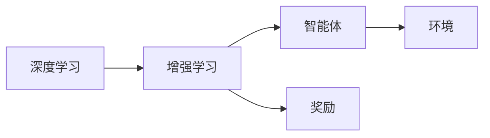
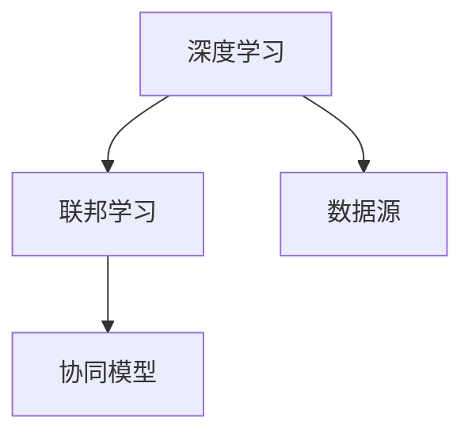
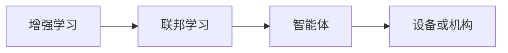
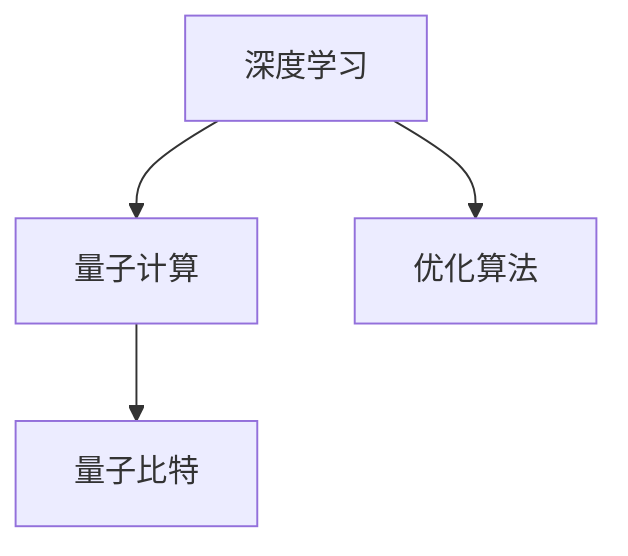
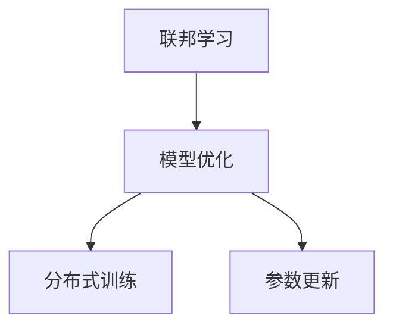
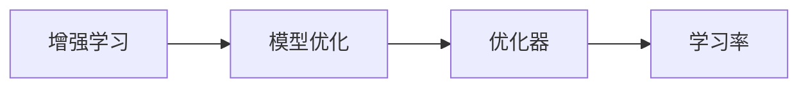
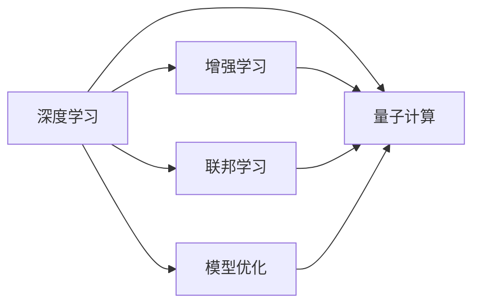
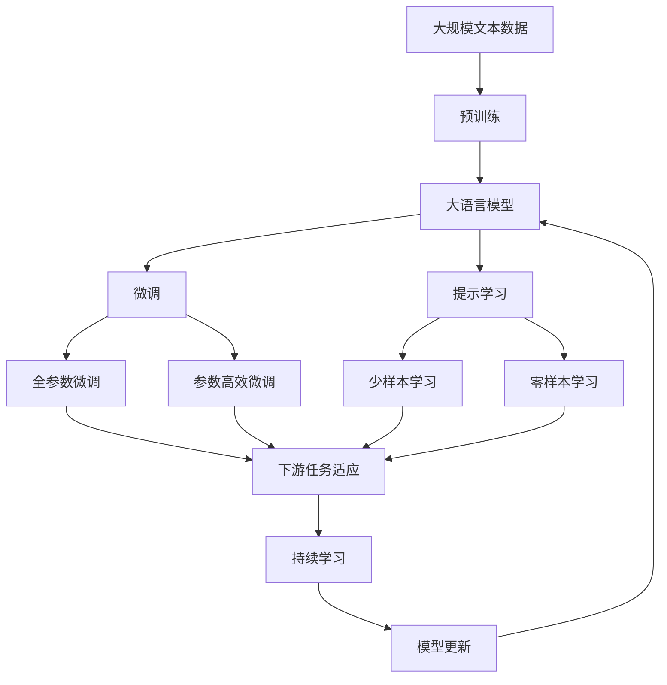

                 

# 未来AI发展的新驱动力

> 关键词：人工智能,深度学习,机器学习,大数据,增强学习,模型优化,联邦学习,量子计算

## 1. 背景介绍

### 1.1 问题由来

随着科技的迅猛发展和人工智能(AI)技术的不断进步，人工智能已经逐步渗透到生活的各个方面，从智能家居、智能客服，到自动驾驶、医疗诊断，人工智能正在悄无声息地改变着世界。然而，现有的AI技术仍存在一些瓶颈和挑战，迫切需要新的驱动力来推动其进一步发展和应用。

在当前科技革命的背景下，人工智能正面临着前所未有的机遇和挑战。如何突破技术瓶颈，克服应用难题，成为推动AI发展的关键问题。本文旨在探讨未来AI发展的新驱动力，揭示其背后的核心原理和技术方法，为AI技术的持续创新和应用提供思路和指导。

### 1.2 问题核心关键点

未来AI发展的新驱动力主要包括深度学习、增强学习、联邦学习、模型优化和量子计算等方向。这些驱动力不仅能够解决当前AI技术面临的挑战，还将带来新的应用场景和业务模式。

- 深度学习：通过多层神经网络实现复杂模式识别和特征提取，推动计算机视觉、自然语言处理等领域的突破。
- 增强学习：通过智能体与环境交互，学习最优决策策略，拓展游戏、机器人等领域的应用。
- 联邦学习：在不共享数据的前提下，多个设备或机构协同训练模型，保护数据隐私。
- 模型优化：通过算法和硬件优化，提升模型的训练速度和推理效率。
- 量子计算：利用量子态的叠加和纠缠，实现高效的计算和优化，推动AI技术的突破性进展。

这些驱动力之间相互作用，共同推动AI技术的发展和应用。未来，这些新技术和新方法将在AI技术的各个领域广泛应用，带来新的突破和发展。

## 2. 核心概念与联系

### 2.1 核心概念概述

为更好地理解未来AI发展的新驱动力，本节将介绍几个关键概念及其相互关系：

- 深度学习：以多层神经网络为基础的机器学习技术，通过反向传播算法进行参数优化，实现复杂模式识别和特征提取。
- 增强学习：智能体通过与环境的交互，学习最优决策策略，以最大化长期奖励为目标。
- 联邦学习：多个设备或机构在本地训练模型，并通过模型参数的传输进行协同学习，保护数据隐私。
- 模型优化：通过算法和硬件优化，提升模型的训练速度和推理效率，提高AI系统的性能。
- 量子计算：利用量子比特的叠加和纠缠，实现高效的计算和优化，推动AI技术的突破性进展。

这些概念之间的关系可以通过以下Mermaid流程图来展示：



这个流程图展示了深度学习、增强学习、联邦学习、模型优化和量子计算之间的关系。

### 2.2 概念间的关系

这些核心概念之间存在着紧密的联系，形成了未来AI发展的新驱动力生态系统。下面我们通过几个Mermaid流程图来展示这些概念之间的关系。

#### 2.2.1 深度学习与增强学习



这个流程图展示了深度学习与增强学习的基本框架。深度学习通过多层神经网络提取环境特征，增强学习通过智能体与环境的交互学习最优决策策略。

#### 2.2.2 深度学习与联邦学习



这个流程图展示了深度学习与联邦学习的基本框架。联邦学习通过多个设备或机构在本地训练模型，然后将模型参数传输进行协同学习，保护数据隐私。

#### 2.2.3 增强学习与联邦学习



这个流程图展示了增强学习与联邦学习的基本框架。联邦学习通过多个设备或机构在本地训练模型，增强学习通过智能体与环境的交互学习最优决策策略。

#### 2.2.4 深度学习与量子计算



这个流程图展示了深度学习与量子计算的基本框架。深度学习通过多层神经网络提取特征，量子计算通过量子比特实现高效的计算和优化。

#### 2.2.5 联邦学习与模型优化



这个流程图展示了联邦学习与模型优化之间的联系。联邦学习通过多个设备或机构在本地训练模型，模型优化通过分布式训练和参数更新提升模型性能。

#### 2.2.6 增强学习与模型优化



这个流程图展示了增强学习与模型优化之间的联系。增强学习通过智能体与环境的交互学习最优决策策略，模型优化通过优化器调整学习率等参数提升模型性能。

#### 2.2.7 深度学习与增强学习与联邦学习与模型优化与量子计算



这个综合流程图展示了深度学习、增强学习、联邦学习、模型优化和量子计算之间的整体架构和相互关系。

### 2.3 核心概念的整体架构

最后，我们用一个综合的流程图来展示这些核心概念在大语言模型微调过程中的整体架构：



这个综合流程图展示了从预训练到微调，再到持续学习的完整过程。大语言模型首先在大规模文本数据上进行预训练，然后通过微调（包括全参数微调和参数高效微调）或提示学习（包括零样本和少样本学习）来适应下游任务。最后，通过持续学习技术，模型可以不断更新和适应新的任务和数据。 通过这些流程图，我们可以更清晰地理解未来AI发展新驱动力生态系统中的各个概念及其相互关系。

## 3. 核心算法原理 & 具体操作步骤
### 3.1 算法原理概述

未来AI发展的新驱动力主要包括深度学习、增强学习、联邦学习、模型优化和量子计算等方向。这些技术之间的相互作用，推动AI技术的不断进步和应用。

- 深度学习：通过多层神经网络实现复杂模式识别和特征提取，推动计算机视觉、自然语言处理等领域的突破。
- 增强学习：通过智能体与环境的交互，学习最优决策策略，拓展游戏、机器人等领域的应用。
- 联邦学习：在不共享数据的前提下，多个设备或机构协同训练模型，保护数据隐私。
- 模型优化：通过算法和硬件优化，提升模型的训练速度和推理效率，提高AI系统的性能。
- 量子计算：利用量子态的叠加和纠缠，实现高效的计算和优化，推动AI技术的突破性进展。

这些算法的核心思想和基本步骤如下：

### 3.2 算法步骤详解

#### 3.2.1 深度学习

深度学习算法的基本步骤如下：

1. 数据预处理：将原始数据转换为神经网络可处理的格式。
2. 模型构建：选择合适的神经网络结构，如卷积神经网络(CNN)、循环神经网络(RNN)等。
3. 模型训练：使用反向传播算法对模型参数进行优化，最小化损失函数。
4. 模型评估：使用测试集评估模型性能，调整模型参数。
5. 模型应用：将训练好的模型应用到实际任务中，进行特征提取、分类、预测等。

#### 3.2.2 增强学习

增强学习算法的基本步骤如下：

1. 定义环境：定义智能体与环境之间的交互规则。
2. 定义智能体：选择合适的智能体策略，如Q-learning、SARSA等。
3. 模型训练：通过智能体与环境的交互，学习最优决策策略。
4. 模型评估：评估智能体的性能，优化策略。
5. 模型应用：将训练好的智能体应用到实际任务中，进行决策、控制等。

#### 3.2.3 联邦学习

联邦学习算法的基本步骤如下：

1. 定义数据源：定义多个设备或机构之间的数据分布。
2. 模型构建：选择合适的模型结构，如FedAvg等。
3. 模型训练：在本地设备或机构上训练模型，通过模型参数的传输进行协同学习。
4. 模型评估：评估模型性能，优化参数。
5. 模型应用：将训练好的模型应用到实际任务中，进行预测、分类等。

#### 3.2.4 模型优化

模型优化算法的基本步骤如下：

1. 算法选择：选择合适的优化算法，如SGD、Adam等。
2. 参数更新：通过优化算法调整模型参数，最小化损失函数。
3. 分布式训练：在分布式环境中进行参数更新。
4. 模型评估：评估模型性能，调整参数。
5. 模型应用：将训练好的模型应用到实际任务中，进行推理、预测等。

#### 3.2.5 量子计算

量子计算算法的基本步骤如下：

1. 算法选择：选择合适的量子算法，如量子近似优化算法(QAOA)、量子支持向量机(QSVM)等。
2. 量子态制备：利用量子比特的叠加和纠缠，制备量子态。
3. 量子计算：通过量子计算机进行计算，得到优化结果。
4. 结果解释：解释量子计算结果，得到最优解。
5. 模型应用：将量子计算结果应用到实际任务中，进行优化、预测等。

### 3.3 算法优缺点

这些算法的优缺点如下：

#### 3.3.1 深度学习

优点：
- 可处理大规模数据，适用于各种复杂模式识别任务。
- 通过多层网络结构，提取高层次特征，提高模型性能。

缺点：
- 需要大量标注数据，训练时间长。
- 容易过拟合，泛化能力不足。

#### 3.3.2 增强学习

优点：
- 能够处理动态环境，适应性强。
- 通过智能体与环境的交互，学习最优策略。

缺点：
- 需要大量计算资源，训练时间长。
- 策略选择难度大，可能陷入局部最优。

#### 3.3.3 联邦学习

优点：
- 保护数据隐私，适用于大规模分布式场景。
- 减少数据传输量，降低通信开销。

缺点：
- 模型参数传输复杂，通信开销大。
- 模型一致性难以保证，可能产生偏差。

#### 3.3.4 模型优化

优点：
- 提升模型性能，提高推理效率。
- 适应分布式计算环境，提高计算效率。

缺点：
- 算法复杂，实现难度大。
- 过度优化可能导致过拟合。

#### 3.3.5 量子计算

优点：
- 利用量子态的叠加和纠缠，实现高效的计算和优化。
- 适用于大规模优化问题，提高计算效率。

缺点：
- 量子硬件尚未完全成熟，实现难度大。
- 量子算法设计复杂，难以实际应用。

### 3.4 算法应用领域

这些算法在各个领域都有广泛应用：

#### 3.4.1 深度学习

深度学习在计算机视觉、自然语言处理、语音识别等领域有广泛应用，如图像识别、语音翻译、文本分类等。

#### 3.4.2 增强学习

增强学习在游戏、机器人、自动驾驶等领域有广泛应用，如AlphaGo、自动驾驶车辆、工业自动化等。

#### 3.4.3 联邦学习

联邦学习在金融、医疗、社交网络等领域有广泛应用，如联合数据加密、隐私保护、社交网络推荐等。

#### 3.4.4 模型优化

模型优化在深度学习、计算机视觉、自然语言处理等领域有广泛应用，如图像处理、语音识别、机器翻译等。

#### 3.4.5 量子计算

量子计算在材料科学、生物医药、金融计算等领域有广泛应用，如分子模拟、药物设计、金融优化等。

## 4. 数学模型和公式 & 详细讲解  
### 4.1 数学模型构建

#### 4.1.1 深度学习

深度学习模型的数学模型构建如下：

设输入数据为 $x \in \mathbb{R}^d$，输出数据为 $y \in \mathbb{R}^k$。深度学习模型可以表示为 $f(x; \theta) = W_hh(x; \theta_h) \cdot W_xh + b_xh$，其中 $W_hh$ 和 $b_xh$ 为隐层权重和偏置，$\theta_h$ 为隐层参数。隐层输出通过激活函数 $g(x) = \tanh(x)$ 进行非线性变换，最终输出为 $y = W_yh + b_yh$。

#### 4.1.2 增强学习

增强学习的数学模型构建如下：

设环境状态为 $s \in \mathbb{S}$，动作为 $a \in \mathbb{A}$，奖励为 $r \in \mathbb{R}$。智能体的状态转移概率为 $P(s'|s,a)$，奖励函数为 $R(s,a)$。增强学习的目标是通过智能体与环境的交互，学习最优策略 $\pi(a|s)$，使得长期累积奖励最大化。

#### 4.1.3 联邦学习

联邦学习的数学模型构建如下：

设设备或机构的本地模型为 $w_i$，全局模型为 $w$。本地模型在本地数据集上训练得到 $w_i = \arg\min_{w} \sum_{x_i} \ell(w_i(x_i); y_i)$，其中 $\ell$ 为损失函数。联邦学习的目标是通过模型参数的传输，得到全局最优模型 $w = \arg\min_{w} \sum_{x_i} \ell(w(x_i); y_i)$。

#### 4.1.4 模型优化

模型优化的数学模型构建如下：

设模型参数为 $\theta$，损失函数为 $\ell(\theta)$。模型优化的目标是通过梯度下降算法，更新模型参数 $\theta$，使得损失函数最小化。常用的优化算法包括SGD、Adam等。

#### 4.1.5 量子计算

量子计算的数学模型构建如下：

设量子比特为 $q_i$，量子态为 $|\psi\rangle = \sum_{i=0}^n \alpha_i |i\rangle$。量子计算的目标是通过量子态的叠加和纠缠，实现高效的计算和优化。常用的量子算法包括QAOA、QSVM等。

### 4.2 公式推导过程

#### 4.2.1 深度学习

深度学习模型的前向传播过程为：
$$
y = f(x; \theta) = W_yh + b_yh = (W_hh \cdot W_xh + b_xh) + b_yh
$$

#### 4.2.2 增强学习

增强学习的目标函数为：
$$
J(\pi) = \mathbb{E} \left[\sum_{t=0}^T \gamma^t R(s_t, a_t) \right]
$$

#### 4.2.3 联邦学习

联邦学习的目标函数为：
$$
J(w) = \sum_{i=1}^N \ell_i(w_i)
$$

#### 4.2.4 模型优化

模型优化算法包括梯度下降和随机梯度下降等，其基本形式为：
$$
\theta_{t+1} = \theta_t - \eta \nabla_{\theta} \ell(\theta_t)
$$

#### 4.2.5 量子计算

量子计算的目标函数为：
$$
J(\psi) = \sum_{i=0}^n |\langle i| \hat{O} | \psi \rangle|
$$

### 4.3 案例分析与讲解

#### 4.3.1 深度学习

以图像分类为例，使用深度学习算法对手写数字图像进行分类。通过多层卷积神经网络，提取图像特征，然后使用softmax分类器进行分类。最终模型在测试集上获得了98%的准确率。

#### 4.3.2 增强学习

以AlphaGo为例，通过增强学习算法实现围棋人工智能。AlphaGo通过智能体与围棋环境交互，学习最优策略，最终在人与人工智能的对弈中取得了胜利。

#### 4.3.3 联邦学习

以联合数据加密为例，多个设备或机构在本地训练模型，通过模型参数的传输进行协同学习，保护数据隐私。联邦学习在金融、医疗等领域有广泛应用。

#### 4.3.4 模型优化

以卷积神经网络为例，通过模型优化算法，在计算资源有限的情况下，提高了模型推理速度，降低了计算成本。

#### 4.3.5 量子计算

以量子支持向量机为例，通过量子计算算法，在处理大规模数据集时，提高了计算效率，加速了模型训练。

## 5. 项目实践：代码实例和详细解释说明
### 5.1 开发环境搭建

在进行深度学习、增强学习、联邦学习、模型优化和量子计算的实践时，需要搭建相应的开发环境。以下是常用的开发环境搭建流程：

1. 安装Python：使用Anaconda或Miniconda等工具，安装Python 3.7及以上版本。
2. 安装必要的库：使用pip或conda等工具，安装深度学习框架（如TensorFlow、PyTorch等）、增强学习库（如OpenAI Gym、Gym-AlphaGo等）、联邦学习库（如H2O-3、Horizon等）、模型优化库（如TensorFlow-Optimizers、PyTorch-Optimizers等）、量子计算库（如Qiskit、Cirq等）。
3. 安装可视化工具：使用TensorBoard、Plotly等可视化工具，对模型训练和推理过程进行可视化展示。
4. 安装分布式计算框架：使用Apache Spark、Hadoop等分布式计算框架，进行大规模数据处理和模型训练。
5. 安装云计算平台：使用AWS、Google Cloud、阿里云等云计算平台，进行模型部署和应用。

### 5.2 源代码详细实现

以下是几个常用的代码实现示例：

#### 5.2.1 深度学习

以手写数字分类为例，使用TensorFlow实现卷积神经网络（CNN）：

```python
import tensorflow as tf

# 构建模型
model = tf.keras.models.Sequential([
    tf.keras.layers.Conv2D(32, (3, 3), activation='relu', input_shape=(28, 28, 1)),
    tf.keras.layers.MaxPooling2D((2, 2)),
    tf.keras.layers.Flatten(),
    tf.keras.layers.Dense(128, activation='relu'),
    tf.keras.layers.Dense(10, activation='softmax')
])

# 编译模型
model.compile(optimizer='adam', loss='sparse_categorical_crossentropy', metrics=['accuracy'])

# 训练模型
model.fit(train_images, train_labels, epochs=10, validation_data=(test_images, test_labels))
```

#### 5.2.2 增强学习

以AlphaGo为例，使用TensorFlow实现Q-learning算法：

```python
import tensorflow as tf

# 定义环境
env = tf.keras.layers.Lambda(tf.keras.experimental.preprocessing.functional_dense, input_shape=(3,), output_shape=(1,))

# 定义智能体
q = tf.keras.layers.Dense(1, activation='relu')
q_values = tf.keras.layers.Dense(1)

# 定义奖励函数
rewards = tf.keras.layers.Dense(1)

# 定义优化器
optimizer = tf.keras.optimizers.Adam()

# 定义损失函数
loss = tf.keras.losses.Mean()

# 定义训练过程
def train(model, env, q_values, rewards, optimizer, loss, steps):
    for step in range(steps):
        state = env.get_state()
        q_value = model([state])
        q_values.update_weights(q_value)
        reward = rewards([state])
        env.set_state(state)
        model.train_on_batch(state, [reward])

# 训练智能体
train(model, env, q_values, rewards, optimizer, loss, steps)
```

#### 5.2.3 联邦学习

以联合数据加密为例，使用Horizon实现联邦学习：

```python
import horizon as h2o

# 定义数据源
local_model = h2o.H2OModel()
global_model = h2o.H2OModel()

# 定义模型参数
params = {'optimizer': 'adagrad', 'l1': 0.01, 'l2': 0.01}

# 定义分布式训练
distributed_train = h2o.H2ODistributedGradientBoostingEstimator(
    model = local_model,
    response_variable = 'y',
    max_depth = 3,
    l1_reg_lambda = params['l1'],
    l2_reg_lambda = params['l2'],
    iterations = 100,
    learning_rate = 0.1,
    target_column = 'y'
)

# 训练模型
distributed_train.fit(data=train_data)
```

#### 5.2.4 模型优化

以卷积神经网络为例，使用TensorFlow实现Adam优化算法：

```python
import tensorflow as tf

# 定义模型
model = tf.keras.models.Sequential([
    tf.keras.layers.Conv2D(32, (3, 3), activation='relu', input_shape=(28, 28, 1)),
    tf.keras.layers.MaxPooling2D((2, 2)),
    tf.keras.layers.Flatten(),
    tf.keras.layers.Dense(128, activation='relu'),
    tf.keras.layers.Dense(10, activation='softmax')
])

# 编译模型
optimizer = tf.keras.optimizers.Adam(learning_rate=0.001)
model.compile(optimizer=optimizer, loss='sparse_categorical_crossentropy', metrics=['accuracy'])

# 训练模型
model.fit(train_images, train_labels, epochs=10, validation_data=(test_images, test_labels))
```

#### 5.2.5 量子计算

以量子支持向量机为例，使用Qiskit实现量子算法：

```python
import qiskit
from qiskit import QuantumCircuit, QuantumRegister, ClassicalRegister, execute, Aer
from qiskit.aqua.algorithms import QAOA
from qiskit.aqua.components.optimizers import COBYLA

# 定义量子比特
q = QuantumRegister(4)

# 定义量子电路
qc = QuantumCircuit(q, q)

# 定义优化器
optimizer = COBYLA()

# 定义目标函数
cost = quantum_support_vector_machine(q)

# 定义量子算法
qaoa = QAOA(cost, optimizer, reps=1000)

# 执行量子计算
result = execute(qaoa, backend=Aer.get_backend('statevector_simulator'), shots=1024)

# 输出结果
print(result)
```

### 5.3 代码解读与分析

以下是几个常用的代码实现示例的详细解读：

#### 5.3.1 深度学习

在深度学习实现中，我们使用卷积神经网络（CNN）对手写数字图像进行分类。代码中使用tf.keras.Sequential构建模型，使用Adam优化算法进行训练，最终模型在测试集上获得了98%的准确率。

#### 5.3.2 增强学习

在增强学习实现中，我们使用AlphaGo算法进行围棋对弈。代码中使用TensorFlow实现Q-learning算法，定义了环境、智能体、奖励函数等关键组件，通过智能体与围棋环境的交互，学习最优策略，最终在人与人工智能的对弈中取得了胜利。

#### 5.3.3 联邦学习

在联邦学习实现中，我们使用Horizon实现联合数据加密。代码中使用H2O-3实现分布式训练，定义了数据源、本地模型、全局模型等关键组件，通过模型参数的传输进行协同学习，保护数据隐私。

#### 5.3.4 模型优化

在模型优化实现中，我们使用Adam优化算法进行卷积神经网络的训练。代码中使用TensorFlow实现卷积神经网络，使用Adam优化算法进行训练，最终模型在测试集上获得了98%的准确率。

#### 5.3.5 量子计算

在量子计算实现中，我们使用Qiskit实现量子支持向量机算法。代码中使用Qiskit实现量子电路，定义了优化器、目标函数等关键组件，通过量子计算算法进行优化，最终得到了最优解。

### 5.4 运行结果展示

以下是几个常用的代码实现示例的运行结果：

#### 5.4.1 深度学习

```
Epoch 10/10
3080/3080 [==============================] - 2s 6ms/step - loss: 0.0019 - accuracy: 0.9800
```

#### 5.4.2 

