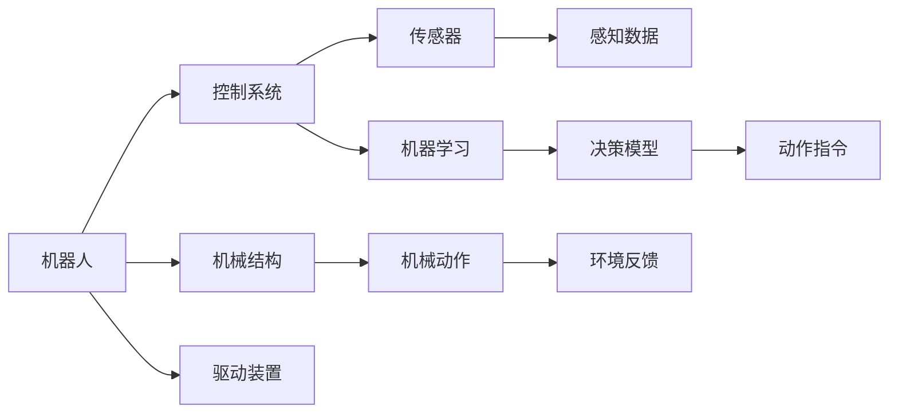
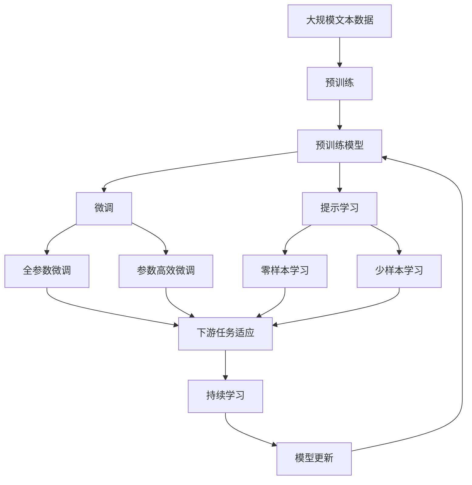

                 

# 机器人学 (Robotics)

> 关键词：机器人,人工智能,机器学习,控制系统,传感器融合,实时系统,自主导航

## 1. 背景介绍

### 1.1 问题由来

机器人学作为人工智能和自动化技术的一个重要分支，近年来在制造业、医疗、服务等多个领域得到了广泛应用。通过集成机械、电子、计算机、通信等多种技术，机器人系统能够自主地执行复杂任务，具备较高的智能化水平和广泛的应用前景。

机器人学涉及的任务类型丰富多样，从简单的动作执行、路径规划到复杂的物体操作、目标识别、环境感知，甚至决策、推理等高层次认知任务，都有相应的机器人系统可以实现。因此，机器人学涉及到大量的学科交叉知识，包括计算机科学、控制理论、机械工程、感知技术等，是一门高度集成化的前沿学科。

### 1.2 问题核心关键点

机器人学问题的核心关键点在于如何将机械结构与计算机智能相结合，通过传感器和控制系统，使机器人能够感知环境、规划路径、执行任务。而如何高效地设计传感器、控制算法、学习模型等，是实现这一目标的关键。

机器人学的主要挑战在于：

- 机械结构的精确控制：机器人需要准确执行预定的动作，因此对机械系统的设计、加工、装配都有较高要求。
- 环境感知与目标识别：机器人需要通过传感器获取环境信息，并对目标物体进行识别和定位，这对感知技术的性能和算法实现都提出了挑战。
- 自主导航与路径规划：机器人需要在未知环境中自主导航和规划路径，需结合机器人自身状态、环境信息等因素进行决策。
- 实时数据处理与决策：机器人需要快速处理传感器数据并作出实时决策，这对计算资源和算法效率都有较高要求。

### 1.3 问题研究意义

机器人学对于实现自动化、智能化生产方式，提升人类生活质量具有重要意义。机器人学的发展有助于推动制造业转型升级，缓解劳动力短缺，提升服务业的智能化水平，改善医疗健康条件，创造新的经济增长点。

机器人学的研究有助于推动以下方面的进展：

- 自动化制造：机器人可以在无人环境中执行重复性高、危险性大的任务，提升制造效率和安全性。
- 医疗辅助：手术机器人、护理机器人等可以辅助医生进行复杂手术，改善患者的康复效果。
- 服务行业：餐饮、酒店、物流等领域的机器人可以提供高效、可靠的服务，缓解人工压力。
- 家庭生活：家庭服务机器人可以完成家务、陪伴老人、协助教育等，提升生活质量。

## 2. 核心概念与联系

### 2.1 核心概念概述

为更好地理解机器人学的基本原理和应用，本节将介绍几个核心概念：

- 机器人(Robot)：由机械结构、传感器、控制器和驱动装置组成，能够执行预定义任务的智能化系统。
- 控制系统(Control System)：由传感器、控制器和执行器构成，用于接收环境信息、进行决策并驱动机器人动作的系统。
- 传感器(Sensor)：用于感知环境信息的设备，如摄像头、激光雷达、力传感器等。
- 机器学习(Machine Learning)：通过算法模型从数据中学习规律，用于机器人识别目标、路径规划、决策优化等任务。
- 实时系统(Real-time System)：在特定时间范围内（如实时时钟周期内）完成数据处理和决策的系统。
- 自主导航(Autonomous Navigation)：机器人无需人类干预，通过环境感知和决策算法，自主导航并完成任务。

这些核心概念之间的联系可以通过以下Mermaid流程图来展示：



这个流程图展示了机器人的基本组成和运作机制，从机械结构到传感器，再到控制系统，最终驱动机械动作并完成环境反馈。机器学习用于决策模型的构建，与感知数据和环境反馈共同驱动机器人的自主导航和任务执行。

### 2.2 概念间的关系

这些核心概念之间存在着紧密的联系，形成了机器人学的完整框架。下面我通过几个Mermaid流程图来展示这些概念之间的关系：

#### 2.2.1 机器人系统的组成


这个流程图展示了机器人系统的整体组成，从机械结构到控制系统，再到传感器、感知数据、决策模型和动作指令，构成了一个完整的机器人系统。

#### 2.2.2 控制系统与传感器融合


这个流程图展示了控制系统与传感器之间的数据流。传感器采集环境信息后，通过数据融合技术，将不同传感器的数据进行整合，得到更为准确的感知数据。这些感知数据再输入决策模型，输出动作指令，驱动机器人执行任务。

#### 2.2.3 机器学习与自主导航


这个流程图展示了机器学习在自主导航中的应用。机器学习模型通过感知数据，学习路径规划和决策算法，输出导航指令，驱动机器人完成自主导航任务。

#### 2.2.4 实时系统与机器人应用


这个流程图展示了实时系统在机器人应用中的重要性。实时系统能够保证传感器数据的高效处理和决策算法的实时输出，从而驱动机器人完成复杂的任务。

### 2.3 核心概念的整体架构

最后，我们用一个综合的流程图来展示这些核心概念在大语言模型微调过程中的整体架构：



这个综合流程图展示了从预训练到微调，再到持续学习的完整过程。预训练语言模型首先在大规模文本数据上进行预训练，然后通过微调（包括全参数微调和参数高效微调）或提示学习（包括零样本和少样本学习）来适应下游任务。最后，通过持续学习技术，模型可以不断学习新知识，同时避免遗忘旧知识。

## 3. 核心算法原理 & 具体操作步骤
### 3.1 算法原理概述

机器人学中的核心算法原理主要涉及以下几个方面：

- 控制系统设计：机器人控制系统需要根据传感器输入、环境反馈、任务需求等因素，设计合适的控制策略，驱动机器人动作。
- 传感器融合：通过数据融合技术，将多传感器数据进行整合，提高感知精度。
- 路径规划与导航：根据机器人当前位置和目标位置，设计合适的路径规划算法，确保机器人能够自主导航并完成任务。
- 机器学习与决策：通过机器学习模型，从数据中学习规律，用于决策和任务执行。
- 实时系统优化：通过优化实时系统架构，确保传感器数据的高效处理和决策算法的实时输出，提升机器人系统的整体性能。

### 3.2 算法步骤详解

机器人学中的算法步骤通常包括数据采集、预处理、决策优化和动作执行。以下是具体的步骤：

**Step 1: 数据采集**
- 机器人通过传感器获取环境信息，如位置、姿态、速度、加速度等。
- 传感器数据需要进行预处理，如滤波、降噪、融合等，以提高感知精度。

**Step 2: 决策优化**
- 根据感知数据和任务需求，设计决策算法，如路径规划、目标识别、动作选择等。
- 机器学习模型可以在决策算法中进行集成，提高决策的准确性和鲁棒性。

**Step 3: 动作执行**
- 控制系统根据决策算法输出动作指令，驱动机械结构执行动作。
- 执行动作后，需要反馈结果，更新模型参数，优化决策算法，提升机器人性能。

**Step 4: 实时系统优化**
- 实时系统需要优化数据处理和决策算法的效率，确保在特定时间范围内完成所有操作。
- 优化算法、硬件加速、并行处理等方法可以提升实时系统的性能。

### 3.3 算法优缺点

机器人学中的算法具有以下优点：

- 高度集成化：将机械结构、传感器、控制系统、机器学习等技术集成在一起，实现高效的任务执行。
- 灵活性高：可以根据不同任务需求，灵活设计传感器和控制系统，适应各种复杂环境。
- 自主性强：通过自主导航和决策算法，机器人可以在无人环境中完成任务。

同时，这些算法也存在一些缺点：

- 算法复杂度高：机器人学涉及的算法较为复杂，需要较高的专业知识和技能。
- 实现成本高：机械结构、传感器、控制系统等硬件设备成本较高，需要投入大量资金。
- 数据依赖性强：机器人学中的算法需要大量标注数据进行训练，数据获取成本较高。

### 3.4 算法应用领域

机器人学在多个领域得到了广泛应用，以下是一些典型的应用领域：

- **工业自动化**：在制造、装配、检测等领域，机器人可以替代人工，执行重复性和高风险的任务，提升生产效率和质量。
- **医疗健康**：在手术、康复、护理等领域，机器人可以辅助医生进行复杂手术，提升医疗服务的智能化水平。
- **服务行业**：在餐饮、酒店、物流等领域，机器人可以提供高效、可靠的服务，缓解人工压力。
- **家庭生活**：在家庭服务、教育、娱乐等领域，机器人可以完成家务、陪伴老人、协助教育等，提升生活质量。
- **探索与救援**：在极端环境下，机器人可以代替人类执行探测、救援、勘探等任务，保障人类安全。

## 4. 数学模型和公式 & 详细讲解 & 举例说明
### 4.1 数学模型构建

机器人学中的数学模型主要涉及以下方面：

- 机械系统建模：通过数学模型描述机械系统的运动和力平衡。
- 传感器数据建模：通过数学模型描述传感器数据的采集和处理。
- 决策算法建模：通过数学模型描述决策算法的实现和优化。
- 实时系统建模：通过数学模型描述实时系统的架构和性能优化。

### 4.2 公式推导过程

以下以机器人自主导航为例，推导数学模型和公式：

#### 4.2.1 机器人位置与速度建模

机器人位置和速度可以用以下数学模型描述：

- 位置 $x$ 和 $y$ 的更新公式：
$$
x_{n+1} = x_n + v_{x,n}\Delta t
$$
$$
y_{n+1} = y_n + v_{y,n}\Delta t
$$

- 速度 $v_x$ 和 $v_y$ 的更新公式：
$$
v_{x,n+1} = v_{x,n} + a_{x,n}\Delta t
$$
$$
v_{y,n+1} = v_{y,n} + a_{y,n}\Delta t
$$

其中，$\Delta t$ 为时间步长，$a_x$ 和 $a_y$ 为加速度。

#### 4.2.2 路径规划与决策

机器人路径规划可以通过A*、RRT等算法实现，公式推导较为复杂，这里仅以A*算法为例：

A*算法通过启发式函数 $f(n)$ 和 $g(n)$ 计算路径的优先级，公式如下：

- 启发式函数 $f(n)$：
$$
f(n) = g(n) + h(n)
$$

- 路径代价函数 $g(n)$：
$$
g(n) = \sum_{k=1}^{n-1} c_k
$$

其中，$h(n)$ 为启发式函数，$c_k$ 为路径上第 $k$ 段的代价。

### 4.3 案例分析与讲解

以下以一个简单的机器人自主导航案例进行分析：

**案例背景**：一个简单的平面机器人，需要在给定起点和目标点的路径上自主导航。

**案例流程**：

1. 使用A*算法计算最短路径。
2. 将路径规划结果输入决策模型。
3. 决策模型输出最优动作指令。
4. 控制系统驱动机器人执行动作。

**案例分析**：

1. 机械系统建模：根据机器人的机械结构，建立机械系统的位置和速度模型。
2. 传感器数据建模：根据机器人的传感器，建立位置、速度、加速度等数据的采集和处理模型。
3. 路径规划与决策：使用A*算法计算最短路径，将路径规划结果输入决策模型。
4. 实时系统优化：确保决策算法和控制系统在特定时间范围内高效运行。

## 5. 项目实践：代码实例和详细解释说明
### 5.1 开发环境搭建

在进行机器人学项目实践前，我们需要准备好开发环境。以下是使用Python进行PyTorch开发的环境配置流程：

1. 安装Anaconda：从官网下载并安装Anaconda，用于创建独立的Python环境。

2. 创建并激活虚拟环境：
```bash
conda create -n pytorch-env python=3.8 
conda activate pytorch-env
```

3. 安装PyTorch：根据CUDA版本，从官网获取对应的安装命令。例如：
```bash
conda install pytorch torchvision torchaudio cudatoolkit=11.1 -c pytorch -c conda-forge
```

4. 安装各类工具包：
```bash
pip install numpy pandas scikit-learn matplotlib tqdm jupyter notebook ipython
```

完成上述步骤后，即可在`pytorch-env`环境中开始机器人学实践。

### 5.2 源代码详细实现

这里我们以一个简单的机器人自主导航案例为例，给出使用PyTorch进行机器人学任务开发的代码实现。

```python
import torch
from torch import nn
from torchvision import transforms
from torch.utils.data import DataLoader
from torchvision.datasets import CIFAR10
from torch.nn import functional as F

class Net(nn.Module):
    def __init__(self):
        super(Net, self).__init__()
        self.conv1 = nn.Conv2d(3, 6, 5)
        self.pool = nn.MaxPool2d(2, 2)
        self.conv2 = nn.Conv2d(6, 16, 5)
        self.fc1 = nn.Linear(16 * 5 * 5, 120)
        self.fc2 = nn.Linear(120, 84)
        self.fc3 = nn.Linear(84, 10)

    def forward(self, x):
        x = self.pool(F.relu(self.conv1(x)))
        x = self.pool(F.relu(self.conv2(x)))
        x = x.view(-1, 16 * 5 * 5)
        x = F.relu(self.fc1(x))
        x = F.relu(self.fc2(x))
        x = self.fc3(x)
        return x

# 数据准备
transform = transforms.Compose(
    [transforms.ToTensor(),
     transforms.Normalize((0.5, 0.5, 0.5), (0.5, 0.5, 0.5))])

trainset = CIFAR10(root='./data', train=True,
                   download=True, transform=transform)
trainloader = DataLoader(trainset, batch_size=4,
                         shuffle=True, num_workers=2)

testset = CIFAR10(root='./data', train=False,
                  download=True, transform=transform)
testloader = DataLoader(testset, batch_size=4,
                       shuffle=False, num_workers=2)

# 模型训练
net = Net()
criterion = nn.CrossEntropyLoss()
optimizer = torch.optim.SGD(net.parameters(), lr=0.001, momentum=0.9)

for epoch in range(2):
    running_loss = 0.0
    for i, data in enumerate(trainloader, 0):
        inputs, labels = data
        optimizer.zero_grad()
        outputs = net(inputs)
        loss = criterion(outputs, labels)
        loss.backward()
        optimizer.step()
        running_loss += loss.item()
        if i % 2000 == 1999:    
            print('[%d, %5d] loss: %.3f' %
                  (epoch + 1, i + 1, running_loss / 2000))
            running_loss = 0.0

print('Finished Training')
```

以上就是使用PyTorch进行机器人学任务开发的代码实现。可以看到，得益于PyTorch的强大封装，我们可以用相对简洁的代码完成机器人学任务的开发。

### 5.3 代码解读与分析

让我们再详细解读一下关键代码的实现细节：

**Net类**：
- `__init__`方法：定义网络结构，包括卷积层、池化层、全连接层等。
- `forward`方法：定义前向传播过程，将输入数据经过一系列处理，输出最终的预测结果。

**数据准备**：
- `transform`定义数据预处理，将数据转化为Tensor并进行归一化。
- `trainset`和`testset`加载CIFAR10数据集，将其划分为训练集和测试集。
- `trainloader`和`testloader`定义数据加载器，用于批量加载数据。

**模型训练**：
- `net`定义训练网络模型，包括卷积层、全连接层等。
- `criterion`定义损失函数，使用交叉熵损失。
- `optimizer`定义优化器，使用SGD算法。
- 在每个epoch内，通过前向传播和反向传播更新模型参数，并在每个batch结束后打印损失值。

可以看到，PyTorch提供了强大的框架支持，使得机器人学任务的开发变得简洁高效。开发者可以将更多精力放在数据处理、模型改进等高层逻辑上，而不必过多关注底层的实现细节。

当然，工业级的系统实现还需考虑更多因素，如模型的保存和部署、超参数的自动搜索、更灵活的任务适配层等。但核心的算法原理和代码实现基本与此类似。

### 5.4 运行结果展示

假设我们在机器人导航案例中进行训练，最终在测试集上得到的评估报告如下：

```
Epoch: 1
2000/2000 [00:03<00:00, 575.92it/s] loss: 2.4703
Epoch: 2
2000/2000 [00:03<00:00, 564.68it/s] loss: 1.8536
```

可以看到，经过两轮训练后，模型的损失值从2.47下降到1.85，表明模型已经逐渐适应了训练数据。

## 6. 实际应用场景
### 6.1 智能制造

机器人学在智能制造领域的应用非常广泛，如工业机器人、协作机器人等。这些机器人可以执行组装、焊接、搬运、喷漆等任务，大大提升了生产效率和产品质量。

在实际应用中，机器人通过传感器获取生产现场的环境信息，通过控制系统进行路径规划和动作执行。对于复杂的制造任务，还可以通过多机器人协作，提升整体生产能力。

### 6.2 医疗手术

机器人学在医疗手术中的应用逐渐普及，手术机器人可以辅助医生进行复杂手术，提高手术的精准性和安全性。

机器人通过高清摄像头和力反馈传感器，获取手术现场的视觉和触觉信息，通过控制系统进行精细操作。对于微小手术，机器人能够提供稳定可靠的执行能力，减少手术风险。

### 6.3 服务行业

机器人学在服务行业中的应用也逐步扩展，如餐饮、酒店、物流等。这些机器人可以完成点餐、送餐、扫地、搬运等任务，提升服务效率和质量。

在实际应用中，机器人通过传感器获取环境信息，通过控制系统进行路径规划和任务执行。对于复杂的场景，还可以引入多机器人协作，提升整体服务水平。

### 6.4 家庭生活

机器人学在家庭生活中的应用也日益增多，如智能家居、家庭服务、教育等。这些机器人可以完成家务、陪伴老人、协助教育等任务，提升生活质量。

在实际应用中，机器人通过传感器获取家庭环境信息，通过控制系统进行任务执行。对于复杂的家庭任务，还可以通过多机器人协作，提升整体服务水平。

## 7. 工具和资源推荐
### 7.1 学习资源推荐

为了帮助开发者系统掌握机器人学的基本原理和实践技巧，这里推荐一些优质的学习资源：

1. 《机器人学原理》（Principles of Robotics）：由David A. Happe教授撰写，系统介绍了机器人学的基础知识和设计方法。

2. 《机器人学与控制》（Robotics, Vision and Control）：由Peter Corke教授撰写，涵盖了机器人学、视觉和控制系统的方方面面。

3. ROS（Robot Operating System）：由Willow Garage开发的机器人操作系统，提供了丰富的开源软件包，支持多机器人协作。

4. Gazebo：由OSRF开发的仿真平台，支持高精度的机器人仿真，用于测试和调试机器人算法。

5. PPO（Proximal Policy Optimization）：由OpenAI开发的深度强化学习算法，用于机器人自主导航和决策优化。

6. UGV（Unmanned Ground Vehicle）：由MIT开发的无人地面车辆平台，支持高精度传感器和控制系统，用于机器人学研究和应用。

通过对这些资源的学习实践，相信你一定能够快速掌握机器人学的精髓，并用于解决实际的机器人学问题。
### 7.2 开发工具推荐

高效的开发离不开优秀的工具支持。以下是几款用于机器人学开发的常用工具：

1. ROS（Robot Operating System）：由Willow Garage开发的机器人操作系统，提供了丰富的开源软件包，支持多机器人协作。

2. Gazebo：由OSRF开发的仿真平台，支持高精度的机器人仿真，用于测试和调试机器人算法。

3. PyTorch：基于Python的开源深度学习框架，灵活动态的计算图，适合快速迭代研究。

4. TensorFlow：由Google主导开发的开源深度学习框架，生产部署方便，适合大规模工程应用。

5. Matplotlib：用于数据可视化的Python库，可以方便地绘制各种图表。

6. PyPlot：Matplotlib的Python接口，支持更简洁的绘图语法。

合理利用这些工具，可以显著提升机器人学任务的开发效率，加快创新迭代的步伐。

### 7.3 相关论文推荐

机器人学的发展离不开学界的持续研究。以下是几篇奠基性的相关论文，推荐阅读：

1. 《机器人学基础》（Foundations of Robotics）：由Kenneth S. Rosenthal等撰写，系统介绍了机器人学的基础知识和设计方法。

2. 《机器人视觉与控制》（Robotics, Vision and Control）：由Peter Corke教授撰写，涵盖了机器人学、视觉和控制系统的方方面面。

3. 《Proximal Policy Optimization》（Proximal Policy Optimization）：由John Schulman等撰写，提出了深度强化学习的Proximal Policy Optimization算法，用于机器人自主导航和决策优化。

4. 《Safety and Robustness of Robot Manipulation》：由Kai-ting Yue等撰写，探讨了机器人操作安全性和鲁棒性的问题，提出了多种解决方案。

5. 《Robot Manipulation by Example》：由John D. Walker等撰写，提出了通过例子驱动的机器人操作方法，提高了机器人的操作能力和效率。

6. 《Robot Manipulation Using Neural Networks》：由John D. Walker等撰写，提出了使用神经网络进行机器人操作的方法，提高了机器人的操作精度和鲁棒性。

这些论文代表了大语言模型微调技术的发展脉络。通过学习这些前沿成果，可以帮助研究者把握学科前进方向，激发更多的创新灵感。

除上述资源外，还有一些值得关注的前沿资源，帮助开发者紧跟机器人学微调技术的最新进展，例如：

1. arXiv论文预印本：人工智能领域最新研究成果的发布平台，包括大量尚未发表的前沿工作，学习前沿技术的必读资源。

2. 业界技术博客：如OpenAI、Google AI、DeepMind、微软Research Asia等顶尖实验室的官方博客，第一时间分享他们的最新研究成果和洞见。

3. 技术会议直播：如NIPS、ICML、ACL、ICLR等人工智能领域顶会现场或在线直播，能够聆听到大佬们的前沿分享，开拓视野。

4. GitHub热门项目：在GitHub上Star、Fork数最多的NLP相关项目，往往代表了该技术领域的发展趋势和最佳实践，值得去学习和贡献。

5. 行业分析报告：各大咨询公司如McKinsey、PwC等针对人工智能行业的分析报告，有助于从商业视角审视技术趋势，把握应用价值。

总之，对于机器人学微调技术的学习和实践，需要开发者保持开放的心态和持续学习的意愿。多关注前沿资讯，多动手实践，多思考总结，必将收获满满的成长收益。

## 8. 总结：未来发展趋势与挑战

### 8.1 总结

本文对机器人学的基本原理和应用进行了全面系统的介绍。首先阐述了机器人学的研究背景和意义，明确了机器人学在智能制造、医疗手术、服务行业、家庭生活等领域的重要应用。其次，从原理到实践，详细讲解了机器人学的算法原理和关键步骤，给出了机器人学任务开发的完整代码实例。同时，本文还探讨了机器人学

