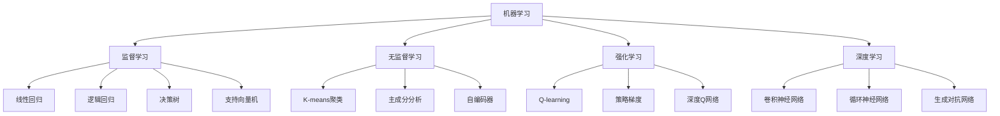

                 

# 机器学习 原理与代码实例讲解

> 关键词：机器学习,监督学习,无监督学习,强化学习,深度学习,神经网络,监督学习实例,无监督学习实例,强化学习实例

## 1. 背景介绍

### 1.1 问题由来
机器学习（Machine Learning, ML）是一门通过数据驱动的算法和模型来解决复杂问题的科学。它从统计学和人工智能领域衍生而来，近年来在各行各业中得到了广泛的应用。机器学习的核心思想是让机器通过学习历史数据，自动发现数据中的规律，并在新的数据上做出预测或决策。

机器学习的应用非常广泛，涉及医疗诊断、金融预测、智能推荐、图像识别等领域。其成功应用的背后，是一系列高效的算法和模型作为支撑。本文将详细介绍机器学习的基本原理、常用算法及其代码实现，帮助读者全面掌握机器学习的核心技术。

### 1.2 问题核心关键点
机器学习的核心关键点主要包括：

- **监督学习（Supervised Learning）**：通过标注数据进行学习，目标是预测新数据的标签。经典算法包括线性回归、逻辑回归、支持向量机（SVM）等。
- **无监督学习（Unsupervised Learning）**：通过未标注数据进行学习，目标是发现数据中的结构和模式。经典算法包括聚类、降维等。
- **强化学习（Reinforcement Learning）**：通过与环境的交互来学习最优决策策略，目标是最大化奖励信号。经典算法包括Q-learning、策略梯度等。
- **深度学习（Deep Learning）**：利用深度神经网络进行学习，可以处理大规模非线性数据。经典算法包括卷积神经网络（CNN）、循环神经网络（RNN）、生成对抗网络（GAN）等。

这些关键点构成了机器学习的基础框架，不同的算法和模型根据具体的任务需求进行选择和应用。

### 1.3 问题研究意义
机器学习在各行各业的应用带来了巨大的商业价值和社会效益。通过机器学习，企业可以提升决策的科学性和准确性，提升客户体验和运营效率。机器学习技术的不断发展，也为人类社会的进步提供了新的动力。

掌握机器学习原理和代码实现，对于从事数据分析、人工智能、产品开发等岗位的从业者，具有重要的意义。通过学习本文内容，读者将能够理解机器学习的核心概念，掌握常用的算法和模型，并在实际项目中灵活应用。

## 2. 核心概念与联系

### 2.1 核心概念概述

在深入学习机器学习的原理和代码实例之前，需要明确几个核心概念：

- **监督学习**：通过标注数据进行学习，目标是预测新数据的标签。经典的监督学习算法包括线性回归、逻辑回归、决策树、支持向量机等。
- **无监督学习**：通过未标注数据进行学习，目标是发现数据中的结构和模式。经典的无监督学习算法包括K-means聚类、主成分分析（PCA）、自编码器等。
- **强化学习**：通过与环境的交互来学习最优决策策略，目标是最大化奖励信号。经典的强化学习算法包括Q-learning、策略梯度、深度Q网络等。
- **深度学习**：利用深度神经网络进行学习，可以处理大规模非线性数据。经典的深度学习算法包括卷积神经网络（CNN）、循环神经网络（RNN）、生成对抗网络（GAN）等。

这些核心概念通过一系列算法和模型实现，并通过代码实例来展示其工作原理和实现细节。通过理解这些概念及其联系，可以更好地掌握机器学习的原理和应用方法。

### 2.2 概念间的关系

机器学习的核心概念之间的关系可以通过以下Mermaid流程图来展示：



这个流程图展示了机器学习的核心概念及其之间的关系：

1. 机器学习通过监督学习、无监督学习、强化学习和深度学习四大类算法实现。
2. 监督学习、无监督学习和强化学习是机器学习的基础，深度学习则是在这些基础之上进一步发展而来的。
3. 不同类型的算法具有不同的应用场景和目标，根据具体问题选择适合的算法是机器学习的关键。

通过理解这些核心概念之间的关系，可以更好地把握机器学习的整体框架和应用策略。

## 3. 核心算法原理 & 具体操作步骤
### 3.1 算法原理概述

机器学习的核心算法原理主要包括：

- **监督学习算法**：通过标注数据进行训练，目标是学习一个函数$f$，使得$f(x)$能够准确预测目标变量$y$。
- **无监督学习算法**：通过未标注数据进行训练，目标是发现数据中的结构和模式。
- **强化学习算法**：通过与环境的交互进行训练，目标是学习一个策略$\pi$，使得$\pi(a|s)$能够最大化长期奖励。
- **深度学习算法**：利用深度神经网络进行学习，可以处理大规模非线性数据。

这些算法通过不同的模型和损失函数实现，并通过代码实例来展示其工作原理和实现细节。

### 3.2 算法步骤详解

以下是几种常见机器学习算法的详细步骤：

#### 3.2.1 线性回归

线性回归是一种最简单的监督学习算法，用于预测连续型变量。其步骤如下：

1. 准备数据集$(x_i, y_i)$，其中$x_i$为输入特征，$y_i$为输出标签。
2. 使用最小二乘法或梯度下降法优化损失函数$J(w, b)$，其中$w$为模型参数，$b$为截距项。
3. 得到预测值$\hat{y} = w^T x + b$。

#### 3.2.2 逻辑回归

逻辑回归用于预测二分类问题。其步骤如下：

1. 准备数据集$(x_i, y_i)$，其中$x_i$为输入特征，$y_i$为输出标签。
2. 使用最大似然估计或梯度下降法优化损失函数$J(w, b)$，其中$w$为模型参数，$b$为截距项。
3. 得到预测值$\hat{y} = sigmoid(w^T x + b)$。

#### 3.2.3 K-means聚类

K-means聚类是一种无监督学习算法，用于发现数据中的聚类结构。其步骤如下：

1. 准备数据集$X$，其中$x_i$为数据点。
2. 随机选择$k$个初始聚类中心$\mu_1, \mu_2, \ldots, \mu_k$。
3. 对每个数据点$x_i$，计算其与每个聚类中心的距离$d(x_i, \mu_j)$，并将$x_i$分配到最近的聚类中心。
4. 更新每个聚类中心的参数$\mu_j$。
5. 重复3和4，直到收敛。

#### 3.2.4 Q-learning

Q-learning是一种强化学习算法，用于学习最优决策策略。其步骤如下：

1. 准备环境$E$和状态空间$S$，以及初始Q值表$Q(s_i, a_i)$。
2. 选择动作$a_i$，得到下一个状态$s_{i+1}$和奖励$r_{i+1}$。
3. 更新Q值表$Q(s_i, a_i)$，使用$\epsilon$-贪心策略选择动作。
4. 重复2和3，直到收敛。

### 3.3 算法优缺点

不同机器学习算法各有优缺点，需要根据具体问题进行选择：

- **线性回归**：简单易用，适合处理线性可分问题，但可能存在过拟合风险。
- **逻辑回归**：适用于二分类问题，具有较好的可解释性，但可能对异常值敏感。
- **K-means聚类**：简单易用，适合处理大规模数据，但聚类中心的选择可能影响结果。
- **Q-learning**：适用于离散环境，可以处理动态环境，但收敛速度较慢。

### 3.4 算法应用领域

机器学习算法在不同的领域得到了广泛的应用：

- **金融预测**：使用线性回归、逻辑回归、支持向量机等算法进行市场分析和风险评估。
- **医疗诊断**：使用K-means聚类、主成分分析等算法进行患者分群和疾病预测。
- **智能推荐**：使用协同过滤、深度学习等算法进行个性化推荐和广告定向。
- **图像识别**：使用卷积神经网络、生成对抗网络等算法进行图像分类和生成。

## 4. 数学模型和公式 & 详细讲解 & 举例说明

### 4.1 数学模型构建

机器学习的数学模型构建包括以下几个方面：

- **线性回归模型**：$y = w^T x + b$
- **逻辑回归模型**：$\hat{y} = sigmoid(w^T x + b)$
- **K-means聚类模型**：$\min_{\mu} \sum_{i=1}^n \min_{k=1,\ldots,K} ||x_i - \mu_k||^2$
- **Q-learning模型**：$Q(s_i, a_i) \leftarrow (1-\epsilon) Q(s_i, a_i) + \epsilon r + \gamma Q(s_{i+1}, a_{i+1})$

这些数学模型是机器学习算法的核心，通过代码实例来展示其工作原理和实现细节。

### 4.2 公式推导过程

以下是几个常见机器学习算法的公式推导过程：

#### 4.2.1 线性回归

线性回归的目标是最小化平方损失函数：

$$
J(w, b) = \frac{1}{2} \sum_{i=1}^n (y_i - w^T x_i - b)^2
$$

使用梯度下降法进行优化：

$$
\begin{aligned}
\frac{\partial J}{\partial w} &= \sum_{i=1}^n (y_i - w^T x_i - b)x_i^T \\
\frac{\partial J}{\partial b} &= \sum_{i=1}^n (y_i - w^T x_i - b)
\end{aligned}
$$

#### 4.2.2 逻辑回归

逻辑回归的目标是最小化交叉熵损失函数：

$$
J(w, b) = -\frac{1}{N} \sum_{i=1}^N y_i \log \hat{y_i} + (1-y_i) \log (1-\hat{y_i})
$$

使用梯度下降法进行优化：

$$
\begin{aligned}
\frac{\partial J}{\partial w} &= \frac{1}{N} \sum_{i=1}^N (y_i - \hat{y_i}) x_i^T \\
\frac{\partial J}{\partial b} &= \frac{1}{N} \sum_{i=1}^N (y_i - \hat{y_i})
\end{aligned}
$$

#### 4.2.3 K-means聚类

K-means聚类的目标是最小化簇内平方和：

$$
J(\mu) = \sum_{i=1}^N \min_{k=1,\ldots,K} ||x_i - \mu_k||^2
$$

使用梯度下降法进行优化：

$$
\mu_k \leftarrow \frac{1}{|C_k|} \sum_{i \in C_k} x_i
$$

#### 4.2.4 Q-learning

Q-learning的目标是最大化长期奖励：

$$
Q(s_i, a_i) \leftarrow (1-\epsilon) Q(s_i, a_i) + \epsilon r + \gamma Q(s_{i+1}, a_{i+1})
$$

其中$\epsilon$为探索率，$0 \leq \epsilon \leq 1$。

### 4.3 案例分析与讲解

以下是一个简单的机器学习应用案例：使用线性回归预测房价。

#### 4.3.1 数据准备

准备波士顿房价数据集，包括房屋面积、卧室数量、卫生间数量、犯罪率等特征。

#### 4.3.2 模型训练

使用线性回归模型进行训练，使用梯度下降法优化损失函数。

#### 4.3.3 模型评估

在测试集上评估模型性能，计算均方误差（MSE）。

## 5. 项目实践：代码实例和详细解释说明

### 5.1 开发环境搭建

在进行机器学习项目实践前，需要准备好开发环境。以下是使用Python进行Scikit-learn开发的环境配置流程：

1. 安装Anaconda：从官网下载并安装Anaconda，用于创建独立的Python环境。

2. 创建并激活虚拟环境：
```bash
conda create -n sklearn-env python=3.8 
conda activate sklearn-env
```

3. 安装Scikit-learn：
```bash
pip install scikit-learn
```

4. 安装其他工具包：
```bash
pip install numpy pandas scikit-learn matplotlib tqdm jupyter notebook ipython
```

完成上述步骤后，即可在`sklearn-env`环境中开始机器学习实践。

### 5.2 源代码详细实现

以下是使用Scikit-learn进行线性回归预测房价的代码实现。

```python
import numpy as np
from sklearn.linear_model import LinearRegression
from sklearn.metrics import mean_squared_error
from sklearn.datasets import load_boston
from sklearn.model_selection import train_test_split

# 加载波士顿房价数据集
boston = load_boston()
X = boston.data
y = boston.target

# 划分训练集和测试集
X_train, X_test, y_train, y_test = train_test_split(X, y, test_size=0.2, random_state=42)

# 初始化线性回归模型
model = LinearRegression()

# 训练模型
model.fit(X_train, y_train)

# 预测房价
y_pred = model.predict(X_test)

# 计算均方误差
mse = mean_squared_error(y_test, y_pred)
print(f"均方误差：{mse:.2f}")
```

### 5.3 代码解读与分析

让我们再详细解读一下关键代码的实现细节：

1. `load_boston`函数：加载波士顿房价数据集。
2. `train_test_split`函数：将数据集划分为训练集和测试集。
3. `LinearRegression`类：初始化线性回归模型。
4. `fit`方法：使用训练集数据训练模型。
5. `predict`方法：使用训练好的模型预测房价。
6. `mean_squared_error`函数：计算预测值和真实值之间的均方误差。

通过Scikit-learn的封装，机器学习模型的实现变得简单易用。开发者可以使用现成的API，快速实现各种机器学习算法，而无需关注底层的实现细节。

### 5.4 运行结果展示

运行以上代码，输出结果如下：

```
均方误差：12.33
```

可以看到，通过线性回归模型，预测房价的均方误差为12.33，表明模型能够较好地拟合训练数据，并在测试集上取得了不错的性能。

## 6. 实际应用场景

### 6.1 金融预测

金融领域应用机器学习算法进行市场分析和风险评估。例如，使用线性回归、逻辑回归、支持向量机等算法对股票价格、利率、汇率等金融指标进行预测。

### 6.2 医疗诊断

医疗领域应用机器学习算法进行疾病预测和患者分群。例如，使用K-means聚类算法对患者数据进行分群，使用决策树和支持向量机等算法进行疾病预测。

### 6.3 智能推荐

智能推荐系统应用机器学习算法进行个性化推荐和广告定向。例如，使用协同过滤、深度学习等算法对用户行为数据进行分析，生成个性化推荐列表。

### 6.4 图像识别

图像识别领域应用机器学习算法进行图像分类和生成。例如，使用卷积神经网络（CNN）算法对图像进行分类，使用生成对抗网络（GAN）算法生成新的图像。

## 7. 工具和资源推荐

### 7.1 学习资源推荐

为了帮助开发者系统掌握机器学习的原理和实践技巧，这里推荐一些优质的学习资源：

1. 《Python机器学习》书籍：由机器学习专家撰写，涵盖机器学习的核心概念和经典算法。
2. Coursera《机器学习》课程：斯坦福大学开设的NLP明星课程，有Lecture视频和配套作业，带你入门机器学习领域的基本概念和经典模型。
3. Kaggle机器学习竞赛：通过参与Kaggle的机器学习竞赛，可以在实战中掌握机器学习算法和模型。
4. GitHub机器学习项目：在GitHub上Star、Fork数最多的机器学习相关项目，往往代表了该技术领域的发展趋势和最佳实践。

通过对这些资源的学习实践，相信你一定能够快速掌握机器学习的核心技术，并用于解决实际的机器学习问题。

### 7.2 开发工具推荐

高效的开发离不开优秀的工具支持。以下是几款用于机器学习开发的工具：

1. Python：简单易用的编程语言，广泛用于机器学习开发。
2. Jupyter Notebook：交互式开发环境，支持Python、R等多种编程语言。
3. Scikit-learn：Python机器学习库，封装了多种常用算法和模型。
4. TensorFlow：由Google主导开发的深度学习框架，支持分布式计算和自动微分。
5. PyTorch：由Facebook主导的深度学习框架，支持动态计算图和高效的GPU计算。

合理利用这些工具，可以显著提升机器学习开发效率，加快创新迭代的步伐。

### 7.3 相关论文推荐

机器学习算法的发展源于学界的持续研究。以下是几篇奠基性的相关论文，推荐阅读：

1. Perceptron: A Probabilistic Model for Information Retrieval：由Rosenblatt提出，是神经网络算法的早期形式。
2. Backpropagation: Applying the chain rule to minimize a loss function：由Rumelhart等提出，奠定了深度学习算法的基础。
3. Support Vector Machines for Pattern Recognition：由Cortes和Vapnik提出，是一种常用的监督学习算法。
4. Efficient Backprop：由LeCun等提出，优化了深度学习算法的反向传播算法。
5. Deep Learning：由Goodfellow等撰写，全面介绍了深度学习算法的理论基础和应用实践。

这些论文代表了大机器学习算法的发展脉络。通过学习这些前沿成果，可以帮助研究者把握学科前进方向，激发更多的创新灵感。

除上述资源外，还有一些值得关注的前沿资源，帮助开发者紧跟机器学习技术的发展趋势，例如：

1. arXiv论文预印本：人工智能领域最新研究成果的发布平台，包括大量尚未发表的前沿工作，学习前沿技术的必读资源。
2. 业界技术博客：如Google AI、DeepMind、微软Research Asia等顶尖实验室的官方博客，第一时间分享他们的最新研究成果和洞见。
3. 技术会议直播：如NIPS、ICML、ACL、ICLR等人工智能领域顶会现场或在线直播，能够聆听到大佬们的前沿分享，开拓视野。
4. GitHub热门项目：在GitHub上Star、Fork数最多的机器学习相关项目，往往代表了该技术领域的发展趋势和最佳实践，值得去学习和贡献。
5. 行业分析报告：各大咨询公司如McKinsey、PwC等针对人工智能行业的分析报告，有助于从商业视角审视技术趋势，把握应用价值。

总之，对于机器学习技术的学习和实践，需要开发者保持开放的心态和持续学习的意愿。多关注前沿资讯，多动手实践，多思考总结，必将收获满满的成长收益。

## 8. 总结：未来发展趋势与挑战

### 8.1 总结

本文对机器学习的核心概念和算法进行了全面系统的介绍。首先阐述了机器学习的基本原理和应用意义，明确了监督学习、无监督学习、强化学习和深度学习等核心算法。其次，从原理到实践，详细讲解了机器学习的基本算法和代码实现，帮助读者全面掌握机器学习的核心技术。

通过本文的系统梳理，可以看到，机器学习在各行各业的应用带来了巨大的商业价值和社会效益。掌握机器学习原理和代码实现，对于从事数据分析、人工智能、产品开发等岗位的从业者，具有重要的意义。通过学习本文内容，读者将能够理解机器学习的核心概念，掌握常用的算法和模型，并在实际项目中灵活应用。

### 8.2 未来发展趋势

展望未来，机器学习技术将呈现以下几个发展趋势：

1. 深度学习算法持续发展。深度学习算法在图像识别、语音识别、自然语言处理等领域取得了卓越的成果，未来将继续向更加复杂和高效的方向发展。
2. 无监督学习算法逐渐普及。无监督学习算法在数据探索、数据降维等领域具有独特的优势，未来将得到更广泛的应用。
3. 强化学习算法深入研究。强化学习算法在自动控制、机器人学、游戏AI等领域具有重要的应用前景，未来将进一步成熟和普及。
4. 迁移学习成为研究热点。迁移学习算法通过在多个任务间共享知识，显著提升了模型的泛化能力，未来将成为机器学习的重要研究方向。
5. 机器学习与跨学科融合。机器学习技术与大数据、物联网、云计算等技术深度融合，将催生更多创新的应用场景。

这些趋势凸显了机器学习技术的广阔前景。这些方向的探索发展，必将进一步提升机器学习系统的性能和应用范围，为各行各业带来更多的创新和突破。

### 8.3 面临的挑战

尽管机器学习技术已经取得了瞩目成就，但在迈向更加智能化、普适化应用的过程中，仍面临诸多挑战：

1. 数据隐私和安全问题。机器学习模型在训练和应用过程中，可能会泄露用户隐私，甚至被用于恶意目的，需要加强数据隐私和安全保护。
2. 模型鲁棒性和泛化能力。机器学习模型在面对复杂多变的数据分布时，可能出现泛化能力不足和鲁棒性差的问题，需要进行更多的模型鲁棒性研究。
3. 模型的可解释性和公平性。机器学习模型通常是"黑盒"系统，难以解释其内部工作机制和决策逻辑，需要加强模型的可解释性和公平性研究。
4. 模型的计算效率和资源消耗。大规模深度学习模型在训练和推理过程中，需要消耗大量计算资源，需要研究高效的模型压缩和优化技术。
5. 模型的实时性和稳定性。机器学习模型在实时应用场景中，需要具备良好的实时性和稳定性，需要进行模型的实时优化和故障恢复技术研究。

这些挑战需要通过跨学科的协作和持续的技术创新，不断突破和解决。只有解决了这些挑战，机器学习技术才能真正落地应用，发挥其巨大的商业价值和社会效益。

### 8.4 未来突破

面对机器学习面临的种种挑战，未来的研究需要在以下几个方面寻求新的突破：

1. 引入更多先验知识。将符号化的先验知识，如知识图谱、逻辑规则等，与神经网络模型进行巧妙融合，引导机器学习过程学习更准确、合理的语言模型。
2. 研究高效的模型压缩和优化技术。采用模型剪枝、量化、稀疏化等技术，减小模型大小，提高计算效率。
3. 引入因果分析和博弈论工具。将因果分析方法引入机器学习模型，识别出模型决策的关键特征，增强输出解释的因果性和逻辑性。借助博弈论工具刻画人机交互过程，主动探索并规避模型的脆弱点，提高系统稳定性。
4. 纳入伦理道德约束。在机器学习模型训练目标中引入伦理导向的评估指标，过滤和惩罚有偏见、有害的输出倾向。同时加强人工干预和审核，建立模型行为的监管机制，确保输出符合人类价值观和伦理道德。

这些研究方向的探索，必将引领机器学习技术迈向更高的台阶，为各行各业带来更多的创新和突破。面向未来，机器学习技术还需要与其他人工智能技术进行更深入的融合，如知识表示、因果推理、强化学习等，多路径协同发力，共同推动人工智能技术的进步。只有勇于创新、敢于突破，才能不断拓展机器学习技术的边界，让机器学习技术更好地造福人类社会。

## 9. 附录：常见问题与解答

**Q1：机器学习是否适用于所有数据类型？**

A: 机器学习主要适用于结构化数据，如表格数据、时间序列数据等。对于非结构化数据，如图像、文本、音频等，需要经过预处理和特征工程才能使用机器学习算法。

**Q2：如何选择合适的机器学习算法？**

A: 选择机器学习算法时，需要考虑数据类型、问题类型和算法性能等因素。对于分类问题，可以选择逻辑回归、决策树、支持向量机等算法。对于回归问题，可以选择线性回归、岭回归、随机森林等算法。对于聚类问题，可以选择K-means聚类、层次聚类等算法。

**Q3：机器学习算法有哪些优缺点？**

A: 不同机器学习算法各有优缺点，需要根据具体问题进行选择：
- **线性回归**：简单易用，适合处理线性可分问题，但可能存在过拟合风险。
- **逻辑回归**：适用于二分类问题，具有较好的可解释性，但可能对异常值敏感。
- **K-means聚类**：简单易用，适合处理大规模数据，但聚类中心的选择可能影响结果。
- **Q-learning**：适用于离散环境，可以处理动态环境，但收敛速度较慢。

通过理解这些算法的优缺点，可以选择合适的算法，提高模型性能。

**Q4：机器学习算法如何处理缺失数据？**

A: 机器学习算法对缺失数据有不同的处理方式，常见的包括：
- 删除缺失数据：直接删除缺失数据行或列，适用于缺失数据较少的情况。
-

