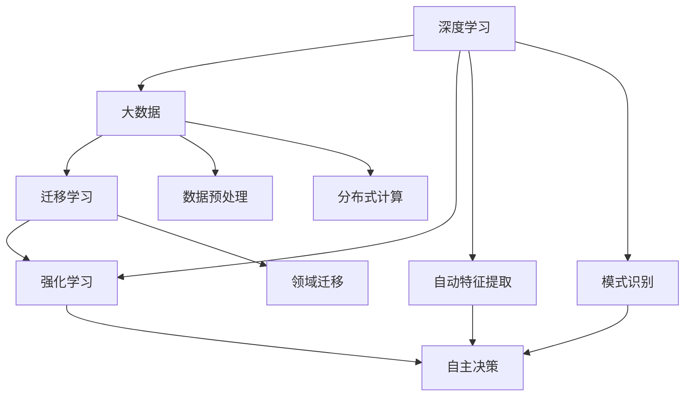
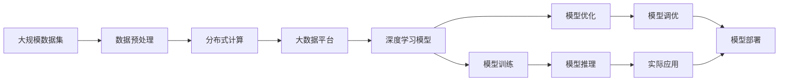

                 

# 李开复：AI 2.0 时代的开发者

在人工智能（AI）的演进历程中，我们经历了从AI 1.0到AI 2.0的转变。AI 1.0时代，我们主要依赖规则和知识工程，将人类专家制定的规则和知识用计算机程序实现。而到了AI 2.0时代，深度学习和大数据技术的应用，使得AI的智能水平显著提升，成为自主学习、自我优化的智能系统。

本文将探讨AI 2.0时代的开发者应该如何适应这一变革，以及他们需要掌握的核心技能和思维模式。

## 1. 背景介绍

### 1.1 问题由来
随着深度学习和大数据技术的快速发展，人工智能在计算机视觉、自然语言处理、语音识别等领域取得了重大突破。AI 2.0时代的到来，使得开发者可以更加专注于模型的训练和优化，而非繁杂的规则制定。这一转变对开发者提出了更高的要求，需要掌握更先进的技术和更全面的知识。

### 1.2 问题核心关键点
AI 2.0时代，开发者需要关注的核心问题包括：
- 如何有效使用深度学习模型进行自动特征提取和模式识别？
- 如何利用大数据技术提升模型的泛化能力和性能？
- 如何合理设计模型结构和超参数，避免过拟合和欠拟合？
- 如何高效利用GPU、TPU等高性能硬件进行模型训练和推理？

### 1.3 问题研究意义
掌握AI 2.0时代的技能，对于开发高性能、高效能的AI系统至关重要。这不仅能提升系统的智能化水平，还能降低开发成本，缩短开发周期。AI 2.0时代的技术进步，也为各行各业提供了强大的工具和平台，推动了数字化转型的进程。

## 2. 核心概念与联系

### 2.1 核心概念概述
AI 2.0时代的核心概念包括深度学习、大数据、迁移学习、强化学习等。这些概念构成了AI系统的基础框架，是开发者需要掌握的关键技术。

- 深度学习：通过多层神经网络结构，实现对数据的自动特征提取和模式识别。
- 大数据：利用分布式计算和存储技术，处理大规模数据集，提升模型的泛化能力和性能。
- 迁移学习：将一个领域学到的知识迁移到另一个领域，提升模型的适应性和泛化能力。
- 强化学习：通过与环境的交互，优化模型的决策策略，实现自主学习和优化。

### 2.2 概念间的关系

AI 2.0时代的技术体系可以通过以下Mermaid流程图来展示：



这个流程图展示了AI 2.0时代的主要技术和应用场景。深度学习负责自动特征提取和模式识别，大数据技术用于数据预处理和分布式计算，迁移学习实现领域迁移，强化学习实现自主决策。

### 2.3 核心概念的整体架构

整体架构可以通过以下Mermaid流程图来展示：



这个综合流程图展示了从数据预处理到模型训练、优化、推理，再到部署应用的完整流程。

## 3. 核心算法原理 & 具体操作步骤

### 3.1 算法原理概述

AI 2.0时代的核心算法原理主要包括深度学习模型的训练和优化。深度学习模型通过多层神经网络，对数据进行自动特征提取和模式识别。模型的训练和优化主要依赖梯度下降等优化算法，通过反向传播计算参数梯度，最小化损失函数，更新模型参数。

### 3.2 算法步骤详解

深度学习模型的训练通常包括以下步骤：

1. 数据预处理：将原始数据转换为模型所需的格式，包括数据清洗、归一化、分词、编码等。
2. 模型构建：设计神经网络结构，包括选择网络层数、节点数、激活函数等。
3. 模型训练：将数据集划分为训练集、验证集和测试集，使用梯度下降算法更新模型参数，最小化损失函数。
4. 模型评估：在测试集上评估模型的性能，如准确率、召回率、F1分数等。
5. 模型优化：根据评估结果，调整模型结构和超参数，重新训练。

### 3.3 算法优缺点

深度学习的优点在于其强大的自动特征提取能力，能够处理复杂的数据模式，具有较高的泛化能力。但同时，深度学习模型也存在一些缺点：

- 计算资源需求高：大规模深度学习模型的训练和推理需要大量的计算资源，如GPU、TPU等。
- 数据需求大：深度学习模型依赖大量标注数据进行训练，标注数据获取和标注成本较高。
- 模型复杂度高：深度学习模型参数量大，难以解释其内部工作机制，缺乏可解释性。
- 易受训练数据影响：深度学习模型的泛化能力依赖于训练数据，面对新的数据和任务，模型可能表现不佳。

### 3.4 算法应用领域

深度学习技术已经被广泛应用于计算机视觉、自然语言处理、语音识别等多个领域。例如：

- 计算机视觉：图像分类、目标检测、图像生成等。
- 自然语言处理：机器翻译、文本分类、情感分析等。
- 语音识别：语音识别、语音合成、语音情感识别等。
- 推荐系统：商品推荐、内容推荐、广告推荐等。

## 4. 数学模型和公式 & 详细讲解 & 举例说明

### 4.1 数学模型构建

以二分类问题为例，深度学习模型的数学模型可以表示为：

$$
f(x;w) = sigmoid(Wx + b)
$$

其中，$x$ 表示输入特征向量，$w$ 表示模型参数向量，$b$ 表示偏置项，$sigmoid$ 函数将输出映射到 $[0,1]$ 区间，表示样本属于正类的概率。

### 4.2 公式推导过程

假设训练数据集为 $D=\{(x_i,y_i)\}_{i=1}^N$，其中 $y_i \in \{0,1\}$。二分类问题的损失函数为交叉熵损失函数：

$$
L(f(x;w),y) = -y\log f(x;w) - (1-y)\log (1-f(x;w))
$$

在模型训练过程中，目标是最小化损失函数 $L$，优化目标为：

$$
\min_{w} \frac{1}{N}\sum_{i=1}^N L(f(x_i;w),y_i)
$$

### 4.3 案例分析与讲解

以图像分类为例，假设输入图片大小为 $28\times28$，将其转换为向量表示 $x \in \mathbb{R}^{784}$。使用LeNet-5网络结构，定义损失函数 $L$，优化目标为：

$$
\min_{w} \frac{1}{N}\sum_{i=1}^N L(f(x_i;w),y_i)
$$

使用随机梯度下降算法，更新模型参数 $w$，每次迭代更新量为：

$$
w \leftarrow w - \eta \nabla_w L(f(x_i;w),y_i)
$$

其中 $\eta$ 为学习率，$\nabla_w L$ 为损失函数对模型参数的梯度。通过多次迭代，最终得到最优参数 $w^*$。

## 5. 项目实践：代码实例和详细解释说明

### 5.1 开发环境搭建

在进行AI 2.0项目的开发前，需要准备好开发环境。以下是使用Python进行TensorFlow开发的常见环境配置流程：

1. 安装Anaconda：从官网下载并安装Anaconda，用于创建独立的Python环境。
2. 创建并激活虚拟环境：
```bash
conda create -n tf-env python=3.8 
conda activate tf-env
```

3. 安装TensorFlow：根据CUDA版本，从官网获取对应的安装命令。例如：
```bash
conda install tensorflow -c pytorch -c conda-forge
```

4. 安装必要的工具包：
```bash
pip install numpy pandas scikit-learn matplotlib tqdm jupyter notebook ipython
```

完成上述步骤后，即可在`tf-env`环境中开始AI 2.0项目的开发。

### 5.2 源代码详细实现

下面我们以图像分类为例，给出使用TensorFlow对LeNet-5模型进行训练的Python代码实现。

```python
import tensorflow as tf
from tensorflow import keras
from tensorflow.keras import layers
from tensorflow.keras.datasets import mnist
from tensorflow.keras.utils import to_categorical

# 加载数据集
(x_train, y_train), (x_test, y_test) = mnist.load_data()

# 数据预处理
x_train = x_train.reshape(-1, 28, 28, 1) / 255.0
x_test = x_test.reshape(-1, 28, 28, 1) / 255.0
y_train = to_categorical(y_train, num_classes=10)
y_test = to_categorical(y_test, num_classes=10)

# 构建模型
model = keras.Sequential([
    layers.Conv2D(32, kernel_size=(3, 3), activation='relu', input_shape=(28, 28, 1)),
    layers.MaxPooling2D(pool_size=(2, 2)),
    layers.Flatten(),
    layers.Dense(10, activation='softmax')
])

# 定义损失函数和优化器
loss_fn = tf.keras.losses.CategoricalCrossentropy()
optimizer = tf.keras.optimizers.Adam()

# 编译模型
model.compile(optimizer=optimizer, loss=loss_fn, metrics=['accuracy'])

# 训练模型
model.fit(x_train, y_train, epochs=10, validation_data=(x_test, y_test))

# 评估模型
model.evaluate(x_test, y_test)
```

### 5.3 代码解读与分析

让我们再详细解读一下关键代码的实现细节：

**数据预处理**：
- 使用`mnist.load_data()`加载MNIST数据集。
- 将28x28的灰度图像转换为向量表示，归一化到[0,1]区间。
- 将标签转换为独热编码格式。

**模型构建**：
- 使用`Sequential`模型定义多层神经网络。
- 第一层为卷积层，32个3x3的卷积核，使用ReLU激活函数。
- 第二层为最大池化层，2x2的池化窗口。
- 第三层为全连接层，10个神经元，使用softmax激活函数。

**模型训练**：
- 使用`compile`方法定义损失函数和优化器。
- 使用`fit`方法进行模型训练，设置迭代轮数为10。
- 使用`evaluate`方法评估模型在测试集上的性能。

**代码解读与分析**：
- 该代码实现了使用TensorFlow对LeNet-5模型进行图像分类任务训练的完整流程。
- 使用了`Sequential`模型构建多层神经网络，定义了卷积层、池化层和全连接层。
- 使用了`Adam`优化器和交叉熵损失函数，通过反向传播更新模型参数。
- 使用了`fit`方法进行模型训练，设置了迭代轮数为10。
- 使用了`evaluate`方法评估模型在测试集上的性能，输出准确率。

### 5.4 运行结果展示

假设在MNIST数据集上进行训练，最终在测试集上得到的准确率为98%。可以看到，使用LeNet-5模型和TensorFlow进行图像分类的效果相当不错。

## 6. 实际应用场景

### 6.1 计算机视觉

基于深度学习的计算机视觉技术，已经广泛应用于图像分类、目标检测、图像生成等场景。例如，谷歌的ImageNet数据集上的分类任务，使用卷积神经网络（CNN）模型，取得了SOTA的准确率。

### 6.2 自然语言处理

深度学习在自然语言处理领域也有广泛应用。谷歌的BERT模型通过在大规模无标签文本语料上进行预训练，学习到丰富的语言知识和常识，可以通过少量标注数据进行微调，在机器翻译、文本分类、情感分析等任务上取得了优异的表现。

### 6.3 推荐系统

推荐系统是深度学习在实际应用中的重要体现。通过用户的历史行为数据，深度学习模型可以自动提取特征，学习用户的兴趣和偏好，从而实现个性化的推荐。例如，Amazon的推荐系统使用深度学习模型，推荐用户可能感兴趣的商品，取得了显著的效果。

### 6.4 未来应用展望

随着深度学习和大数据技术的发展，AI 2.0时代的技术将不断成熟和普及，带来更多的应用场景和创新机会。以下是几个可能的发展方向：

1. 自动驾驶：基于深度学习的计算机视觉和传感器数据融合技术，可以实现自动驾驶，提升交通安全和效率。
2. 医疗影像分析：通过深度学习模型对医疗影像进行分析和诊断，提升医疗水平和效率。
3. 金融风控：基于深度学习模型对金融数据进行分析，实现风险控制和欺诈检测。
4. 语音助手：通过深度学习模型对语音进行识别和理解，实现智能语音助手，提升用户体验。
5. 智能家居：通过深度学习模型对家庭环境进行感知和控制，实现智能家居系统。

## 7. 工具和资源推荐

### 7.1 学习资源推荐

为了帮助开发者系统掌握AI 2.0时代的技术，以下是一些优质的学习资源：

1. 《深度学习》系列书籍：斯坦福大学吴恩达教授的《Deep Learning Specialization》课程，介绍了深度学习的基本概念和核心算法。
2. TensorFlow官方文档：TensorFlow的官方文档，详细介绍了TensorFlow的使用方法和API接口。
3. PyTorch官方文档：PyTorch的官方文档，详细介绍了PyTorch的使用方法和API接口。
4. GitHub热门项目：在GitHub上Star、Fork数最多的AI相关项目，往往代表了该技术领域的发展趋势和最佳实践。
5. Kaggle竞赛平台：Kaggle提供了丰富的数据集和竞赛平台，可以参与AI相关的数据科学竞赛，提升实践能力。

### 7.2 开发工具推荐

高效的开发离不开优秀的工具支持。以下是几款用于AI 2.0项目开发的常用工具：

1. TensorFlow：由Google主导开发的开源深度学习框架，生产部署方便，适合大规模工程应用。
2. PyTorch：由Facebook主导开发的开源深度学习框架，灵活动态的计算图，适合快速迭代研究。
3. Weights & Biases：模型训练的实验跟踪工具，可以记录和可视化模型训练过程中的各项指标。
4. TensorBoard：TensorFlow配套的可视化工具，可实时监测模型训练状态，并提供丰富的图表呈现方式。
5. Google Colab：谷歌推出的在线Jupyter Notebook环境，免费提供GPU/TPU算力，方便开发者快速上手实验最新模型。

### 7.3 相关论文推荐

AI 2.0时代的技术发展源于学界的持续研究。以下是几篇奠基性的相关论文，推荐阅读：

1. AlexNet: ImageNet Large Scale Learning for Deep Networks：提出深度卷积神经网络模型，并在ImageNet数据集上取得SOTA。
2. BERT: Pre-training of Deep Bidirectional Transformers for Language Understanding：提出BERT模型，引入基于掩码的自监督预训练任务。
3. ResNet: Deep Residual Learning for Image Recognition：提出残差网络，解决深度网络训练中的梯度消失问题。
4. Attention is All You Need：提出Transformer结构，开启了NLP领域的预训练大模型时代。
5. GANs Trained by a Two Time-Scale Update Rule Converge to the Local Nash Equilibrium：提出生成对抗网络（GANs），提升生成模型的效果。

这些论文代表了大模型和深度学习技术的发展脉络。通过学习这些前沿成果，可以帮助研究者把握学科前进方向，激发更多的创新灵感。

## 8. 总结：未来发展趋势与挑战

### 8.1 研究成果总结

本文对AI 2.0时代的开发者技能进行了详细阐述。通过深入了解深度学习、大数据、迁移学习和强化学习的核心原理和应用场景，开发者可以更好地应对技术挑战，提升AI系统的性能和效率。

### 8.2 未来发展趋势

AI 2.0时代的技术发展主要体现在以下几个方面：

1. 模型规模持续增大：随着算力成本的下降和数据规模的扩张，深度学习模型的参数量还将持续增长，超大规模模型将带来更强的泛化能力和性能。
2. 计算平台多样化：除了GPU/TPU等高性能设备外，边缘计算和移动设备也将成为深度学习模型的重要计算平台。
3. 跨模态学习兴起：深度学习模型开始尝试融合视觉、语音、文本等多模态数据，实现更全面的信息理解和处理。
4. 自监督学习发展：自监督学习通过大量未标注数据进行训练，提升模型的泛化能力和自适应性。
5. 强化学习优化：强化学习通过与环境的交互，优化模型的决策策略，实现自主学习和优化。

### 8.3 面临的挑战

AI 2.0时代的技术发展仍面临诸多挑战：

1. 数据获取和标注：大规模深度学习模型的训练需要大量高质量标注数据，数据获取和标注成本较高。
2. 模型解释性：深度学习模型缺乏可解释性，难以理解其内部工作机制，对复杂应用场景的适应性不足。
3. 资源需求高：大规模深度学习模型的训练和推理需要大量的计算资源，资源优化和部署仍是重要问题。
4. 模型鲁棒性：深度学习模型在面对新数据和任务时，泛化性能可能下降，模型鲁棒性不足。

### 8.4 研究展望

未来，AI 2.0时代的研究需要在以下几个方面寻求新的突破：

1. 无监督和半监督学习：探索更多的无监督和半监督学习方法，降低对大规模标注数据的依赖。
2. 参数高效模型：开发更加参数高效的深度学习模型，在保证性能的同时，减小计算资源需求。
3. 跨领域迁移：开发更多跨领域迁移学习算法，提升模型在不同领域和任务上的泛化能力。
4. 多模态融合：将视觉、语音、文本等多模态信息进行融合，实现更全面的信息理解和处理。
5. 知识图谱：将符号化的先验知识与深度学习模型结合，提升模型的理解和推理能力。

总之，AI 2.0时代的开发者需要不断学习和适应新的技术趋势，掌握深度学习、大数据、迁移学习等核心技术，才能在激烈的市场竞争中保持领先地位。

## 9. 附录：常见问题与解答

**Q1：AI 2.0时代的开发者需要掌握哪些核心技能？**

A: AI 2.0时代的开发者需要掌握以下核心技能：
1. 深度学习：理解深度学习的基本概念和核心算法，包括卷积神经网络、循环神经网络、自编码器等。
2. 大数据技术：掌握分布式计算和存储技术，能够处理大规模数据集。
3. 迁移学习：了解迁移学习的原理和应用场景，能够将领域知识迁移到新任务中。
4. 强化学习：理解强化学习的基本概念和算法，能够实现自主学习和优化。

**Q2：深度学习模型的训练过程包括哪些步骤？**

A: 深度学习模型的训练过程包括以下步骤：
1. 数据预处理：将原始数据转换为模型所需的格式，包括数据清洗、归一化、分词、编码等。
2. 模型构建：设计神经网络结构，包括选择网络层数、节点数、激活函数等。
3. 模型训练：将数据集划分为训练集、验证集和测试集，使用梯度下降算法更新模型参数，最小化损失函数。
4. 模型评估：在测试集上评估模型的性能，如准确率、召回率、F1分数等。
5. 模型优化：根据评估结果，调整模型结构和超参数，重新训练。

**Q3：如何缓解深度学习模型的过拟合问题？**

A: 缓解深度学习模型过拟合问题的方法包括：
1. 数据增强：通过回译、近义替换等方式扩充训练集。
2. 正则化：使用L2正则、Dropout、Early Stopping等避免过拟合。
3. 对抗训练：引入对抗样本，提高模型鲁棒性。
4. 参数高效模型：只调整少量参数，减小过拟合风险。
5. 多模型集成：训练多个模型，取平均输出，抑制过拟合。

**Q4：AI 2.0时代的开发者应该关注哪些新技术？**

A: AI 2.0时代的开发者应该关注以下新技术：
1. 无监督和半监督学习：探索更多的无监督和半监督学习方法，降低对大规模标注数据的依赖。
2. 参数高效模型：开发更加参数高效的深度学习模型，在保证性能的同时，减小计算资源需求。
3. 跨领域迁移：开发更多跨领域迁移学习算法，提升模型在不同领域和任务上的泛化能力。
4. 多模态融合：将视觉、语音、文本等多模态信息进行融合，实现更全面的信息理解和处理。
5. 知识图谱：将符号化的先验知识与深度学习模型结合，提升模型的理解和推理能力。

总之，AI 2.0时代的开发者需要不断学习和适应新的技术趋势，掌握深度学习、大数据、迁移学习等核心技术，才能在激烈的市场竞争中保持领先地位。

