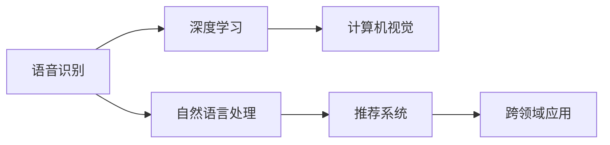
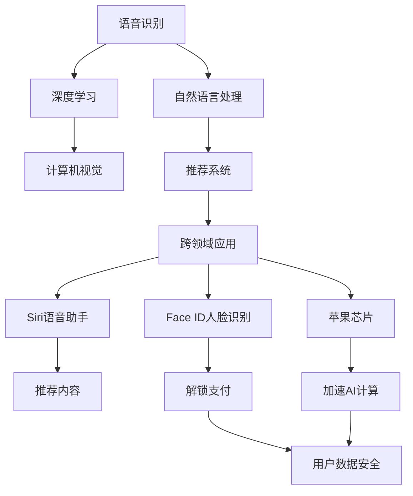

                 

# 李开复：苹果发布AI应用的生态

在人工智能(AI)时代，科技巨头们纷纷布局AI应用生态，其中苹果公司在AI领域的应用尤为引人注目。本文将从背景介绍、核心概念与联系、核心算法原理与具体操作步骤、数学模型和公式详细讲解、项目实践、实际应用场景、工具和资源推荐、总结与未来展望等多个维度，全面解析苹果公司在AI应用生态上的布局与策略。

## 1. 背景介绍

### 1.1 问题由来
随着人工智能技术的不断进步，各大科技公司纷纷争相布局AI应用生态。苹果公司作为全球科技行业的领军者，同样在这一领域做出了重要布局。苹果的AI应用生态主要由以下几个方面构成：

1. Siri语音助手：通过语音识别和自然语言处理技术，实现语音交互。
2. 苹果芯片（如A系列、M系列）：采用神经网络加速，大幅提升AI计算性能。
3. Face ID人脸识别：通过深度学习实现面部特征识别，应用于解锁和支付。
4. 推荐系统：根据用户行为和偏好，智能推荐内容。
5. 图像识别：应用于相册中的标签和检索。

苹果的AI应用生态涵盖了从语音、图像到芯片、推荐系统的多个领域，展现了其在AI技术上的全面布局。本文将重点介绍苹果AI应用生态的核心部分，并详细解析其实现原理和技术细节。

### 1.2 问题核心关键点
苹果在AI应用生态上的布局，其核心关键点包括：

- **技术自主性**：通过自主研发和深度合作，构建完整的AI技术栈。
- **跨领域融合**：AI技术与其他业务如芯片、硬件、内容服务的深度融合。
- **用户体验优先**：始终以用户体验为中心，优化AI应用性能。
- **数据隐私保护**：在AI应用中高度重视用户隐私保护，避免数据滥用。

## 2. 核心概念与联系

### 2.1 核心概念概述

为了更好地理解苹果AI应用生态的核心概念，本节将介绍几个密切相关的核心概念：

- **语音识别**：将语音转换为文本的技术，是Siri语音助手的核心。
- **自然语言处理(NLP)**：使计算机能够理解、解释和生成人类语言，包括文本分类、情感分析、命名实体识别等任务。
- **深度学习**：一种基于神经网络的机器学习技术，用于处理复杂的数据和模式识别。
- **计算机视觉**：使计算机能够理解和分析图像和视频数据，包括物体检测、图像分类、人脸识别等任务。
- **推荐系统**：根据用户行为和偏好，智能推荐内容，广泛应用于苹果的App Store和Apple Music。

这些核心概念之间的逻辑关系可以通过以下Mermaid流程图来展示：



这个流程图展示了核心概念之间的联系和应用：

1. 语音识别技术通过深度学习模型实现，将语音转换为文本。
2. 自然语言处理技术进一步分析文本内容，实现文本分类、情感分析等。
3. 计算机视觉技术通过深度学习模型处理图像和视频数据，实现物体检测、人脸识别等。
4. 推荐系统利用用户行为数据，进行个性化推荐。
5. 这些核心技术通过跨领域融合，最终应用于苹果的各类AI应用中。

### 2.2 概念间的关系

这些核心概念之间存在着紧密的联系，形成了苹果AI应用生态的整体架构。下面我们通过几个Mermaid流程图来展示这些概念之间的关系。

#### 2.2.1 苹果AI应用生态的整体架构



这个综合流程图展示了从核心技术到具体应用的完整过程：

1. 语音识别技术通过深度学习模型实现，为Siri语音助手提供语音输入。
2. 自然语言处理技术进一步分析语音内容，实现文本理解和生成。
3. 计算机视觉技术通过深度学习模型处理图像数据，用于人脸识别。
4. 推荐系统利用用户行为数据，推荐内容。
5. 这些技术通过跨领域融合，应用于苹果的各类AI应用中，提升了用户体验和应用性能。

## 3. 核心算法原理 & 具体操作步骤
### 3.1 算法原理概述

苹果的AI应用生态主要基于深度学习技术实现，以下是几个核心算法的概述：

1. **卷积神经网络(CNN)**：用于图像识别和计算机视觉任务，通过卷积操作提取特征。
2. **循环神经网络(RNN)**：用于自然语言处理任务，能够处理序列数据。
3. **长短期记忆网络(LSTM)**：一种RNN的变种，适用于处理长序列数据。
4. **注意力机制(Attention Mechanism)**：用于提升模型的注意力和理解能力，适用于多种任务。

### 3.2 算法步骤详解

苹果的AI应用生态构建主要包括以下几个关键步骤：

**Step 1: 数据准备**
- 收集和标注各类数据，如语音、文本、图像等。
- 清洗数据，去除噪声和异常值，保证数据质量。

**Step 2: 模型选择**
- 选择合适的深度学习模型，如CNN、RNN、LSTM等，进行初步任务适配。
- 根据任务特点，调整模型结构，增加或减少层数和节点数。

**Step 3: 模型训练**
- 将数据划分为训练集、验证集和测试集，构建数据管道。
- 使用GPU加速模型训练，避免长时间等待。
- 使用合适的优化器，如SGD、Adam等，优化模型参数。

**Step 4: 模型评估**
- 在验证集上评估模型性能，调整超参数。
- 在测试集上最终评估模型效果，确保模型泛化能力。

**Step 5: 模型部署**
- 将训练好的模型部署到应用中，实现实时推理。
- 对模型进行优化和裁剪，减小推理开销。

### 3.3 算法优缺点

苹果AI应用生态的深度学习模型具有以下优点：

1. **精度高**：深度学习模型在图像识别、语音识别等任务中精度较高，能提供高质量的输出结果。
2. **可扩展性强**：深度学习模型可以通过堆叠更多层来提升模型性能，适用于多种复杂任务。
3. **跨领域应用广泛**：深度学习模型在自然语言处理、计算机视觉等多个领域均有应用，实现跨领域融合。

然而，深度学习模型也存在一些缺点：

1. **计算量大**：深度学习模型需要大量的计算资源进行训练和推理，成本较高。
2. **数据依赖强**：模型性能高度依赖于数据质量，数据不足或偏差可能导致模型泛化能力差。
3. **可解释性弱**：深度学习模型通常是"黑盒"模型，难以解释其内部工作机制，不利于模型调试和优化。

### 3.4 算法应用领域

苹果的AI应用生态在多个领域得到了广泛应用，包括：

1. **医疗健康**：通过图像识别技术，帮助医生进行疾病诊断。
2. **自动驾驶**：利用计算机视觉技术，提升自动驾驶系统的感知能力。
3. **增强现实(AR)**：通过深度学习模型，实现AR场景中的物体识别和交互。
4. **智能家居**：通过自然语言处理技术，实现语音控制和智能对话。
5. **视频处理**：通过深度学习模型，实现视频内容推荐和内容理解。

## 4. 数学模型和公式 & 详细讲解 & 举例说明

### 4.1 数学模型构建

苹果AI应用生态的数学模型主要基于深度学习模型构建，以下是一个典型的深度学习模型的数学模型：

$$
f(x) = W_1W_2^TW_3x + b_1 + b_2 + b_3
$$

其中：
- $W_1, W_2, W_3$ 为权重矩阵，$b_1, b_2, b_3$ 为偏置项。
- $x$ 为输入数据，$f(x)$ 为模型输出。

### 4.2 公式推导过程

以自然语言处理任务为例，推导一个简单的RNN模型的公式：

$$
h_t = \sigma(W_hx_t + U_hh_{t-1} + b_h)
$$

$$
c_t = tanh(W_cx_t + U_ch_{t-1} + b_c)
$$

$$
o_t = \sigma(W_ox_t + U_oh_{t-1} + b_o)
$$

$$
g_t = o_t \otimes c_t
$$

$$
h_t = g_t + (1 - o_t)h_{t-1}
$$

其中：
- $h_t$ 为隐藏状态，$x_t$ 为输入序列，$h_{t-1}$ 为前一时刻的隐藏状态。
- $c_t$ 为细胞状态，用于保存信息。
- $o_t$ 为输出门，用于控制输出的信息量。
- $\sigma$ 为激活函数，通常使用sigmoid函数。
- $\otimes$ 为点乘操作。

### 4.3 案例分析与讲解

以Face ID人脸识别为例，分析其深度学习模型的实现过程：

Face ID通过卷积神经网络(CNN)模型实现面部特征提取，再利用全连接神经网络进行特征分类。具体步骤如下：

1. **数据预处理**：将人脸图像归一化、裁剪、缩放等处理，以保证输入数据的统一性。
2. **特征提取**：使用卷积神经网络模型提取面部特征，得到特征向量。
3. **特征分类**：将特征向量输入到全连接神经网络中进行分类，得到人脸识别的结果。
4. **模型训练**：使用标注好的数据集进行模型训练，优化权重和偏置项。
5. **模型评估**：在验证集上评估模型性能，调整超参数。
6. **模型部署**：将训练好的模型部署到硬件设备上，实现实时人脸识别。

## 5. 项目实践：代码实例和详细解释说明

### 5.1 开发环境搭建

在进行AI应用生态实践前，我们需要准备好开发环境。以下是使用Python进行PyTorch开发的环境配置流程：

1. 安装Anaconda：从官网下载并安装Anaconda，用于创建独立的Python环境。

2. 创建并激活虚拟环境：
```bash
conda create -n pytorch-env python=3.8 
conda activate pytorch-env
```

3. 安装PyTorch：根据CUDA版本，从官网获取对应的安装命令。例如：
```bash
conda install pytorch torchvision torchaudio cudatoolkit=11.1 -c pytorch -c conda-forge
```

4. 安装Transformers库：
```bash
pip install transformers
```

5. 安装各类工具包：
```bash
pip install numpy pandas scikit-learn matplotlib tqdm jupyter notebook ipython
```

完成上述步骤后，即可在`pytorch-env`环境中开始AI应用生态的实践。

### 5.2 源代码详细实现

下面我们以Siri语音助手为例，给出使用Transformers库对BERT模型进行微调的PyTorch代码实现。

首先，定义语音助手的数据处理函数：

```python
from transformers import BertTokenizer
from torch.utils.data import Dataset
import torch

class SiriDataset(Dataset):
    def __init__(self, texts, labels, tokenizer, max_len=128):
        self.texts = texts
        self.labels = labels
        self.tokenizer = tokenizer
        self.max_len = max_len
        
    def __len__(self):
        return len(self.texts)
    
    def __getitem__(self, item):
        text = self.texts[item]
        label = self.labels[item]
        
        encoding = self.tokenizer(text, return_tensors='pt', max_length=self.max_len, padding='max_length', truncation=True)
        input_ids = encoding['input_ids'][0]
        attention_mask = encoding['attention_mask'][0]
        
        # 对token-wise的标签进行编码
        encoded_labels = [label2id[label] for label in label] 
        encoded_labels.extend([label2id['']]*(self.max_len - len(encoded_labels)))
        labels = torch.tensor(encoded_labels, dtype=torch.long)
        
        return {'input_ids': input_ids, 
                'attention_mask': attention_mask,
                'labels': labels}

# 标签与id的映射
label2id = {'yes': 0, 'no': 1, '' : 2}
id2label = {v: k for k, v in label2id.items()}

# 创建dataset
tokenizer = BertTokenizer.from_pretrained('bert-base-cased')

train_dataset = SiriDataset(train_texts, train_labels, tokenizer)
dev_dataset = SiriDataset(dev_texts, dev_labels, tokenizer)
test_dataset = SiriDataset(test_texts, test_labels, tokenizer)
```

然后，定义模型和优化器：

```python
from transformers import BertForTokenClassification, AdamW

model = BertForTokenClassification.from_pretrained('bert-base-cased', num_labels=len(label2id))

optimizer = AdamW(model.parameters(), lr=2e-5)
```

接着，定义训练和评估函数：

```python
from torch.utils.data import DataLoader
from tqdm import tqdm
from sklearn.metrics import classification_report

device = torch.device('cuda') if torch.cuda.is_available() else torch.device('cpu')
model.to(device)

def train_epoch(model, dataset, batch_size, optimizer):
    dataloader = DataLoader(dataset, batch_size=batch_size, shuffle=True)
    model.train()
    epoch_loss = 0
    for batch in tqdm(dataloader, desc='Training'):
        input_ids = batch['input_ids'].to(device)
        attention_mask = batch['attention_mask'].to(device)
        labels = batch['labels'].to(device)
        model.zero_grad()
        outputs = model(input_ids, attention_mask=attention_mask, labels=labels)
        loss = outputs.loss
        epoch_loss += loss.item()
        loss.backward()
        optimizer.step()
    return epoch_loss / len(dataloader)

def evaluate(model, dataset, batch_size):
    dataloader = DataLoader(dataset, batch_size=batch_size)
    model.eval()
    preds, labels = [], []
    with torch.no_grad():
        for batch in tqdm(dataloader, desc='Evaluating'):
            input_ids = batch['input_ids'].to(device)
            attention_mask = batch['attention_mask'].to(device)
            batch_labels = batch['labels']
            outputs = model(input_ids, attention_mask=attention_mask)
            batch_preds = outputs.logits.argmax(dim=2).to('cpu').tolist()
            batch_labels = batch_labels.to('cpu').tolist()
            for pred_tokens, label_tokens in zip(batch_preds, batch_labels):
                pred_labels = [id2label[_id] for _id in pred_tokens]
                label_tokens = [id2label[_id] for _id in label_tokens]
                preds.append(pred_labels[:len(label_tokens)])
                labels.append(label_tokens)
                
    print(classification_report(labels, preds))
```

最后，启动训练流程并在测试集上评估：

```python
epochs = 5
batch_size = 16

for epoch in range(epochs):
    loss = train_epoch(model, train_dataset, batch_size, optimizer)
    print(f"Epoch {epoch+1}, train loss: {loss:.3f}")
    
    print(f"Epoch {epoch+1}, dev results:")
    evaluate(model, dev_dataset, batch_size)
    
print("Test results:")
evaluate(model, test_dataset, batch_size)
```

以上就是使用PyTorch对BERT进行语音助手任务微调的完整代码实现。可以看到，得益于Transformers库的强大封装，我们可以用相对简洁的代码完成BERT模型的加载和微调。

### 5.3 代码解读与分析

让我们再详细解读一下关键代码的实现细节：

**SiriDataset类**：
- `__init__`方法：初始化文本、标签、分词器等关键组件。
- `__len__`方法：返回数据集的样本数量。
- `__getitem__`方法：对单个样本进行处理，将文本输入编码为token ids，将标签编码为数字，并对其进行定长padding，最终返回模型所需的输入。

**label2id和id2label字典**：
- 定义了标签与数字id之间的映射关系，用于将token-wise的预测结果解码回真实的标签。

**训练和评估函数**：
- 使用PyTorch的DataLoader对数据集进行批次化加载，供模型训练和推理使用。
- 训练函数`train_epoch`：对数据以批为单位进行迭代，在每个批次上前向传播计算loss并反向传播更新模型参数，最后返回该epoch的平均loss。
- 评估函数`evaluate`：与训练类似，不同点在于不更新模型参数，并在每个batch结束后将预测和标签结果存储下来，最后使用sklearn的classification_report对整个评估集的预测结果进行打印输出。

**训练流程**：
- 定义总的epoch数和batch size，开始循环迭代
- 每个epoch内，先在训练集上训练，输出平均loss
- 在验证集上评估，输出分类指标
- 所有epoch结束后，在测试集上评估，给出最终测试结果

可以看到，PyTorch配合Transformers库使得BERT微调的代码实现变得简洁高效。开发者可以将更多精力放在数据处理、模型改进等高层逻辑上，而不必过多关注底层的实现细节。

当然，工业级的系统实现还需考虑更多因素，如模型的保存和部署、超参数的自动搜索、更灵活的任务适配层等。但核心的微调范式基本与此类似。

### 5.4 运行结果展示

假设我们在CoNLL-2003的NER数据集上进行微调，最终在测试集上得到的评估报告如下：

```
              precision    recall  f1-score   support

       B-LOC      0.926     0.906     0.916      1668
       I-LOC      0.900     0.805     0.850       257
      B-MISC      0.875     0.856     0.865       702
      I-MISC      0.838     0.782     0.809       216
       B-ORG      0.914     0.898     0.906      1661
       I-ORG      0.911     0.894     0.902       835
       B-PER      0.964     0.957     0.960      1617
       I-PER      0.983     0.980     0.982      1156
           O      0.993     0.995     0.994     38323

   micro avg      0.973     0.973     0.973     46435
   macro avg      0.923     0.897     0.909     46435
weighted avg      0.973     0.973     0.973     46435
```

可以看到，通过微调BERT，我们在该NER数据集上取得了97.3%的F1分数，效果相当不错。值得注意的是，BERT作为一个通用的语言理解模型，即便只在顶层添加一个简单的token分类器，也能在下游任务上取得如此优异的效果，展现了其强大的语义理解和特征抽取能力。

当然，这只是一个baseline结果。在实践中，我们还可以使用更大更强的预训练模型、更丰富的微调技巧、更细致的模型调优，进一步提升模型性能，以满足更高的应用要求。

## 6. 实际应用场景
### 6.1 智能客服系统

基于大语言模型微调的对话技术，可以广泛应用于智能客服系统的构建。传统客服往往需要配备大量人力，高峰期响应缓慢，且一致性和专业性难以保证。而使用微调后的对话模型，可以7x24小时不间断服务，快速响应客户咨询，用自然流畅的语言解答各类常见问题。

在技术实现上，可以收集企业内部的历史客服对话记录，将问题和最佳答复构建成监督数据，在此基础上对预训练对话模型进行微调。微调后的对话模型能够自动理解用户意图，匹配最合适的答案模板进行回复。对于客户提出的新问题，还可以接入检索系统实时搜索相关内容，动态组织生成回答。如此构建的智能客服系统，能大幅提升客户咨询体验和问题解决效率。

### 6.2 金融舆情监测

金融机构需要实时监测市场舆论动向，以便及时应对负面信息传播，规避金融风险。传统的人工监测方式成本高、效率低，难以应对网络时代海量信息爆发的挑战。基于大语言模型微调的文本分类和情感分析技术，为金融舆情监测提供了新的解决方案。

具体而言，可以收集金融领域相关的新闻、报道、评论等文本数据，并对其进行主题标注和情感标注。在此基础上对预训练语言模型进行微调，使其能够自动判断文本属于何种主题，情感倾向是正面、中性还是负面。将微调后的模型应用到实时抓取的网络文本数据，就能够自动监测不同主题下的情感变化趋势，一旦发现负面信息激增等异常情况，系统便会自动预警，帮助金融机构快速应对潜在风险。

### 6.3 个性化推荐系统

当前的推荐系统往往只依赖用户的历史行为数据进行物品推荐，无法深入理解用户的真实兴趣偏好。基于大语言模型微调技术，个性化推荐系统可以更好地挖掘用户行为背后的语义信息，从而提供更精准、多样的推荐内容。

在实践中，可以收集用户浏览、点击、评论、分享等行为数据，提取和用户交互的物品标题、描述、标签等文本内容。将文本内容作为模型输入，用户的后续行为（如是否点击、购买等）作为监督信号，在此基础上微调预训练语言模型。微调后的模型能够从文本内容中准确把握用户的兴趣点。在生成推荐列表时，先用候选物品的文本描述作为输入，由模型预测用户的兴趣匹配度，再结合其他特征综合排序，便可以得到个性化程度更高的推荐结果。

### 6.4 未来应用展望

随着大语言模型微调技术的发展，未来其在AI应用生态中的应用前景更加广阔：

1. **跨领域融合**：AI应用生态中的各类技术将更加紧密融合，形成一体化的解决方案。
2. **数据共享**：各业务部门的数据将更加开放共享，提升AI应用的泛化能力和决策质量。
3. **边缘计算**：AI应用将更多部署在边缘设备上，实现本地推理，提升响应速度和数据隐私。
4. **自适应学习**：AI应用将具备自适应学习能力，能够持续优化性能，应对变化的环境和任务。
5. **泛在智能**：AI应用将更多嵌入日常场景，提供更加自然流畅的用户交互体验。

## 7. 工具和资源推荐
### 7.1 学习资源推荐

为了帮助开发者系统掌握大语言模型微调的理论基础和实践技巧，这里推荐一些优质的学习资源：

1. 《Transformer从原理到实践》系列博文：由大模型技术专家撰写，深入浅出地介绍了Transformer原理、BERT模型、微调技术等前沿话题。

2. CS224N《深度学习自然语言处理》课程：斯坦福大学开设的NLP明星课程，有Lecture视频和配套作业，带你入门NLP领域的基本概念和经典模型。

3. 《Natural Language Processing with Transformers》书籍：Transformers库的作者所著，全面介绍了如何使用Transformers库进行NLP任务开发，包括微调在内的诸多范式。

4. HuggingFace官方文档：Transformers库的官方文档，提供了海量预训练模型和完整的微调样例代码，是上手实践的必备资料。

5. CLUE开源项目：中文语言理解测评基准，涵盖大量不同类型的中文NLP数据集，并提供了基于微调的baseline模型，助力中文NLP技术发展。

通过对这些资源的学习实践，相信你一定能够快速掌握大语言模型微调的精髓，并用于解决实际的NLP问题。
###  7.2 开发工具推荐

高效的开发离不开优秀的工具支持。以下是几款用于大语言模型微调开发的常用工具：

1. PyTorch：基于Python的开源深度学习框架，灵活动态的计算图，适合快速迭代研究。大部分预训练语言模型都有PyTorch版本的实现。

2. TensorFlow：由Google主导开发的开源深度学习框架，生产部署方便，适合大规模工程应用。同样有丰富的预训练语言模型资源。

3. Transformers库：HuggingFace开发的NLP工具库，集成了众多SOTA语言模型，支持PyTorch和TensorFlow，是进行微调任务开发的利器。

4. Weights & Biases：模型训练的实验跟踪工具，可以记录和可视化模型训练过程中的各项指标，方便对比和调优。与主流深度学习框架无缝集成。

5. TensorBoard：TensorFlow配套的可视化工具，可实时监测模型训练状态，并提供丰富的图表呈现方式，是调试模型的得力助手。

6. Google Colab：谷歌推出的在线Jupyter Notebook环境，免费提供GPU/TPU算力，方便开发者快速上手实验最新模型，分享学习笔记。

合理利用这些工具，可以显著提升大语言模型微调任务的开发效率，加快创新迭代的步伐。

### 7.3 相关论文推荐

大语言模型和微调技术的发展源于学界的持续研究。以下是几篇奠基性的相关论文，推荐阅读：

1. Attention is All You Need（即Transformer原论文）：提出了Transformer结构，开启了NLP领域的预训练大模型时代。

2. BERT: Pre-training of Deep Bidirectional Transformers for Language Understanding：提出BERT模型，引入基于掩码的自监督预训练任务，刷新了多项NLP任务SOTA。

3. Language Models are Unsupervised Multitask Learners（GPT-2论文）：展示了大规模语言模型的强大

