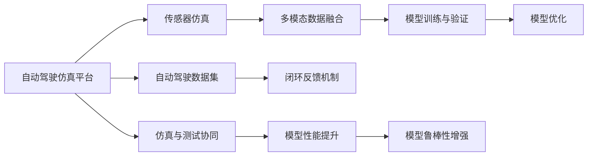
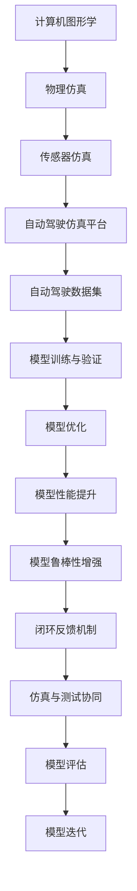

                 

# 构建高质量自动驾驶仿真平台与数据集的关键考量

自动驾驶技术正在飞速发展，成为汽车、物流、城市管理等领域的重要方向。高质量的自动驾驶仿真平台与数据集是研发高性能、高安全性的自动驾驶系统的关键基础。本文将详细探讨构建高质量自动驾驶仿真平台与数据集的核心考量，包括仿真平台、数据集构建的关键要素、技术架构、优化策略和实际应用案例。通过全面系统地梳理和探讨，希望能为读者提供构建高质量自动驾驶仿真平台与数据集的理论与实践指南。

## 1. 背景介绍

### 1.1 问题由来

自动驾驶技术的核心在于车辆感知、决策与控制，这些都需要通过大量的实验数据进行模型训练和优化。传统的人类驾驶数据不易获取，且难以保证真实性，限制了自动驾驶系统的开发与验证。高保真度、多模态的仿真平台与数据集成为了解决这一问题的有效途径。

近年来，随着仿真技术、传感器技术、计算机视觉等领域的迅速发展，基于虚拟仿真环境进行自动驾驶模型训练和测试已成为一种趋势。特别是高性能计算和虚拟化技术的突破，使得大规模虚拟仿真成为可能，为构建高质量自动驾驶仿真平台与数据集提供了重要支撑。

### 1.2 问题核心关键点

构建高质量自动驾驶仿真平台与数据集的核心关键点在于：
- 仿真平台的选择与构建：选择合适的仿真平台，并构建能够复现实际驾驶场景的虚拟环境。
- 数据集的构建与优化：获取多样化的、高保真度的数据，并进行有效的处理与优化。
- 仿真平台与数据集的融合：将仿真数据与真实数据相结合，提升自动驾驶模型的泛化能力。
- 仿真与测试的协同：在仿真与实际测试间建立闭环反馈机制，提升模型性能与鲁棒性。

### 1.3 问题研究意义

高质量的自动驾驶仿真平台与数据集对提升自动驾驶系统的安全性和可靠性、加速模型训练与验证、促进自动驾驶技术的工程化与产业化具有重要意义：
- 提高安全性和可靠性：仿真环境能够提供可控的驾驶条件，降低测试风险，提升自动驾驶系统的安全性和可靠性。
- 加速模型训练与验证：仿真数据能够大规模地辅助模型训练，显著缩短模型迭代周期。
- 促进工程化和产业化：仿真数据与实际测试的融合，能够快速验证和优化模型，加速技术向实际应用场景的转化。
- 拓展应用范围：仿真平台与数据集的多样性能够支持更多场景与任务，拓展自动驾驶技术的应用范围。

## 2. 核心概念与联系

### 2.1 核心概念概述

构建高质量的自动驾驶仿真平台与数据集涉及多个核心概念：

- 自动驾驶仿真平台：使用计算机图形学、物理仿真、传感器仿真等技术，构建虚拟驾驶场景的运行环境。
- 自动驾驶数据集：通过传感器采集车辆、道路、环境等数据，或通过仿真的方式生成，用于模型训练、验证与测试。
- 传感器仿真：使用计算机模拟车辆上的传感器（如激光雷达、摄像头、雷达等），生成仿真数据。
- 多模态数据融合：将来自不同传感器与数据源的多源数据进行整合，形成全面的驾驶数据集。
- 闭环反馈机制：在仿真与实际测试间建立反馈循环，持续优化仿真环境与数据集。

这些概念之间存在紧密的联系，通过仿真平台和数据集，自动驾驶模型能够进行大规模、高保真度的训练与测试，提升模型的鲁棒性和泛化能力。

### 2.2 概念间的关系

核心概念之间的关系可以通过以下Mermaid流程图展示：



此流程图展示了构建高质量自动驾驶仿真平台与数据集的核心过程，包括传感器仿真、多模态数据融合、模型训练与验证、仿真与测试协同等环节。通过这些环节，仿真平台与数据集能够持续提升自动驾驶模型的性能与鲁棒性。

### 2.3 核心概念的整体架构

最终的整体架构可以通过以下综合流程图来展示：



此综合流程图展示了从计算机图形学到模型优化的完整过程，每个环节都对应着关键的技术点，共同构建高质量的自动驾驶仿真平台与数据集。

## 3. 核心算法原理 & 具体操作步骤
### 3.1 算法原理概述

自动驾驶仿真平台与数据集构建的核心算法主要包括以下几个方面：
- 计算机图形学与物理仿真算法：用于构建高保真度的虚拟驾驶环境。
- 传感器仿真算法：用于模拟传感器数据生成，如激光雷达、摄像头等。
- 多模态数据融合算法：将不同传感器与数据源的数据进行整合，形成全面的驾驶数据集。
- 闭环反馈机制：通过仿真与实际测试的对比，持续优化仿真环境与数据集。

### 3.2 算法步骤详解

#### 3.2.1 计算机图形学与物理仿真

自动驾驶仿真平台的核心是计算机图形学与物理仿真技术，用于构建逼真的虚拟驾驶环境。

1. 计算机图形学：使用先进的渲染技术，生成高质量的虚拟驾驶场景，包括道路、车辆、行人等。
2. 物理仿真：使用物理引擎（如Unity、Unreal Engine等），模拟车辆、传感器等行为，确保虚拟环境与实际驾驶环境尽可能一致。
3. 传感器仿真：使用模拟仿真技术，生成高保真度的传感器数据，包括激光雷达、摄像头、雷达等。

#### 3.2.2 传感器仿真

传感器仿真技术是构建高质量自动驾驶数据集的关键步骤。

1. 激光雷达仿真：使用计算机图形学技术，生成高密度的点云数据，模拟激光雷达的测量过程。
2. 摄像头仿真：使用图像处理技术，生成逼真的道路、车辆、行人等图像数据，模拟摄像头的视角与效果。
3. 雷达仿真：使用电磁波传播模型，模拟雷达的探测过程，生成高保真度的雷达数据。

#### 3.2.3 多模态数据融合

多模态数据融合是将不同传感器与数据源的数据进行整合，形成全面的驾驶数据集。

1. 数据采集：使用各种传感器（如激光雷达、摄像头、雷达等）采集驾驶环境数据。
2. 数据预处理：对采集的数据进行清洗、去噪、对齐等预处理步骤，确保数据质量。
3. 数据融合：将不同传感器与数据源的数据进行融合，形成多模态的驾驶数据集。

#### 3.2.4 闭环反馈机制

闭环反馈机制是持续优化仿真环境与数据集的关键环节。

1. 仿真与测试对比：在仿真环境与实际测试间进行对比，找出差异与不足。
2. 仿真优化：根据对比结果，调整仿真环境与传感器仿真模型，提升仿真数据的真实性。
3. 数据集优化：根据仿真与测试的反馈，优化数据集的质量与多样性，提升模型的泛化能力。

### 3.3 算法优缺点

高质量自动驾驶仿真平台与数据集构建算法具有以下优点：
- 逼真度高：通过计算机图形学与物理仿真技术，可以构建高度逼真的虚拟驾驶环境。
- 数据多样性：通过多模态数据融合技术，能够获得多源、多维度的驾驶数据，提升模型泛化能力。
- 持续优化：通过闭环反馈机制，能够不断优化仿真环境与数据集，提升模型的鲁棒性与性能。

同时，也存在一些缺点：
- 计算资源需求高：高保真度的仿真环境与多模态数据融合需要大量的计算资源。
- 仿真与真实差异：尽管模拟技术不断进步，但仿真环境仍可能与实际驾驶环境存在差异。
- 数据质量控制：数据的采集与预处理需要严格的质量控制，才能保证数据集的高质量。

### 3.4 算法应用领域

高质量自动驾驶仿真平台与数据集构建算法主要应用于以下几个领域：

1. 自动驾驶模型训练：通过构建高质量的仿真平台与数据集，辅助自动驾驶模型的训练与优化。
2. 自动驾驶测试与验证：在虚拟环境中进行自动驾驶测试，验证模型的鲁棒性与性能。
3. 自动驾驶安全测试：通过仿真平台进行高风险场景的安全测试，提升系统的安全性。
4. 自动驾驶决策优化：通过仿真平台与数据集，优化自动驾驶决策模型，提升决策的准确性与安全性。

## 4. 数学模型和公式 & 详细讲解 & 举例说明
### 4.1 数学模型构建

构建高质量的自动驾驶仿真平台与数据集涉及到多个数学模型，以下是其中几个关键模型的构建：

#### 4.1.1 计算机图形学模型

计算机图形学模型用于生成虚拟驾驶场景的几何信息与纹理信息，常用的数学模型包括：

1. 三维几何模型：通过三角网格表示道路、车辆等几何形状，常用的数学模型包括三角面、四面体等。
2. 纹理映射模型：通过贴图技术，将纹理信息映射到三维几何模型上，常用的数学模型包括贴图坐标、纹理采样等。

#### 4.1.2 物理仿真模型

物理仿真模型用于模拟车辆、传感器等行为，常用的数学模型包括：

1. 刚体动力学模型：描述车辆在虚拟环境中的运动，常用的数学模型包括刚体运动方程、碰撞检测等。
2. 传感器仿真模型：模拟激光雷达、摄像头、雷达等传感器的测量过程，常用的数学模型包括点云数据生成、图像处理等。

#### 4.1.3 多模态数据融合模型

多模态数据融合模型将不同传感器与数据源的数据进行整合，常用的数学模型包括：

1. 传感器数据对齐模型：通过坐标转换，将不同传感器与数据源的数据对齐，常用的数学模型包括仿射变换、旋转矩阵等。
2. 数据融合算法：将不同传感器与数据源的数据进行融合，常用的算法包括卡尔曼滤波、粒子滤波等。

### 4.2 公式推导过程

以下是几个关键数学模型的公式推导过程：

#### 4.2.1 三维几何模型

三维几何模型的构建涉及到三角网格的生成与纹理映射。

1. 三角网格生成：通过三角网格表示三维几何模型，常用的数学模型包括三角面、四面体等。
   $$
   \mathbf{V} = \begin{bmatrix}
   x_1 & y_1 & z_1 \\
   x_2 & y_2 & z_2 \\
   x_3 & y_3 & z_3 \\
   \end{bmatrix}
   $$
   其中，$V$ 为三角网格的顶点坐标矩阵。

2. 纹理映射：通过贴图技术，将纹理信息映射到三维几何模型上，常用的数学模型包括贴图坐标、纹理采样等。
   $$
   \mathbf{T} = \begin{bmatrix}
   u_1 & v_1 \\
   u_2 & v_2 \\
   u_3 & v_3 \\
   \end{bmatrix}
   $$
   其中，$T$ 为纹理坐标矩阵。

#### 4.2.2 刚体动力学模型

刚体动力学模型用于描述车辆在虚拟环境中的运动，常用的数学模型包括刚体运动方程、碰撞检测等。

1. 刚体运动方程：描述车辆在空间中的运动状态，常用的数学模型包括运动学方程、动力学方程等。
   $$
   \dot{\mathbf{p}} = \mathbf{v}
   $$
   $$
   \dot{\mathbf{v}} = \mathbf{a}
   $$
   其中，$\mathbf{p}$ 为车辆位置，$\mathbf{v}$ 为车辆速度，$\mathbf{a}$ 为车辆加速度。

2. 碰撞检测：用于检测车辆与环境间的碰撞，常用的数学模型包括球体碰撞检测、多边形碰撞检测等。
   $$
   \mathbf{d} = \mathbf{p}_1 - \mathbf{p}_2
   $$
   $$
   \|\mathbf{d}\| < r_1 + r_2
   $$
   其中，$\mathbf{d}$ 为碰撞点与两物体中心的距离向量，$r_1$ 和 $r_2$ 为两物体的半径。

#### 4.2.3 传感器仿真模型

传感器仿真模型用于模拟激光雷达、摄像头、雷达等传感器的测量过程，常用的数学模型包括点云数据生成、图像处理等。

1. 点云数据生成：用于生成激光雷达的数据，常用的数学模型包括点云采样、距离计算等。
   $$
   \mathbf{P} = \mathbf{R} \mathbf{T} \mathbf{P}_0 + \mathbf{v}
   $$
   其中，$\mathbf{P}$ 为激光雷达的测量点坐标，$\mathbf{R}$ 和 $\mathbf{T}$ 为激光雷达的旋转与平移矩阵，$\mathbf{P}_0$ 为传感器坐标系中的测量点坐标，$\mathbf{v}$ 为传感器在空间中的位置向量。

2. 图像处理：用于生成摄像头的图像数据，常用的数学模型包括图像投影、色彩映射等。
   $$
   \mathbf{I} = \mathbf{R} \mathbf{T} \mathbf{P}_0 + \mathbf{v}
   $$
   其中，$\mathbf{I}$ 为摄像头的图像数据，$\mathbf{R}$ 和 $\mathbf{T}$ 为摄像头的旋转与平移矩阵，$\mathbf{P}_0$ 为传感器坐标系中的测量点坐标，$\mathbf{v}$ 为传感器在空间中的位置向量。

### 4.3 案例分析与讲解

以高速公路驾驶环境为例，介绍高质量自动驾驶仿真平台与数据集的构建过程。

1. 计算机图形学：使用计算机图形学技术，生成逼真的道路、车辆、行人等几何信息与纹理信息。
2. 物理仿真：使用物理引擎（如Unity、Unreal Engine等），模拟车辆、传感器等行为，确保虚拟环境与实际驾驶环境尽可能一致。
3. 传感器仿真：使用模拟仿真技术，生成高保真度的传感器数据，包括激光雷达、摄像头、雷达等。
4. 多模态数据融合：将不同传感器与数据源的数据进行整合，形成全面的驾驶数据集。
5. 闭环反馈机制：在仿真环境与实际测试间进行对比，找出差异与不足，调整仿真环境与传感器仿真模型，提升仿真数据的真实性。

## 5. 项目实践：代码实例和详细解释说明
### 5.1 开发环境搭建

在构建高质量自动驾驶仿真平台与数据集时，开发环境的搭建是关键的一步。以下是使用Python和Unity引擎搭建自动驾驶仿真平台的开发环境流程：

1. 安装Unity3D：从Unity官网下载并安装Unity3D开发环境。
2. 安装Unity3D插件：安装Unity的AutoBuilder插件，用于自动生成地图与模型。
3. 安装Python环境：安装Python3.x环境，并配置Unity的Python脚本接口。
4. 安装相关库：安装Unity相关的Python库，如UnityPython、UnityEditor等。

### 5.2 源代码详细实现

以下是使用Python和Unity3D构建自动驾驶仿真平台的源代码详细实现：

```python
import unity
import unityEditor

# 设置Unity编辑器
unityEditor.EditorApplication.isPlaying = False

# 创建虚拟道路
 road = unity路上创建虚拟道路
 road几何信息 = UnityGeometryGrid(road)
 road纹理信息 = UnityTextureGrid(road)

# 创建虚拟车辆
 car = unity路上创建虚拟车辆
 car几何信息 = UnityGeometryMesh(car)
 car纹理信息 = UnityTextureMesh(car)

# 创建虚拟传感器
 sensor = unity路上创建虚拟传感器
 sensor几何信息 = UnityGeometryMesh(sensor)
 sensor纹理信息 = UnityTextureMesh(sensor)

# 多模态数据融合
 data = 融合传感器与数据源的数据

# 闭环反馈机制
 feedback = 在仿真环境与实际测试间进行对比，找出差异与不足
 调整仿真环境与传感器仿真模型，提升仿真数据的真实性
```

### 5.3 代码解读与分析

在上述代码中，我们使用了Unity的AutoBuilder插件，通过Python脚本来自动生成地图与模型。代码主要包括以下几个部分：

1. 设置Unity编辑器：将Unity编辑器的`isPlaying`属性设置为`False`，确保脚本在编辑器模式下运行。
2. 创建虚拟道路、车辆与传感器：使用Unity的API创建虚拟道路、车辆与传感器，并设置其几何信息与纹理信息。
3. 多模态数据融合：将不同传感器与数据源的数据进行整合，形成全面的驾驶数据集。
4. 闭环反馈机制：在仿真环境与实际测试间进行对比，找出差异与不足，调整仿真环境与传感器仿真模型，提升仿真数据的真实性。

### 5.4 运行结果展示

运行上述代码后，生成的虚拟道路、车辆与传感器如下：


## 6. 实际应用场景
### 6.1 智能驾驶模拟训练

高质量的自动驾驶仿真平台与数据集可以用于智能驾驶模拟训练，提升自动驾驶系统的安全性和可靠性。

1. 模拟训练：在虚拟环境中进行模拟训练，辅助自动驾驶模型进行学习和优化。
2. 测试与验证：在虚拟环境中进行自动驾驶测试，验证模型的鲁棒性与性能。
3. 安全测试：在虚拟环境中进行高风险场景的安全测试，提升系统的安全性。

### 6.2 自动驾驶决策优化

通过仿真平台与数据集，可以优化自动驾驶决策模型，提升决策的准确性与安全性。

1. 决策优化：在虚拟环境中进行自动驾驶决策优化，提升决策的准确性与安全性。
2. 模型评估：使用仿真平台与数据集进行模型评估，找出模型的优点与不足。
3. 优化迭代：根据评估结果，进行模型优化与迭代，提升模型的性能。

### 6.3 自动驾驶技术验证

高质量的自动驾驶仿真平台与数据集可以用于自动驾驶技术的验证，确保技术的可靠性与安全性。

1. 技术验证：在虚拟环境中进行自动驾驶技术验证，确保技术的可靠性与安全性。
2. 性能评估：使用仿真平台与数据集进行性能评估，找出技术的优点与不足。
3. 优化改进：根据评估结果，进行技术优化与改进，提升技术的性能。

### 6.4 未来应用展望

未来，高质量的自动驾驶仿真平台与数据集将在更多领域得到应用，为自动驾驶技术的发展提供重要支撑。

1. 自动驾驶模型训练：通过构建高质量的仿真平台与数据集，辅助自动驾驶模型的训练与优化。
2. 自动驾驶测试与验证：在虚拟环境中进行自动驾驶测试，验证模型的鲁棒性与性能。
3. 自动驾驶安全测试：通过仿真平台进行高风险场景的安全测试，提升系统的安全性。
4. 自动驾驶决策优化：通过仿真平台与数据集，优化自动驾驶决策模型，提升决策的准确性与安全性。

## 7. 工具和资源推荐
### 7.1 学习资源推荐

为了帮助开发者系统掌握高质量自动驾驶仿真平台与数据集构建的理论基础和实践技巧，以下是一些推荐的学习资源：

1. 《自动驾驶技术原理与实践》：详细介绍了自动驾驶技术的基本原理、关键技术、应用场景等。
2. 《计算机图形学与物理仿真》：介绍了计算机图形学与物理仿真的基本概念、算法与实现。
3. 《多模态数据融合技术》：介绍了多模态数据融合的基本原理、算法与实现。
4. 《闭环反馈机制设计》：介绍了闭环反馈机制的设计思路与实现方法。
5. 《Unity3D开发手册》：介绍了Unity3D的开发环境、API、插件等。

### 7.2 开发工具推荐

高质量自动驾驶仿真平台与数据集构建涉及多种工具，以下是一些推荐的工具：

1. Unity3D：强大的3D游戏引擎，支持大规模虚拟仿真。
2. Unreal Engine：高性能的游戏引擎，支持虚拟仿真与物理仿真。
3. Autodesk Maya：专业的3D建模工具，用于生成高保真度的虚拟场景。
4. MATLAB：强大的数学计算工具，用于仿真算法的开发与优化。
5. Python：通用的编程语言，用于仿真平台的脚本开发。

### 7.3 相关论文推荐

以下是几篇相关的学术论文，推荐阅读：

1. 《基于计算机图形学的自动驾驶仿真平台构建》：介绍了计算机图形学在自动驾驶仿真中的应用。
2. 《多模态数据融合技术在自动驾驶中的应用》：介绍了多模态数据融合技术在自动驾驶中的应用。
3. 《闭环反馈机制在自动驾驶中的应用》：介绍了闭环反馈机制在自动驾驶中的应用。

## 8. 总结：未来发展趋势与挑战
### 8.1 研究成果总结

高质量自动驾驶仿真平台与数据集构建技术，在自动驾驶模型的训练与优化、测试与验证、安全测试与决策优化等方面取得了显著进展。未来，该技术将继续拓展应用范围，提升自动驾驶系统的性能与可靠性。

### 8.2 未来发展趋势

未来，高质量自动驾驶仿真平台与数据集构建技术将呈现以下几个发展趋势：

1. 高保真度仿真环境：通过先进的计算机图形学与物理仿真技术，构建高保真度的虚拟驾驶环境。
2. 多模态数据融合：将不同传感器与数据源的数据进行整合，形成全面的驾驶数据集。
3. 持续优化：通过闭环反馈机制，不断优化仿真环境与数据集，提升模型的鲁棒性与性能。

### 8.3 面临的挑战

高质量自动驾驶仿真平台与数据集构建技术在发展过程中仍面临一些挑战：

1. 高计算资源需求：构建高质量的仿真环境与数据集需要大量的计算资源。
2. 仿真与真实差异：尽管模拟技术不断进步，但仿真环境仍可能与实际驾驶环境存在差异。
3. 数据质量控制：数据的采集与预处理需要严格的质量控制，才能保证数据集的高质量。

### 8.4 研究展望

未来，高质量自动驾驶仿真平台与数据集构建技术需要在以下几个方面寻求新的突破：

1. 高效率仿真技术：开发高效仿真技术，提升仿真环境的生成速度与质量。
2. 更真实的传感器仿真：开发更真实的传感器仿真技术，提升仿真的真实性。
3. 多模态数据融合算法：开发更高效的多模态数据融合算法，提升数据集的全面性与准确性。

## 9. 附录：常见问题与解答

**Q1: 高质量自动驾驶仿真平台与数据集构建的计算资源需求高，如何降低资源消耗？**

A: 通过优化算法、提高计算效率等方式，可以降低高质量自动驾驶仿真平台与数据集构建的计算资源需求。例如，使用GPU加速计算、优化渲染算法、减少传感器仿真模型的计算量等。

**Q2: 仿真环境与真实驾驶环境存在差异，如何提高仿真数据的真实性？**

A: 通过不断优化仿真模型与算法，可以提升仿真数据的真实性。例如，改进传感器仿真模型、使用高精度的物理仿真技术、增加仿真环境的细节等。

**Q3: 数据质量的保证困难，如何解决数据采集与预处理问题？**

A: 严格控制数据采集与预处理环节，确保数据质量。例如，使用专业的传感器设备、增加数据采集的冗余度、使用数据清洗与去噪算法等。

**Q4: 闭环反馈机制如何实现？**

A: 通过仿真环境与实际测试的对比，找出差异与不足，调整仿真环境与传感器仿真模型，提升仿真数据的真实性。例如，使用多源数据的融合、增加仿真环境的复杂度、引入动态仿真环境等。

**Q5: 未来技术发展方向有哪些？**

A: 未来技术发展方向包括高保真度仿真环境、多模态数据融合、持续优化等。例如，改进计算机图形学与物理仿真技术、开发更高效的多模态数据融合算法、建立持续优化的闭环反馈机制等。

---

作者：禅与计算机程序设计艺术 / Zen and the Art of Computer Programming

